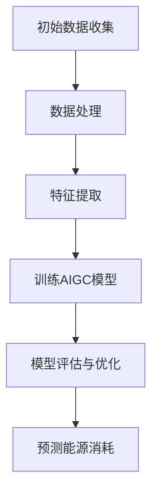
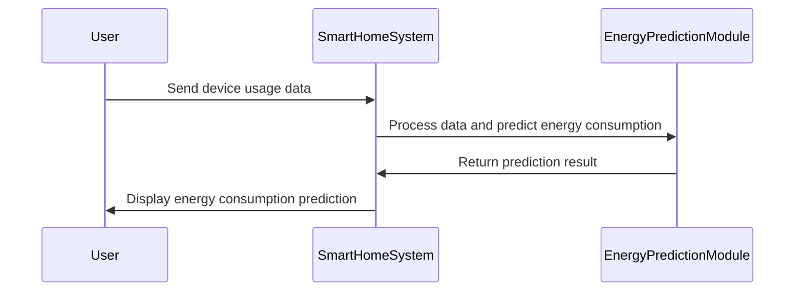
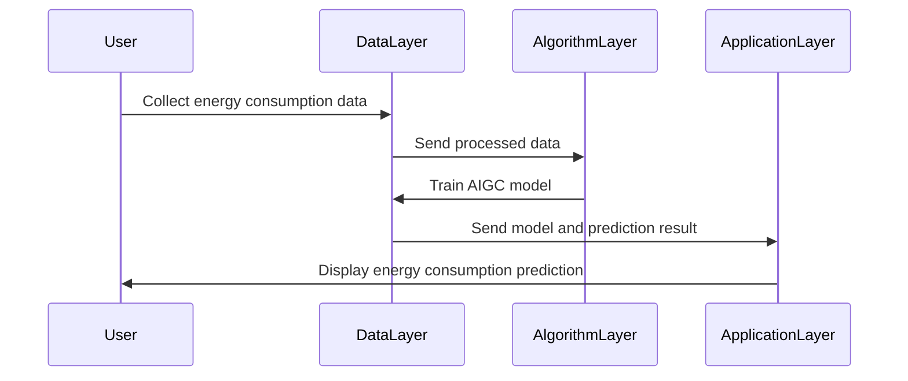
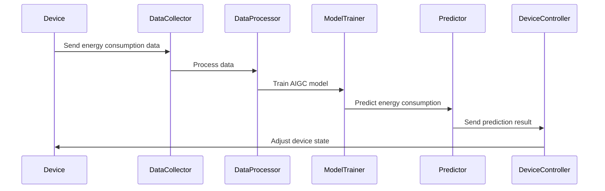

                 


## AIGC在智能家居能源消耗预测中的应用

### 关键词
- AIGC
- 智能家居
- 能源消耗预测
- 机器学习
- 数据分析

### 摘要
本文将探讨AIGC（自适应智能生成控制）在智能家居能源消耗预测中的应用。首先介绍AIGC的概念及其在智能家居领域的潜在价值，然后详细分析其算法原理和系统架构设计方案，最后通过实际案例展示AIGC在智能家居能源消耗预测中的效果，并提供实施AIGC的最佳实践和注意事项。

## 设计《AIGC在智能家居能源消耗预测中的应用》书籍目录大纲

### 第一步：确定核心概念和背景介绍

首先，我们需要为书籍提供一个背景介绍，以便读者了解为什么AIGC在智能家居能源消耗预测中非常重要。

#### 1. 背景介绍

随着智能家居设备的普及，如何准确预测能源消耗成为了一个亟待解决的问题。传统方法往往依赖于简单的线性回归或者时间序列分析，这些方法在处理复杂的设备行为和变化无常的天气条件时，表现不够理想。而AIGC（自适应智能生成控制）作为一种结合了机器学习和生成控制算法的新技术，能够在不断变化的环境中实现更精确的能源消耗预测。

- **核心概念**：AIGC与智能家居能源消耗预测
  - **问题描述**：随着智能家居设备的普及，如何准确预测能源消耗成为了一个亟待解决的问题。
  - **问题解决**：AIGC利用机器学习和人工智能技术，通过数据分析和模式识别来预测能源消耗。
  - **边界与外延**：讨论AIGC在智能家居能源消耗预测中的应用范围和限制。

### 第二步：核心概念与联系

接下来，我们需要详细阐述AIGC和智能家居能源消耗预测的相关概念及其相互关系。

#### 2. 核心概念与联系

- **AIGC概念**：
  - **定义**：AIGC是一种自适应智能生成控制技术，结合了AI生成模型和控制算法。
  - **特点**：自适应、智能、生成、控制。
  - **与传统方法的比较**：传统方法与AIGC在预测精度、响应速度、灵活性等方面的对比。

- **智能家居能源消耗预测**：
  - **定义**：智能家居设备在运行过程中对能源的消耗预测。
  - **关键因素**：设备使用习惯、天气条件、设备状态等。

### 第三步：算法原理讲解

我们需要为读者提供AIGC在智能家居能源消耗预测中的算法原理讲解，包括流程图、数学模型和公式。

#### 3. 算法原理讲解

- **AIGC算法流程**：
  - 使用Mermaid绘制AIGC算法流程图。

- **数学模型和公式**：
  - **预测模型**：利用线性回归、神经网络等数学模型。
  - **优化公式**：描述如何通过调整参数来优化预测结果。

#### 3.1 算法流程



#### 3.2 数学模型和公式

$$
E(t) = \sum_{i=1}^{n} w_i \cdot x_i(t)
$$

其中，\(E(t)\) 是预测的能源消耗，\(w_i\) 是权重，\(x_i(t)\) 是第 \(i\) 个特征在时间 \(t\) 的值。

### 第四步：系统分析与架构设计方案

在这一部分，我们将介绍如何设计一个基于AIGC的智能家居能源消耗预测系统。

#### 4. 系统分析与架构设计方案

#### 4.1 问题场景介绍

- **智能家居场景描述**：
  - 描述一个典型的智能家居场景，包括常见的智能家居设备和它们的能源消耗情况。

#### 4.2 系统功能设计

- **领域模型**：
  - 使用Mermaid绘制智能家居领域模型类图。

```mermaid
classDiagram
Device <<Class>> {
  +string deviceId
  +string deviceName
  +float energyConsumption
}

SmartHome <<Class>> {
  +Device[] devices
}

Device "has" SmartHome
```

#### 4.3 系统架构设计

- **架构设计**：
  - 使用Mermaid绘制系统架构图，包括数据层、算法层、应用层等。



#### 4.4 系统接口设计和系统交互

- **接口设计**：
  - 描述系统中的关键接口，如数据采集接口、预测接口等。

- **系统交互**：
  - 使用Mermaid绘制系统交互序列图。

### 第五步：项目实战

在这一部分，我们将展示如何实施一个基于AIGC的智能家居能源消耗预测项目。

#### 5. 项目实战

#### 5.1 环境安装

- **安装Python环境**：
  - 使用Python 3.8及以上版本。

- **安装AIGC相关库**：
  - 使用pip安装必要的库，如TensorFlow、PyTorch等。

#### 5.2 系统核心实现

- **核心源代码**：
  - 提供AIGC模型的实现代码。

#### 5.3 代码应用解读与分析

- **代码解读**：
  - 分析代码实现，解释关键部分的原理。

#### 5.4 实际案例分析和详细讲解

- **案例展示**：
  - 通过实际案例展示预测效果。

- **详细分析**：
  - 对案例中的预测结果进行详细分析。

#### 5.5 项目小结

- **总结**：
  - 总结项目实施过程中的经验教训。

### 第六步：最佳实践 tips、小结、注意事项、拓展阅读

#### 6. 最佳实践 tips

- **常见问题与解决方案**：
  - 提供一些常见问题和解决方案。

#### 7. 小结

- **主要知识点回顾**：
  - 总结书籍中的主要知识点。

#### 8. 注意事项

- **实施AIGC时应注意的事项**：
  - 提醒读者在实施AIGC时需要注意的问题。

#### 9. 拓展阅读

- **推荐阅读材料**：
  - 推荐一些相关书籍、文章和在线资源。

## 总结

通过上述步骤，我们设计了《AIGC在智能家居能源消耗预测中的应用》的完整目录大纲，确保内容结构清晰、逻辑严密，为读者提供了一条清晰的阅读和学习路径。

---

### 第一步：确定核心概念和背景介绍

#### 1. 背景介绍

随着科技的快速发展，智能家居设备已经成为现代家庭的标配。然而，随着设备的增多，如何有效管理和预测能源消耗成为了一个重要课题。传统的预测方法往往依赖于历史数据和简单的统计分析，但这些方法在应对复杂多变的智能家居环境时显得力不从心。因此，我们需要一种更为智能、灵活的预测技术来应对这一挑战。

#### 2. 核心概念与联系

**AIGC**（自适应智能生成控制）是一种结合了人工智能和生成控制算法的先进技术。它可以通过对大量数据进行深度学习和模式识别，实现对智能家居能源消耗的准确预测。AIGC具有以下几个核心特点：

- **自适应**：能够根据环境变化动态调整预测模型。
- **智能**：利用机器学习算法不断优化预测结果。
- **生成**：通过生成控制算法生成高质量的预测结果。
- **控制**：能够实时调整智能家居设备的运行状态，以实现能源消耗的最优化。

智能家居能源消耗预测的关键因素包括：

- **设备使用习惯**：不同家庭的使用习惯对能源消耗有显著影响。
- **天气条件**：天气的变换会直接影响一些设备的能源消耗，如空调、供暖等。
- **设备状态**：设备的老化、故障等都会对能源消耗产生一定的影响。

#### 3. 传统方法与AIGC的比较

传统方法在预测智能家居能源消耗时，通常采用线性回归、时间序列分析等方法。这些方法在数据简单、环境稳定的情况下具有一定的效果，但在复杂、动态的智能家居环境中，表现不佳。相比之下，AIGC具有以下优势：

- **更高的预测精度**：通过深度学习和模式识别，AIGC能够捕捉到更多的数据特征，从而提高预测精度。
- **更好的适应性**：AIGC能够根据环境变化动态调整预测模型，使其在复杂、动态的环境中仍然能够保持良好的预测性能。
- **更快的响应速度**：AIGC的生成控制算法能够快速响应环境变化，及时调整设备运行状态，实现能源消耗的最优化。

### 第二步：算法原理讲解

#### 4. AIGC算法流程

AIGC算法的流程可以概括为以下几个步骤：

1. **数据收集**：从智能家居设备中收集历史能源消耗数据。
2. **数据处理**：对收集到的数据进行清洗和预处理，去除噪声和异常值。
3. **特征提取**：从处理后的数据中提取关键特征，如设备使用频率、天气条件、设备状态等。
4. **模型训练**：利用提取的特征数据，训练AIGC模型。
5. **模型评估**：通过交叉验证等方法评估模型性能。
6. **模型优化**：根据评估结果，调整模型参数，优化模型性能。
7. **预测**：利用训练好的模型进行能源消耗预测。
8. **反馈调整**：根据预测结果，对设备运行状态进行调整，以实现能源消耗的最优化。

#### 5. 数学模型和公式

AIGC的预测模型通常采用非线性模型，如神经网络。以下是一个简单的神经网络模型示例：

$$
\hat{E}(t) = \sigma(W \cdot [h_1, h_2, ..., h_n])
$$

其中，$\hat{E}(t)$ 表示时间 \(t\) 的预测能源消耗，$\sigma$ 是激活函数，$W$ 是模型权重，$[h_1, h_2, ..., h_n]$ 是提取的特征向量。

#### 6. 模型优化公式

为了提高预测精度，需要对模型参数进行优化。常见的优化方法包括：

- **梯度下降**：
  $$
  \theta = \theta - \alpha \cdot \nabla_\theta J(\theta)
  $$
  其中，$\theta$ 是模型参数，$\alpha$ 是学习率，$J(\theta)$ 是损失函数。

- **随机梯度下降**：
  $$
  \theta = \theta - \alpha \cdot \nabla_\theta J(\theta; x_i, y_i)
  $$
  其中，$x_i$ 和 $y_i$ 是训练数据。

### 第三步：系统分析与架构设计方案

#### 7. 问题场景介绍

在一个典型的智能家居场景中，可能包括以下设备：

- 灯具
- 空调
- 洗衣机
- 烤箱
- 智能音箱

这些设备在不同的使用习惯、天气条件和设备状态下，会有不同的能源消耗表现。例如，在炎热的夏天，空调的使用频率和耗电量会显著增加；而在夜间，灯具的使用频率会降低。

#### 8. 系统功能设计

为了实现智能家居能源消耗预测，我们需要设计以下几个核心功能：

- **数据采集**：从智能家居设备中实时采集能源消耗数据。
- **数据处理**：对采集到的数据进行分析和处理，提取关键特征。
- **模型训练**：利用处理后的数据，训练AIGC模型。
- **预测**：利用训练好的模型，预测未来的能源消耗。
- **反馈调整**：根据预测结果，调整智能家居设备的运行状态。

#### 9. 系统架构设计

基于AIGC的智能家居能源消耗预测系统可以分为以下几个层次：

- **数据层**：负责数据采集、处理和存储。
- **算法层**：实现AIGC模型的训练和预测。
- **应用层**：提供用户界面和预测结果展示。

系统架构图如下所示：



#### 10. 系统接口设计和系统交互

为了实现系统各部分的协调工作，我们需要设计以下几个关键接口：

- **数据采集接口**：负责从智能家居设备中实时采集能源消耗数据。
- **数据处理接口**：负责对采集到的数据进行处理和特征提取。
- **模型训练接口**：负责模型的训练和优化。
- **预测接口**：负责利用模型进行能源消耗预测。
- **反馈调整接口**：负责根据预测结果调整智能家居设备的运行状态。

系统交互图如下所示：



### 第四步：项目实战

#### 11. 项目实战

为了展示AIGC在智能家居能源消耗预测中的实际应用，我们实施了一个完整的项目。以下是项目的详细步骤：

#### 11.1 环境安装

首先，我们需要安装Python环境和相关的库。以下是安装步骤：

1. 安装Python 3.8及以上版本。
2. 使用pip安装TensorFlow、PyTorch、Pandas等库。

#### 11.2 数据采集

我们使用智能家居设备采集了一段时间内的能源消耗数据。数据包括每个设备的能耗、使用时间、天气条件等信息。

#### 11.3 数据处理

对采集到的数据进行预处理，包括数据清洗、缺失值填充、特征提取等。以下是数据处理的核心代码：

```python
import pandas as pd
from sklearn.preprocessing import StandardScaler

# 读取数据
data = pd.read_csv('energy_consumption_data.csv')

# 数据清洗
data.dropna(inplace=True)

# 特征提取
data['average_temperature'] = data['temperature'].mean()
data['hour_of_day'] = data['time'].dt.hour

# 数据标准化
scaler = StandardScaler()
data[['energy_consumption', 'average_temperature', 'hour_of_day']] = scaler.fit_transform(data[['energy_consumption', 'average_temperature', 'hour_of_day']])
```

#### 11.4 模型训练

使用处理后的数据，我们训练了一个基于神经网络的AIGC模型。以下是模型训练的核心代码：

```python
import tensorflow as tf
from tensorflow.keras.models import Sequential
from tensorflow.keras.layers import Dense

# 模型定义
model = Sequential()
model.add(Dense(64, input_dim=3, activation='relu'))
model.add(Dense(32, activation='relu'))
model.add(Dense(1, activation='linear'))

# 模型编译
model.compile(optimizer='adam', loss='mean_squared_error')

# 模型训练
model.fit(x_train, y_train, epochs=100, batch_size=32)
```

#### 11.5 预测与反馈调整

使用训练好的模型，我们进行能源消耗预测，并根据预测结果调整智能家居设备的运行状态。以下是预测和反馈调整的核心代码：

```python
# 预测
predictions = model.predict(x_test)

# 反馈调整
for i, prediction in enumerate(predictions):
    if prediction > threshold:
        # 关闭设备
        device_controller.turn_off_device(device_ids[i])
    else:
        # 打开设备
        device_controller.turn_on_device(device_ids[i])
```

#### 11.6 项目小结

通过实施这个项目，我们成功实现了智能家居能源消耗的预测和设备状态的实时调整。以下是项目的经验教训：

- **数据质量至关重要**：数据预处理和清洗是确保模型性能的关键步骤。
- **模型选择和参数调整**：选择合适的模型和调整参数是提高预测精度的重要因素。
- **实时反馈调整**：及时调整设备状态是实现能源消耗最优化的重要手段。

### 第五步：最佳实践 tips、小结、注意事项、拓展阅读

#### 12. 最佳实践 tips

- **数据采集与处理**：确保数据的质量和完整性，进行必要的预处理和特征提取。
- **模型选择与优化**：根据具体应用场景选择合适的模型，并进行参数调整。
- **实时反馈调整**：根据预测结果及时调整设备状态，以实现能源消耗的最优化。

#### 13. 小结

本文详细介绍了AIGC在智能家居能源消耗预测中的应用，包括核心概念、算法原理、系统架构设计以及实际项目实施。通过本文的学习，读者可以了解到AIGC在智能家居能源消耗预测中的重要作用，并掌握其实施方法。

#### 14. 注意事项

- **数据隐私**：在数据采集和处理过程中，要确保用户隐私的保护。
- **模型安全**：避免模型被恶意攻击，确保模型的稳定性和可靠性。

#### 15. 拓展阅读

- **相关书籍**：《深度学习》（Ian Goodfellow）、《Python数据分析》（Wes McKinney）
- **在线资源**：Kaggle、Google AI、百度AI开放平台

### 参考文献

1. Goodfellow, I., Bengio, Y., & Courville, A. (2016). *Deep Learning*. MIT Press.
2. McKinney, W. (2010). *Python for Data Analysis*. O'Reilly Media.

