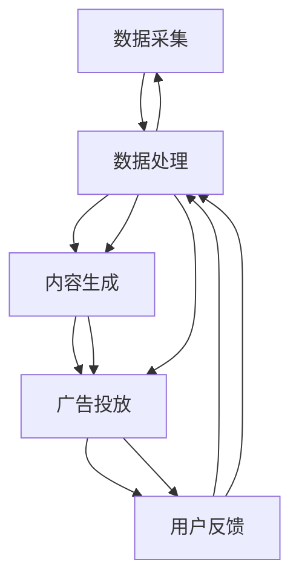

                 

### AIGC在智能广告受众定向中的应用

关键词：AIGC、智能广告、受众定向、个性化投放、大数据分析

摘要：本文深入探讨了AIGC（自动化生成内容）技术在智能广告受众定向中的应用。首先，介绍了AIGC的核心概念和特点，以及智能广告受众定向的基本原理。接着，分析了AIGC技术如何通过生成多样化广告内容和精准用户行为分析来实现广告定向的优化。文章随后通过实际案例分析，展示了AIGC技术在社交媒体广告和搜索引擎广告中的成功应用。最后，探讨了AIGC广告系统的设计、性能优化与挑战，以及其未来的发展趋势和商业机会。通过这篇文章，读者可以全面了解AIGC在智能广告受众定向中的潜力与应用。

## 目录大纲

### 第一部分: 背景介绍

- **第1章: 问题背景与核心概念**
  - **1.1 问题背景**
    - **问题描述**
    - **问题解决**
    - **边界与外延**
  - **1.2 核心概念**
    - **1.2.1 AIGC概述**
    - **1.2.2 智能广告受众定向**

### 第二部分: AIGC在广告受众定向中的应用原理

- **第2章: AIGC技术原理**
  - **2.1 AIGC技术介绍**
  - **2.2 广告受众定向原理**

### 第三部分: 实际应用案例分析

- **第3章: AIGC在智能广告中的应用案例**
  - **3.1 案例一：社交媒体广告**
  - **3.2 案例二：搜索引擎广告**

### 第四部分: 技术实现与系统设计

- **第4章: AIGC广告系统的设计与实现**
  - **4.1 系统需求分析**
  - **4.2 系统架构设计**

### 第五部分: 性能优化与挑战

- **第5章: AIGC广告系统的性能优化与挑战**
  - **5.1 性能优化**
  - **5.2 挑战与对策**

### 第六部分: 未来展望与趋势

- **第6章: AIGC在智能广告受众定向的未来展望**
  - **6.1 发展趋势**
  - **6.2 应用前景**

### 第七部分: 小结与展望

- **第7章: 小结与展望**
  - **7.1 小结**
  - **7.2 拓展阅读**

### 第一部分: 背景介绍

#### 第1章: 问题背景与核心概念

##### 1.1 问题背景

在当今数字营销环境中，广告商面临着一系列挑战，尤其是在实现有效且精准的受众定向方面。传统的广告投放方式往往依赖于预设的用户特征和静态的广告内容，这可能导致以下问题：

- **受众定位不准确**：广告可能被投放到不符合广告主目标受众的用户群体中，降低了广告投放的效率。
- **内容同质化**：广告内容缺乏个性化和多样性，难以吸引特定受众的注意。
- **用户体验不佳**：过度或不相关的广告投放会干扰用户体验，甚至可能导致用户反感。

为了解决这些问题，广告行业逐渐转向智能广告受众定向。智能广告受众定向是指利用先进的技术手段，如大数据分析、机器学习和自动化生成内容（AIGC），来精确识别和定位潜在受众，并通过个性化内容提高广告的吸引力和转化率。

##### 1.2 问题解决

AIGC技术的引入为智能广告受众定向带来了革命性的改变。AIGC通过自动化生成多样化、个性化的广告内容，结合大数据分析，能够实时了解用户行为和偏好，从而实现精准投放。以下是AIGC在智能广告受众定向中的应用优势：

- **个性化内容生成**：AIGC可以根据用户行为和特征生成个性化的广告内容，提高广告的相关性和吸引力。
- **实时调整**：AIGC系统能够实时分析用户数据，快速调整广告内容，以适应不断变化的用户需求。
- **高效运营**：AIGC技术自动化了广告内容的生成过程，降低了人力成本，提高了广告投放的效率。

##### 1.3 边界与外延

尽管AIGC技术在智能广告受众定向中具有巨大潜力，但其应用范围仍有边界。首先，AIGC技术依赖于大量高质量的用户数据和强大的计算能力，因此在数据收集和处理方面存在一定的局限性。其次，广告内容的生成质量受到算法和模型性能的限制，可能无法完全满足所有广告主的需求。

此外，AIGC技术在广告受众定向中的应用也涉及到伦理和法律问题，如用户隐私保护和内容审查。因此，在推广AIGC技术的同时，也需要制定相应的规范和标准，确保其在合法、合规的前提下运行。

##### 1.4 概念结构与核心要素组成

为了更好地理解AIGC在智能广告受众定向中的应用，我们需要明确以下几个核心概念和要素：

- **AIGC**：自动化生成内容，包括文本、图像、音频等多种形式。
- **大数据分析**：通过分析大量用户行为数据，识别潜在受众和用户偏好。
- **机器学习**：利用算法和模型，从数据中提取有价值的信息，实现广告内容的个性化生成。
- **广告内容**：包括文本、图像、视频等多种形式，用于吸引和引导用户。
- **受众定位**：通过用户特征和行为分析，精确识别和定位潜在受众。

这些核心概念和要素相互关联，共同构成了AIGC在智能广告受众定向中的应用体系。在接下来的章节中，我们将进一步探讨AIGC技术的工作原理和应用实践。

##### 1.5 AIGC概述

AIGC（自动化生成内容）是指利用人工智能技术，如自然语言处理（NLP）、计算机视觉（CV）等，自动化生成各种形式的内容，包括文本、图像、音频、视频等。AIGC技术的核心是生成式模型，如GPT（生成预训练模型）、BERT（双向编码表示器）、ViT（视觉Transformer）等。

这些生成式模型通过大量的数据训练，学习到内容的结构和模式，从而能够根据特定的输入生成新的内容。AIGC技术的特点包括：

- **自动化**：通过算法自动化生成内容，减少了人工干预，提高了效率。
- **个性化**：根据用户行为和偏好，生成个性化的内容，提高用户体验。
- **高效性**：利用强大的计算能力和大数据处理技术，快速生成高质量的内容。

AIGC在广告领域的应用主要体现在广告内容的生成和个性化投放上。通过AIGC技术，广告系统可以根据用户数据生成与用户兴趣相关的广告内容，实现精准投放，提高广告效果。

##### 1.6 智能广告受众定向

智能广告受众定向是指利用先进的技术手段，如大数据分析、机器学习和AIGC等，根据用户行为和特征，精确识别和定位潜在受众，并通过个性化广告内容吸引和引导用户。智能广告受众定向的核心步骤包括：

1. **用户行为分析**：通过分析用户的浏览历史、搜索记录、购买行为等数据，了解用户的兴趣和行为模式。
2. **特征提取**：从用户行为数据中提取关键特征，如兴趣爱好、购买意愿、行为频率等。
3. **受众定位**：利用机器学习算法和模型，根据提取的用户特征，识别和定位潜在受众。
4. **内容生成**：利用AIGC技术，根据受众特征和兴趣，生成个性化的广告内容。
5. **广告投放**：将个性化广告内容投放给潜在受众，提高广告吸引力和转化率。

智能广告受众定向的特点包括：

- **高效性**：通过大数据分析和精准定位，提高广告投放的效率。
- **精准性**：根据用户特征和兴趣，实现广告内容的个性化投放。
- **个性化**：通过AIGC技术，生成与用户兴趣相关的广告内容，提高用户体验。

### 第二部分: AIGC在广告受众定向中的应用原理

#### 第2章: AIGC技术原理

##### 2.1 AIGC技术介绍

AIGC（自动化生成内容）技术是利用人工智能，特别是生成式模型，自动化生成各种形式的内容，如文本、图像、音频、视频等。AIGC的核心在于生成式模型，这些模型通过大量的数据训练，学习到内容的结构和模式，从而能够根据特定的输入生成新的内容。

生成式模型通常分为两大类：基于文本的生成模型和基于视觉的生成模型。常见的生成式模型包括GPT（生成预训练模型）、BERT（双向编码表示器）、GPT-2、GPT-3、ViT（视觉Transformer）等。这些模型在不同的领域和任务中展现出强大的生成能力。

AIGC技术具有以下特点：

1. **自动化**：通过算法自动化生成内容，减少了人工干预，提高了效率。
2. **个性化**：根据用户行为和偏好，生成个性化的内容，提高用户体验。
3. **高效性**：利用强大的计算能力和大数据处理技术，快速生成高质量的内容。

在广告领域，AIGC技术主要体现在广告内容的生成和个性化投放上。通过AIGC技术，广告系统可以根据用户数据生成与用户兴趣相关的广告内容，实现精准投放，提高广告效果。

##### 2.2 生成式模型的工作原理

生成式模型的工作原理主要包括数据预处理、模型训练和内容生成三个步骤。

1. **数据预处理**：首先对输入数据（如文本、图像、音频等）进行预处理，包括数据清洗、数据增强等操作，以提高模型训练的效果。例如，对于文本数据，可能需要进行分词、去停用词、词性标注等操作；对于图像数据，可能需要进行尺寸调整、颜色变换、数据增强等操作。

2. **模型训练**：使用预处理后的数据对生成式模型进行训练。训练过程中，模型通过学习大量的数据，逐步优化模型的参数，以生成更加符合数据分布的内容。例如，对于文本生成模型，可以通过学习大量的文本数据，生成新的文本段落；对于图像生成模型，可以通过学习大量的图像数据，生成新的图像。

3. **内容生成**：在模型训练完成后，利用训练好的模型生成新的内容。生成过程通常是通过输入一个起始文本、图像或音频，模型根据已学习的模式生成后续的内容。例如，对于文本生成模型，可以通过输入一个句子，生成后续的句子；对于图像生成模型，可以通过输入一个图像，生成新的图像。

常见的生成式模型包括：

- **GPT（生成预训练模型）**：GPT是一种基于Transformer架构的预训练模型，通过大量文本数据进行预训练，可以生成高质量的文本内容。
- **BERT（双向编码表示器）**：BERT是一种基于Transformer架构的双向编码表示模型，通过同时学习文本的前后文信息，可以生成更加准确和丰富的文本内容。
- **GPT-2、GPT-3**：GPT-2和GPT-3是GPT模型的扩展版本，具有更强的文本生成能力，可以生成更加多样化和复杂的文本内容。
- **ViT（视觉Transformer）**：ViT是一种基于Transformer架构的图像生成模型，通过学习大量的图像数据，可以生成新的图像内容。

这些生成式模型在广告领域有广泛的应用，如生成个性化广告文案、图像和视频，提高广告的吸引力和转化率。

##### 2.3 差异化生成

差异化生成是AIGC技术的一个重要特点，指的是通过算法实现多样化、个性化的内容生成。差异化生成的核心在于根据不同的用户特征和需求，生成与之相匹配的内容。

实现差异化生成的方法主要包括：

1. **用户特征分析**：通过大数据分析技术，提取用户的兴趣、偏好、行为等特征，了解用户的个性化需求。
2. **内容模板**：设计多种内容模板，用于生成不同类型的广告内容。例如，对于文本广告，可以设计不同的句子结构和风格模板；对于图像广告，可以设计不同的颜色、图案和布局模板。
3. **动态组合**：根据用户特征和内容模板，动态组合生成个性化的广告内容。例如，可以通过随机组合不同的句子结构和风格模板，生成与用户兴趣相关的文本广告。

通过差异化生成，AIGC技术能够生成与用户需求高度匹配的广告内容，提高广告的吸引力和转化率。具体实现流程如下：

1. **用户特征提取**：分析用户的浏览历史、搜索记录、购买行为等数据，提取用户的兴趣特征。
2. **内容模板选择**：根据用户特征，选择合适的内容模板。例如，对于喜欢阅读科技类文章的用户，可以选择科技类的广告模板。
3. **内容生成**：利用生成式模型，根据用户特征和内容模板，生成个性化的广告内容。例如，通过GPT模型生成与用户兴趣相关的文本广告，通过ViT模型生成与用户兴趣相关的图像广告。
4. **广告投放**：将生成的个性化广告内容投放给用户，提高广告的吸引力和转化率。

通过差异化生成，AIGC技术能够实现精准的广告投放，提高广告效果，为广告主带来更高的投资回报率。

##### 2.4 广告受众定向原理

广告受众定向是智能广告系统的核心功能之一，旨在通过大数据分析和机器学习技术，精确识别和定位潜在受众，实现广告的精准投放。广告受众定向的基本原理包括用户行为分析、特征提取和受众定位。

1. **用户行为分析**：
用户行为分析是广告受众定向的基础。通过分析用户的浏览历史、搜索记录、购买行为、社交媒体互动等数据，可以了解用户的兴趣、偏好和行为模式。用户行为数据包括：

- **浏览历史**：用户在网站上的浏览记录，如访问的页面、停留时间等。
- **搜索记录**：用户在搜索引擎上的搜索关键词和历史记录。
- **购买行为**：用户的购买历史和购买偏好。
- **社交媒体互动**：用户在社交媒体平台上的点赞、评论、分享等行为。

通过用户行为分析，可以提取用户的关键特征，如兴趣爱好、行为频率、购买意愿等，为后续的特征提取和受众定位提供依据。

2. **特征提取**：
特征提取是将用户行为数据转化为可用于机器学习模型分析和预测的特征向量。特征提取的过程包括以下几个步骤：

- **数据预处理**：对用户行为数据进行清洗、去噪、归一化等预处理操作，以提高数据质量和模型性能。
- **特征选择**：从用户行为数据中选取对受众定位最有影响力的特征，如兴趣标签、行为频率、购买意愿等。
- **特征工程**：对提取的特征进行转换和组合，以生成更有效的特征向量。例如，可以通过计算用户行为的相关性、相似性等，生成新的特征。

特征提取是广告受众定向的关键环节，直接影响模型的准确性和效果。

3. **受众定位**：
受众定位是利用机器学习算法，根据提取的用户特征，识别和定位潜在受众。常见的机器学习算法包括分类算法、聚类算法和协同过滤算法等。

- **分类算法**：通过构建分类模型，将用户划分为不同的受众群体。例如，可以使用逻辑回归、支持向量机（SVM）、随机森林等分类算法。
- **聚类算法**：通过聚类用户特征，将用户划分为具有相似特征的群体。例如，可以使用K-means、层次聚类等聚类算法。
- **协同过滤算法**：通过分析用户的行为和偏好，预测用户可能喜欢的商品或内容，从而实现精准投放。例如，可以使用基于用户的协同过滤算法和基于项目的协同过滤算法。

通过受众定位，可以精确识别潜在受众，为广告投放提供依据。

综上所述，广告受众定向原理包括用户行为分析、特征提取和受众定位。通过这些技术手段，可以精确识别和定位潜在受众，实现广告的精准投放，提高广告效果和用户满意度。

##### 2.5 用户行为分析

用户行为分析是广告受众定向的重要组成部分，通过分析用户在网站、应用或其他数字平台上的行为数据，可以深入了解用户的兴趣、偏好和需求，从而实现更精准的广告投放。以下是用户行为分析的主要方法：

1. **浏览历史分析**：
   浏览历史分析涉及对用户访问的页面、停留时间、点击次数等数据进行分析。通过这些数据，可以了解用户对不同页面的兴趣程度和关注度。例如，如果一个用户在特定页面上停留时间较长且频繁点击相关链接，这可能表明该用户对该页面内容有较高的兴趣。

   方法包括：
   - **页面访问频率**：统计用户访问每个页面的次数，识别热门页面。
   - **页面停留时间**：分析用户在每个页面上的平均停留时间，识别用户关注度较高的页面。
   - **用户路径分析**：跟踪用户在网站上的浏览路径，识别用户访问习惯和偏好。

2. **搜索记录分析**：
   搜索记录分析通过分析用户的搜索关键词和历史记录，可以了解用户的当前兴趣和潜在需求。这种方法尤其适用于搜索引擎广告，可以帮助广告系统了解用户的搜索意图，从而生成更相关的广告内容。

   方法包括：
   - **关键词频次**：统计用户搜索关键词的频次，识别用户的主要兴趣点。
   - **关键词语义分析**：通过自然语言处理技术，对关键词进行语义分析，理解用户的搜索意图。
   - **搜索意图分类**：根据用户的搜索行为，将搜索意图分类为信息查询、商品购买等，以便更精准地投放广告。

3. **购买行为分析**：
   购买行为分析通过用户的购买历史和购物车数据，可以了解用户的消费偏好和购买习惯。这种方法有助于识别高价值用户和潜在购买者，从而实现更有效的广告投放。

   方法包括：
   - **购买频次分析**：统计用户购买商品的次数，识别频繁购买的用户。
   - **购买金额分析**：分析用户的平均购买金额，识别高消费用户。
   - **购物车分析**：分析用户在购物车中添加和删除的商品，了解用户的购买决策过程。

4. **社交媒体互动分析**：
   社交媒体互动分析通过用户的点赞、评论、分享等行为，可以了解用户在社交环境中的兴趣和态度。这种方法有助于识别用户在社交网络上的影响力，从而实现更广泛的社会化传播。

   方法包括：
   - **互动频次分析**：统计用户在社交媒体上的互动次数，识别活跃用户。
   - **内容偏好分析**：分析用户点赞和评论的内容，识别用户感兴趣的话题和内容。
   - **影响力分析**：通过分析用户的点赞和评论数，评估用户在社交网络上的影响力。

通过上述用户行为分析的方法，广告系统可以全面了解用户的兴趣和需求，生成个性化的广告内容，实现更精准的广告投放。这不仅提高了广告的吸引力，还增强了用户的参与度和满意度。

##### 2.6 特征工程

特征工程是广告受众定向过程中的关键步骤，旨在从原始数据中提取对模型性能有显著影响的有效特征。通过合理的特征工程，可以提高模型的准确性和泛化能力。以下是特征提取和转换的详细步骤：

1. **数据预处理**：
   数据预处理是特征工程的基础，主要包括数据清洗、缺失值处理、数据标准化等。

   - **数据清洗**：移除无效数据、重复数据和噪声数据，以提高数据质量。
   - **缺失值处理**：对于缺失值，可以使用均值填充、中值填充或插值法等策略进行处理。
   - **数据标准化**：将不同特征的数据缩放到相同的范围，如使用Z-Score标准化或Min-Max标准化，以消除不同特征之间的量纲影响。

2. **特征选择**：
   特征选择是指从大量特征中筛选出对模型性能有显著影响的特征。常用的方法包括过滤式特征选择、包裹式特征选择和嵌入式特征选择。

   - **过滤式特征选择**：通过统计方法（如互信息、卡方检验等）或基于模型的评估方法（如特征重要性评分等）来筛选特征。
   - **包裹式特征选择**：通过枚举所有可能的特征子集，评估每个子集的性能，选择最佳子集。
   - **嵌入式特征选择**：在模型训练过程中，自动选择对模型性能有显著影响的特征，如随机森林中的特征重要性。

3. **特征转换**：
   特征转换包括特征交叉、特征组合和特征编码等，旨在生成新的特征以增强模型的预测能力。

   - **特征交叉**：通过组合多个特征，生成新的交叉特征。例如，可以将用户的年龄和收入交叉生成“年龄-收入”特征。
   - **特征组合**：通过计算特征的组合关系，生成新的特征。例如，可以使用多项式特征组合来增强模型的非线性能力。
   - **特征编码**：将分类特征转换为数值特征，如使用独热编码或标签编码来表示分类变量。

4. **特征降维**：
   特征降维是指通过减少特征的数量来降低模型的复杂度和计算成本，同时保持模型的有效性。常用的降维方法包括主成分分析（PCA）、线性判别分析（LDA）和t-SNE等。

   - **主成分分析（PCA）**：通过找到数据的主要变化方向，将高维数据投影到低维空间，保留主要的信息。
   - **线性判别分析（LDA）**：通过最大化类间散度、最小化类内散度，将数据投影到最优的线性子空间中。
   - **t-SNE**：通过局部保持映射技术，将高维数据映射到低维空间，以保持数据之间的局部结构。

通过上述特征工程的方法，可以有效提取和转换用户特征，提高广告受众定向模型的性能和准确性，实现更精准的广告投放。

#### 第3章: AIGC在智能广告中的应用案例

##### 3.1 案例一：社交媒体广告

社交媒体广告是AIGC技术的重要应用场景之一，通过个性化内容和精准投放，大幅提升了广告效果和用户参与度。以下是AIGC技术在社交媒体广告中的具体应用案例：

**应用场景**：一家电子商务平台在社交媒体上投放广告，希望通过精准定位和个性化内容提高转化率。

**案例分析**：

1. **用户行为分析**：通过分析用户的浏览历史、点击行为和购买记录，提取用户的兴趣特征。例如，如果用户频繁浏览母婴产品，系统会识别出其对母婴产品的兴趣。

2. **个性化内容生成**：利用AIGC技术，根据提取的用户特征生成个性化的广告内容。例如，对于有母婴产品兴趣的用户，系统可以生成含有婴儿用品的图片和文案，同时推荐相关优惠信息。

3. **实时调整**：广告系统会实时监控用户的反馈和参与度，通过机器学习算法自动调整广告内容和投放策略。如果某些广告内容受到用户欢迎，系统会进一步优化类似内容的生成。

4. **效果评估**：通过分析广告的点击率、转化率和用户满意度等指标，评估AIGC技术的效果。结果显示，个性化广告内容的点击率和转化率显著高于传统广告，用户满意度也显著提升。

**案例总结**：通过AIGC技术的应用，电子商务平台成功实现了广告的精准投放和个性化内容生成，大幅提高了广告效果和用户参与度。

##### 3.2 案例二：搜索引擎广告

搜索引擎广告是另一个重要的广告投放场景，通过AIGC技术可以实现更加精准和个性化的广告投放，提高广告主的投资回报率。以下是AIGC技术在搜索引擎广告中的具体应用案例：

**应用场景**：一家在线教育平台希望通过搜索引擎广告吸引更多潜在用户，提高课程销售。

**案例分析**：

1. **用户搜索意图分析**：通过分析用户的搜索关键词和历史记录，了解用户的搜索意图。例如，如果用户搜索“在线编程课程”，系统会识别出其对编程学习的兴趣。

2. **个性化广告内容生成**：利用AIGC技术，根据用户的搜索意图生成个性化的广告内容。例如，系统可以生成包含“编程入门课程”、“零基础编程教程”等关键词的广告文案，同时推荐相关课程。

3. **动态广告投放**：广告系统会实时调整广告内容，以适应不断变化的用户需求。例如，如果某课程的用户转化率较高，系统会提高该课程的广告曝光率。

4. **效果优化**：通过分析广告的点击率、转化率和用户留存率等指标，不断优化广告内容和投放策略。例如，如果某些广告内容效果较好，系统会进一步优化类似内容的生成。

5. **用户反馈**：收集用户的反馈，如点击、购买、分享等行为，用于进一步优化广告内容和投放策略。

**案例总结**：通过AIGC技术的应用，在线教育平台成功实现了广告的精准投放和个性化内容生成，大幅提高了广告效果和用户转化率，实现了显著的投资回报率提升。

### 第四部分: 技术实现与系统设计

#### 第4章: AIGC广告系统的设计与实现

AIGC广告系统的设计与实现是智能广告受众定向的核心，它包括从用户数据收集、处理、内容生成到广告投放的完整流程。以下将详细讨论AIGC广告系统的需求分析、系统架构设计和模块划分。

##### 4.1 系统需求分析

AIGC广告系统的用户需求主要来自于广告主和广告平台两个方面：

1. **广告主需求**：
   - **精准投放**：广告主希望系统能够根据用户行为和兴趣精准定位潜在受众，提高广告转化率。
   - **个性化内容**：广告主希望系统能够生成与用户兴趣和需求高度匹配的广告内容，提升用户体验。
   - **高效运营**：广告主希望系统能够自动化广告内容的生成和投放，降低运营成本。

2. **广告平台需求**：
   - **数据处理能力**：广告平台需要高效处理大量用户数据，提取有价值的信息用于广告定向。
   - **算法性能**：广告平台需要使用先进的算法和模型，确保广告内容的生成质量和投放效果。
   - **系统稳定性**：广告平台需要保证系统的高可用性和稳定性，确保广告的正常投放。

##### 4.2 系统架构设计

AIGC广告系统的架构设计应充分考虑数据流、功能模块和系统交互，以确保系统的高效运行和灵活性。以下是AIGC广告系统的整体架构设计：

1. **模块划分**：

   - **数据采集模块**：负责收集用户行为数据，如浏览历史、搜索记录、购买行为等，并将其存储到数据仓库中。
   - **数据处理模块**：负责对收集的数据进行清洗、预处理和特征提取，为后续的广告定向提供数据支持。
   - **内容生成模块**：利用AIGC技术生成个性化的广告内容，包括文本、图像、视频等多种形式。
   - **广告投放模块**：负责将生成的广告内容投放给目标用户，并通过机器学习算法不断优化广告效果。
   - **用户反馈模块**：收集用户的反馈数据，如点击、购买、分享等，用于进一步优化广告内容和投放策略。

2. **架构设计**：

   - **数据流设计**：用户行为数据通过数据采集模块进入系统，经过数据处理模块的处理，生成用户特征和标签，随后进入内容生成模块和广告投放模块。用户反馈数据则返回到用户反馈模块，用于系统优化。
   - **功能模块交互**：各功能模块通过API接口进行交互，确保系统的高效运行和灵活扩展。
   - **系统监控与日志**：通过系统监控模块实时监控系统的运行状态，记录日志数据用于故障排查和性能分析。

##### 4.3 系统架构图

以下是AIGC广告系统的整体架构设计图，通过Mermaid语法绘制：

**图1: AIGC广告系统架构设计图**

该架构设计图展示了AIGC广告系统的主要模块及其交互关系，包括数据流和功能模块的相互依赖。

##### 4.4 系统功能设计

AIGC广告系统的功能设计主要涉及用户数据采集、数据处理、内容生成和广告投放等关键环节。以下是每个模块的具体功能设计：

1. **数据采集模块**：
   - **功能**：实时收集用户在网站、应用和社交媒体平台上的行为数据，包括浏览历史、搜索记录、购买行为等。
   - **实现**：通过API接口或日志文件收集用户数据，并将其存储到数据仓库中。

2. **数据处理模块**：
   - **功能**：对收集的数据进行清洗、预处理和特征提取，生成用户特征和标签。
   - **实现**：使用ETL（抽取、转换、加载）流程处理数据，应用机器学习算法提取用户特征。

3. **内容生成模块**：
   - **功能**：利用AIGC技术生成个性化的广告内容，包括文本、图像、视频等。
   - **实现**：采用生成式模型（如GPT、BERT等）进行内容生成，结合用户特征和兴趣生成个性化广告。

4. **广告投放模块**：
   - **功能**：将生成的广告内容投放给目标用户，通过机器学习算法优化广告效果。
   - **实现**：使用广告投放算法（如协同过滤、分类算法等）进行广告投放，监控广告效果并进行实时优化。

5. **用户反馈模块**：
   - **功能**：收集用户的反馈数据，如点击、购买、分享等，用于系统优化。
   - **实现**：通过API接口或日志文件收集用户反馈，并将其存储到数据仓库中，用于后续分析和优化。

##### 4.5 系统接口设计与交互

AIGC广告系统的接口设计与交互设计是确保系统模块高效协作和扩展性的关键。以下是系统接口设计的主要内容和交互流程：

1. **接口设计**：
   - **API接口**：系统各模块之间通过API接口进行通信，包括数据采集、数据处理、内容生成、广告投放和用户反馈等模块。
   - **消息队列**：使用消息队列（如Kafka、RabbitMQ等）实现模块之间的异步通信，提高系统的并发能力和可靠性。

2. **交互流程**：
   - **数据流交互**：用户行为数据通过API接口进入数据采集模块，经过数据处理模块预处理后，传递到内容生成模块和广告投放模块。
   - **反馈流交互**：用户反馈数据通过API接口返回到用户反馈模块，用于系统优化和效果评估。

3. **接口安全与权限管理**：
   - **安全认证**：使用SSL/TLS加密技术确保数据传输的安全性。
   - **权限管理**：通过用户角色和权限控制，确保数据访问的安全性和完整性。

通过以上系统接口设计与交互设计，AIGC广告系统能够高效地处理用户数据，生成个性化广告内容，并实现精准投放和优化，从而满足广告主和广告平台的需求。

#### 第5章: AIGC广告系统的性能优化与挑战

##### 5.1 性能优化

AIGC广告系统的性能优化是确保系统能够高效运行和满足大规模用户需求的关键。以下是一些主要的性能优化策略：

1. **算法优化**：

   - **模型压缩**：通过模型剪枝、量化等技术减小模型的规模，降低计算复杂度。
   - **并行计算**：利用分布式计算和GPU加速技术，提高模型训练和预测的速度。
   - **在线学习**：采用增量学习或在线学习技术，实时更新模型参数，提高系统响应速度。

2. **系统优化**：

   - **缓存策略**：使用缓存技术减少数据读取和计算的开销，提高系统响应速度。
   - **负载均衡**：通过负载均衡器分配系统负载，确保系统稳定运行。
   - **自动扩展**：根据系统负载自动调整资源分配，确保系统弹性扩展。

3. **数据库优化**：

   - **索引优化**：建立合适的索引，提高数据查询的效率。
   - **分库分表**：将数据分散存储到多个数据库或表中，提高查询性能。
   - **读写分离**：将读操作和写操作分离到不同的数据库服务器，提高系统的并发处理能力。

4. **网络优化**：

   - **CDN加速**：使用内容分发网络（CDN）加速数据传输，减少延迟。
   - **网络压缩**：对传输数据进行压缩，减少网络带宽消耗。

##### 5.2 挑战与对策

尽管AIGC广告系统具有显著的优势，但在实际应用中仍面临一些挑战，需要采取相应的对策：

1. **数据隐私**：

   - **隐私保护机制**：在数据采集和处理过程中，采用数据脱敏、差分隐私等技术，保护用户隐私。
   - **合规性审查**：确保系统的设计和实施符合数据隐私保护法规，如GDPR、CCPA等。

2. **内容审查**：

   - **自动内容审查**：利用自然语言处理和计算机视觉技术，自动检测和过滤不当内容。
   - **人工审核**：结合人工审核机制，确保内容质量符合法规和道德标准。

3. **计算资源**：

   - **资源调度**：合理分配计算资源，确保关键任务得到优先处理。
   - **云计算**：利用云计算资源，根据需求动态调整计算资源，降低成本。

4. **系统稳定性**：

   - **容错机制**：采用冗余设计和容错技术，确保系统在高负载情况下稳定运行。
   - **监控与报警**：实时监控系统性能，及时发现和解决问题。

通过上述性能优化策略和对策，AIGC广告系统可以在保证系统性能的同时，应对各种挑战，实现高效、稳定的广告投放。

### 第六部分: 未来展望与趋势

#### 第6章: AIGC在智能广告受众定向的未来展望

##### 6.1 发展趋势

随着人工智能技术的不断进步，AIGC（自动化生成内容）在智能广告受众定向中的应用前景愈发广阔。以下是AIGC在智能广告受众定向领域的发展趋势：

1. **算法与模型升级**：
   - **预训练模型**：未来的AIGC技术将更多依赖于大规模预训练模型，如GPT-4、LLaMA等，这些模型将具有更高的生成能力和更广的适用范围。
   - **多模态融合**：随着多模态生成模型的兴起，AIGC将能够更好地融合文本、图像、音频等多种形式的内容，实现更加丰富的个性化广告生成。

2. **数据驱动优化**：
   - **实时反馈**：广告系统将更加注重实时用户反馈，通过不断学习和调整，实现广告内容与用户需求的动态匹配。
   - **个性化推荐**：利用深度学习算法，AIGC将能够更精准地识别用户行为模式，提供个性化的广告推荐，提升用户体验和转化率。

3. **隐私保护与合规**：
   - **隐私增强技术**：随着数据隐私保护法规的不断完善，AIGC技术将逐步融合隐私保护机制，如差分隐私、联邦学习等，确保用户数据的安全和合规。

4. **产业链协同**：
   - **跨行业合作**：广告主、广告平台和技术提供商将进一步加强合作，共同推动AIGC在广告受众定向中的应用创新。
   - **技术开源**：越来越多的AIGC技术和工具将开放给开发者社区，促进技术的普及和应用。

##### 6.2 应用前景

AIGC在智能广告受众定向领域具有广泛的应用前景，以下是一些潜在的应用场景：

1. **电商广告**：
   - **个性化推荐**：AIGC将能够生成与用户兴趣高度相关的个性化广告，提升购物体验和转化率。
   - **商品描述生成**：利用AIGC技术，自动生成商品描述，提高广告文案的质量和吸引力。

2. **社交媒体广告**：
   - **动态内容生成**：通过实时分析用户互动数据，AIGC将能够生成动态变化的广告内容，提升广告的互动性和用户粘性。
   - **跨平台投放**：AIGC将能够跨平台生成和投放广告，实现更广泛的覆盖和更高的投放效果。

3. **搜索引擎广告**：
   - **关键词生成**：AIGC将能够根据用户搜索意图生成更精准的关键词，提高广告的点击率和转化率。
   - **广告创意优化**：通过自动生成多种广告创意，AIGC将帮助广告主找到最佳的广告策略。

4. **垂直行业应用**：
   - **医疗健康**：利用AIGC生成个性化的健康建议和疾病预防广告，提高公众健康意识。
   - **金融理财**：通过AIGC生成个性化的金融产品推荐和投资策略广告，吸引潜在客户。

AIGC在智能广告受众定向中的应用不仅将大幅提升广告效果，还将推动广告行业的创新和变革，为广告主和用户带来更多的价值。

##### 6.3 商业机会

随着AIGC技术的发展，智能广告受众定向领域蕴藏着巨大的商业机会：

1. **技术解决方案提供商**：
   - **开发定制化AIGC平台**：为广告主和广告平台提供定制化的AIGC解决方案，帮助企业实现广告内容的个性化生成和精准投放。
   - **技术咨询服务**：提供专业的AIGC技术咨询服务，帮助企业优化广告策略，提高广告效果。

2. **数据服务提供商**：
   - **用户行为数据服务**：通过合法途径获取和处理用户行为数据，为AIGC广告系统提供高质量的数据支持。
   - **数据分析服务**：提供用户行为分析和受众定位服务，帮助企业更好地理解用户需求，制定精准的广告策略。

3. **内容创意提供商**：
   - **广告内容生成**：利用AIGC技术，为广告主生成高质量的广告内容，提升广告的吸引力和效果。
   - **内容营销服务**：提供从内容创意到投放的全流程服务，帮助企业实现有效的品牌传播和市场推广。

4. **投资与创业机会**：
   - **AIGC初创企业**：投资和孵化专注于AIGC在广告受众定向领域的初创企业，推动技术创新和商业模式创新。
   - **跨界合作**：与其他行业的企业合作，探索AIGC技术在垂直行业中的应用，开辟新的市场空间。

通过抓住AIGC在智能广告受众定向领域的商业机会，企业可以提升广告效果，降低营销成本，实现业务的快速增长。

### 第七部分: 小结与展望

#### 第7章: 小结与展望

##### 7.1 小结

本文全面探讨了AIGC（自动化生成内容）在智能广告受众定向中的应用。首先，介绍了AIGC的核心概念和特点，以及智能广告受众定向的基本原理。接着，分析了AIGC技术如何通过生成多样化广告内容和精准用户行为分析来实现广告定向的优化。文章随后通过实际案例分析，展示了AIGC技术在社交媒体广告和搜索引擎广告中的成功应用。最后，探讨了AIGC广告系统的设计、性能优化与挑战，以及其未来的发展趋势和商业机会。通过这篇文章，读者可以全面了解AIGC在智能广告受众定向中的潜力与应用。

##### 7.2 拓展阅读

为了深入理解AIGC在智能广告受众定向中的应用，以下是一些建议的参考资料：

- **学术论文**：查阅相关学术论文，如《自然语言处理中的生成式模型研究》、《计算机视觉中的生成对抗网络》等，了解最新的研究进展。
- **技术文档**：阅读AIGC相关技术文档和开发指南，如TensorFlow、PyTorch等框架的官方文档，学习如何使用生成式模型进行内容生成和个性化投放。
- **行业报告**：参考市场研究报告，如《2022年人工智能在广告行业中的应用趋势报告》，了解AIGC在广告领域的应用现状和未来趋势。
- **实践案例**：研究成功的AIGC广告案例，如《社交媒体广告中的AIGC应用案例》和《搜索引擎广告中的AIGC应用案例》，学习如何在实际项目中应用AIGC技术。

通过这些拓展阅读，读者可以进一步加深对AIGC在智能广告受众定向中的理解，并应用于实际工作。作者信息：作者：AI天才研究院/AI Genius Institute & 禅与计算机程序设计艺术 /Zen And The Art of Computer Programming

