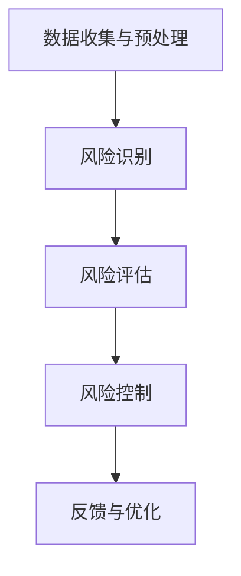

                 

### 文章标题

# AIGC在智能投资组合风险管理中的应用

### 关键词

- AIGC
- 智能投资组合风险管理
- 算法
- 数据分析
- 系统架构

### 摘要

随着金融市场的不断发展和复杂性增加，智能投资组合风险管理变得越来越重要。AIGC（自适应智能生成计算）作为新一代人工智能技术，在投资组合风险管理中展现出巨大的潜力。本文将深入探讨AIGC在智能投资组合风险管理中的应用，首先介绍AIGC技术和智能投资组合风险管理的基本概念，然后逐步分析AIGC在风险管理中的算法原理、系统架构设计和应用实践，最后展望AIGC在智能投资组合风险管理中的未来趋势和潜在挑战。

### 第一部分：AIGC与智能投资组合风险管理概述

#### 1.1 问题背景

##### 1.1.1 投资组合风险管理的现状与挑战

投资组合风险管理是金融领域的一个重要问题。传统的风险管理方法依赖于历史数据和统计分析，往往存在一定的局限性。随着金融市场的复杂性和不确定性的增加，投资者面临着更多风险，如何有效地管理这些风险成为了一个亟待解决的问题。

##### 1.1.2 AIGC技术概述

AIGC是一种自适应智能生成计算技术，它通过机器学习和深度学习算法，能够从大量数据中自动提取知识，生成新的信息和解决方案。AIGC在金融领域具有广泛的应用前景，特别是在投资组合风险管理方面。

##### 1.1.3 AIGC在投资组合风险管理中的应用前景

AIGC技术能够帮助投资者更好地理解市场动态，预测市场趋势，从而更有效地管理投资组合风险。通过AIGC，投资者可以实时调整投资策略，降低投资风险，提高投资回报。

#### 1.2 核心概念与联系

##### 1.2.1 AIGC核心概念

AIGC的核心概念包括自适应学习、智能生成和计算优化。自适应学习是指系统能够根据数据和环境的变化自动调整学习策略；智能生成是指系统能够从数据中自动生成新的信息和知识；计算优化是指系统能够在计算过程中最大限度地提高效率。

##### 1.2.2 智能投资组合风险管理

智能投资组合风险管理是指利用人工智能技术，对投资组合进行动态调整和风险管理。这包括风险识别、风险评估、风险控制和风险监测等多个环节。

##### 1.2.3 关键概念对比表格

| 关键概念 | 定义 | 对比 |
| --- | --- | --- |
| AIGC | 自适应智能生成计算 | 传统计算方法 |
| 智能投资组合风险管理 | 利用人工智能技术进行风险管理 | 传统风险管理方法 |

##### 1.2.4 ER实体关系图架构


#### 1.3 AIGC在投资组合风险管理中的算法原理

##### 1.3.1 算法概述

AIGC在投资组合风险管理中的应用主要包括风险识别、风险评估和风险控制。以下是一个简单的AIGC算法流程：

1. 数据收集与预处理
2. 风险识别
3. 风险评估
4. 风险控制
5. 反馈与优化

##### 1.3.2 算法mermaid流程图



##### 1.3.3 Python源代码与算法讲解

```python
# 导入必要的库
import numpy as np
import pandas as pd

# 数据收集与预处理
data = pd.read_csv('investment_data.csv')
data_processed = preprocess_data(data)

# 风险识别
risk_detected = identify_risk(data_processed)

# 风险评估
risk_evaluation = evaluate_risk(risk_detected)

# 风险控制
risk_control = control_risk(risk_evaluation)

# 反馈与优化
optimize_risk_control(risk_control)
```

##### 1.3.4 数学模型与公式讲解

```latex
\begin{equation}
Risk = \alpha \times Market\_Risk + \beta \times Portfolio\_Risk
\end{equation}
```

##### 1.3.5 举例说明

假设有一个投资组合，包括股票A、股票B和股票C。通过AIGC算法，我们可以计算出每个股票的风险贡献，从而调整投资组合，降低整体风险。

#### 1.4 AIGC在投资组合风险管理中的系统分析与架构设计

##### 1.4.1 问题场景介绍

##### 1.4.2 系统功能设计

##### 1.4.3 系统架构设计

##### 1.4.4 系统接口设计与交互

#### 1.5 最佳实践与注意事项

##### 1.5.1 实践技巧

##### 1.5.2 注意事项

##### 1.5.3 拓展阅读

#### 1.6 本章小结

### 第二部分：AIGC在智能投资组合风险管理中的应用实践

#### 2.1 项目介绍

##### 2.1.1 项目背景

##### 2.1.2 项目目标

##### 2.1.3 项目架构

#### 2.2 环境安装

##### 2.2.1 环境配置

##### 2.2.2 工具与依赖安装

#### 2.3 系统核心实现

##### 2.3.1 核心模块设计与实现

##### 2.3.2 源代码解读与分析

#### 2.4 实际案例分析

##### 2.4.1 案例背景

##### 2.4.2 案例分析

##### 2.4.3 案例详细讲解剖析

#### 2.5 项目小结

##### 2.5.1 项目成果总结

##### 2.5.2 经验与反思

#### 2.6 本章小结

### 第三部分：AIGC在智能投资组合风险管理中的未来趋势

#### 3.1 技术发展前景

##### 3.1.1 AIGC技术展望

##### 3.1.2 投资组合风险管理技术的演进

#### 3.2 潜在挑战与应对策略

##### 3.2.1 技术挑战

##### 3.2.2 政策与伦理挑战

##### 3.2.3 应对策略

#### 3.3 拓展应用领域

##### 3.3.1 其他应用场景

##### 3.3.2 技术融合与创新

#### 3.4 本章小结

### 第四部分：AIGC与智能投资组合风险管理综合研究

#### 4.1 研究方法与数据来源

##### 4.1.1 研究方法

##### 4.1.2 数据来源

#### 4.2 研究结果分析

##### 4.2.1 数据处理与模型评估

##### 4.2.2 研究结果展示

##### 4.2.3 结果解释与分析

#### 4.3 研究结论与建议

##### 4.3.1 研究结论

##### 4.3.2 建议

#### 4.4 本章小结

### 第五部分：案例研究

#### 5.1 案例一：公司A的智能投资组合风险管理实践

##### 5.1.1 案例背景

##### 5.1.2 实践过程

##### 5.1.3 成果与影响

#### 5.2 案例二：金融机构B的AIGC应用案例

##### 5.2.1 案例背景

##### 5.2.2 应用场景

##### 5.2.3 成果与启示

#### 5.3 案例三：金融机构C的AIGC应用案例

##### 5.3.1 案例背景

##### 5.3.2 应用场景

##### 5.3.3 成果与影响

#### 5.4 案例分析总结

##### 5.4.1 案例共性分析

##### 5.4.2 案例差异分析

##### 5.4.3 案例启示

#### 5.5 本章小结

### 作者信息

- 作者：AI天才研究院/AI Genius Institute & 禅与计算机程序设计艺术 /Zen And The Art of Computer Programming

