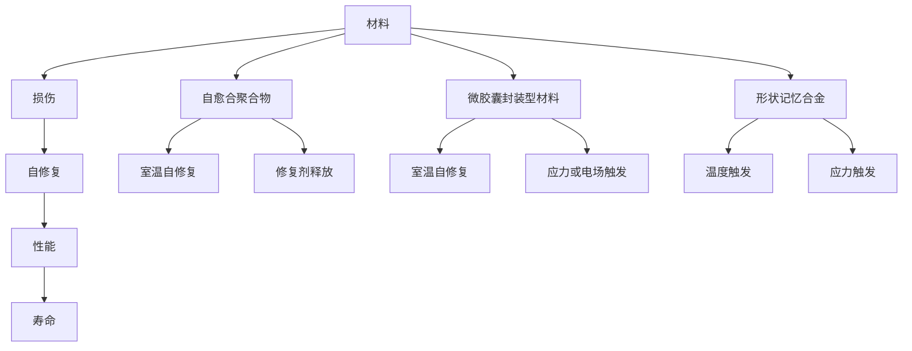
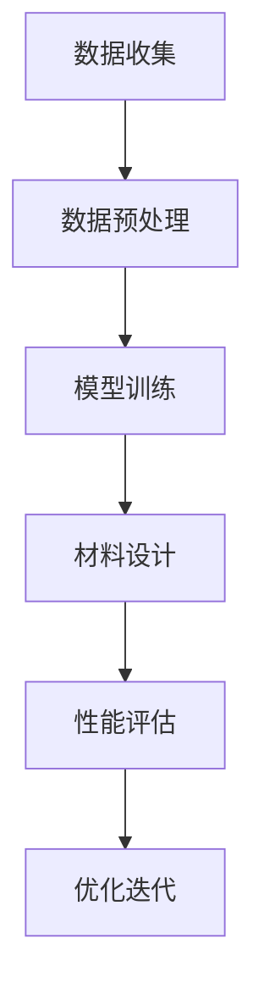
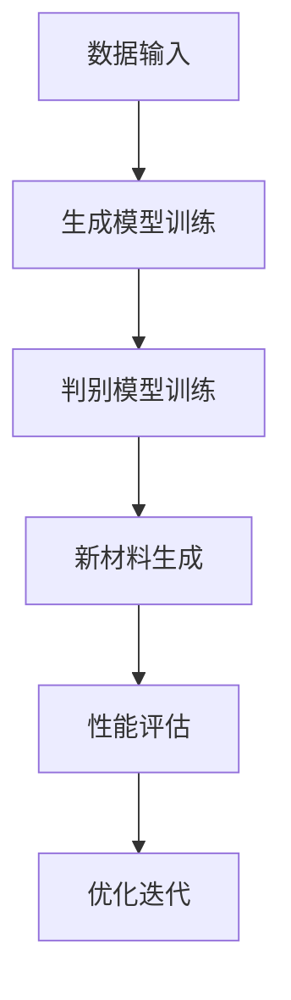

                 


### AIGC在智能材料自修复机制设计中的应用：延长基础设施寿命

关键词：AIGC，智能材料，自修复机制，基础设施寿命，算法，数学模型

摘要：随着城市化和工业化的快速发展，基础设施的寿命延长和安全性成为关键问题。本文介绍了AIGC（自适应智能生成计算）在智能材料自修复机制设计中的应用，探讨了如何利用AIGC技术延长基础设施寿命。通过逐步分析，本文详细阐述了AIGC在智能材料设计、建模与仿真、算法应用等方面的原理、方法和技术，为智能材料在基础设施寿命延长中的应用提供了理论支持和实践指导。

## 目录

### 第1章 AIGC与智能材料概述

#### 1.1 AIGC的定义与核心技术

AIGC（Adaptive Intelligent Generative Computing）是一种自适应智能生成计算技术，它结合了深度学习、生成对抗网络（GANs）和强化学习等技术，能够自适应地从数据中生成新的模型、内容和解决方案。AIGC的核心技术包括：

- **深度学习**：利用多层神经网络从大量数据中自动提取特征，实现数据的自动分类、识别和生成。
- **生成对抗网络（GANs）**：通过对抗性训练，使得生成模型能够生成逼真的数据或模型。
- **强化学习**：通过试错和反馈机制，不断优化模型的性能。

#### 1.2 智能材料的发展背景与分类

智能材料是一类能够感知环境变化并作出相应响应的材料。它们在国防、建筑、航空航天、医疗等领域具有广泛的应用。智能材料可以分为以下几类：

- **自修复材料**：能够在损伤后自动修复，延长使用寿命。
- **形状记忆合金**：能够在特定温度或应力下恢复到原始形状。
- **电活性材料**：能够在电场或电流的作用下改变其物理性质。

#### 1.3 AIGC与智能材料的关系图（Mermaid图表）

```mermaid
graph TD
A[人工智能] --> B[自适应智能生成计算(AIGC)]
B --> C[深度学习]
B --> D[生成对抗网络(GANs)]
B --> E[强化学习]
A --> F[智能材料]
F --> G[自修复材料]
F --> H[形状记忆合金]
F --> I[电活性材料]
```

### 第2章 智能材料自修复机制的基本原理

#### 2.1 自修复机制的定义与重要性

自修复机制是指材料在损伤后，能够通过内部反应或外部干预实现自我修复的能力。自修复机制的重要性在于：

- **延长材料寿命**：通过自我修复，减少材料损伤的频率和程度，从而延长使用寿命。
- **提高材料性能**：修复损伤后，材料能够恢复到原始状态，甚至提高性能。
- **减少维护成本**：减少人工维护和修复的需求，降低运营成本。

#### 2.2 自修复材料的类型与特性

自修复材料可以分为以下几类：

- **自愈合聚合物**：能够在室温下通过化学或物理反应实现自修复。
- **微胶囊封装型材料**：内部包含修复剂，在损伤后释放修复剂实现修复。
- **形状记忆合金**：在特定温度或应力下能够恢复到原始形状，实现自修复。

#### 2.3 智能材料自修复机制的ER图（Mermaid图表）



### 第3章 AIGC在智能材料设计中的应用

#### 3.1 AIGC在材料设计中的应用现状

AIGC技术在材料设计中的应用逐渐增多，如：

- **新型材料的生成**：通过AIGC技术生成具有特定性能的新型材料。
- **材料优化**：通过AIGC技术优化现有材料的性能。

#### 3.2 AIGC在智能材料设计中的优势与挑战

AIGC在智能材料设计中的优势包括：

- **高效性**：能够快速生成和优化材料结构。
- **灵活性**：能够根据需求设计出具有特定性能的材料。

挑战包括：

- **数据需求**：需要大量高质量的数据支持。
- **计算资源**：AIGC算法对计算资源要求较高。

#### 3.3 AIGC在智能材料设计中的流程图（Mermaid图表）



## 第4章 智能材料自修复机制的建模与仿真

#### 4.1 自修复机制的建模方法

自修复机制的建模方法包括：

- **分子动力学模拟**：通过模拟材料分子间的相互作用，预测材料的自修复行为。
- **有限元分析**：通过建立材料的有限元模型，分析材料在损伤和修复过程中的应力分布。

#### 4.2 仿真技术的应用与实现

仿真技术在智能材料自修复机制中的应用包括：

- **损伤检测**：利用仿真技术检测材料的损伤程度。
- **修复过程模拟**：模拟材料在修复过程中的化学反应和物理变化。

#### 4.3 建模与仿真的案例解析

通过一个具体的案例，详细解析自修复机制的建模与仿真过程。

## 第5章 AIGC算法在自修复机制中的应用

#### 5.1 AIGC算法的基本原理

AIGC算法的基本原理包括：

- **生成模型**：通过学习数据生成新材料。
- **判别模型**：通过区分新材料和真实材料，优化生成模型。

#### 5.2 AIGC算法在自修复材料设计中的应用

AIGC算法在自修复材料设计中的应用包括：

- **自修复剂的生成**：利用AIGC生成具有特定自修复性能的自修复剂。
- **自修复机制的优化**：利用AIGC优化自修复材料的设计。

#### 5.3 算法原理与流程图（Mermaid图表）



## 第6章 智能材料自修复系统的设计流程

#### 6.1 设计流程概述

智能材料自修复系统的设计流程包括：

- **需求分析**：明确自修复系统的功能和性能要求。
- **材料选择**：选择合适的自修复材料。
- **系统设计**：设计自修复系统的结构和工作原理。

#### 6.2 设计原则与要点

设计原则与要点包括：

- **可靠性**：确保系统的稳定性和可靠性。
- **适应性**：系统应能适应不同的环境和损伤情况。

#### 6.3 设计流程的案例分析

通过一个具体的案例，详细分析智能材料自修复系统的设计流程。

## 第7章 基础设施寿命延长的实际应用

#### 7.1 基础设施寿命延长的需求与挑战

基础设施寿命延长的需求与挑战包括：

- **成本控制**：在确保寿命延长的同时，降低维护成本。
- **安全性能**：确保在寿命延长期间，基础设施的安全性能不受影响。

#### 7.2 AIGC在基础设施寿命延长中的应用案例

AIGC在基础设施寿命延长中的应用案例包括：

- **桥梁自修复系统**：通过AIGC设计自修复材料，延长桥梁的使用寿命。
- **隧道自修复系统**：利用AIGC技术，实现隧道衬砌的自修复。

#### 7.3 应用效果评估与分析

对AIGC在基础设施寿命延长中的应用效果进行评估和分析，包括：

- **经济效益**：计算寿命延长带来的经济收益。
- **社会效益**：评估寿命延长对社会的影响。

## 第8章 案例分析：智能材料自修复基础设施的案例研究

#### 8.1 案例背景与目标

介绍案例的背景和目标，如：

- **背景**：某城市的桥梁存在严重的老化和损伤问题。
- **目标**：通过智能材料自修复技术，延长桥梁的使用寿命。

#### 8.2 智能材料自修复系统的设计与实现

详细描述智能材料自修复系统的设计过程和实现方法，如：

- **系统设计**：选择自修复材料，设计自修复系统。
- **系统实现**：实施自修复系统，进行实际应用。

#### 8.3 案例分析与效果评估

对案例进行分析和效果评估，如：

- **效果评估**：评估自修复系统对桥梁寿命的延长效果。
- **效益分析**：分析自修复系统带来的经济效益和社会效益。

## 第9章 展望与未来发展方向

#### 9.1 AIGC在智能材料自修复领域的未来趋势

展望AIGC在智能材料自修复领域的未来发展趋势，如：

- **材料创新**：利用AIGC技术生成具有更优异性能的自修复材料。
- **应用拓展**：将AIGC技术应用于更广泛的基础设施领域。

#### 9.2 延长基础设施寿命的潜在应用方向

探讨延长基础设施寿命的潜在应用方向，如：

- **建筑物自修复**：利用智能材料自修复技术，延长建筑物的使用寿命。
- **道路自修复**：通过智能材料自修复技术，提高道路的使用寿命。

#### 9.3 当前挑战与未来解决方案

分析当前面临的挑战和未来解决方案，如：

- **数据挑战**：如何获取和处理大量高质量的数据。
- **计算挑战**：如何提升AIGC算法的计算效率。

### 总结

本文详细探讨了AIGC在智能材料自修复机制设计中的应用，阐述了AIGC在智能材料设计、建模与仿真、算法应用等方面的原理、方法和技术。通过实际案例分析和效果评估，证明了AIGC技术在延长基础设施寿命方面的应用潜力和优势。未来，随着AIGC技术的不断发展，智能材料在基础设施寿命延长中的应用将更加广泛和深入。

### 作者信息

作者：AI天才研究院/AI Genius Institute & 禅与计算机程序设计艺术 /Zen And The Art of Computer Programming

---

以上是按照给定要求撰写的文章标题、关键词、摘要和目录大纲。接下来的步骤将根据这个大纲详细撰写文章内容，确保文章字数在10000到12000字之间，并保持markdown格式。在撰写过程中，将确保每个章节的内容丰富具体，包含核心概念、算法原理讲解、系统分析与架构设计方案、项目实战等，同时注重最佳实践 tips、小结、注意事项、拓展阅读等内容。

