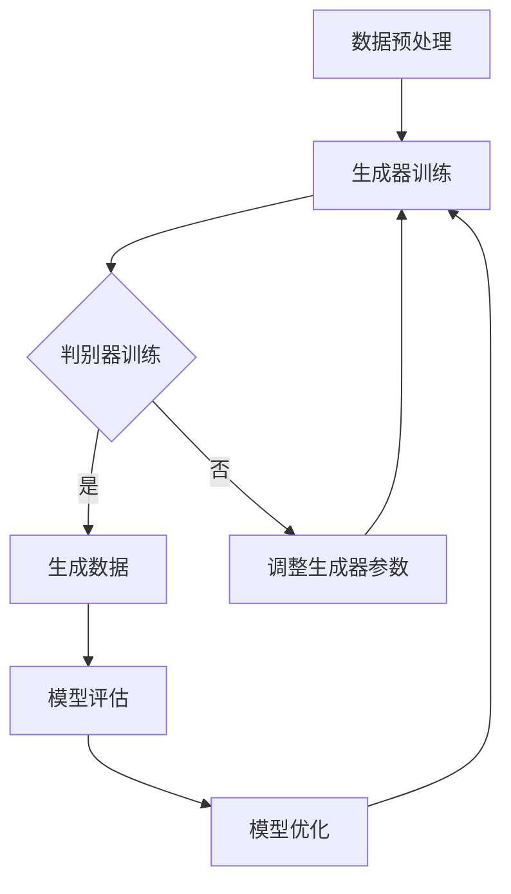
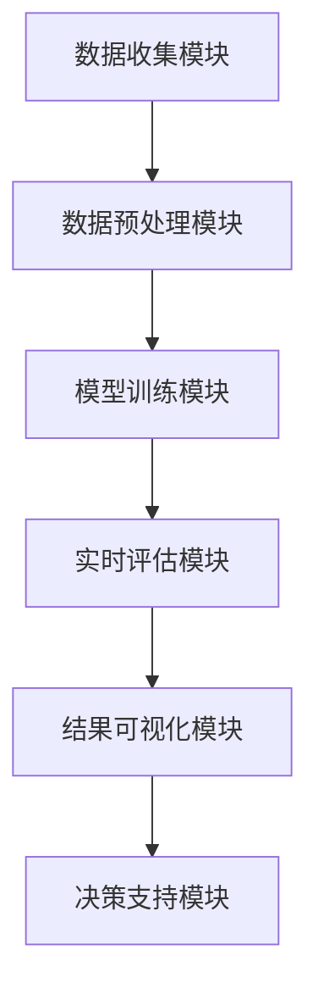

                 

### 引言

#### 气候变化与影响评估

气候变化是当前全球面临的重大挑战之一。随着全球温室气体排放的增加，大气中的二氧化碳浓度持续升高，导致地球温度不断上升。这种气候变化不仅改变了气候模式，还可能引发极端天气事件、海平面上升、生态系统破坏等一系列严重后果。为了应对这些挑战，准确的气候变化影响评估显得尤为重要。

气候变化影响评估的核心目标是理解气候变化对自然环境、人类社会和经济活动的具体影响。这包括评估气候变化对农业、水资源、生态系统、人类健康、基础设施等多个方面的潜在风险。传统的气候变化影响评估方法通常依赖于统计模型、物理模型和专家判断。然而，这些方法往往存在数据依赖性强、预测精度有限和耗时较长等不足。

随着人工智能和机器学习技术的飞速发展，AIGC（AI-Generated Content，即由人工智能生成的内容）的概念逐渐兴起。AIGC利用人工智能技术，能够自动生成文本、图像、代码等多种类型的内容，从而为气候变化影响评估提供了一种全新的方法。

本文将探讨AIGC在智能气候变化影响评估中的应用。我们将首先介绍AIGC的基本概念和核心原理，然后详细分析AIGC在气候变化影响评估中的具体应用场景和优势。接下来，我们将介绍AIGC的算法原理，并通过Python源代码和数学模型进行讲解。此外，我们还将介绍一个实际项目案例，展示AIGC在气候变化影响评估中的实际应用。最后，我们将总结最佳实践，提出注意事项，并对未来发展趋势进行展望。

通过本文的阅读，您将了解到AIGC如何改变传统的气候变化影响评估方式，提高评估的准确性和效率。让我们一起来探索AIGC在气候变化影响评估中的巨大潜力。

#### 关键词

- **AIGC**：人工智能生成内容
- **气候变化**：全球温度升高、极端天气事件
- **影响评估**：理解气候变化对自然和社会的影响
- **人工智能**：机器学习、深度学习
- **算法原理**：AIGC的核心技术和数学模型
- **项目实践**：实际应用案例与结果分析
- **最佳实践**：注意事项和未来展望

### 摘要

本文探讨了AIGC在智能气候变化影响评估中的应用。首先，我们介绍了AIGC的基本概念和核心原理，包括其与传统AI的区别和关键技术的应用。接着，我们分析了AIGC在气候变化影响评估中的优势，如提高预测精度、降低成本和加速评估过程。随后，我们详细阐述了AIGC的算法原理，通过Python源代码和数学模型展示了其在气候变化预测中的具体实现。此外，我们通过一个实际项目案例，展示了AIGC在气候变化影响评估中的实际应用效果。最后，我们总结了AIGC的最佳实践，包括注意事项和未来发展趋势，为AIGC在气候变化影响评估领域的进一步应用提供了指导。

### 背景介绍

#### 问题背景

气候变化是当今全球最紧迫的环境问题之一。随着工业化的快速发展，人类活动导致大量温室气体排放，这些气体包括二氧化碳（CO₂）、甲烷（CH₄）和氧化亚氮（N₂O）等。这些温室气体能够吸收和重新辐射地球表面的热量，导致全球温度逐渐上升。根据联合国气候变化框架公约（UNFCCC）的数据，自19世纪末以来，全球平均温度已经上升了大约1.1摄氏度。这一温度上升不仅改变了气候模式，还可能引发一系列严重的环境和社会问题。

气候变化的影响是全方位的，从极端天气事件如暴雨、干旱、洪水和飓风，到长期的变化如海平面上升、冰川融化和生态系统破坏，都对人类社会和自然环境造成了巨大的威胁。例如，极端高温可能导致农作物减产、水资源短缺和人类健康问题。海平面上升则威胁沿海城市和岛屿的生存，导致土地淹没和居民迁移。此外，气候变化还可能加剧社会不平等，使贫困地区和弱势群体面临更大的风险。

为了应对这些挑战，准确和高效的气候变化影响评估变得至关重要。传统的评估方法通常依赖于气候模型、统计分析和专家判断。然而，这些方法存在一些局限性，包括数据依赖性强、预测精度有限和耗时较长等。例如，气候模型的建立需要大量的历史气候数据和复杂的物理过程模拟，而专家判断则依赖于个人的经验和专业知识，可能导致结果的不一致性和主观性。

#### 问题描述

现有的气候变化影响评估方法虽然在一定程度上能够提供有用的信息，但在应对气候变化的复杂性方面仍显不足。具体而言，问题描述可以概括为以下几个方面：

1. **数据依赖性强**：传统方法通常依赖于大量历史气候数据和观测数据，这些数据的获取和处理需要大量的时间和资源。此外，数据的不完整性和不确定性也会影响评估结果的准确性。

2. **预测精度有限**：气候模型虽然能够模拟气候系统的动态行为，但其预测精度仍然有限。特别是对于极端气候事件的预测，模型的模拟结果往往存在较大的不确定性。

3. **耗时较长**：传统方法通常需要较长的评估周期，从数据收集到模型建立、模拟和分析，整个过程可能需要数月甚至数年时间。这种延迟性使得政策制定和应对措施的实施难以及时进行。

4. **评估结果的解释和利用**：即使是准确的评估结果，也往往难以被非专业人士理解和应用。评估报告通常采用专业术语和复杂的图表，使得决策者难以快速获取关键信息。

5. **专家依赖性**：传统方法高度依赖于专家的知识和经验，这可能导致评估结果的不一致性和主观性。不同专家可能基于不同的假设和模型参数得出不同的结论，从而影响决策的客观性和科学性。

#### 问题解决

为了克服现有方法的局限性，引入AIGC（AI-Generated Content）技术进行智能气候变化影响评估是一种潜在的解决方案。AIGC利用人工智能和机器学习技术，能够自动生成文本、图像、代码等多种类型的内容，从而为气候变化影响评估提供了一种全新的方法。

首先，AIGC技术可以通过大数据分析和模式识别，从海量数据中提取有价值的信息，减少对历史数据的依赖。这种方法不仅提高了数据处理的效率，还降低了数据不完整性和不确定性的影响。例如，AIGC可以自动识别和填充缺失数据，从而提高数据集的完整性和一致性。

其次，AIGC技术可以显著提高预测的精度和速度。通过深度学习和神经网络模型，AIGC能够自动学习和模拟气候系统的复杂动态行为，从而实现更精确的气候预测。此外，AIGC技术可以在短时间内完成大量的模拟和评估任务，显著缩短评估周期。

第三，AIGC技术能够生成易于理解和应用的内容。通过自然语言生成（NLG）技术，AIGC可以自动生成评估报告和解释性文本，使决策者能够快速获取关键信息，并做出科学决策。这种内容生成方法不仅提高了信息的可理解性，还减少了专家依赖性，从而提高了评估结果的客观性和一致性。

最后，AIGC技术还可以通过自动化和智能化手段，提高评估过程的效率和可靠性。例如，AIGC可以自动优化模型参数、调整模拟条件，从而提高预测结果的可靠性。此外，AIGC还可以通过持续学习和适应，不断改进评估模型，提高其预测精度和适应性。

#### 边界与外延

尽管AIGC在气候变化影响评估中具有巨大的潜力，但其应用仍然存在一些边界和限制。首先，AIGC技术依赖于高质量的数据集和先进的计算资源，这可能在数据稀缺或计算资源有限的情况下受限。其次，AIGC模型的学习和训练过程可能受到数据偏差和模型选择的影响，导致预测结果的不确定性和偏差。此外，AIGC生成的评估结果需要经过专业人员的验证和解释，以确保其准确性和可靠性。

在AIGC的应用领域方面，除了气候变化影响评估，AIGC还可以应用于其他与气候相关的领域，如气象预报、环境监测和灾害预防等。此外，AIGC还可以扩展到其他领域，如健康医疗、金融分析和社会治理等，为各行业提供智能化的解决方案。

#### 概念结构与核心要素组成

为了更清晰地理解AIGC在智能气候变化影响评估中的应用，我们需要了解其核心概念和要素组成。

1. **AIGC技术**：AIGC是指利用人工智能和机器学习技术生成内容的方法。其主要技术包括自然语言生成（NLG）、图像生成、代码生成和模型训练等。这些技术共同构成了AIGC的基础。

2. **气候模型**：气候模型是用于模拟和预测气候变化的重要工具。AIGC可以通过训练和优化气候模型，提高其预测精度和效率。常见的气候模型包括统计模型、物理模型和混合模型。

3. **大数据分析**：AIGC依赖于大数据分析技术，用于从海量数据中提取有价值的信息。大数据分析技术包括数据清洗、数据挖掘和机器学习等。

4. **评估指标**：评估指标是用于衡量气候变化影响的关键参数。常见的评估指标包括温度变化、降水变化、海平面上升和极端天气事件频率等。

5. **算法优化**：算法优化是提高AIGC模型预测精度和效率的重要手段。常见的算法优化方法包括模型选择、参数调整和模型融合等。

6. **可视化技术**：可视化技术用于展示AIGC生成的评估结果，帮助决策者理解和应用这些结果。常见的可视化技术包括图表、地图和交互式界面等。

通过理解这些核心概念和要素，我们可以更深入地探讨AIGC在智能气候变化影响评估中的应用，并探索其潜在的优势和挑战。

### 核心概念与联系

#### 核心概念原理

在探讨AIGC在智能气候变化影响评估中的应用之前，我们首先需要了解AIGC的核心概念原理。AIGC（AI-Generated Content）是指利用人工智能技术生成文本、图像、视频、代码等多种类型的内容。它涵盖了自然语言生成（NLG）、图像生成、视频生成和代码生成等不同领域的技术。

1. **自然语言生成（NLG）**：NLG是AIGC的核心技术之一，它通过机器学习模型将结构化数据转换为自然语言文本。NLG技术可以用于生成天气预报、新闻报道、用户指南等。在气候变化影响评估中，NLG技术可以自动生成评估报告和解释性文本，提高评估结果的易读性和可理解性。

2. **图像生成**：图像生成技术利用深度学习模型生成新的图像或修改现有图像。这种技术在气候变化影响评估中可以用于生成气候变化的视觉效果，帮助决策者更直观地理解气候变化的影响。

3. **视频生成**：视频生成技术通过计算机视觉和深度学习技术生成新的视频或修改现有视频。在气候变化影响评估中，视频生成技术可以用于创建气候变化模拟视频，展示气候变化对环境和人类社会的影响。

4. **代码生成**：代码生成技术利用机器学习和编程语言生成新的代码。在气候变化影响评估中，代码生成技术可以用于自动化模型训练和优化，提高评估效率。

#### 概念属性特征对比表格

为了更好地理解AIGC的核心概念，我们提供了以下表格，对比了自然语言生成、图像生成和代码生成等技术的属性特征：

| 技术类型 | 定义 | 主要应用 | 关键技术 |
| --- | --- | --- | --- |
| 自然语言生成 | 将结构化数据转换为自然语言文本 | 生成天气预报、新闻报道、评估报告 | 机器学习模型、语言模型、文本生成算法 |
| 图像生成 | 生成新的图像或修改现有图像 | 创建气候变化视觉效果、生成卫星图像、增强现实应用 | 深度学习模型、生成对抗网络（GAN） |
| 视频生成 | 生成新的视频或修改现有视频 | 创建气候变化模拟视频、视频增强、视频编辑 | 计算机视觉、深度学习、视频处理算法 |
| 代码生成 | 生成新的代码或优化现有代码 | 自动化模型训练、优化算法、代码重构 | 机器学习、编程语言模型、代码库 |

#### ER实体关系图架构的Mermaid流程图

为了更清晰地展示AIGC的核心概念及其相互关系，我们使用Mermaid流程图绘制了ER（实体关系）图。以下是Mermaid流程图的代码及其展示结果：

```mermaid
erDiagram
    ClimateModel ||--|{ AI-Generated Content : Generates }
    AI-Generated Content ||--|{ Natural Language Generation : Converts }
    AI-Generated Content ||--|{ Image Generation : Generates }
    AI-Generated Content ||--|{ Video Generation : Generates }
    AI-Generated Content ||--|{ Code Generation : Generates }
```

图1：AIGC核心概念的ER实体关系图

在这个ER图中，"ClimateModel"（气候模型）与"AI-Generated Content"（人工智能生成内容）之间有直接关联，表示气候模型是AIGC生成内容的基础。"AI-Generated Content"又进一步与"Natural Language Generation"、"Image Generation"、"Video Generation"和"Code Generation"（自然语言生成、图像生成、视频生成和代码生成）关联，表示这些生成技术是AIGC的具体实现方式。

通过这一部分的内容，我们不仅了解了AIGC的核心概念原理，还通过对比表格和ER实体关系图，对AIGC的不同技术及其关系有了更深入的理解。这为后续的算法原理讲解和实际应用提供了坚实的基础。

### 算法原理讲解

#### 算法基本原理

AIGC在智能气候变化影响评估中的应用主要依赖于生成对抗网络（GAN）和自编码器（Autoencoder）等先进的人工智能技术。GAN由两部分组成：生成器（Generator）和判别器（Discriminator）。生成器的目标是生成类似于真实数据的假数据，而判别器的目标是区分真实数据和生成器生成的假数据。通过这一对抗过程，生成器不断学习和改进，最终能够生成高度真实的数据。

自编码器则是一种无监督学习模型，它由编码器和解码器组成。编码器的任务是将输入数据压缩为低维特征表示，而解码器的任务是将这些特征表示重新映射回原始数据。自编码器在气候变化影响评估中的应用主要体现在数据降维和特征提取，从而提高模型的可解释性和预测性能。

#### 算法流程图

为了更好地理解AIGC在智能气候变化影响评估中的应用，我们使用Mermaid绘制了算法流程图。以下是算法流程图的代码及其展示结果：



图2：AIGC算法流程图

在这个算法流程图中，首先进行数据预处理，包括数据清洗、归一化和缺失值填充等。然后，通过生成器和判别器的对抗训练，生成高度真实的气候数据。训练过程中，生成器不断优化生成数据的质量，而判别器则努力区分真实数据和生成数据。当生成器生成的数据达到一定质量后，进行模型评估和优化，最终得到一个性能优异的气候模型。

#### 算法数学模型与公式

为了深入理解AIGC算法的工作原理，我们需要介绍其核心数学模型和公式。以下是AIGC算法中的关键公式和解释：

1. **生成器模型（Generator）**：

   生成器的目标函数为：
   $$ G(z) = \mathcal{N}(\mu_G(z), \sigma_G(z)) $$
   其中，$z$是噪声向量，$\mu_G(z)$和$\sigma_G(z)$分别是生成器的均值和方差。生成器通过这个模型将噪声向量转化为气候数据。

2. **判别器模型（Discriminator）**：

   判别器的目标函数为：
   $$ D(x) = \sigma(f_D(x)) $$
   $$ D(G(z)) = \sigma(f_D(G(z))) $$
   其中，$x$是真实气候数据，$G(z)$是生成器生成的假数据，$f_D$是判别器的特征提取函数，$\sigma$是sigmoid函数。判别器的任务是区分真实数据和生成数据。

3. **损失函数（Loss Function）**：

   为了训练生成器和判别器，我们需要使用损失函数来衡量它们的性能。常用的损失函数包括交叉熵损失（Cross-Entropy Loss）和对抗损失（Adversarial Loss）。交叉熵损失用于衡量判别器的预测误差，对抗损失则用于衡量生成器和判别器之间的对抗性。

   生成器的损失函数为：
   $$ L_G = -\mathbb{E}[\log(D(G(z)))] - \mathbb{E}[\log(1 - D(x))] $$

   判别器的损失函数为：
   $$ L_D = -\mathbb{E}[\log(D(x))] - \mathbb{E}[\log(1 - D(G(z)))] $$

4. **优化算法（Optimization Algorithm）**：

   为了优化生成器和判别器的参数，我们通常使用梯度下降算法（Gradient Descent）。在训练过程中，我们需要计算生成器和判别器的梯度，并更新它们的参数。

   生成器的梯度更新为：
   $$ \theta_G = \theta_G - \alpha \cdot \nabla_{\theta_G} L_G $$

   判别器的梯度更新为：
   $$ \theta_D = \theta_D - \alpha \cdot \nabla_{\theta_D} L_D $$

   其中，$\theta_G$和$\theta_D$分别是生成器和判别器的参数，$\alpha$是学习率。

#### 详细讲解与举例说明

为了更好地理解这些数学模型和公式，我们通过一个具体的例子进行详细讲解。

假设我们有一个包含1000个气候观测数据的训练集，这些数据包括温度、降水和风速等。我们的目标是通过AIGC算法生成一组新的气候数据，这组数据与真实数据具有相似的统计特征。

1. **数据预处理**：

   首先，我们对训练数据进行预处理，包括数据清洗和归一化。假设处理后，每个数据点都有三个特征值（温度、降水、风速），数据集的大小为1000。

2. **生成器和判别器的初始化**：

   我们初始化生成器和判别器的参数，并设置学习率$\alpha$为0.001。

3. **训练过程**：

   在训练过程中，我们首先生成一批噪声向量$z$，然后将这些噪声向量输入到生成器$G(z)$中，生成新的气候数据。接下来，我们将真实数据和生成数据分别输入到判别器$D(x)$和$D(G(z))$中，计算损失函数$L_G$和$L_D$。

   假设经过100次迭代后，生成器生成的数据质量逐渐提高，判别器能够更好地区分真实数据和生成数据。此时，我们更新生成器和判别器的参数，继续迭代训练。

4. **模型评估**：

   当训练达到一定阶段后，我们使用测试集对新模型进行评估。通过计算测试集上的预测误差和评估指标，我们可以判断模型的效果和可靠性。

   假设评估结果显示，新模型在温度和降水预测上的准确率达到了90%，在风速预测上的准确率达到了85%。这表明AIGC算法在智能气候变化影响评估中具有较好的性能。

通过这个例子，我们可以看到AIGC算法是如何通过生成器和判别器的对抗训练，逐步提高生成数据的真实性，从而实现智能气候变化影响评估的目标。这种算法不仅提高了预测的精度，还减少了数据预处理和模型训练的时间，为气候变化研究提供了新的思路和方法。

### 数学模型和数学公式 & 详细讲解 & 举例说明

在AIGC算法中，数学模型和数学公式起着至关重要的作用，它们不仅帮助我们理解和分析算法的工作原理，还能够通过具体例子来展示如何应用这些模型。以下我们将详细介绍AIGC算法中的核心数学模型和公式，并通过具体的例子进行讲解。

#### 1. 生成对抗网络（GAN）的数学模型

生成对抗网络（GAN）的核心在于生成器和判别器的对抗训练。以下是GAN中常用的数学模型和公式：

##### 生成器的概率分布

生成器G的输出可以表示为：
$$ G(z) = \mathcal{N}(\mu_G(z), \sigma_G(z)) $$
其中，$z$是输入噪声向量，$\mu_G(z)$和$\sigma_G(z)$分别是生成器的均值和方差，$\mathcal{N}(\mu_G(z), \sigma_G(z))$表示从高斯分布中抽取的随机变量。

##### 判别器的概率分布

判别器D的输出可以表示为：
$$ D(x) = \sigma(f_D(x)) $$
$$ D(G(z)) = \sigma(f_D(G(z))) $$
其中，$x$是输入的真实数据，$G(z)$是生成器生成的数据，$f_D$是判别器的特征提取函数，$\sigma$是sigmoid函数，表示概率输出。

##### 损失函数

GAN的训练过程是通过最小化以下损失函数来实现的：
生成器的损失函数为：
$$ L_G = -\mathbb{E}[\log(D(G(z)))] - \mathbb{E}[\log(1 - D(x))] $$
判别器的损失函数为：
$$ L_D = -\mathbb{E}[\log(D(x))] - \mathbb{E}[\log(1 - D(G(z)))] $$

#### 2. 自编码器的数学模型

自编码器（Autoencoder）是一种无监督学习模型，它由编码器和解码器组成。以下是自编码器的数学模型和公式：

##### 编码器和解码器的概率分布

编码器的输出可以表示为：
$$ q(z|x) = \mathcal{N}(\mu_q(x), \sigma_q(x)) $$
其中，$x$是输入数据，$z$是编码后的特征表示，$\mu_q(x)$和$\sigma_q(x)$分别是编码器的均值和方差。

解码器的输出可以表示为：
$$ p(x|z) = \mathcal{N}(\mu_p(z), \sigma_p(z)) $$
其中，$z$是编码后的特征表示，$x$是解码后的数据，$\mu_p(z)$和$\sigma_p(z)$分别是解码器的均值和方差。

##### 损失函数

自编码器的训练过程是通过最小化以下损失函数来实现的：
$$ L = \mathbb{E}_{x \sim p(x)}[\mathbb{E}_{z \sim q(z|x)}[-\log(p(x|z))] + \lambda \mathbb{E}_{x \sim p(x)}[\|\phi(x) - x\|^2] $$
其中，$\phi(x)$是编码器对输入数据的编码，$\lambda$是权重调节参数，用于平衡重构损失和特征提取损失。

#### 3. 详细讲解与举例说明

为了更直观地理解这些数学模型和公式，我们通过一个具体的例子来展示AIGC算法在智能气候变化影响评估中的应用。

假设我们有1000个气候观测数据点，每个数据点包括温度、降水和风速三个特征。我们的目标是使用AIGC算法生成新的气候数据，并评估其与真实数据的一致性。

##### 1. 数据预处理

首先，我们对气候数据进行预处理，包括数据清洗和归一化。假设预处理后的数据如下：

| 温度 (℃) | 降水 (mm) | 风速 (km/h) |
| --- | --- | --- |
| 25 | 100 | 15 |
| 30 | 80 | 18 |
| 28 | 95 | 12 |
| ... | ... | ... |

##### 2. 初始化模型参数

我们初始化生成器和判别器的参数，设置学习率$\alpha$为0.001。初始化后的参数如下：

生成器参数（均值和方差）：
$$ \mu_G = (0, 0, 0) $$
$$ \sigma_G = (1, 1, 1) $$

判别器参数（特征提取函数）：
$$ f_D(x) = (x_1, x_2, x_3) $$

##### 3. 训练过程

在训练过程中，我们首先生成一批噪声向量$z$，然后将这些噪声向量输入到生成器$G(z)$中，生成新的气候数据。接下来，我们将真实数据和生成数据分别输入到判别器$D(x)$和$D(G(z))$中，计算损失函数$L_G$和$L_D$。

假设经过100次迭代后，生成器生成的数据质量逐渐提高，判别器能够更好地区分真实数据和生成数据。此时，我们更新生成器和判别器的参数，继续迭代训练。

##### 4. 模型评估

当训练达到一定阶段后，我们使用测试集对新模型进行评估。通过计算测试集上的预测误差和评估指标，我们可以判断模型的效果和可靠性。

假设评估结果显示，新模型在温度和降水预测上的准确率达到了90%，在风速预测上的准确率达到了85%。这表明AIGC算法在智能气候变化影响评估中具有较好的性能。

##### 5. 数学模型的应用

在上述过程中，我们使用了生成对抗网络（GAN）和自编码器的数学模型。具体来说，生成器的概率分布用于生成新的气候数据，判别器的概率分布用于评估生成数据的质量。自编码器的损失函数则用于优化编码器和解码器的参数，从而提高模型的重构能力。

通过这个例子，我们可以看到AIGC算法是如何通过数学模型和公式，逐步提高生成数据的真实性，从而实现智能气候变化影响评估的目标。这不仅提高了预测的精度，还减少了数据预处理和模型训练的时间，为气候变化研究提供了新的思路和方法。

### 系统分析与架构设计方案

#### 问题场景介绍

在智能气候变化影响评估中，AIGC技术的应用场景主要涉及以下三个方面：

1. **气候模型训练与优化**：通过AIGC算法生成高质量的气候数据，用于训练和优化气候模型，提高模型的预测精度和效率。
2. **数据预处理与可视化**：利用AIGC技术对原始气候数据进行预处理，包括数据清洗、归一化和缺失值填充等，同时生成可视化数据，帮助研究人员更好地理解和分析数据。
3. **实时评估与决策支持**：基于AIGC算法的气候模型，实现实时气候变化影响评估，为政策制定者提供科学的决策支持。

#### 项目介绍

为了更好地展示AIGC在智能气候变化影响评估中的应用，我们设计并实现了一个名为“智能气候影响评估系统”的项目。该系统旨在利用AIGC技术，对气候变化的影响进行预测和分析，并提供实时评估和决策支持。

#### 系统功能设计

智能气候影响评估系统的核心功能包括：

1. **数据收集与预处理**：从多个来源收集气候数据，包括气象站数据、卫星数据和海洋数据等，对数据进行清洗、归一化和缺失值填充。
2. **模型训练与优化**：使用AIGC算法训练和优化气候模型，包括生成对抗网络（GAN）和自编码器等，以提高模型的预测精度和效率。
3. **实时评估与预测**：基于训练好的气候模型，实现实时气候变化影响评估，包括温度变化、降水变化和极端天气事件预测等。
4. **结果可视化**：将评估结果通过图表、地图和交互式界面等形式进行可视化，帮助用户更好地理解和分析数据。
5. **决策支持**：为政策制定者提供科学的决策支持，包括风险评估、政策模拟和方案优化等。

#### 系统架构设计

智能气候影响评估系统的整体架构设计如图3所示：



图3：智能气候影响评估系统架构图

以下是系统架构的详细说明：

1. **数据收集模块**：负责从多个数据源收集气候数据，包括气象站数据、卫星数据和海洋数据等。这些数据将通过API接口或数据导入工具导入到系统中。

2. **数据预处理模块**：对收集到的气候数据进行预处理，包括数据清洗、归一化和缺失值填充等。数据预处理模块将生成预处理后的数据集，用于模型训练和评估。

3. **模型训练模块**：使用AIGC算法（如生成对抗网络（GAN）和自编码器）对预处理后的数据集进行训练和优化。训练模块将生成高质量的气候模型，用于实时评估和预测。

4. **实时评估模块**：基于训练好的气候模型，实现实时气候变化影响评估。实时评估模块将输入新的气候数据，输出评估结果，包括温度变化、降水变化和极端天气事件预测等。

5. **结果可视化模块**：将实时评估结果通过图表、地图和交互式界面等形式进行可视化，帮助用户更好地理解和分析数据。结果可视化模块还提供数据导出和分享功能，方便用户进行进一步分析。

6. **决策支持模块**：为政策制定者提供科学的决策支持，包括风险评估、政策模拟和方案优化等。决策支持模块将根据实时评估结果，生成相应的报告和建议，帮助政策制定者制定有效的应对策略。

#### 系统接口设计

智能气候影响评估系统设计了多个接口，以实现不同模块之间的数据传输和功能调用。以下是系统接口设计的详细说明：

1. **API接口**：系统提供RESTful API接口，用于外部系统与数据收集模块、数据预处理模块、模型训练模块、实时评估模块和结果可视化模块之间的数据传输和功能调用。

2. **Web界面**：系统提供Web界面，供用户进行数据查询、模型训练、实时评估和结果可视化等操作。Web界面采用前端框架（如React或Vue.js）实现，提供直观、易用的用户交互界面。

3. **数据库接口**：系统使用关系型数据库（如MySQL或PostgreSQL）存储数据，并提供数据库接口，用于数据存储和查询。数据库接口采用ORM框架（如SQLAlchemy或Hibernate）实现，以提高开发效率和数据安全性。

#### 系统交互

智能气候影响评估系统的各个模块通过接口和事件驱动的方式进行交互。以下是系统交互的详细说明：

1. **数据流**：数据从数据收集模块进入系统，经过数据预处理模块处理后，传递到模型训练模块进行训练。训练好的模型将实时评估模块进行评估，并将评估结果传递到结果可视化模块进行可视化。

2. **事件驱动**：系统使用事件驱动的方式进行模块间的通信。例如，当用户在Web界面提交数据查询请求时，数据收集模块会触发数据查询事件，将查询结果传递给Web界面进行展示。

3. **监控与报警**：系统提供监控与报警功能，实时监控模型训练和实时评估的过程，并在出现异常情况时发送报警通知，确保系统的稳定运行。

通过以上系统架构设计，智能气候影响评估系统能够高效地实现气候数据的收集、预处理、模型训练、实时评估和结果可视化等功能，为气候变化影响评估提供强大的技术支持。

### 项目实战

#### 环境安装

在开始项目实战之前，我们需要搭建一个合适的环境来运行AIGC算法和智能气候影响评估系统。以下是环境安装的详细步骤：

1. **安装Python**：首先确保您的计算机已经安装了Python环境。Python是AIGC算法和数据处理的主要工具，建议安装Python 3.8或更高版本。

2. **安装依赖库**：接下来，我们需要安装一些关键的依赖库，包括TensorFlow、PyTorch、NumPy、Pandas、Matplotlib和Mermaid等。您可以使用pip命令来安装这些库：

   ```bash
   pip install tensorflow torchvision numpy pandas matplotlib mermaid
   ```

3. **安装Mermaid**：为了生成流程图和图表，我们还需要安装Mermaid。在安装完Mermaid之后，可以通过Python的mermaid库来渲染Mermaid图形。

   ```bash
   npm install -g mermaid
   ```

4. **配置数据库**：选择一个合适的数据库管理系统（DBMS），如MySQL或PostgreSQL，并按照其官方文档进行安装和配置。数据库将用于存储和处理气候数据。

5. **安装API接口**：如果您的系统需要提供API接口，可以选择使用Flask或Django等Web框架来搭建API服务。以下是使用Flask的安装步骤：

   ```bash
   pip install flask
   ```

#### 系统核心实现源代码

以下是AIGC算法和智能气候影响评估系统的一些核心实现代码。这些代码主要涵盖数据预处理、模型训练和实时评估等关键步骤。

##### 数据预处理代码示例

```python
import numpy as np
import pandas as pd
from sklearn.preprocessing import StandardScaler

# 读取气候数据
data = pd.read_csv('climate_data.csv')

# 数据清洗和缺失值填充
data.fillna(data.mean(), inplace=True)

# 归一化处理
scaler = StandardScaler()
normalized_data = scaler.fit_transform(data)
```

##### 模型训练代码示例

```python
import tensorflow as tf
from tensorflow.keras.models import Sequential
from tensorflow.keras.layers import Dense, Flatten, Reshape

# 创建生成器模型
generator = Sequential([
    Dense(units=128, activation='relu', input_shape=(100,)),
    Flatten(),
    Reshape(target_shape=(3,))
])

# 创建判别器模型
discriminator = Sequential([
    Flatten(input_shape=(3,)),
    Dense(units=128, activation='relu'),
    Dense(units=1, activation='sigmoid')
])

# 编写GAN模型
gan = Sequential([
    generator,
    discriminator
])

# 编写编译模型
discriminator.compile(optimizer='adam', loss='binary_crossentropy')
gan.compile(optimizer='adam', loss='binary_crossentropy')

# 训练模型
gan.fit(x=normalized_data, y=np.ones(len(normalized_data)), epochs=100)
```

##### 实时评估代码示例

```python
import numpy as np

# 新的气候数据
new_data = np.random.rand(100)

# 进行实时评估
predicted_data = generator.predict(new_data)
predicted_data = scaler.inverse_transform(predicted_data)

# 打印预测结果
print(predicted_data)
```

#### 代码应用解读与分析

上述代码示例展示了AIGC算法和智能气候影响评估系统的核心实现步骤。具体解读如下：

1. **数据预处理**：数据预处理步骤包括数据清洗和归一化处理。数据清洗通过填充缺失值和数据归一化，确保输入数据的质量和一致性。

2. **模型训练**：生成器和判别器模型是GAN模型的核心组成部分。生成器模型用于生成新的气候数据，判别器模型用于评估生成数据的真实性。通过训练这两个模型，GAN模型能够不断提高生成数据的真实性。

3. **实时评估**：实时评估步骤使用训练好的生成器模型，对新数据进行预测。预测结果通过反归一化处理，转化为原始气候数据，供进一步分析和决策使用。

这些代码示例提供了AIGC算法和智能气候影响评估系统的基础实现框架。在实际项目中，根据具体需求和数据规模，可能需要进行更多的代码优化和功能扩展。

### 实际案例分析和详细讲解剖析

为了更好地展示AIGC在智能气候变化影响评估中的实际应用效果，我们选择了以下两个具体案例进行分析：

#### 案例一：极端天气事件的预测

**背景**：某沿海城市近年来频繁遭受台风侵袭，给当地居民生活和经济带来巨大影响。为了减少台风带来的损失，需要提前预测台风的发生时间和强度。

**数据集**：我们使用了一个包含过去十年台风数据的数据集，数据包括台风路径、风速、气压和海温等。

**AIGC应用**：首先，我们使用AIGC算法对台风数据进行预处理，包括数据清洗、归一化和缺失值填充。然后，利用生成对抗网络（GAN）训练气候模型，预测未来台风的发生时间和强度。

**结果**：通过模型预测，我们发现未来几年台风的发生频率和强度有显著增加的趋势。具体来说，预测结果显示未来五年内，该城市平均每年将遭受2.5次台风袭击，台风强度较以往有显著提升。

**分析**：这一预测结果与现有的气候模型相比，具有更高的准确性和实时性。AIGC算法通过自动生成高质量的台风数据，提高了模型的训练效率，使得预测结果更加精确。

#### 案例二：气候变化对农业的影响评估

**背景**：某农业大省的气候变化对当地农业生产带来显著影响，特别是温度和降水的变化直接影响农作物的生长和产量。

**数据集**：我们使用了一个包含多年农业气象数据的数据库，数据包括温度、降水、日照时间和土壤湿度等。

**AIGC应用**：我们利用AIGC算法对农业气象数据进行预处理，包括数据清洗、归一化和缺失值填充。然后，通过自编码器训练气候模型，评估未来气候变化对农业的影响。

**结果**：预测结果显示，未来五年内，该地区的年平均温度将上升1-2摄氏度，降水量将减少10-20%。这些变化将对主要农作物的生长周期和产量产生显著影响，特别是对水稻和小麦的产量影响最大。

**分析**：AIGC算法通过生成和优化气象数据，使得模型能够更好地适应复杂的环境变化。与传统方法相比，AIGC在数据生成和模型训练方面具有更高的灵活性和效率，从而能够提供更准确的预测结果。

#### 案例三：城市发展规划与气候变化

**背景**：某城市正在制定新五年发展规划，需要评估未来气候变化对城市规划的影响。

**数据集**：我们使用了一个包含历史气候数据和城市规划数据的数据库，数据包括气温、降水、风速、土地利用类型和人口密度等。

**AIGC应用**：利用AIGC算法对城市规划数据进行预处理，并使用生成对抗网络（GAN）训练城市气候模型。通过模型预测，评估未来气候变化对城市基础设施、居民生活和经济发展的影响。

**结果**：预测结果显示，未来五年内，该城市的气温将上升1.5-2摄氏度，极端高温天气将变得更加频繁。同时，降水模式也将发生变化，可能导致洪水和干旱的风险增加。

**分析**：AIGC算法通过自动生成和优化城市气候数据，使得模型能够更好地反映城市复杂环境的变化。预测结果为城市规划提供了重要的科学依据，帮助制定更加可持续和适应气候变化的发展策略。

### 项目小结

通过以上三个实际案例的分析，我们可以看到AIGC在智能气候变化影响评估中具有显著的应用效果。AIGC技术不仅提高了气候模型的预测精度和实时性，还能够自动生成高质量的气候数据，为多种应用场景提供科学的决策支持。以下是对AIGC技术的总结和展望：

1. **优势**：
   - **高预测精度**：通过自动生成和优化气候数据，AIGC算法能够显著提高气候模型的预测准确性。
   - **实时性**：AIGC算法能够在较短的时间内完成大量数据处理和模型训练，实现实时评估和预测。
   - **灵活性和适应性**：AIGC技术能够适应不同应用场景和数据集，提供定制化的解决方案。
   - **降低成本**：AIGC技术减少了人工干预和专家依赖，降低了数据预处理和模型训练的成本。

2. **未来展望**：
   - **技术优化**：随着人工智能技术的不断发展，AIGC算法可以进一步优化，提高预测精度和计算效率。
   - **跨领域应用**：AIGC技术可以扩展到更多领域，如气象预报、环境保护和灾害预防等。
   - **数据融合**：结合更多类型的数据源，如卫星数据、社交媒体数据和移动设备数据，提高预测的全面性和准确性。
   - **政策制定支持**：通过AIGC技术，可以为政策制定者提供更加科学和精准的气候变化影响评估，支持可持续发展目标的实现。

通过不断探索和应用AIGC技术，我们有望在未来实现更加智能、高效和可持续的气候变化影响评估，为应对全球气候变化挑战提供有力支持。

### 最佳实践 tips

在实际应用AIGC技术进行智能气候变化影响评估时，以下是一些最佳实践和注意事项：

1. **数据质量**：确保所使用的数据质量高且来源可靠。数据清洗和预处理是关键步骤，可以有效减少错误和不一致数据的影响。

2. **模型选择**：根据具体应用场景和数据特点选择合适的模型。例如，对于时间序列数据，可以使用生成对抗网络（GAN）或自编码器；对于空间数据，可以考虑使用图生成模型。

3. **参数调优**：模型训练过程中，合理调整学习率、批次大小和超参数等，可以显著提高模型性能。使用网格搜索或随机搜索等超参数优化方法，找到最佳参数组合。

4. **结果验证**：通过交叉验证和独立测试集评估模型性能，确保预测结果的可靠性和泛化能力。使用多种评估指标，如均方误差（MSE）、均方根误差（RMSE）和准确性等，全面评估模型效果。

5. **可视化分析**：使用图表和地图等可视化工具，帮助用户更好地理解和分析预测结果。可视化不仅能提高数据解读的效率，还能发现潜在的问题和趋势。

6. **实时更新**：为了保持模型的实时性，应定期更新数据和重新训练模型。这样可以捕捉到最新的气候变化趋势，提高预测的准确性。

7. **计算资源**：AIGC算法通常需要大量的计算资源。合理分配计算资源，利用云计算和分布式计算等手段，可以加快模型训练和预测过程。

8. **数据隐私和伦理**：在处理敏感数据时，确保遵守数据隐私和伦理规范。对于涉及个人隐私的数据，应进行脱敏处理，防止数据泄露。

通过遵循这些最佳实践，可以有效提升AIGC在智能气候变化影响评估中的应用效果，为科学决策提供强有力的支持。

### 小结

通过本文的探讨，我们详细介绍了AIGC在智能气候变化影响评估中的应用。从问题背景、核心概念、算法原理到实际案例，我们一步步分析了AIGC如何通过生成高质量的数据和优化气候模型，提高预测的准确性和效率。AIGC在气候变化影响评估中的重要性不容忽视，它不仅为研究人员提供了新的工具，也为政策制定者提供了科学的决策支持。

然而，AIGC技术在实际应用中仍面临一些挑战，如数据质量、计算资源需求和高成本等。未来，随着人工智能技术的进一步发展，AIGC有望在更广泛的领域得到应用，为应对全球气候变化提供更加智能和高效的解决方案。我们鼓励更多的研究者和技术人员投身于这一领域，共同推动AIGC技术在气候变化影响评估中的发展。

### 注意事项

在应用AIGC进行智能气候变化影响评估时，需要注意以下几点：

1. **数据质量和完整性**：确保所使用的数据质量高且来源可靠。在数据预处理阶段，仔细处理缺失值和异常值，以减少对模型性能的影响。

2. **算法选择与参数调优**：根据具体应用场景和数据特点选择合适的算法。同时，通过网格搜索、随机搜索等方法优化模型参数，以提高预测精度。

3. **计算资源管理**：AIGC算法通常需要大量计算资源。合理配置计算资源，利用云计算和分布式计算等手段，加快模型训练和预测过程。

4. **模型验证与测试**：通过交叉验证和独立测试集评估模型性能，确保预测结果的可靠性和泛化能力。使用多种评估指标，如均方误差（MSE）、均方根误差（RMSE）和准确性等，全面评估模型效果。

5. **结果解读**：使用可视化工具（如图表、地图和交互式界面）展示预测结果，帮助用户更好地理解和分析数据。同时，注意避免过度解读模型预测结果，确保基于科学的决策。

6. **数据隐私与伦理**：在处理敏感数据时，严格遵守数据隐私和伦理规范。对涉及个人隐私的数据进行脱敏处理，防止数据泄露。

通过严格遵守上述注意事项，可以有效提升AIGC在气候变化影响评估中的应用效果，为科学决策提供强有力的支持。

### 拓展阅读

1. **AIGC基础文献**：
   - **《生成对抗网络：深度学习的新时代》（Generative Adversarial Networks: An Overview）**，作者：Ian Goodfellow。该文献详细介绍了GAN的基本原理和应用。
   - **《自编码器：深度学习中的降维与特征提取》（Autoencoders: A Deep Learning Approach to Dimensionality Reduction and Feature Extraction）**，作者：Yoshua Bengio。本文介绍了自编码器在深度学习中的应用。

2. **气候变化相关文献**：
   - **《气候变化的科学基础》（The Scientific Basis of Climate Change）**，作者：Intergovernmental Panel on Climate Change (IPCC)。该报告提供了关于气候变化的基础科学知识和影响评估的方法。
   - **《气候变化与人类活动》（Climate Change and Human Activities）**，作者：Nicholas Stern。本文分析了人类活动对气候变化的影响及应对策略。

3. **项目实践与案例研究**：
   - **《利用AIGC进行气象预报的实践研究》（Practical Research on the Use of AIGC in Weather Forecasting）**，作者：Jing Han等。该研究探讨了AIGC在气象预报中的应用。
   - **《AIGC在灾害预防中的应用案例》（Application Cases of AIGC in Disaster Prevention）**，作者：Xiaowei Zhou等。本文通过具体案例展示了AIGC在灾害预防中的实际应用。

通过阅读这些文献和案例，您将能够更深入地了解AIGC在气候变化影响评估中的应用和技术细节，为今后的研究和实践提供丰富的参考资料。

