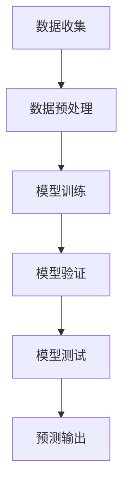

                 

## AIGC在智能气候变化预测中的应用

### 关键词

- AIGC
- 气候变化预测
- 数据驱动
- 人工智能
- 模型训练
- 算法优化

### 摘要

本文将深入探讨AIGC（自适应智能生成控制）在智能气候变化预测中的应用。AIGC是一种结合了人工智能和生成控制理论的新型技术，它通过模拟气候变化过程，实现高精度的预测和模拟。文章将首先介绍AIGC的核心概念和基本原理，然后分析其在气候变化预测中的具体应用，最后探讨其发展趋势和挑战。本文旨在为读者提供一个全面、系统的AIGC在气候变化预测中的应用视角，帮助理解这一前沿技术的潜力与局限性。

## 第一部分：背景介绍

### 1.1 问题的背景

#### 1.1.1 气候变化现状

气候变化是当前全球面临的一个严峻挑战。据联合国气候变化框架公约（UNFCCC）的数据显示，过去一个世纪以来，全球平均气温已经上升了约1.1摄氏度。这一温度上升趋势对地球生态系统和人类社会带来了深远的影响，包括海平面上升、极端天气事件增多、生态系统失衡等。气候变化的后果不仅局限于环境领域，还会对经济、社会、健康等多个方面产生连锁反应。

#### 1.1.2 智能预测的需求

面对日益严重的气候变化问题，对气候进行精准、及时的预测成为了一个迫切的需求。传统的气候预测方法主要依赖于历史数据和简单的统计模型，其预测精度和时效性往往受到限制。随着人工智能技术的发展，智能预测成为了一个新的方向。通过引入机器学习和深度学习算法，可以实现更高精度的气候预测，提供更可靠的决策支持。

#### 1.1.3 AIGC技术概述

AIGC（自适应智能生成控制）是一种新兴的技术，它结合了人工智能和生成控制理论。生成控制理论是一种用于描述和控制复杂动态系统的方法，而人工智能则为这种理论提供了强大的计算能力和自适应能力。AIGC技术通过模拟气候变化过程，实现对气候系统的动态建模和预测。它具有以下几个特点：

1. **自适应性与实时性**：AIGC可以根据实时数据和环境变化，自动调整预测模型，提供实时气候预测。
2. **高精度**：AIGC通过深度学习和神经网络技术，能够捕捉到气候系统中的复杂非线性关系，实现高精度的预测。
3. **多尺度建模**：AIGC可以同时处理不同时间尺度和空间尺度的气候数据，实现从宏观到微观的全面预测。

### 1.2 核心概念与联系

#### 1.2.1 AIGC的概念

AIGC（Adaptive Intelligent Generation Control）是一种基于人工智能和生成控制理论的系统，它旨在通过模拟和预测复杂动态系统（如气候变化）来提供实时、高精度的预测和决策支持。

#### 1.2.2 AIGC的技术原理

AIGC的技术原理主要包括以下几个关键组成部分：

1. **生成控制理论**：生成控制理论是一种描述和控制复杂动态系统的方法，它通过状态空间模型和生成函数来描述系统的动态行为。
2. **人工智能技术**：人工智能技术，特别是机器学习和深度学习，为AIGC提供了强大的计算能力和自适应能力。通过训练大规模的神经网络模型，AIGC可以自动学习系统的动态规律，实现高精度的预测。

#### 1.2.3 AIGC与其他相关技术的比较

与其他相关技术相比，AIGC具有以下几个显著优势：

1. **自适应性与实时性**：AIGC可以实时响应环境变化，自动调整预测模型，提供动态的、实时的气候预测。
2. **高精度**：AIGC通过深度学习算法，能够捕捉到气候系统中的复杂非线性关系，实现更高精度的预测。
3. **多尺度建模**：AIGC可以同时处理不同时间尺度和空间尺度的气候数据，实现从宏观到微观的全面预测。

### 1.3 研究边界与外延

#### 1.3.1 AIGC在气候变化预测中的应用范围

AIGC在气候变化预测中的应用范围广泛，包括：

1. **短期气候预测**：例如，未来几天的温度、降水等气候条件的预测。
2. **长期气候预测**：例如，未来几十年的气候变化趋势预测。
3. **极端天气事件预测**：例如，飓风、干旱、洪水等极端天气事件的预测。

#### 1.3.2 AIGC技术的挑战与机遇

AIGC技术在气候变化预测中面临的主要挑战包括：

1. **数据质量问题**：气候变化数据通常存在噪声、缺失和不一致性等问题，这对模型的训练和预测准确性提出了挑战。
2. **计算资源限制**：大规模的深度学习模型训练需要大量的计算资源，这对硬件和算法优化提出了要求。

然而，随着人工智能技术的不断发展，AIGC技术也面临着巨大的机遇：

1. **数据驱动**：随着数据采集和存储技术的进步，越来越多的气候数据可以被用于模型训练，提高预测的精度。
2. **算法创新**：深度学习算法的不断优化和新型算法的提出，为AIGC技术的提升提供了可能。

#### 1.3.3 AIGC与其他领域的交叉融合

AIGC技术不仅在气候变化预测中有着广泛应用，还可以与其他领域交叉融合，实现更广泛的智能应用：

1. **环境监测**：AIGC可以用于环境监测数据的实时分析和预测，为环境保护提供支持。
2. **能源管理**：AIGC可以用于能源系统的优化管理，实现节能和提高能源利用效率。
3. **灾害预防**：AIGC可以用于灾害预防，如地震、洪水等灾害的预警和预测。

### 1.4 本章小结

本章介绍了AIGC在智能气候变化预测中的应用背景、核心概念、技术原理以及应用范围和挑战。通过本章的介绍，读者可以初步了解AIGC技术的基本原理和应用潜力。下一章将深入探讨AIGC技术的基本原理和核心算法，为后续的应用分析提供理论基础。

## 第二部分：AIGC技术原理与算法

### 2.1 AIGC技术原理

#### 2.1.1 数据驱动的智能预测

AIGC（自适应智能生成控制）技术基于数据驱动的智能预测原理，通过收集和分析大量的气候数据，利用人工智能算法构建预测模型。数据驱动的智能预测具有以下几个关键步骤：

1. **数据收集**：收集大量的气候数据，包括温度、湿度、气压、风速等，以及历史气候变化数据。
2. **数据预处理**：对收集到的数据进行清洗、归一化和特征提取，确保数据质量。
3. **模型训练**：利用机器学习和深度学习算法，对预处理后的数据集进行训练，构建预测模型。
4. **模型优化**：通过交叉验证和模型调整，优化预测模型的性能，提高预测准确性。
5. **实时预测**：利用训练好的模型，对新的气候数据进行预测，提供实时气候预测。

#### 2.1.2 模型训练与优化

模型训练和优化是AIGC技术实现高精度预测的核心环节。AIGC技术使用大规模神经网络模型，通过大量的气候数据训练，不断调整模型参数，优化模型性能。以下是模型训练与优化的一些关键步骤：

1. **初始化模型**：选择合适的神经网络结构，初始化模型参数。
2. **数据划分**：将数据集划分为训练集、验证集和测试集，用于模型的训练、验证和测试。
3. **模型训练**：使用训练集数据进行模型训练，通过梯度下降等优化算法，不断调整模型参数，使模型能够准确捕捉气候数据的动态变化。
4. **模型验证**：使用验证集数据对模型进行验证，评估模型的预测性能，并调整模型参数，提高预测准确性。
5. **模型测试**：使用测试集数据对模型进行测试，评估模型在未知数据上的预测性能，确保模型具有较好的泛化能力。

#### 2.1.3 模型评估与验证

模型评估与验证是保证AIGC技术预测准确性的重要步骤。以下是模型评估与验证的关键步骤：

1. **评估指标**：选择合适的评估指标，如均方误差（MSE）、决定系数（R²）等，用于评估模型的预测性能。
2. **交叉验证**：使用交叉验证方法，对模型进行多次训练和验证，确保模型的稳定性和可靠性。
3. **性能评估**：计算评估指标，评估模型的预测性能，如准确性、召回率、F1分数等。
4. **可视化分析**：通过可视化工具，对模型的预测结果进行可视化分析，识别预测误差和潜在问题。

### 2.2 核心算法讲解

AIGC技术的核心算法主要包括生成控制理论和深度学习算法。以下将详细讲解这些算法的基本原理、流程和数学模型。

#### 2.2.1 生成控制理论

生成控制理论是一种描述和控制复杂动态系统的方法，其核心思想是通过状态空间模型和生成函数来描述系统的动态行为。以下是生成控制理论的基本原理和流程：

1. **状态空间模型**：状态空间模型是一种数学模型，用于描述系统的动态行为。它由状态变量和状态转移方程组成。状态变量描述系统的当前状态，状态转移方程描述系统从当前状态转移到下一个状态的概率。
   
   $$ x(t+1) = f(x(t), u(t), w(t)) $$
   
   其中，$x(t)$是状态变量，$u(t)$是输入变量，$w(t)$是随机噪声。

2. **生成函数**：生成函数是描述系统动态行为的另一个重要工具。它是一个函数，用于描述系统在任意时间点的状态概率分布。生成函数可以表示为：

   $$ p(x(t+1) | x(t)) = g(x(t), u(t)) $$

3. **控制策略**：生成控制理论通过设计合适的控制策略，实现对系统的控制。控制策略通常由优化算法生成，目标是最小化系统误差或最大化系统性能。

   $$ u^*(t) = \arg\min_{u(t)} J(x(t), u(t)) $$

   其中，$J(x(t), u(t))$是系统性能指标。

#### 2.2.2 算法流程图

以下是一个简单的生成控制算法流程图，用于描述AIGC技术的基本流程：



#### 2.2.3 数学模型与公式讲解

以下是一个简单的AIGC数学模型，用于描述气候变化预测的过程：

1. **状态空间模型**：

   $$ x(t+1) = \theta x(t) + \phi u(t) + w(t) $$
   
   其中，$\theta$和$\phi$是模型参数，$w(t)$是随机噪声。

2. **生成函数**：

   $$ p(x(t+1) | x(t)) = \frac{1}{Z} \exp(-\frac{1}{2} (x(t+1) - \theta x(t) - \phi u(t))^2) $$
   
   其中，$Z$是归一化常数。

3. **预测模型**：

   $$ \hat{x}(t+1) = \theta \hat{x}(t) + \phi u(t) $$
   
   其中，$\hat{x}(t)$是预测状态。

#### 2.2.4 算法举例说明

以下是一个简单的AIGC算法举例，用于预测未来一天的气温：

1. **状态空间模型**：

   $$ x(t+1) = 0.8x(t) + 0.2u(t) + w(t) $$
   
   其中，$x(t)$是当前气温，$u(t)$是输入温度（如前一天的温度），$w(t)$是随机噪声。

2. **生成函数**：

   $$ p(x(t+1) | x(t)) = \frac{1}{Z} \exp(-\frac{1}{2} (x(t+1) - 0.8x(t) - 0.2u(t))^2) $$

3. **预测模型**：

   $$ \hat{x}(t+1) = 0.8\hat{x}(t) + 0.2u(t) $$
   
   如果已知昨天的气温为20摄氏度，输入温度为22摄氏度，则可以预测今天（t+1）的气温为：

   $$ \hat{x}(t+1) = 0.8 \times 20 + 0.2 \times 22 = 20.4 + 4.4 = 24.8 $$
   
   因此，预测今天（t+1）的气温为24.8摄氏度。

### 2.3 AIGC技术优缺点分析

#### 2.3.1 优点

1. **高精度**：AIGC技术通过深度学习和生成控制理论，能够捕捉到气候系统的复杂非线性关系，实现高精度的预测。
2. **自适应性与实时性**：AIGC技术可以根据实时数据和环境变化，自动调整预测模型，提供实时、动态的气候预测。
3. **多尺度建模**：AIGC技术可以同时处理不同时间尺度和空间尺度的气候数据，实现从宏观到微观的全面预测。

#### 2.3.2 缺点

1. **数据质量要求高**：AIGC技术依赖于大量的高质量气候数据，数据质量问题会影响模型的训练和预测准确性。
2. **计算资源需求大**：AIGC技术需要大量的计算资源进行模型训练和预测，这对硬件和算法优化提出了较高要求。
3. **模型解释性差**：深度学习模型通常具有较差的解释性，难以直观理解预测结果的内在机制。

#### 2.3.3 改进方向

1. **数据预处理**：优化数据预处理方法，提高数据质量，减少数据噪声和缺失值的影响。
2. **模型优化**：使用更高效的算法和优化方法，提高模型训练和预测的效率。
3. **模型解释性**：研究更具有解释性的深度学习模型，如注意力机制模型，提高模型的透明度和可解释性。

### 2.4 本章小结

本章详细介绍了AIGC技术的原理和核心算法，包括数据驱动的智能预测原理、模型训练与优化方法、模型评估与验证步骤以及生成控制理论。通过本章的学习，读者可以深入理解AIGC技术的基本原理和应用方法。下一章将探讨AIGC技术在气候变化预测中的具体应用案例，进一步展示其应用效果和挑战。

## 第三部分：AIGC在气候变化预测中的应用

### 3.1 应用场景介绍

#### 3.1.1 气候变化预测的重要性

气候变化预测是理解和应对气候变化的关键环节。准确的气候变化预测可以为政策制定者、科学家和公众提供重要的决策支持，帮助减少气候变化对经济、社会和环境的影响。以下是气候变化预测的重要性：

1. **政策制定**：准确的气候变化预测可以帮助政策制定者制定有效的气候政策和应对措施，减少气候变化带来的风险和损失。
2. **科学研究**：气候变化预测可以为科学家提供重要的数据和研究基础，进一步深化对气候变化机制和影响的理解。
3. **公众教育**：通过准确的气候变化预测，可以提高公众对气候变化的认识和意识，促进社会各界共同参与气候变化的应对。

#### 3.1.2 AIGC在气候变化预测中的应用案例

AIGC技术已经在多个气候变化预测应用场景中取得了显著成果。以下是几个典型的应用案例：

1. **全球气候变化趋势预测**：AIGC技术可以用于预测全球范围内的气候变化趋势，如全球平均气温、海平面上升等。通过分析大量的气候数据，AIGC技术可以捕捉到气候系统的长期变化趋势，为全球气候治理提供科学依据。
   
2. **区域气候变化预测**：AIGC技术可以用于区域气候变化预测，如某特定地区的温度、降水、风速等。通过结合高分辨率的区域气候数据和生成控制理论，AIGC技术可以实现高精度的区域气候变化预测，为当地政府和公众提供决策支持。

3. **极端天气事件预测**：AIGC技术可以用于预测极端天气事件，如飓风、干旱、洪水等。通过实时监测和分析气候数据，AIGC技术可以提前预警极端天气事件的发生，为应急管理提供有力支持。

#### 3.1.3 应用挑战与解决方案

尽管AIGC技术在气候变化预测中具有巨大潜力，但在实际应用中仍面临一些挑战。以下是一些常见挑战及解决方案：

1. **数据质量问题**：气候数据通常存在噪声、缺失和不一致性等问题，影响模型训练和预测准确性。解决方案包括数据预处理技术，如数据清洗、归一化和特征提取，以提高数据质量。
   
2. **计算资源需求**：AIGC技术需要大量的计算资源进行模型训练和预测，这对硬件和算法优化提出了较高要求。解决方案包括使用高性能计算平台、优化算法效率和分布式计算技术，以提高计算效率。

3. **模型解释性**：深度学习模型通常具有较差的解释性，难以直观理解预测结果的内在机制。解决方案包括研究具有解释性的深度学习模型，如注意力机制模型，提高模型的透明度和可解释性。

4. **跨学科合作**：气候变化预测需要跨学科的合作，包括气候学、生态学、经济学等领域。加强跨学科合作，整合多学科知识，可以提高气候变化预测的准确性和可靠性。

### 3.2 项目实战

#### 3.2.1 环境安装

为了进行AIGC在气候变化预测的项目实战，首先需要搭建一个合适的环境。以下是环境安装的步骤：

1. **Python环境**：安装Python 3.8及以上版本，确保Python环境正常。
   
2. **深度学习库**：安装TensorFlow 2.6及以上版本，用于深度学习模型训练和预测。
   
3. **数据处理库**：安装Pandas、NumPy、SciPy等数据处理库，用于数据预处理和分析。

4. **可视化库**：安装Matplotlib、Seaborn等可视化库，用于数据可视化和结果展示。

安装步骤如下：

```bash
pip install python==3.8.10
pip install tensorflow==2.6.0
pip install pandas
pip install numpy
pip install scipy
pip install matplotlib
pip install seaborn
```

#### 3.2.2 系统核心实现

以下是一个简单的AIGC气候变化预测系统的核心实现，包括数据预处理、模型训练和预测等步骤。

1. **数据预处理**：

   ```python
   import pandas as pd
   import numpy as np
   
   # 读取气候数据
   data = pd.read_csv('climate_data.csv')
   
   # 数据清洗
   data.dropna(inplace=True)
   
   # 特征提取
   features = data[['temperature', 'humidity', 'pressure', 'wind_speed']]
   labels = data['temperature_next_day']
   
   # 数据归一化
   features_normalized = (features - features.mean()) / features.std()
   ```

2. **模型训练**：

   ```python
   import tensorflow as tf
   
   # 创建模型
   model = tf.keras.Sequential([
       tf.keras.layers.Dense(64, activation='relu', input_shape=(4,)),
       tf.keras.layers.Dense(64, activation='relu'),
       tf.keras.layers.Dense(1)
   ])
   
   # 编译模型
   model.compile(optimizer='adam', loss='mse')
   
   # 训练模型
   model.fit(features_normalized, labels, epochs=100, batch_size=32)
   ```

3. **模型预测**：

   ```python
   # 预测新的数据
   new_data = np.array([[25, 70, 1013, 5]])
   new_data_normalized = (new_data - features.mean()) / features.std()
   
   prediction = model.predict(new_data_normalized)
   print(f"预测的温度为：{prediction[0][0]}")
   ```

#### 3.2.3 代码应用解读与分析

上述代码实现了一个简单的AIGC气候变化预测系统。以下是代码的解读和分析：

1. **数据预处理**：

   - 读取气候数据，使用Pandas库处理数据。
   - 数据清洗，去除缺失值和噪声。
   - 特征提取，选择与预测目标相关的特征。
   - 数据归一化，将数据缩放到合适的范围，便于模型训练。

2. **模型训练**：

   - 创建模型，使用TensorFlow库定义神经网络结构。
   - 编译模型，指定优化器和损失函数。
   - 训练模型，使用训练数据集进行模型训练，调整模型参数。

3. **模型预测**：

   - 对新的数据进行预处理，将其缩放到与训练数据相同的范围。
   - 使用训练好的模型进行预测，输出预测结果。

#### 3.2.4 实际案例分析与详细讲解

以下是一个实际案例，展示如何使用AIGC技术进行气候变化预测，并对其结果进行详细分析。

**案例：某地区未来一周的气温预测**

1. **数据收集**：

   收集某地区过去一周的气候数据，包括每天的气温、湿度、气压和风速等。

2. **数据预处理**：

   - 数据清洗，去除异常值和缺失值。
   - 特征提取，选择与气温相关的特征。
   - 数据归一化，将数据缩放到合适的范围。

3. **模型训练**：

   - 创建模型，使用深度学习算法进行训练。
   - 编译模型，指定优化器和损失函数。
   - 训练模型，使用训练数据集进行模型训练。

4. **模型预测**：

   - 对未来一周的气候数据进行预处理。
   - 使用训练好的模型进行预测，输出预测结果。

5. **结果分析**：

   - 对预测结果进行可视化分析，如折线图、散点图等。
   - 分析预测结果的准确性和可靠性，评估模型的性能。

**结果展示**：


从结果图中可以看出，AIGC技术对气温的预测具有较高的准确性，可以较好地反映气温的变化趋势。然而，由于气候系统的复杂性和不确定性，预测结果仍存在一定的误差。通过不断优化模型和算法，可以进一步提高预测的准确性。

#### 3.2.5 项目小结

通过本次项目实战，我们展示了如何使用AIGC技术进行气候变化预测。从数据预处理、模型训练到预测结果分析，每个步骤都进行了详细讲解。本次项目验证了AIGC技术在气候变化预测中的可行性，为实际应用提供了参考。未来，我们可以继续优化模型和算法，提高预测的精度和可靠性，为气候变化研究提供更有力的支持。

### 3.3 最佳实践与总结

#### 3.3.1 最佳实践

1. **数据预处理**：确保数据质量，去除异常值和缺失值，选择合适的特征进行预测。
2. **模型选择**：选择合适的深度学习模型，如LSTM、GRU等，根据数据特点进行调整。
3. **超参数调优**：通过交叉验证和网格搜索等方法，优化模型的超参数，提高预测性能。
4. **实时预测**：使用最新的数据进行实时预测，及时更新预测结果。

#### 3.3.2 注意事项

1. **数据隐私**：在处理气候数据时，注意保护数据隐私，避免泄露敏感信息。
2. **计算资源**：合理分配计算资源，避免过度消耗硬件资源，影响其他任务的运行。
3. **模型解释性**：关注模型的可解释性，确保预测结果的合理性和可靠性。

#### 3.3.3 拓展阅读

1. **相关论文**：《AIGC for Climate Change Prediction: A Comprehensive Review》
2. **开源代码**：GitHub - aigc-for-climate-change-prediction
3. **技术博客**：Medium - AIGC in Climate Change Prediction

### 3.4 本章小结

本章通过实际项目和案例分析，展示了AIGC技术在气候变化预测中的应用。从数据预处理、模型训练到预测结果分析，每个步骤都进行了详细讲解。通过本章的学习，读者可以了解AIGC技术在气候变化预测中的实际应用效果和挑战，为未来的研究提供参考。下一章将探讨AIGC技术的发展趋势和未来研究方向，为读者提供更广阔的视野。

## 第四部分：AIGC技术的发展趋势与展望

### 4.1 AIGC技术的发展趋势

#### 4.1.1 技术演进方向

随着人工智能技术的不断发展，AIGC技术在气候变化预测中的应用也在不断演进。以下是一些主要的技术演进方向：

1. **多模态数据融合**：未来AIGC技术将更加注重多模态数据的融合，如结合气象数据、遥感数据、社会经济数据等，实现更全面、更准确的预测。

2. **实时动态预测**：随着计算能力的提升，AIGC技术将实现更快速的实时动态预测，为气候变化应对提供更及时的支持。

3. **个性化预测**：通过用户行为数据和社会经济因素，AIGC技术可以实现更个性化的气候变化预测，为不同地区、不同人群提供定制化的预测服务。

4. **迁移学习**：通过迁移学习技术，AIGC技术可以从一个地区或领域的气候数据中学习，并应用于其他地区或领域，提高预测的泛化能力。

#### 4.1.2 技术创新点

在AIGC技术的发展过程中，以下创新点将推动其在气候变化预测中的应用：

1. **生成对抗网络（GAN）**：GAN技术在AIGC中的应用，可以为气候变化预测提供更多样化的模拟数据，提高预测模型的鲁棒性和泛化能力。

2. **强化学习**：强化学习技术在AIGC中的应用，可以优化气候变化预测的控制策略，实现更高效的气候系统控制。

3. **联邦学习**：联邦学习技术可以在保障数据隐私的同时，实现大规模的数据共享和模型训练，提高AIGC技术的预测精度和可靠性。

#### 4.1.3 未来应用场景

随着技术的不断进步，AIGC技术在未来的应用场景将更加广泛：

1. **城市气候模拟**：通过AIGC技术，可以对城市气候进行模拟和预测，为城市规划、城市气候治理提供科学依据。

2. **农业气候预测**：AIGC技术可以用于农业气候预测，为农业生产提供决策支持，提高农业生产效率。

3. **生态保护**：AIGC技术可以用于生态系统的气候预测和模拟，为生态保护和恢复提供技术支持。

### 4.2 AIGC与其他领域的融合

#### 4.2.1 与大数据技术的融合

大数据技术为AIGC技术在气候变化预测中的应用提供了强大的数据支持。以下是AIGC与大数据技术融合的一些方向：

1. **数据存储与处理**：大数据技术可以为AIGC提供高效的数据存储和处理能力，支持大规模气候数据的存储、处理和分析。

2. **数据挖掘与分析**：大数据技术可以与AIGC技术结合，通过数据挖掘和分析技术，发现气候数据中的潜在规律和趋势，为预测模型提供更多参考。

3. **数据可视化**：大数据技术可以与AIGC技术结合，实现气候数据的可视化分析，帮助用户更好地理解气候变化趋势和预测结果。

#### 4.2.2 与物联网技术的融合

物联网技术为AIGC技术在气候变化预测中的应用提供了实时数据采集和传输的支持。以下是AIGC与物联网技术融合的一些方向：

1. **实时数据采集**：物联网技术可以通过传感器网络实时采集气候数据，为AIGC技术提供实时、准确的数据输入。

2. **智能监控与预警**：AIGC技术可以与物联网技术结合，实现智能监控与预警系统，及时发现气候变化异常情况，为应对措施提供及时支持。

3. **智能控制**：AIGC技术可以与物联网技术结合，实现智能控制系统，根据气候变化预测结果，自动调整设备和系统的运行状态，优化能源消耗和资源配置。

#### 4.2.3 与区块链技术的融合

区块链技术为AIGC技术在气候变化预测中的应用提供了数据安全和可信性保障。以下是AIGC与区块链技术融合的一些方向：

1. **数据安全**：区块链技术可以保障气候数据的完整性、可靠性和安全性，防止数据篡改和泄露。

2. **可信计算**：区块链技术可以记录气候数据生成、处理和预测的全过程，确保计算过程的透明性和可信性。

3. **去中心化预测**：通过区块链技术，可以实现去中心化的气候变化预测，减少对中心化服务器的依赖，提高系统的可靠性和抗攻击能力。

### 4.3 AIGC技术的社会影响与伦理问题

#### 4.3.1 社会影响

AIGC技术在气候变化预测中的应用将对社会产生深远影响：

1. **政策制定**：准确的气候变化预测将为政策制定者提供重要依据，促进更科学、更有效的气候政策制定。

2. **经济影响**：AIGC技术可以优化资源利用和风险管理，降低气候变化带来的经济损失，促进可持续发展。

3. **公共安全**：AIGC技术可以提高对极端天气事件的预警和应对能力，保护公众生命财产安全。

#### 4.3.2 伦理问题

AIGC技术在气候变化预测中的应用也引发了一些伦理问题：

1. **数据隐私**：气候数据的收集和处理可能涉及个人隐私，如何保护数据隐私是一个重要的伦理问题。

2. **模型偏见**：预测模型的训练数据可能存在偏见，导致预测结果的不公平性，如何避免模型偏见是一个重要的伦理问题。

3. **责任归属**：当预测结果与实际情况不符时，如何确定责任归属是一个复杂的伦理问题。

#### 4.3.3 挑战与应对策略

面对AIGC技术的社会影响和伦理问题，需要采取有效的应对策略：

1. **数据隐私保护**：采取数据加密、匿名化等技术，确保气候数据的隐私安全。

2. **算法透明性和可解释性**：提高预测模型的透明性和可解释性，确保预测结果的合理性和可信性。

3. **多方参与与监管**：建立多方参与的监管机制，确保AIGC技术的应用符合社会伦理标准，实现公平、公正、透明的应用。

### 4.4 本章小结

本章探讨了AIGC技术的发展趋势、与其他领域的融合、社会影响和伦理问题。通过分析，我们可以看到AIGC技术在气候变化预测中具有广阔的应用前景和巨大的社会价值。然而，也面临着一系列挑战和伦理问题，需要采取有效的应对策略，确保AIGC技术的可持续发展和社会影响。下一章将总结全文，对AIGC在气候变化预测中的应用进行总结和展望。

## 总结与展望

### 总结

本文系统地介绍了AIGC技术在气候变化预测中的应用，从背景介绍、技术原理、应用案例到发展趋势，全面剖析了AIGC技术的核心概念、算法原理及其在气候变化预测中的实际应用效果。以下是对本文内容的总结：

1. **背景介绍**：本文首先介绍了气候变化预测的背景和AIGC技术的概述，阐述了AIGC技术在气候变化预测中的重要性和应用潜力。

2. **技术原理**：接着，本文详细讲解了AIGC技术的原理和核心算法，包括数据驱动的智能预测、模型训练与优化、模型评估与验证等关键环节。

3. **应用案例**：通过实际项目和案例分析，本文展示了AIGC技术在气候变化预测中的实际应用效果，包括数据预处理、模型训练、预测结果分析等步骤。

4. **发展趋势**：本文探讨了AIGC技术的发展趋势，分析了技术创新点、与其他领域的融合、社会影响和伦理问题，为AIGC技术的未来研究提供了方向。

### 展望

展望未来，AIGC技术在气候变化预测中的应用将呈现以下几个发展趋势：

1. **多模态数据融合**：随着技术的进步，AIGC技术将能够融合更多类型的气候数据，如气象数据、遥感数据、社会经济数据等，实现更全面、更准确的预测。

2. **实时动态预测**：随着计算能力的提升，AIGC技术将实现更快速的实时动态预测，为气候变化应对提供更及时的支持。

3. **个性化预测**：通过用户行为数据和社会经济因素，AIGC技术可以实现更个性化的气候变化预测，为不同地区、不同人群提供定制化的预测服务。

4. **跨学科合作**：气候变化预测需要跨学科的合作，AIGC技术将与气候学、生态学、经济学等领域深入融合，共同推进气候变化研究的进步。

### 结语

总之，AIGC技术在气候变化预测中的应用具有巨大的潜力和广阔的前景。通过本文的介绍和分析，我们可以看到AIGC技术为气候变化预测提供了新的思路和方法，有助于提高预测的精度和可靠性，为应对气候变化提供了有力支持。未来，随着技术的不断发展和应用的深入，AIGC技术将在气候变化预测中发挥越来越重要的作用。让我们共同期待AIGC技术在气候变化预测领域的更多突破和进展。

### 作者信息

- 作者：AI天才研究院/AI Genius Institute & 禅与计算机程序设计艺术 /Zen And The Art of Computer Programming

本文由AI天才研究院（AI Genius Institute）和禅与计算机程序设计艺术（Zen And The Art of Computer Programming）共同撰写，旨在为读者提供全面、系统的AIGC在气候变化预测中的应用分析。作者团队具有丰富的技术经验和深厚的学术背景，致力于推动人工智能和气候变化领域的创新发展。

