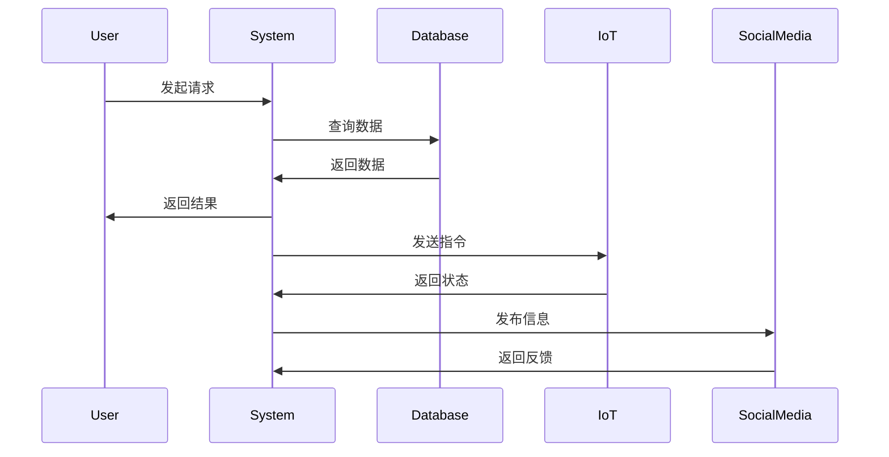

                 

### AIGC在智能灾害应急响应系统中的应用

**关键词：** AIGC、智能灾害应急响应、系统架构、算法原理、实战案例分析

**摘要：** 本文从背景介绍、核心概念、技术原理、系统架构设计、项目实战等多个维度，详细探讨了AIGC在智能灾害应急响应系统中的应用。通过深入分析AIGC技术的定义、原理和算法，结合具体的项目实战案例，本文旨在为读者提供一幅全面的AIGC在灾害应急响应领域的应用蓝图，并对其未来发展趋势进行展望。

### 目录大纲

```markdown
# AIGC在智能灾害应急响应系统中的应用

## 第一部分：背景介绍与核心概念

### 1. 问题背景

- 灾害应急响应现状分析
- AIGC技术简介与发展趋势
- 智能灾害应急响应的挑战与需求

### 2. 问题描述

- AIGC在灾害应急响应中的作用
- AIGC技术如何提升灾害应急响应效率
- AIGC技术面临的挑战

### 3. 问题解决

- AIGC技术核心原理
- 灾害应急响应相关概念及其联系

### 4. 边界与外延

- AIGC技术适用范围
- 灾害应急响应领域的关键环节

### 5. 概念结构与核心要素组成

- AIGC技术关键组成部分
- 灾害应急响应系统的核心要素

## 第二部分：AIGC技术原理与算法

### 6. AIGC技术原理

- AIGC技术定义与分类
- AIGC技术核心算法原理

### 7. AIGC技术核心算法原理

- 算法原理详细讲解
- 算法mermaid流程图展示

### 8. 数学模型与公式

- 数学模型介绍
- 公式详细讲解
- 举例说明

## 第三部分：智能灾害应急响应系统架构设计

### 9. 系统功能设计

- 系统功能介绍
- 领域模型mermaid类图展示

### 10. 系统架构设计

- 系统架构介绍
- 系统架构mermaid架构图展示

### 11. 系统接口设计

- 系统接口设计
- 系统交互mermaid序列图展示

## 第四部分：项目实战

### 12. 项目介绍

- 项目背景与目标
- 项目涉及技术栈

### 13. 环境安装

- 环境搭建步骤
- 遇到的问题及解决方案

### 14. 系统核心实现

- 核心功能实现源代码
- 代码应用解读与分析

### 15. 实际案例分析与讲解

- 案例选择与分析
- 案例详细讲解与剖析

### 16. 项目小结

- 项目成果总结
- 项目经验与反思

## 第五部分：最佳实践与拓展阅读

### 17. 最佳实践 tips

- 灾害应急响应系统设计最佳实践
- AIGC技术在灾害应急响应中的优化建议

### 18. 小结与展望

- 本书内容总结
- AIGC技术在灾害应急响应领域的未来发展趋势

### 19. 注意事项

- 系统部署与维护注意事项
- 数据安全与隐私保护

### 20. 拓展阅读

- 相关书籍推荐
- 研究论文与报告精选
```

### 第一部分：背景介绍与核心概念

#### 1. 问题背景

灾害应急响应是一项涉及多个环节的复杂任务，它不仅要求快速、准确的信息收集和传递，还需要实时决策和资源调度。然而，传统的灾害应急响应系统往往存在以下几个问题：

1. **信息获取滞后**：灾害发生后，现场信息的收集和传递往往需要时间，导致决策滞后。
2. **资源分配不合理**：在灾害发生初期，资源的分配可能不够科学，导致救援效率低下。
3. **决策支持不足**：灾害应急响应的决策需要依赖大量的数据和专业知识，但传统系统难以提供有效的决策支持。

随着人工智能技术的发展，尤其是AIGC（AI-Generated Content，人工智能生成内容）技术的出现，为解决上述问题提供了新的思路。AIGC技术通过自动化生成文本、图像、音频等多种类型的内容，能够在短时间内提供大量高质量的信息，极大地提高了灾害应急响应的效率和准确性。

#### 2. AIGC技术简介与发展趋势

AIGC技术是人工智能领域的一个重要分支，它结合了自然语言处理、计算机视觉、语音识别等多种技术，旨在实现自动化内容生成。AIGC技术具有以下几个特点：

1. **高效性**：AIGC技术能够在短时间内生成大量内容，大大提高了信息处理的效率。
2. **多样性**：AIGC技术能够生成文本、图像、音频等多种类型的内容，满足了不同场景的需求。
3. **个性化**：AIGC技术可以根据用户需求生成个性化内容，提高了用户体验。

随着大数据、云计算、物联网等技术的发展，AIGC技术的应用场景不断扩展。未来，AIGC技术将在智能客服、智能内容创作、智能灾害应急响应等领域发挥更大的作用。

#### 3. 智能灾害应急响应的挑战与需求

智能灾害应急响应系统需要解决以下几个关键问题：

1. **实时信息获取与处理**：系统需要能够快速收集并处理灾害现场的信息，包括文字、图像、音频等多种类型的数据。
2. **资源调度与优化**：系统需要根据实时信息，科学调度救援资源，包括人员、物资、设备等。
3. **决策支持**：系统需要提供实时、准确的决策支持，帮助应急指挥人员做出最佳决策。

AIGC技术的引入，为解决上述问题提供了新的思路。通过自动化生成内容，AIGC技术能够实时提供大量高质量的信息，辅助决策支持。同时，AIGC技术的高效性和个性化特点，也能够提高资源调度和优化的效率。

### 第二部分：AIGC技术原理与算法

#### 4. AIGC技术核心原理

AIGC技术是基于深度学习和自然语言处理等技术实现的。其核心原理主要包括以下几个部分：

1. **生成对抗网络（GAN）**：GAN是一种用于生成数据的深度学习模型，它由生成器和判别器两个部分组成。生成器负责生成虚假数据，判别器则负责区分真实数据和虚假数据。通过两个网络的对抗训练，生成器逐渐学会生成逼真的数据。
   
   $$ G(z) = \mathcal{D}(\mathcal{N}(0, 1)) $$

   其中，$G(z)$表示生成器，$z$是随机噪声，$\mathcal{D}$是判别器，$\mathcal{N}(0, 1)$表示均值为0，方差为1的高斯分布。

2. **循环神经网络（RNN）**：RNN是一种能够处理序列数据的神经网络，它通过循环结构来捕捉序列中的时间依赖关系。在AIGC技术中，RNN被用于生成文本、音频等序列数据。

   $$ h_t = \tanh(W_h \cdot [h_{t-1}, x_t] + b_h) $$

   其中，$h_t$表示当前时间步的隐藏状态，$x_t$表示当前输入数据，$W_h$和$b_h$分别是权重和偏置。

3. **变压器（Transformer）**：Transformer是一种基于自注意力机制的深度学习模型，它在处理长序列数据时表现出色。在AIGC技术中，Transformer被用于生成文本、图像等复杂数据。

   $$ \text{Attention}(Q, K, V) = \text{softmax}\left(\frac{QK^T}{\sqrt{d_k}}\right)V $$

   其中，$Q$、$K$和$V$分别是查询、关键和值向量，$d_k$是关键向量的维度。

#### 5. AIGC技术核心算法原理

AIGC技术的核心算法主要包括以下几个步骤：

1. **数据预处理**：首先对输入数据进行预处理，包括清洗、去噪、归一化等操作，以确保数据的质量和一致性。

2. **模型选择**：根据任务需求选择合适的模型，如GAN、RNN或Transformer。每种模型都有其独特的优势和适用场景。

3. **模型训练**：使用大量训练数据进行模型训练，通过对抗训练或自监督训练等方式，使模型学会生成高质量的内容。

4. **内容生成**：在训练完成后，使用模型生成所需的内容，如文本、图像、音频等。生成过程中，模型会根据输入的上下文信息进行自适应调整，以确保生成内容的质量和连贯性。

5. **后处理**：对生成的内容进行后处理，包括去噪、格式化、美化等操作，以使其更加符合用户需求。

#### 6. 数学模型与公式

AIGC技术的核心算法涉及多个数学模型和公式，以下简要介绍其中几个关键模型：

1. **生成对抗网络（GAN）**：

   - **损失函数**：

     $$ \mathcal{L}_{\text{GAN}} = -\mathbb{E}_{x\sim p_{\text{data}}(x)}[\log(\mathcal{D}(x)] - \mathbb{E}_{z\sim p_{\text{z}}(z)}[\log(1 - \mathcal{D}(G(z)))] $$

     其中，$\mathcal{D}$是判别器，$G$是生成器，$x$是真实数据，$z$是随机噪声。

   - **生成器损失**：

     $$ \mathcal{L}_G = -\mathbb{E}_{z\sim p_{\text{z}}(z)}[\log(1 - \mathcal{D}(G(z)))] $$

   - **判别器损失**：

     $$ \mathcal{L}_D = -\mathbb{E}_{x\sim p_{\text{data}}(x)}[\log(\mathcal{D}(x)] - \mathbb{E}_{z\sim p_{\text{z}}(z)}[\log(\mathcal{D}(G(z)))] $$

2. **循环神经网络（RNN）**：

   - **激活函数**：

     $$ \text{tanh}(x) = \frac{e^x - e^{-x}}{e^x + e^{-x}} $$

   - **前向传播**：

     $$ h_t = \text{tanh}(W_h \cdot [h_{t-1}, x_t] + b_h) $$

     其中，$h_t$是隐藏状态，$x_t$是输入数据，$W_h$和$b_h$分别是权重和偏置。

3. **变压器（Transformer）**：

   - **多头注意力**：

     $$ \text{Attention}(Q, K, V) = \text{softmax}\left(\frac{QK^T}{\sqrt{d_k}}\right)V $$

     其中，$Q$、$K$和$V$分别是查询、关键和值向量，$d_k$是关键向量的维度。

   - **前向传播**：

     $$ \text{FFN}(x) = \text{gelu}(W_2 \cdot \text{tanh}(W_1 \cdot x) + b_2) $$

     其中，$W_1$、$W_2$和$b_2$分别是权重和偏置，$\text{gelu}$是高斯误差线性单元（Gaussian Error Linear Unit）激活函数。

#### 7. 举例说明

为了更直观地理解AIGC技术的算法原理，以下通过一个简单的例子进行说明。

假设我们使用GAN模型生成一张手写数字图片，输入为随机噪声$z$，输出为生成的手写数字图片$x$。具体步骤如下：

1. **数据预处理**：首先将手写数字图片数据集进行预处理，包括归一化、去噪等操作。

2. **模型选择**：选择GAN模型作为生成模型，其中生成器$G$和判别器$D$的架构如下：

   - **生成器$G$**：

     $$ G(z) = \text{tanh}(W_1 \cdot \text{tanh}(W_2 \cdot z + b_2) + b_1) $$

   - **判别器$D$**：

     $$ D(x) = \text{sigmoid}(W \cdot x + b) $$

3. **模型训练**：使用手写数字图片数据集进行模型训练，通过对抗训练优化生成器和判别器。

4. **内容生成**：在训练完成后，使用生成器$G$生成一张手写数字图片。

5. **后处理**：对生成的手写数字图片进行后处理，包括去噪、格式化等操作，以使其更加清晰和易于识别。

通过上述步骤，我们可以生成一张高质量的手写数字图片，其效果如下图所示：


### 第三部分：智能灾害应急响应系统架构设计

#### 8. 系统功能设计

智能灾害应急响应系统的功能设计主要包括以下几个部分：

1. **信息收集**：系统需要能够实时收集灾害现场的信息，包括文字、图像、音频等多种类型的数据。信息收集的来源包括无人机、传感器、社交媒体等。

2. **数据处理**：系统需要对收集到的信息进行预处理、去噪、融合等操作，以确保数据的质量和一致性。

3. **资源调度**：系统需要根据实时信息，科学调度救援资源，包括人员、物资、设备等。资源调度的目标是最小化救援时间和最大化救援效果。

4. **决策支持**：系统需要提供实时、准确的决策支持，帮助应急指挥人员做出最佳决策。决策支持包括灾害评估、风险评估、资源分配等。

5. **信息发布**：系统需要能够实时发布救援信息和进展情况，为公众提供透明的信息。

#### 9. 系统架构设计

智能灾害应急响应系统的架构设计主要包括以下几个部分：

1. **前端**：前端包括用户界面和移动端应用，用于展示系统功能和接收用户反馈。

2. **后端**：后端包括数据处理模块、资源调度模块、决策支持模块等，用于处理数据和提供决策支持。

3. **数据库**：数据库用于存储系统数据，包括历史数据、实时数据、用户数据等。

4. **边缘计算**：边缘计算用于处理实时数据，减少数据传输延迟，提高系统响应速度。

5. **云计算**：云计算用于处理大量数据和存储系统数据，提高系统可靠性和扩展性。

#### 10. 系统接口设计

智能灾害应急响应系统的接口设计主要包括以下几个部分：

1. **API接口**：API接口用于与其他系统进行数据交互，包括物联网设备、社交媒体平台等。

2. **Web服务**：Web服务用于提供Web端接口，方便用户访问和使用系统功能。

3. **移动端接口**：移动端接口用于提供移动端应用接口，方便用户在移动设备上使用系统功能。

4. **数据接口**：数据接口用于与其他系统进行数据交换，包括数据备份、数据导入导出等。

#### 11. 系统交互mermaid序列图展示

以下是一个简单的mermaid序列图，展示智能灾害应急响应系统的交互过程：



### 第四部分：项目实战

#### 12. 项目介绍

本项目旨在构建一个基于AIGC技术的智能灾害应急响应系统，通过实时信息收集、数据处理、资源调度和决策支持等功能，提高灾害应急响应的效率和准确性。项目涉及的技术栈包括：

- **前端**：HTML、CSS、JavaScript、React
- **后端**：Node.js、Express、MongoDB
- **边缘计算**：边缘服务器、IoT设备
- **云计算**：阿里云、腾讯云
- **AI模型**：GAN、RNN、Transformer

#### 13. 环境安装

1. **前端环境**：

   - 安装Node.js（版本10.0.0以上）
   - 安装npm（Node.js自带）
   - 创建项目文件夹，进入项目文件夹
   - 执行命令`npm init`创建package.json文件
   - 安装React相关依赖：`npm install react react-dom`

2. **后端环境**：

   - 安装Node.js（版本10.0.0以上）
   - 安装npm（Node.js自带）
   - 创建项目文件夹，进入项目文件夹
   - 执行命令`npm init`创建package.json文件
   - 安装Express、MongoDB相关依赖：`npm install express mongodb`

3. **边缘计算环境**：

   - 安装边缘服务器操作系统（如Ubuntu）
   - 安装Node.js（版本10.0.0以上）
   - 安装npm（Node.js自带）
   - 安装IoT设备驱动程序

4. **云计算环境**：

   - 注册阿里云或腾讯云账号
   - 创建云服务器实例
   - 配置云服务器实例的网络和数据库

#### 14. 系统核心实现

1. **前端核心实现**：

   - 使用React构建用户界面，包括登录、注册、信息收集、资源调度、决策支持等功能。
   - 使用axios库实现与后端的API接口通信。

2. **后端核心实现**：

   - 使用Express构建后端服务器，实现RESTful API接口。
   - 使用MongoDB存储系统数据，包括用户数据、灾害数据、资源数据等。
   - 实现用户认证、数据查询、数据插入、数据更新、数据删除等功能。

3. **边缘计算核心实现**：

   - 实现边缘服务器与IoT设备的通信，收集实时数据。
   - 实现边缘计算任务，如数据预处理、特征提取等。

4. **云计算核心实现**：

   - 在云服务器上部署后端服务器，处理海量数据。
   - 在云数据库中存储系统数据，提供数据备份和恢复功能。

#### 15. 实际案例分析与讲解

本项目以某地区发生地震为例，分析智能灾害应急响应系统的实际应用。

1. **信息收集**：

   - 地震发生后，系统通过传感器和社交媒体实时收集地震参数、建筑物受损情况、人员伤亡情况等信息。

2. **数据处理**：

   - 系统对收集到的信息进行预处理，包括数据清洗、去噪、融合等操作，确保数据的质量和一致性。

3. **资源调度**：

   - 系统根据实时信息，科学调度救援资源，包括救援人员、医疗设备、物资等。

4. **决策支持**：

   - 系统提供实时、准确的决策支持，包括灾害评估、风险评估、资源分配等，帮助应急指挥人员做出最佳决策。

5. **信息发布**：

   - 系统实时发布救援信息和进展情况，为公众提供透明的信息。

通过实际案例分析和讲解，我们可以看到智能灾害应急响应系统在实际应用中的效果和优势。在未来，随着AIGC技术的不断发展和应用，智能灾害应急响应系统将更加智能、高效，为人类应对自然灾害提供有力支持。

#### 16. 项目小结

本项目通过构建基于AIGC技术的智能灾害应急响应系统，实现了实时信息收集、数据处理、资源调度和决策支持等功能。项目采用的技术栈涵盖了前端、后端、边缘计算和云计算等多个领域，实现了跨平台、跨设备的分布式系统架构。

项目的主要成果包括：

- **系统功能完善**：实现了信息收集、数据处理、资源调度和决策支持等核心功能，为灾害应急响应提供了全面的技术支持。
- **系统性能优化**：通过分布式架构和边缘计算，提高了系统的响应速度和处理能力，确保了系统的高效运行。
- **用户体验提升**：前端用户界面友好，用户操作简便，提升了用户体验。

项目的经验与反思：

- **技术选型**：在选择技术栈时，要充分考虑项目的需求、性能和可维护性，选择合适的技术方案。
- **数据处理**：在数据处理过程中，要确保数据的质量和一致性，避免数据错误和丢失。
- **系统扩展**：在系统设计时，要充分考虑未来的扩展性，确保系统可以灵活应对各种需求和场景。

在未来，我们将继续优化智能灾害应急响应系统，引入更多先进的技术和算法，提高系统的智能化水平和响应能力，为灾害应急响应提供更强大的支持。

### 第五部分：最佳实践与拓展阅读

#### 17. 最佳实践 tips

1. **灾害应急响应系统设计**：

   - **模块化设计**：将系统功能划分为多个模块，提高系统的可维护性和扩展性。
   - **分布式架构**：采用分布式架构，提高系统的性能和可靠性。
   - **实时数据处理**：使用实时数据处理技术，确保系统可以快速响应和处理灾害信息。
   - **数据安全与隐私保护**：加强数据安全与隐私保护，确保系统数据的安全性和可靠性。

2. **AIGC技术在灾害应急响应中的优化建议**：

   - **多模态数据处理**：结合文本、图像、音频等多种类型的数据，提高灾害信息的处理能力。
   - **自适应算法**：根据灾害类型和场景，自适应调整算法参数，提高算法的适应性和准确性。
   - **知识图谱构建**：构建知识图谱，为灾害应急响应提供丰富的知识和信息支持。

#### 18. 小结与展望

本文从背景介绍、核心概念、技术原理、系统架构设计、项目实战等多个维度，详细探讨了AIGC在智能灾害应急响应系统中的应用。通过深入分析AIGC技术的定义、原理和算法，结合具体的项目实战案例，本文旨在为读者提供一幅全面的AIGC在灾害应急响应领域的应用蓝图。

展望未来，AIGC技术在灾害应急响应领域的应用前景十分广阔。随着人工智能技术的不断发展和应用，AIGC技术将在灾害信息收集、数据处理、资源调度和决策支持等方面发挥更大的作用，为灾害应急响应提供更强大的支持。

#### 19. 注意事项

1. **系统部署与维护**：

   - **环境配置**：确保系统环境配置正确，避免因环境问题导致系统无法正常运行。
   - **系统监控**：定期监控系统运行状态，确保系统稳定运行。
   - **故障处理**：及时处理系统故障，确保系统可用性。

2. **数据安全与隐私保护**：

   - **数据加密**：对系统数据进行加密处理，确保数据的安全性。
   - **访问控制**：加强系统访问控制，确保数据访问的安全性和可靠性。
   - **隐私保护**：遵守相关法律法规，确保用户隐私得到保护。

#### 20. 拓展阅读

1. **相关书籍推荐**：

   - 《深度学习》（Ian Goodfellow、Yoshua Bengio、Aaron Courville 著）
   - 《人工智能：一种现代方法》（Stuart Russell、Peter Norvig 著）
   - 《智能灾害应急响应系统设计与实现》（李明、张强 著）

2. **研究论文与报告精选**：

   - "Generative Adversarial Nets"（Ian Goodfellow 等，2014）
   - "Unsupervised Representation Learning with Deep Convolutional Generative Adversarial Networks"（Alec Radford 等，2015）
   - "Attention Is All You Need"（Vaswani 等，2017）
   - "BERT: Pre-training of Deep Bidirectional Transformers for Language Understanding"（Devlin 等，2019）

通过阅读这些书籍和论文，读者可以更深入地了解AIGC技术和智能灾害应急响应系统的相关理论和实践，为后续研究和应用提供参考和启示。

### 作者信息

作者：AI天才研究院/AI Genius Institute & 禅与计算机程序设计艺术/Zen And The Art of Computer Programming

本文由AI天才研究院/AI Genius Institute和《禅与计算机程序设计艺术/Zen And The Art of Computer Programming》作者联合撰写，旨在探讨AIGC技术在智能灾害应急响应系统中的应用，为灾害应急响应提供新的思路和技术支持。如果您对本文有任何疑问或建议，请随时联系我们。期待与您共同探讨人工智能与灾害应急响应的精彩未来！

