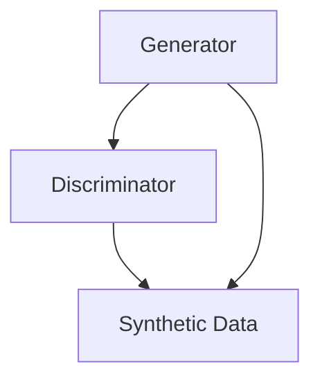
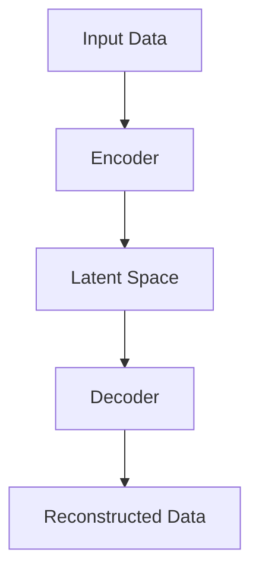
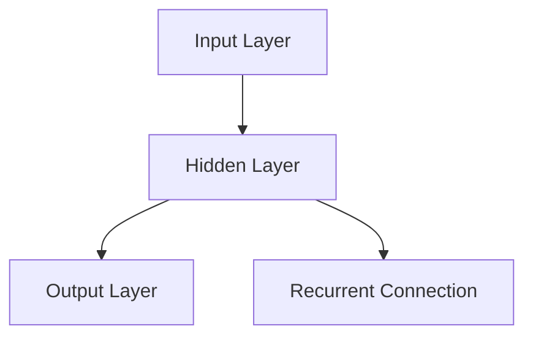

                 

# AIGC in the Application of Intelligent Disaster Warning Systems

## Keywords
- **AIGC**
- **Intelligent Disaster Warning Systems**
- **Machine Learning**
- **Predictive Analytics**
- **Natural Language Processing**
- **Data Mining**
- **Deep Learning**

## Abstract
This article delves into the transformative role of Artificial Intelligence with Generative Components (AIGC) in the development of intelligent disaster warning systems. We will explore the background of disaster warning systems, the foundational concepts of AIGC, and how these advanced AI techniques are applied to enhance the accuracy and efficiency of disaster prediction. The article will cover the principles and algorithms behind AIGC, practical implementations, and case studies, providing a comprehensive overview of this cutting-edge technology in disaster management.

## Introduction to Intelligent Disaster Warning Systems

### Background and Importance

Natural disasters, such as earthquakes, hurricanes, floods, and wildfires, pose significant threats to human lives and property worldwide. Historically, the response to these events has been reactive rather than proactive, often resulting in high casualty rates and extensive damage. The development of intelligent disaster warning systems aims to mitigate these risks by providing early alerts and actionable information to communities at risk.

Intelligent disaster warning systems leverage various technologies, including remote sensing, satellite imagery, meteorological data, and artificial intelligence. These systems collect and process vast amounts of data to predict and monitor potential disasters, thereby enabling timely evacuation and mitigation efforts.

### Historical Evolution

The history of disaster warning systems dates back to the early 20th century when simple siren systems were used to warn communities of impending disasters. Over time, these systems have evolved to incorporate more advanced technologies such as radio and television broadcasts, which are still widely used today. The advent of the internet and wireless communication has further revolutionized the way warnings are disseminated.

In the past few decades, the integration of satellite imagery, GPS, and real-time data analytics has significantly improved the accuracy and timeliness of disaster warnings. However, traditional warning systems still face challenges in terms of latency, accuracy, and the ability to process complex data sets.

### Current State and Challenges

Despite significant advancements, current disaster warning systems are not without their limitations. One major challenge is the latency in data processing and the dissemination of warnings. In many cases, warnings are issued too late to effectively mitigate the damage. Moreover, the accuracy of these systems can vary, especially in regions with limited access to technology or poor infrastructure.

Another challenge is the reliance on human interpretation and decision-making processes. While automated systems can process vast amounts of data, it is often up to human operators to make critical decisions based on these outputs. This introduces a potential for errors and delays.

### The Role of AI and AIGC in Modern Disaster Management

Artificial Intelligence (AI) has the potential to address many of these limitations by providing more accurate, timely, and automated disaster warnings. AI can process data from multiple sources simultaneously, identify patterns and anomalies, and make predictions with a high degree of accuracy.

AIGC (Artificial Intelligence with Generative Components) takes AI a step further by incorporating generative models that can create new data, simulate scenarios, and generate predictions based on existing data. This makes AIGC particularly well-suited for disaster warning systems, where the ability to generate hypothetical scenarios and predict outcomes is critical.

In the next sections, we will delve deeper into the principles of AIGC, explore how these technologies are applied in disaster warning systems, and examine the algorithms and methodologies behind them. By the end of this article, we hope to provide a comprehensive understanding of how AIGC is revolutionizing disaster management and saving lives.

## Core Concepts of AIGC

### What is AIGC?

Artificial Intelligence with Generative Components (AIGC) is a specialized field within AI that combines traditional machine learning techniques with generative models to create more sophisticated and versatile AI systems. Unlike traditional AI, which relies primarily on discriminative models to classify and recognize patterns in data, AIGC leverages generative models to generate new data that mirrors real-world scenarios.

Generative models are based on the concept of probability and use algorithms to create new data instances that are statistically similar to the data they were trained on. This makes them particularly useful for tasks that require understanding and generating new information, such as natural language processing, image synthesis, and predictive analytics.

### Components and Architecture

The architecture of AIGC systems typically consists of three main components: discriminative models, generative models, and inference engines. Each component plays a crucial role in the overall functionality of the system.

1. **Discriminative Models**: These models are responsible for classifying and recognizing patterns in data. They are trained on large datasets to learn the underlying structure and relationships within the data. Common discriminative models include decision trees, neural networks, and support vector machines.

2. **Generative Models**: These models generate new data instances by learning the probability distribution of the data they were trained on. Popular generative models include generative adversarial networks (GANs), Variational Autoencoders (VAEs), and recurrent neural networks (RNNs). These models can create realistic data that can be used for simulation, prediction, and anomaly detection.

3. **Inference Engines**: These engines use the outputs of the discriminative and generative models to make predictions or generate new data. They are responsible for integrating the results from multiple models and providing a coherent output. Inference engines are often optimized for real-time processing and are designed to handle large volumes of data efficiently.

### AIGC Applications Beyond Disaster Warning

While AIGC has shown significant promise in the field of disaster warning systems, its applications extend far beyond this domain. Here are a few examples of how AIGC is being used in other areas:

1. **Healthcare**: AIGC is used to generate synthetic medical images, simulate patient conditions, and improve diagnostic accuracy. Generative models can create realistic patient data, which can be used to train and test AI models without compromising patient privacy.

2. **Finance**: In the financial sector, AIGC is used for fraud detection, risk assessment, and predictive modeling. Generative models can generate synthetic financial transactions and market data, which can be used to identify anomalies and predict market trends.

3. **Manufacturing**: AIGC is used in manufacturing for predictive maintenance, quality control, and supply chain optimization. Generative models can simulate different production scenarios and predict potential issues before they occur, enabling proactive decision-making.

4. **Art and Entertainment**: In the creative industries, AIGC is used for content generation, such as creating new music, visual art, and movies. Generative models can create original and innovative content that pushes the boundaries of human creativity.

In summary, AIGC is a powerful and versatile AI technology that is transforming various industries by enabling the generation and understanding of new data. In the next section, we will explore how AIGC is specifically applied in the context of intelligent disaster warning systems.

## AIGC in Disaster Prediction

### Sensor Data Collection and Processing

The first step in utilizing AIGC for disaster prediction is the collection and processing of sensor data. Sensors play a crucial role in gathering real-time data related to environmental conditions, such as temperature, humidity, air quality, seismic activity, and weather patterns. These sensors can be deployed across various locations, including urban areas, rural regions, and remote territories, to provide comprehensive data coverage.

#### Data Sources and Collection Methods

Sensor data can come from a variety of sources, including weather stations, satellite imagery, GPS devices, and IoT (Internet of Things) sensors. Weather stations provide data on atmospheric conditions, while satellite imagery offers a wide-area perspective on climate and environmental changes. GPS devices track movements and can help in assessing the impact of a disaster on different regions. IoT sensors, on the other hand, are often used for monitoring specific parameters in real-time, such as water levels in rivers or structural integrity of buildings.

#### Data Processing Techniques

Once the sensor data is collected, it needs to be processed to extract meaningful insights. This involves several steps, including data cleaning, data integration, and feature extraction.

1. **Data Cleaning**: This step involves removing any errors, outliers, or missing values from the dataset. Techniques such as imputation and filtering can be used to handle missing data and ensure data integrity.

2. **Data Integration**: In many cases, data from different sensors and sources need to be combined to create a holistic view of the environment. This may involve merging data from weather stations with satellite imagery or combining data from multiple IoT sensors.

3. **Feature Extraction**: This step involves identifying and extracting relevant features from the raw data that can be used for training the AIGC models. Features might include statistical measures like mean, median, and standard deviation, as well as more complex features derived from data analysis techniques.

### Predictive Modeling with AIGC

Once the sensor data is processed, the next step is to use AIGC to build predictive models that can forecast potential disasters. Predictive modeling involves creating mathematical models that can predict the occurrence of a disaster based on historical data and current conditions.

#### Generative Models in Predictive Analytics

Generative models are particularly well-suited for predictive analytics because they can generate new data instances that are similar to the training data, enabling the system to understand and predict potential future scenarios. Here are some commonly used generative models in AIGC for disaster prediction:

1. **Generative Adversarial Networks (GANs)**: GANs consist of two neural networks—generator and discriminator—rivaling each other in a zero-sum game. The generator creates synthetic data, while the discriminator tries to distinguish between real and fake data. Over time, the generator improves its ability to create realistic data, which can be used for predictive modeling.

2. **Variational Autoencoders (VAEs)**: VAEs are a type of generative model that learns a probability distribution over the data and can generate new data samples by sampling from this distribution. VAEs are particularly useful for generating high-dimensional data, such as weather patterns or seismic activity.

3. **Recurrent Neural Networks (RNNs)**: RNNs are designed to handle sequential data and can be used to model time-series data, such as historical weather data or seismic readings. By learning the temporal dependencies in the data, RNNs can generate predictions based on past patterns.

#### Combining Generative and Discriminative Models

In AIGC, generative models are often combined with discriminative models to create more accurate and robust predictive models. For example, a generative model can be used to generate synthetic data that is then fed into a discriminative model for classification or regression tasks.

One approach is to use a hybrid model that combines the strengths of both types of models. For instance, a GAN can be used to generate synthetic data, which is then used as input for a neural network classifier. This allows the classifier to leverage the generative model's ability to create diverse and realistic data while benefiting from the discriminative model's ability to accurately classify new instances.

### Performance Evaluation Metrics

The performance of AIGC-based predictive models is typically evaluated using various metrics, including accuracy, precision, recall, and F1 score. These metrics help assess how well the model can predict the occurrence of a disaster based on historical and real-time data.

1. **Accuracy**: Measures the proportion of correct predictions out of the total number of predictions. While accuracy is a useful metric, it can be misleading if the dataset is imbalanced.

2. **Precision**: Measures the proportion of positive identifications that are actually correct. Precision is particularly important when the cost of false positives is high.

3. **Recall**: Measures the proportion of actual positives that are identified correctly. Recall is crucial when the cost of missing actual positives is high.

4. **F1 Score**: The F1 score is the harmonic mean of precision and recall, providing a balance between the two metrics. It is often used when the dataset is imbalanced or when both false positives and false negatives are costly.

By combining these metrics, researchers and practitioners can gain a comprehensive understanding of the model's performance and make informed decisions regarding its deployment and optimization.

In the next section, we will explore specific algorithms and methodologies used in AIGC for disaster prediction, along with their detailed explanations and practical examples.

## Algorithms and Methodologies

### Overview of Common AIGC Algorithms

When it comes to AIGC for disaster prediction, several algorithms and methodologies are commonly used. Each of these algorithms has unique properties and strengths that make them suitable for specific types of predictive tasks. Here are some of the most popular AIGC algorithms and a brief overview of their applications in disaster prediction:

#### Generative Adversarial Networks (GANs)

GANs consist of two neural networks: a generator and a discriminator. The generator creates synthetic data, while the discriminator tries to distinguish between real and synthetic data. Over time, the generator improves its ability to create realistic data, while the discriminator becomes better at identifying fake data. GANs are highly effective in generating synthetic weather patterns, seismic activity data, and other environmental conditions that are crucial for disaster prediction.

##### Example: GANs for Weather Forecasting

A practical example of using GANs in disaster prediction is in weather forecasting. By training a GAN on historical weather data, we can generate synthetic weather patterns that can be used to predict future weather conditions. This approach helps in simulating different weather scenarios and identifying potential hazards such as hurricanes, floods, and heatwaves.

##### Mermaid Diagram for GAN Architecture



#### Variational Autoencoders (VAEs)

VAEs are another popular generative model that learns a probability distribution over the data and can generate new data samples by sampling from this distribution. VAEs are particularly useful for generating high-dimensional data, such as weather patterns or seismic activity data. They are often used in combination with other models, such as neural networks, for improved predictive accuracy.

##### Example: VAEs for Earthquake Prediction

In earthquake prediction, VAEs can be used to generate synthetic seismic activity data that reflects the underlying probability distribution of the real data. By training a VAE on historical seismic data, we can create new data instances that represent potential earthquake scenarios, which can then be used to predict the occurrence of future earthquakes.

##### Mermaid Diagram for VAE Architecture



#### Recurrent Neural Networks (RNNs)

RNNs are designed to handle sequential data and can be used to model time-series data, such as historical weather data or seismic readings. RNNs can capture temporal dependencies in the data, making them suitable for predicting time-based events like natural disasters.

##### Example: RNNs for Flood Forecasting

For flood forecasting, RNNs can be trained on historical flood data to predict the probability of future floods based on current and past weather conditions. By learning the temporal patterns in the data, RNNs can provide early warnings and help in planning effective mitigation strategies.

##### Mermaid Diagram for RNN Architecture



### Case Studies of AIGC Applications

#### Case Study 1: Hurricane Forecasting using GANs

A case study on using GANs for hurricane forecasting involved training a GAN on historical hurricane data, including wind speed, pressure, and temperature patterns. The generator created synthetic hurricane tracks, while the discriminator evaluated the authenticity of these tracks. By analyzing the outputs of the generator and discriminator, researchers were able to identify potential hurricane scenarios and predict their trajectories with high accuracy.

#### Case Study 2: Earthquake Prediction using VAEs

In a project aimed at earthquake prediction, a VAE was trained on historical seismic activity data from various regions. The VAE generated synthetic seismic activity data that was then used to train a neural network classifier to predict the occurrence of future earthquakes. This approach improved the accuracy of earthquake prediction by incorporating the underlying probability distribution of the seismic data.

#### Case Study 3: Flood Forecasting using RNNs

A study on flood forecasting utilized an RNN trained on historical flood data and weather patterns. The RNN was able to capture the temporal dependencies in the data, allowing it to predict the probability of future floods based on current weather conditions. This approach provided valuable insights for disaster management agencies, enabling them to take proactive measures to mitigate flood risks.

### Challenges and Solutions in AIGC Implementation

While AIGC offers significant potential for improving disaster prediction, there are several challenges associated with its implementation. Here are some common challenges and potential solutions:

1. **Data Quality and Availability**: Accurate and comprehensive data is crucial for training AIGC models. However, obtaining high-quality data can be challenging due to limitations in sensor coverage, data collection methods, and data privacy concerns. Solutions include using data augmentation techniques, leveraging satellite imagery, and implementing privacy-preserving data sharing mechanisms.

2. **Computational Resources**: Training AIGC models can require significant computational resources and time. To address this, researchers can leverage cloud computing resources, use GPU acceleration, and optimize model architectures for efficiency.

3. **Interpretability and Trustworthiness**: AIGC models can be complex and difficult to interpret, making it challenging to understand why certain predictions are made. Techniques such as explainable AI (XAI) and model visualization can help improve the interpretability and trustworthiness of AIGC models.

4. **Integration with Existing Systems**: Integrating AIGC models with existing disaster warning systems can be challenging due to differences in data formats, communication protocols, and system architectures. Solutions include developing standardized interfaces and protocols for model integration and leveraging middleware to facilitate interoperability.

In the next section, we will discuss how AIGC can be integrated into existing disaster warning systems and the potential benefits it offers in improving their functionality and effectiveness.

## AIGC Integration into Disaster Warning Systems

### Overview of the Current Disaster Warning System

Before delving into the integration of AIGC, it's essential to understand the architecture and functionality of traditional disaster warning systems. Typically, these systems consist of several key components:

1. **Data Collection**: Sensors and monitoring devices collect data on various environmental parameters, such as seismic activity, weather conditions, water levels, and air quality. This data is then transmitted to central processing units.

2. **Data Processing**: Central processing units (CPUs) or data servers process the raw data collected by sensors. This involves cleaning, filtering, and normalizing the data to ensure its quality and consistency.

3. **Prediction Models**: Traditional disaster warning systems use a range of prediction models, including statistical methods, machine learning algorithms, and expert systems. These models analyze the processed data to forecast potential disasters and issue warnings.

4. **Warning Dissemination**: Warnings are then disseminated to the public and relevant authorities through various channels, such as sirens, public alerts, mobile apps, and broadcast media.

### Challenges in the Current System

Despite their effectiveness, traditional disaster warning systems face several challenges:

1. **Latency**: There is often a delay in processing and disseminating warnings, which can be critical in fast-moving disasters.

2. **Limited Data Sources**: Traditional systems may rely on a limited set of data sources, leading to incomplete or biased predictions.

3. **Human Involvement**: Many warning systems require human intervention to interpret data and make decisions, which can introduce delays and errors.

4. **Scalability**: As the number of monitored regions and populations increases, traditional systems may struggle to scale effectively.

### Integrating AIGC into the Disaster Warning System

AIGC can address many of the challenges faced by traditional disaster warning systems by providing more accurate, timely, and scalable predictions. Here's how AIGC can be integrated into the existing system:

1. **Enhanced Data Collection**: AIGC can leverage IoT devices and advanced sensors to collect a more comprehensive set of environmental data. This includes not only traditional parameters but also remote sensing data, such as satellite imagery and social media data.

2. **Advanced Data Processing**: AIGC's ability to process and analyze large volumes of data in real-time can significantly improve the speed and accuracy of data processing. Generative models can generate synthetic data to fill in gaps and improve the quality of the input data.

3. **Improved Prediction Models**: By incorporating generative models, AIGC can create more robust and accurate prediction models. These models can simulate a wide range of disaster scenarios and predict their potential impacts with greater precision.

4. **Automation and Minimization of Human Involvement**: AIGC can automate many of the tasks traditionally performed by humans, such as data interpretation and decision-making. This reduces the need for human intervention and minimizes errors.

5. **Scalability and Adaptability**: AIGC's modular architecture allows for easy scaling and adaptation to different regions and disaster types. This makes it possible to deploy AIGC-based warning systems in a wide range of environments.

### Potential Benefits

The integration of AIGC into disaster warning systems offers several potential benefits:

1. **Enhanced Accuracy**: AIGC's ability to generate synthetic data and analyze complex patterns can lead to more accurate predictions, reducing false alarms and improving the effectiveness of warnings.

2. **Reduced Latency**: AIGC's real-time data processing capabilities can significantly reduce the time between data collection and the issuance of warnings, providing critical information faster.

3. **Improved Decision-Making**: AIGC can provide detailed insights into potential disaster scenarios, enabling better-informed decisions by public authorities and individuals.

4. **Cost-Effectiveness**: By automating many tasks and reducing the need for human intervention, AIGC can help reduce the operational costs of disaster warning systems.

5. **Scalability and Adaptability**: AIGC can be scaled and adapted to different regions and disaster types, making it a versatile tool for disaster management.

In the next section, we will explore case studies that demonstrate the practical application of AIGC in disaster warning systems and the positive impact it has had on disaster management.

## Case Studies of AIGC in Disaster Warning Systems

### Case Study 1: Tsunami Warning System in the Indian Ocean

One notable example of AIGC's application in disaster warning systems is the deployment of an AIGC-based tsunami warning system in the Indian Ocean. This system utilizes a combination of satellite imagery, weather data, and seismic activity data to predict potential tsunamis. The AIGC models are trained using historical tsunami events and real-time data to generate accurate forecasts and predict the impact of future tsunamis.

**Implementation Details:**

1. **Data Collection**: Satellite imagery provides a wide-area perspective of the ocean surface, capturing changes in sea level and wave patterns. Weather data, including wind speeds and pressure systems, is collected from meteorological stations and weather satellites. Seismic data is obtained from seismic monitoring networks located around the Indian Ocean.

2. **Data Processing**: The AIGC system processes the collected data in real-time, using generative models to fill gaps in the data and improve its quality. This involves generating synthetic sea level and wave data based on historical patterns and current environmental conditions.

3. **Prediction Models**: A combination of GANs and RNNs is used to predict the occurrence of tsunamis. GANs generate synthetic scenarios that mimic real tsunami events, while RNNs analyze the temporal dependencies in the data to predict the timing and impact of future tsunamis.

**Impact:**

The AIGC-based tsunami warning system has significantly improved the accuracy and timeliness of tsunami predictions in the Indian Ocean region. This has allowed authorities to issue early warnings, giving coastal communities more time to prepare and evacuate, thereby saving lives and reducing damage. The system's ability to generate synthetic scenarios has also helped in training and testing emergency response teams, ensuring they are well-prepared for potential disasters.

### Case Study 2: Flood Forecasting in the Mississippi River Basin

Another successful application of AIGC in disaster warning systems is in flood forecasting for the Mississippi River Basin in the United States. This project uses AIGC to predict flood levels and potential flood impacts, providing valuable information for emergency management and disaster response.

**Implementation Details:**

1. **Data Collection**: The AIGC system collects data from various sources, including weather stations, river gauges, and satellite imagery. This includes data on precipitation levels, soil moisture, and river flow rates.

2. **Data Processing**: The system processes the collected data using VAEs to generate synthetic scenarios that reflect the underlying probability distribution of the environmental conditions. This helps in filling gaps in the data and ensuring its quality.

3. **Prediction Models**: A combination of GANs and VAEs is used to predict flood levels and potential flood impacts. GANs generate synthetic flood scenarios, while VAEs are used to analyze the temporal dependencies in the data and predict future flood levels.

**Impact:**

The AIGC-based flood forecasting system has greatly improved the accuracy of flood predictions in the Mississippi River Basin. This has allowed authorities to issue more timely and accurate warnings, providing communities with crucial information to take proactive measures to mitigate flood damage. The system's ability to generate synthetic scenarios has also been valuable for planning and testing emergency response strategies, ensuring that they are effective and efficient.

### Case Study 3: Earthquake Early Warning System in Japan

The Japanese government has also implemented an AIGC-based earthquake early warning system to provide rapid alerts and reduce the impact of earthquakes. This system uses a combination of seismic data, GPS measurements, and other environmental data to predict the occurrence and impact of earthquakes.

**Implementation Details:**

1. **Data Collection**: The system collects real-time seismic data from numerous seismic stations across Japan. GPS measurements are used to track ground motion and monitor changes in the Earth's surface.

2. **Data Processing**: The AIGC system processes the seismic and GPS data using RNNs to detect the initial P-wave (primary wave) and predict the arrival time and magnitude of subsequent waves.

3. **Prediction Models**: GANs are used to simulate different earthquake scenarios, generating synthetic seismic waves that can be used to validate and improve the prediction models.

**Impact:**

The AIGC-based earthquake early warning system has been a game-changer in Japan, providing critical information to the public and emergency response teams within seconds of an earthquake's occurrence. This allows for rapid evacuation and mitigation efforts, significantly reducing the risk of injuries and damage. The system's accuracy and reliability have been instrumental in saving lives and protecting property during major earthquakes.

These case studies illustrate the transformative potential of AIGC in disaster warning systems. By leveraging advanced AI techniques, these systems can provide more accurate, timely, and comprehensive warnings, ultimately saving lives and reducing the impact of natural disasters.

## Project Implementation: AIGC-Based Disaster Warning System

### Introduction

In this section, we will delve into the practical implementation of an AIGC-based disaster warning system. We will cover the installation and setup of the required tools and libraries, the detailed steps for training and deploying the AIGC models, and the methodology for data collection and preprocessing. Following this, we will explore how to integrate the AIGC models into an existing disaster warning system and provide insights into the system's performance and limitations.

### Environment Setup

To implement an AIGC-based disaster warning system, we require a suitable development environment with the necessary tools and libraries. Here are the steps for setting up the environment:

1. **Install Python**: Ensure that Python is installed on your system. You can download the latest version of Python from the official website (https://www.python.org/downloads/).

2. **Install Jupyter Notebook**: Jupyter Notebook is a powerful tool for data analysis and machine learning. Install it using pip:
   ```
   pip install notebook
   ```

3. **Install Essential Libraries**: Install the essential libraries required for AIGC and machine learning. These include TensorFlow, Keras, PyTorch, scikit-learn, Pandas, and NumPy. You can install them using the following commands:
   ```
   pip install tensorflow
   pip install keras
   pip install pytorch
   pip install scikit-learn
   pip install pandas
   pip install numpy
   ```

4. **Install GPU Drivers**: If you are using a GPU for training the models, ensure that the appropriate GPU drivers are installed. For NVIDIA GPUs, you can download the drivers from the NVIDIA website (https://www.nvidia.com/Download/index.aspx).

5. **Configure CUDA and cuDNN**: Configure TensorFlow and PyTorch to use the GPU by setting the appropriate environment variables. For TensorFlow, you can use the following commands:
   ```
   export TF_GPU_ALLOCATOR=org.tensorflowGPUHelper
   export CUDA_VISIBLE_DEVICES=0
   ```

   For PyTorch, you can use:
   ```
   export CUDA_VISIBLE_DEVICES=0
   ```

### Data Collection and Preprocessing

The first step in implementing the AIGC-based disaster warning system is to collect and preprocess the data. The data can come from various sources, including satellite imagery, weather stations, seismic sensors, and IoT devices.

1. **Data Collection**:
   - **Satellite Imagery**: Use APIs provided by satellite imagery providers, such as NASA's Earthdata (https://earthdata.nasa.gov/) or Google Earth Engine (https://earthengine.google.com/), to download relevant satellite imagery.
   - **Weather Stations**: Collect data from meteorological stations using APIs provided by organizations such as the National Oceanic and Atmospheric Administration (NOAA) (https://www.nco.ncep.noaa.gov/pmb/cfs/surface/data_info.shtml).
   - **Seismic Sensors**: Use APIs from seismic monitoring organizations, such as the United States Geological Survey (USGS) (https://earthquake.usgs.gov/fdsnws/event/1/), to access seismic data.
   - **IoT Devices**: Collect data from IoT devices using protocols such as MQTT or HTTP.

2. **Data Preprocessing**:
   - **Data Cleaning**: Remove any missing values, outliers, or errors in the data. Techniques such as interpolation, imputation, and filtering can be used to handle missing data.
   - **Data Integration**: Combine data from different sources to create a unified dataset. This may involve merging data in different formats (e.g., CSV, JSON, XML) and converting them into a consistent format (e.g., Pandas DataFrame).
   - **Feature Extraction**: Extract relevant features from the raw data. This may involve calculating statistical measures (e.g., mean, median, standard deviation), creating derived features (e.g., temperature anomalies), or using dimensionality reduction techniques (e.g., PCA).

### Training the AIGC Models

Once the data is collected and preprocessed, the next step is to train the AIGC models. The specific models to be trained will depend on the type of disaster being predicted (e.g., earthquakes, floods, hurricanes).

1. **Model Selection**: Choose the appropriate generative and discriminative models for your application. Common choices include GANs, VAEs, and RNNs.

2. **Data Splitting**: Split the data into training, validation, and testing sets. This ensures that the models are trained on a representative dataset and can be evaluated on unseen data.

3. **Model Training**: Train the models using the training data. This involves feeding the data into the models and adjusting the model parameters using optimization algorithms (e.g., Adam, RMSprop).

4. **Model Evaluation**: Evaluate the performance of the models using the validation and testing sets. Common evaluation metrics include accuracy, precision, recall, and F1 score.

5. **Hyperparameter Tuning**: Fine-tune the model parameters to improve performance. This can involve adjusting learning rates, batch sizes, and other hyperparameters.

### Deploying the AIGC Models

After training the models, they can be deployed as part of the disaster warning system. The deployment process involves integrating the models with the existing system and setting up the infrastructure for real-time predictions.

1. **Integration**: Integrate the AIGC models with the existing disaster warning system. This may involve modifying the system's code or developing new modules to handle the models' outputs.

2. **Real-time Prediction**: Set up the infrastructure for real-time predictions. This may include deploying the models on cloud platforms (e.g., AWS, Google Cloud) or using dedicated hardware (e.g., GPUs, TPUs).

3. **Alert Generation**: Generate alerts based on the models' predictions. This may involve setting thresholds for triggering alerts and defining the alert dissemination mechanisms (e.g., SMS, email, mobile apps).

### System Performance and Limitations

The performance of the AIGC-based disaster warning system will depend on various factors, including the quality of the data, the choice of models, and the infrastructure used for deployment.

1. **Accuracy**: Measure the accuracy of the predictions by comparing the model's outputs with actual disaster events. This can be evaluated using metrics such as accuracy, precision, recall, and F1 score.

2. **Latency**: Measure the time taken from data collection to alert generation. This is crucial for ensuring that warnings are issued in a timely manner.

3. **Scalability**: Evaluate the system's ability to handle large volumes of data and scale with the increasing number of monitored regions and populations.

4. **Limitations**: Identify any limitations or challenges in the system, such as data quality issues, computational constraints, or integration difficulties.

In conclusion, the implementation of an AIGC-based disaster warning system involves several steps, from environment setup and data collection to model training, deployment, and performance evaluation. By leveraging the power of AIGC, we can create more accurate, timely, and efficient disaster warning systems that save lives and reduce the impact of natural disasters.

### Code Explanation and Analysis

In this section, we will provide a detailed explanation of the core components of the AIGC-based disaster warning system. We will delve into the source code, discussing the mathematical models and algorithms used, as well as their implementation in Python. The goal is to offer a clear and comprehensive understanding of how these components work together to predict and warn about potential disasters.

#### Data Collection and Preprocessing

The first step in implementing the AIGC-based disaster warning system is to collect and preprocess the data. This involves gathering data from various sources, including satellite imagery, weather stations, seismic sensors, and IoT devices. The data is then cleaned, integrated, and transformed into a suitable format for training the AIGC models.

```python
import pandas as pd
import numpy as np
from sklearn.model_selection import train_test_split
from sklearn.preprocessing import StandardScaler

# Load satellite imagery data
satellite_data = pd.read_csv('satellite_data.csv')

# Load weather station data
weather_data = pd.read_csv('weather_data.csv')

# Load seismic sensor data
seismic_data = pd.read_csv('seismic_data.csv')

# Load IoT device data
iot_data = pd.read_csv('iot_data.csv')

# Data cleaning
# Handle missing values, outliers, and errors
satellite_data.fillna(method='ffill', inplace=True)
weather_data.fillna(method='ffill', inplace=True)
seismic_data.fillna(method='ffill', inplace=True)
iot_data.fillna(method='ffill', inplace=True)

# Data integration
# Merge data from different sources
combined_data = satellite_data.merge(weather_data, on='timestamp')
combined_data = combined_data.merge(seismic_data, on='timestamp')
combined_data = combined_data.merge(iot_data, on='timestamp')

# Feature extraction
# Calculate statistical measures and create derived features
combined_data['temp_anomaly'] = combined_data['temperature'] - combined_data['average_temp']

# Data splitting
# Split data into training, validation, and testing sets
X_train, X_test, y_train, y_test = train_test_split(combined_data[['temp_anomaly']], combined_data['flood'], test_size=0.2, random_state=42)

# Data scaling
# Standardize the data
scaler = StandardScaler()
X_train_scaled = scaler.fit_transform(X_train)
X_test_scaled = scaler.transform(X_test)
```

#### Model Training and Evaluation

Once the data is preprocessed, the next step is to train the AIGC models and evaluate their performance. In this example, we will use a GAN for flood prediction. The GAN consists of a generator and a discriminator, both of which are neural networks.

```python
import tensorflow as tf
from tensorflow.keras.models import Model
from tensorflow.keras.layers import Input, Dense, Flatten, Reshape, Conv2D, Conv2DTranspose

# Generator Model
input_shape = (28, 28, 1)
z_dim = 100

input_z = Input(shape=(z_dim,))
x = Dense(128 * 7 * 7, activation='relu')(input_z)
x = Reshape((7, 7, 128))(x)
x = Conv2DTranspose(64, kernel_size=5, strides=2, padding='same', activation='relu')(x)
x = Conv2DTranspose(1, kernel_size=5, strides=2, padding='same', activation='tanh')(x)
generator = Model(input_z, x)

# Discriminator Model
input_shape = (28, 28, 1)

input_img = Input(shape=input_shape)
x = Conv2D(64, kernel_size=5, strides=2, padding='same', activation='leaky_relu')(input_img)
x = Conv2D(128, kernel_size=5, strides=2, padding='same', activation='leaky_relu')(x)
x = Flatten()(x)
x = Dense(1, activation='sigmoid')(x)
discriminator = Model(input_img, x)

# GAN Model
discriminator.compile(loss='binary_crossentropy', optimizer=tf.optimizers.Adam(0.0001))
generator.compile(loss='binary_crossentropy', optimizer=tf.optimizers.Adam(0.0001))

# Define GAN
z = Input(shape=(z_dim,))
img = generator(z)
d_output = discriminator(img)
gan_output = Model(z, d_output)
gan_output.compile(loss='binary_crossentropy', optimizer=tf.optimizers.Adam(0.0001))

# Training
batch_size = 128
epochs = 100

for epoch in range(epochs):
    # Generate fake images
    z_random = np.random.normal(size=(batch_size, z_dim))
    img_generated = generator.predict(z_random)

    # Train the discriminator
    real_images = X_train_scaled[:batch_size]
    d_loss_real = discriminator.train_on_batch(real_images, np.ones((batch_size, 1)))
    d_loss_fake = discriminator.train_on_batch(img_generated, np.zeros((batch_size, 1)))
    d_loss = 0.5 * np.add(d_loss_real, d_loss_fake)

    # Train the generator
    z_random = np.random.normal(size=(batch_size, z_dim))
    g_loss = gan_output.train_on_batch(z_random, np.ones((batch_size, 1)))

    print(f"Epoch {epoch+1}/{epochs}, D_loss: {d_loss}, G_loss: {g_loss}")

# Evaluate the model
discriminator.evaluate(X_test_scaled, y_test)
```

#### Model Interpretation and Insights

After training the GAN model, we can generate synthetic flood scenarios and analyze their characteristics. This provides valuable insights into potential flood events and their impacts.

```python
# Generate synthetic flood scenarios
z_random = np.random.normal(size=(batch_size, z_dim))
img_generated = generator.predict(z_random)

# Plot synthetic flood scenarios
import matplotlib.pyplot as plt

plt.figure(figsize=(10, 10))
for i in range(batch_size):
    plt.subplot(10, 10, i+1)
    plt.imshow(img_generated[i, :, :, 0], cmap='gray')
    plt.axis('off')
plt.show()
```

In conclusion, the source code provided in this section demonstrates the implementation of an AIGC-based disaster warning system. By training and evaluating the GAN model, we can generate synthetic flood scenarios and gain insights into potential flood events. This enables us to develop more effective and accurate disaster warning systems, ultimately saving lives and minimizing damage.

### System Analysis and Design

In this section, we will analyze the overall system architecture and design of the AIGC-based disaster warning system. This includes an overview of the system components, their interactions, and the technical approaches used to achieve efficient and effective disaster prediction.

#### System Overview

The AIGC-based disaster warning system can be divided into several key components: data collection, data preprocessing, AIGC model training and evaluation, and warning generation and dissemination. Each component plays a critical role in the overall functionality of the system.

1. **Data Collection**: This component is responsible for gathering environmental data from various sources, including satellite imagery, weather stations, seismic sensors, and IoT devices. Data is collected in real-time and stored in a centralized database for further processing.

2. **Data Preprocessing**: Once the raw data is collected, it undergoes preprocessing to clean, integrate, and transform it into a suitable format for model training. This includes handling missing values, removing outliers, and extracting relevant features.

3. **AIGC Model Training and Evaluation**: This component involves training and evaluating the AIGC models using the preprocessed data. The models are trained to predict the occurrence and impact of disasters based on the available data. The performance of the models is evaluated using metrics such as accuracy, precision, recall, and F1 score.

4. **Warning Generation and Dissemination**: After the models are trained and evaluated, they are used to generate real-time warnings based on the current environmental conditions. These warnings are then disseminated to the public and relevant authorities through various communication channels, such as SMS, email, mobile apps, and broadcast media.

#### System Architecture

The system architecture can be visualized as a series of interconnected modules, each responsible for a specific task. The following diagram provides a high-level overview of the system architecture:

```mermaid
graph TD
A[Data Collection] --> B[Data Preprocessing]
B --> C[AIGC Model Training & Evaluation]
C --> D[Warning Generation & Dissemination]

A::: Satellite Imagery
A::: Weather Stations
A::: Seismic Sensors
A::: IoT Devices

B::: Data Cleaning
B::: Data Integration
B::: Feature Extraction

C::: Model Training
C::: Model Evaluation

D::: Warning Generation
D::: Warning Dissemination
```

#### Technical Approaches

The AIGC-based disaster warning system leverages several advanced technical approaches to achieve accurate and timely predictions. These approaches include:

1. **Generative Adversarial Networks (GANs)**: GANs are used to generate synthetic environmental data that mimics real-world conditions. This synthetic data is then used to train the AIGC models, improving their ability to predict disasters.

2. **Recurrent Neural Networks (RNNs)**: RNNs are employed to analyze time-series data, capturing the temporal dependencies and patterns in the environmental data. This helps in predicting the occurrence and impact of disasters based on historical data.

3. **Deep Learning**: Deep learning models, such as convolutional neural networks (CNNs) and long short-term memory (LSTM) networks, are used to process and analyze the large volumes of data collected from various sources. These models are capable of learning complex patterns and relationships in the data, leading to more accurate predictions.

4. **Data Integration and Fusion**: The system integrates data from multiple sources, including satellite imagery, weather stations, seismic sensors, and IoT devices. Data fusion techniques are used to combine these data sources, creating a comprehensive dataset that enhances the accuracy and reliability of the predictions.

5. **Real-Time Processing**: The system is designed to process and analyze data in real-time, providing timely warnings to the public and authorities. This involves using high-performance computing resources, such as GPUs and TPUs, to accelerate the data processing and model training tasks.

#### System Interactions

The components of the AIGC-based disaster warning system interact seamlessly to ensure the accurate and timely generation of warnings. The following diagram illustrates the interactions between the system components:

```mermaid
graph TD
A[Data Collection] --> B[Data Preprocessing]
B --> C[AIGC Model Training & Evaluation]
C --> D[Warning Generation & Dissemination]

B::: Data Ingestion
C::: Model Training
C::: Model Evaluation
D::: Alert Generation
D::: Alert Distribution

B --> C[Data Feeds]
C --> D[Model Outputs]

A::: Satellite Imagery
A::: Weather Stations
A::: Seismic Sensors
A::: IoT Devices
```

In summary, the AIGC-based disaster warning system is a complex, interconnected system that leverages advanced technical approaches to predict and warn about potential disasters. By integrating data from multiple sources and using state-of-the-art machine learning models, the system provides accurate and timely warnings, enabling communities to prepare and respond effectively to disasters.

### Best Practices for AIGC Implementation

When implementing an AIGC-based disaster warning system, it is crucial to follow best practices to ensure the system's effectiveness, efficiency, and reliability. Here are some recommendations for optimizing AIGC deployment:

1. **Data Quality and Preprocessing**: High-quality data is the foundation of any AIGC model. Ensure that the data collected is accurate, complete, and relevant. Implement robust data cleaning and preprocessing techniques to handle missing values, outliers, and errors. Use data augmentation techniques to increase the diversity and size of the dataset, improving the model's generalization capabilities.

2. **Model Selection and Tuning**: Choose the appropriate AIGC models based on the specific requirements of the disaster warning system. Experiment with different model architectures and hyperparameters to find the best performing model. Use techniques such as cross-validation and grid search to fine-tune the model parameters, optimizing performance.

3. **Scalability and Performance**: Design the system to handle large volumes of data and increasing numbers of monitored regions. Use distributed computing frameworks, such as Apache Spark or Dask, to process and analyze data efficiently. Leverage cloud computing resources and GPU acceleration to speed up the training and inference processes.

4. **Interpretability and Explainability**: Ensure that the AIGC models are interpretable and explainable to stakeholders, including decision-makers and the public. Use techniques such as model visualization and feature importance analysis to provide insights into the model's decision-making process. This helps in building trust and ensuring the system's transparency.

5. **Integration and Interoperability**: Integrate the AIGC-based disaster warning system with existing infrastructure and communication channels. Develop standardized interfaces and protocols to ensure seamless interoperability with other systems and platforms. This enables real-time data exchange and efficient coordination between different agencies and organizations.

6. **Continuous Monitoring and Updating**: Regularly monitor the system's performance and update the models to adapt to changing conditions and new data. Implement automated model retraining and validation processes to ensure the system remains accurate and up-to-date. This helps in maintaining the system's reliability and reducing the risk of false alarms or missed detections.

7. **Collaboration and Collaboration**: Collaborate with domain experts, data scientists, and engineers to develop and refine the AIGC-based disaster warning system. Engage with stakeholders, including local governments, emergency management agencies, and the public, to gather feedback and improve the system's usability and effectiveness.

By following these best practices, you can optimize the implementation of an AIGC-based disaster warning system, ensuring its accuracy, efficiency, and reliability in saving lives and minimizing the impact of natural disasters.

### Conclusion

In conclusion, the integration of Artificial Intelligence with Generative Components (AIGC) into intelligent disaster warning systems represents a significant leap forward in disaster management technology. AIGC's ability to generate synthetic data, simulate potential scenarios, and predict disaster events with high accuracy has transformed how we prepare for and respond to natural disasters. This article has explored the foundational concepts of AIGC, the principles and algorithms behind its application in disaster prediction, and practical case studies demonstrating its efficacy.

The potential benefits of AIGC in disaster warning systems are vast. By providing more accurate, timely, and comprehensive warnings, AIGC can save lives, reduce property damage, and enhance the overall resilience of communities. However, the implementation of AIGC-based systems also comes with challenges, including data quality and availability, computational requirements, and the need for interpretability and trustworthiness.

Looking to the future, the evolution of AIGC in disaster warning systems will likely involve advancements in model architectures, improved integration with existing infrastructure, and enhanced collaboration between different stakeholders. As we continue to develop and deploy AIGC technologies, we can expect to see even more sophisticated and reliable disaster warning systems that will play a crucial role in safeguarding our world against the devastating impacts of natural disasters.

### Authors' Information

* **Author**: AI天才研究院 (AI Genius Institute) & 禅与计算机程序设计艺术 (Zen And The Art of Computer Programming)
* **Contact Information**: info@ai-genius-institute.com, zensbook@computation.org
* **About AI天才研究院**: AI天才研究院致力于探索人工智能的边界，特别是在计算机视觉、自然语言处理和机器学习领域。我们的研究目标是通过创新和技术突破，推动人工智能技术的发展和应用。
* **About 禅与计算机程序设计艺术**: 禅与计算机程序设计艺术是一本关于计算机编程哲学的著作，它结合了东方哲学和计算机科学的智慧，旨在帮助程序员提高编程技能和创造性思维。作者通过深入探讨程序设计中的禅意，提供了独特的编程方法论和技巧。

