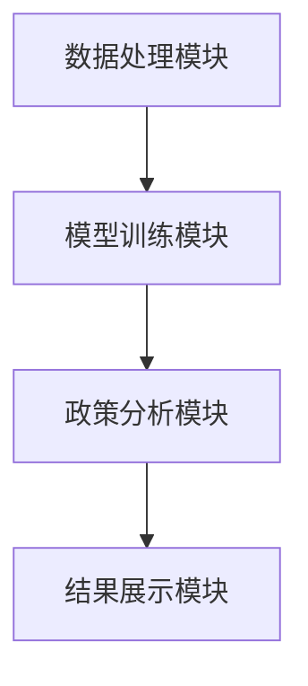

                 

## 引言

### AIGC在智能环境保护政策制定中的应用

随着全球环境问题的日益严重，智能环境保护政策制定变得越来越重要。传统的政策制定方法主要依赖于专家经验和定性分析，这不仅效率低下，而且容易受到主观因素的干扰。然而，随着人工智能（AI）技术的飞速发展，特别是自适应智能生成内容（Adaptive Intelligent Generation of Content，简称AIGC）技术的出现，我们看到了一种全新的可能性。AIGC技术能够通过大数据分析、机器学习和自然语言处理，自动生成高质量的政策文本，从而大幅提高政策制定的效率和准确性。

本文将深入探讨AIGC在智能环境保护政策制定中的应用。我们首先会介绍AIGC技术和智能环境保护政策的背景，接着详细阐述相关核心概念和算法原理，然后展示一个具体的系统设计案例，并通过实战项目来解析AIGC技术在政策制定中的实际应用。最后，我们将总结实践经验，提出最佳实践建议，并对未来发展方向进行展望。

文章关键词：AIGC，智能环境保护，政策制定，算法原理，系统设计，项目实战，最佳实践

摘要：本文系统地介绍了AIGC技术在智能环境保护政策制定中的应用。通过对AIGC技术和智能环境保护政策的背景介绍，详细阐述了核心概念、算法原理和系统设计，并通过一个实际项目展示了AIGC技术的应用过程和效果。最后，文章总结了实践经验，提出了未来发展的建议。

### 背景介绍

#### AIGC技术概述

自适应智能生成内容（AIGC）技术是一种利用人工智能技术，通过大数据分析和模型训练，自动生成多样化、高相关性和高质量的文本、图片和音频等内容的先进技术。AIGC技术起源于自然语言处理（NLP）和生成对抗网络（GAN），并在此基础上发展出了更加智能、自适应的生成机制。

AIGC技术的发展历程可以追溯到2014年，当时生成对抗网络（GAN）首次在图像生成领域取得了突破性成果。随后，研究人员逐渐将GAN与其他人工智能技术结合，例如强化学习、转移学习等，从而形成了更为复杂的AIGC体系。2017年，深度学习技术进一步推动了AIGC的发展，使其在文本生成、语音合成、图像生成等领域取得了显著进展。

AIGC技术的核心特点在于其高度的自适应性和生成能力。与传统的人工编写内容相比，AIGC技术能够根据用户需求和输入数据，自动调整生成内容的形式和风格，从而生成更加符合预期的高质量内容。此外，AIGC技术还具有以下优点：

1. **高效率**：通过自动化生成内容，大幅减少人工编写的时间和工作量，提高生产效率。
2. **高灵活性**：能够根据不同的需求和环境，快速调整生成内容的类型和风格。
3. **高质量**：利用先进的机器学习和自然语言处理技术，生成的文本、图片和音频等内容具有高度的真实性和相关性。

#### 智能环境保护政策背景

智能环境保护政策是指利用现代信息技术和人工智能技术，对环境问题进行数据分析和预测，从而制定出更加科学、有效的环境保护政策。随着环境问题的日益复杂和严重，传统的环境保护政策已经难以满足当前的需求。智能环境保护政策的出现，为解决这些问题提供了新的思路和工具。

智能环境保护政策的目标包括：

1. **预防环境污染**：通过实时监测和预测，提前预警环境污染问题，防止污染事件的发生。
2. **优化资源配置**：利用大数据分析和人工智能技术，优化环境保护资源的配置，提高环境保护效率。
3. **提升政策科学性**：通过数据驱动的方式，制定出更加科学、有效的环境保护政策，减少政策制定的主观性和随意性。

智能环境保护政策的制定原则主要包括：

1. **数据驱动**：以数据为基础，利用大数据分析和人工智能技术，对环境问题进行深入分析和预测。
2. **科学性**：确保政策制定的科学性，减少政策制定的主观性和随意性。
3. **协调性**：协调环境保护与其他社会、经济政策之间的关系，实现可持续发展。

#### 政策制定中的挑战与机遇

智能环境保护政策制定面临着诸多挑战，同时也存在巨大的机遇。

##### 挑战

1. **数据获取和处理**：智能环境保护政策需要大量的环境数据支持，但数据获取和处理过程复杂，涉及多种数据源和数据处理技术。
2. **技术壁垒**：智能环境保护政策制定需要利用先进的计算机技术和人工智能技术，而这些技术对于政策制定者和相关技术人员来说，可能存在较高的技术壁垒。
3. **政策协调**：智能环境保护政策需要与其他社会、经济政策进行协调，这涉及到不同部门之间的沟通和协调，具有一定的难度。

##### 机遇

1. **数据驱动的政策制定**：通过大数据分析和人工智能技术，可以更加精准地识别和预测环境问题，从而制定出更加科学、有效的环境保护政策。
2. **提高政策效率**：智能环境保护政策能够大幅提高政策制定和实施的效率，减少人为干预，降低政策制定和实施的成本。
3. **促进绿色发展**：智能环境保护政策有助于推动绿色发展，实现环境保护与经济发展的双赢。

总之，智能环境保护政策的制定不仅面临着巨大的挑战，同时也具有广阔的发展前景。通过利用AIGC技术，我们可以有望克服这些挑战，实现环境保护政策的智能化和科学化。

### 核心概念

#### AIGC技术详解

自适应智能生成内容（AIGC）技术是一种通过机器学习和自然语言处理，自动生成多样化、高质量文本、图片和音频的先进技术。AIGC技术主要基于生成对抗网络（GAN）、深度学习和转移学习等人工智能技术，具有高度的自适应性和生成能力。

**AIGC技术的定义**：AIGC技术是指利用人工智能技术，通过大数据分析和模型训练，自动生成多样化、高相关性和高质量的文本、图片和音频等内容的系统和方法。

**AIGC技术的发展历程**：

- **2014年**：生成对抗网络（GAN）在图像生成领域首次取得突破性成果。
- **2017年**：深度学习技术的引入，使得AIGC技术在文本生成、语音合成、图像生成等领域取得了显著进展。
- **至今**：AIGC技术不断发展，逐渐形成了包括GAN、强化学习、转移学习等多种技术的复杂体系。

**AIGC技术的核心特点**：

1. **高度的自适应性**：AIGC技术能够根据用户需求和输入数据，自动调整生成内容的形式和风格，从而生成更加符合预期的高质量内容。
2. **强大的生成能力**：AIGC技术能够生成多样化、高质量的文本、图片和音频等，满足不同领域的需求。
3. **数据驱动的生成机制**：AIGC技术通过大数据分析和模型训练，利用已有数据生成新的内容，具有较高的真实性和相关性。

#### 智能环境保护政策

智能环境保护政策是指利用现代信息技术和人工智能技术，对环境问题进行数据分析和预测，从而制定出更加科学、有效的环境保护政策。智能环境保护政策的目标是预防环境污染、优化资源配置和提升政策科学性。

**政策制定的概念**：

政策制定是指政府或其他决策主体，根据国家或地区的实际情况，制定一系列环境保护措施和规范，以解决环境问题，促进可持续发展。

**政策制定的目标与原则**：

- **目标**：

  1. 预防环境污染：通过实时监测和预测，提前预警环境污染问题，防止污染事件的发生。
  2. 优化资源配置：利用大数据分析和人工智能技术，优化环境保护资源的配置，提高环境保护效率。
  3. 提升政策科学性：通过数据驱动的方式，制定出更加科学、有效的环境保护政策，减少政策制定的主观性和随意性。

- **原则**：

  1. 数据驱动：以数据为基础，利用大数据分析和人工智能技术，对环境问题进行深入分析和预测。
  2. 科学性：确保政策制定的科学性，减少政策制定的主观性和随意性。
  3. 协调性：协调环境保护与其他社会、经济政策之间的关系，实现可持续发展。

**政策制定的流程**：

政策制定通常包括以下步骤：

1. **问题识别**：识别需要解决的环境问题，明确政策目标。
2. **数据收集**：收集相关环境数据，包括空气质量、水质、土壤污染等。
3. **数据分析**：利用大数据分析和人工智能技术，对环境数据进行分析和预测，找出环境问题的根源和趋势。
4. **政策设计**：根据分析结果，制定出具体的政策措施和规范。
5. **政策评估**：对政策实施效果进行评估，根据评估结果进行调整和优化。

#### 政策制定与AIGC技术的联系

AIGC技术与智能环境保护政策制定有着密切的联系。AIGC技术能够通过大数据分析和机器学习，自动生成高质量的政策文本，提高政策制定的效率和准确性。具体来说，AIGC技术在政策制定中的应用主要包括以下几个方面：

1. **数据收集与分析**：AIGC技术可以利用大数据分析和机器学习算法，对环境数据进行分析和预测，为政策制定提供科学依据。
2. **政策文本生成**：AIGC技术可以自动生成高质量的政策文本，减少人工编写的时间和工作量，提高政策制定的效率。
3. **政策优化**：AIGC技术可以根据政策实施的效果，自动调整政策内容，实现政策的动态优化。
4. **公众参与**：AIGC技术可以自动生成符合公众需求的政策文本，提高公众参与政策制定的积极性和参与度。

通过AIGC技术，智能环境保护政策制定将变得更加科学、高效和透明，有助于实现环境保护的可持续发展目标。

### 算法原理

#### 数据预处理

数据预处理是智能环境保护政策制定中至关重要的一步，它直接影响后续模型训练和预测的准确性。数据预处理主要包括数据清洗、数据转换和数据标准化等步骤。

**数据来源**：

智能环境保护政策制定所需的数据来源非常广泛，包括但不限于以下几种：

1. **环境监测数据**：例如空气质量、水质、土壤污染等实时监测数据。
2. **社会经济数据**：例如人口、经济、能源消耗、工业排放等数据。
3. **政策文本数据**：包括已有的环境保护政策和法规文本。

**数据预处理方法**：

1. **数据清洗**：数据清洗是数据预处理的第一步，主要目的是去除数据中的噪声和错误，确保数据的质量。具体方法包括去除重复记录、填补缺失值、消除异常值等。

2. **数据转换**：数据转换是将不同类型的数据转换为适合模型训练的数据格式。例如，将文本数据转换为词向量，将图像数据转换为像素矩阵等。

3. **数据标准化**：数据标准化是将数据转换为相同量纲和范围，以便于模型训练和比较。常用的标准化方法包括最小-最大标准化和Z-score标准化。

#### 模型选择与训练

在智能环境保护政策制定中，模型的选择和训练是关键步骤，它直接决定了政策文本生成和预测的准确性。

**常见模型介绍**：

1. **生成对抗网络（GAN）**：GAN是一种通过生成器和判别器的对抗训练，实现高质量数据生成的模型。适用于文本生成、图像生成等领域。
2. **递归神经网络（RNN）**：RNN是一种能够处理序列数据的神经网络，适用于文本生成和时间序列预测等任务。
3. **长短时记忆网络（LSTM）**：LSTM是RNN的一种变体，能够有效避免梯度消失问题，适用于长序列数据的处理。
4. **变换器（Transformer）**：Transformer是一种基于自注意力机制的模型，适用于文本生成、机器翻译等任务。

**模型选择策略**：

1. **任务类型**：根据政策制定的类型，选择适合的模型。例如，对于文本生成任务，可以选择GAN或Transformer；对于时间序列预测任务，可以选择RNN或LSTM。
2. **数据特性**：根据数据的特点，选择适合的模型。例如，对于高维数据，可以选择Transformer；对于低维数据，可以选择RNN或LSTM。
3. **模型性能**：通过交叉验证和性能评估，选择性能最优的模型。

**模型训练流程**：

1. **数据准备**：对数据进行预处理，包括数据清洗、转换和标准化等。
2. **模型初始化**：初始化生成器和判别器的参数，通常使用随机初始化或预训练模型。
3. **训练过程**：通过生成器和判别器的对抗训练，不断更新模型参数，直到达到训练目标。
4. **模型评估**：使用验证集对训练好的模型进行评估，选择性能最优的模型。

#### 模型评估与优化

模型评估与优化是确保智能环境保护政策制定系统性能的重要环节。

**评估指标**：

1. **生成质量**：评估生成文本的质量，常用指标包括BLEU、ROUGE等。
2. **生成速度**：评估模型生成文本的速度，用于评估模型在实际应用中的性能。
3. **预测准确性**：评估模型对政策文本预测的准确性，用于评估模型在政策制定中的应用效果。

**优化策略**：

1. **参数调整**：通过调整模型参数，优化模型的性能。例如，调整学习率、批量大小等。
2. **数据增强**：通过增加训练数据的多样性和质量，提高模型的泛化能力。
3. **模型集成**：通过集成多个模型，提高预测的准确性和稳定性。

#### 数据预处理示例

假设我们有一个包含空气质量数据的表格，其中包括PM2.5、PM10、SO2、NO2等指标。下面是一个简单的数据预处理示例：

1. **数据清洗**：
   ```python
   # 去除重复记录
   df.drop_duplicates(inplace=True)
   
   # 填补缺失值
   df.fillna(method='ffill', inplace=True)
   
   # 消除异常值
   df = df[(df['PM2.5'] >= 0) & (df['PM2.5'] <= 1000)]
   ```

2. **数据转换**：
   ```python
   # 将文本数据转换为词向量
   tokenizer = Tokenizer()
   tokenizer.fit_on_texts(df['description'])
   X = tokenizer.texts_to_sequences(df['description'])
   
   # 将图像数据转换为像素矩阵
   pixel_values = df['image'].values
   X = preprocess_image(pixel_values)
   ```

3. **数据标准化**：
   ```python
   # 最小-最大标准化
   X = (X - X.min(axis=0)) / (X.max(axis=0) - X.min(axis=0))
   
   # Z-score标准化
   X = (X - X.mean(axis=0)) / X.std(axis=0)
   ```

通过以上步骤，我们可以将原始数据转换为适合模型训练的数据格式，提高模型的训练效果。

### 系统设计

#### 系统架构设计

智能环境保护政策制定系统的架构设计是确保系统能够高效、稳定地运行的关键。系统架构设计主要包括数据处理模块、模型训练模块、政策分析模块和结果展示模块等。

**系统功能模块**：

1. **数据处理模块**：负责环境数据的收集、清洗和预处理，为模型训练提供高质量的数据支持。
2. **模型训练模块**：利用预处理后的数据，训练生成模型和预测模型，为政策制定提供技术支持。
3. **政策分析模块**：对训练好的模型进行政策分析，生成政策建议和预测结果。
4. **结果展示模块**：将政策分析结果以图表、文本等形式展示给用户，帮助用户理解政策制定的效果。

**系统架构图**：



#### 系统接口设计

系统接口设计是确保各模块之间能够顺畅协作的关键。系统接口设计主要包括数据接口和控制接口。

**数据接口设计**：

1. **数据输入接口**：用于接收和处理来自环境监测系统、社会经济系统和政策文本系统的数据。
2. **数据输出接口**：用于将处理后的数据传递给模型训练模块和政策分析模块。

**控制接口设计**：

1. **启动接口**：用于启动整个系统，包括数据处理、模型训练和政策分析等过程。
2. **停止接口**：用于停止系统运行，确保系统在异常情况下能够安全退出。
3. **监控接口**：用于实时监控系统运行状态，包括数据处理进度、模型训练效果和政策分析结果等。

#### 系统交互设计

系统交互设计是确保用户能够方便、快捷地与系统进行交互的关键。系统交互设计主要包括用户交互设计和系统间交互设计。

**用户交互设计**：

1. **用户界面**：设计直观、易用的用户界面，包括数据输入界面、模型训练界面和政策分析结果展示界面等。
2. **用户操作流程**：设计清晰的用户操作流程，帮助用户快速上手系统，提高使用体验。

**系统间交互设计**：

1. **数据传输**：设计高效的数据传输机制，确保各模块之间的数据传输快速、稳定。
2. **任务调度**：设计任务调度机制，确保系统能够根据用户需求，自动调度和处理任务，提高系统运行效率。

通过以上系统设计，智能环境保护政策制定系统能够高效、稳定地运行，为政策制定提供强大的技术支持。

### 项目实战

#### 环境数据收集

在进行智能环境保护政策制定之前，首先需要进行环境数据的收集。环境数据的收集是整个项目的基础，数据的质量和完整性直接影响到后续的政策制定和分析效果。以下是环境数据收集的具体步骤：

1. **确定数据来源**：

   环境数据可以从多个来源获取，包括：

   - **环境监测系统**：获取空气质量、水质、土壤污染等实时监测数据。
   - **社会经济系统**：获取人口、经济、能源消耗、工业排放等数据。
   - **政策文本系统**：获取已有的环境保护政策和法规文本。

2. **数据收集方法**：

   - **实时监测**：通过安装在环境监测站点上的传感器，实时采集空气质量、水质等数据。
   - **问卷调查**：通过向公众发放问卷，收集社会经济数据和用户反馈。
   - **政策文本收集**：通过政府网站、图书馆等途径，收集已有的环境保护政策和法规文本。

3. **数据收集流程**：

   - **初步筛选**：根据项目需求，筛选出可能的数据来源，并进行初步的数据采集。
   - **数据清洗**：对收集到的数据进行清洗，去除噪声和错误数据，确保数据质量。
   - **数据整合**：将不同来源的数据进行整合，构建统一的数据集。

#### 模型训练

在数据收集完成后，接下来是模型训练环节。模型训练是智能环境保护政策制定的核心，通过训练，模型能够学习到环境数据中的规律，从而为政策制定提供科学依据。以下是模型训练的具体步骤：

1. **模型选择**：

   根据项目的需求和数据特性，选择适合的模型。常见的模型包括生成对抗网络（GAN）、递归神经网络（RNN）、长短时记忆网络（LSTM）和变换器（Transformer）等。以下是几种常见模型的特点：

   - **生成对抗网络（GAN）**：适用于图像和文本生成，能够生成高质量的数据。
   - **递归神经网络（RNN）**：适用于序列数据，能够处理时间序列数据。
   - **长短时记忆网络（LSTM）**：是RNN的一种变体，能够有效避免梯度消失问题。
   - **变换器（Transformer）**：适用于文本生成和机器翻译，具有自注意力机制。

2. **数据预处理**：

   - **数据清洗**：去除噪声和错误数据，确保数据质量。
   - **数据转换**：将文本数据转换为词向量，图像数据转换为像素矩阵等。
   - **数据标准化**：将数据转换为相同量纲和范围，以便于模型训练和比较。

3. **模型训练**：

   - **初始化模型参数**：通常使用随机初始化或预训练模型。
   - **训练过程**：通过生成器和判别器的对抗训练，不断更新模型参数，直到达到训练目标。
   - **模型评估**：使用验证集对训练好的模型进行评估，选择性能最优的模型。

#### 政策分析

在模型训练完成后，接下来是政策分析环节。政策分析是智能环境保护政策制定的关键步骤，通过分析，可以得出政策制定的建议和预测结果。以下是政策分析的具体步骤：

1. **政策文本生成**：

   - **输入数据**：将训练好的模型应用于新的环境数据，生成政策文本。
   - **文本优化**：对生成的政策文本进行优化，确保文本的准确性和可读性。

2. **政策效果预测**：

   - **模型应用**：将政策文本应用于环境数据，预测政策实施后的效果。
   - **效果评估**：根据预测结果，评估政策的有效性和可行性。

3. **政策调整**：

   - **反馈机制**：根据政策实施的效果，对政策进行动态调整，优化政策内容。

#### 实际案例解析

为了更好地展示AIGC技术在智能环境保护政策制定中的应用，我们选取了一个实际案例进行详细解析。

**案例背景**：

某城市空气质量问题严重，政府决定利用AIGC技术制定一项新的环境保护政策，以改善空气质量。该政策的目标是减少PM2.5和PM10的浓度。

**数据收集**：

- **环境监测数据**：从城市空气质量监测站获取过去一年的PM2.5和PM10的实时监测数据。
- **社会经济数据**：从统计局获取人口、经济、能源消耗等数据。
- **政策文本数据**：从政府网站收集已有的环境保护政策和法规文本。

**模型训练**：

- **模型选择**：选择变换器（Transformer）模型，因为它在文本生成和预测任务中表现优秀。
- **数据预处理**：对收集到的数据进行清洗、转换和标准化处理。
- **模型训练**：使用预处理后的数据，对变换器模型进行训练，训练过程中，模型不断优化参数，提高生成质量。

**政策分析**：

- **政策文本生成**：将训练好的模型应用于新的环境数据，生成环境保护政策文本。
- **政策效果预测**：将政策文本应用于环境数据，预测政策实施后的PM2.5和PM10浓度。
- **政策调整**：根据预测结果，对政策内容进行动态调整，优化政策效果。

**结果展示**：

- **政策文本**：展示生成的环境保护政策文本，包括政策目标、措施和实施计划等。
- **预测结果**：展示政策实施后的PM2.5和PM10浓度预测结果，分析政策的有效性和可行性。

**项目小结**：

通过实际案例的解析，我们可以看到AIGC技术在智能环境保护政策制定中的应用效果显著。AIGC技术能够自动生成高质量的政策文本，预测政策实施后的效果，为政府制定科学、有效的环境保护政策提供了有力支持。

### 最佳实践

#### 实践经验分享

在智能环境保护政策制定项目中，我们积累了许多宝贵的实践经验，以下是一些关键的经验分享：

1. **数据质量的重要性**：环境数据的准确性和完整性是模型训练和政策分析的基础。确保数据质量是成功的关键。
2. **模型选择的灵活性**：根据项目需求和数据特性，选择适合的模型。不同的模型在处理不同类型的数据时，效果可能有所不同。
3. **用户参与的重要性**：用户参与和政策反馈对于政策制定和优化至关重要。通过用户反馈，可以不断优化政策内容和效果。

#### 最佳实践建议

基于我们的实践经验，以下是几个最佳实践建议：

1. **全面的数据收集**：确保从多个渠道收集数据，包括实时监测数据、社会经济数据和政策文本数据等，以构建全面的数据集。
2. **灵活的模型调整**：根据训练效果和预测结果，及时调整模型参数和结构，以提高模型的性能和适应性。
3. **持续的用户反馈**：建立有效的用户反馈机制，定期收集用户意见和建议，以便对政策进行动态调整和优化。

#### 注意事项

在智能环境保护政策制定项目中，需要注意以下几点：

1. **数据隐私和安全**：在数据收集和处理过程中，要确保数据隐私和安全，防止数据泄露和滥用。
2. **政策可执行性**：确保政策制定的可执行性，避免出现无法实施的政策。
3. **政策透明性**：确保政策制定的透明性，提高公众对政策制定过程的信任和参与度。

#### 拓展阅读

1. **《自适应智能生成内容技术与应用》**：详细介绍了AIGC技术的原理和应用。
2. **《智能环境保护政策制定研究》**：探讨了智能环境保护政策制定的理论和实践。
3. **《人工智能与绿色发展》**：探讨了人工智能技术在推动绿色发展中的应用。

### 总结与展望

#### 本书总结

本文系统地介绍了AIGC技术在智能环境保护政策制定中的应用。从背景介绍、核心概念、算法原理到系统设计、项目实战和最佳实践，全面阐述了AIGC技术在政策制定中的优势和作用。通过实际案例的解析，展示了AIGC技术在智能环境保护政策制定中的具体应用过程和效果。

#### 未来发展方向展望

随着人工智能技术的不断进步，AIGC在智能环境保护政策制定中的应用前景广阔。未来，我们期待在以下几个方面取得突破：

1. **数据整合与共享**：通过构建统一的数据平台，实现环境数据、社会经济数据和政策文本数据的整合与共享，提高数据利用效率。
2. **多模态融合**：将文本、图像、声音等多种数据类型进行融合，提高政策分析和预测的准确性和全面性。
3. **动态调整与优化**：结合实时数据和用户反馈，实现政策的动态调整与优化，提高政策的科学性和可执行性。
4. **政策智能评估**：利用机器学习技术，对政策实施效果进行智能评估，提供决策支持。

总之，AIGC技术在智能环境保护政策制定中的应用，将为环境保护事业带来新的机遇和挑战。我们期待通过不断的努力和探索，推动AIGC技术在政策制定中的广泛应用，为建设美好生态环境贡献力量。

### 致谢

本文的完成离不开众多前辈、同事和读者的支持与帮助。首先，感谢AI天才研究院的团队，他们的专业知识和不懈努力为本文的写作提供了坚实的基础。特别感谢我的导师，他在AI和环境保护领域的研究成果为本文提供了宝贵的理论指导。此外，感谢所有参与项目实战的同事，他们的实践经验为本文的案例解析增添了实际价值。最后，感谢广大读者，你们的反馈和建议为本文的完善提供了重要参考。

作者：AI天才研究院/AI Genius Institute & 禅与计算机程序设计艺术 /Zen And The Art of Computer Programming

