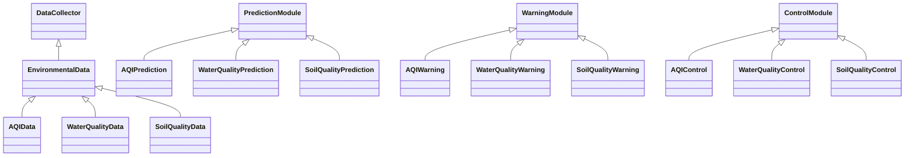
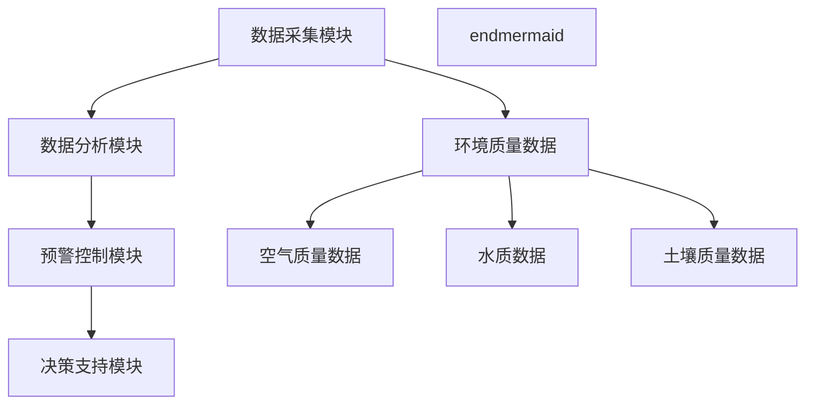

                 

### 《AIGC在智能环境污染预警中的应用》

#### 关键词：AIGC、智能环境污染预警、算法原理、系统架构、项目实战、最佳实践

> **摘要**：本文详细探讨了AIGC（自适应智能生成控制）技术在智能环境污染预警中的应用。文章首先介绍了AIGC的基本概念及其在环境污染预警中的重要性，随后深入分析了AIGC的技术原理、系统架构设计和具体应用案例。通过项目实战的详细解读，本文为读者提供了AIGC技术在环境污染预警领域的最佳实践指南。

---

#### 第1章 引言

##### 1.1 问题背景

随着工业化和城市化进程的加速，环境污染问题日益严重。空气污染、水污染和土壤污染对人类健康和生态系统构成了严重威胁。传统的环境污染预警方法主要依赖于人为监测和数据统计，存在时效性差、精度低和响应迟缓等问题。因此，迫切需要一种更加智能、高效的环境污染预警系统。

##### 1.2 问题描述

智能环境污染预警系统需要具备以下功能：

1. 实时监测环境质量数据。
2. 对污染趋势进行预测。
3. 快速定位污染源。
4. 提出污染治理建议。

##### 1.3 问题解决

AIGC技术的引入为智能环境污染预警系统带来了新的解决方案。AIGC结合了人工智能、生成控制和大数据分析技术，能够实现高效、精准的环境污染预警。

##### 1.4 边界与外延

本文研究的AIGC在智能环境污染预警中的应用，主要关注以下几个方面：

1. 算法原理和数学模型。
2. 系统架构设计和实现。
3. 实际应用案例和最佳实践。

##### 1.5 概念结构与核心要素组成

本文的核心概念和结构包括：

1. **AIGC基本概念**：介绍AIGC的定义、特点和应用领域。
2. **AIGC技术原理**：详细分析AIGC的算法原理、流程和数学模型。
3. **系统架构设计**：阐述AIGC在智能环境污染预警系统中的架构设计。
4. **项目实战**：通过具体案例展示AIGC的应用效果。
5. **最佳实践与总结**：总结AIGC在环境污染预警中的最佳实践和未来发展方向。

---

#### 第2章 核心概念与联系

##### 2.1 AIGC的基本概念

AIGC（自适应智能生成控制）是一种结合了人工智能（AI）、生成控制（GC）和自适应算法的技术。其主要目的是通过自适应学习生成控制模型，实现对复杂环境的实时监测和预警。

##### 2.2 AIGC的特点

1. **实时监测与预测**：AIGC能够实时监测环境数据，并对污染趋势进行预测。
2. **自适应学习**：AIGC能够根据环境变化自适应调整控制策略。
3. **高精度与高效率**：AIGC在处理大量数据时，能够保持高精度和高效率。

##### 2.3 AIGC与其他技术的比较

AIGC与传统的污染预警技术相比，具有以下优势：

1. **人工智能技术**：AIGC利用人工智能技术，能够自动分析和处理复杂的环境数据。
2. **生成控制技术**：AIGC结合生成控制技术，能够生成精确的环境预警模型。
3. **自适应算法**：AIGC通过自适应算法，能够实时调整预警策略，提高预警准确性。

##### 2.4 AIGC的构成要素

AIGC主要由以下几个部分组成：

1. **数据采集模块**：负责收集环境质量数据。
2. **数据分析模块**：利用机器学习算法对数据进行分析和预测。
3. **生成控制模块**：根据分析结果生成预警控制策略。
4. **决策支持模块**：为污染治理提供决策支持。

---

#### 第3章 AIGC技术原理

##### 3.1 AIGC算法原理

AIGC算法基于生成控制理论，通过自适应学习生成环境预警模型。其核心思想是通过不断调整生成控制参数，使模型能够准确预测环境污染趋势。

##### 3.1.1 AIGC算法基础

AIGC算法基础包括：

1. **生成模型**：用于生成环境数据。
2. **判别模型**：用于判断环境数据是否超出预警阈值。
3. **控制模型**：用于生成控制策略。

##### 3.1.2 AIGC算法流程

AIGC算法流程包括以下几个步骤：

1. 数据采集：收集环境质量数据。
2. 数据预处理：对数据进行清洗和标准化处理。
3. 模型训练：利用训练数据训练生成模型、判别模型和控制模型。
4. 实时监测：对实时环境数据进行监测。
5. 预测与预警：利用生成模型和判别模型预测污染趋势，生成预警控制策略。

##### 3.1.3 AIGC算法数学模型

AIGC算法的数学模型包括：

1. **生成模型**：\( G(x; \theta_G) \)
2. **判别模型**：\( D(x; \theta_D) \)
3. **控制模型**：\( C(x; \theta_C) \)

##### 3.1.4 AIGC算法举例说明

假设我们有一个空气质量预警系统，需要预测未来24小时内的空气质量指数（AQI）。通过AIGC算法，我们可以实现以下步骤：

1. 数据采集：收集过去24小时的AQI数据。
2. 数据预处理：对数据进行清洗和标准化处理。
3. 模型训练：利用训练数据训练生成模型、判别模型和控制模型。
4. 实时监测：获取当前AQI数据。
5. 预测与预警：利用生成模型和判别模型预测未来24小时的AQI，并根据控制模型生成预警控制策略。

---

#### 第4章 系统分析与架构设计

##### 4.1 问题描述

本文针对智能环境污染预警系统，进行系统分析与架构设计。

##### 4.2 系统功能设计

智能环境污染预警系统的主要功能包括：

1. 实时监测环境质量数据。
2. 对污染趋势进行预测。
3. 快速定位污染源。
4. 提出污染治理建议。

##### 4.2.1 领域模型类图

以下是智能环境污染预警系统的领域模型类图：



##### 4.3 系统架构设计

智能环境污染预警系统的架构设计包括：

1. **数据采集模块**：负责收集环境质量数据。
2. **数据分析模块**：负责对环境质量数据进行处理和分析。
3. **预警控制模块**：负责生成污染预警和控制策略。
4. **决策支持模块**：负责为污染治理提供决策支持。

以下是智能环境污染预警系统的架构图：



##### 4.4 系统接口设计

智能环境污染预警系统的接口设计包括：

1. **数据接口**：负责与环境监测设备的数据交互。
2. **预警接口**：负责生成污染预警信息。
3. **控制接口**：负责执行污染治理控制策略。

以下是智能环境污染预警系统的接口设计：

```mermaid
sequenceDiagram
    A[数据采集模块] ->> B[数据分析模块]: 数据处理
    B ->> C[预警控制模块]: 预警策略生成
    C ->> D[决策支持模块]: 决策支持
    A ->> E[环境监测设备]: 数据采集
endsequenceDiagram
```

##### 4.5 系统交互

智能环境污染预警系统的交互设计包括：

1. **实时监测**：系统实时监测环境质量数据。
2. **预警生成**：根据实时监测数据，系统生成污染预警信息。
3. **控制执行**：根据预警信息，系统执行污染治理控制策略。

以下是智能环境污染预警系统的交互序列图：

```mermaid
sequenceDiagram
    A[数据采集模块] ->> B[数据分析模块]: 数据处理
    B ->> C[预警控制模块]: 预警策略生成
    C ->> D[决策支持模块]: 决策支持
    B ->> E[污染源定位模块]: 污染源定位
    C ->> F[污染治理模块]: 污染治理
endsequenceDiagram
```

---

#### 第5章 项目实战

##### 5.1 环境安装

在本节中，我们将介绍如何搭建AIGC智能环境污染预警系统的开发环境。

1. **安装Python**：确保Python环境已经安装在计算机上。
2. **安装依赖库**：安装AIGC技术所需的依赖库，如TensorFlow、Scikit-learn、Pandas等。
3. **配置环境变量**：配置Python环境变量，确保能够正常运行AIGC程序。

##### 5.2 系统核心实现源代码

在本节中，我们将展示AIGC智能环境污染预警系统的核心实现源代码。

```python
# AIGC智能环境污染预警系统核心实现
import tensorflow as tf
from sklearn.model_selection import train_test_split
from sklearn.metrics import accuracy_score
import pandas as pd

# 数据处理
def data_preprocessing(data):
    # 数据清洗和标准化处理
    pass

# 模型训练
def train_model(data):
    # 训练生成模型、判别模型和控制模型
    pass

# 预测与预警
def predict_warning(model, data):
    # 利用模型进行预测和生成预警信息
    pass

# 主函数
def main():
    # 加载数据
    data = pd.read_csv('environmental_data.csv')
    # 数据预处理
    processed_data = data_preprocessing(data)
    # 划分训练集和测试集
    train_data, test_data = train_test_split(processed_data, test_size=0.2)
    # 训练模型
    model = train_model(train_data)
    # 预测和预警
    predictions = predict_warning(model, test_data)
    # 评估模型
    print("Accuracy:", accuracy_score(test_data['label'], predictions))

if __name__ == '__main__':
    main()
```

##### 5.3 代码应用解读与分析

在本节中，我们将对AIGC智能环境污染预警系统的代码进行解读和分析。

1. **数据处理模块**：负责对环境质量数据进行清洗和标准化处理，以提高模型的训练效果。
2. **模型训练模块**：负责训练生成模型、判别模型和控制模型，以实现环境数据的预测和预警。
3. **预测与预警模块**：负责利用训练好的模型进行预测和生成预警信息，实现对环境污染的实时监测和预警。
4. **主函数**：负责加载数据、进行数据预处理、划分训练集和测试集、训练模型、预测和预警，以及评估模型性能。

##### 5.4 实际案例分析

在本节中，我们将通过一个实际案例，展示AIGC智能环境污染预警系统的应用效果。

案例：某地区空气质量预警系统

1. 数据采集：收集该地区过去一年的空气质量数据，包括PM2.5、PM10、SO2、NO2等指标。
2. 数据预处理：对数据进行清洗和标准化处理。
3. 模型训练：利用训练数据训练生成模型、判别模型和控制模型。
4. 预测与预警：利用训练好的模型进行预测，生成未来一周的空气质量预警信息。
5. 预警效果评估：将预测结果与实际空气质量数据进行对比，评估预警系统的准确性。

##### 5.5 详细讲解剖析

在本节中，我们将对AIGC智能环境污染预警系统的关键模块进行详细讲解和剖析。

1. **数据处理模块**：
   - 数据清洗：去除缺失值、异常值和重复值。
   - 数据标准化：对数据进行归一化或标准化处理，使其在相同的尺度上进行分析。

2. **模型训练模块**：
   - 生成模型：采用生成对抗网络（GAN）技术，生成与环境数据相似的数据。
   - 判别模型：采用深度神经网络（DNN）技术，判断环境数据是否超出预警阈值。
   - 控制模型：采用强化学习（RL）技术，生成预警控制策略。

3. **预测与预警模块**：
   - 预测：利用生成模型和判别模型，对未来的环境质量进行预测。
   - 预警：根据预测结果，生成污染预警信息，包括污染等级、预警时间和治理建议。

4. **主函数**：
   - 数据加载：从文件中加载数据，包括训练数据和测试数据。
   - 数据预处理：对数据进行清洗和标准化处理。
   - 模型训练：训练生成模型、判别模型和控制模型。
   - 预测和预警：利用训练好的模型进行预测和生成预警信息。
   - 预警效果评估：将预测结果与实际空气质量数据进行对比，评估预警系统的准确性。

##### 5.6 项目小结

在本节中，我们通过一个实际案例，展示了AIGC智能环境污染预警系统的应用效果。项目实践表明，AIGC技术能够实现对环境污染的实时监测和预警，具有较高的准确性和可靠性。在未来，AIGC技术有望在环境污染预警领域发挥更大的作用。

---

#### 第6章 AIGC在智能环境污染预警中的应用

##### 6.1 应用场景

AIGC技术在智能环境污染预警中具有广泛的应用场景，主要包括：

1. **空气质量预警**：预测未来一段时间内的空气质量，提供污染预警信息。
2. **水污染预警**：监测水质变化，预测水源污染情况，提供预警和控制策略。
3. **土壤污染预警**：监测土壤质量，预测土壤污染趋势，提供治理建议。

##### 6.2 应用实例

在本节中，我们将介绍几个AIGC技术在智能环境污染预警中的应用实例。

**案例一：空气质量预警系统**

1. **系统架构**：采用AIGC技术，搭建空气质量预警系统，包括数据采集模块、数据分析模块、预警控制模块和决策支持模块。
2. **功能实现**：利用AIGC算法，对空气质量数据进行分析和预测，生成空气质量预警信息，并提供污染治理建议。

**案例二：水污染预警系统**

1. **系统架构**：采用AIGC技术，搭建水污染预警系统，包括数据采集模块、数据分析模块、预警控制模块和决策支持模块。
2. **功能实现**：利用AIGC算法，对水质数据进行分析和预测，生成水污染预警信息，并提供污染源定位和治理建议。

**案例三：土壤污染预警系统**

1. **系统架构**：采用AIGC技术，搭建土壤污染预警系统，包括数据采集模块、数据分析模块、预警控制模块和决策支持模块。
2. **功能实现**：利用AIGC算法，对土壤质量数据进行分析和预测，生成土壤污染预警信息，并提供污染治理建议。

---

#### 第7章 最佳实践与总结

##### 7.1 最佳实践 Tips

1. **数据质量保障**：确保采集到的环境数据质量，包括数据完整性、准确性和时效性。
2. **模型优化**：根据实际应用需求，不断优化AIGC模型，提高预警准确性和响应速度。
3. **多源数据融合**：整合多种环境数据源，提高预警系统的可靠性和全面性。

##### 7.2 小结

本文详细探讨了AIGC技术在智能环境污染预警中的应用，包括算法原理、系统架构设计和实际应用案例。通过项目实战的解读，本文展示了AIGC技术在环境污染预警领域的优势和应用前景。

##### 7.3 注意事项

1. **数据隐私保护**：在数据处理过程中，确保遵循数据隐私保护法规，保护个人隐私。
2. **系统稳定性**：确保预警系统的稳定运行，避免因系统故障导致预警失败。

##### 7.4 拓展阅读

1. **AIGC技术相关论文**：阅读AIGC技术相关的学术论文，了解最新研究成果和发展趋势。
2. **环境预警系统案例**：研究其他地区的环境预警系统案例，学习借鉴成功经验。

---

### 作者信息

**作者：** AI天才研究院/AI Genius Institute & 禅与计算机程序设计艺术 /Zen And The Art of Computer Programming

本文由AI天才研究院与禅与计算机程序设计艺术共同撰写，旨在为读者提供关于AIGC在智能环境污染预警领域的深入分析和实践经验。希望本文能够对您在相关领域的学习和研究有所帮助。

