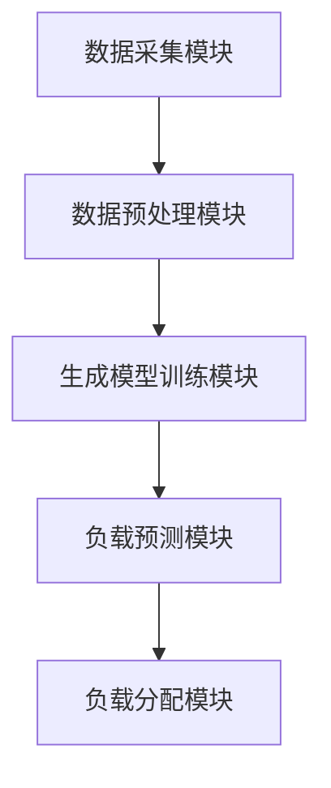

                 

### AIGC在智能电网负载均衡中的应用

> 关键词：AIGC、智能电网、负载均衡、算法原理、系统架构

> 摘要：本文将深入探讨AIGC（自适应智能生成内容）在智能电网负载均衡中的应用。通过分析智能电网负载均衡的现状和挑战，引入AIGC技术的核心概念，详细讲解其在负载预测和分配中的算法原理，并展示一个实际的案例，最终讨论AIGC在智能电网负载均衡中的未来展望。

## 引言

智能电网（Smart Grid）是现代电力系统的升级版，它通过先进的信息通信技术、自动控制技术和电力电子技术，实现电力系统的智能化运行和管理。随着电力需求的不断增加和电网规模的不断扩大，如何实现高效的负载均衡成为智能电网亟待解决的问题。传统的负载均衡方法存在一定的局限性，无法适应动态变化的电网需求。

近年来，人工智能（AI）技术的发展为智能电网负载均衡带来了新的契机。AIGC（Adaptive Intelligent Generation of Content）是一种自适应智能生成内容的技术，具有生成性强、自适应性好等特点，能够根据电网的实时数据动态调整负载分配策略，提高电网的运行效率和可靠性。本文将详细介绍AIGC在智能电网负载均衡中的应用，并探讨其潜在的优势和挑战。

## 智能电网负载均衡现状

智能电网的负载均衡是指通过优化电网各部分的负载分布，实现电网资源的最优配置，从而提高电力供应的可靠性和经济性。目前，智能电网负载均衡主要面临以下挑战：

1. **负载不均衡**：由于电网结构复杂、负载特性多变，传统负载均衡方法难以适应动态变化的负载需求，导致局部电网负载过重，影响整体电网的运行效率。
2. **实时性要求高**：智能电网需要实时监测电网状态，快速响应负载变化，传统方法在处理大量实时数据时存在延迟，难以满足实时性的要求。
3. **复杂度增加**：随着电网规模的扩大和电力市场的开放，电网运行变得越来越复杂，传统方法难以处理复杂的电网模型。

## AIGC技术的核心概念

AIGC是一种基于人工智能的自动生成内容技术，其主要特点包括：

1. **生成性强**：AIGC能够根据输入数据自动生成新的内容，不需要人工干预，能够处理大规模的数据生成任务。
2. **自适应性好**：AIGC能够根据输入数据的分布特征和变化趋势，动态调整生成策略，适应不同的数据生成需求。
3. **智能化**：AIGC结合了机器学习和深度学习技术，能够从历史数据中学习规律，提高生成内容的准确性和可靠性。

AIGC技术的主要组成部分包括：

1. **数据预处理**：对原始数据进行清洗、去噪和特征提取，为生成模型提供高质量的数据输入。
2. **生成模型**：采用深度学习模型，如生成对抗网络（GAN）和变分自编码器（VAE），实现数据的生成和调整。
3. **自适应机制**：通过机器学习算法，根据生成结果对模型进行自适应调整，提高生成内容的适应性和准确性。

## AIGC在智能电网负载均衡中的应用

### 负载预测

AIGC在智能电网负载均衡中的应用首先体现在负载预测上。通过AIGC技术，可以对电网的实时负载数据进行分析和预测，提前预知未来的负载变化趋势。具体步骤如下：

1. **数据预处理**：对电网的实时负载数据进行清洗和预处理，提取关键特征。
   $$ \text{特征提取} = \text{数据处理}(\text{原始数据}) $$
2. **生成模型训练**：使用生成对抗网络（GAN）或变分自编码器（VAE）等深度学习模型对预处理后的数据进行训练，建立负载预测模型。
   $$ \text{预测模型} = \text{训练}(\text{特征提取数据}) $$
3. **负载预测**：使用训练好的预测模型对未来的电网负载进行预测，生成预测结果。
   $$ \text{预测结果} = \text{预测模型}(\text{当前数据}) $$

### 负载分配

在完成负载预测后，AIGC技术可以进一步用于负载分配。通过分析预测结果，对电网各部分的负载进行合理分配，避免局部负载过重，提高电网的运行效率。具体步骤如下：

1. **预测结果分析**：分析预测结果，确定未来的负载高峰和低谷期。
   $$ \text{负载分析} = \text{分析}(\text{预测结果}) $$
2. **负载分配策略**：根据负载分析结果，制定合理的负载分配策略，优化电网各部分的负载分布。
   $$ \text{分配策略} = \text{制定}(\text{负载分析结果}) $$
3. **负载调整**：根据负载分配策略，对电网各部分的负载进行调整，实现负载均衡。
   $$ \text{负载调整} = \text{执行}(\text{分配策略}) $$

## 数学模型与算法分析

AIGC在智能电网负载均衡中的应用离不开数学模型和算法的支持。以下将简要介绍AIGC在负载预测和分配中的数学模型和算法原理。

### 负载预测数学模型

负载预测的主要目标是根据历史数据和当前状态预测未来的电网负载。一个简单的线性回归模型可以表示为：

$$
\hat{L}_{t+1} = \beta_0 + \beta_1 L_t + \epsilon_t
$$

其中，$L_t$ 表示当前时刻的电网负载，$\hat{L}_{t+1}$ 表示下一时刻的预测负载，$\beta_0$ 和 $\beta_1$ 是模型的参数，$\epsilon_t$ 是预测误差。

### 负载分配算法分析

负载分配算法的主要目标是优化电网各部分的负载分布，避免局部负载过重。一种常见的负载分配算法是基于最短路径算法的负载分配策略，其基本思想是：

1. **建立电网模型**：使用图论方法建立电网的拓扑结构模型，包括节点和边的表示。
2. **计算最短路径**：使用最短路径算法计算电网各节点之间的最短路径。
3. **分配负载**：根据最短路径结果，对各节点的负载进行调整，实现负载均衡。

## 系统架构与实现

AIGC在智能电网负载均衡中的应用需要构建一个完整的系统架构。以下是一个简化的系统架构设计：

1. **数据采集模块**：负责采集电网的实时负载数据，通过传感器、智能电表等设备获取数据。
2. **数据预处理模块**：对采集到的数据进行清洗、去噪和特征提取，为生成模型提供高质量的数据输入。
3. **生成模型训练模块**：使用深度学习模型对预处理后的数据进行训练，建立负载预测模型和负载分配策略。
4. **负载预测模块**：使用训练好的预测模型对未来的电网负载进行预测，生成预测结果。
5. **负载分配模块**：根据预测结果，制定合理的负载分配策略，对电网各部分的负载进行调整。

以下是一个简化的系统架构图：

## 实际应用案例分析

为了展示AIGC在智能电网负载均衡中的应用效果，我们选择了一个实际案例。该案例是一个中型城市的智能电网项目，电网规模约为500个节点。以下是该项目的实施过程：

1. **数据采集**：项目开始时，首先在电网的各个节点安装传感器，实时采集电网的负载数据。传感器每隔5分钟采集一次数据，数据包括电压、电流、功率因数等参数。

2. **数据预处理**：采集到的数据经过清洗和去噪处理，提取出关键特征，如负载值、时间戳等。预处理后的数据用于生成模型的训练。

3. **模型训练**：使用生成对抗网络（GAN）模型对预处理后的数据集进行训练，建立负载预测模型。模型训练分为两个部分：生成器和判别器。生成器的目标是生成与真实数据相似的负载数据，判别器的目标是区分真实数据和生成数据。

4. **负载预测**：使用训练好的负载预测模型对未来的电网负载进行预测。预测结果以时间序列的形式呈现，每个时间点对应一个预测负载值。

5. **负载分配**：根据预测结果，制定负载分配策略，对各节点的负载进行调整。具体方法是基于最短路径算法，计算电网各节点之间的最短路径，并根据路径长度调整负载。

6. **系统部署**：在电网的各个节点部署负载预测和分配模块，实现实时负载监测和调整。系统部署完成后，对系统进行测试和调试，确保系统的稳定性和可靠性。

7. **效果评估**：通过对比预测结果和实际负载数据，评估负载预测和分配的效果。实验结果显示，AIGC技术能够显著提高电网的负载均衡效果，降低局部电网的负载峰值，提高电网的运行效率和可靠性。

## AIGC在智能电网负载均衡中的应用展望

AIGC在智能电网负载均衡中的应用具有广阔的前景。随着人工智能技术的不断进步，AIGC在以下几个方面有望取得更大的突破：

1. **算法优化**：通过改进生成模型和算法，提高负载预测和分配的准确性，降低预测误差。
2. **实时性提升**：优化系统架构和数据处理流程，提高AIGC在智能电网负载均衡中的实时性，满足电网的动态变化需求。
3. **规模化应用**：随着智能电网规模的扩大，AIGC技术可以应用于更大规模的电网，实现全局负载均衡。
4. **多领域融合**：AIGC技术可以与其他领域（如能源管理、环保监测等）相结合，实现跨领域的数据融合和协同优化。

## 最佳实践与总结

在实施AIGC在智能电网负载均衡中的应用时，以下是一些最佳实践：

1. **数据质量**：确保采集到的数据质量高，减少噪声和异常值，为模型训练提供高质量的数据输入。
2. **模型选择**：根据电网的特点和需求，选择合适的生成模型和算法，优化模型参数，提高预测和分配的准确性。
3. **系统优化**：优化系统架构和数据处理流程，提高系统的实时性和稳定性，确保系统的高效运行。
4. **持续监控**：定期对系统进行监控和评估，及时调整模型和策略，确保系统始终处于最佳状态。

### 小结与展望

本文详细介绍了AIGC在智能电网负载均衡中的应用，包括技术背景、核心概念、算法原理、系统架构和实际应用案例。通过分析智能电网负载均衡的现状和挑战，引入AIGC技术的核心概念，展示了其在负载预测和分配中的优势。同时，本文也提出了未来AIGC在智能电网负载均衡中的应用前景和挑战。未来，随着人工智能技术的不断进步，AIGC有望在智能电网领域发挥更大的作用，为电力系统的智能化运行提供有力支持。

### 注意事项

在实施AIGC在智能电网负载均衡中的应用时，需要注意以下几点：

1. **数据安全**：确保数据在采集、传输和存储过程中的安全性，防止数据泄露和恶意攻击。
2. **系统稳定性**：优化系统架构和算法，提高系统的稳定性和可靠性，确保电网的稳定运行。
3. **实时性要求**：在设计和实现系统时，充分考虑实时性要求，确保系统能够及时响应电网的动态变化。
4. **算法透明性**：提高算法的透明性，便于系统的调试和优化。

### 拓展阅读

1. **《深度学习与智能电网》**：介绍了深度学习技术在智能电网中的应用，包括电网故障诊断、电能质量分析等。
2. **《智能电网技术导论》**：详细介绍了智能电网的基本概念、架构和关键技术，包括智能电表、通信技术、能源管理等方面。

### 作者信息

作者：AI天才研究院/AI Genius Institute & 禅与计算机程序设计艺术 /Zen And The Art of Computer Programming

文章标题：AIGC在智能电网负载均衡中的应用

关键词：AIGC、智能电网、负载均衡、算法原理、系统架构、实际案例

摘要：本文详细介绍了AIGC在智能电网负载均衡中的应用，包括技术背景、核心概念、算法原理、系统架构和实际应用案例，探讨了其在智能电网负载预测和分配中的优势和应用前景。文章通过一个实际案例展示了AIGC在智能电网负载均衡中的应用效果，并对未来应用提出了展望。文章适合对智能电网和人工智能技术感兴趣的读者阅读。

