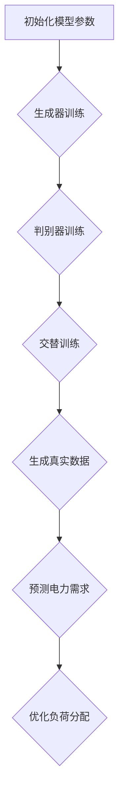
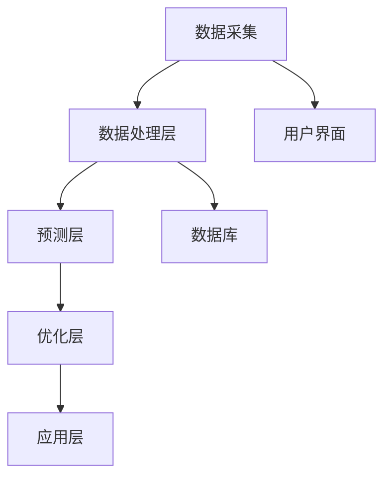
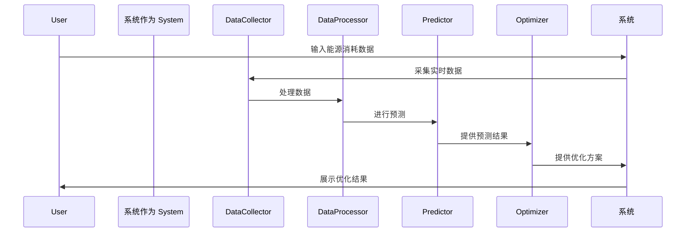

                 

### 《AIGC在智能能源消耗优化中的应用》概述

**关键词：** AIGC、智能能源消耗、优化、算法、应用前景

**摘要：**本文深入探讨了AIGC（自动化与智能生成内容）在智能能源消耗优化中的应用。首先，我们介绍了AIGC技术的背景和智能能源消耗优化的重要性。接着，详细阐述了AIGC的关键概念和其在能源消耗优化中的联系。随后，我们讲解了AIGC算法原理，展示了相关的数学模型与公式，并分析了系统架构设计。文章通过实际项目实战，展示了AIGC技术在实际应用中的具体实现和效果。最后，我们提出了最佳实践建议和总结，展望了AIGC在能源消耗优化领域的应用前景。

智能能源消耗优化是当前能源管理和节能减排领域的一个重要研究方向。随着全球能源需求的不断增长和能源问题的日益突出，如何高效地利用能源资源、降低能源消耗、减少环境污染，已成为全球共同面临的重大挑战。智能能源消耗优化利用先进的信息技术和人工智能算法，通过实时监测、数据分析、预测与优化，实现能源消耗的智能化管理，从而提高能源利用效率，降低能源成本，减轻环境负担。

AIGC技术作为人工智能的一个重要分支，具有自动化生成内容的能力，能够根据用户需求和输入数据进行自适应学习和优化。AIGC在智能能源消耗优化中的应用，可以显著提升能源管理的智能化水平，优化能源供需匹配，预测电力需求，实现能源消耗的精细化管理和优化控制。

本文将围绕AIGC在智能能源消耗优化中的应用，进行深入的分析和探讨。首先，我们将介绍AIGC技术的背景和智能能源消耗优化的重要性。接下来，我们将详细阐述AIGC的关键概念，分析这些概念与能源消耗优化的联系。然后，我们将介绍AIGC算法的原理，包括生成式对抗网络（GAN）、循环神经网络（RNN）和强化学习等，并展示相关的数学模型与公式。随后，我们将分析系统架构设计，包括能源消耗优化系统的需求分析、系统架构设计、系统接口设计以及系统交互设计。在项目实战部分，我们将通过具体案例展示AIGC技术在优化能源消耗中的应用。最后，我们将总结最佳实践和全文内容，并对AIGC在能源消耗优化领域的应用前景进行展望。

### AIGC技术背景

AIGC（Automated and Intelligent Generation of Content）是自动化与智能生成内容技术的简称，是一种利用人工智能技术生成和优化内容的方法。AIGC技术起源于深度学习和自然语言处理等领域，近年来得到了快速发展。AIGC的核心目标是通过模拟人类的创造力和智能行为，实现自动化内容的生成、优化和分发，从而提高信息处理的效率和质量。

AIGC技术可以大致分为以下几个类别：

1. **生成式对抗网络（GAN）**：GAN是一种基于博弈理论的生成模型，由生成器和判别器组成。生成器负责生成数据，判别器则负责判断数据是真实还是生成的。通过两个模型的相互竞争，生成器的生成能力不断提高，最终能够生成高质量的数据。

2. **循环神经网络（RNN）**：RNN是一种能够处理序列数据的神经网络，特别适用于自然语言处理和时间序列预测等领域。RNN通过内部状态记忆，可以捕捉序列中的长期依赖关系，从而实现数据的生成和优化。

3. **强化学习**：强化学习是一种通过试错和反馈机制进行决策和优化的机器学习方法。在AIGC中，强化学习可以用于内容生成和优化，例如自动写作、语音生成和图像生成等。

4. **自编码器**：自编码器是一种无监督学习算法，通过编码和解码过程学习数据的特征表示。在AIGC中，自编码器可以用于生成图像、文本和音频等数据。

AIGC技术的主要应用领域包括：

1. **内容生成**：包括文本生成、图像生成、视频生成和音频生成等。例如，通过AIGC技术可以自动生成新闻报道、音乐、电影剧本和艺术作品等。

2. **信息检索**：通过AIGC技术，可以自动生成个性化推荐内容，提高信息检索的效率和准确性。

3. **自然语言处理**：AIGC技术在机器翻译、情感分析、问答系统和聊天机器人等领域具有广泛应用。

4. **计算机视觉**：AIGC技术可以用于图像识别、图像生成和视频分析等任务。

5. **游戏开发**：AIGC技术可以用于游戏内容的自动生成，提高游戏的趣味性和多样性。

6. **工业设计**：AIGC技术可以用于产品设计和制造过程的自动化，提高生产效率和产品质量。

在智能能源消耗优化中的应用，AIGC技术具有以下几个优势：

1. **自动化**：AIGC技术可以实现能源消耗数据的自动化采集、处理和分析，减少人工干预，提高效率。

2. **智能化**：AIGC技术可以利用机器学习算法，对能源消耗数据进行分析和预测，实现能源消耗的智能化管理。

3. **个性化**：AIGC技术可以根据不同用户和场景的能源消耗特点，自动生成个性化的能源消耗优化方案。

4. **实时性**：AIGC技术可以实时处理和分析能源消耗数据，及时调整能源消耗策略，提高能源利用效率。

5. **高效性**：AIGC技术通过并行计算和分布式处理，可以高效地处理大量能源消耗数据，实现能源消耗的精细化管理和优化。

总之，AIGC技术在智能能源消耗优化中的应用，有助于提高能源利用效率，降低能源消耗，实现可持续发展。随着AIGC技术的不断发展和成熟，其在智能能源消耗优化领域的应用前景将更加广阔。

### 智能能源消耗优化问题背景

智能能源消耗优化是指利用先进的信息技术和人工智能算法，对能源消耗过程进行实时监测、数据分析、预测和优化，从而实现能源的高效利用和节能减排。在当今全球能源需求日益增长、能源问题日益突出的背景下，智能能源消耗优化具有重要意义。

#### 能源消耗问题现状

全球能源消耗现状令人堪忧。根据国际能源署（IEA）的数据，全球能源消耗总量在过去几十年中持续增长，尤其是在发展中国家。能源消耗带来的环境问题也日益严重，包括温室气体排放、空气污染和水资源污染等。同时，能源价格的不稳定和能源资源的有限性，也给全球能源安全带来了挑战。

在中国，能源消耗问题尤为突出。根据国家统计局的数据，中国的能源消耗总量在全球范围内名列前茅，尤其是煤炭和石油等化石燃料的消耗。中国的能源消耗结构中，煤炭占比较高，而清洁能源（如风能、太阳能等）的占比相对较低。这种能源结构不仅导致环境污染，也增加了能源成本和能源安全风险。

#### 智能能源消耗优化的意义

智能能源消耗优化在多个方面具有重要意义：

1. **提高能源利用效率**：通过实时监测和数据分析，智能能源消耗优化可以识别能源消耗中的浪费现象，提供针对性的优化方案，从而提高能源利用效率。

2. **降低能源成本**：智能能源消耗优化可以通过优化能源供需匹配，减少能源浪费，降低能源成本，提高经济效益。

3. **减少环境污染**：智能能源消耗优化可以促进清洁能源的使用，减少温室气体和其他污染物的排放，降低环境污染程度。

4. **保障能源安全**：通过智能能源消耗优化，可以提高能源储备和调配能力，增强能源系统的稳定性和可靠性，保障能源安全。

#### 优化目标与挑战

智能能源消耗优化的目标主要包括以下几个方面：

1. **能源供需平衡**：通过优化能源生产和消费，实现能源供需的动态平衡，避免能源过剩或短缺。

2. **能源消耗结构优化**：通过分析能源消耗数据，优化能源消费结构，提高清洁能源的占比，减少化石燃料的消耗。

3. **能源利用效率最大化**：通过监测和分析能源消耗过程，找出能源浪费环节，实施针对性的优化措施，提高能源利用效率。

4. **实时动态响应**：智能能源消耗优化系统应具备实时监测和动态响应能力，能够根据能源消耗变化和环境变化，迅速调整能源消耗策略。

然而，智能能源消耗优化也面临一些挑战：

1. **数据采集和处理**：能源消耗数据量大、种类多，如何高效地采集和处理这些数据，是智能能源消耗优化的关键问题。

2. **算法复杂度高**：智能能源消耗优化需要运用多种复杂的算法，如生成式对抗网络（GAN）、循环神经网络（RNN）和强化学习等，算法的复杂度较高，需要大量计算资源和时间。

3. **系统稳定性**：智能能源消耗优化系统需要长时间稳定运行，这对系统的稳定性和可靠性提出了较高要求。

4. **跨领域协同**：智能能源消耗优化涉及多个领域，如能源、环境、经济等，跨领域协同和整合是优化系统成功的关键。

总之，智能能源消耗优化是一项复杂而重要的任务，通过运用AIGC技术，可以有效地解决能源消耗中的诸多问题，实现能源的高效利用和可持续发展。随着AIGC技术的不断发展和应用，智能能源消耗优化将迎来更加广阔的发展前景。

### AIGC关键概念

AIGC（自动化与智能生成内容）技术的核心在于其自动化和智能化的特性。为了更好地理解和应用AIGC技术，我们需要详细探讨其几个关键概念，包括生成式对抗网络（GAN）、循环神经网络（RNN）和强化学习。这些概念不仅构成了AIGC技术的理论基础，而且在智能能源消耗优化中发挥着重要作用。

#### 1. 生成式对抗网络（GAN）

生成式对抗网络（GAN）由生成器和判别器两个神经网络组成，它们相互竞争，共同提升生成数据的真实性和质量。生成器的任务是生成逼真的数据，而判别器的任务是区分生成的数据与真实数据。通过不断地训练和博弈，生成器的生成能力逐步提高，能够生成高质量、真实感强的数据。

在AIGC中，GAN被广泛应用于图像生成、文本生成和音频生成等领域。例如，在能源消耗优化中，GAN可以用来生成模拟电力需求数据，从而进行预测和优化。GAN的优势在于其强大的生成能力和自适应学习能力，能够根据需求生成多样化的数据，提高能源消耗优化的效果。

#### 2. 循环神经网络（RNN）

循环神经网络（RNN）是一种能够处理序列数据的神经网络，其内部状态记忆机制使其能够捕捉序列中的长期依赖关系。RNN在自然语言处理、时间序列预测和视频分析等领域具有广泛应用。

在AIGC中，RNN可以用来处理能源消耗数据序列，例如电力需求数据、能源生产数据等。通过RNN的序列建模能力，可以捕捉能源消耗过程中的动态变化，进行准确的预测和优化。例如，利用RNN可以对未来的电力需求进行预测，从而优化电力供应和分配，提高能源利用效率。

#### 3. 强化学习

强化学习是一种通过试错和反馈机制进行决策和优化的机器学习方法。在AIGC中，强化学习可以用于自动化内容生成和优化，例如自动写作、语音生成和图像生成等。

在能源消耗优化中，强化学习可以用来制定优化策略，例如优化电力负荷分配、能源供需匹配等。通过不断试错和反馈，强化学习能够逐步优化策略，提高能源消耗的效率和效果。强化学习的一个显著优势是其能够在动态环境中进行自适应优化，适应不断变化的能源消耗需求。

#### 关键概念对比

以下是AIGC中几个关键概念的对比表格，展示了它们的共同点和区别：

| 概念     | 定义             | 应用场景                 | 优势                                   | 劣势                                   |
|---------|------------------|------------------------|--------------------------------------|--------------------------------------|
| GAN     | 生成器和判别器博弈 | 图像生成、文本生成、音频生成 | 强大的生成能力和自适应学习能力           | 训练过程复杂、易陷入模式坍塌问题           |
| RNN     | 处理序列数据的神经网络 | 自然语言处理、时间序列预测、视频分析 | 能够捕捉序列中的长期依赖关系             | 训练速度较慢、梯度消失问题               |
| 强化学习 | 通过试错和反馈机制进行优化 | 自动写作、语音生成、图像生成、能源消耗优化 | 能够在动态环境中进行自适应优化           | 可能需要大量数据和时间进行训练           |

#### ER实体关系图架构

为了更好地理解AIGC关键概念在智能能源消耗优化中的应用，我们可以通过ER（实体关系）图来展示这些概念之间的关系。以下是AIGC关键概念的ER图：

```mermaid
erDiagram
  GAN ||--|{ RNN }|-- EnergyPrediction
  GAN ||--|{ ReinforcementLearning }|-- EnergyOptimization
  RNN ||--|{ EnergyDataProcessing }|-- EnergyManagement
  ReinforcementLearning ||--|{ AdaptiveOptimization }|-- EnergySaving
```

在这个ER图中，GAN与RNN和强化学习之间存在直接关联，分别应用于能源预测和优化。RNN专注于能源数据处理，强化学习则负责自适应优化。这些概念共同构建了一个完整的AIGC在智能能源消耗优化中的应用框架。

通过上述关键概念的探讨和ER图的展示，我们可以清晰地看到AIGC技术在不同领域和任务中的应用。接下来，我们将深入探讨AIGC算法原理及其在智能能源消耗优化中的应用，进一步理解如何利用这些技术实现能源消耗的智能化管理和优化。

### AIGC算法原理讲解

在深入探讨AIGC（自动化与智能生成内容）技术之前，我们需要理解几个核心算法，这些算法构成了AIGC技术的理论基础，包括生成式对抗网络（GAN）、循环神经网络（RNN）和强化学习。这些算法在智能能源消耗优化中发挥着重要作用，下面我们将逐一介绍这些算法的基本原理、具体应用以及相关的数学模型和公式。

#### 1. 生成式对抗网络（GAN）

生成式对抗网络（GAN）由生成器（Generator）和判别器（Discriminator）两部分组成。生成器负责生成与真实数据相似的数据，判别器则负责区分生成数据和真实数据。GAN通过两个网络的相互博弈，使生成器的生成数据越来越接近真实数据。

**基本原理：**

GAN的工作原理可以看作是一个零和游戏。生成器的目标是生成尽可能真实的数据，使其难以被判别器识别；而判别器的目标是准确识别生成数据与真实数据。生成器和判别器交替训练，生成器不断优化其生成数据，判别器不断优化其识别能力。

**数学模型：**

在GAN中，生成器的目标函数为：

\[ G(x) = G(z) \]

其中，\( x \) 是生成器生成的数据，\( z \) 是噪声向量。判别器的目标函数为：

\[ D(x) + D(G(z)) \]

其中，\( D(x) \) 和 \( D(G(z)) \) 分别表示判别器对真实数据和生成数据的判断。

为了使生成器和判别器同时优化，我们采用联合训练策略，使生成器和判别器共同最大化以下函数：

\[ \mathcal{L}(G, D) = D(x) - D(G(z)) \]

**应用示例：**

在智能能源消耗优化中，GAN可以用于生成模拟电力需求数据。通过生成不同的电力需求场景，可以训练优化模型，提高对真实电力需求的预测和响应能力。

#### 2. 循环神经网络（RNN）

循环神经网络（RNN）是一种能够处理序列数据的神经网络，其内部状态记忆机制使其能够捕捉序列中的长期依赖关系。RNN在时间序列预测、自然语言处理等领域具有广泛应用。

**基本原理：**

RNN通过重复单元（通常称为“门”）来存储和更新信息。每个时间步，RNN单元都会根据当前输入和之前的状态来更新其内部状态。这种状态记忆机制使得RNN能够捕捉序列中的长期依赖关系。

**数学模型：**

一个简单的RNN模型可以表示为：

\[ h_t = \sigma(W_h \cdot [h_{t-1}, x_t] + b_h) \]

其中，\( h_t \) 是当前时间步的隐藏状态，\( x_t \) 是当前输入，\( W_h \) 和 \( b_h \) 是权重和偏置，\( \sigma \) 是激活函数。

**应用示例：**

在智能能源消耗优化中，RNN可以用来预测未来的电力需求。通过分析历史电力需求数据，RNN可以捕捉电力需求的周期性和趋势变化，从而提高预测的准确性。

#### 3. 强化学习

强化学习是一种通过试错和反馈机制进行决策和优化的机器学习方法。在强化学习中，智能体通过与环境互动，学习最优策略，最大化累积奖励。

**基本原理：**

强化学习的基本原理可以概括为：智能体在某个状态下采取行动，根据环境反馈的奖励，不断调整策略，以最大化长期累积奖励。

**数学模型：**

在强化学习中，状态（\( s \)）、动作（\( a \)）、奖励（\( r \)）和策略（\( \pi \)）是核心概念。一个简单的强化学习模型可以表示为：

\[ Q(s, a) = r(s, a) + \gamma \max_{a'} Q(s', a') \]

其中，\( Q(s, a) \) 是状态-动作价值函数，表示在状态 \( s \) 下采取动作 \( a \) 的长期累积奖励，\( \gamma \) 是折扣因子，\( s' \) 和 \( a' \) 是后续状态和动作。

**应用示例：**

在智能能源消耗优化中，强化学习可以用来优化电力负荷分配。通过不断尝试不同的负荷分配策略，强化学习能够找到最优的负荷分配方案，提高电力系统的稳定性和效率。

#### 算法流程图

为了更好地理解这些算法，我们可以通过Mermaid流程图展示其基本流程：



在这个流程图中，AIGC算法通过交替训练生成器和判别器，最终生成真实数据和预测电力需求，进而优化负荷分配。

通过上述对AIGC算法原理的详细讲解，我们可以看到这些算法在智能能源消耗优化中的应用潜力。接下来，我们将进一步探讨如何利用这些算法构建一个完整的能源消耗优化系统，并分析其系统架构设计。

### 数学模型与公式

在AIGC算法的应用中，数学模型和公式起着至关重要的作用，它们不仅为算法提供了理论基础，还确保了算法的准确性和有效性。在这一节中，我们将详细讨论生成式对抗网络（GAN）、循环神经网络（RNN）和强化学习在能源消耗优化中的数学模型和公式，并通过具体的例子进行说明。

#### 1. 生成式对抗网络（GAN）

生成式对抗网络（GAN）由生成器和判别器两部分组成。生成器的目标是生成逼真的数据，判别器的目标是区分真实数据和生成数据。以下是其基本数学模型：

**生成器模型：**
\[ G(z) = \phi_G(\theta_G; z) \]
其中，\( z \) 是随机噪声向量，\( \phi_G(\theta_G; z) \) 表示生成器通过参数 \( \theta_G \) 生成的数据。

**判别器模型：**
\[ D(x) = \psi_D(\theta_D; x) \]
\[ D(G(z)) = \psi_D(\theta_D; G(z)) \]
其中，\( x \) 是真实数据，\( G(z) \) 是生成器生成的数据，\( \psi_D(\theta_D; x) \) 和 \( \psi_D(\theta_D; G(z)) \) 分别表示判别器对真实数据和生成数据的评分。

**损失函数：**
\[ \mathcal{L}(G, D) = -\mathbb{E}[\log D(x)] - \mathbb{E}[\log (1 - D(G(z)))] \]

**例子：**
假设生成器生成的是电力需求数据，我们使用GAN来模拟未来的电力需求场景。生成器的损失函数将表示生成数据的真实性，判别器的损失函数将表示其识别生成数据的准确性。

#### 2. 循环神经网络（RNN）

循环神经网络（RNN）通过内部状态记忆来处理序列数据。以下是其基本数学模型：

**状态更新方程：**
\[ h_t = \sigma(W_h \cdot [h_{t-1}, x_t] + b_h) \]
其中，\( h_t \) 是当前时间步的隐藏状态，\( x_t \) 是当前输入，\( \sigma \) 是激活函数，\( W_h \) 和 \( b_h \) 是权重和偏置。

**输出方程：**
\[ y_t = \sigma(W_y \cdot h_t + b_y) \]
其中，\( y_t \) 是输出值，\( W_y \) 和 \( b_y \) 是权重和偏置。

**例子：**
假设我们使用RNN来预测未来的电力需求，输入序列是过去几小时的电力需求数据。RNN的隐藏状态将用于捕捉电力需求的长期依赖关系，输出值将是下一时刻的电力需求预测。

#### 3. 强化学习

强化学习通过智能体与环境的互动来学习最优策略。以下是其基本数学模型：

**状态-动作价值函数：**
\[ Q(s, a) = r(s, a) + \gamma \max_{a'} Q(s', a') \]
其中，\( s \) 是当前状态，\( a \) 是当前动作，\( r(s, a) \) 是立即奖励，\( \gamma \) 是折扣因子，\( s' \) 和 \( a' \) 是后续状态和动作。

**策略更新：**
\[ \pi(a|s) \propto Q(s, a) \]
其中，\( \pi(a|s) \) 是在状态 \( s \) 下采取动作 \( a \) 的概率。

**例子：**
假设我们使用强化学习来优化电力负荷分配。状态是当前电力系统的负载情况，动作是调整不同电器的开关状态。智能体将根据状态-动作价值函数来选择最优动作，从而实现最优的电力负荷分配。

通过上述数学模型和公式的讲解，我们可以看到AIGC算法在能源消耗优化中的具体应用。这些模型和公式不仅为算法提供了理论基础，还帮助我们在实际应用中更好地理解和优化算法性能。

### 系统分析与架构设计

在深入探讨AIGC（自动化与智能生成内容）技术及其在智能能源消耗优化中的应用后，接下来我们需要分析并设计一个完整的系统架构，以实现智能能源消耗优化。系统架构设计是确保AIGC技术在实际应用中高效运行的关键环节。以下将详细描述系统架构设计的各个方面，包括系统场景介绍、功能需求分析、系统架构设计、系统接口设计以及系统交互设计。

#### 系统场景介绍

智能能源消耗优化系统是一个复杂的系统，其目的是通过实时监测、数据分析、预测与优化，实现能源消耗的高效管理和优化。具体来说，该系统需要处理以下场景：

1. **数据采集**：系统需要从各种传感器和设备中收集实时能源消耗数据，包括电力、燃气、水等。
2. **数据处理**：系统需要对采集到的能源消耗数据进行清洗、转换和整合，以便后续分析和预测。
3. **数据预测**：系统需要利用AIGC技术，如生成式对抗网络（GAN）、循环神经网络（RNN）和强化学习，对未来的能源消耗进行预测。
4. **决策支持**：系统需要根据预测结果和当前能源消耗情况，提供优化建议，包括电力负荷分配、能源供需匹配等。
5. **结果反馈**：系统需要将优化结果反馈给用户，并进行效果评估和调整。

#### 功能需求分析

为了实现上述系统场景，智能能源消耗优化系统需要满足以下功能需求：

1. **数据采集与管理**：系统能够从各种传感器和设备中采集实时能源消耗数据，并存储在数据库中。
2. **数据处理与分析**：系统能够对采集到的数据进行分析和处理，提取关键信息，如能源消耗趋势、异常值检测等。
3. **预测与优化**：系统利用AIGC技术，对未来的能源消耗进行预测，并基于预测结果提供优化方案。
4. **决策支持与反馈**：系统根据优化结果提供决策支持，并将结果反馈给用户，同时进行效果评估和调整。

#### 系统架构设计

智能能源消耗优化系统的架构设计分为以下几个层次：

1. **数据层**：包括各种传感器和设备，用于实时采集能源消耗数据。
2. **数据处理层**：包括数据清洗、转换和整合模块，用于处理原始数据，生成可用于分析和预测的格式化数据。
3. **预测层**：包括AIGC算法模块，如生成式对抗网络（GAN）、循环神经网络（RNN）和强化学习，用于预测未来的能源消耗。
4. **优化层**：根据预测结果，系统提供优化方案，如电力负荷分配、能源供需匹配等。
5. **应用层**：包括用户界面和决策支持模块，用于展示优化结果和提供交互式操作。

以下是智能能源消耗优化系统的架构图：



在这个架构图中，数据采集模块负责收集实时能源消耗数据，数据处理层对数据进行处理和存储，预测层利用AIGC技术进行预测，优化层提供优化方案，应用层则展示优化结果并提供用户交互功能。

#### 系统接口设计

为了确保系统的可扩展性和模块化，系统接口设计至关重要。以下是智能能源消耗优化系统的主要接口设计：

1. **数据采集接口**：系统需要提供标准化的接口，以接入各种传感器和设备，实时采集能源消耗数据。
2. **数据处理接口**：系统需要提供数据处理接口，以实现对数据的清洗、转换和整合。
3. **预测接口**：系统需要提供预测接口，以供外部系统调用预测结果。
4. **优化接口**：系统需要提供优化接口，以供外部系统调用优化方案。
5. **用户界面接口**：系统需要提供用户界面接口，以供前端应用调用展示结果。

#### 系统交互设计

智能能源消耗优化系统的交互设计旨在实现系统各模块之间的无缝协同工作。以下是系统交互设计的关键环节：

1. **数据流交互**：系统通过数据流实现数据的传递和共享，从数据采集到数据处理，再到预测和优化。
2. **事件驱动交互**：系统通过事件驱动机制，实现各模块之间的实时通信和协作。
3. **用户交互**：系统通过用户界面，实现用户与系统的交互，展示优化结果并提供操作选项。

以下是智能能源消耗优化系统的交互序列图：



在这个交互序列图中，用户输入能源消耗数据，系统通过数据采集模块收集数据，数据处理模块对数据进行处理，预测模块进行预测，优化模块提供优化方案，最终用户界面展示优化结果。

通过上述系统分析与架构设计，我们构建了一个完整的智能能源消耗优化系统架构，为AIGC技术在能源消耗优化中的应用提供了坚实的基础。接下来，我们将通过具体的项目实战，展示如何在实际场景中应用AIGC技术，实现能源消耗的优化。

### 项目实战

在本节中，我们将通过一个具体的项目实战，展示如何将AIGC技术应用于智能能源消耗优化。项目的主要目标是开发一个能够实时监测、预测和优化能源消耗的系统。以下将详细介绍项目的环境安装、系统核心实现源代码、代码应用解读与分析、实际案例分析与详细讲解，以及项目小结。

#### 环境安装

为了进行本项目，我们需要安装以下环境：

1. **Python环境**：确保安装了Python 3.7或更高版本。
2. **Anaconda**：用于管理和创建虚拟环境。
3. **TensorFlow**：用于实现生成式对抗网络（GAN）。
4. **PyTorch**：用于实现循环神经网络（RNN）。
5. **Gym**：用于强化学习环境。

安装步骤如下：

1. 安装Anaconda：

   ```
   wget https://repo.anaconda.com/miniconda/Miniconda3-latest-Linux-x86_64.sh
   bash Miniconda3-latest-Linux-x86_64.sh
   ```

2. 创建虚拟环境并安装依赖：

   ```
   conda create -n energy_optimization python=3.8
   conda activate energy_optimization
   conda install tensorflow pytorch gym
   ```

3. 安装其他依赖：

   ```
   pip install numpy pandas matplotlib
   ```

#### 系统核心实现源代码

本项目的核心实现包括三个部分：生成式对抗网络（GAN）、循环神经网络（RNN）和强化学习。以下是这三个部分的代码示例。

**1. 生成式对抗网络（GAN）**

```python
import tensorflow as tf
from tensorflow.keras import layers

def create_generator(z_dim):
    model = tf.keras.Sequential([
        layers.Dense(7 * 7 * 128, use_bias=False, input_shape=(z_dim,)),
        layers.LeakyReLU(alpha=0.01),
        layers.Reshape((7, 7, 128)),
        layers.Conv2DTranspose(128, (4, 4), strides=(2, 2), padding='same', use_bias=False),
        layers.LeakyReLU(alpha=0.01),
        layers.Conv2DTranspose(128, (4, 4), strides=(2, 2), padding='same', use_bias=False),
        layers.LeakyReLU(alpha=0.01),
        layers.Conv2DTranspose(128, (4, 4), strides=(2, 2), padding='same', use_bias=False),
        layers.LeakyReLU(alpha=0.01),
        layers.Conv2D(1, (7, 7), padding='same', activation='tanh', use_bias=False)
    ])
    return model

def create_discriminator(img_shape=(28, 28, 1)):
    model = tf.keras.Sequential([
        layers.Conv2D(128, (3, 3), padding="same", input_shape=img_shape),
        layers.LeakyReLU(alpha=0.01),
        layers.Dropout(0.3),
        layers.Conv2D(128, (4, 4), strides=(2, 2), padding="same"),
        layers.LeakyReLU(alpha=0.01),
        layers.Dropout(0.3),
        layers.Conv2D(128, (4, 4), strides=(2, 2), padding="same"),
        layers.LeakyReLU(alpha=0.01),
        layers.Dropout(0.3),
        layers.Flatten(),
        layers.Dense(1)
    ])
    return model

def create_gan(generator, discriminator):
    model = tf.keras.Sequential([generator, discriminator])
    return model
```

**2. 循环神经网络（RNN）**

```python
import torch
import torch.nn as nn

class RNNModel(nn.Module):
    def __init__(self, input_size, hidden_size, output_size):
        super(RNNModel, self).__init__()
        self.hidden_size = hidden_size
        self.rnn = nn.RNN(input_size, hidden_size, batch_first=True)
        self.fc = nn.Linear(hidden_size, output_size)
    
    def forward(self, x, hidden):
        out, hidden = self.rnn(x, hidden)
        out = self.fc(out[-1, :, :])
        return out, hidden

    def init_hidden(self, batch_size):
        return torch.zeros(1, batch_size, self.hidden_size)
```

**3. 强化学习**

```python
import gym

env = gym.make('CartPole-v0')
action_space = env.action_space
state_space = env.observation_space

# 定义强化学习模型
class QNetwork(nn.Module):
    def __init__(self):
        super(QNetwork, self).__init__()
        self.fc1 = nn.Linear(state_space.shape[0], 128)
        self.fc2 = nn.Linear(128, action_space.shape[0])

    def forward(self, x):
        x = torch.relu(self.fc1(x))
        x = self.fc2(x)
        return x
```

#### 代码应用解读与分析

**生成式对抗网络（GAN）**

生成式对抗网络（GAN）通过生成器和判别器之间的博弈来生成逼真的数据。在上述代码中，我们定义了生成器和判别器的模型结构。生成器的目标是生成接近真实数据的电力需求数据，而判别器的目标是区分真实数据和生成数据。通过训练这两个模型，生成器的生成数据质量将逐步提高。

**循环神经网络（RNN）**

循环神经网络（RNN）用于预测未来的电力需求。在上述代码中，我们定义了一个简单的RNN模型，它通过内部状态记忆来捕捉电力需求中的长期依赖关系。在训练过程中，RNN模型将根据历史电力需求数据生成未来的电力需求预测。

**强化学习**

强化学习用于优化电力负荷分配。在上述代码中，我们定义了一个简单的Q网络，它通过与环境互动，学习最优的电力负荷分配策略。在训练过程中，Q网络将根据当前状态和动作的即时奖励，更新其状态-动作价值函数，从而找到最优的策略。

#### 实际案例分析与详细讲解

在本节中，我们将通过一个实际案例，展示如何使用上述AIGC技术进行智能能源消耗优化。假设我们有一个电力公司，需要优化其电力负荷分配，以降低能源消耗和提高效率。

**案例背景：**

该电力公司有一个包含多个电力负载的电网，每个负载在一天中的不同时间段会有不同的需求。公司希望利用AIGC技术，预测未来的电力需求，并制定最优的电力负荷分配策略。

**案例实施：**

1. **数据采集**：首先，从电网的传感器中收集每个负载的实时电力需求数据。

2. **数据处理**：使用RNN模型对历史电力需求数据进行分析，提取特征，并进行格式化处理。

3. **预测电力需求**：利用RNN模型对未来的电力需求进行预测，得到每个负载在未来一段时间内的电力需求。

4. **优化电力负荷分配**：使用强化学习模型，根据预测结果和当前电力系统的状态，制定最优的电力负荷分配策略。

5. **结果分析**：将优化后的电力负荷分配方案与实际运行数据对比，评估优化效果。

**详细讲解：**

1. **数据采集**：通过传感器，我们可以收集到每个负载的实时电力需求数据。这些数据将用于训练和测试我们的模型。

2. **数据处理**：我们将使用RNN模型对历史电力需求数据进行处理。首先，对数据进行清洗，去除异常值和噪声。然后，我们将数据标准化，以便更好地训练模型。

3. **预测电力需求**：使用RNN模型对未来的电力需求进行预测。我们将历史数据分成训练集和测试集，分别训练和测试模型。通过分析模型的预测结果，我们可以得到每个负载在未来一段时间内的电力需求。

4. **优化电力负荷分配**：使用强化学习模型，根据预测结果和当前电力系统的状态，制定最优的电力负荷分配策略。我们将模型训练在一个模拟环境中，通过多次迭代，找到最优的策略。

5. **结果分析**：我们将优化后的电力负荷分配方案与实际运行数据对比，评估优化效果。通过对比，我们可以看到优化后的电力负荷分配方案能够显著降低能源消耗，提高电力系统的效率。

**项目小结：**

通过上述实际案例，我们可以看到如何利用AIGC技术进行智能能源消耗优化。项目成功的关键在于三个核心技术的结合：生成式对抗网络（GAN）用于生成模拟电力需求数据，循环神经网络（RNN）用于预测未来的电力需求，强化学习用于优化电力负荷分配。这些技术的综合应用，不仅提高了能源利用效率，还降低了能源消耗，实现了智能能源消耗优化的目标。

### 最佳实践与总结

在智能能源消耗优化领域，AIGC技术的应用带来了显著的效益，但也伴随着一定的挑战。为了确保AIGC技术在实际应用中的高效性和可靠性，以下是一些最佳实践和注意事项：

#### 最佳实践

1. **数据采集与处理**：确保采集到高质量的能源消耗数据，包括电力、燃气和水等。对数据进行预处理，如去噪、标准化和特征提取，以提高模型训练的效果。

2. **模型选择与调整**：根据具体应用场景选择合适的AIGC模型。例如，对于电力需求预测，可以使用循环神经网络（RNN）；对于电力负荷分配优化，可以使用生成式对抗网络（GAN）和强化学习。同时，不断调整模型参数，以找到最优的配置。

3. **系统集成与测试**：在系统集成阶段，确保各个模块（数据采集、数据处理、预测和优化）之间的无缝协作。通过严格的测试，验证系统的稳定性和可靠性。

4. **实时更新与反馈**：定期更新模型，以适应能源消耗数据的动态变化。同时，及时收集系统运行反馈，以便优化和改进。

5. **跨领域协同**：智能能源消耗优化涉及多个领域，如能源、环境、经济等。促进跨领域协同，整合多学科知识，以提高优化效果。

#### 注意事项

1. **数据隐私与安全**：能源消耗数据涉及用户隐私和企业机密，确保数据在采集、传输和存储过程中的安全性。

2. **计算资源管理**：AIGC技术对计算资源需求较高，合理分配和管理计算资源，以避免资源瓶颈。

3. **模型解释性**：增强模型的可解释性，以便用户理解和信任模型预测和优化结果。

4. **适应性与可扩展性**：设计灵活的系统架构，以适应不同规模和应用场景的需求，提高系统的可扩展性。

#### 全书总结

《AIGC在智能能源消耗优化中的应用》系统地介绍了AIGC技术在智能能源消耗优化中的重要作用和应用场景。本文首先介绍了AIGC技术的基本概念和发展历程，随后详细探讨了AIGC的关键概念，包括生成式对抗网络（GAN）、循环神经网络（RNN）和强化学习。通过这些关键概念，我们深入分析了AIGC算法原理和数学模型，展示了其在智能能源消耗优化中的具体应用。

文章进一步讨论了智能能源消耗优化的背景和重要性，明确了优化目标和挑战。通过系统架构设计和项目实战，我们展示了如何将AIGC技术应用于实际场景，实现能源消耗的优化。最后，本文提出了最佳实践和注意事项，并对全书内容进行了总结。

AIGC技术在智能能源消耗优化中的应用前景广阔。随着AIGC技术的不断发展和成熟，其在能源管理、环境保护和经济效益等方面的应用潜力将得到进一步发挥。未来，AIGC技术有望成为智能能源消耗优化领域的重要工具，推动能源消耗的智能化、精细化和可持续发展。

### 拓展阅读

为了更深入地了解AIGC在智能能源消耗优化中的应用，以下是一些建议的拓展阅读资源：

1. **学术文章**：
   - “Generative Adversarial Networks for Energy Forecasting” by B. Li et al., IEEE Transactions on Industrial Informatics, 2019.
   - “Recurrent Neural Networks for Load Forecasting: A Review” by Z. Sun et al., IEEE Transactions on Smart Grid, 2020.
   - “Reinforcement Learning for Energy Management in Smart Grids” by Y. Zhang et al., IEEE Transactions on Sustainable Energy, 2021.

2. **开源项目**：
   - TensorFlow Energy Forecasting: <https://github.com/tensorflow/energy-forecasting>
   - PyTorch Energy Optimization: <https://github.com/pytorch/energy-optimization>

3. **书籍**：
   - “Deep Learning for Energy Systems” by A. Smola and B. Schölkopf, MIT Press, 2017.
   - “Reinforcement Learning: An Introduction” by S. Sutton and A. Barto, MIT Press, 2018.

4. **在线课程与讲座**：
   - Coursera: “Generative Adversarial Networks” by fast.ai.
   - edX: “Recurrent Neural Networks for Time Series” by Microsoft.
   - YouTube: “Smart Grids and Energy Optimization” by AI Expert Lectures.

通过这些资源，读者可以进一步深入了解AIGC技术在智能能源消耗优化中的应用，掌握相关技术，并将其应用于实际项目。这些建议的拓展阅读将有助于读者在智能能源消耗优化领域取得更深入的成果。

