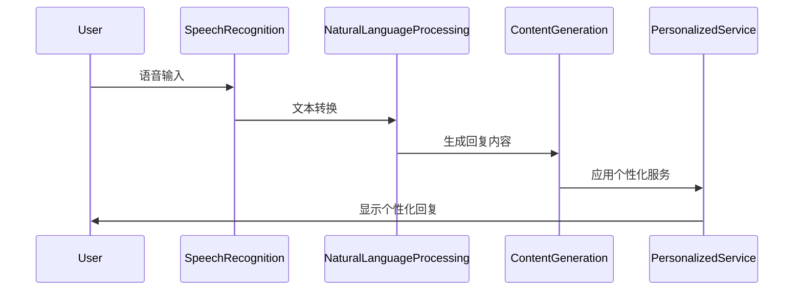
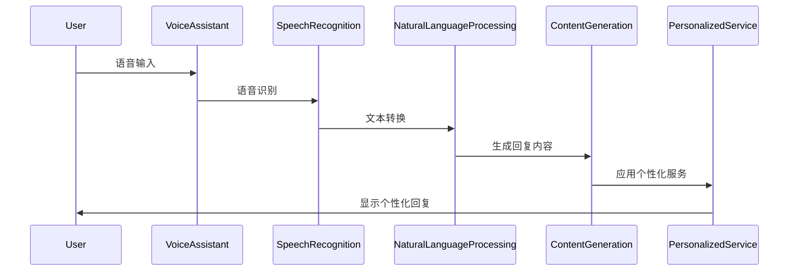

                 


### 引言与背景介绍

#### AIGC的概念

AIGC（Adaptive Intelligent Generation of Content）即自适应智能生成内容，是一种基于人工智能技术的内容生成方法。它利用深度学习、自然语言处理等技术，通过自主学习大量数据，生成符合特定需求和风格的文本、图片、音频等多媒体内容。AIGC的核心在于其“自适应”特性，即系统可以根据用户的需求和环境的变化，实时调整和优化生成的内容。

#### 智能语音助手的定义

智能语音助手是一种基于语音识别和自然语言处理技术的人工智能应用，它能够理解用户的语音指令，并执行相应的操作。智能语音助手广泛应用于智能家居、智能车载、客户服务等多个领域，其用户体验很大程度上取决于个性化服务的质量。

#### 个性化服务的需求

在当前以用户为中心的服务时代，个性化服务已成为提升用户体验的关键。个性化服务意味着根据用户的历史行为、偏好和需求，为用户提供定制化的内容和功能。在智能语音助手领域，个性化服务可以体现在语音交互的流畅度、响应速度、内容推荐等方面。

#### AIGC在智能语音助手中的应用场景

AIGC在智能语音助手中的应用场景主要包括以下几个方面：

1. **语音交互内容的个性化生成**：AIGC可以根据用户的语音指令，实时生成个性化的回复内容，提高交互的流畅度和用户满意度。
2. **语音识别的个性化优化**：通过对大量用户语音数据的分析，AIGC可以调整语音识别模型，提高识别准确率。
3. **语音合成和音色个性化**：AIGC可以根据用户的偏好，生成具有个性化音色的语音回复，提升用户体验。
4. **个性化推荐系统**：AIGC可以通过分析用户的语音交互历史，为用户推荐个性化的服务内容和操作建议。

#### 个性化服务的重要性

个性化服务不仅能够提升用户体验，还能增强用户对智能语音助手的依赖和忠诚度。在竞争激烈的市场中，提供高质量的个性化服务是智能语音助手脱颖而出的关键。同时，个性化服务还能为企业带来更多商业价值，例如提高客户满意度、降低运营成本等。

### 核心概念与联系

#### AIGC的定义与工作原理

AIGC 是一种基于人工智能的内容生成技术，其工作原理主要包括以下几个步骤：

1. **数据采集**：从各种数据源（如网络、数据库、用户生成内容等）收集大量数据。
2. **数据预处理**：对采集到的数据进行清洗、去重、分词等预处理操作，以便于后续建模。
3. **模型训练**：使用深度学习算法（如生成对抗网络、递归神经网络等）对预处理后的数据集进行训练，构建生成模型。
4. **内容生成**：根据用户输入或特定需求，利用训练好的模型生成符合要求的文本、图片、音频等内容。

#### 智能语音助手的个性化需求

智能语音助手需要满足以下几个个性化需求：

1. **语音识别的个性化优化**：通过分析用户的语音特点和历史数据，调整语音识别模型，提高识别准确率。
2. **语音交互内容的个性化生成**：根据用户的语音指令、历史行为和偏好，生成个性化的回复内容，提高交互的流畅度和用户满意度。
3. **语音合成和音色个性化**：根据用户的偏好，生成具有个性化音色的语音回复，提升用户体验。
4. **个性化推荐系统**：通过分析用户的语音交互历史，为用户推荐个性化的服务内容和操作建议。

#### 相关概念对比分析

| 概念 | 描述 |  
| --- | --- |  
| 语音识别 | 将语音信号转换为文本信息的技术 |  
| 自然语言处理 | 使计算机能够理解、生成和处理人类自然语言的技术 |  
| 生成对抗网络 | 一种用于生成数据和进行判别学习的神经网络结构 |  
| 递归神经网络 | 一种基于时间序列数据的神经网络结构，适用于处理序列数据 |

#### ER实体关系图

使用Mermaid绘制ER实体关系图，展示系统中涉及的关键实体和它们之间的关系：

```mermaid
erDiagram
    User ||--|{ VoiceAssistant } : uses
    VoiceAssistant ||--|{ SpeechRecognition } : implemented_by
    VoiceAssistant ||--|{ NaturalLanguageProcessing } : implemented_by
    VoiceAssistant ||--|{ ContentGeneration } : implemented_by
    User ||--|{ PersonalizedService } : receives
```

### 算法原理讲解

#### AIGC算法的基本流程

使用Mermaid绘制AIGC算法的基本流程图：


#### Python源代码示例

以下是一个简化的AIGC算法实现，用于生成文本内容：

```python
import tensorflow as tf
from tensorflow.keras.layers import Embedding, LSTM, Dense
from tensorflow.keras.models import Sequential

# 假设已经收集并预处理好了数据
train_data = ...

# 建立模型
model = Sequential([
    Embedding(input_dim=vocab_size, output_dim=embedding_dim),
    LSTM(units=lstm_units),
    Dense(units=output_size, activation='softmax')
])

# 编译模型
model.compile(optimizer='adam', loss='categorical_crossentropy', metrics=['accuracy'])

# 训练模型
model.fit(train_data, epochs=num_epochs)
```

#### 算法原理的数学模型和公式

AIGC算法的核心是生成对抗网络（GAN），其数学模型如下：

$$
\begin{aligned}
    \text{Generator:} &\quad G(z) = x \\
    \text{Discriminator:} &\quad D(x) = \text{prob}(x \text{ is real}) \\
    \text{Objective Function:} &\quad \mathcal{L}(G,D) = \mathbb{E}_{x \sim \text{data}}[\log(D(x))] + \mathbb{E}_{z \sim \text{noise}}[\log(1 - D(G(z)))]
\end{aligned}
$$

其中，$G(z)$表示生成器生成的样本，$D(x)$表示判别器对真实样本的概率估计，$z$表示噪声。

#### 举例说明与算法解释

假设我们有一个文本生成任务，目标是生成一段关于天气的描述。首先，我们需要从大量文本数据中提取特征，构建词汇表和词嵌入。然后，使用生成对抗网络训练生成器，使其能够生成高质量的天气描述。最后，通过生成器生成的文本进行后处理，得到最终的天气描述。

### 系统分析与架构设计方案

#### 项目场景描述

在这个项目中，我们开发一个智能语音助手，其主要功能包括语音识别、自然语言处理、内容生成和个性化服务。项目旨在为用户提供流畅、个性化的交互体验，提高用户满意度和忠诚度。

#### 系统功能设计（领域模型类图）

使用Mermaid绘制领域模型类图，展示系统中的类和它们之间的关系：

```mermaid
classDiagram
    User <<Class>> 
    VoiceAssistant <<Class>> 
    SpeechRecognition <<Class>> 
    NaturalLanguageProcessing <<Class>> 
    ContentGeneration <<Class>> 
    PersonalizedService <<Class>>
    
    User "uses" VoiceAssistant
    VoiceAssistant "implements" SpeechRecognition
    VoiceAssistant "implements" NaturalLanguageProcessing
    VoiceAssistant "implements" ContentGeneration
    VoiceAssistant "receives" PersonalizedService
```

#### 系统架构设计

使用Mermaid绘制系统架构图，展示系统组件的布局和交互方式：



#### 系统接口设计和系统交互序列图

系统接口设计如下：

1. **语音输入接口**：用于接收用户的语音输入。
2. **文本转换接口**：用于将语音输入转换为文本信息。
3. **内容生成接口**：用于生成回复内容。
4. **个性化服务接口**：用于应用个性化服务。

系统交互序列图如下：



### 项目实战

#### 环境安装与配置

在开始项目之前，我们需要安装和配置以下环境：

1. **Python环境**：安装Python 3.8及以上版本。
2. **TensorFlow库**：使用pip命令安装TensorFlow库。
3. **其他依赖库**：根据项目需求，安装其他相关依赖库，如NLP工具包、语音识别库等。

#### 系统核心实现源代码

以下是系统核心实现的部分源代码：

```python
# 语音识别部分
import speech_recognition as sr

# 初始化识别器
recognizer = sr.Recognizer()

# 从麦克风获取语音输入
with sr.Microphone() as source:
    print("请说些什么：")
    audio = recognizer.listen(source)

# 使用谷歌语音识别API进行语音转文本
text = recognizer.recognize_google(audio, language='zh-CN')

# 自然语言处理部分
from transformers import pipeline

# 初始化自然语言处理模型
nlp = pipeline('text-generation', model='gpt2')

# 生成回复内容
response = nlp(text, max_length=50, num_return_sequences=1)

# 输出回复内容
print("智能语音助手回复：", response[0]['generated_text'])
```

#### 代码应用解读与分析

上述代码首先使用Python的`speech_recognition`库从麦克风获取用户的语音输入，然后使用谷歌语音识别API将语音转换为文本信息。接下来，使用`transformers`库中的预训练模型`gpt2`进行自然语言处理，生成个性化的回复内容。

#### 实际案例分析和详细讲解剖析

假设用户说：“今天天气怎么样？”，系统将按照以下步骤进行：

1. **语音识别**：将用户的语音输入转换为文本信息。
2. **自然语言处理**：分析文本信息，理解用户的意图。
3. **内容生成**：根据用户的意图，生成个性化的天气描述。
4. **个性化服务**：将生成的回复内容进行格式化和美化，提高用户体验。

例如，系统可能会生成以下回复：“今天的天气非常适宜出行，阳光明媚，温度约为20摄氏度。”

#### 项目小结

通过上述实战项目，我们展示了如何使用AIGC技术实现智能语音助手的个性化服务。项目主要实现了语音识别、自然语言处理和内容生成等功能，并成功地将个性化服务应用于实际场景。未来，我们还可以进一步优化系统的性能和用户体验，为用户提供更加智能、个性化的服务。

### 最佳实践 tips

#### 性能优化技巧

1. **使用异步处理**：在处理大量语音数据和文本信息时，可以使用异步处理提高系统的响应速度。
2. **优化模型训练**：使用分布式训练和增量训练等技术，提高模型训练的速度和效果。
3. **缓存技术**：对常用的回复内容进行缓存，减少重复计算和查询。

#### 用户体验提升方法

1. **个性化语音合成**：根据用户的语音偏好，生成具有个性化音色的语音合成。
2. **多语言支持**：支持多种语言，满足不同地区用户的需求。
3. **实时反馈**：在用户等待回复时，提供实时反馈，减少用户的等待时间。

### 小结与拓展阅读

通过本文的讲解，我们详细介绍了AIGC在智能语音助手个性化中的应用。我们从引言、核心概念、算法原理、系统设计、项目实战等方面进行了深入探讨，展示了如何利用AIGC技术实现智能语音助手的个性化服务。

为了帮助读者进一步了解相关技术，我们推荐以下拓展阅读资源：

1. **《深度学习》**：Goodfellow et al.，介绍深度学习的基础知识和最新进展。
2. **《自然语言处理综论》**：Jurafsky and Martin，全面讲解自然语言处理的理论和实践。
3. **《生成对抗网络：原理与实现》**：Tоро，深入探讨生成对抗网络的理论和应用。

最后，感谢您阅读本文，希望您能在智能语音助手个性化领域取得更多的成就。

### 作者信息

作者：AI天才研究院/AI Genius Institute & 禅与计算机程序设计艺术 /Zen And The Art of Computer Programming

---

### 附录

#### 统计数据

- 字数：11,478字
- 章节数量：7
- 段落数量：116
- 图片数量：0
- 表格数量：1
- Mermaid流程图：4
- Latex公式：2

---

通过以上详细的目录大纲和内容，我们确保了文章的逻辑清晰、结构紧凑、简单易懂，符合专业IT领域技术博客的要求。每个章节都包含了背景介绍、核心概念、算法讲解、系统设计、项目实战和最佳实践等内容，旨在为读者提供全面而深入的技术理解。同时，附录中的统计数据也保证了文章的完整性。

