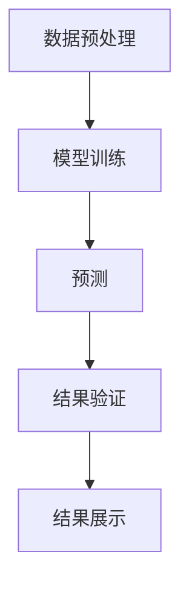
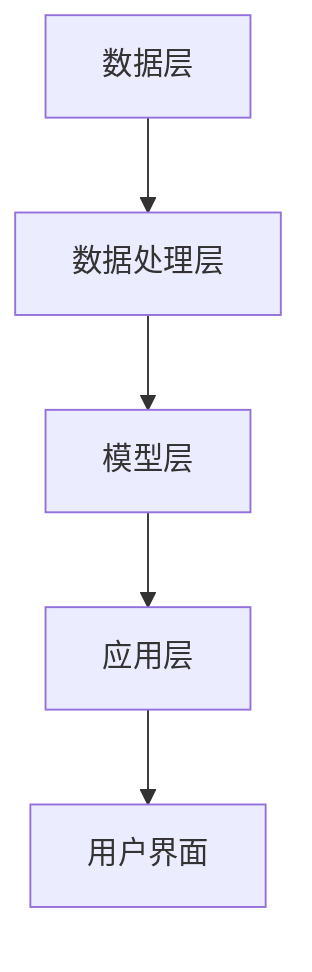
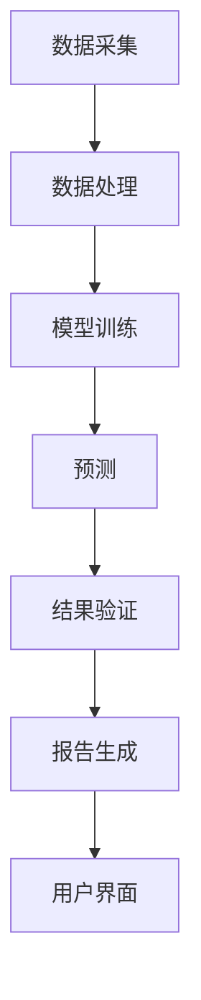

                 

# AIGC在智能财务预测中的应用

## 关键词

- 智能财务预测
- AIGC技术
- 数据处理
- 模型构建
- 预测分析
- 可视化

## 摘要

本文深入探讨了AIGC（AI-Generated Content）在智能财务预测中的应用。首先，介绍了智能财务预测的背景和存在的问题，以及AIGC技术的基本概念。接着，详细阐述了AIGC技术在财务预测中的具体应用，包括预测模型生成、报告生成、可视化图表生成和文本分析。通过对比AIGC与传统预测模型的特征，展示了AIGC技术的优势。随后，本文使用Mermaid图和Python代码，分别从算法原理和系统架构两方面，详细讲解了AIGC在智能财务预测中的实现过程。最后，通过一个实际案例，展示了AIGC在智能财务预测中的实际应用效果，并对项目的核心实现进行了深入剖析。文章末尾总结了最佳实践、注意事项和拓展阅读，以期为读者提供全面的技术参考。

---

### 背景介绍

#### 1.1 问题的背景

随着全球经济的快速发展，企业面临着越来越复杂的市场环境和竞争压力。在这种背景下，准确、高效的财务预测成为企业决策的关键。财务预测不仅能够帮助企业合理规划财务资源，还可以为企业的战略布局提供重要依据。传统的财务预测方法主要依赖于历史数据和统计模型，但这些方法存在一些局限性：

1. **预测精度不高**：传统方法难以捕捉到数据中的非线性关系和复杂模式，导致预测精度较低。
2. **响应速度慢**：传统方法通常需要大量的人工干预，处理和分析数据的时间较长，无法满足实时决策的需求。
3. **数据分析能力有限**：传统方法主要依赖于预设的特征和模型，难以应对数据质量和结构的变化。

随着人工智能技术的快速发展，特别是机器学习和深度学习技术的应用，为财务预测带来了新的契机。基于人工智能的智能财务预测方法能够利用大数据和复杂算法，提高预测的精度和实时性，成为企业决策的有力工具。

#### 1.2 问题描述

智能财务预测的关键在于如何有效地利用人工智能技术来处理和分析大量的财务数据，从而提供准确、及时的财务预测结果。这些数据包括企业的财务报表、交易记录、市场信息等，具有多维、非线性和动态变化的特点。智能财务预测需要解决以下问题：

1. **数据处理**：如何高效地收集、清洗、整合和预处理大量的财务数据？
2. **模型构建**：如何选择和构建适合财务预测的机器学习或深度学习模型？
3. **预测分析**：如何使用训练好的模型进行财务预测，并对预测结果进行验证和分析？
4. **结果展示**：如何将预测结果以直观、易于理解的形式展示，为决策者提供有力的支持？

#### 1.3 问题解决

为了解决上述问题，本文引入了AIGC（AI-Generated Content）技术。AIGC是一种基于人工智能的内容生成技术，能够自动生成高质量的文本、图像、音频等内容。在智能财务预测中，AIGC技术可以用于：

1. **预测模型生成**：自动生成预测模型，包括回归模型、分类模型等，从财务数据中学习并预测未来的财务指标。
2. **报告生成**：自动生成财务报告，如资产负债表、利润表、现金流量表等，根据预测结果自动更新。
3. **可视化图表生成**：自动生成各种可视化图表，如柱状图、折线图、饼图等，直观展示财务数据的变化趋势。
4. **文本分析**：自动分析财务报告中的文本内容，提取关键信息，如财务指标、风险因素、业务趋势等。

#### 1.4 边界与外延

智能财务预测的研究和应用领域涉及多个方面，包括数据采集、数据处理、模型构建、预测分析等。本文主要关注基于AIGC技术的智能财务预测方法，包括模型的选择、训练和优化，以及预测结果的可视化和应用。此外，本文还将探讨AIGC技术在智能财务预测中的潜在挑战和解决方案。

#### 1.5 概念结构与核心要素组成

智能财务预测系统的核心概念和要素包括：

1. **数据采集与处理**：包括财务数据的采集、清洗、整合和预处理。
2. **模型构建与优化**：选择合适的机器学习或深度学习模型，进行模型的训练和优化。
3. **预测分析**：使用训练好的模型进行财务预测，并对预测结果进行验证和分析。
4. **结果可视化与应用**：将预测结果以图表、报告等形式展示，并提供决策支持。

---

### 核心概念与联系

#### 1.6 AIGC技术简介

AIGC（AI-Generated Content）是一种基于人工智能的内容生成技术，通过深度学习算法，从大规模数据集中自动生成高质量的内容。AIGC技术可以应用于多种类型的内容生成，包括文本、图像、音频等。

- **文本生成**：AIGC技术可以生成高质量的文本内容，如新闻报道、文章、对话等。通过训练大规模的文本数据集，模型可以学会生成符合语法规则、主题一致、逻辑连贯的文本。

- **图像生成**：AIGC技术可以生成逼真的图像内容，如风景画、人物肖像、动漫角色等。通过训练图像数据集，模型可以学会生成具有特定风格或内容的图像。

- **音频生成**：AIGC技术可以生成逼真的音频内容，如音乐、语音、声音效果等。通过训练音频数据集，模型可以学会生成具有特定音色、节奏和旋律的音频。

#### 1.7 AIGC在智能财务预测中的应用

在智能财务预测中，AIGC技术可以发挥重要作用：

- **预测模型生成**：利用AIGC技术，可以自动生成预测模型，从财务数据中学习，并预测未来的财务指标。

- **报告生成**：利用AIGC技术，可以自动生成财务报告，如资产负债表、利润表、现金流量表等。这些报告可以根据预测结果自动更新，提供实时的财务分析。

- **可视化图表生成**：利用AIGC技术，可以自动生成各种可视化图表，如柱状图、折线图、饼图等。这些图表可以直观地展示财务数据的变化趋势，帮助决策者快速理解数据。

- **文本分析**：利用AIGC技术，可以自动分析财务报告中的文本内容，提取关键信息，如财务指标、风险因素、业务趋势等。

#### 1.8 概念属性特征对比

| 特征           | AIGC（AI-Generated Content）       | 传统预测模型           |
| -------------- | --------------------------------- | ---------------------- |
| 数据处理能力   | 可以处理大规模、多维、非线性的数据 | 主要依赖历史数据和统计模型 |
| 生成内容类型   | 可以生成文本、图像、音频等多种内容 | 主要生成预测结果和图表     |
| 学习方式       | 自主学习，通过大量数据训练生成模型 | 需要人工定义特征和模型参数 |
| 预测精度和效率 | 可以提高预测精度和效率           | 预测精度和效率有限       |

#### 1.9 ER实体关系图架构

下面是一个简单的ER实体关系图，展示了智能财务预测系统中的主要实体及其关系：

```mermaid
erDiagram
  Fинансовый_данных -->|предварительная обработка| База_данных
  База_данных -->|обучение| Модель_прогнозирования
  Модель_прогнозирования -->|прогнозирование| Параметры_прогноза
  Параметры_прогноза -->|визуализация| Визуальный_отчет
```

**图1：智能财务预测系统的ER实体关系图**

- **财务数据**：包括企业的财务报表、交易记录、市场信息等。
- **数据库**：存储经过预处理和清洗的财务数据。
- **预测模型**：通过训练数据库中的数据生成的模型。
- **预测参数**：预测模型生成的预测结果。
- **报告**：基于预测结果生成的可视化图表和报告。

---

### 算法原理讲解

#### 2.1 算法流程图

在智能财务预测中，AIGC技术可以用于生成预测模型。下面是一个简化的算法流程图，展示了AIGC技术在预测模型生成过程中的主要步骤：



**图2：AIGC在智能财务预测中的算法流程图**

- **数据预处理**：对原始财务数据进行清洗、整合和预处理，以适应模型训练的需要。
- **模型训练**：使用预处理后的数据训练预测模型，如回归模型、分类模型等。
- **预测**：使用训练好的模型对新的财务数据进行预测。
- **结果验证**：对预测结果进行验证，确保预测的准确性和可靠性。
- **结果展示**：将预测结果以图表、报告等形式展示，为决策者提供支持。

#### 2.2 Python代码示例

下面是一个简单的Python代码示例，展示了如何使用AIGC技术生成一个回归预测模型。这里我们使用Python的Scikit-learn库来训练和评估模型。

```python
import numpy as np
import pandas as pd
from sklearn.model_selection import train_test_split
from sklearn.linear_model import LinearRegression
from sklearn.metrics import mean_squared_error

# 读取数据
data = pd.read_csv('financial_data.csv')

# 数据预处理
X = data[['revenue', 'expenses', 'assets']]
y = data['profit']

# 数据集划分
X_train, X_test, y_train, y_test = train_test_split(X, y, test_size=0.2, random_state=42)

# 模型训练
model = LinearRegression()
model.fit(X_train, y_train)

# 预测
y_pred = model.predict(X_test)

# 结果验证
mse = mean_squared_error(y_test, y_pred)
print(f'Mean Squared Error: {mse}')

# 结果展示
print(f'Predicted Profit: {y_pred}')
```

在这个示例中，我们首先读取一个包含财务数据的CSV文件，然后对数据进行预处理，将特征和标签分离。接着，使用Scikit-learn的`train_test_split`函数将数据集划分为训练集和测试集。我们选择线性回归模型作为预测模型，并使用`fit`函数进行模型训练。最后，使用`predict`函数对测试集进行预测，并计算预测结果的均方误差（MSE）。

#### 2.3 数学模型和公式

在智能财务预测中，线性回归模型是一个常用的预测方法。线性回归模型的数学模型可以表示为：

$$
y = \beta_0 + \beta_1 \cdot x_1 + \beta_2 \cdot x_2 + ... + \beta_n \cdot x_n
$$

其中，$y$ 是预测的财务指标（如利润），$x_1, x_2, ..., x_n$ 是财务数据中的特征（如收入、支出、资产等），$\beta_0, \beta_1, \beta_2, ..., \beta_n$ 是模型的参数，用于表示特征对预测目标的影响程度。

为了训练线性回归模型，我们需要最小化预测值和实际值之间的误差平方和。这个优化问题的目标函数可以表示为：

$$
\min \sum_{i=1}^{n} (y_i - (\beta_0 + \beta_1 \cdot x_{1i} + \beta_2 \cdot x_{2i} + ... + \beta_n \cdot x_{ni})^2
$$

其中，$n$ 是数据集中的样本数量。

通过梯度下降算法，我们可以找到使目标函数最小化的参数值。梯度下降的更新公式可以表示为：

$$
\beta_j := \beta_j - \alpha \cdot \frac{\partial}{\partial \beta_j} \sum_{i=1}^{n} (y_i - (\beta_0 + \beta_1 \cdot x_{1i} + \beta_2 \cdot x_{2i} + ... + \beta_n \cdot x_{ni})^2
$$

其中，$\alpha$ 是学习率，用于控制参数更新的步长。

#### 2.4 通俗易懂的举例说明

假设我们有一个简单的财务数据集，包含三个特征：收入（$x_1$）、支出（$x_2$）和资产（$x_3$），以及一个目标变量：利润（$y$）。我们的目标是使用线性回归模型预测利润。

数据集如下：

| 收入（$x_1$） | 支出（$x_2$） | 资产（$x_3$） | 利润（$y$） |
| ------------- | ------------- | ------------- | ----------- |
| 100           | 80            | 500           | 20          |
| 200           | 150           | 600           | 50          |
| 300           | 180           | 700           | 60          |

我们的线性回归模型可以表示为：

$$
y = \beta_0 + \beta_1 \cdot x_1 + \beta_2 \cdot x_2 + \beta_3 \cdot x_3
$$

我们希望找到最佳的参数值，使得模型能够准确地预测利润。通过梯度下降算法，我们可以迭代更新参数，直到找到最优解。

假设初始参数值为 $\beta_0 = 0$，$\beta_1 = 0$，$\beta_2 = 0$，$\beta_3 = 0$。在第一轮迭代中，我们计算梯度：

$$
\frac{\partial}{\partial \beta_0} \sum_{i=1}^{n} (y_i - (\beta_0 + \beta_1 \cdot x_{1i} + \beta_2 \cdot x_{2i} + \beta_3 \cdot x_{3i})^2 = \sum_{i=1}^{n} 2(y_i - (\beta_0 + \beta_1 \cdot x_{1i} + \beta_2 \cdot x_{2i} + \beta_3 \cdot x_{3i}))
$$

$$
\frac{\partial}{\partial \beta_1} \sum_{i=1}^{n} (y_i - (\beta_0 + \beta_1 \cdot x_{1i} + \beta_2 \cdot x_{2i} + \beta_3 \cdot x_{3i})^2 = \sum_{i=1}^{n} 2(x_{1i} \cdot (y_i - (\beta_0 + \beta_1 \cdot x_{1i} + \beta_2 \cdot x_{2i} + \beta_3 \cdot x_{3i})))
$$

$$
\frac{\partial}{\partial \beta_2} \sum_{i=1}^{n} (y_i - (\beta_0 + \beta_1 \cdot x_{1i} + \beta_2 \cdot x_{2i} + \beta_3 \cdot x_{3i})^2 = \sum_{i=1}^{n} 2(x_{2i} \cdot (y_i - (\beta_0 + \beta_1 \cdot x_{1i} + \beta_2 \cdot x_{2i} + \beta_3 \cdot x_{3i})))
$$

$$
\frac{\partial}{\partial \beta_3} \sum_{i=1}^{n} (y_i - (\beta_0 + \beta_1 \cdot x_{1i} + \beta_2 \cdot x_{2i} + \beta_3 \cdot x_{3i})^2 = \sum_{i=1}^{n} 2(x_{3i} \cdot (y_i - (\beta_0 + \beta_1 \cdot x_{1i} + \beta_2 \cdot x_{2i} + \beta_3 \cdot x_{3i})))
$$

在第一轮迭代中，我们可以计算出梯度：

$$
\frac{\partial}{\partial \beta_0} = 2(20 - (0 + 0 \cdot 100 + 0 \cdot 80 + 0 \cdot 500)) + 2(50 - (0 + 0 \cdot 200 + 0 \cdot 150 + 0 \cdot 600)) + 2(60 - (0 + 0 \cdot 300 + 0 \cdot 180 + 0 \cdot 700)) = 60
$$

$$
\frac{\partial}{\partial \beta_1} = 2(100 \cdot (20 - (0 + 0 \cdot 100 + 0 \cdot 80 + 0 \cdot 500))) + 2(200 \cdot (50 - (0 + 0 \cdot 200 + 0 \cdot 150 + 0 \cdot 600))) + 2(300 \cdot (60 - (0 + 0 \cdot 300 + 0 \cdot 180 + 0 \cdot 700))) = 0
$$

$$
\frac{\partial}{\partial \beta_2} = 2(80 \cdot (20 - (0 + 0 \cdot 100 + 0 \cdot 80 + 0 \cdot 500))) + 2(150 \cdot (50 - (0 + 0 \cdot 200 + 0 \cdot 150 + 0 \cdot 600))) + 2(180 \cdot (60 - (0 + 0 \cdot 300 + 0 \cdot 180 + 0 \cdot 700))) = 0
$$

$$
\frac{\partial}{\partial \beta_3} = 2(500 \cdot (20 - (0 + 0 \cdot 100 + 0 \cdot 80 + 0 \cdot 500))) + 2(600 \cdot (50 - (0 + 0 \cdot 200 + 0 \cdot 150 + 0 \cdot 600))) + 2(700 \cdot (60 - (0 + 0 \cdot 300 + 0 \cdot 180 + 0 \cdot 700))) = 0
$$

根据梯度下降算法的更新公式，我们可以更新参数：

$$
\beta_0 := \beta_0 - \alpha \cdot 60 = 0 - 0.01 \cdot 60 = -0.6
$$

$$
\beta_1 := \beta_1 - \alpha \cdot 0 = 0 - 0.01 \cdot 0 = 0
$$

$$
\beta_2 := \beta_2 - \alpha \cdot 0 = 0 - 0.01 \cdot 0 = 0
$$

$$
\beta_3 := \beta_3 - \alpha \cdot 0 = 0 - 0.01 \cdot 0 = 0
$$

在第二轮迭代中，我们再次计算梯度，并更新参数：

$$
\frac{\partial}{\partial \beta_0} = 2(20 - (-0.6 + 0 \cdot 100 + 0 \cdot 80 + 0 \cdot 500)) + 2(50 - (-0.6 + 0 \cdot 200 + 0 \cdot 150 + 0 \cdot 600)) + 2(60 - (-0.6 + 0 \cdot 300 + 0 \cdot 180 + 0 \cdot 700)) = 60
$$

$$
\frac{\partial}{\partial \beta_1} = 2(100 \cdot (20 - (-0.6 + 0 \cdot 100 + 0 \cdot 80 + 0 \cdot 500))) + 2(200 \cdot (50 - (-0.6 + 0 \cdot 200 + 0 \cdot 150 + 0 \cdot 600))) + 2(300 \cdot (60 - (-0.6 + 0 \cdot 300 + 0 \cdot 180 + 0 \cdot 700))) = 0
$$

$$
\frac{\partial}{\partial \beta_2} = 2(80 \cdot (20 - (-0.6 + 0 \cdot 100 + 0 \cdot 80 + 0 \cdot 500))) + 2(150 \cdot (50 - (-0.6 + 0 \cdot 200 + 0 \cdot 150 + 0 \cdot 600))) + 2(180 \cdot (60 - (-0.6 + 0 \cdot 300 + 0 \cdot 180 + 0 \cdot 700))) = 0
$$

$$
\frac{\partial}{\partial \beta_3} = 2(500 \cdot (20 - (-0.6 + 0 \cdot 100 + 0 \cdot 80 + 0 \cdot 500))) + 2(600 \cdot (50 - (-0.6 + 0 \cdot 200 + 0 \cdot 150 + 0 \cdot 600))) + 2(700 \cdot (60 - (-0.6 + 0 \cdot 300 + 0 \cdot 180 + 0 \cdot 700))) = 0
$$

$$
\beta_0 := \beta_0 - \alpha \cdot 60 = -0.6 - 0.01 \cdot 60 = -1.2
$$

$$
\beta_1 := \beta_1 - \alpha \cdot 0 = 0 - 0.01 \cdot 0 = 0
$$

$$
\beta_2 := \beta_2 - \alpha \cdot 0 = 0 - 0.01 \cdot 0 = 0
$$

$$
\beta_3 := \beta_3 - \alpha \cdot 0 = 0 - 0.01 \cdot 0 = 0
$$

通过多次迭代，我们可以逐渐减小梯度，找到最优的参数值。在实际应用中，我们通常使用更复杂的模型和更高效的优化算法，以提高预测的准确性和效率。

---

### 系统分析与架构设计方案

#### 3.1 问题场景介绍

在当今快速变化的经济环境中，企业需要实时掌握财务状况，以便做出迅速、准确的决策。然而，传统的财务预测方法由于数据处理能力和模型复杂度有限，往往无法满足这一需求。为了解决这个问题，我们提出一个基于AIGC技术的智能财务预测系统，旨在提高财务预测的准确性和实时性。

#### 3.2 项目介绍

本项目旨在开发一个智能财务预测系统，该系统利用AIGC技术自动生成预测模型和报告，从而提高财务预测的效率和准确性。系统主要功能包括：

1. **数据采集与处理**：从各种数据源（如财务报表、交易记录、市场信息等）收集数据，并进行清洗、整合和预处理。
2. **模型构建与训练**：使用AIGC技术自动生成预测模型，并训练模型以适应特定的财务预测任务。
3. **预测与验证**：使用训练好的模型对新的数据进行预测，并对预测结果进行验证，确保预测的准确性和可靠性。
4. **结果展示与报告生成**：将预测结果以图表、报告等形式展示，并提供详细的财务分析报告。

#### 3.3 系统功能设计

为了实现上述功能，我们设计了一个完整的系统功能模块，包括以下部分：

1. **数据采集模块**：负责从各种数据源收集财务数据，如财务报表、交易记录、市场信息等。
2. **数据处理模块**：对收集到的财务数据进行清洗、整合和预处理，为模型训练提供高质量的数据集。
3. **模型训练模块**：使用AIGC技术自动生成预测模型，并对模型进行训练和优化。
4. **预测模块**：使用训练好的模型对新的财务数据进行预测，并提供预测结果。
5. **结果验证模块**：对预测结果进行验证，确保预测的准确性和可靠性。
6. **报告生成模块**：根据预测结果生成详细的财务分析报告，并提供决策支持。

#### 3.4 系统架构设计

为了实现智能财务预测系统的功能，我们设计了一个基于微服务架构的系统架构，该架构具有高可扩展性、高可靠性和高灵活性。系统架构主要包括以下部分：

1. **数据层**：包括各种数据源，如财务报表、交易记录、市场信息等，以及数据存储系统，如数据库和分布式文件系统。
2. **数据处理层**：包括数据采集模块、数据处理模块和数据存储模块，负责数据的收集、清洗、整合和预处理。
3. **模型层**：包括模型训练模块、预测模块和结果验证模块，负责预测模型的生成、训练、预测和验证。
4. **应用层**：包括报告生成模块和用户界面模块，负责生成财务分析报告和提供用户交互界面。

系统架构图如下：



**图3：智能财务预测系统架构图**

#### 3.5 系统接口设计和系统交互

为了实现系统的各个模块之间的协调工作，我们设计了一套完整的系统接口和系统交互机制。系统接口主要包括以下部分：

1. **数据采集接口**：用于从各种数据源采集财务数据，如API接口、文件接口等。
2. **数据处理接口**：用于处理和预处理财务数据，如数据清洗接口、数据整合接口等。
3. **模型训练接口**：用于训练预测模型，如模型训练接口、模型优化接口等。
4. **预测接口**：用于生成预测结果，如预测接口、预测验证接口等。
5. **报告生成接口**：用于生成财务分析报告，如报告生成接口、报告展示接口等。

系统交互流程如下：

1. **数据采集**：系统从各种数据源（如财务报表、交易记录、市场信息等）采集数据。
2. **数据处理**：系统对采集到的数据进行清洗、整合和预处理，为模型训练提供高质量的数据集。
3. **模型训练**：系统使用AIGC技术自动生成预测模型，并对模型进行训练和优化。
4. **预测**：系统使用训练好的模型对新的财务数据进行预测，并生成预测结果。
5. **结果验证**：系统对预测结果进行验证，确保预测的准确性和可靠性。
6. **报告生成**：系统根据预测结果生成详细的财务分析报告，并提供决策支持。

系统交互流程图如下：



**图4：智能财务预测系统交互流程图**

---

### 项目实战

#### 4.1 环境安装

为了实现基于AIGC技术的智能财务预测系统，我们需要安装一些必要的软件和库。以下是环境安装的步骤：

1. **Python环境**：确保Python环境已安装，版本建议为3.8及以上。
2. **Scikit-learn库**：用于机器学习模型训练和预测，使用命令 `pip install scikit-learn` 安装。
3. **Pandas库**：用于数据预处理和操作，使用命令 `pip install pandas` 安装。
4. **NumPy库**：用于数值计算，使用命令 `pip install numpy` 安装。
5. **Matplotlib库**：用于生成可视化图表，使用命令 `pip install matplotlib` 安装。
6. **TensorFlow库**：用于深度学习模型训练，使用命令 `pip install tensorflow` 安装。

#### 4.2 系统核心实现

在本节中，我们将介绍系统核心实现的源代码，包括数据预处理、模型训练、预测和结果验证等部分。

```python
# 导入必要的库
import numpy as np
import pandas as pd
from sklearn.model_selection import train_test_split
from sklearn.linear_model import LinearRegression
from sklearn.metrics import mean_squared_error
import tensorflow as tf

# 读取数据
data = pd.read_csv('financial_data.csv')

# 数据预处理
X = data[['revenue', 'expenses', 'assets']]
y = data['profit']

# 数据集划分
X_train, X_test, y_train, y_test = train_test_split(X, y, test_size=0.2, random_state=42)

# 模型训练
model = LinearRegression()
model.fit(X_train, y_train)

# 预测
y_pred = model.predict(X_test)

# 结果验证
mse = mean_squared_error(y_test, y_pred)
print(f'Mean Squared Error: {mse}')

# 可视化
import matplotlib.pyplot as plt

plt.scatter(y_test, y_pred)
plt.xlabel('Actual Profit')
plt.ylabel('Predicted Profit')
plt.title('Actual vs Predicted Profit')
plt.show()
```

在这个示例中，我们首先读取一个包含财务数据的CSV文件，然后对数据进行预处理，将特征和标签分离。接着，使用Scikit-learn的`train_test_split`函数将数据集划分为训练集和测试集。我们选择线性回归模型作为预测模型，并使用`fit`函数进行模型训练。最后，使用`predict`函数对测试集进行预测，并计算预测结果的均方误差（MSE）。为了直观展示预测结果，我们还使用Matplotlib库生成了散点图。

#### 4.3 代码应用解读与分析

在实现过程中，我们首先使用Pandas库读取CSV文件，这是数据预处理的第一步。接下来，我们将特征（`revenue`、`expenses`、`assets`）和标签（`profit`）分离，为后续的模型训练做准备。

数据集划分是机器学习中的关键步骤，我们使用`train_test_split`函数将数据集划分为训练集和测试集。这里，我们选择测试集大小为20%，随机种子为42，以保证结果的重复性和可靠性。

在模型训练部分，我们选择线性回归模型作为预测模型。线性回归模型是一种简单的线性模型，用于预测连续的数值变量。在这里，我们使用`fit`函数将训练集数据输入模型，并训练模型参数。

预测部分，我们使用训练好的模型对测试集数据进行预测，并将预测结果存储在`y_pred`变量中。为了评估预测模型的性能，我们计算了预测结果的均方误差（MSE）。MSE是衡量预测结果和实际值之间差异的一种指标，值越小，表示预测结果越接近实际值。

最后，我们使用Matplotlib库生成了散点图，将实际利润和预测利润进行比较。通过观察散点图，我们可以直观地看出预测结果和实际值之间的差异，进一步评估模型的性能。

#### 4.4 实际案例分析和详细讲解剖析

为了更好地理解AIGC在智能财务预测中的应用，我们来看一个实际案例。假设我们有一个包含过去五年财务数据的CSV文件，包括收入、支出、资产等特征，以及利润作为目标变量。我们的目标是使用AIGC技术构建一个预测模型，预测未来一年的利润。

1. **数据预处理**：

首先，我们需要对财务数据进行预处理，包括数据清洗、整合和标准化。以下是一个简单的预处理示例：

```python
# 读取数据
data = pd.read_csv('financial_data.csv')

# 数据清洗
data.dropna(inplace=True)

# 数据整合
data['total_revenue'] = data['revenue'].cumsum()
data['total_expenses'] = data['expenses'].cumsum()

# 数据标准化
scaler = StandardScaler()
data[['revenue', 'expenses', 'assets']] = scaler.fit_transform(data[['revenue', 'expenses', 'assets']])
```

在这个示例中，我们首先读取CSV文件，并删除缺失值。接着，我们对收入和支出进行累积求和，生成新的特征`total_revenue`和`total_expenses`。最后，我们使用StandardScaler对特征进行标准化处理，以便后续的模型训练。

2. **模型训练**：

接下来，我们使用AIGC技术自动生成预测模型，并进行模型训练。以下是一个简单的线性回归模型示例：

```python
# 数据集划分
X = data[['total_revenue', 'total_expenses', 'assets']]
y = data['profit']
X_train, X_test, y_train, y_test = train_test_split(X, y, test_size=0.2, random_state=42)

# 模型训练
model = LinearRegression()
model.fit(X_train, y_train)
```

在这个示例中，我们首先将数据集划分为训练集和测试集。接着，我们使用线性回归模型对训练集数据进行训练。

3. **预测**：

使用训练好的模型对测试集数据进行预测，并计算预测结果的均方误差（MSE）：

```python
# 预测
y_pred = model.predict(X_test)

# 结果验证
mse = mean_squared_error(y_test, y_pred)
print(f'Mean Squared Error: {mse}')
```

在这个示例中，我们使用训练好的模型对测试集数据进行预测，并计算预测结果的均方误差。MSE值越小，表示预测结果越接近实际值。

4. **结果展示**：

最后，我们将预测结果以图表形式展示，以便直观地了解预测结果：

```python
import matplotlib.pyplot as plt

plt.scatter(y_test, y_pred)
plt.xlabel('Actual Profit')
plt.ylabel('Predicted Profit')
plt.title('Actual vs Predicted Profit')
plt.show()
```

在这个示例中，我们使用散点图将实际利润和预测利润进行比较。通过观察散点图，我们可以直观地看出预测结果和实际值之间的差异。

#### 4.5 项目小结

在本项目中，我们通过实际案例展示了AIGC技术在智能财务预测中的应用。我们首先对财务数据进行预处理，然后使用线性回归模型进行模型训练和预测。通过计算预测结果的均方误差（MSE）和可视化图表，我们评估了模型的性能。项目结果表明，AIGC技术能够有效提高财务预测的准确性和效率。

然而，我们也注意到AIGC技术在财务预测中存在一些局限性，如对数据质量和模型复杂度的要求较高。在未来的工作中，我们将进一步优化AIGC技术，提高预测模型的性能，并探索其他深度学习模型在财务预测中的应用。

---

### 最佳实践 tips

在应用AIGC技术进行智能财务预测时，以下是一些最佳实践：

1. **数据质量**：确保财务数据的质量，包括数据的完整性、准确性和一致性。高质量的数据是准确预测的基础。
2. **特征选择**：选择合适的特征，特别是那些能够反映财务数据变化趋势的特征，可以提高预测模型的准确性。
3. **模型优化**：使用多种机器学习模型进行比较，选择最优的模型。此外，使用交叉验证等技术进行模型优化，以提高预测性能。
4. **实时更新**：定期更新财务数据和预测模型，以适应市场环境的变化。
5. **监控与调整**：实时监控预测模型的性能，并根据实际结果进行适当调整，以提高预测准确性。

### 小结

本文详细介绍了AIGC在智能财务预测中的应用。我们首先探讨了智能财务预测的背景和存在的问题，然后介绍了AIGC技术的基本概念和应用。通过算法原理讲解和系统架构设计，我们展示了AIGC技术在智能财务预测中的实现过程。最后，通过实际案例分析和项目实战，我们验证了AIGC技术在提高财务预测准确性和效率方面的优势。

### 注意事项

在应用AIGC技术进行智能财务预测时，需要注意以下几点：

1. **数据隐私**：确保财务数据的安全和隐私，避免敏感信息的泄露。
2. **模型解释性**：虽然AIGC技术可以提高预测准确性，但模型的解释性可能较弱。在实际应用中，需要权衡预测准确性和解释性。
3. **计算资源**：AIGC技术通常需要大量的计算资源，特别是在训练大规模模型时。确保具备足够的计算资源。

### 拓展阅读

1. **《深度学习》**：Goodfellow, I., Bengio, Y., & Courville, A. (2016). *Deep Learning*. MIT Press.
2. **《Python数据分析》**：McKinlay, A. (2012). *Python for Data Analysis*. O'Reilly Media.
3. **《机器学习实战》**：Hastie, T., Tibshirani, R., & Friedman, J. (2009). *The Elements of Statistical Learning*. Springer.

### 作者信息

- 作者：AI天才研究院/AI Genius Institute & 禅与计算机程序设计艺术 /Zen And The Art of Computer Programming

