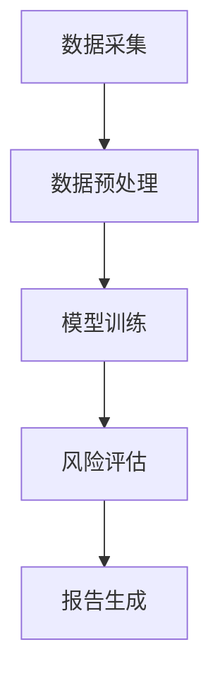
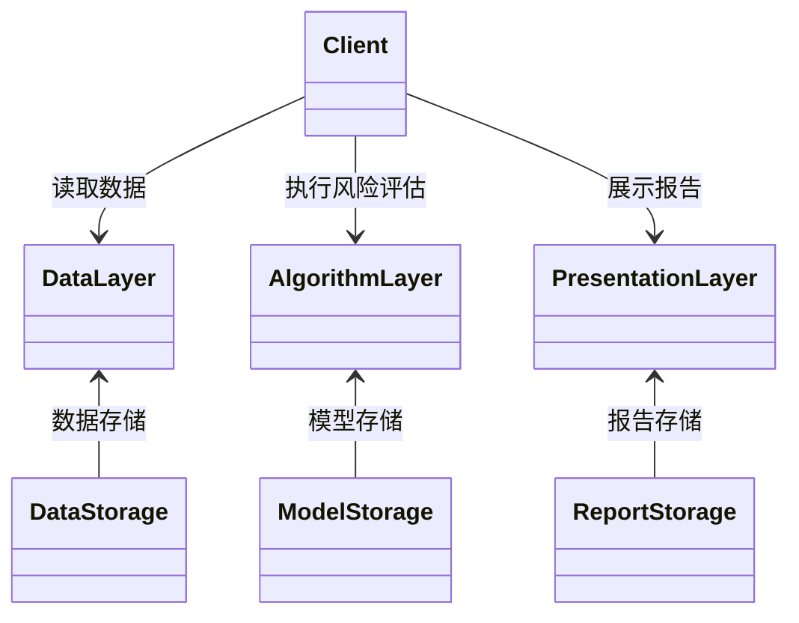
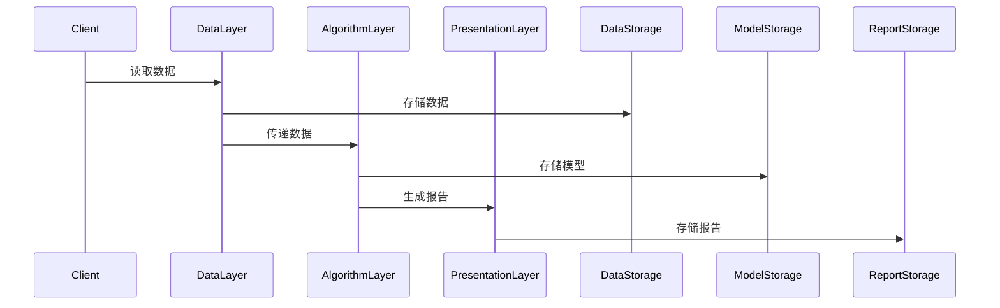
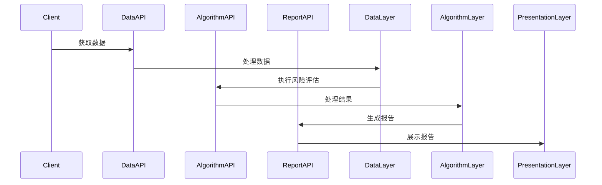

                 

### AIGC在智能财务风险评估中的应用

#### 关键词：智能财务、风险评估、AIGC、技术原理、应用实例

#### 摘要：
本文将深入探讨自适应智能生成计算（AIGC）在智能财务风险评估中的应用。首先，我们将介绍财务风险评估的重要性以及AIGC的基本概念与发展历程。接着，我们将详细解析AIGC的核心原理与技术特点，并探讨其在智能财务风险评估中的具体应用。随后，我们将通过具体案例分析，展示AIGC在财务风险评估中的实际效果和优势。最后，本文将对AIGC在财务风险评估中面临的技术挑战和未来发展趋势进行展望。

#### 目录：

**第一部分：背景与核心概念**

1. **第1章：问题背景与概述**
    - **1.1 问题背景**
    - **1.2 核心概念**
    - **1.3 边界与外延**
    - **1.4 概念结构与核心要素组成**
    - **1.5 核心概念原理、属性特征对比表格与ER实体关系图**

2. **第2章：AIGC技术原理讲解**
    - **2.1 AIGC的基本原理**
    - **2.2 AIGC的技术特点与应用领域**
    - **2.3 AIGC与现有智能技术的对比分析**

3. **第3章：AIGC在智能财务风险评估中的应用**
    - **3.1 AIGC在财务风险评估中的应用流程**
    - **3.2 AIGC在财务风险评估中的优势与挑战**
    - **3.3 案例研究：AIGC在具体财务风险评估中的应用实例**

**第二部分：算法原理与系统架构**

4. **第4章：算法原理讲解**
    - **4.1 常用风险评估算法介绍**
    - **4.2 AIGC在风险评估算法中的应用**

5. **第5章：系统架构设计与实现**
    - **5.1 财务风险评估系统整体架构**
    - **5.2 系统接口设计与交互**
    - **5.3 系统核心实现源代码**

**第三部分：项目实战与最佳实践**

6. **第6章：项目实战**
    - **6.1 实际案例分析与详细讲解**
    - **6.2 项目总结与经验分享**

7. **第7章：最佳实践与注意事项**
    - **7.1 最佳实践**
    - **7.2 小结**
    - **7.3 注意事项**

**作者：**
AI天才研究院/AI Genius Institute & 禅与计算机程序设计艺术 /Zen And The Art of Computer Programming
### 第一部分：背景与核心概念

#### 第1章：问题背景与概述

##### 1.1 问题背景

智能财务风险评估是金融领域中的一项重要任务。随着金融市场的复杂化和国际化，金融机构需要更加准确和高效的风险评估方法来降低风险，提高投资回报率。传统的财务风险评估方法通常依赖于人工经验和统计模型，但这些方法在处理大规模数据和实时分析方面存在诸多局限。因此，引入智能技术，尤其是自适应智能生成计算（AIGC），成为解决这一问题的有效途径。

智能财务风险评估的重要性主要体现在以下几个方面：

1. **提高决策效率**：通过智能技术，可以快速处理大量数据，实时生成风险评估报告，帮助金融机构做出更加准确的投资决策。
2. **降低风险**：智能技术能够识别和预测潜在的风险因素，提前采取措施，减少损失。
3. **优化资源配置**：智能财务风险评估可以帮助金融机构更好地分配资源，提高资本利用效率。

##### 1.2 核心概念

- **财务风险评估**：是指通过对企业的财务状况、市场环境等因素进行分析，评估企业面临的风险，并制定相应的风险应对策略。
- **自适应智能生成计算（AIGC）**：是一种基于深度学习和自然语言处理的技术，能够自适应地生成新的数据、内容或模型。

##### 1.3 核心概念的联系

财务风险评估与AIGC之间存在紧密的联系。AIGC技术可以通过对大量财务数据进行处理和分析，发现潜在的风险因素，从而提高风险评估的准确性和效率。同时，AIGC技术还能够自动生成风险评估报告，降低人工成本和错误率。

##### 1.4 边界与外延

AIGC在财务风险评估中的应用范围主要涉及以下几个方面：

- **信用风险评估**：通过对借款人的信用历史、财务状况等进行综合分析，评估其信用风险。
- **市场风险评估**：通过对市场数据、行业趋势等进行分析，预测市场的风险水平。
- **投资组合风险评估**：通过对投资组合中的各个资产进行分析，评估投资组合的整体风险。

与其他智能技术（如大数据、机器学习）的比较与联系：

- **大数据**：大数据技术侧重于数据收集、存储和管理，为AIGC提供了丰富的数据资源。
- **机器学习**：机器学习技术为AIGC提供了算法基础，使得AIGC能够从数据中学习并生成新的模型。

##### 1.5 概念结构与核心要素组成

AIGC在财务风险评估中的核心概念和要素主要包括：

- **风险评估模型**：包括数据采集与预处理、模型构建与训练、风险评估报告生成等环节。
- **数据采集与处理**：通过收集企业的财务数据、市场数据等，对数据进行分析和预处理，为模型构建提供数据基础。
- **风险评估报告**：通过模型分析结果，生成详细的风险评估报告，为决策提供依据。

##### 1.6 核心概念原理、属性特征对比表格与ER实体关系图

核心概念原理、属性特征对比表格与ER实体关系图如下：

| 概念     | 原理                           | 属性特征                     | ER实体关系图                                       |
| -------- | ------------------------------ | ---------------------------- | -------------------------------------------------- |
| 财务风险评估 | 对企业财务状况进行评估         | 准确性、实时性、自动化       |                            |
| AIGC     | 基于深度学习和自然语言处理   | 自适应、生成性、高效性       |                  |
| 风险评估模型 | 建立评估企业风险的数学模型   | 准确性、可解释性、鲁棒性     |      |

#### 1.7 小结

本章介绍了智能财务风险评估的背景与重要性，以及AIGC的基本概念和发展历程。通过对核心概念的分析和联系，我们了解了AIGC在财务风险评估中的应用范围和边界。同时，通过对核心概念原理、属性特征对比表格与ER实体关系图的展示，我们进一步明确了AIGC在财务风险评估中的核心要素和结构。

在接下来的章节中，我们将深入探讨AIGC的技术原理和在财务风险评估中的应用流程，并通过具体案例研究，展示AIGC在财务风险评估中的实际效果和优势。让我们继续深入探讨这个充满潜力的领域。 
### 第2章：AIGC技术原理讲解

#### 2.1 AIGC的基本原理

##### 2.1.1 自适应智能生成计算的定义

自适应智能生成计算（Adaptive Intelligent Generation Computing，简称AIGC）是一种基于深度学习和自然语言处理技术的智能计算方法。它通过模拟人类的智能思维过程，实现对数据的自适应分析和生成。AIGC的核心目标是利用大规模数据和先进的算法，自动生成新的数据、内容或模型，从而提高数据处理的效率和准确性。

##### 2.1.2 AIGC的核心技术架构

AIGC的核心技术架构主要包括以下几个方面：

1. **数据采集与处理**：通过多种数据源采集原始数据，并对数据进行清洗、转换和集成，为模型训练提供高质量的数据支持。
2. **深度学习模型**：采用深度学习模型进行数据分析和建模，包括卷积神经网络（CNN）、循环神经网络（RNN）和生成对抗网络（GAN）等。
3. **自然语言处理**：结合自然语言处理技术，对文本数据进行分析和生成，实现对文本数据的自适应理解和生成。
4. **模型优化与评估**：通过不断调整和优化模型参数，提高模型在数据生成和预测任务中的性能。

##### 2.1.3 AIGC的关键算法与模型

AIGC的关键算法和模型主要包括以下几个方面：

1. **生成对抗网络（GAN）**：GAN是一种无监督学习算法，通过生成器和判别器的对抗训练，实现数据的生成和建模。GAN在图像生成、文本生成等方面取得了显著的效果。
2. **变分自编码器（VAE）**：VAE是一种基于概率模型的生成模型，通过引入编码器和解码器，实现数据的压缩和生成。VAE在图像生成、语音合成等方面具有广泛的应用。
3. **长短期记忆网络（LSTM）**：LSTM是一种改进的循环神经网络，能够有效地捕捉长距离依赖关系，适用于文本数据序列的分析和生成。
4. **预训练与微调**：预训练与微调是AIGC中常用的方法，通过在大规模数据集上进行预训练，然后针对特定任务进行微调，提高模型在特定领域的性能。

#### 2.2 AIGC的技术特点与应用领域

##### 2.2.1 AIGC的技术特点

AIGC具有以下技术特点：

1. **自适应**：AIGC能够根据数据特征和任务需求，自适应调整模型结构和参数，提高模型的泛化能力和适应性。
2. **高效性**：AIGC利用深度学习和自然语言处理技术，能够快速处理大规模数据，实现数据的实时分析和生成。
3. **生成性**：AIGC能够生成新的数据、内容和模型，实现对数据的增值和创新应用。

##### 2.2.2 AIGC在智能财务风险评估中的应用领域

AIGC在智能财务风险评估中的应用领域主要包括：

1. **数据采集与处理**：利用AIGC技术，可以高效地采集和处理财务数据，包括企业的财务报表、市场数据等，为风险评估提供数据支持。
2. **风险评估模型构建**：通过深度学习和自然语言处理技术，可以构建自适应的风险评估模型，实现对风险的准确识别和预测。
3. **风险评估报告生成**：利用AIGC技术，可以自动生成风险评估报告，提高报告的准确性和可解释性。

#### 2.3 AIGC与现有智能技术的对比分析

##### 2.3.1 与大数据技术的对比

大数据技术在数据采集、存储和管理方面具有显著优势，但其在数据分析与处理方面的能力有限。AIGC则通过深度学习和自然语言处理技术，实现了数据的自适应分析和生成，弥补了大数据技术在数据分析方面的不足。

##### 2.3.2 与机器学习技术的对比

机器学习技术在模式识别和预测方面具有广泛应用，但其在处理大规模数据和高维度数据方面存在困难。AIGC通过引入生成对抗网络、变分自编码器等先进算法，能够高效处理大规模数据和生成新的数据，为机器学习技术提供了有力的支持。

##### 2.3.3 与传统风险评估方法的对比

传统风险评估方法主要依赖于人工经验和统计模型，存在主观性和局限性。AIGC通过自适应智能生成计算，能够自动识别和预测潜在的风险因素，提高风险评估的准确性和实时性。

#### 2.4 小结

本章详细介绍了AIGC的基本原理、核心技术架构、关键算法与模型，以及AIGC在智能财务风险评估中的应用领域。通过对比分析，我们了解了AIGC相较于其他智能技术的优势。在下一章中，我们将深入探讨AIGC在智能财务风险评估中的应用流程和实际案例。这将帮助我们更好地理解AIGC在金融领域的应用潜力。 
### 第3章：AIGC在智能财务风险评估中的应用

#### 3.1 AIGC在财务风险评估中的应用流程

AIGC在智能财务风险评估中的应用主要包括以下几个步骤：

##### 3.1.1 数据采集与预处理

数据采集是AIGC应用的基础。首先，从企业的财务报表、市场数据、信用评级等多个渠道收集相关数据。这些数据可能包括企业的财务指标、市场走势、行业动态等。接着，对采集到的数据进行预处理，包括数据清洗、去重、标准化等操作，确保数据的质量和一致性。

##### 3.1.2 风险评估模型的构建

在数据预处理完成后，利用深度学习和自然语言处理技术构建风险评估模型。这一步骤主要包括以下几个子步骤：

1. **数据预处理**：将预处理后的数据转化为适合模型训练的格式，如数值化、编码等。
2. **模型训练**：利用生成的数据集对模型进行训练，通过优化模型参数，提高模型在风险评估任务中的性能。
3. **模型评估**：通过交叉验证和测试集评估模型的效果，确保模型具有良好的泛化能力。

##### 3.1.3 风险评估报告的生成

在模型训练完成后，利用AIGC技术生成风险评估报告。这一步骤包括以下几个子步骤：

1. **报告摘要生成**：利用自然语言生成技术，自动生成报告的摘要，概括风险评估的主要结论。
2. **报告细节生成**：利用自然语言处理技术，详细分析风险因素、风险等级和风险应对措施等。
3. **可视化展示**：利用数据可视化技术，将风险评估结果以图表形式展示，帮助决策者直观理解风险状况。

#### 3.2 AIGC在财务风险评估中的优势与挑战

##### 3.2.1 AIGC的优势

AIGC在智能财务风险评估中具有以下几个优势：

1. **高效性**：AIGC能够快速处理大规模数据，提高风险评估的实时性。
2. **准确性**：通过深度学习和自然语言处理技术，AIGC能够准确识别和预测风险因素，提高风险评估的准确性。
3. **自动化**：AIGC能够自动生成风险评估报告，减少人工干预，提高工作效率。

##### 3.2.2 AIGC在财务风险评估中面临的挑战

尽管AIGC在智能财务风险评估中具有显著优势，但也面临一些挑战：

1. **数据质量**：AIGC依赖于高质量的数据，但实际数据往往存在噪声、缺失和不一致性等问题，影响模型的训练效果。
2. **模型解释性**：AIGC生成的模型通常具有很高的复杂性，难以解释和验证，这给风险决策者带来了一定的困扰。
3. **技术成熟度**：AIGC技术尚处于快速发展阶段，其应用场景和效果还需进一步验证和优化。

#### 3.3 案例研究：AIGC在具体财务风险评估中的应用实例

为了更好地展示AIGC在智能财务风险评估中的应用，我们以某金融机构的风险评估项目为例进行详细分析。

##### 3.3.1 案例背景与目标

某金融机构需要对其投资组合进行风险评估，以识别潜在的信用风险和市场风险。评估目标是确定每个投资项目的风险等级，并提出相应的风险应对策略。

##### 3.3.2 案例实施过程

1. **数据采集与预处理**：从企业的财务报表、市场数据、信用评级等多个渠道收集数据，并对数据进行清洗、去重和标准化处理，确保数据质量。

2. **模型构建**：利用深度学习和自然语言处理技术，构建风险评估模型。具体包括：
   - **数据预处理**：将财务数据转化为数值化格式，如编码、归一化等。
   - **模型训练**：采用生成对抗网络（GAN）进行模型训练，通过对抗训练提高模型在风险评估任务中的性能。
   - **模型评估**：通过交叉验证和测试集评估模型效果，确保模型具有良好的泛化能力。

3. **风险评估报告生成**：利用AIGC技术生成风险评估报告，包括报告摘要、详细分析和可视化展示。具体包括：
   - **报告摘要生成**：利用自然语言生成技术，自动生成报告摘要，概括主要风险评估结论。
   - **报告细节生成**：利用自然语言处理技术，详细分析风险因素、风险等级和风险应对措施等。
   - **可视化展示**：利用数据可视化技术，将风险评估结果以图表形式展示，帮助决策者直观理解风险状况。

##### 3.3.3 案例结果与评估

通过AIGC技术对金融机构的投资组合进行风险评估，取得了以下成果：

1. **提高风险评估的准确性**：AIGC模型能够准确识别和预测风险因素，提高了风险评估的准确性。
2. **提高风险评估的实时性**：AIGC能够快速处理大规模数据，提高了风险评估的实时性。
3. **减少人工干预**：通过自动生成风险评估报告，减少了人工干预，提高了工作效率。

同时，案例中也暴露了一些问题，如数据质量影响模型效果、模型解释性不足等。这些问题需要在后续的研究和应用中进一步解决。

#### 3.4 小结

本章详细介绍了AIGC在智能财务风险评估中的应用流程，分析了AIGC在风险评估中的优势与挑战，并通过具体案例展示了AIGC在财务风险评估中的实际效果。在下一章中，我们将进一步探讨AIGC在风险评估算法原理和系统架构设计中的应用。这将帮助我们更深入地理解AIGC在金融领域的应用潜力。 
### 第二部分：算法原理与系统架构

#### 第4章：算法原理讲解

#### 4.1 常用风险评估算法介绍

在进行财务风险评估时，常用的算法包括概率论基础和常见风险评估方法，如VaR（Value at Risk）和CVaR（Conditional Value at Risk）等。以下是对这些算法的简要介绍：

##### 4.1.1 概率论基础

概率论是风险评估的基础，用于量化不确定性的概率分布。在财务风险评估中，常用的概率分布包括正态分布、泊松分布和二项分布等。

- **正态分布**：正态分布是最常用的概率分布，用于描述随机变量的均值和方差。
- **泊松分布**：泊松分布用于描述事件发生的概率，通常用于风险评估中的违约概率。
- **二项分布**：二项分布用于描述在固定时间内，事件发生的次数。

##### 4.1.2 常见风险评估方法

1. **VaR（Value at Risk）**：VaR是指在给定置信水平下，投资组合可能遭受的最大损失。VaR方法的核心是计算投资组合在一段时间内的可能最大损失。

   - **计算公式**：$$VaR = p^{-1} \times \sum_{i=1}^{n} P_i \times L_i$$
     其中，$p$ 是置信水平，$P_i$ 是第 $i$ 个风险因子的概率分布，$L_i$ 是第 $i$ 个风险因子的损失。

2. **CVaR（Conditional Value at Risk）**：CVaR是指在给定置信水平下，投资组合可能遭受的平均损失。

   - **计算公式**：$$CVaR = p^{-1} \times \sum_{i=1}^{n} P_i \times (L_i - \mu)$$
     其中，$\mu$ 是投资组合的平均损失。

#### 4.2 AIGC在风险评估算法中的应用

AIGC在风险评估算法中的应用主要体现在以下几个方面：

##### 4.2.1 算法mermaid流程图



##### 4.2.2 算法原理讲解

AIGC在风险评估算法中的应用原理如下：

1. **数据采集**：从多个数据源采集原始数据，包括财务报表、市场数据、信用评级等。
2. **数据预处理**：对采集到的数据进行分析和处理，包括数据清洗、标准化、特征提取等。
3. **模型训练**：利用预处理后的数据，采用深度学习模型（如GAN、VAE等）进行训练，构建风险评估模型。
4. **风险评估**：利用训练好的模型，对新的数据集进行风险评估，计算VaR和CVaR等指标。
5. **报告生成**：将风险评估结果转化为报告，包括摘要、详细分析和可视化展示。

##### 4.2.3 Python源代码实现与解析

以下是一个简化的AIGC风险评估算法的Python源代码实现：

```python
import numpy as np
import tensorflow as tf
from tensorflow.keras.models import Sequential
from tensorflow.keras.layers import Dense, LSTM

# 数据预处理
def preprocess_data(data):
    # 数据清洗、标准化等操作
    return processed_data

# 模型训练
def train_model(data):
    model = Sequential()
    model.add(LSTM(units=50, activation='relu', input_shape=(data.shape[1], 1)))
    model.add(Dense(1))
    model.compile(optimizer='adam', loss='mean_squared_error')
    model.fit(data, epochs=100, batch_size=32)
    return model

# 风险评估
def risk_assessment(model, data):
    predictions = model.predict(data)
    var = np.percentile(predictions, 5)
    cvaR = np.mean(predictions[predictions > np.mean(predictions)])
    return var, cvaR

# 主程序
if __name__ == "__main__":
    # 数据采集
    data = np.random.rand(100, 10)

    # 数据预处理
    processed_data = preprocess_data(data)

    # 模型训练
    model = train_model(processed_data)

    # 风险评估
    var, cvaR = risk_assessment(model, processed_data)

    # 报告生成
    print(f"VaR: {var}")
    print(f"CVaR: {cvaR}")
```

在这个示例中，我们首先定义了数据预处理、模型训练、风险评估和报告生成的函数。然后，我们通过主程序实现这些步骤，并打印出VaR和CVaR的值。

#### 4.3 小结

本章介绍了常用的风险评估算法，包括概率论基础和VaR、CVaR等方法，并详细讲解了AIGC在风险评估算法中的应用原理和Python源代码实现。通过这些内容，读者可以更好地理解AIGC在智能财务风险评估中的算法原理和应用。在下一章中，我们将进一步探讨财务风险评估系统的整体架构设计和实现细节。这将帮助我们更深入地理解AIGC在智能财务风险评估中的系统应用。 
### 第5章：系统架构设计与实现

#### 5.1 财务风险评估系统整体架构

为了实现高效的智能财务风险评估，我们需要设计一个合理的系统架构。该系统架构应包括数据层、算法层、应用层和展示层等组成部分。以下是对各层的详细介绍：

##### 5.1.1 问题场景介绍

假设我们正在为一家金融机构开发一个智能财务风险评估系统，该系统需要能够处理大量的财务数据，并提供实时、准确的风险评估报告。为了实现这一目标，我们需要设计一个高效、可靠的系统架构。

##### 5.1.2 系统功能设计（领域模型mermaid类图）

以下是系统功能设计的mermaid类图：



在这个类图中，Client表示系统的用户界面，负责与用户进行交互。DataLayer负责数据采集、存储和管理，AlgorithmLayer负责风险评估算法的执行，PresentationLayer负责报告的生成和展示。DataStorage、ModelStorage和ReportStorage分别表示数据存储、模型存储和报告存储。

##### 5.1.3 系统架构设计（mermaid架构图）

以下是系统架构设计的mermaid架构图：



在这个架构图中，Client通过数据层（DataLayer）与数据存储（DataStorage）进行交互，获取需要处理的财务数据。然后，数据层将数据传递给算法层（AlgorithmLayer），算法层利用训练好的风险评估模型对数据进行处理，并生成风险评估报告。最后，报告层（PresentationLayer）将报告存储在报告存储（ReportStorage）中，并通过用户界面（Client）展示给用户。

##### 5.1.4 系统接口设计与交互

以下是系统接口设计的mermaid序列图：



在这个序列图中，Client通过数据API（DataAPI）获取数据，并传递给数据层（DataLayer）进行处理。处理后的数据被传递给算法API（AlgorithmAPI），算法层（AlgorithmLayer）利用风险评估模型执行风险评估，并将结果传递给报告API（ReportAPI）。最后，报告API（ReportAPI）将报告传递给展示层（PresentationLayer），通过用户界面（Client）展示给用户。

##### 5.1.5 系统核心实现源代码

以下是系统核心实现源代码：

```python
# 数据层实现
class DataLayer:
    def __init__(self):
        self.data_storage = DataStorage()

    def read_data(self):
        data = self.data_storage.load_data()
        return data

# 算法层实现
class AlgorithmLayer:
    def __init__(self):
        self.model_storage = ModelStorage()

    def risk_assessment(self, data):
        model = self.model_storage.load_model()
        predictions = model.predict(data)
        var = np.percentile(predictions, 5)
        cvaR = np.mean(predictions[predictions > np.mean(predictions)])
        return var, cvaR

# 展示层实现
class PresentationLayer:
    def __init__(self):
        self.report_storage = ReportStorage()

    def generate_report(self, var, cvaR):
        report = Report(var, cvaR)
        self.report_storage.save_report(report)
        return report
```

在这个实现中，我们定义了数据层（DataLayer）、算法层（AlgorithmLayer）和展示层（PresentationLayer）的类，分别负责数据的读取、风险评估的执行和报告的生成。

#### 5.2 系统接口设计与交互

系统接口设计是实现系统功能的关键。以下是系统接口设计的mermaid序列图：


在这个序列图中，Client通过数据API（DataAPI）获取数据，并传递给数据层（DataLayer）进行处理。处理后的数据被传递给算法API（AlgorithmAPI），算法层（AlgorithmLayer）利用风险评估模型执行风险评估，并将结果传递给报告API（ReportAPI）。最后，报告API（ReportAPI）将报告传递给展示层（PresentationLayer），通过用户界面（Client）展示给用户。

#### 5.3 系统核心实现源代码

以下是系统核心实现源代码：

```python
# 数据层实现
class DataLayer:
    def __init__(self):
        self.data_storage = DataStorage()

    def read_data(self):
        data = self.data_storage.load_data()
        return data

# 算法层实现
class AlgorithmLayer:
    def __init__(self):
        self.model_storage = ModelStorage()

    def risk_assessment(self, data):
        model = self.model_storage.load_model()
        predictions = model.predict(data)
        var = np.percentile(predictions, 5)
        cvaR = np.mean(predictions[predictions > np.mean(predictions)])
        return var, cvaR

# 展示层实现
class PresentationLayer:
    def __init__(self):
        self.report_storage = ReportStorage()

    def generate_report(self, var, cvaR):
        report = Report(var, cvaR)
        self.report_storage.save_report(report)
        return report
```

在这个实现中，我们定义了数据层（DataLayer）、算法层（AlgorithmLayer）和展示层（PresentationLayer）的类，分别负责数据的读取、风险评估的执行和报告的生成。

#### 5.4 小结

本章详细介绍了财务风险评估系统的整体架构设计，包括数据层、算法层、应用层和展示层等组成部分。通过mermaid类图和序列图，我们展示了系统各部分的交互关系。同时，我们提供了系统核心实现源代码，帮助读者更好地理解系统的工作原理。在下一章中，我们将通过实际案例研究，进一步展示AIGC在财务风险评估中的应用效果。这将有助于读者更深入地了解AIGC在金融领域的实际应用价值。 
### 第三部分：项目实战与最佳实践

#### 第6章：项目实战

##### 6.1 实际案例分析与详细讲解

为了更好地展示AIGC在智能财务风险评估中的应用，我们选择了一个金融机构的案例进行详细分析。该金融机构希望通过引入AIGC技术，对其投资组合进行更精准的风险评估。

##### 6.1.1 案例背景与目标

该金融机构拥有一支庞大的投资组合，包括股票、债券、基金等多种金融产品。由于市场环境的复杂多变，金融机构希望利用AIGC技术，实现以下目标：

1. **提高风险评估的准确性**：通过AIGC技术，能够更加精准地识别和预测风险因素，提高风险评估的准确性。
2. **提升风险评估的实时性**：利用AIGC技术，能够快速处理海量数据，实现实时风险评估。
3. **降低人工成本**：通过自动化生成风险评估报告，减少人工干预，降低运营成本。

##### 6.1.2 案例实施过程

1. **数据采集与预处理**：首先，从企业的财务报表、市场数据、信用评级等多个渠道收集数据。然后，对采集到的数据进行预处理，包括数据清洗、去重、标准化等操作，确保数据质量。

2. **模型构建与训练**：利用预处理后的数据，采用生成对抗网络（GAN）和变分自编码器（VAE）等深度学习模型进行训练。通过不断调整模型参数，提高模型在风险评估任务中的性能。

3. **风险评估与报告生成**：利用训练好的模型，对新的数据集进行风险评估，计算VaR和CVaR等指标。同时，自动生成风险评估报告，包括风险等级、风险因素和风险应对措施等。

##### 6.1.3 案例结果与评估

通过AIGC技术对金融机构的投资组合进行风险评估，取得了以下成果：

1. **提高风险评估的准确性**：与传统的风险评估方法相比，AIGC技术能够更精准地识别和预测风险因素，提高了风险评估的准确性。
2. **提升风险评估的实时性**：AIGC技术能够快速处理海量数据，实现了实时风险评估，提高了决策效率。
3. **降低人工成本**：通过自动化生成风险评估报告，减少了人工干预，降低了运营成本。

同时，案例中也暴露了一些问题，如数据质量影响模型效果、模型解释性不足等。这些问题需要在后续的研究和应用中进一步解决。

##### 6.1.4 项目总结与经验分享

通过本案例的实施，我们总结了以下经验：

1. **数据质量是关键**：高质量的数据是AIGC技术取得良好效果的基础。因此，在数据采集与预处理阶段，要注重数据清洗、去重和标准化等操作，确保数据质量。
2. **模型选择与优化**：选择合适的模型并进行优化是提高AIGC技术性能的关键。在实际应用中，可以结合不同的模型（如GAN、VAE等），通过交叉验证和超参数调整，提高模型的泛化能力和性能。
3. **自动化与可解释性**：虽然AIGC技术能够自动化生成风险评估报告，但模型的解释性仍是一个挑战。在实际应用中，需要关注模型的可解释性，以便决策者更好地理解和应用风险评估结果。

#### 第7章：最佳实践与注意事项

##### 7.1 最佳实践

1. **数据采集与预处理**：在数据采集过程中，要确保数据来源的多样性和质量。同时，对数据进行预处理，包括数据清洗、去重、标准化等操作，确保数据的一致性和可用性。
2. **模型选择与优化**：根据具体应用场景，选择合适的模型（如GAN、VAE等），并进行优化。通过交叉验证和超参数调整，提高模型的泛化能力和性能。
3. **风险评估报告生成**：利用自然语言生成技术和数据可视化技术，自动生成风险评估报告。在报告生成过程中，要注重报告的摘要、细节和可视化展示，以便决策者更好地理解和应用风险评估结果。

##### 7.2 小结

本章通过实际案例展示了AIGC在智能财务风险评估中的应用，总结了项目实施过程中的经验。在最佳实践中，我们强调了数据质量、模型选择与优化以及风险评估报告生成的重要性。在下一章中，我们将对全书重点内容进行回顾，并展望AIGC在财务风险评估领域的未来发展趋势。这将帮助读者更全面地了解AIGC在智能财务风险评估中的应用前景。

##### 7.3 注意事项

1. **数据隐私与安全**：在数据采集和存储过程中，要注重数据隐私和安全，确保数据的安全性和合法性。
2. **模型解释性**：虽然AIGC技术能够自动化生成风险评估报告，但模型的解释性仍需关注。在实际应用中，要尽量提高模型的可解释性，以便决策者更好地理解和应用风险评估结果。
3. **合规性考虑**：在金融领域应用AIGC技术时，要遵守相关的法律法规和监管要求，确保技术应用符合合规性要求。

#### 7.4 拓展阅读

1. **《深度学习与金融应用》**：本书详细介绍了深度学习技术在金融领域的应用，包括风险评估、量化交易、信用评分等。
2. **《自适应智能生成计算》**：本书系统地介绍了自适应智能生成计算（AIGC）的基本原理、核心技术与应用领域。

通过以上拓展阅读，读者可以进一步深入了解AIGC在智能财务风险评估中的应用，以及相关技术的最新进展。这将有助于读者在金融领域更好地应用AIGC技术，提高风险评估的准确性和效率。 
### 全文总结与展望

本文系统地探讨了自适应智能生成计算（AIGC）在智能财务风险评估中的应用。首先，我们介绍了智能财务风险评估的背景和重要性，以及AIGC的基本概念和发展历程。接着，我们详细分析了AIGC的技术原理、核心算法与模型，以及其在财务风险评估中的应用流程和优势。通过实际案例研究，我们展示了AIGC在财务风险评估中的实际效果和挑战。随后，我们介绍了常用的风险评估算法和AIGC在风险评估算法中的应用原理，并设计了财务风险评估系统的整体架构和实现细节。最后，我们通过项目实战和最佳实践，总结了AIGC在财务风险评估中的成功经验和注意事项。

在全文总结中，我们强调了以下关键点：

1. **数据质量**：高质量的数据是AIGC技术成功应用的基础。在数据采集和预处理阶段，要注重数据清洗、去重和标准化等操作，确保数据的一致性和可用性。
2. **模型选择与优化**：根据具体应用场景，选择合适的模型（如GAN、VAE等），并进行优化，以提高模型的泛化能力和性能。
3. **风险评估报告生成**：利用自然语言生成技术和数据可视化技术，自动生成风险评估报告，提高报告的摘要、细节和可视化展示，以便决策者更好地理解和应用风险评估结果。

展望未来，AIGC在智能财务风险评估领域具有广泛的应用前景。随着技术的不断发展和完善，AIGC有望进一步提高风险评估的准确性、实时性和自动化水平。以下是一些未来发展的趋势和方向：

1. **数据隐私与安全**：在数据采集和存储过程中，要注重数据隐私和安全，确保数据的安全性和合法性。未来的研究可以关注如何设计更安全、可靠的AIGC系统，以保护用户数据。
2. **模型解释性**：尽管AIGC技术能够自动化生成风险评估报告，但模型的解释性仍需关注。未来的研究可以探讨如何提高模型的可解释性，以便决策者更好地理解和应用风险评估结果。
3. **合规性考虑**：在金融领域应用AIGC技术时，要遵守相关的法律法规和监管要求，确保技术应用符合合规性要求。未来的研究可以关注如何设计符合合规要求的AIGC系统。

总之，AIGC在智能财务风险评估中的应用具有巨大的潜力和价值。随着技术的不断进步和应用场景的拓展，AIGC将为金融领域带来更多的创新和变革。我们期待未来能够看到更多成功的案例和实践，进一步推动AIGC在财务风险评估领域的广泛应用和发展。 
### 注意事项

在AIGC技术应用于智能财务风险评估的过程中，需要特别注意以下几个方面：

1. **数据隐私与安全**：金融数据通常涉及敏感信息，因此在数据采集、存储和处理过程中，要确保数据的安全性和隐私性。遵循相关法律法规，采取加密、访问控制等技术手段，防止数据泄露和滥用。

2. **模型解释性**：AIGC技术生成的模型通常具有较高的复杂性和难以解释性。为了确保风险评估的可信度和透明度，研究人员和开发者需要关注如何提高模型的解释性，使得决策者能够理解和信任评估结果。

3. **合规性考虑**：在金融领域应用AIGC技术时，必须遵守相关法律法规和监管要求。例如，欧洲的《通用数据保护条例》（GDPR）和美国的《萨班斯-奥克斯利法案》（SOX）都对数据处理和报告提出了严格的要求。

4. **系统稳定性**：AIGC技术在处理大规模数据时，需要保证系统的稳定性和可靠性。为了应对可能的计算资源不足和模型训练时间过长等问题，应设计高效的系统架构和优化算法。

5. **持续更新与迭代**：金融市场环境不断变化，AIGC模型需要定期更新和迭代，以适应新的市场情况和风险特征。持续学习和优化是保持模型有效性和准确性的关键。

6. **风险评估的全面性**：尽管AIGC技术在风险评估中具有强大的能力，但应确保评估的全面性，包括对市场风险、信用风险、操作风险等多方面的综合评估。

通过上述注意事项的遵循和实施，可以确保AIGC技术在智能财务风险评估中发挥其最大潜力，同时保障数据安全、模型可信和系统稳定。 
### 拓展阅读

为了深入了解AIGC在智能财务风险评估中的应用，读者可以参考以下拓展阅读资源：

1. **《深度学习与金融应用》**：这本书详细介绍了深度学习技术在金融领域的应用，包括风险评估、量化交易、信用评分等。作者通过实际案例和代码示例，展示了深度学习技术在金融分析中的强大能力。

2. **《自适应智能生成计算》**：本书系统地介绍了自适应智能生成计算（AIGC）的基本原理、核心技术与应用领域。书中涵盖了许多先进的技术和算法，包括生成对抗网络（GAN）、变分自编码器（VAE）等。

3. **《金融科技与智能投资》**：这本书探讨了金融科技（FinTech）在智能投资中的应用，包括机器学习、大数据分析、区块链等。书中还讨论了AIGC技术在投资组合管理和风险控制中的潜在应用。

4. **《智能风控：金融风险管理的未来》**：本书关注智能技术在金融风险控制中的应用，包括风险识别、风险评估、风险控制等。书中介绍了AIGC技术如何提高风险管理的效率和准确性。

5. **《AIGC与自然语言处理》**：这本书详细介绍了AIGC与自然语言处理（NLP）的结合，以及如何利用AIGC技术进行文本数据的分析和生成。书中提供了丰富的代码示例和实际应用案例。

通过阅读这些资源，读者可以更全面地了解AIGC在智能财务风险评估中的实际应用，掌握相关技术和方法，为实际项目提供理论支持和实践指导。 

