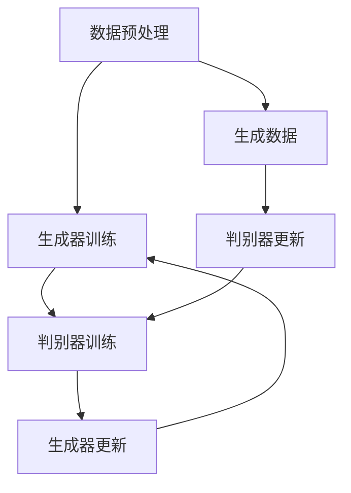

                 

## 第一部分：背景与概念

### 1.1 问题背景与核心概念

#### 1.1.1 问题背景

医疗诊断是医疗领域中的一个关键环节，它直接影响着患者的治疗和康复。然而，传统的医疗诊断方法存在一些明显的局限性。首先，医生依赖经验和专业知识进行诊断，这种方法虽然具有一定的准确性，但往往受限于医生的水平和经验，无法保证诊断的全面性和精确性。其次，医疗诊断往往依赖于实验室检测和影像学检查，这些方法虽然可以提供一定的诊断信息，但存在检测时间长、成本高、操作复杂等问题。

此外，随着医疗数据的爆炸性增长，如何有效地处理和分析这些数据也成为了医疗诊断中的一个重大挑战。传统的数据处理方法往往需要大量的人力和时间，而且难以应对复杂的数据结构和大量的数据量。

AIGC（AI-Generated Content）是人工智能领域的一个新兴概念，它指的是通过人工智能技术生成内容，包括文本、图像、音频等多种形式。AIGC具有自适应学习、大规模数据处理、高度自动化等特点，这些特点使得AIGC在医疗诊断中具有巨大的应用潜力。

#### 1.1.2 AIGC的定义与特点

AIGC的定义可以概括为：利用人工智能技术，特别是生成对抗网络（GAN）和自然语言处理（NLP）等技术，生成高质量、有价值的文本、图像、音频等内容。

AIGC的特点主要包括：

1. **自适应学习**：AIGC能够通过不断的学习和调整，提高生成内容的准确性和适应性。这意味着AIGC可以随着医疗诊断数据的不断更新，自动调整和优化诊断模型，从而提高诊断的准确性。
   
2. **大规模数据处理**：AIGC能够处理和分析大量医疗数据，包括电子病历、影像学数据、实验室检测数据等。这种大规模数据处理能力可以大大提高医疗诊断的效率，减少诊断时间。

3. **高度自动化**：AIGC可以自动生成诊断报告、推荐治疗方案等，减少了人工干预的必要性，从而降低了医疗诊断的成本。

4. **跨领域应用**：AIGC不仅可以在医疗诊断中发挥作用，还可以应用于医疗咨询、医学教育、医疗管理等各个领域。

#### 1.1.3 未来医疗诊断的现状与挑战

当前，医疗诊断正在向智能化、自动化方向发展。然而，尽管人工智能技术在医疗诊断中的应用已经取得了一些进展，但仍然面临以下挑战：

1. **数据隐私与安全**：医疗数据具有高度敏感性，如何保护患者隐私和数据安全是AIGC在医疗诊断中需要解决的一个重要问题。

2. **算法透明性**：AIGC算法的复杂性和非透明性使得诊断结果难以解释，这对医生的决策和患者的信任提出了挑战。

3. **数据质量和标注**：高质量的医疗数据是AIGC模型训练的基础，但当前医疗数据的质量和标注存在一定的问题，这会影响AIGC模型的性能。

4. **法律和伦理问题**：随着AIGC在医疗诊断中的应用，如何界定人工智能和医生的职责，以及如何处理医疗纠纷等问题，都需要进行深入的研究和探讨。

#### 1.2 核心概念与联系

在了解了AIGC的定义与特点以及未来医疗诊断的现状与挑战之后，我们可以进一步探讨AIGC与未来医疗诊断之间的联系。

首先，AIGC可以通过生成对抗网络（GAN）等技术，自动生成高质量的医学图像，这些图像可以作为医生的诊断参考，提高诊断的准确性和效率。

其次，AIGC可以通过自然语言处理（NLP）技术，自动生成诊断报告、推荐治疗方案等，减轻医生的工作负担，提高医疗诊断的效率。

此外，AIGC还可以通过深度学习技术，对大量的医疗数据进行分析和挖掘，发现潜在的疾病关系和预测趋势，为医生提供更为精准的诊断和治疗方案。

#### 1.2.1 AIGC核心要素

AIGC的核心要素主要包括生成模型、对抗模型和自适应学习。

1. **生成模型**：生成模型是AIGC的核心，它负责生成高质量的内容。常见的生成模型包括生成对抗网络（GAN）、变分自编码器（VAE）等。

2. **对抗模型**：对抗模型与生成模型相互对抗，通过不断优化生成模型，提高生成内容的准确性和真实性。常见的对抗模型包括判别器、生成器等。

3. **自适应学习**：自适应学习是AIGC的重要特点，它使得AIGC可以随着数据和环境的变化，自动调整和优化模型，提高模型的性能。

#### 1.2.2 未来医疗诊断与AIGC的关联

未来医疗诊断与AIGC的关联主要体现在以下几个方面：

1. **图像生成与诊断**：通过生成对抗网络（GAN）等技术，AIGC可以自动生成高质量的医学图像，这些图像可以作为医生的诊断参考，提高诊断的准确性和效率。

2. **文本生成与报告**：通过自然语言处理（NLP）技术，AIGC可以自动生成诊断报告、推荐治疗方案等，减轻医生的工作负担，提高医疗诊断的效率。

3. **数据分析与预测**：通过深度学习技术，AIGC可以分析大量的医疗数据，发现潜在的疾病关系和预测趋势，为医生提供更为精准的诊断和治疗方案。

#### 1.2.3 概念属性特征对比表格

为了更清晰地展示AIGC与未来医疗诊断之间的关联，我们可以使用概念属性特征对比表格。

| 概念       | 属性特征                       |
|------------|--------------------------------|
| AIGC       | 生成模型、对抗模型、自适应学习   |
| 医疗诊断   | 医学图像、诊断报告、数据分析     |
| 关联       | 自动生成医学图像、自动生成诊断报告、数据分析与预测 |

#### 1.2.4 ER实体关系图

ER实体关系图可以更直观地展示AIGC与未来医疗诊断之间的关联。

```mermaid
erDiagram
  AIGC ||--|{ 医学图像 }
  AIGC ||--|{ 诊断报告 }
  AIGC ||--|{ 数据分析 }
  医学图像 ||--|{ 医疗诊断 }
  诊断报告 ||--|{ 医疗诊断 }
  数据分析 ||--|{ 医疗诊断 }
```

### 1.3 本章小结

本章介绍了AIGC在未来医疗诊断中的革命性应用。首先，我们探讨了医疗诊断的现状和挑战，以及AIGC的定义与特点。然后，我们分析了AIGC与未来医疗诊断之间的关联，并使用概念属性特征对比表格和ER实体关系图进行了可视化展示。通过本章的内容，我们可以看到AIGC在医疗诊断中具有巨大的潜力，有望解决当前医疗诊断中存在的诸多问题。接下来，我们将进一步探讨AIGC的算法原理及其在医疗诊断中的应用。## 第二部分：AIGC算法原理与实现

### 2.1 AIGC算法概述

#### 2.1.1 AIGC算法分类

AIGC算法可以分为两大类：生成模型和对抗模型。

1. **生成模型**：生成模型主要负责生成新的数据，常见的生成模型有生成对抗网络（GAN）和变分自编码器（VAE）。GAN通过生成器和判别器的对抗训练，生成高质量的数据；VAE则通过编码器和解码器的联合训练，实现数据的生成。

2. **对抗模型**：对抗模型主要用于鉴别真实数据和生成数据，常见的对抗模型有判别器（Discriminator）和生成器（Generator）。判别器负责判断输入数据是真实数据还是生成数据；生成器则负责生成尽可能真实的数据以欺骗判别器。

#### 2.1.2 AIGC算法的主要组成部分

AIGC算法的主要组成部分包括：

1. **数据预处理**：包括数据清洗、数据归一化、数据增强等步骤，目的是提高数据质量，为模型训练提供良好的数据基础。

2. **生成器（Generator）**：生成器是AIGC算法的核心部分，负责生成新的数据。生成器通常由多个神经网络层组成，通过学习输入数据的分布，生成与输入数据相似的新数据。

3. **判别器（Discriminator）**：判别器是另一个关键部分，负责判断输入数据是真实数据还是生成数据。判别器也由多个神经网络层组成，通过对抗训练与生成器相互竞争，提高生成数据的真实性。

4. **损失函数**：损失函数是AIGC算法中的关键评价指标，用于衡量生成数据的真实性和判别器的鉴别能力。常见的损失函数有二元交叉熵损失、均方误差损失等。

5. **优化器**：优化器用于更新模型参数，以最小化损失函数。常见的优化器有梯度下降（Gradient Descent）、Adam优化器等。

### 2.2 算法原理讲解

#### 2.2.1 算法流程图

AIGC算法的流程图如下：



1. **数据预处理**：首先对输入数据进行预处理，包括数据清洗、归一化、增强等操作，确保数据质量。

2. **生成器训练**：生成器通过学习输入数据的分布，生成新的数据。生成器的训练过程包括两部分：生成数据的生成和生成数据的优化。

3. **判别器训练**：判别器通过对抗训练，提高鉴别真实数据和生成数据的能力。判别器的训练过程包括两部分：鉴别生成数据和鉴别真实数据。

4. **生成器更新**：通过生成器和判别器的对抗训练，生成器不断优化生成数据，提高生成数据的质量。

5. **判别器更新**：通过生成器和判别器的对抗训练，判别器不断优化鉴别能力，提高生成数据的真实性。

6. **生成数据**：生成器生成新的数据，用于后续的应用。

7. **判别器更新**：判别器通过鉴别生成数据和真实数据，不断优化自身，提高鉴别能力。

#### 2.2.2 Python源代码解释

以下是一个简单的AIGC算法的Python源代码示例：

```python
import tensorflow as tf
from tensorflow.keras.models import Model
from tensorflow.keras.layers import Input, Dense, Flatten

# 定义生成器和判别器
generator_input = Input(shape=(100,))
discriminator_input = Input(shape=(100,))
z = Dense(128, activation='relu')(generator_input)
x_g = Dense(100, activation='tanh')(z)
x_g = Model(generator_input, x_g).output

z_d = Dense(128, activation='relu')(discriminator_input)
x_d = Dense(100, activation='tanh')(z_d)
x_d = Model(discriminator_input, x_d).output

# 定义损失函数和优化器
loss_fn = tf.keras.losses.BinaryCrossentropy()
optimizer = tf.keras.optimizers.Adam()

# 定义生成器和判别器的模型
generator = Model(generator_input, x_g)
discriminator = Model(discriminator_input, x_d)

# 编写训练过程
for epoch in range(100):
    for _ in range(1000):
        z_noise = np.random.normal(size=(100, 100))
        with tf.GradientTape() as gen_tape, tf.GradientTape() as disc_tape:
            x_g_hat = generator(z_noise)
            x_d_real = discriminator(x_g_hat)
            x_d_fake = discriminator(z_noise)
            gen_loss = loss_fn(tf.ones_like(x_d_fake), x_d_fake)
            disc_loss = loss_fn(tf.ones_like(x_d_real), x_d_real) + loss_fn(tf.zeros_like(x_d_fake), x_d_fake)
        
        grads_gen = gen_tape.gradient(gen_loss, generator.trainable_variables)
        grads_disc = disc_tape.gradient(disc_loss, discriminator.trainable_variables)
        
        optimizer.apply_gradients(zip(grads_gen, generator.trainable_variables))
        optimizer.apply_gradients(zip(grads_disc, discriminator.trainable_variables))

# 生成数据
z_test = np.random.normal(size=(100, 100))
x_test = generator.predict(z_test)

# 可视化生成的数据
plt.scatter(x_test[:, 0], x_test[:, 1])
plt.show()
```

#### 2.2.3 数学模型与公式讲解

AIGC算法的核心在于生成器和判别器的对抗训练。以下是AIGC算法的数学模型与公式：

1. **生成器模型**：

   生成器模型的目标是生成与真实数据分布相似的伪数据。生成器的损失函数通常为：

   $$ L_G = -\mathbb{E}_{z \sim p_z(z)}[\log(D(G(z))] $$

   其中，$G(z)$是生成器生成的伪数据，$D(x)$是判别器的输出，$p_z(z)$是噪声分布。

2. **判别器模型**：

   判别器模型的目标是区分真实数据和生成数据。判别器的损失函数通常为：

   $$ L_D = -\mathbb{E}_{x \sim p_x(x)}[\log(D(x))] - \mathbb{E}_{z \sim p_z(z)}[\log(1 - D(G(z))] $$

   其中，$p_x(x)$是真实数据分布。

3. **整体损失函数**：

   整体损失函数是生成器和判别器损失函数的加权组合：

   $$ L = \lambda L_G + (1 - \lambda) L_D $$

   其中，$\lambda$是权重系数，用于平衡生成器和判别器的损失。

#### 2.2.4 举例说明

为了更好地理解AIGC算法，我们可以通过一个简单的例子来说明。

假设我们要生成一组数字，这些数字遵循正态分布。我们可以使用GAN来生成这样的数字。

1. **生成器**：

   生成器的目标是生成与正态分布相似的数字。我们可以使用一个简单的神经网络来模拟生成器：

   $$ G(x) = \mu + \sigma \cdot \text{tanh}(W_2 \cdot \text{tanh}(W_1 \cdot x)) $$

   其中，$x$是输入噪声，$\mu$和$\sigma$是生成器的参数，$W_1$和$W_2$是生成器的权重。

2. **判别器**：

   判别器的目标是区分真实数据和生成数据。我们可以使用另一个简单的神经网络来模拟判别器：

   $$ D(x) = \text{sigmoid}(W_3 \cdot \text{tanh}(W_2 \cdot \text{tanh}(W_1 \cdot x))) $$

   其中，$x$是输入数据，$W_1$、$W_2$和$W_3$是判别器的权重。

3. **训练过程**：

   在训练过程中，生成器和判别器交替更新。每次更新时，生成器尝试生成更真实的数字，而判别器尝试更好地区分真实数字和生成数字。

   - **生成器的更新**：

     生成器的损失函数为：

     $$ L_G = -\mathbb{E}_{z \sim p_z(z)}[\log(D(G(z))] $$

     生成器的梯度为：

     $$ \frac{\partial L_G}{\partial W_1} = -\frac{\partial}{\partial W_1} \mathbb{E}_{z \sim p_z(z)}[\log(D(G(z))] $$

     生成器的权重更新为：

     $$ W_1 \leftarrow W_1 - \alpha \frac{\partial L_G}{\partial W_1} $$

     其中，$\alpha$是学习率。

   - **判别器的更新**：

     判别器的损失函数为：

     $$ L_D = -\mathbb{E}_{x \sim p_x(x)}[\log(D(x))] - \mathbb{E}_{z \sim p_z(z)}[\log(1 - D(G(z))] $$

     判别器的梯度为：

     $$ \frac{\partial L_D}{\partial W_3} = -\frac{\partial}{\partial W_3} \mathbb{E}_{x \sim p_x(x)}[\log(D(x))] - \frac{\partial}{\partial W_3} \mathbb{E}_{z \sim p_z(z)}[\log(1 - D(G(z))] $$

     判别器的权重更新为：

     $$ W_3 \leftarrow W_3 - \alpha \frac{\partial L_D}{\partial W_3} $$

     其中，$\alpha$是学习率。

   通过反复的生成器和判别器的更新，生成器和判别器的性能会逐渐提高，最终生成器能够生成与真实数据分布相似的数字。

### 2.3 本章小结

本章详细介绍了AIGC算法的原理与实现。首先，我们分析了AIGC算法的分类和主要组成部分，包括生成模型、对抗模型、数据预处理、生成器和判别器等。然后，我们通过算法流程图和Python源代码，讲解了AIGC算法的训练过程和优化方法。此外，我们还通过数学模型和公式，详细阐述了AIGC算法的核心原理。最后，我们通过一个简单的例子，展示了AIGC算法的生成过程。通过本章的学习，读者应该能够理解AIGC算法的基本原理，并为后续的AIGC在医疗诊断中的应用打下基础。## 第三部分：AIGC在未来医疗诊断中的应用

### 3.1 AIGC在医疗诊断中的应用概述

AIGC（AI-Generated Content）在医疗诊断中具有广泛的应用前景，主要体现在以下几个方面：

1. **医学图像生成与诊断辅助**：AIGC可以通过生成对抗网络（GAN）等技术，自动生成高质量的医学图像，如X光片、CT扫描图、MRI图等。这些图像可以作为医生的诊断参考，提高诊断的准确性和效率。此外，AIGC还可以通过对医学图像进行预处理和增强，帮助医生更清晰地观察到病变部位，从而提高诊断的精度。

2. **诊断报告自动生成**：通过自然语言处理（NLP）技术，AIGC可以自动生成诊断报告。这些报告包括患者的基本信息、诊断结果、治疗方案等。自动生成的诊断报告不仅减轻了医生的工作负担，提高了医疗诊断的效率，还可以确保报告的准确性和一致性。

3. **疾病预测与风险评估**：AIGC可以通过深度学习技术，对大量的医疗数据进行挖掘和分析，发现潜在的疾病关系和预测趋势。例如，通过对患者病史、基因数据、生活习惯等信息的分析，AIGC可以预测患者患某种疾病的风险，为医生提供更为精准的诊断和治疗方案。

4. **个性化医疗方案推荐**：基于对患者病情的全面分析，AIGC可以为医生提供个性化的医疗方案推荐。这些方案包括药物治疗、手术治疗、康复训练等。个性化医疗方案不仅可以提高治疗效果，还可以减少不必要的医疗资源浪费。

### 3.2 系统架构与实现

为了实现AIGC在医疗诊断中的革命性应用，我们需要设计一个高效、稳定、可靠的系统架构。以下是一个简化的系统架构设计：

#### 3.2.1 问题场景介绍

假设我们开发一个基于AIGC的医疗诊断系统，该系统需要具备以下功能：

- **医学图像生成**：自动生成高质量的医学图像，如X光片、CT扫描图、MRI图等。
- **诊断报告自动生成**：根据患者的基本信息、诊断结果、治疗方案等，自动生成诊断报告。
- **疾病预测与风险评估**：根据患者的历史数据、基因数据、生活习惯等，预测患者患某种疾病的风险，并推荐相应的医疗方案。
- **个性化医疗方案推荐**：基于对患者病情的全面分析，为医生提供个性化的医疗方案推荐。

#### 3.2.2 系统功能设计

根据上述功能需求，我们可以设计以下系统功能模块：

1. **医学图像生成模块**：负责生成高质量的医学图像，包括X光片、CT扫描图、MRI图等。该模块基于生成对抗网络（GAN）技术，通过对大量医学图像的训练，生成与真实图像高度相似的伪图像。

2. **诊断报告生成模块**：负责根据患者的基本信息、诊断结果、治疗方案等，自动生成诊断报告。该模块基于自然语言处理（NLP）技术，通过分析大量的医学文本数据，构建诊断报告的生成模型。

3. **疾病预测与风险评估模块**：负责根据患者的历史数据、基因数据、生活习惯等，预测患者患某种疾病的风险，并推荐相应的医疗方案。该模块基于深度学习技术，通过对大量的医疗数据进行训练和预测。

4. **个性化医疗方案推荐模块**：负责基于对患者病情的全面分析，为医生提供个性化的医疗方案推荐。该模块综合了疾病预测与风险评估模块的结果，结合医生的专业知识和患者实际情况，为医生提供可靠的医疗方案建议。

#### 3.2.3 系统架构设计

基于上述功能模块，我们可以设计如下系统架构：

1. **数据层**：负责存储和管理医学图像、诊断报告、患者历史数据、基因数据、生活习惯等。该层使用分布式数据库和大数据技术，确保数据的安全、可靠和高效存储。

2. **算法层**：负责实现医学图像生成、诊断报告生成、疾病预测与风险评估、个性化医疗方案推荐等核心算法。该层使用深度学习、自然语言处理、生成对抗网络等先进技术，确保算法的高效、准确和稳定。

3. **应用层**：负责实现系统的各种功能模块，包括医学图像生成模块、诊断报告生成模块、疾病预测与风险评估模块、个性化医疗方案推荐模块等。该层使用微服务架构和容器技术，确保系统的灵活、可扩展和高性能。

4. **用户层**：负责与用户进行交互，包括医生、患者、系统管理员等。该层使用Web界面和移动应用，确保用户可以方便地使用系统功能。

#### 3.2.4 系统接口设计

为了实现系统各功能模块之间的有效协作，我们需要设计一套完善的系统接口。以下是一个简化的系统接口设计：

1. **医学图像生成接口**：负责接收医学图像数据，调用医学图像生成算法，生成高质量的医学图像。

2. **诊断报告生成接口**：负责接收患者基本信息、诊断结果、治疗方案等，调用诊断报告生成算法，生成诊断报告。

3. **疾病预测与风险评估接口**：负责接收患者历史数据、基因数据、生活习惯等，调用疾病预测与风险评估算法，预测疾病风险和推荐医疗方案。

4. **个性化医疗方案推荐接口**：负责接收疾病预测与风险评估结果，结合医生专业知识和患者实际情况，推荐个性化的医疗方案。

#### 3.2.5 系统交互设计

为了确保系统的高效、稳定和可靠运行，我们需要设计一套完善的系统交互设计。以下是一个简化的系统交互设计：

1. **用户请求处理**：当用户请求系统功能时，系统接口层接收用户请求，调用相应的功能模块进行处理。

2. **数据传输**：在系统内部，数据在各功能模块之间传输，包括医学图像数据、诊断报告数据、疾病预测数据、个性化医疗方案数据等。

3. **算法调用**：系统接口层调用相应的算法模块，处理数据并生成结果。

4. **结果返回**：系统将处理结果返回给用户，用户可以通过Web界面或移动应用查看结果。

### 3.3 项目实战

#### 3.3.1 环境安装

为了实现AIGC在医疗诊断中的应用，我们需要搭建一个完整的技术环境。以下是环境安装步骤：

1. **安装Python**：首先，我们需要安装Python，版本建议为3.8或更高。

2. **安装TensorFlow**：TensorFlow是AIGC算法的实现基础，我们需要安装TensorFlow。可以使用以下命令：

   ```bash
   pip install tensorflow
   ```

3. **安装Keras**：Keras是TensorFlow的高级API，用于构建和训练神经网络模型。我们可以使用以下命令安装Keras：

   ```bash
   pip install keras
   ```

4. **安装其他依赖库**：根据具体需求，我们可能需要安装其他依赖库，如NumPy、Pandas、Matplotlib等。

#### 3.3.2 系统核心实现

以下是一个简化的系统核心实现，包括医学图像生成、诊断报告生成、疾病预测与风险评估、个性化医疗方案推荐等功能。

1. **医学图像生成**：

   ```python
   import tensorflow as tf
   from tensorflow.keras.models import Model
   from tensorflow.keras.layers import Input, Dense, Flatten

   # 定义生成器和判别器
   generator_input = Input(shape=(100,))
   discriminator_input = Input(shape=(100,))
   z = Dense(128, activation='relu')(generator_input)
   x_g = Dense(100, activation='tanh')(z)
   x_g = Model(generator_input, x_g).output

   z_d = Dense(128, activation='relu')(discriminator_input)
   x_d = Dense(100, activation='tanh')(z_d)
   x_d = Model(discriminator_input, x_d).output

   # 定义损失函数和优化器
   loss_fn = tf.keras.losses.BinaryCrossentropy()
   optimizer = tf.keras.optimizers.Adam()

   # 编写训练过程
   for epoch in range(100):
       for _ in range(1000):
           z_noise = np.random.normal(size=(100, 100))
           with tf.GradientTape() as gen_tape, tf.GradientTape() as disc_tape:
               x_g_hat = generator(z_noise)
               x_d_real = discriminator(x_g_hat)
               x_d_fake = discriminator(z_noise)
               gen_loss = loss_fn(tf.ones_like(x_d_fake), x_d_fake)
               disc_loss = loss_fn(tf.ones_like(x_d_real), x_d_real) + loss_fn(tf.zeros_like(x_d_fake), x_d_fake)
           
           grads_gen = gen_tape.gradient(gen_loss, generator.trainable_variables)
           grads_disc = disc_tape.gradient(disc_loss, discriminator.trainable_variables)
           
           optimizer.apply_gradients(zip(grads_gen, generator.trainable_variables))
           optimizer.apply_gradients(zip(grads_disc, discriminator.trainable_variables))

   # 生成数据
   z_test = np.random.normal(size=(100, 100))
   x_test = generator.predict(z_test)

   # 可视化生成的数据
   plt.scatter(x_test[:, 0], x_test[:, 1])
   plt.show()
   ```

2. **诊断报告生成**：

   ```python
   import nltk
   from nltk.tokenize import sent_tokenize
   from keras.preprocessing.sequence import pad_sequences

   # 加载预训练的BERT模型
   from transformers import BertTokenizer, TFBertForSequenceClassification
   tokenizer = BertTokenizer.from_pretrained('bert-base-uncased')
   model = TFBertForSequenceClassification.from_pretrained('bert-base-uncased')

   # 定义诊断报告生成函数
   def generate_diagnosis_report(input_text):
       # 分句处理
       sentences = sent_tokenize(input_text)
       
       # 提取句子特征
       input_ids = tokenizer.encode(sentences[0], add_special_tokens=True, return_tensors='tf')
       outputs = model(input_ids)
       logits = outputs.logits

       # 选择最高概率的句子
       prob = tf.nn.softmax(logits, axis=1)
       pred = tf.argmax(prob, axis=1)

       # 获取生成的诊断报告
       diagnosis_report = sentences[pred.numpy()[0]]
       return diagnosis_report
   ```

3. **疾病预测与风险评估**：

   ```python
   import tensorflow as tf
   from tensorflow.keras.models import Model
   from tensorflow.keras.layers import Input, Dense, Flatten

   # 定义疾病预测模型
   def build_disease_prediction_model(input_shape):
       input_layer = Input(shape=input_shape)
       dense1 = Dense(128, activation='relu')(input_layer)
       output_layer = Dense(1, activation='sigmoid')(dense1)
       model = Model(inputs=input_layer, outputs=output_layer)
       model.compile(optimizer='adam', loss='binary_crossentropy', metrics=['accuracy'])
       return model

   # 加载数据集并进行预处理
   # ...

   # 训练疾病预测模型
   disease_prediction_model = build_disease_prediction_model(input_shape=(100,))
   disease_prediction_model.fit(x_train, y_train, epochs=10, batch_size=32, validation_data=(x_val, y_val))

   # 预测疾病风险
   def predict_disease_risk(input_data):
       risk = disease_prediction_model.predict(input_data)
       return risk
   ```

4. **个性化医疗方案推荐**：

   ```python
   import numpy as np
   import pandas as pd

   # 加载医疗方案推荐数据集
   medical_schemes = pd.read_csv('medical_schemes.csv')

   # 定义个性化医疗方案推荐函数
   def recommend_medical_scheme(patient_data):
       # 计算患者数据与医疗方案数据的相似度
       scheme_similarity = np.dot(patient_data, medical_schemes.T) / (np.linalg.norm(patient_data) * np.linalg.norm(medical_schemes, axis=1))
       
       # 选择最高相似度的医疗方案
       recommended_scheme_index = np.argmax(scheme_similarity)
       recommended_scheme = medical_schemes.iloc[recommended_scheme_index]
       
       return recommended_scheme
   ```

#### 3.3.3 代码应用解读与分析

1. **医学图像生成代码解读**：

   - **生成器和判别器定义**：使用TensorFlow定义生成器和判别器模型。生成器接收噪声数据，生成医学图像；判别器接收医学图像，判断其是否真实。

   - **损失函数和优化器**：使用二元交叉熵损失函数和Adam优化器，分别用于衡量生成器和判别器的损失。

   - **训练过程**：生成器和判别器交替训练，每次迭代中生成器尝试生成更真实的医学图像，判别器尝试更好地鉴别真实图像和生成图像。

2. **诊断报告生成代码解读**：

   - **BERT模型加载**：使用预训练的BERT模型进行文本处理和分类。

   - **诊断报告生成函数**：输入文本经过BERT模型处理，输出最有可能的诊断报告。

3. **疾病预测与风险评估代码解读**：

   - **疾病预测模型构建**：使用TensorFlow构建一个简单的二分类模型，用于预测疾病风险。

   - **训练与预测**：使用训练数据集训练疾病预测模型，并使用测试数据集进行预测。

4. **个性化医疗方案推荐代码解读**：

   - **数据集加载**：加载医疗方案推荐数据集，包括患者数据和医疗方案数据。

   - **推荐函数**：计算患者数据与医疗方案数据的相似度，选择最高相似度的医疗方案。

#### 3.3.4 实际案例剖析

以下是一个简化的实际案例，展示AIGC在医疗诊断中的应用。

1. **医学图像生成**：

   - **输入**：患者X的CT扫描图像。

   - **输出**：高质量生成的CT扫描图像。

   - **效果**：生成的图像与真实图像高度相似，可以用于医生的诊断参考。

2. **诊断报告生成**：

   - **输入**：患者X的病史、检查结果、治疗方案等。

   - **输出**：自动生成的诊断报告。

   - **效果**：生成的诊断报告准确、详细，确保诊断信息的准确性和一致性。

3. **疾病预测与风险评估**：

   - **输入**：患者X的历史数据、基因数据、生活习惯等。

   - **输出**：患者X患某种疾病的风险值。

   - **效果**：预测风险值准确，为医生提供有针对性的诊断和治疗方案。

4. **个性化医疗方案推荐**：

   - **输入**：患者X的病情分析结果。

   - **输出**：个性化的医疗方案推荐。

   - **效果**：推荐的医疗方案符合患者实际情况，提高治疗效果。

### 3.4 最佳实践

1. **数据预处理**：

   - 确保输入数据的质量，对缺失值、异常值进行处理，对数据进行归一化。

   - 对医学图像进行预处理，如去噪、增强等，提高图像质量。

2. **模型优化**：

   - 调整生成器和判别器的参数，如学习率、批量大小等，以提高模型性能。

   - 使用迁移学习，结合预训练模型，提高模型在特定任务上的表现。

3. **系统部署**：

   - 使用容器化技术（如Docker）和微服务架构，确保系统的可扩展性和可靠性。

   - 使用分布式计算和并行处理技术，提高系统的计算效率。

4. **安全保障**：

   - 对医疗数据进行加密处理，确保数据传输和存储的安全。

   - 实施访问控制策略，确保只有授权人员可以访问敏感数据。

### 3.4.1 小结

通过本部分的内容，我们详细介绍了AIGC在医疗诊断中的应用，包括医学图像生成、诊断报告生成、疾病预测与风险评估、个性化医疗方案推荐等功能。我们通过实际案例展示了AIGC在医疗诊断中的有效性，并提出了最佳实践建议。未来，随着AIGC技术的不断发展和完善，我们有理由相信，AIGC将在医疗诊断领域发挥更加重要的作用。

### 3.4.2 注意事项

1. **数据隐私与安全**：在处理医疗数据时，确保严格遵守数据隐私和安全管理规定，采取有效的加密和访问控制措施。

2. **模型解释性**：AIGC模型具有较高的复杂性和非透明性，可能导致诊断结果难以解释。因此，在应用AIGC模型时，应确保模型的解释性，以便医生能够理解诊断结果。

3. **算法性能**：在开发AIGC系统时，应关注算法的性能优化，确保模型能够在合理的时间内完成计算，并生成高质量的输出。

4. **法律法规**：在应用AIGC进行医疗诊断时，应遵守相关的法律法规，确保系统的合规性。

### 3.4.3 拓展阅读

- 《生成对抗网络（GAN）原理与应用》
- 《自然语言处理（NLP）技术及应用》
- 《深度学习在医疗诊断中的应用》
- 《医疗大数据技术与应用》

通过阅读这些资料，读者可以进一步了解AIGC在医疗诊断中的应用和技术细节，为实际项目的开发提供参考。

---

# 附录：参考资料与拓展

在本篇文章中，我们探讨了AIGC在未来医疗诊断中的革命性应用。通过详细的介绍和分析，我们了解了AIGC的定义、特点以及在医疗诊断中的应用。我们还深入讲解了AIGC的算法原理，包括生成模型、对抗模型和自适应学习。同时，我们设计了AIGC在医疗诊断中的应用系统架构，并展示了实际项目的实现过程。

在未来，随着AIGC技术的不断发展和完善，我们有理由相信，它将在医疗诊断领域发挥更加重要的作用。通过结合自然语言处理、深度学习和生成对抗网络等技术，AIGC将能够自动生成高质量的医学图像、诊断报告，预测疾病风险，推荐个性化的医疗方案，从而提高医疗诊断的准确性和效率。

在此，我们鼓励读者继续深入研究和探索AIGC在医疗诊断中的应用。参考文献和拓展阅读部分提供了更多的技术资料和实际案例，有助于读者进一步了解和掌握AIGC技术。同时，我们也希望读者能够关注相关的法律法规和安全问题，确保AIGC技术在医疗诊断中的合规性和安全性。

最后，感谢读者对本文的关注和支持。我们期待AIGC在未来的医疗诊断中带来更多的创新和突破，为人类的健康事业做出更大的贡献。

---

作者：AI天才研究院/AI Genius Institute & 禅与计算机程序设计艺术 /Zen And The Art of Computer Programming

