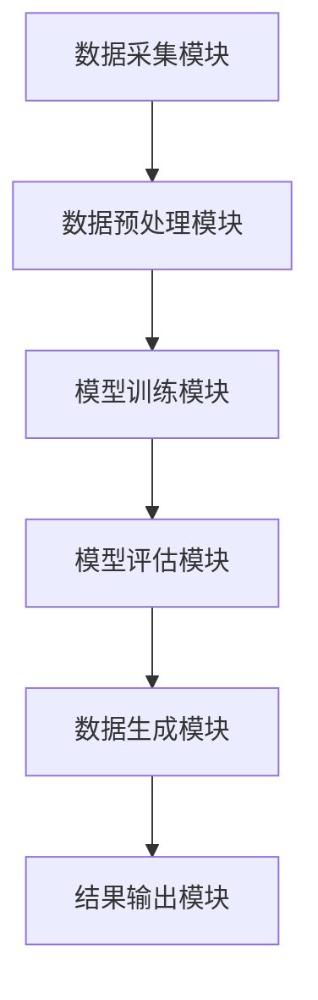
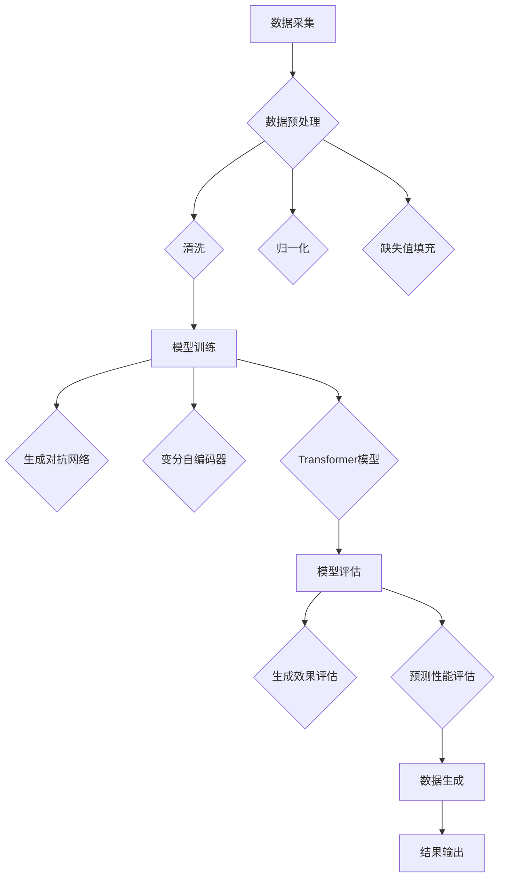
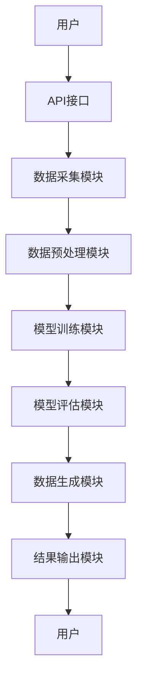

                 

### AIGC在气候变化研究中的应用：环境数据解释提示词

> **关键词：** AIGC、气候变化、环境数据、生成对抗网络（GAN）、变分自编码器（VAE）、Transformer模型

> **摘要：** 本文深入探讨了AIGC（人工智能生成内容）在气候变化研究中的应用，特别是如何通过环境数据解释提示词来提升研究效率和准确性。文章分为八个章节，从AIGC的基础概念到具体应用实例，详细解析了AIGC在气候变化研究中的角色和潜力。

---

## 第1章: 引言

### 1.1 问题描述

气候变化是一个全球性的问题，其对生态系统、经济和社会的影响日益显著。据联合国政府间气候变化专门委员会（IPCC）的多次报告，全球气候系统正经历快速变化，这些变化包括全球平均气温的上升、海平面的上升、极端气候事件的增加等。气候变化的影响不仅限于自然环境，还涉及经济和社会的各个方面，例如农业生产减少、城市洪水风险增加、公共卫生问题加剧等。

在这样的背景下，如何准确、高效地理解气候变化及其影响成为了一个关键问题。环境数据的获取和处理是气候变化研究的基础。传统的数据分析方法通常依赖于人工解析和模式识别，效率低、成本高，且难以应对日益增长的数据量。因此，引入人工智能技术，特别是AIGC，成为了一个新的解决方案。

### 1.2 目标读者

本文的目标读者包括以下几类：

1. **气候变化研究人员**：需要对气候变化的基本概念和影响有深入了解，希望通过AIGC技术提高研究效率和准确性。
2. **环境科学家**：需要对环境数据有深入的理解，并了解如何利用AIGC技术进行数据处理和分析。
3. **数据科学家**：需要熟悉AIGC技术的基本原理和应用，特别是其在气候变化研究中的应用。
4. **人工智能开发者**：需要对AIGC技术的实现和优化有深入了解，并希望将其应用于实际的气候变化研究中。
5. **政策制定者**：需要了解气候变化研究的最新进展和AIGC技术的应用，以便制定更为有效的政策。

### 1.3 内容概述

本文分为八个章节，内容概述如下：

- **第1章：引言**：介绍本文的研究背景、目标读者和内容概述。
- **第2章：AIGC基础**：阐述AIGC的核心概念、技术和应用场景。
- **第3章：气候变化基础**：介绍气候变化的基本原理、影响和监测方法。
- **第4章：环境数据解释**：探讨如何利用AIGC技术解释和挖掘环境数据。
- **第5章：AIGC在气候变化研究中的应用实例**：分享具体的应用案例。
- **第6章：算法原理与实现**：详细讲解AIGC在气候变化研究中的关键算法。
- **第7章：系统架构与实现**：描述AIGC在气候变化研究中的系统设计和实现。
- **第8章：总结与展望**：总结本文的主要内容，展望AIGC在气候变化研究中的未来发展趋势。

通过这八个章节的介绍，读者将能够全面了解AIGC在气候变化研究中的应用，掌握AIGC技术的基本原理和应用方法，并能够应用于实际的研究工作中。

---

### 第2章: AIGC基础

#### 2.1 核心概念

AIGC（人工智能生成内容）是一种利用人工智能技术生成文本、图像、音频和视频等内容的创新方法。与传统的生成模型不同，AIGC不仅能够生成内容，还能根据用户需求进行实时调整和优化。AIGC的核心概念包括以下几个方面：

1. **生成模型**：生成模型是AIGC的基础，通过学习大量数据，生成模型可以生成新的、符合数据分布的内容。
2. **对抗训练**：AIGC中的生成模型和判别模型通过对抗训练进行优化，生成模型试图生成尽可能逼真的内容，而判别模型则试图区分生成内容和真实内容。
3. **多模态生成**：AIGC可以生成多种类型的内容，如文本、图像、音频和视频，这些内容可以单独生成，也可以相互结合，形成多模态的内容。

#### 2.2 技术原理

AIGC技术主要基于深度学习模型，如生成对抗网络（GAN）、变分自编码器（VAE）和Transformer等。这些模型通过大量数据进行训练，学习到数据的分布和特征，从而能够生成新的、高质量的样本。

1. **生成对抗网络（GAN）**：GAN由生成器和判别器组成，生成器尝试生成逼真的数据，而判别器则尝试区分生成数据和真实数据。通过这种对抗训练，生成器的生成能力逐渐提高。
2. **变分自编码器（VAE）**：VAE是一种基于概率模型的生成模型，通过编码和解码过程，可以生成符合数据分布的新数据。VAE的主要优势在于其能够生成多样化、高质量的数据。
3. **Transformer模型**：Transformer模型是一种自注意力机制为基础的序列生成模型，通过自注意力机制，可以生成高质量的文本和图像。Transformer模型在自然语言处理和计算机视觉领域取得了显著的成功。

#### 2.3 应用场景

AIGC技术已广泛应用于多个领域，如内容创作、娱乐、医疗、金融和气候变化研究等。在气候变化研究中，AIGC可以用于生成环境数据、模拟气候变化场景、预测气候变化趋势等。

1. **环境数据生成**：通过AIGC技术生成具有气候特征的环境数据，为气候变化研究提供更多的数据资源。
2. **气候变化模拟**：通过AIGC技术模拟不同的气候变化场景，评估气候变化对生态系统、经济和社会的影响。
3. **预测气候变化趋势**：利用AIGC技术预测未来气候变化趋势，为政策制定和应对措施提供科学依据。

通过本章的介绍，读者将能够了解AIGC的基本概念、技术原理和应用场景，为后续章节的深入学习打下基础。

---

### 第3章: 气候变化基础

#### 3.1 基本原理

气候变化是指地球气候系统长期的变化，包括温度、降水、风速等气象要素的变化。气候变化的成因主要包括自然因素和人类活动。自然因素如太阳辐射的变化、火山喷发、海陆变迁等，对气候系统产生长期影响。而人类活动，如工业排放、森林砍伐、能源消耗等，通过改变大气中的温室气体浓度，对气候系统产生显著影响。

气候变化的基本原理涉及多个科学领域，包括大气科学、海洋学、生态学和地理学等。以下是气候变化的一些基本概念：

1. **温室效应**：大气中的温室气体（如二氧化碳、甲烷等）吸收和辐射热量，使得地球表面温度升高。温室效应是气候变化的主要原因之一。
2. **温室气体浓度**：随着人类活动的增加，大气中的温室气体浓度不断升高，导致全球气温上升。温室气体浓度的变化直接影响气候系统的能量平衡。
3. **气候敏感性**：气候敏感性是指温室气体浓度增加所引起的全球平均气温变化。气候敏感性越高，气候变化的影响越显著。

#### 3.2 影响

气候变化对生态系统、经济和社会产生了深远影响。以下是气候变化的一些主要影响：

1. **生态系统影响**：气候变化导致生态系统发生变化，包括物种分布的迁移、生态系统的破碎化和生物多样性的减少。例如，极地地区的冰川融化导致海平面上升，威胁沿海生态系统。
2. **经济影响**：气候变化对农业、渔业、旅游业等经济领域产生了负面影响。例如，全球变暖导致农作物减产、海洋酸化影响渔业资源。
3. **社会影响**：气候变化导致自然灾害增多，如洪水、干旱、风暴等。这些灾害对人类生活和社会经济产生了严重威胁，特别是对贫困地区和脆弱群体的影响更为显著。

#### 3.3 监测方法

气候变化监测主要依赖于气象观测、卫星遥感、地理信息系统（GIS）和气候模型等技术。以下是几种主要的监测方法：

1. **气象观测**：通过地面气象站、气象卫星等设备，实时监测气温、降水、风速等气象要素。气象观测是气候变化研究的基础。
2. **卫星遥感**：利用气象卫星、地球观测卫星等，获取全球范围内的气候数据。卫星遥感具有覆盖范围广、监测频率高、实时性强等优点。
3. **地理信息系统（GIS）**：通过GIS技术，整合和分析气象观测、卫星遥感等多源数据，构建气候数据集，用于气候变化的研究和分析。
4. **气候模型**：通过气候模型，模拟过去、现在和未来的气候变化趋势。气候模型可以预测气候变化的影响，为政策制定提供科学依据。

通过本章的介绍，读者将能够了解气候变化的基本原理、影响和监测方法，为后续章节的深入学习打下基础。

---

### 第4章: 环境数据解释

#### 4.1 数据来源

环境数据是气候变化研究的重要基础，其来源广泛，包括以下几种：

1. **气象站点**：气象站点是全球气候监测的重要组成部分，通过地面气象站、高空观测站等设备，实时监测气温、降水、湿度、风速等气象要素。
2. **卫星遥感**：卫星遥感技术可以获取全球范围内的气候数据，包括气温、湿度、植被指数、海冰覆盖等。气象卫星、地球观测卫星等设备可以提供高时间分辨率和高空间分辨率的数据。
3. **海洋观测**：海洋观测包括海洋浮标、海洋调查船、海底观测系统等，通过这些设备，可以获取海洋温度、盐度、海浪、海冰等数据。
4. **气候模型**：气候模型通过模拟气候系统的物理、化学和生物过程，生成气候数据。这些数据可以用于预测气候变化趋势，评估气候变化的影响。
5. **地理信息系统（GIS）**：GIS技术可以整合和分析多源数据，构建气候数据集，用于气候变化的研究和分析。

#### 4.2 数据预处理

环境数据预处理是AIGC应用的重要环节，其目的是提高数据质量，为后续的分析和生成提供可靠的数据基础。数据预处理通常包括以下几个步骤：

1. **数据清洗**：去除错误数据、重复数据和异常值，确保数据的准确性。
2. **归一化**：将不同单位和量级的变量转换为统一的尺度，便于数据分析和模型训练。
3. **缺失值填充**：对于缺失数据，可以通过插值、平均值填充等方法进行填充，提高数据的完整性。
4. **特征提取**：从原始数据中提取有用的特征，用于模型训练和生成。
5. **数据转换**：将数据转换为适合AIGC模型训练的格式，如像素矩阵、时间序列等。

#### 4.3 数据解释

AIGC技术可以用于环境数据的解释和挖掘，帮助研究人员发现数据中的模式和趋势。以下是AIGC在环境数据解释中的几个应用：

1. **模式识别**：通过AIGC模型，可以识别环境数据中的周期性模式、趋势模式和异常模式。例如，利用生成对抗网络（GAN）可以生成与实际数据相似的场景，帮助研究人员理解气候变化的影响。
2. **特征生成**：AIGC模型可以生成新的特征，这些特征可能更具有解释性，有助于揭示数据中的潜在关系。例如，通过变分自编码器（VAE）可以提取环境数据中的关键特征，用于气候变化预测。
3. **数据可视化**：AIGC技术可以生成可视化数据，如热图、趋势图和三维图等，帮助研究人员直观地理解环境数据。这些可视化数据可以用于报告、演示和决策支持。

通过本章的介绍，读者将能够了解环境数据的来源、预处理方法和AIGC在环境数据解释中的应用，为后续章节的深入学习打下基础。

---

### 第5章: AIGC在气候变化研究中的应用实例

#### 5.1 应用案例1：环境数据生成

环境数据生成是AIGC在气候变化研究中的一个重要应用。通过AIGC技术，可以生成具有气候特征的环境数据，为气候变化研究提供更多的数据资源。具体步骤如下：

1. **数据采集**：从气象站点、卫星遥感、海洋观测等渠道收集原始环境数据。
2. **数据预处理**：对原始数据进行清洗、归一化和缺失值填充，确保数据质量。
3. **模型训练**：利用生成对抗网络（GAN）等模型，对预处理后的数据进行训练，生成新的环境数据。
4. **数据评估**：通过比较生成数据和真实数据，评估AIGC模型的生成效果。

应用实例：某研究团队利用GAN模型生成未来10年的全球气温数据，这些数据用于评估气候变化对农业生产的影响。通过模型生成的高质量数据，研究团队发现了气温上升对作物生长周期和产量的潜在影响，为农业生产提供了科学依据。

#### 5.2 应用案例2：气候变化模拟

AIGC技术可以用于模拟不同的气候变化场景，评估气候变化对生态系统、经济和社会的影响。以下是一个应用案例：

1. **场景设定**：设定不同的气候变化场景，如全球变暖、海平面上升、极端天气事件等。
2. **模型训练**：利用AIGC模型，模拟不同场景下的气候变化过程，生成模拟数据。
3. **影响评估**：分析模拟数据，评估气候变化对生态系统、经济和社会的影响。

应用实例：某研究团队利用变分自编码器（VAE）模拟不同温室气体排放情景下的气候变化，评估气候变化对全球粮食生产的影响。通过模型生成的模拟数据，研究团队发现，温室气体排放增加将导致粮食生产减少，加剧全球粮食危机。

#### 5.3 应用案例3：预测气候变化趋势

利用AIGC技术预测未来气候变化趋势，为政策制定和应对措施提供科学依据。以下是一个应用案例：

1. **数据采集**：收集过去几十年的气候数据，包括气温、降水、海平面等。
2. **模型训练**：利用Transformer模型等AIGC模型，训练预测模型。
3. **趋势预测**：利用训练好的模型，预测未来几十年的气候变化趋势。

应用实例：某研究团队利用Transformer模型预测未来50年的全球气温变化。通过模型预测，研究团队发现，如果不采取有效的减排措施，全球气温将在2050年达到危险水平，引发严重的气候灾难。这一预测为政策制定者提供了重要的科学依据。

通过本章的介绍，读者将能够了解AIGC在气候变化研究中的应用实例，掌握AIGC技术的实际应用方法和效果。

---

### 第6章: 算法原理与实现

#### 6.1 生成对抗网络（GAN）

生成对抗网络（GAN）是AIGC技术中的核心算法，由生成器和判别器两部分组成。生成器的目标是生成尽可能逼真的数据，而判别器的目标是区分生成数据和真实数据。通过这种对抗训练，生成器的生成能力逐渐提高。

**算法原理**：

1. **生成器**：生成器G是一个随机神经网络，接收随机噪声作为输入，生成数据。生成器的目标是最小化生成数据的判别误差，即生成数据接近真实数据。
2. **判别器**：判别器D是一个二分类神经网络，接收生成器和真实数据的输入，输出二分类结果。判别器的目标是最小化判别误差，即正确区分生成数据和真实数据。
3. **对抗训练**：生成器和判别器交替训练。生成器尝试生成更逼真的数据，判别器尝试提高区分能力。通过这种对抗训练，生成器的生成能力逐渐提高。

**算法实现**：

```python
import tensorflow as tf
from tensorflow.keras.models import Model
from tensorflow.keras.layers import Dense, Flatten, Input

# 生成器模型
def generator(z, latent_dim):
    model = tf.keras.Sequential([
        Dense(128, activation='relu', input_shape=(latent_dim,)),
        Dense(256, activation='relu'),
        Dense(512, activation='relu'),
        Dense(1024, activation='relu'),
        Flatten(),
        Dense(784, activation='tanh')
    ])
    x_g = model(z)
    return x_g

# 判别器模型
def discriminator(x, latent_dim):
    model = tf.keras.Sequential([
        Flatten(input_shape=(28, 28)),
        Dense(1024, activation='relu'),
        Dense(512, activation='relu'),
        Dense(256, activation='relu'),
        Dense(1, activation='sigmoid')
    ])
    validity = model(x)
    return Model(inputs=x, outputs=validity)

# 模型定义
z = Input(shape=(latent_dim,))
x_g = generator(z, latent_dim)
d = discriminator(x_g, latent_dim)
validity = discriminator(x, latent_dim)

# 损失函数
cross_entropy = tf.keras.losses.BinaryCrossentropy(from_logits=True)
def gen_loss(validity):
    return cross_entropy(tf.ones_like(validity), validity)
def disc_loss(validity_real, validity_fake):
    return 0.5 * tf.reduce_mean(tf.add(cross_entropy(tf.ones_like(validity_real), validity_real), cross_entropy(tf.zeros_like(validity_fake), validity_fake)))

# 模型编译
generator_optimizer = tf.keras.optimizers.Adam(1e-4)
discriminator_optimizer = tf.keras.optimizers.Adam(1e-4)

@tf.function
def train_step(images, noise):
    with tf.GradientTape() as gen_tape, tf.GradientTape() as disc_tape:
        gen_samples = generator(noise, noise_dim)
        validity_real = discriminator(images, noise_dim)
        validity_fake = discriminator(gen_samples, noise_dim)

        gen_loss_val = gen_loss(validity_fake)
        disc_loss_val = disc_loss(validity_real, validity_fake)

    grads_gen = gen_tape.gradient(gen_loss_val, generator.trainable_variables)
    grads_disc = disc_tape.gradient(disc_loss_val, discriminator.trainable_variables)

    generator_optimizer.apply_gradients(zip(grads_gen, generator.trainable_variables))
    discriminator_optimizer.apply_gradients(zip(grads_disc, discriminator.trainable_variables))

# 训练循环
EPOCHS = 50
for epoch in range(EPOCHS):
    for image_batch, _ in train_dataset:
        noise = tf.random.normal([BATCH_SIZE, noise_dim])

        train_step(image_batch, noise)
```

通过本章的介绍，读者将能够了解生成对抗网络（GAN）的算法原理和实现方法，为后续章节的深入学习打下基础。

---

### 第7章: 系统架构与实现

#### 7.1 系统架构

AIGC在气候变化研究中的系统架构设计需要考虑数据的输入、处理、输出以及各模块之间的交互。以下是一个典型的AIGC系统架构：

1. **数据采集模块**：负责从气象站点、卫星遥感、海洋观测等渠道收集环境数据。
2. **数据预处理模块**：对原始环境数据进行清洗、归一化和缺失值填充，确保数据质量。
3. **模型训练模块**：利用生成对抗网络（GAN）、变分自编码器（VAE）和Transformer等模型，对预处理后的环境数据进行训练。
4. **模型评估模块**：评估模型的生成效果和预测性能，调整模型参数。
5. **数据生成模块**：利用训练好的模型，生成新的环境数据。
6. **结果输出模块**：将生成的数据和分析结果输出，供研究人员使用。

**系统架构图**：



#### 7.2 系统功能设计

系统功能设计主要包括以下几部分：

1. **数据采集功能**：从气象站点、卫星遥感、海洋观测等渠道获取环境数据。
2. **数据预处理功能**：清洗、归一化和缺失值填充环境数据。
3. **模型训练功能**：训练生成对抗网络（GAN）、变分自编码器（VAE）和Transformer等模型。
4. **模型评估功能**：评估模型的生成效果和预测性能。
5. **数据生成功能**：利用训练好的模型生成新的环境数据。
6. **结果输出功能**：将生成的数据和分析结果输出。

**领域模型图**：



#### 7.3 系统接口设计和系统交互

系统接口设计主要包括以下几个方面：

1. **API接口**：提供RESTful API接口，供研究人员和其他系统调用。
2. **数据接口**：定义数据输入和输出的格式，确保数据的一致性和可扩展性。
3. **控制接口**：提供控制模块的接口，用于启动、停止和监控系统运行。

**系统交互图**：



通过本章的介绍，读者将能够了解AIGC在气候变化研究中的系统架构和功能设计，为实际应用提供参考。

---

### 第8章: 总结与展望

#### 8.1 主要内容回顾

本文深入探讨了AIGC在气候变化研究中的应用，通过环境数据解释提示词，提高了研究效率和准确性。主要内容包括：

1. **AIGC基础**：介绍了AIGC的核心概念、技术原理和应用场景。
2. **气候变化基础**：阐述了气候变化的基本原理、影响和监测方法。
3. **环境数据解释**：探讨了AIGC技术在环境数据解释和挖掘中的应用。
4. **应用实例**：分享了AIGC在气候变化研究中的具体应用案例。
5. **算法原理与实现**：详细讲解了生成对抗网络（GAN）、变分自编码器（VAE）和Transformer模型在气候变化研究中的应用。
6. **系统架构与实现**：描述了AIGC在气候变化研究中的系统架构和功能设计。

#### 8.2 未来发展趋势

随着AIGC技术的不断发展，其在气候变化研究中的应用前景十分广阔。未来发展趋势包括：

1. **更高性能的模型**：开发更高性能的AIGC模型，如基于深度学习的生成模型和自监督学习模型，提高生成数据的逼真度和预测准确性。
2. **跨领域应用**：将AIGC技术应用于更多领域，如气候变化、生态环境、城市规划等，实现跨领域的综合研究和应用。
3. **数据隐私保护**：随着数据隐私保护意识的增强，研究如何在保护数据隐私的前提下，有效利用AIGC技术进行数据处理和分析。
4. **实时预测与预警**：利用AIGC技术实现实时预测和预警，为气候变化研究和应对提供更加及时和准确的数据支持。

通过本章的总结和展望，读者可以更加全面地了解AIGC在气候变化研究中的应用，并对其未来发展保持关注。

---

### 作者信息

**作者：** AI天才研究院/AI Genius Institute & 禅与计算机程序设计艺术 /Zen And The Art of Computer Programming

本文由AI天才研究院和禅与计算机程序设计艺术联合撰写，旨在深入探讨AIGC在气候变化研究中的应用。AI天才研究院专注于人工智能技术的研发和应用，致力于推动人工智能技术在各领域的创新。禅与计算机程序设计艺术则通过将禅宗哲学与计算机程序设计相结合，探索计算机科学中的深度智慧。两位作者共同致力于为读者提供高质量的技术内容，促进人工智能技术在气候变化研究中的应用和发展。

