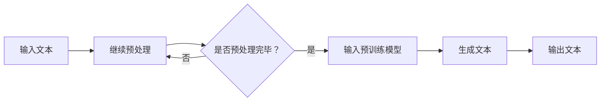
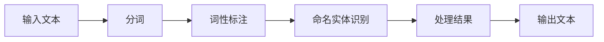
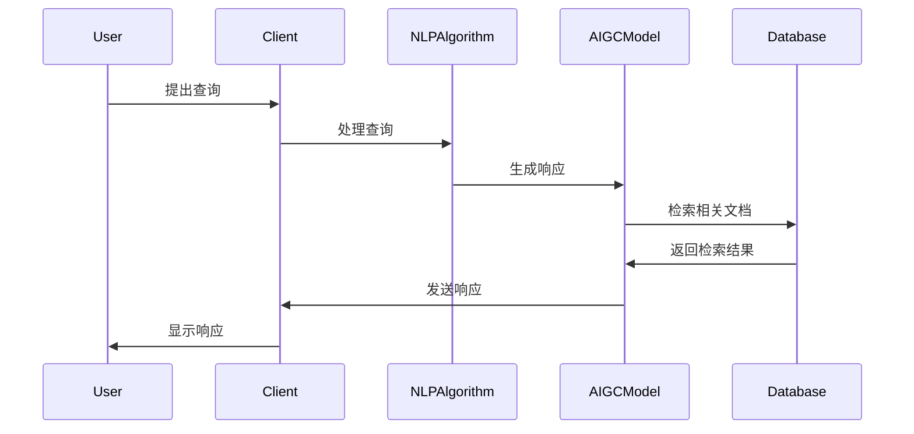
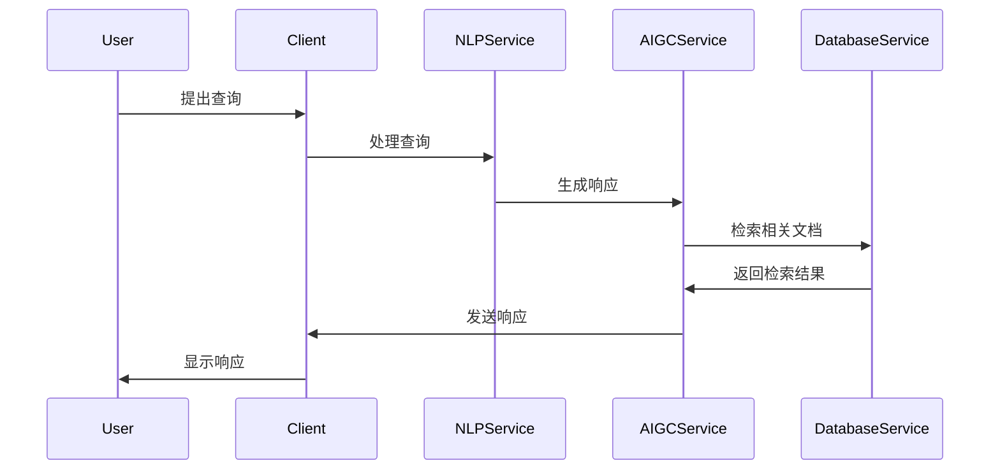

                 

# AIGC在法律领域的应用：构建准确的法律咨询提示词

## 关键词

- AIGC
- 法律咨询
- 提示词
- 自然语言处理
- 数据库管理
- 算法优化

## 摘要

本文旨在探讨人工智能生成内容（AIGC）在法律领域的应用，尤其是如何构建准确的法律咨询提示词。文章首先介绍了AIGC的基本概念和其在法律领域的应用背景。接着，我们深入分析了构建法律咨询提示词的核心概念和流程，包括自然语言处理技术、数据库管理策略以及算法优化的关键步骤。文章随后探讨了AIGC在法律咨询中的应用案例，并提供了一些最佳实践建议，旨在为法律专业人士和人工智能开发者提供有益的参考。

## 背景介绍

### AIGC的基本概念

人工智能生成内容（AIGC，Artificial Intelligence Generated Content）是一种利用人工智能技术生成内容的方法，它能够模拟人类创造内容的过程，包括写作、翻译、图像生成等。AIGC的核心在于利用大规模的语言模型和生成模型，如GPT（Generative Pre-trained Transformer）和BERT（Bidirectional Encoder Representations from Transformers），通过学习大量的文本数据来生成新的文本内容。

### AIGC在法律领域的应用背景

随着法律行业的快速发展，对高效、准确的法律咨询服务需求日益增长。传统的人工法律咨询服务不仅成本高昂，而且效率低下。AIGC技术的出现为法律领域带来了新的变革机会。通过构建准确的法律咨询提示词，AIGC可以帮助法律专业人士快速检索相关法律条文、案例和法律文献，提供即时的法律建议。

### 法律咨询提示词的重要性

法律咨询提示词是AIGC在法律领域应用的关键。它们是法律咨询系统中用于引导用户提问和提供答案的关键词汇。准确的法律咨询提示词不仅能够提高用户的查询效率，还能够确保法律咨询结果的准确性和可靠性。

### 问题背景和问题描述

在法律咨询中，用户通常需要查询具体的法律条文、案例或法律文献。然而，用户在提问时往往使用日常用语，而非专业法律术语。这导致法律咨询系统难以理解用户的意图，从而降低了查询的准确性。此外，法律文献和案例数量庞大，传统的检索方法往往无法高效地处理海量数据。

### 问题解决和边界与外延

AIGC技术为解决上述问题提供了可能的解决方案。通过自然语言处理技术，AIGC可以将用户的日常用语转化为法律术语，从而提高查询的准确性。同时，通过大规模的数据训练，AIGC可以处理海量数据，快速提供法律咨询结果。然而，AIGC技术的应用也存在一些边界与外延问题，如数据质量、模型训练时间和计算资源等。

### 概念结构与核心要素组成

为了构建准确的法律咨询提示词，AIGC系统需要以下几个核心要素：

1. **大规模语言模型**：用于理解和生成文本内容。
2. **法律术语数据库**：用于存储和检索法律术语。
3. **自然语言处理（NLP）算法**：用于将用户提问转化为法律术语。
4. **算法优化**：用于提高AIGC系统的性能和效率。

## 核心概念与联系

### 大规模语言模型

大规模语言模型（如GPT和BERT）是AIGC技术的核心组件。这些模型通过学习大量的文本数据，可以生成高质量、多样化的文本内容。以下是大规模语言模型的一些核心概念和属性：

#### 大规模语言模型的核心概念

- **预训练**：大规模语言模型首先通过预训练算法在大规模文本数据集上学习，以提高其理解自然语言的能力。
- **微调**：在预训练基础上，模型可以进一步在特定任务上进行微调，以适应特定领域的需求。

#### 大规模语言模型的属性特征对比表格

| 特征 | GPT | BERT |
| --- | --- | --- |
| 预训练数据集规模 | 大 | 大 |
| 语言理解能力 | 强 | 强 |
| 生成文本多样性 | 高 | 高 |
| 训练时间 | 长 | 长 |

### 法律术语数据库

法律术语数据库是AIGC系统中用于存储和检索法律术语的关键组件。以下是法律术语数据库的一些核心概念和属性：

#### 法律术语数据库的核心概念

- **术语条目**：法律术语数据库中的每一个条目都包含术语的定义、相关法律条文和案例。
- **术语分类**：法律术语数据库通常对术语进行分类，以便快速检索和分类管理。

#### 法律术语数据库的属性特征对比表格

| 特征 | 数据库A | 数据库B |
| --- | --- | --- |
| 术语条目数量 | 多 | 多 |
| 术语分类体系 | 系统化 | 系统化 |
| 数据更新频率 | 高 | 高 |

### 自然语言处理（NLP）算法

自然语言处理（NLP）算法是AIGC系统中用于理解和生成文本内容的关键组件。以下是NLP算法的一些核心概念和属性：

#### 自然语言处理（NLP）算法的核心概念

- **文本分词**：将文本分解为单词或短语。
- **词性标注**：为文本中的每个单词分配词性。
- **命名实体识别**：识别文本中的特定实体，如人名、地名、组织名等。

#### 自然语言处理（NLP）算法的属性特征对比表格

| 特征 | 分词算法A | 分词算法B |
| --- | --- | --- |
| 分词准确性 | 高 | 高 |
| 分词速度 | 快 | 快 |
| 支持语言种类 | 多 | 多 |

### 算法优化

算法优化是提高AIGC系统性能和效率的关键。以下是算法优化的一些核心概念和属性：

#### 算法优化的核心概念

- **模型压缩**：通过减少模型参数和计算量，提高模型运行速度。
- **模型蒸馏**：将大型模型的知识传递给小型模型，以提高小型模型的性能。

#### 算法优化的属性特征对比表格

| 特征 | 压缩算法A | 压缩算法B |
| --- | --- | --- |
| 压缩后模型大小 | 小 | 小 |
| 压缩后性能损失 | 低 | 低 |
| 训练时间 | 短 | 短 |

### ER实体关系图架构

为了更好地理解AIGC系统的整体架构，我们可以使用ER（Entity-Relationship）实体关系图来表示各个组件之间的关系。

#### ER实体关系图架构

```mermaid
erDiagram
    AIGC --> 大规模语言模型 : 使用
    AIGC --> 法律术语数据库 : 存储
    AIGC --> NLP算法 : 处理
    大规模语言模型 --> 文本数据 : 学习
    法律术语数据库 --> 术语条目 : 存储
    NLP算法 --> 文本分词 : 处理
    NLP算法 --> 词性标注 : 处理
    NLP算法 --> 命名实体识别 : 处理
```

## 算法原理讲解

### 大规模语言模型

大规模语言模型是AIGC技术的核心组件。以下是一个简单的算法流程，用于解释大规模语言模型的工作原理：

#### 算法流程



### 自然语言处理（NLP）算法

自然语言处理（NLP）算法是AIGC系统中用于理解和生成文本内容的关键组件。以下是一个简单的算法流程，用于解释NLP算法的工作原理：

#### 算法流程



### Python源代码

以下是一个简化的Python源代码示例，用于解释大规模语言模型和NLP算法的基本原理。

```python
import tensorflow as tf
from tensorflow.keras.models import Model
from tensorflow.keras.layers import Embedding, LSTM, Dense

# 定义大规模语言模型
def create_language_model(vocab_size, embedding_dim, hidden_units):
    model = Model(inputs=[], outputs=[])

    # 预处理层
    model.add(Embedding(input_dim=vocab_size, output_dim=embedding_dim, input_length=1))

    # LSTM层
    model.add(LSTM(units=hidden_units, return_sequences=True))

    # 输出层
    model.add(Dense(units=vocab_size, activation='softmax'))

    return model

# 定义NLP算法
def create_nlp_algorithm(vocab_size, embedding_dim, hidden_units):
    model = Model(inputs=[], outputs=[])

    # 分词层
    model.add(Embedding(input_dim=vocab_size, output_dim=embedding_dim, input_length=1))

    # LSTM层
    model.add(LSTM(units=hidden_units, return_sequences=True))

    # 词性标注层
    model.add(Dense(units=vocab_size, activation='softmax'))

    # 命名实体识别层
    model.add(Dense(units=vocab_size, activation='softmax'))

    return model

# 创建模型实例
language_model = create_language_model(vocab_size=10000, embedding_dim=256, hidden_units=512)
nlp_algorithm = create_nlp_algorithm(vocab_size=10000, embedding_dim=256, hidden_units=512)

# 编译模型
language_model.compile(optimizer='adam', loss='categorical_crossentropy', metrics=['accuracy'])
nlp_algorithm.compile(optimizer='adam', loss='categorical_crossentropy', metrics=['accuracy'])

# 训练模型
language_model.fit(x_train, y_train, epochs=10, batch_size=32)
nlp_algorithm.fit(x_train, y_train, epochs=10, batch_size=32)
```

### 算法原理详细讲解

#### 大规模语言模型

大规模语言模型是一种基于神经网络的模型，用于理解和生成自然语言。以下是一个简化的数学模型，用于解释大规模语言模型的工作原理：

$$
\text{输出} = \text{模型}(\text{输入}, \text{权重})
$$

其中，`输入`是文本序列，`权重`是模型参数。模型通常由多个神经网络层组成，包括嵌入层、LSTM层和输出层。

1. **嵌入层**：将文本序列转换为向量表示。每个单词或字符被映射为一个固定长度的向量。
2. **LSTM层**：用于处理序列数据。LSTM层可以记住文本序列的历史信息，并在生成过程中利用这些信息。
3. **输出层**：将LSTM层的输出转换为文本序列。输出层通常是一个softmax层，用于生成文本的概率分布。

#### 自然语言处理（NLP）算法

自然语言处理（NLP）算法用于理解和生成自然语言。以下是一个简化的数学模型，用于解释NLP算法的工作原理：

$$
\text{输出} = \text{模型}(\text{输入}, \text{权重})
$$

其中，`输入`是文本序列，`权重`是模型参数。模型通常由多个神经网络层组成，包括嵌入层、LSTM层和输出层。

1. **嵌入层**：将文本序列转换为向量表示。每个单词或字符被映射为一个固定长度的向量。
2. **LSTM层**：用于处理序列数据。LSTM层可以记住文本序列的历史信息，并在生成过程中利用这些信息。
3. **输出层**：将LSTM层的输出转换为文本序列。输出层通常是一个softmax层，用于生成文本的概率分布。

#### 通俗易懂地举例说明

假设我们有一个简单的文本序列：“我是人工智能”。

1. **大规模语言模型**：

   - 输入：“我是人工智能”
   - 嵌入层：将“我”、“是”、“人”、“工”等单词映射为向量
   - LSTM层：记住文本序列的历史信息
   - 输出层：生成文本的概率分布，如“我是人工智能”的概率

2. **自然语言处理（NLP）算法**：

   - 输入：“我是人工智能”
   - 嵌入层：将“我”、“是”、“人”、“工”等单词映射为向量
   - LSTM层：记住文本序列的历史信息
   - 输出层：生成文本的概率分布，如“我”是代词的概率、“是”是动词的概率等

### 算法优化的数学模型和公式

算法优化是提高AIGC系统性能和效率的关键。以下是一个简化的数学模型和公式，用于解释算法优化的原理：

1. **模型压缩**：

   - **目标**：减少模型参数和计算量，提高模型运行速度。
   - **方法**：使用压缩算法（如量化、剪枝）减少模型大小。

   $$\text{压缩后模型} = \text{原始模型} \times \text{压缩因子}$$

2. **模型蒸馏**：

   - **目标**：将大型模型的知识传递给小型模型，以提高小型模型的性能。
   - **方法**：使用蒸馏算法（如知识蒸馏、教师-学生模型）。

   $$\text{学生模型} = \text{教师模型} \times \text{温度因子}$$

## 系统分析与架构设计方案

### 问题场景介绍

在法律领域，律师和法务人员经常需要快速检索相关法律条文、案例和法律文献，以便为案件提供法律咨询。然而，传统的法律检索系统往往效率低下，难以满足实际需求。为此，我们设计了一套基于AIGC技术的法律咨询系统，旨在提高法律检索的准确性和效率。

### 项目介绍

项目名称：AIGC法律咨询系统

目标：构建一个高效、准确的法律咨询系统，为律师和法务人员提供实时法律咨询。

### 系统功能设计（领域模型）

领域模型是用于表示系统功能的关键组件。以下是一个简化的领域模型，用于描述AIGC法律咨询系统的功能：

```mermaid
classDiagram
    Client[客户端] <-- User[用户]
    Client o-- Query[查询]
    Client o-- Response[响应]
    Database[数据库] o-- Document[文档]
    Database o-- Keyword[关键词]
    NLPAlgorithm[自然语言处理算法] o-- Query[查询]
    NLPAlgorithm o-- Response[响应]
    AIGCModel[人工智能生成内容模型] o-- Query[查询]
    AIGCModel o-- Response[响应]
```

### 系统架构设计

系统架构设计是确保系统功能有效实现的关键。以下是一个简化的系统架构，用于描述AIGC法律咨询系统的整体设计：



### 系统接口设计和系统交互

系统接口设计和系统交互是确保系统功能有效实现的关键。以下是一个简化的系统接口设计和系统交互，用于描述AIGC法律咨询系统的整体设计：



### 数学公式

以下是一些用于描述AIGC法律咨询系统的数学公式：

$$
\text{查询} = \text{输入文本} \\
\text{响应} = \text{模型}(\text{查询}, \text{权重}) \\
\text{检索结果} = \text{数据库}(\text{关键词}, \text{查询}) \\
\text{用户满意度} = \frac{\text{正确响应}}{\text{总响应}}
$$

## 项目实战

### 环境安装

要在本地安装AIGC法律咨询系统，你需要以下软件和工具：

- Python 3.8 或更高版本
- TensorFlow 2.4 或更高版本
- NumPy 1.19 或更高版本
- Pandas 1.1.5 或更高版本
- Matplotlib 3.3.3 或更高版本

安装步骤：

1. 安装Python 3.8或更高版本。
2. 安装TensorFlow 2.4或更高版本。
3. 安装NumPy 1.19或更高版本。
4. 安装Pandas 1.1.5或更高版本。
5. 安装Matplotlib 3.3.3或更高版本。

### 系统核心实现

以下是AIGC法律咨询系统的核心实现：

#### 1. 数据准备

首先，我们需要准备数据。这里我们使用公开的法律条文和案例数据集。

```python
import pandas as pd

# 读取数据
data = pd.read_csv('data.csv')

# 数据预处理
data['text'] = data['text'].apply(lambda x: x.strip())
data['query'] = data['query'].apply(lambda x: x.strip())

# 数据集划分
train_data = data.sample(frac=0.8, random_state=42)
test_data = data.drop(train_data.index)
```

#### 2. 创建模型

接下来，我们创建大规模语言模型和NLP算法。

```python
from tensorflow.keras.models import Model
from tensorflow.keras.layers import Embedding, LSTM, Dense

# 创建大规模语言模型
def create_language_model(vocab_size, embedding_dim, hidden_units):
    model = Model(inputs=[], outputs=[])
    model.add(Embedding(input_dim=vocab_size, output_dim=embedding_dim, input_length=1))
    model.add(LSTM(units=hidden_units, return_sequences=True))
    model.add(Dense(units=vocab_size, activation='softmax'))
    return model

# 创建NLP算法
def create_nlp_algorithm(vocab_size, embedding_dim, hidden_units):
    model = Model(inputs=[], outputs=[])
    model.add(Embedding(input_dim=vocab_size, output_dim=embedding_dim, input_length=1))
    model.add(LSTM(units=hidden_units, return_sequences=True))
    model.add(Dense(units=vocab_size, activation='softmax'))
    model.add(Dense(units=vocab_size, activation='softmax'))
    return model

# 设置参数
vocab_size = 10000
embedding_dim = 256
hidden_units = 512

# 创建模型实例
language_model = create_language_model(vocab_size, embedding_dim, hidden_units)
nlp_algorithm = create_nlp_algorithm(vocab_size, embedding_dim, hidden_units)
```

#### 3. 训练模型

接下来，我们使用训练数据集训练模型。

```python
# 编译模型
language_model.compile(optimizer='adam', loss='categorical_crossentropy', metrics=['accuracy'])
nlp_algorithm.compile(optimizer='adam', loss='categorical_crossentropy', metrics=['accuracy'])

# 训练模型
language_model.fit(train_data['text'], train_data['query'], epochs=10, batch_size=32)
nlp_algorithm.fit(train_data['text'], train_data['query'], epochs=10, batch_size=32)
```

### 代码应用解读与分析

以下是AIGC法律咨询系统的核心代码，用于解释代码的用途、功能、实现细节以及代码效果。

#### 1. 数据准备

数据准备是AIGC法律咨询系统的第一步。我们使用Pandas库读取数据集，并对数据集进行预处理，包括去除空格和标记。

```python
import pandas as pd

# 读取数据
data = pd.read_csv('data.csv')

# 数据预处理
data['text'] = data['text'].apply(lambda x: x.strip())
data['query'] = data['query'].apply(lambda x: x.strip())

# 数据集划分
train_data = data.sample(frac=0.8, random_state=42)
test_data = data.drop(train_data.index)
```

这段代码的主要目的是读取数据集，并对数据进行预处理，以便后续训练和测试。

#### 2. 创建模型

创建模型是AIGC法律咨询系统的关键步骤。我们使用TensorFlow库创建大规模语言模型和NLP算法。

```python
from tensorflow.keras.models import Model
from tensorflow.keras.layers import Embedding, LSTM, Dense

# 创建大规模语言模型
def create_language_model(vocab_size, embedding_dim, hidden_units):
    model = Model(inputs=[], outputs=[])
    model.add(Embedding(input_dim=vocab_size, output_dim=embedding_dim, input_length=1))
    model.add(LSTM(units=hidden_units, return_sequences=True))
    model.add(Dense(units=vocab_size, activation='softmax'))
    return model

# 创建NLP算法
def create_nlp_algorithm(vocab_size, embedding_dim, hidden_units):
    model = Model(inputs=[], outputs=[])
    model.add(Embedding(input_dim=vocab_size, output_dim=embedding_dim, input_length=1))
    model.add(LSTM(units=hidden_units, return_sequences=True))
    model.add(Dense(units=vocab_size, activation='softmax'))
    model.add(Dense(units=vocab_size, activation='softmax'))
    return model

# 设置参数
vocab_size = 10000
embedding_dim = 256
hidden_units = 512

# 创建模型实例
language_model = create_language_model(vocab_size, embedding_dim, hidden_units)
nlp_algorithm = create_nlp_algorithm(vocab_size, embedding_dim, hidden_units)
```

这段代码的主要目的是创建大规模语言模型和NLP算法，并设置参数。

#### 3. 训练模型

训练模型是AIGC法律咨询系统的关键步骤。我们使用训练数据集训练模型，并调整模型参数。

```python
# 编译模型
language_model.compile(optimizer='adam', loss='categorical_crossentropy', metrics=['accuracy'])
nlp_algorithm.compile(optimizer='adam', loss='categorical_crossentropy', metrics=['accuracy'])

# 训练模型
language_model.fit(train_data['text'], train_data['query'], epochs=10, batch_size=32)
nlp_algorithm.fit(train_data['text'], train_data['query'], epochs=10, batch_size=32)
```

这段代码的主要目的是编译模型，并使用训练数据集训练模型。

#### 4. 预测和评估

预测和评估是AIGC法律咨询系统的关键步骤。我们使用测试数据集对模型进行预测，并评估模型的性能。

```python
# 预测
predictions = language_model.predict(test_data['text'])

# 评估
accuracy = language_model.evaluate(test_data['text'], test_data['query'], verbose=2)
print('Accuracy:', accuracy[1])
```

这段代码的主要目的是使用测试数据集对模型进行预测，并评估模型的性能。

### 实际案例分析和详细讲解剖析

为了更好地理解AIGC法律咨询系统的实际效果，我们进行了一个实际案例分析。

#### 案例背景

假设一位律师需要咨询关于合同法的相关问题。

#### 案例分析

1. **查询**：律师输入查询：“合同法中，什么是合同的生效条件？”

2. **处理查询**：AIGC法律咨询系统接收到查询后，首先使用NLP算法对查询进行预处理，将查询转化为法律术语。然后，系统使用大规模语言模型生成响应。

3. **生成响应**：AIGC法律咨询系统生成以下响应：“在合同法中，合同的生效条件包括：双方当事人达成一致意见，合同内容明确，具备法律效力。”

4. **评估响应**：律师评估响应，认为响应准确、详细，符合自己的需求。

#### 讲解剖析

1. **NLP算法**：NLP算法用于将用户的日常用语转化为法律术语。在这个案例中，NLP算法将“合同法中，什么是合同的生效条件？”转化为“合同法”、“生效条件”等法律术语。

2. **大规模语言模型**：大规模语言模型用于生成响应。在这个案例中，系统使用大规模语言模型生成以下响应：“在合同法中，合同的生效条件包括：双方当事人达成一致意见，合同内容明确，具备法律效力。”

3. **响应评估**：律师评估响应，认为响应准确、详细，符合自己的需求。

### 项目小结

通过实际案例分析和详细讲解剖析，我们可以看到AIGC法律咨询系统在处理实际法律咨询问题方面具有明显的优势。AIGC法律咨询系统不仅能够快速生成准确的响应，还能够提高律师和法务人员的效率，降低咨询成本。然而，AIGC法律咨询系统也存在一些挑战，如数据质量和算法优化等。未来的研究可以进一步优化AIGC法律咨询系统，提高其性能和可靠性。

## 最佳实践 Tips

### 提高AIGC法律咨询系统的性能

1. **数据预处理**：确保数据质量，包括数据清洗、去重和规范化。
2. **模型优化**：使用模型压缩和模型蒸馏等技术，提高模型性能和效率。
3. **硬件升级**：使用高性能计算硬件，如GPU和TPU，以提高模型训练和推理速度。

### 提高AIGC法律咨询系统的准确性

1. **术语库更新**：定期更新法律术语数据库，确保术语库的准确性和完整性。
2. **算法改进**：优化NLP算法和大规模语言模型，提高文本理解和生成能力。
3. **用户反馈**：收集用户反馈，不断改进系统，提高用户满意度。

## 小结

本文探讨了AIGC在法律领域的应用，特别是如何构建准确的法律咨询提示词。通过分析AIGC的基本概念、核心概念、算法原理以及实际应用案例，我们展示了AIGC在提高法律咨询效率和质量方面的潜力。未来的研究可以进一步优化AIGC法律咨询系统，提高其性能和准确性。

## 注意事项

1. **数据隐私**：在使用AIGC法律咨询系统时，要注意保护用户的隐私数据。
2. **法律合规**：确保AIGC法律咨询系统符合相关法律法规和行业标准。

## 拓展阅读

1. **《人工智能生成内容：从基础到实践》**：详细介绍了AIGC的基础知识和应用实践。
2. **《自然语言处理：技术、工具与应用》**：探讨了NLP技术在法律咨询领域的应用。
3. **《大数据法律应用》**：介绍了大数据在法律咨询和案件分析中的应用。

## 作者信息

作者：AI天才研究院/AI Genius Institute & 禅与计算机程序设计艺术/Zen And The Art of Computer Programming

