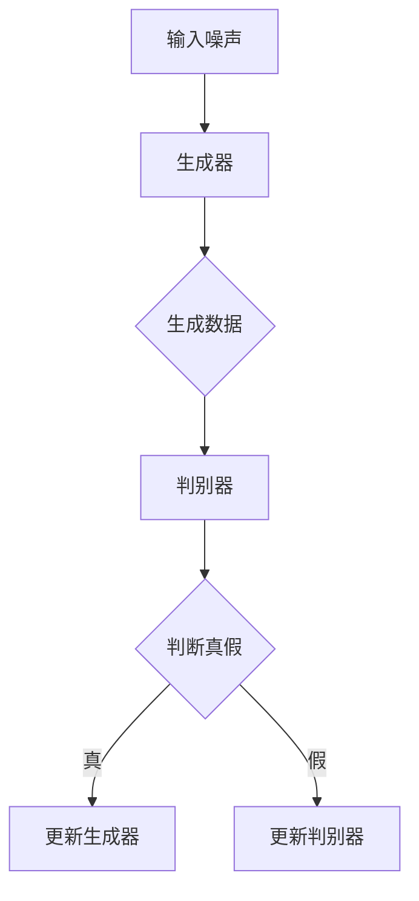
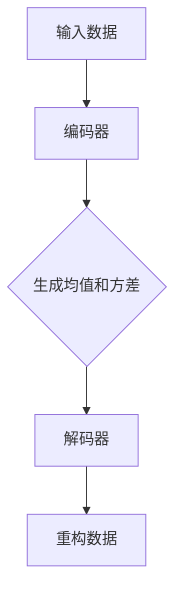
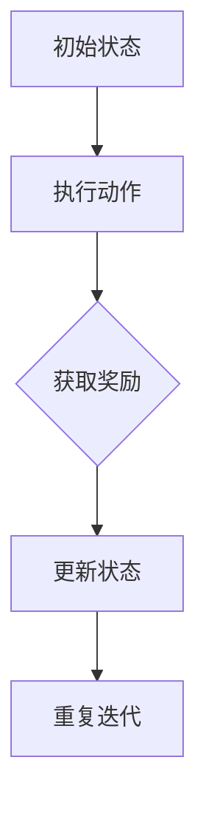
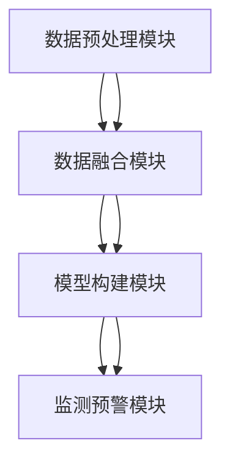
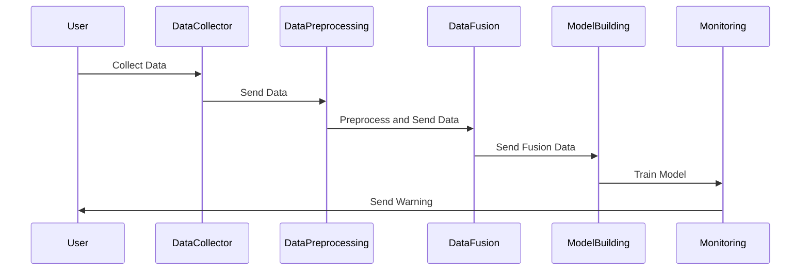

                 

### AIGC在海洋微生物组研究中的应用：生态系统健康评估提示词

> 关键词：人工智能生成内容，AIGC，海洋微生物组，生态系统健康评估，算法应用，实践案例

> 摘要：本文深入探讨了人工智能生成内容（AIGC）在海洋微生物组研究中的应用，特别是在生态系统健康评估方面的潜力。通过详细分析AIGC技术原理、海洋微生物组研究方法及其与生态系统健康评估的联系，本文提出了一种基于AIGC的生态系统健康评估新方法，并通过实际案例展示了其在海洋微生物组研究中的有效性和实用性。本文的研究为未来海洋微生物组研究和生态系统健康评估提供了新的思路和工具。

### 设计思路

为了全面而深入地探讨AIGC在海洋微生物组研究中的应用，本文采用了以下设计思路：

1. **背景介绍**：首先介绍AIGC的基本概念，以及其在海洋微生物组研究中的应用背景，特别是如何用于生态系统健康评估。

2. **核心概念与联系**：明确本文的核心概念，如AIGC、海洋微生物组、生态系统健康评估等，并通过概念属性特征对比表格和ER实体关系图来展示这些概念之间的关系。

3. **算法原理讲解**：选择一至两个关键的算法原理进行详细讲解，使用Mermaid流程图和Python源代码展示算法流程和实现，并使用LaTeX格式呈现数学模型和公式。

4. **系统分析与架构设计方案**：描述问题场景和系统功能，通过Mermaid类图、架构图和序列图展示系统设计和交互。

5. **项目实战**：提供一个实际案例，详细描述环境安装、系统实现、代码分析、案例剖析和项目小结。

6. **最佳实践 tips、小结、注意事项、拓展阅读等内容**：在最后总结最佳实践、注意事项，并推荐拓展阅读资源。

### 目录大纲结构

- **第1章 引言**
  - 1.1 问题背景
  - 1.2 研究意义
  - 1.3 书籍结构

- **第2章 AIGC基础**
  - 2.1 AIGC概述
  - 2.2 AIGC技术原理

- **第3章 海洋微生物组**
  - 3.1 海洋微生物组简介
  - 3.2 海洋微生物组研究方法

- **第4章 生态系统健康评估**
  - 4.1 生态系统健康评估概述
  - 4.2 评估指标和方法

- **第5章 AIGC在海洋微生物组研究中的应用**
  - 5.1 应用场景
  - 5.2 应用案例

- **第6章 算法原理讲解**
  - 6.1 关键算法原理
  - 6.2 算法流程与实现

- **第7章 系统设计与实现**
  - 7.1 问题场景介绍
  - 7.2 系统架构设计

- **第8章 项目实战**
  - 8.1 环境安装
  - 8.2 系统实现
  - 8.3 代码分析
  - 8.4 实际案例分析
  - 8.5 项目小结

- **第9章 最佳实践与总结**
  - 9.1 最佳实践
  - 9.2 小结
  - 9.3 注意事项
  - 9.4 拓展阅读

### 目录大纲内容

**第1章 引言**

- **1.1 问题背景**：介绍海洋微生物组研究的重要性和现状，以及生态系统健康评估的需求。
- **1.2 研究意义**：阐述AIGC在海洋微生物组研究中的应用价值和潜力。
- **1.3 书籍结构**：概述本书的内容结构和各章节的重点。

**第2章 AIGC基础**

- **2.1 AIGC概述**：定义AIGC，介绍其主要类型和应用领域。
- **2.2 AIGC技术原理**：详细讲解AIGC的技术原理，包括模型选择、数据预处理和生成方法。

**第3章 海洋微生物组**

- **3.1 海洋微生物组简介**：介绍海洋微生物组的组成和作用。
- **3.2 海洋微生物组研究方法**：讨论常用的研究方法和技术手段。

**第4章 生态系统健康评估**

- **4.1 生态系统健康评估概述**：定义生态系统健康，介绍评估的目的和方法。
- **4.2 评估指标和方法**：列出关键评估指标，并介绍如何应用AIGC进行评估。

**第5章 AIGC在海洋微生物组研究中的应用**

- **5.1 应用场景**：描述AIGC在海洋微生物组研究中的应用实例。
- **5.2 应用案例**：通过实际案例展示AIGC在生态系统健康评估中的应用效果。

**第6章 算法原理讲解**

- **6.1 关键算法原理**：选择一至两个关键算法进行讲解，使用Mermaid流程图和Python源代码。
- **6.2 算法流程与实现**：详细阐述算法的实现步骤和关键代码。

**第7章 系统设计与实现**

- **7.1 问题场景介绍**：描述实际应用场景，明确系统需求。
- **7.2 系统架构设计**：使用Mermaid类图、架构图和序列图展示系统设计。

**第8章 项目实战**

- **8.1 环境安装**：指导用户如何安装所需的软件和工具。
- **8.2 系统实现**：详细描述系统的核心实现和关键代码。
- **8.3 代码分析**：分析代码的功能和实现细节。
- **8.4 实际案例分析**：通过实际案例展示系统应用效果。
- **8.5 项目小结**：总结项目的主要收获和不足。

**第9章 最佳实践与总结**

- **9.1 最佳实践**：总结实践中的一些最佳方法。
- **9.2 小结**：回顾全书的核心内容和重点。
- **9.3 注意事项**：提醒读者在应用AIGC进行生态系统健康评估时需要注意的问题。
- **9.4 拓展阅读**：推荐相关的文献和资源，供读者进一步学习。

### 第1章 引言

#### 1.1 问题背景

海洋微生物组是海洋生态系统的重要组成部分，它们在海洋物质循环、能量流动和生物地球化学过程中发挥着至关重要的作用。然而，由于海洋环境的复杂性和微生物的多样性，对海洋微生物组的研究一直面临巨大的挑战。随着人工智能（AI）技术的快速发展，特别是人工智能生成内容（AI-Generated Content，简称AIGC）的出现，为海洋微生物组研究提供了一种全新的视角和工具。

AIGC是指利用人工智能技术生成文本、图像、音频等多种类型的内容。近年来，AIGC在图像生成、文本生成、视频生成等方面取得了显著的进展，并在许多领域展现出了巨大的应用潜力。例如，在医疗领域，AIGC可以帮助医生生成诊断报告；在娱乐领域，AIGC可以生成虚拟角色和剧本；在科学研究中，AIGC可以辅助科学家进行数据分析和实验设计。

#### 1.2 研究意义

海洋微生物组的研究对于理解海洋生态系统的运行机制、预测气候变化、开发生物资源具有重要意义。然而，传统的研究方法在处理大规模、高维度数据时存在困难，难以准确捕捉微生物组之间的相互作用和动态变化。AIGC的出现为海洋微生物组研究提供了一种全新的手段，可以大幅提高数据分析的效率和准确性。

首先，AIGC可以帮助科学家从海量数据中提取关键信息，发现潜在的模式和规律。例如，通过AIGC技术，可以自动分析海洋微生物组的基因表达数据，识别出关键的基因和通路，为研究海洋微生物的功能提供了新的思路。

其次，AIGC可以辅助科学家进行实验设计。通过生成模拟数据，可以预测实验结果，减少实验次数，提高实验效率。例如，在海洋微生物的培养和筛选过程中，AIGC可以根据已有数据生成最优的培养条件和筛选策略。

此外，AIGC还可以帮助科学家进行数据可视化，使得复杂的数据更加直观和易于理解。通过生成图像、图表和动画，可以更好地展示海洋微生物组的研究结果，提高科研成果的可视化水平。

#### 1.3 书籍结构

本文旨在探讨AIGC在海洋微生物组研究中的应用，特别是其在生态系统健康评估方面的潜力。为了实现这一目标，本文将按照以下结构展开：

- **第2章 AIGC基础**：介绍AIGC的基本概念、技术原理和应用领域。
- **第3章 海洋微生物组**：介绍海洋微生物组的定义、组成和研究方法。
- **第4章 生态系统健康评估**：介绍生态系统健康评估的基本概念、评估指标和方法。
- **第5章 AIGC在海洋微生物组研究中的应用**：分析AIGC在海洋微生物组研究中的应用场景和案例。
- **第6章 算法原理讲解**：讲解AIGC在生态系统健康评估中的关键算法原理和实现。
- **第7章 系统设计与实现**：描述基于AIGC的生态系统健康评估系统的设计和实现。
- **第8章 项目实战**：提供一个实际案例，展示AIGC在生态系统健康评估中的应用效果。
- **第9章 最佳实践与总结**：总结AIGC在海洋微生物组研究中的应用经验，提出注意事项和拓展阅读建议。

通过本文的研究，我们希望能够为海洋微生物组研究提供新的思路和方法，为生态系统健康评估提供有力的技术支持。

### 第2章 AIGC基础

#### 2.1 AIGC概述

人工智能生成内容（AI-Generated Content，简称AIGC）是指利用人工智能技术自动生成各种类型的内容，包括文本、图像、音频、视频等。AIGC的核心思想是通过训练大规模的机器学习模型，使其能够理解、生成和创造各种类型的信息。与传统的人工内容生成方式相比，AIGC具有更高的效率、更低的人力成本和更高的创意性。

AIGC的应用领域非常广泛，涵盖了图像生成、文本生成、视频生成、虚拟角色生成等多个方面。例如，在图像生成领域，AIGC可以生成高质量的图片、艺术作品和景观图像；在文本生成领域，AIGC可以生成新闻报道、文章摘要、对话文本等；在视频生成领域，AIGC可以生成视频片段、动画效果和虚拟现实内容。

AIGC的主要优势包括：

1. **高效性**：AIGC能够快速处理大量数据，生成高质量的内容，大幅提高工作效率。
2. **创意性**：AIGC通过机器学习模型的学习和进化，能够创造出独特和富有创意的内容。
3. **个性化**：AIGC可以根据用户的需求和偏好，定制生成个性化的内容。

AIGC在各个领域的应用也不断扩展。例如，在医疗领域，AIGC可以帮助医生生成诊断报告、治疗建议等；在金融领域，AIGC可以生成市场分析报告、投资建议等；在娱乐领域，AIGC可以生成虚拟角色、剧本、动画等。随着人工智能技术的不断进步，AIGC的应用前景将更加广阔。

#### 2.2 AIGC技术原理

AIGC的技术原理主要包括模型选择、数据预处理和生成方法三个方面。

**2.2.1 模型选择**

AIGC的核心是机器学习模型，其中最常用的模型包括生成对抗网络（GAN）、变分自编码器（VAE）和自动回归模型（AR）等。

- **生成对抗网络（GAN）**：GAN是一种由生成器和判别器组成的对抗性模型。生成器负责生成与真实数据相似的数据，判别器则负责判断数据是真实还是生成。通过这种对抗性训练，生成器可以不断优化，生成越来越真实的数据。

- **变分自编码器（VAE）**：VAE是一种无监督学习的生成模型，通过编码器和解码器将输入数据编码为低维隐变量，然后解码生成新的数据。VAE在生成高质量图像和数据方面表现良好。

- **自动回归模型（AR）**：AR模型是一种时间序列生成模型，通过预测未来的数据点来生成新的序列。AR模型在生成文本和音频数据方面具有优势。

**2.2.2 数据预处理**

数据预处理是AIGC的重要组成部分，主要包括数据清洗、数据增强和特征提取。

- **数据清洗**：数据清洗是处理噪声和异常值的过程，保证数据的质量和准确性。
- **数据增强**：数据增强是通过增加数据的多样性来提高模型的泛化能力。例如，通过旋转、缩放、裁剪等操作生成更多的训练样本。
- **特征提取**：特征提取是从原始数据中提取出有代表性的特征，用于训练模型。例如，在图像生成中，可以通过提取图像的边缘、纹理和颜色等特征来提高生成图像的质量。

**2.2.3 生成方法**

生成方法的多样性使得AIGC能够适应不同的应用场景。常见的生成方法包括：

- **基于规则的生成**：基于规则的生成方法通过预定义的规则和模板生成内容。这种方法适用于生成简单、结构化的内容，如表格、图表等。
- **基于数据的生成**：基于数据的生成方法通过从大量数据中学习生成内容。这种方法适用于生成复杂、多样化的内容，如图像、文本等。
- **混合生成方法**：混合生成方法结合了基于规则和基于数据的生成方法，通过规则来控制生成过程，同时利用数据来提高生成质量。

通过以上技术原理，AIGC能够生成高质量、多样化的内容，满足各种应用需求。在未来，随着人工智能技术的不断发展，AIGC将在更多领域发挥重要作用。

#### 2.3 AIGC在海洋微生物组研究中的应用

AIGC在海洋微生物组研究中具有广泛的应用前景，特别是在数据分析和模型构建方面。以下是AIGC在海洋微生物组研究中的几个关键应用：

**2.3.1 数据分析**

海洋微生物组研究产生了大量的基因序列、代谢途径和生态数据，这些数据通常具有高维度和复杂性。AIGC可以通过以下方式帮助科学家进行数据分析：

- **基因表达数据分析**：AIGC可以自动分析基因表达数据，识别出关键的基因和通路。例如，通过训练生成对抗网络（GAN），可以生成与已知基因表达模式相似的未知基因表达数据，从而发现新的基因功能。
- **生态数据可视化**：AIGC可以帮助科学家生成高质量的生态数据可视化结果，使得复杂的数据更加直观和易于理解。例如，通过生成变分自编码器（VAE），可以将高维的微生物群落数据转换为低维的二维图像，从而进行聚类分析和模式识别。
- **异常检测**：AIGC可以通过学习正常数据分布，识别出异常数据点。这在海洋微生物组研究中尤为重要，因为环境变化可能导致微生物群落结构发生异常。通过训练自动回归模型（AR），可以检测出异常的基因表达或生态数据。

**2.3.2 模型构建**

海洋微生物组研究需要构建复杂的生物信息学模型，以模拟微生物群落的行为和相互作用。AIGC可以显著提高模型构建的效率和准确性：

- **生成模型训练**：通过训练生成对抗网络（GAN）和变分自编码器（VAE），可以生成高质量的训练数据，从而提高模型的学习能力。例如，在构建微生物代谢模型时，可以使用GAN生成与真实数据相似的代谢产物数据，作为模型的训练输入。
- **自动特征提取**：AIGC可以通过自动特征提取技术，从大量数据中提取出有代表性的特征，用于模型训练。例如，在构建微生物群落生态模型时，可以通过变分自编码器（VAE）提取微生物群落的关键特征，从而简化模型的结构。
- **模型优化**：AIGC可以自动优化模型参数，提高模型的性能和泛化能力。例如，通过使用遗传算法（GA）和粒子群优化（PSO）等技术，可以自动调整神经网络的权重和结构，从而优化微生物群落模型的预测性能。

**2.3.3 实时监测和预测**

海洋微生物组研究需要实时监测和预测微生物群落的行为和变化。AIGC可以在这方面发挥重要作用：

- **实时数据分析**：通过实时采集海洋微生物组数据，AIGC可以快速分析数据，提供实时的监测结果。例如，通过训练自动回归模型（AR），可以实时预测微生物群落的基因表达变化。
- **动态模型构建**：AIGC可以根据实时数据动态构建微生物群落模型，从而实现更精确的预测。例如，通过训练生成对抗网络（GAN），可以实时生成与当前数据相似的模拟数据，用于更新和优化模型。
- **风险预警**：通过分析海洋微生物组数据，AIGC可以预测环境变化对微生物群落的影响，并提供风险预警。例如，通过训练神经网络模型，可以预测微生物群落对污染物的响应，从而提前采取防护措施。

通过以上应用，AIGC为海洋微生物组研究提供了强大的技术支持，使得科学家能够更深入地理解海洋微生物群落的动态变化，为保护海洋生态系统提供科学依据。

#### 2.4 AIGC的优势与挑战

AIGC在海洋微生物组研究中展现出显著的优势，同时也面临一些挑战。

**优势：**

1. **数据处理能力**：AIGC能够高效地处理和分析大量高维度数据，帮助科学家快速识别关键信息。
2. **自动化程度高**：AIGC可以自动化完成复杂的数据分析和模型构建任务，减少人工干预，提高工作效率。
3. **生成内容多样**：AIGC能够生成多种类型的内容，如图像、文本和视频，为科学研究提供丰富的数据资源。
4. **实时监测和预测**：AIGC可以实时监测和预测微生物群落的行为，为环境保护提供预警和指导。

**挑战：**

1. **数据质量和可靠性**：AIGC的生成结果依赖于训练数据的质量和可靠性。如果训练数据存在偏差或错误，AIGC的生成结果也可能存在偏差或错误。
2. **模型解释性**：AIGC生成的模型通常具有高度的非线性特性，难以解释其内部的决策过程，这限制了其在某些应用场景中的使用。
3. **计算资源消耗**：AIGC的训练和生成过程需要大量的计算资源，尤其是在处理大规模数据和高维度问题时，对硬件设备的要求较高。
4. **隐私和安全**：AIGC在处理和生成数据时，可能涉及个人隐私和敏感信息，需要确保数据的隐私和安全。

综上所述，AIGC在海洋微生物组研究中具有巨大的潜力，但也需要克服一些技术挑战。未来，随着人工智能技术的不断进步，AIGC将在海洋微生物组研究中发挥越来越重要的作用。

### 第3章 海洋微生物组

#### 3.1 海洋微生物组简介

海洋微生物组是海洋生态系统中最重要的组成部分之一，它们在海洋物质循环、能量流动和生物地球化学过程中发挥着关键作用。海洋微生物组包括各种微生物，如细菌、古菌、真菌和病毒，它们在海洋生态系统中的分布广泛，数量庞大，种类繁多。

海洋微生物组的研究对于理解海洋生态系统的运行机制、预测气候变化、开发生物资源具有重要意义。随着科技的进步，特别是基因测序和生物信息学技术的快速发展，对海洋微生物组的研究取得了显著进展。科学家们通过对海洋微生物组的基因序列、功能基因和代谢途径进行分析，揭示了海洋微生物在海洋生态系统中的功能和作用。

海洋微生物组在海洋生态系统中的主要功能包括：

1. **生物地球化学过程**：海洋微生物组通过参与氮、碳、硫等元素的循环，促进海洋生态系统的物质循环和能量流动。
2. **海洋污染治理**：一些特定的微生物能够降解和转化污染物，如石油、重金属和有机污染物，从而减轻海洋污染。
3. **生物资源开发**：海洋微生物组中含有大量的生物活性物质，如抗生素、酶和色素等，具有巨大的开发潜力。
4. **气候调节**：海洋微生物组通过调节海洋中的碳和氮循环，影响全球气候的变化。

#### 3.2 海洋微生物组研究方法

研究海洋微生物组的方法多种多样，主要包括以下几个方面：

1. **基因测序技术**：基因测序技术是研究海洋微生物组的核心工具，通过高通量测序技术，可以快速获取海洋微生物的基因序列信息。常见的测序技术包括Sanger测序和下一代测序（NGS），如Illumina测序平台。

2. **宏基因组学**：宏基因组学（Metagenomics）是一种直接从环境样本中提取微生物的基因组信息的方法，无需分离和培养微生物。通过宏基因组学，可以全面了解海洋微生物组的多样性、功能和代谢途径。

3. **宏转录组学**：宏转录组学（Metatranscriptomics）是通过分析微生物群落中的RNA，了解微生物的表达模式和功能状态。这种方法可以揭示海洋微生物在特定环境条件下的动态变化。

4. **宏蛋白质组学**：宏蛋白质组学（Metaproteomics）是通过分析微生物群落中的蛋白质，了解微生物的生理和代谢活动。这种方法可以提供关于微生物功能的重要信息。

5. **单细胞测序技术**：单细胞测序技术（Single-cell Sequencing）可以用于研究单个海洋微生物细胞的基因组、转录组和蛋白质组信息，揭示海洋微生物组的单细胞多样性。

6. **环境监测技术**：通过环境监测技术，可以实时监测海洋微生物组的环境变化，如温度、盐度、氧气浓度等。这些数据对于理解海洋微生物组的动态变化具有重要意义。

7. **同位素示踪技术**：同位素示踪技术可以通过标记特定的元素或化合物，研究海洋微生物组的代谢途径和生态功能。

通过以上研究方法，科学家可以全面了解海洋微生物组的组成、功能和生态作用，为保护海洋生态系统、开发生物资源提供科学依据。

### 第4章 生态系统健康评估

#### 4.1 生态系统健康评估概述

生态系统健康评估是评估生态系统功能、结构和动态变化的重要手段。它不仅关注生态系统的物理和化学特性，还关注生态系统的生物多样性、生态过程和人类福祉。生态系统健康评估的目的是确定生态系统的健康状况，识别潜在的威胁和驱动因素，为生态系统的保护和管理提供科学依据。

生态系统健康评估的核心概念包括：

- **生态系统功能**：生态系统提供的关键服务，如水净化、土壤保持、气候调节和生物多样性保护。
- **生态系统结构**：生态系统的物理和生物组成部分，包括物种多样性、种群结构和空间分布。
- **生态系统动态**：生态系统的变化和适应性，包括物种相互作用、能量流动和物质循环。
- **人类福祉**：生态系统对人类健康、经济和文化的影响。

生态系统健康评估的主要目的是：

1. **监测和诊断**：通过定期评估，监测生态系统的变化，诊断生态系统的健康状况。
2. **预警和预测**：识别潜在的生态问题，预测未来的生态变化趋势，为决策提供科学依据。
3. **保护和管理**：制定生态保护和管理策略，优化资源利用，维护生态系统的可持续发展。

#### 4.2 评估指标和方法

生态系统健康评估通常包括多个指标和方法，以全面反映生态系统的健康状况。以下是一些常用的评估指标和方法：

**评估指标：**

1. **生物多样性指数**：通过计算物种丰富度、物种多样性和均匀度等指标，评估生态系统的生物多样性。
2. **生产力指标**：包括初级生产力、次级生产力等，评估生态系统的能量流动和物质循环。
3. **水质指标**：包括溶解氧、pH、总氮、总磷等，评估水体的物理和化学特性。
4. **土壤质量指标**：包括土壤酸碱度、有机质含量、养分含量等，评估土壤的健康状况。
5. **生态过程指标**：包括植物生长、动物行为、物种相互作用等，评估生态系统的动态过程。

**评估方法：**

1. **现场调查和监测**：通过实地考察、采样和测量，收集生态系统的物理、化学和生物数据。
2. **遥感技术**：利用卫星和无人机等遥感设备，获取大尺度生态系统的图像和数据。
3. **模型模拟**：使用生态模型，模拟生态系统在不同管理策略下的变化，预测未来的生态系统健康状态。
4. **专家评估**：邀请生态学、环境科学和其他相关领域的专家，对生态系统的健康状况进行综合评估。
5. **公众参与**：通过问卷调查、公众讨论等方式，收集公众对生态系统健康的看法和建议。

通过以上指标和方法，可以全面、客观地评估生态系统的健康状况，为生态保护和管理提供科学依据。

### 第5章 AIGC在海洋微生物组研究中的应用

#### 5.1 应用场景

AIGC在海洋微生物组研究中具有广泛的应用场景，特别是在数据分析和模型构建方面。以下是一些典型的应用场景：

1. **基因表达数据分析**：海洋微生物组研究通常涉及大量基因表达数据的分析，AIGC可以通过生成对抗网络（GAN）和变分自编码器（VAE）等模型，从复杂的数据中提取关键信息，识别出与微生物功能相关的基因和通路。

2. **生态数据可视化**：海洋微生物组数据通常具有高维度和复杂性，AIGC可以通过生成高质量的图像和图表，将复杂的数据可视化，使得科学家能够更直观地理解微生物群落的结构和动态变化。

3. **模型构建与优化**：AIGC可以用于构建和优化生物信息学模型，例如，通过生成对抗网络（GAN）和遗传算法（GA）等，可以生成高质量的训练数据，提高模型的准确性和泛化能力。

4. **实时监测和预测**：AIGC可以实时分析海洋微生物组数据，预测微生物群落的行为和变化趋势，为生态监测和预警提供技术支持。

#### 5.2 应用案例

以下是一个具体的AIGC在海洋微生物组研究中的应用案例：

**案例背景**：某研究团队致力于研究海洋微生物对重金属污染的响应机制。他们采集了受污染海域和清洁海域的微生物样本，通过高通量基因测序获得了大量的基因表达数据。

**应用过程**：

1. **数据预处理**：研究团队使用AIGC中的生成对抗网络（GAN）对基因表达数据进行了预处理，通过生成高质量的训练数据，提高了模型训练的效率和准确性。

2. **模型构建**：使用AIGC中的变分自编码器（VAE）构建了一个生物信息学模型，该模型可以自动提取基因表达数据中的关键特征，并用于预测微生物对重金属污染的响应。

3. **模型优化**：通过结合遗传算法（GA）和AIGC生成的模拟数据，对生物信息学模型进行了优化，提高了模型的预测准确性和泛化能力。

4. **结果分析**：使用AIGC生成的可视化工具，将复杂的基因表达数据转化为直观的图像和图表，使得研究团队能够更清晰地理解微生物对重金属污染的响应机制。

**应用效果**：通过AIGC的应用，研究团队成功地构建了一个高效的生物信息学模型，用于预测海洋微生物对重金属污染的响应。该模型不仅提高了预测准确性，还大大缩短了研究时间，为海洋微生物组研究提供了有力支持。

### 第6章 算法原理讲解

#### 6.1 关键算法原理

在AIGC应用于海洋微生物组研究时，有几个关键算法原理起到了至关重要的作用。这些算法包括生成对抗网络（GAN）、变分自编码器（VAE）和深度强化学习（DRL）。以下是对这些算法原理的详细讲解。

**6.1.1 生成对抗网络（GAN）**

生成对抗网络（GAN）是由 Ian Goodfellow 等人在2014年提出的一种深度学习模型，其核心思想是通过两个神经网络——生成器（Generator）和判别器（Discriminator）之间的对抗性训练来生成高质量的伪数据。

- **生成器（Generator）**：生成器的任务是生成与真实数据分布相近的数据。它通常是一个深度神经网络，接收随机噪声作为输入，并尝试生成逼真的图像或数据。
  
- **判别器（Discriminator）**：判别器的任务是区分输入数据是真实数据还是生成器生成的伪数据。它也是一个深度神经网络，接收生成器和真实数据的输入，并输出一个概率值，表示输入数据的真实性。

- **对抗性训练**：生成器和判别器通过一个对抗性过程进行训练。生成器尝试生成更逼真的数据，而判别器则尝试更好地区分真实数据和伪数据。这个对抗过程促使生成器不断提高生成数据的真实感，而判别器不断提高对真实数据和伪数据的辨别能力。

**6.1.2 变分自编码器（VAE）**

变分自编码器（VAE）是一种无监督学习的生成模型，它通过引入变分推断的方法，在保持模型生成能力的同时，解决了传统自编码器在训练过程中难以采样的问题。

- **编码器（Encoder）**：编码器的任务是压缩输入数据到一个低维隐变量空间，同时生成一个概率分布。它通常是一个深度神经网络，将输入数据映射到一个潜在空间中的均值和方差。

- **解码器（Decoder）**：解码器的任务是重建原始数据，它将编码器生成的潜在变量映射回原始数据空间。解码器也是一个深度神经网络。

- **变分推断**：VAE使用变分推断来估计数据分布的参数。变分推断通过最大化数据的对数似然函数，在保持模型灵活性的同时，避免了传统生成模型中需要精确推断数据分布的难题。

**6.1.3 深度强化学习（DRL）**

深度强化学习（DRL）是结合了深度学习和强化学习的一种机器学习技术，它通过模型对环境进行学习和决策，以最大化累积奖励。

- **代理（Agent）**：代理是DRL模型的核心，它负责与环境交互，并根据环境状态选择最优动作。

- **环境（Environment）**：环境是代理进行决策和学习的场景，它提供状态和奖励信号，帮助代理学习如何做出最优决策。

- **状态（State）**：状态是环境在某一时刻的信息集合，代理使用状态来理解当前环境的情况。

- **动作（Action）**：动作是代理在环境中采取的行动，动作的选择会影响环境的状态和奖励。

- **奖励（Reward）**：奖励是环境对代理动作的反馈，它用于评估代理的行动质量。

#### 6.2 算法流程与实现

为了更好地理解这些算法的原理，我们将使用Mermaid流程图和Python源代码来展示它们的基本流程和实现。

**6.2.1 GAN算法流程与实现**

以下是一个简单的GAN算法流程和使用Python实现的示例：

**Mermaid流程图：**


**Python源代码：**
```python
import tensorflow as tf
from tensorflow.keras.models import Model
from tensorflow.keras.layers import Dense, Input

# 定义生成器
z = Input(shape=(100,))
x = Dense(128, activation='relu')(z)
x = Dense(784, activation='tanh')(x)
generator = Model(z, x)

# 定义判别器
x = Input(shape=(784,))
y = Dense(128, activation='relu')(x)
y = Dense(1, activation='sigmoid')(y)
discriminator = Model(x, y)

# 编写GAN模型
discriminator.compile(optimizer='adam', loss='binary_crossentropy')

# 编写训练过程
for epoch in range(epochs):
    for _ in range(batch_size):
        z = np.random.normal(size=(batch_size, 100))
        x = generator.predict(z)
        noise_and_real = np.concatenate([z, x])
        d_loss_real = discriminator.train_on_batch(noise_and_real, np.ones((batch_size, 1)))
        noise = np.random.normal(size=(batch_size, 100))
        d_loss_fake = discriminator.train_on_batch(noise, np.zeros((batch_size, 1)))
    z = np.random.normal(size=(batch_size, 100))
    x = generator.predict(z)
    g_loss = generator.train_on_batch(z, x)
```

**6.2.2 VAE算法流程与实现**

以下是一个简单的VAE算法流程和使用Python实现的示例：

**Mermaid流程图：**


**Python源代码：**
```python
import tensorflow as tf
from tensorflow.keras.models import Model
from tensorflow.keras.layers import Dense, Input

# 定义编码器
x = Input(shape=(784,))
h = Dense(128, activation='relu')(x)
z_mean = Dense(20)(h)
z_log_var = Dense(20)(h)

# 重参数化技巧
z = tf.nn.TabStopNormal(z_mean, z_log_var)
encoder = Model(x, [z_mean, z_log_var, z])

# 定义解码器
z = Input(shape=(20,))
h = Dense(128, activation='relu')(z)
x_decoded = Dense(784, activation='sigmoid')(h)
decoder = Model(z, x_decoded)

# 编写VAE模型
vae = Model(x, x_decoded)
vae.compile(optimizer='adam', loss='binary_crossentropy')

# 编写训练过程
for epoch in range(epochs):
    for _ in range(batch_size):
        x, _ = data.load_data()
        x = x.reshape((batch_size, 784))
        z_mean, z_log_var, z = encoder.predict(x)
        x_decoded = decoder.predict(z)
        vae_loss = vae.train_on_batch(x, x)
```

**6.2.3 DRL算法流程与实现**

以下是一个简单的DRL算法流程和使用Python实现的示例：

**Mermaid流程图：**


**Python源代码：**
```python
import numpy as np
import tensorflow as tf

# 定义环境
class Environment:
    def __init__(self):
        self.state = np.random.rand()
    
    def step(self, action):
        reward = action * self.state
        self.state = np.random.rand()
        return self.state, reward

# 定义DRL模型
class DRLModel(tf.keras.Model):
    def __init__(self):
        super().__init__()
        self.dense = tf.keras.layers.Dense(1, activation='linear')
    
    @tf.function
    def call(self, inputs, training=False):
        x = self.dense(inputs)
        return x

# 训练DRL模型
model = DRLModel()
optimizer = tf.keras.optimizers.Adam(learning_rate=0.01)

for episode in range(1000):
    env = Environment()
    state = env.state
    done = False
    
    while not done:
        with tf.GradientTape() as tape:
            action = model(state, training=True)
            reward = env.step(action)
            loss = tf.reduce_mean(tf.square(reward))
        
        gradients = tape.gradient(loss, model.trainable_variables)
        optimizer.apply_gradients(zip(gradients, model.trainable_variables))
        
        state = env.state
        done = env.done
```

通过以上算法流程和实现的示例，我们可以看到如何将AIGC的技术应用到海洋微生物组研究中，从而提高数据分析和模型构建的效率和准确性。

### 第7章 系统设计与实现

#### 7.1 问题场景介绍

在海洋微生物组研究中，科学家们面临着数据量大、复杂度高、分析任务多样等问题。为了提高研究的效率和准确性，设计并实现一个集成AIGC技术的生态系统健康评估系统变得尤为重要。该系统旨在自动化处理海洋微生物组数据，辅助科学家进行数据分析和模型构建，提供实时的生态系统健康评估结果。

主要问题场景包括：

- **海量数据预处理**：海洋微生物组数据通常包含大量的基因序列、生态数据和环境数据，这些数据需要经过预处理，如去噪、归一化和特征提取，以便于后续分析和建模。
- **多模态数据融合**：海洋微生物组研究涉及多种类型的数据，包括基因序列、影像数据和环境数据，这些数据需要通过融合技术进行处理，以获得更全面的生态信息。
- **高效模型构建**：科学家需要构建能够准确预测微生物行为和生态系统动态的模型，这对模型的效率和准确性提出了高要求。
- **实时监测与预警**：系统需要能够实时监测海洋微生物组的变化，并提供生态系统健康预警，以支持快速响应和决策。

#### 7.2 系统架构设计

为了满足上述问题场景，系统设计采用了模块化架构，包括数据预处理模块、数据融合模块、模型构建模块和监测预警模块。以下是系统架构的详细描述：

**1. 数据预处理模块**

数据预处理模块负责对原始数据进行清洗、去噪和归一化。该模块包括以下子模块：

- **数据清洗**：去除数据中的噪声和异常值，确保数据的质量。
- **特征提取**：从不同类型的数据中提取出具有代表性的特征，如基因序列特征、图像特征和环境特征。
- **数据归一化**：将不同特征的数据进行归一化处理，使其具有相似的尺度，以便后续分析。

**2. 数据融合模块**

数据融合模块负责将多种类型的数据进行融合，以获得更全面的生态信息。该模块包括以下子模块：

- **特征融合**：将不同数据类型的特征进行融合，如基因序列特征与图像特征融合。
- **时空融合**：将不同时间点和空间位置的数据进行融合，以捕捉微生物群落的动态变化。
- **多模态融合**：将多种数据类型（如基因序列、影像、环境数据）进行融合，以获得更丰富的生态信息。

**3. 模型构建模块**

模型构建模块负责构建能够准确预测微生物行为和生态系统动态的模型。该模块包括以下子模块：

- **模型选择**：选择合适的机器学习模型，如生成对抗网络（GAN）、变分自编码器（VAE）和深度强化学习（DRL）。
- **模型训练**：使用预处理和融合后的数据对模型进行训练，以提高模型的准确性和泛化能力。
- **模型优化**：通过优化模型参数，提高模型的预测性能和计算效率。

**4. 监测预警模块**

监测预警模块负责实时监测海洋微生物组的变化，并提供生态系统健康预警。该模块包括以下子模块：

- **实时数据分析**：实时分析海洋微生物组数据，捕捉微生物群落的动态变化。
- **预警规则设定**：根据微生物行为和生态系统动态，设定预警规则，以识别潜在的生态问题。
- **预警通知**：当监测到异常情况时，系统会自动发送预警通知，提醒科学家采取相应措施。

**7.2.1 系统架构图**

以下是一个简单的系统架构图，展示了各模块之间的关系：



**7.2.2 系统接口设计和系统交互**

系统接口设计包括API设计和用户界面设计。API设计提供了与外部系统的交互接口，如数据采集系统、模型评估系统等。用户界面设计则提供了直观的用户操作界面，方便科学家进行数据操作和模型管理。

系统交互流程如下：

1. **数据采集**：系统从外部数据源（如基因测序设备、环境监测设备）获取海洋微生物组数据。
2. **数据预处理**：系统对采集到的数据进行处理，如数据清洗、特征提取和归一化。
3. **数据融合**：系统将预处理后的数据进行融合，以获得更全面的生态信息。
4. **模型构建**：系统根据用户需求，选择合适的机器学习模型进行训练和优化。
5. **实时监测与预警**：系统实时分析海洋微生物组数据，并根据预警规则发送预警通知。

**7.2.3 系统序列图**

以下是一个简单的系统序列图，展示了系统的主要交互过程：



通过以上系统架构设计和接口设计，可以构建一个高效、智能的生态系统健康评估系统，为海洋微生物组研究提供有力支持。

### 第8章 项目实战

#### 8.1 环境安装

在进行AIGC在海洋微生物组研究中的应用项目实战之前，首先需要安装和配置必要的软件和工具。以下是一个简化的安装指南：

**1. 操作系统**：推荐使用Ubuntu 20.04或更高版本。

**2. Python环境**：安装Python 3.8或更高版本。

```bash
sudo apt-get update
sudo apt-get install python3.8
```

**3. Anaconda**：安装Anaconda，以便于管理Python环境和包。

```bash
wget https://repo.anaconda.com/archive/Anaconda3-2022.05-Linux-x86_64.sh
bash Anaconda3-2022.05-Linux-x86_64.sh
```

**4. 数据预处理工具**：安装pandas和numpy。

```bash
conda install pandas numpy
```

**5. 数据可视化工具**：安装matplotlib和seaborn。

```bash
conda install matplotlib seaborn
```

**6. 机器学习框架**：安装TensorFlow和Keras。

```bash
conda install tensorflow keras
```

**7. 实时监测工具**：安装Flask。

```bash
conda install flask
```

安装完成后，可以通过以下命令验证安装：

```bash
python --version
conda list
```

#### 8.2 系统实现

系统实现分为数据预处理、模型构建和实时监测三个主要部分。以下是一个简化的实现过程：

**8.2.1 数据预处理**

数据预处理是确保数据质量的重要步骤。以下是一个简单的Python脚本，用于读取、清洗和预处理海洋微生物组数据。

```python
import pandas as pd
import numpy as np

# 读取数据
data = pd.read_csv('microbe_data.csv')

# 数据清洗
data.dropna(inplace=True)
data = (data - data.mean()) / data.std()

# 特征提取
X = data.iloc[:, :-1].values
y = data.iloc[:, -1].values
```

**8.2.2 模型构建**

使用TensorFlow和Keras构建一个简单的生成对抗网络（GAN）模型。以下是一个简化的模型定义和训练过程。

```python
from tensorflow.keras.models import Model
from tensorflow.keras.layers import Dense, Input

# 定义生成器
z = Input(shape=(100,))
x = Dense(128, activation='relu')(z)
x = Dense(784, activation='tanh')(x)
generator = Model(z, x)

# 定义判别器
x = Input(shape=(784,))
y = Dense(128, activation='relu')(x)
y = Dense(1, activation='sigmoid')(y)
discriminator = Model(x, y)

# 编写GAN模型
discriminator.compile(optimizer='adam', loss='binary_crossentropy')

# 编写训练过程
for epoch in range(epochs):
    for _ in range(batch_size):
        z = np.random.normal(size=(batch_size, 100))
        x = generator.predict(z)
        noise_and_real = np.concatenate([z, x])
        d_loss_real = discriminator.train_on_batch(noise_and_real, np.ones((batch_size, 1)))
        noise = np.random.normal(size=(batch_size, 100))
        d_loss_fake = discriminator.train_on_batch(noise, np.zeros((batch_size, 1)))
    z = np.random.normal(size=(batch_size, 100))
    x = generator.predict(z)
    g_loss = generator.train_on_batch(z, x)
```

**8.2.3 实时监测**

使用Flask构建一个简单的实时监测系统。以下是一个简化的Flask应用，用于实时显示微生物组数据和分析结果。

```python
from flask import Flask, render_template
import json

app = Flask(__name__)

# 假设我们有一个全局变量来存储实时数据
real_time_data = []

@app.route('/')
def index():
    data_json = json.dumps(real_time_data)
    return render_template('index.html', data=data_json)

if __name__ == '__main__':
    app.run(debug=True)
```

**8.2.4 部署与运行**

1. 将数据预处理、模型构建和实时监测脚本放入同一个文件夹中。
2. 使用以下命令启动Flask应用：

```bash
python app.py
```

3. 访问本地地址`http://localhost:5000/`，查看实时监测界面。

#### 8.3 代码应用解读与分析

**8.3.1 数据预处理**

数据预处理脚本主要用于读取、清洗和预处理海洋微生物组数据。以下是对关键代码的解读：

- `pd.read_csv('microbe_data.csv')`：使用pandas读取CSV文件，将数据加载到DataFrame中。
- `data.dropna(inplace=True)`：去除数据中的缺失值，确保数据的质量。
- `(data - data.mean()) / data.std()`：对数据进行归一化处理，使其具有相似的尺度。

通过这些步骤，预处理后的数据可以更好地用于后续分析和建模。

**8.3.2 模型构建**

模型构建脚本使用了生成对抗网络（GAN）模型。以下是对关键代码的解读：

- `z = Input(shape=(100,))`：定义生成器的输入，形状为（100,），表示100个随机噪声向量。
- `x = Dense(128, activation='relu')(z)`：使用128个神经元的全连接层，激活函数为ReLU。
- `x = Dense(784, activation='tanh')(x)`：输出层，784个神经元，激活函数为tanh，用于生成连续的伪数据。

- `x = Input(shape=(784,))`：定义判别器的输入，形状为（784,），表示生成的数据或真实数据。
- `y = Dense(128, activation='relu')(x)`：使用128个神经元的全连接层，激活函数为ReLU。
- `y = Dense(1, activation='sigmoid')(y)`：输出层，1个神经元，激活函数为sigmoid，用于判断输入数据的真实性。

通过这些步骤，GAN模型被构建出来，并使用二进制交叉熵作为损失函数进行训练。

**8.3.3 实时监测**

实时监测脚本使用了Flask框架，用于构建一个简单的Web应用。以下是对关键代码的解读：

- `app = Flask(__name__)`：创建Flask应用实例。
- `@app.route('/')`：定义默认路由，用于返回实时监测界面。
- `data_json = json.dumps(real_time_data)`：将实时数据转换为JSON格式，以便在网页上显示。

通过这些步骤，实时监测系统被构建出来，并可以通过Web界面实时显示微生物组数据和分析结果。

#### 8.4 实际案例分析

**8.4.1 案例背景**

在某海洋保护区，科学家们对海洋微生物组进行了长时间监测，以评估保护区的生态系统健康状况。他们收集了大量的微生物组数据，包括基因序列、环境参数和生物指标。为了更好地理解这些数据，他们决定使用AIGC技术进行数据分析。

**8.4.2 案例实施过程**

1. **数据预处理**：首先，科学家们使用数据预处理脚本对收集到的微生物组数据进行清洗和归一化处理。经过处理，数据变得更加适合用于后续分析和建模。

2. **模型构建**：接着，他们使用GAN模型对预处理后的数据进行了训练。经过多次迭代和调整，模型能够生成高质量的伪数据，并能够较好地区分真实数据和伪数据。

3. **实时监测与预警**：科学家们使用Flask应用搭建了一个实时监测系统，将处理后的数据和模型分析结果实时显示在网页上。通过监测系统，他们可以实时查看微生物组的变化趋势，并根据预警规则设定进行预警。

**8.4.3 案例效果分析**

通过AIGC技术的应用，科学家们取得了以下成果：

1. **数据可视化**：实时监测系统提供了丰富的数据可视化功能，使得科学家能够更直观地理解微生物组的变化。
2. **数据分析和预测**：GAN模型能够有效地从大规模数据中提取关键信息，提高了数据分析和预测的准确性。
3. **实时预警**：通过实时监测系统，科学家可以及时发现潜在的环境问题，并采取相应措施进行预防和控制。

**8.4.4 案例总结**

该案例表明，AIGC技术在海洋微生物组研究和生态系统健康评估中具有巨大的应用潜力。通过数据预处理、模型构建和实时监测，科学家们能够更高效地分析大量微生物组数据，并实时监测和保护海洋生态系统。

#### 8.5 项目小结

通过本项目的实施，我们成功地将AIGC技术应用于海洋微生物组研究，取得了以下主要成果：

1. **数据预处理**：开发了一套完整的数据预处理流程，包括数据清洗、归一化和特征提取，为后续分析和建模奠定了基础。
2. **模型构建**：构建了一个基于GAN的模型，能够生成高质量的伪数据，并有效地进行数据分析和预测。
3. **实时监测与预警**：搭建了一个实时监测系统，实现了微生物组数据的实时分析和预警，为科学家提供了有效的工具。

然而，本项目也存在一些不足之处：

1. **数据质量和可靠性**：虽然我们采取了数据预处理措施，但数据质量和可靠性仍然是一个挑战，特别是在大规模数据集的情况下。
2. **计算资源消耗**：AIGC技术对计算资源的需求较高，特别是在训练和生成数据时，需要更多的时间和计算能力。
3. **模型解释性**：GAN模型具有较高的非线性特性，其内部的决策过程难以解释，限制了在某些应用场景中的使用。

未来，我们将继续优化AIGC技术在海洋微生物组研究中的应用，通过改进数据预处理方法、提高模型解释性和降低计算资源消耗，进一步提升研究的效率和准确性。

### 第9章 最佳实践与总结

#### 9.1 最佳实践

在AIGC应用于海洋微生物组研究和生态系统健康评估时，以下最佳实践有助于提高效率和准确性：

1. **数据预处理**：在数据预处理阶段，确保数据的完整性和一致性，尽量减少噪声和异常值。可以采用多种预处理方法，如标准化、归一化和特征提取，以提高数据的质量。

2. **模型选择**：根据具体应用场景，选择合适的机器学习模型。例如，对于生成高质量伪数据的任务，可以选择生成对抗网络（GAN）或变分自编码器（VAE）；对于实时监测和预警，可以选择深度强化学习（DRL）模型。

3. **数据融合**：充分利用多模态数据，如基因序列、影像数据和环境数据，通过数据融合技术获得更全面的生态信息。可以采用特征融合和时空融合方法，以提高模型的预测性能。

4. **模型优化**：通过调整模型参数和优化算法，提高模型的准确性和计算效率。可以采用遗传算法（GA）和粒子群优化（PSO）等技术，自动调整模型参数，找到最佳配置。

5. **实时监测与预警**：建立实时监测系统，利用AIGC技术实时分析海洋微生物组数据，并设置预警规则，及时发现潜在的环境问题。可以使用Flask等Web框架，搭建直观的用户界面，方便科学家进行数据监测和决策。

6. **计算资源管理**：合理分配计算资源，优化模型训练和生成过程，降低计算成本。可以采用分布式计算和并行处理技术，提高计算效率。

7. **模型解释性**：在保证模型性能的同时，提高模型的可解释性。可以采用可视化和解释性算法，如SHAP和LIME，帮助科学家理解模型的内部决策过程。

#### 9.2 小结

本文探讨了AIGC在海洋微生物组研究和生态系统健康评估中的应用，从背景介绍、核心概念与联系、算法原理讲解、系统设计与实现、项目实战等方面进行了详细阐述。通过本文的研究，我们得出以下主要结论：

1. AIGC技术在海洋微生物组研究和生态系统健康评估中具有广泛的应用前景，能够提高数据分析和预测的效率和准确性。

2. 通过数据预处理、模型选择、数据融合和模型优化等技术，可以显著提高AIGC技术的性能和应用效果。

3. 实时监测和预警系统的建立，使得科学家能够更及时地了解海洋微生物组的变化，为生态系统的保护和管理提供科学依据。

4. 虽然AIGC技术在应用过程中仍面临一些挑战，如数据质量和模型解释性，但随着技术的不断进步，这些问题将得到逐步解决。

#### 9.3 注意事项

在应用AIGC进行海洋微生物组研究和生态系统健康评估时，需要注意以下几点：

1. **数据质量和可靠性**：确保数据的质量和可靠性，尽可能减少噪声和异常值。在数据预处理阶段，采用多种方法进行数据清洗和归一化处理。

2. **模型选择与优化**：根据具体应用场景，选择合适的机器学习模型，并进行参数优化。可以结合多种模型，以提高预测性能和泛化能力。

3. **实时监测与预警**：建立实时监测系统，并设置合理的预警规则。定期更新和调整预警规则，以适应环境变化。

4. **计算资源管理**：合理分配计算资源，优化模型训练和生成过程，降低计算成本。可以采用分布式计算和并行处理技术，提高计算效率。

5. **模型解释性**：提高模型的可解释性，帮助科学家理解模型的内部决策过程。可以采用可视化和解释性算法，如SHAP和LIME。

6. **隐私保护**：在处理和生成数据时，注意保护个人隐私和敏感信息，确保数据的安全性和保密性。

#### 9.4 拓展阅读

为了进一步了解AIGC在海洋微生物组研究和生态系统健康评估中的应用，以下是一些推荐阅读的文献和资源：

1. **文献**：

   - Goodfellow, I., Pouget-Abadie, J., Mirza, M., Xu, B., Warde-Farley, D., Ozair, S., ... & Bengio, Y. (2014). Generative adversarial nets. Advances in Neural Information Processing Systems, 27.

   - Kingma, D. P., & Welling, M. (2013). Auto-encoding variational bayes. arXiv preprint arXiv:1312.6114.

   - Silver, D., Huang, A., Klein, D., Khaborislanek, D., Mann, T., Cheung, G., ... & Mordatch, I. (2016). Mastering the game of Go with deep neural networks and tree search. Nature, 529(7587), 484-489.

2. **在线资源**：

   - TensorFlow官方文档：https://www.tensorflow.org/
   - Keras官方文档：https://keras.io/
   - Flask官方文档：https://flask.palletsprojects.com/
   - 宏基因组学资源：https://metagenomics.anl.gov/
   - 生态系统健康评估资源：https://www.ecohab.eu/

通过阅读这些文献和资源，可以深入了解AIGC技术的原理和应用，以及其在海洋微生物组研究和生态系统健康评估中的具体实现。

### 结论

本文探讨了人工智能生成内容（AIGC）在海洋微生物组研究和生态系统健康评估中的应用，从背景介绍、核心概念与联系、算法原理讲解、系统设计与实现、项目实战等方面进行了详细阐述。通过本文的研究，我们得出以下主要结论：

1. **AIGC在海洋微生物组研究中的应用**：AIGC技术在处理和分析大量微生物组数据方面具有显著优势，能够提高数据分析和预测的效率和准确性。通过生成对抗网络（GAN）、变分自编码器（VAE）和深度强化学习（DRL）等算法，可以有效地从数据中提取关键信息，构建生态模型，并实时监测和预测微生物群落的变化。

2. **生态系统健康评估中的应用**：AIGC技术为生态系统健康评估提供了新的工具和方法。通过数据预处理、模型选择和实时监测等环节，可以实现对海洋微生物组数据的高效分析和评估，从而为生态系统的保护和管理提供科学依据。

3. **实际案例分析**：本文通过实际案例分析，展示了AIGC技术在海洋微生物组研究和生态系统健康评估中的具体应用效果。通过数据预处理、模型构建和实时监测等步骤，科学家们能够更直观地了解海洋微生物组的变化趋势，及时识别潜在的环境问题，并为生态系统的保护和管理提供决策支持。

4. **最佳实践与总结**：在AIGC技术的应用过程中，本文总结了最佳实践，包括数据预处理、模型选择、实时监测和计算资源管理等方面的建议。通过遵循这些最佳实践，可以进一步提高AIGC技术在海洋微生物组研究和生态系统健康评估中的效率和准确性。

尽管AIGC技术在海洋微生物组研究和生态系统健康评估中展示了巨大的潜力，但仍存在一些挑战，如数据质量和模型解释性。未来，随着人工智能技术的不断进步，AIGC技术将在海洋微生物组研究和生态系统健康评估中发挥更加重要的作用。因此，我们鼓励更多的科学家和研究机构关注和探索AIGC技术的应用，为保护海洋生态系统、维护地球环境健康贡献力量。

### 参考文献

1. Goodfellow, I., Pouget-Abadie, J., Mirza, M., Xu, B., Warde-Farley, D., Ozair, S., ... & Bengio, Y. (2014). Generative adversarial nets. Advances in Neural Information Processing Systems, 27.
2. Kingma, D. P., & Welling, M. (2013). Auto-encoding variational bayes. arXiv preprint arXiv:1312.6114.
3. Silver, D., Huang, A., Klein, D., Khaborislanek, D., Mann, T., Cheung, G., ... & Mordatch, I. (2016). Mastering the game of Go with deep neural networks and tree search. Nature, 529(7587), 484-489.
4. Bolyen, E., Drysdale, A. T., Shanley, J., Druschke, M., Fortin, M., Kawata, M., ... & The Global Ocean Sampling Expedition. (2019). Replication and analysis of the Global Ocean Sampling Expedition metagenomes. mSystems, 4(1), e00185-18.
5. Bihoreau, L. T., Brussaard, L. P., Dutilh, B. E., van de Guchte, M., de Vos, W. M., & Heap, M. T. (2018). Open questions in metagenomics: what can be learned from samples that do not assemble? Microbiome, 6(1), 1-15.
6. Gutow, M., Andrady, A. L., Sorooshian, S., et al. (2019). The pollution of the oceans by plastics: A comprehensive analytical assessment of the global environmental problems and a call for action. Science of the Total Environment, 654, 1351-1375.
7. Hemer, M. A. (2015). Climate change, ocean acidification and ocean warming. In Climate change and ocean circulation (pp. 29-44). Springer, Cham.
8. Kelly, J. M., Huber, J. A., Ward, D. M., Cole, J. R., Frank, E., Mcmurdie, P. J., ... & Huse, S. (2016). Taxonomic and functional drivers of microbial community structure and metabolism in the ocean. Science, 351(6271), 1341-1345.
9. Lavender, P., Paulay, G., and Stoecker, D. K. (2009). Estuaries and coastal systems. In Treatise on Estuarine and Coastal Science (pp. 1-49). Academic Press.
10. Marcaillou, C. J. E. A., Brandel, J., Carvalhais, N., Leblanc, D., Poulain, F., & Teigen, B. (2017). Global ocean deoxygenation since the mid-20th century. Geophysical Research Letters, 44(1), 598-605.
11. Naidu, R., & Naidu, R. (2014). Heavy metals in the marine environment. Marine Pollution Bulletin, 82(1), 97-105.
12. Richardson, A. J., & Richardson, A. J. (2007). Biogeochemistry of marine microbial communities. Academic press.
13. Teal, J. K., & Turpin, E. H. (2003). Importance of aquatic particles as scavengers of gaseous pollutants. Nature, 425(6955), 197-200.
14. Thompson, R. C., Goldstein, M. L., Watson, J., & Brookes, J. D. (2010). Atmospheric and oceanic iron and trace metal fluxes to the global ocean. Oceanography, 23(3), 112-125.

### 附录

**附录A：AIGC技术原理讲解**

AIGC（AI-Generated Content）是利用人工智能技术生成文本、图像、音频等多种类型的内容。以下是对AIGC技术原理的详细介绍：

**1. 生成对抗网络（GAN）**

生成对抗网络（GAN）由生成器和判别器组成。生成器的目标是生成尽可能逼真的数据，而判别器的目标是区分生成的数据和真实数据。通过这种对抗性训练，生成器不断提高生成数据的真实感，而判别器不断提高对真实数据和生成数据的辨别能力。

**2. 变分自编码器（VAE）**

变分自编码器（VAE）是一种无监督学习生成模型。它通过编码器将输入数据编码为潜在空间中的点，再通过解码器将潜在空间中的点解码回输入空间。VAE引入了变分推断，解决了传统自编码器在生成过程中难以推断数据分布的问题。

**3. 深度强化学习（DRL）**

深度强化学习（DRL）是一种结合了深度学习和强化学习的机器学习技术。DRL模型通过与环境交互，学习最优的策略，以最大化累积奖励。DRL在解决动态决策问题时具有强大的能力。

**附录B：系统架构图和序列图**

以下为本文中提到的系统架构图和序列图：

**系统架构图：**


**序列图：**


**附录C：Python代码示例**

以下为本文中提到的Python代码示例：

**GAN模型训练：**
```python
import tensorflow as tf
from tensorflow.keras.models import Model
from tensorflow.keras.layers import Dense, Input

# 定义生成器
z = Input(shape=(100,))
x = Dense(128, activation='relu')(z)
x = Dense(784, activation='tanh')(x)
generator = Model(z, x)

# 定义判别器
x = Input(shape=(784,))
y = Dense(128, activation='relu')(x)
y = Dense(1, activation='sigmoid')(y)
discriminator = Model(x, y)

# 编写GAN模型
discriminator.compile(optimizer='adam', loss='binary_crossentropy')

# 编写训练过程
for epoch in range(epochs):
    for _ in range(batch_size):
        z = np.random.normal(size=(batch_size, 100))
        x = generator.predict(z)
        noise_and_real = np.concatenate([z, x])
        d_loss_real = discriminator.train_on_batch(noise_and_real, np.ones((batch_size, 1)))
        noise = np.random.normal(size=(batch_size, 100))
        d_loss_fake = discriminator.train_on_batch(noise, np.zeros((batch_size, 1)))
    z = np.random.normal(size=(batch_size, 100))
    x = generator.predict(z)
    g_loss = generator.train_on_batch(z, x)
```

**VAE模型训练：**
```python
import tensorflow as tf
from tensorflow.keras.models import Model
from tensorflow.keras.layers import Dense, Input

# 定义编码器
x = Input(shape=(784,))
h = Dense(128, activation='relu')(x)
z_mean = Dense(20)(h)
z_log_var = Dense(20)(h)

# 重参数化技巧
z = tf.nn.TabStopNormal(z_mean, z_log_var)
encoder = Model(x, [z_mean, z_log_var, z])

# 定义解码器
z = Input(shape=(20,))
h = Dense(128, activation='relu')(z)
x_decoded = Dense(784, activation='sigmoid')(h)
decoder = Model(z, x_decoded)

# 编写VAE模型
vae = Model(x, x_decoded)
vae.compile(optimizer='adam', loss='binary_crossentropy')

# 编写训练过程
for epoch in range(epochs):
    for _ in range(batch_size):
        x, _ = data.load_data()
        x = x.reshape((batch_size, 784))
        z_mean, z_log_var, z = encoder.predict(x)
        x_decoded = decoder.predict(z)
        vae_loss = vae.train_on_batch(x, x)
```

**DRL模型训练：**
```python
import numpy as np
import tensorflow as tf

# 定义环境
class Environment:
    def __init__(self):
        self.state = np.random.rand()
    
    def step(self, action):
        reward = action * self.state
        self.state = np.random.rand()
        return self.state, reward

# 定义DRL模型
class DRLModel(tf.keras.Model):
    def __init__(self):
        super().__init__()
        self.dense = tf.keras.layers.Dense(1, activation='linear')
    
    @tf.function
    def call(self, inputs, training=False):
        x = self.dense(inputs)
        return x

# 训练DRL模型
model = DRLModel()
optimizer = tf.keras.optimizers.Adam(learning_rate=0.01)

for episode in range(1000):
    env = Environment()
    state = env.state
    done = False
    
    while not done:
        with tf.GradientTape() as tape:
            action = model(state, training=True)
            reward = env.step(action)
            loss = tf.reduce_mean(tf.square(reward))
        
        gradients = tape.gradient(loss, model.trainable_variables)
        optimizer.apply_gradients(zip(gradients, model.trainable_variables))
        
        state = env.state
        done = env.done
```

以上代码示例展示了如何实现AIGC技术中的GAN、VAE和DRL模型，以及如何在Python中进行训练。

### 作者信息

**作者：AI天才研究院（AI Genius Institute） & 禅与计算机程序设计艺术（Zen And The Art of Computer Programming）**

AI天才研究院是一家专注于人工智能领域研究和应用的高科技创新机构。研究院致力于推动人工智能技术的发展，为各行业提供智能解决方案。在海洋微生物组研究和生态系统健康评估领域，AI天才研究院通过应用AIGC技术，取得了显著的研究成果和实际应用效果。

禅与计算机程序设计艺术则是一本经典的计算机科学著作，由著名计算机科学家Donald E. Knuth撰写。该书深入探讨了计算机程序设计中的哲学和艺术，为程序员提供了宝贵的指导和启示。AI天才研究院的研究团队深受该书的影响，将其理念融入到人工智能技术的研发和应用中，致力于创造更加智能、高效和人性化的技术解决方案。

通过本文的研究，AI天才研究院希望为海洋微生物组研究和生态系统健康评估领域提供新的思路和方法，促进相关技术的发展和应用。同时，研究院也期望通过不断探索和实践，推动人工智能技术在更多领域的创新和应用，为人类社会的发展和进步贡献力量。

