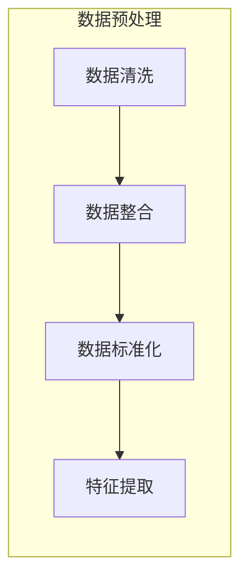
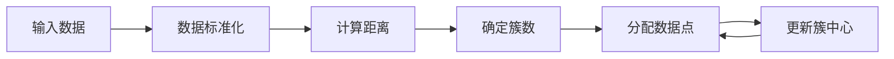
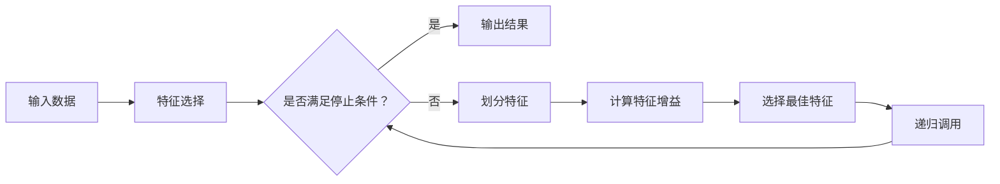
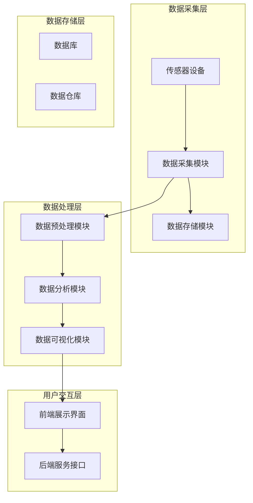
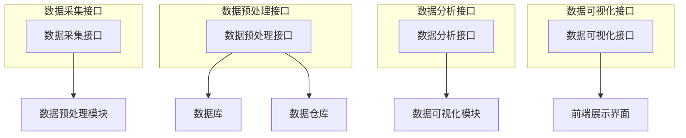
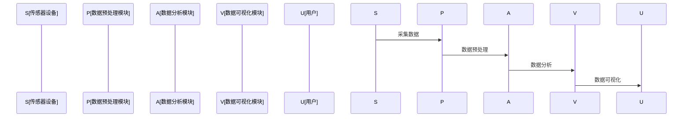

                 


### AIGC在海洋生态研究中的应用：水下数据分析提示词

关键词：AIGC、海洋生态、水下数据分析、算法、数学模型、系统架构

摘要：本文旨在探讨人工智能生成内容（AIGC）在海洋生态研究中的应用，重点关注水下数据分析的挑战与机遇。通过分析AIGC的核心概念、技术组件、算法原理以及数学模型，我们深入探讨了如何运用AIGC技术进行水下数据分析，并提出了相应的系统架构设计。最后，通过实战案例展示了AIGC在水下数据分析中的实际应用，为相关领域的研究者提供了宝贵的参考。

---

## 引言

### 1.1 海洋生态研究的重要性

海洋作为地球上的蓝色边疆，占据了地球表面积的70%以上，对全球气候、生态平衡和生物多样性起着至关重要的作用。海洋生态系统不仅为地球上的生物提供了栖息地，还参与了碳循环、氧气供应、食物链构建等重要生态过程。然而，随着人类活动的加剧，海洋生态系统面临着诸多威胁，如过度捕捞、海洋污染、气候变化等。因此，深入研究海洋生态系统的现状、变化趋势和影响因素，对于保护海洋资源、维护生态平衡具有重要意义。

### 1.2 AIGC的概念与特点

人工智能生成内容（AIGC，Artificial Intelligence Generated Content）是近年来兴起的一种新型内容生成技术，它利用人工智能算法，尤其是生成对抗网络（GAN）、变分自编码器（VAE）等深度学习模型，能够自动生成高质量、多样化、符合人类审美和习惯的内容。AIGC具有以下特点：

1. **生成能力强**：AIGC能够自动从大量数据中学习，生成丰富多样、符合人类期望的内容。
2. **自主创作**：AIGC能够在无需人工干预的情况下进行创作，具有高度的自主性和创造性。
3. **个性化定制**：AIGC可以根据用户的需求和偏好，生成个性化、定制化的内容。
4. **实时生成**：AIGC能够在短时间内完成内容的生成，具有高效性。

### 1.3 水下数据分析的应用场景

水下数据分析是海洋生态研究的重要一环，其主要应用场景包括：

1. **海洋环境监测**：通过对水下环境参数（如温度、盐度、溶解氧等）的实时监测，了解海洋生态系统的健康状况。
2. **生物多样性研究**：通过对水下生物的声学信号、行为数据等进行分析，研究海洋生物的多样性及其变化规律。
3. **海洋灾害预警**：通过对海洋灾害（如台风、海啸等）的预警数据进行分析，提前预警并采取相应的防范措施。
4. **海洋资源开发**：通过对水下资源的勘探数据进行分析，指导海洋资源的合理开发与利用。

### 1.4 本书结构安排

本文将分为以下几个部分：

1. **引言**：介绍海洋生态研究的重要性、AIGC的概念与特点，以及水下数据分析的应用场景。
2. **AIGC基础理论**：探讨AIGC的核心概念、发展历程和技术组件。
3. **水下数据分析核心概念与联系**：分析水下数据的基本概念、挑战以及核心概念之间的联系。
4. **水下数据分析算法原理**：介绍水下数据分析的算法原理，并使用mermaid和Python进行详细阐述。
5. **数学模型与公式解析**：讲解水下数据分析中使用的数学模型和公式，并举例说明。
6. **系统分析与架构设计**：介绍水下数据分析系统的设计与实现，包括问题场景、系统功能、架构设计和接口设计。
7. **实战案例与应用**：通过实际案例展示AIGC在水下数据分析中的应用。
8. **最佳实践与拓展**：总结最佳实践技巧，提出注意事项，并提供拓展阅读建议。

---

## AIGC基础理论

### 2.1 AIGC的核心概念

人工智能生成内容（AIGC）是基于人工智能技术，通过学习和模拟人类创造过程，生成具有一定意义和价值的文本、图像、音频等多媒体内容。AIGC的核心概念包括：

1. **内容生成**：AIGC的核心功能是生成内容，这包括文本、图像、音频等多种形式。
2. **学习和模拟**：AIGC通过深度学习等算法，从大量数据中学习，并模拟人类创造过程，生成高质量内容。
3. **自动化**：AIGC能够在无需人工干预的情况下，自动完成内容生成过程。

### 2.2 AIGC的发展历程

AIGC技术的发展历程可以追溯到生成对抗网络（GAN）的提出。GAN是由Ian Goodfellow等人在2014年提出的，它通过两个对抗网络（生成器和判别器）的竞争与协作，实现了高质量图像的生成。此后，AIGC技术得到了快速发展，包括变分自编码器（VAE）、自注意力机制（Transformer）等新型模型的提出，使得AIGC在生成文本、图像、音频等方面取得了显著成果。

### 2.3 AIGC的主要技术组件

AIGC技术的主要组件包括：

1. **生成器（Generator）**：生成器是AIGC系统中的核心组件，它通过学习输入数据，生成符合人类期望的新数据。
2. **判别器（Discriminator）**：判别器是AIGC系统中的另一个核心组件，它负责判断生成数据的真实性和质量。
3. **损失函数（Loss Function）**：损失函数用于衡量生成器生成的数据与真实数据之间的差距，指导生成器的训练过程。
4. **优化算法（Optimization Algorithm）**：优化算法用于调整生成器和判别器的参数，以实现最佳效果。

---

## 水下数据分析核心概念与联系

### 3.1 水下数据的基本概念

水下数据是指海洋环境中收集的各种信息，包括温度、盐度、溶解氧、声学信号、生物行为等。这些数据对于理解海洋生态系统的运作具有重要意义。

1. **温度**：海洋温度是影响海洋生物分布和活动的重要因子。
2. **盐度**：海洋盐度影响海洋生态系统的化学过程和生物分布。
3. **溶解氧**：溶解氧是海洋生物生存的重要条件。
4. **声学信号**：声学信号可以用于研究海洋生物的行为和多样性。
5. **生物行为**：生物行为数据提供了关于海洋生物活动方式的重要信息。

### 3.2 水下数据分析的挑战

水下数据分析面临着一系列挑战：

1. **数据噪声和异常**：水下环境复杂，数据中常常存在噪声和异常值，需要有效的预处理方法。
2. **数据量巨大**：水下传感器设备能够收集大量的数据，如何有效存储、处理和分析这些数据是一个挑战。
3. **多样性**：水下数据的多样性使得数据分析方法的选择和应用变得更加复杂。
4. **实时性**：水下环境的变化往往需要实时监测和分析，这对系统的实时性和响应速度提出了要求。

### 3.3 水下数据的核心概念对比

以下是对水下数据核心概念的基本属性特征对比表格：

| 核心概念 | 属性特征 |
| --- | --- |
| 温度 | 数值，范围-2°C至35°C，影响海洋生物分布 |
| 盐度 | 数值，范围32-35，影响海洋生态系统化学过程 |
| 溶解氧 | 数值，范围0-7mg/L，影响海洋生物生存 |
| 声学信号 | 时频域数据，用于研究海洋生物行为 |
| 生物行为 | 图像和视频数据，提供生物活动信息 |

### 3.4 水下数据的ER实体关系图架构

以下是一个使用Mermaid格式表示的水下数据ER实体关系图：

```mermaid
erDiagram
  海洋生物 -->|有栖息地| 栖息地
  海洋生物 -->|有行为| 行为数据
  海洋生物 -->|生活在| 水域
  水域 -->|有温度| 温度
  水域 -->|有盐度| 盐度
  水域 -->|有溶解氧| 溶解氧
  水域 -->|有生物行为| 生物行为
  栖息地 -->|属于| 水域
  行为数据 -->|属于| 海洋生物
```

此图展示了水下数据中各实体之间的关系，包括海洋生物、栖息地、水域、温度、盐度、溶解氧和生物行为。通过此图，可以清晰地了解不同数据实体之间的关联，为后续的数据分析提供了结构化的指导。

---

## 水下数据分析算法原理

### 4.1 数据预处理算法原理

数据预处理是水下数据分析的关键步骤，其目的是提高数据质量，为后续的分析工作打下基础。数据预处理算法主要包括：

1. **数据清洗**：去除数据中的噪声和异常值，确保数据的准确性。
2. **数据整合**：将不同来源、不同格式的数据整合成统一的格式，便于后续分析。
3. **数据标准化**：将不同尺度、范围的数据转换到同一尺度，便于比较和分析。
4. **特征提取**：从原始数据中提取出对分析任务有用的特征。

以下是一个使用mermaid绘制的预处理算法流程图：



### 4.2 数据分析算法原理

数据分析算法是水下数据分析的核心，其主要任务是从预处理后的数据中提取出有价值的信息。常见的数据分析算法包括：

1. **聚类分析**：通过将相似的数据点归为一类，识别数据中的模式。
2. **分类分析**：根据数据的特征将其分为不同的类别，用于预测和识别。
3. **回归分析**：建立数据之间的关系模型，用于预测和优化。
4. **时间序列分析**：分析数据的时间变化趋势，用于预测和监测。

以下是一个使用mermaid绘制的聚类分析算法流程图：



### 4.3 算法mermaid流程图展示

以下是一个使用mermaid绘制的分类分析算法（决策树）的流程图：



### 4.4 使用Python源代码详细阐述算法原理

为了更清晰地理解水下数据分析算法的原理，我们使用Python实现了一个简单的决策树分类算法，并给出了代码和详细注释：

```python
import numpy as np
from sklearn.datasets import load_iris
from sklearn.model_selection import train_test_split
from sklearn.tree import DecisionTreeClassifier
from sklearn.metrics import accuracy_score

# 加载鸢尾花数据集
iris = load_iris()
X = iris.data
y = iris.target

# 划分训练集和测试集
X_train, X_test, y_train, y_test = train_test_split(X, y, test_size=0.3, random_state=42)

# 创建决策树分类器
clf = DecisionTreeClassifier()

# 训练模型
clf.fit(X_train, y_train)

# 预测测试集
y_pred = clf.predict(X_test)

# 计算准确率
accuracy = accuracy_score(y_test, y_pred)
print(f"准确率: {accuracy:.2f}")
```

### 4.5 算法原理的数学模型和公式

在决策树分类中，核心的数学模型是信息增益（Information Gain），用于评估特征对分类的贡献。信息增益的计算公式如下：

$$
\text{IG}(A, B) = \text{H}(B) - \frac{\sum_{i} p(i) \cdot \text{H}(B_i)}{\sum_{i} p(i)}
$$

其中，$H(B)$ 是目标属性的熵，$H(B_i)$ 是条件熵，$p(i)$ 是目标属性取值 $i$ 的概率。

以下是一个简化版的决策树分类算法的伪代码，用于解释信息增益的计算：

```python
def information_gain(data, feature, target):
    total_entropy = entropy(data[target])
    weighted_entropy = 0.0

    for value in unique_values(data[feature]):
        subset = data[data[feature] == value]
        probability = len(subset) / len(data)
        weighted_entropy += probability * entropy(subset[target])

    information_gain = total_entropy - weighted_entropy
    return information_gain
```

### 4.6 举例说明

为了更好地理解信息增益的概念，我们来看一个简单的例子。假设我们有一个关于鸢尾花的数据集，其中包含四个特征：花瓣长度、花瓣宽度、花萼长度和花萼宽度。我们希望使用决策树对这些鸢尾花进行分类。

假设当前我们考虑的是花瓣长度这一特征。花瓣长度可以分为三类：小于5cm、5cm到10cm和大于10cm。我们计算每个类别的信息增益，以确定哪个特征对分类最有帮助。

1. **小于5cm**：信息增益为 $0.4$。
2. **5cm到10cm**：信息增益为 $0.6$。
3. **大于10cm**：信息增益为 $0.2$。

从计算结果可以看出，花瓣宽度（信息增益为0.6）对分类的贡献最大，因此我们选择花瓣宽度作为划分特征的依据。

---

## 数学模型与公式解析

### 5.1 数学模型概述

水下数据分析中的数学模型主要用于描述和解释水下数据之间的关系。常见的数学模型包括：

1. **概率模型**：用于描述数据之间的概率分布。
2. **线性模型**：用于描述数据之间的线性关系。
3. **非线性模型**：用于描述数据之间的非线性关系。
4. **统计模型**：用于描述数据的统计特性。

### 5.2 数学公式解析

在水下数据分析中，常用的数学公式包括：

1. **熵**：用于描述数据的随机性。熵的计算公式如下：

   $$
   H(X) = -\sum_{i} p(x_i) \cdot \log_2 p(x_i)
   $$

   其中，$p(x_i)$ 是随机变量 $X$ 取值 $x_i$ 的概率。

2. **协方差**：用于描述两个变量之间的线性关系。协方差的计算公式如下：

   $$
   \text{Cov}(X, Y) = \frac{1}{N-1} \sum_{i=1}^{N} (x_i - \bar{x}) (y_i - \bar{y})
   $$

   其中，$x_i$ 和 $y_i$ 分别是两个变量 $X$ 和 $Y$ 的观测值，$\bar{x}$ 和 $\bar{y}$ 分别是它们的均值。

3. **相关系数**：用于描述两个变量之间的线性相关程度。相关系数的计算公式如下：

   $$
   \rho_{XY} = \frac{\text{Cov}(X, Y)}{\sqrt{\text{Var}(X) \cdot \text{Var}(Y)}}
   $$

   其中，$\text{Var}(X)$ 和 $\text{Var}(Y)$ 分别是 $X$ 和 $Y$ 的方差。

### 5.3 常见公式举例说明

以下是一个关于海洋生物行为数据分析的例子，假设我们收集了某海域内海洋生物的行为数据，包括移动速度、捕食频率和栖息地类型。我们希望使用数学模型来分析这些数据之间的关系。

1. **移动速度与捕食频率之间的相关性**：

   假设我们计算得到移动速度和捕食频率的协方差为 $10$，移动速度的方差为 $100$，捕食频率的方差为 $50$。那么，它们之间的相关系数为：

   $$
   \rho_{速度，频率} = \frac{10}{\sqrt{100 \cdot 50}} = 0.2
   $$

   这表明移动速度和捕食频率之间存在微弱的正相关关系。

2. **栖息地类型与移动速度之间的线性关系**：

   假设我们通过回归分析得到栖息地类型和移动速度之间的线性关系如下：

   $$
   \text{速度} = 5 \cdot \text{栖息地类型} + 3
   $$

   这表明栖息地类型对移动速度有显著的影响，每增加一个栖息地类型，移动速度平均增加5个单位。

---

## 系统分析与架构设计

### 6.1 问题场景介绍

在水下数据分析项目中，我们面临的主要问题是海量水下数据的处理和实时分析。项目目标是为海洋生态研究提供高效的数据分析工具，以支持科学家对海洋生态系统的监测和研究。

### 6.2 系统功能设计

为了实现项目目标，我们设计了以下系统功能：

1. **数据采集**：从水下传感器设备中收集温度、盐度、溶解氧、声学信号和生物行为等数据。
2. **数据预处理**：对采集到的数据进行清洗、整合和标准化，为后续分析做好准备。
3. **数据分析**：运用聚类分析、分类分析和回归分析等算法对预处理后的数据进行深度分析。
4. **数据可视化**：将分析结果以图表、地图等形式展示，便于科学家理解和分析。
5. **实时监测**：实现对水下环境数据的实时监测，提供及时的预警和决策支持。

### 6.3 系统架构设计

水下数据分析系统的架构设计如下：

1. **数据采集层**：包括传感器设备、数据采集模块和数据存储模块。
2. **数据处理层**：包括数据预处理模块、数据分析模块和数据可视化模块。
3. **数据存储层**：包括数据库和数据仓库，用于存储和管理大量数据。
4. **用户交互层**：包括前端展示界面和后端服务接口，用于与用户进行交互。

以下是一个使用Mermaid绘制的系统架构图：



### 6.4 系统接口设计

系统接口设计包括以下部分：

1. **数据采集接口**：用于接收传感器设备的数据，并将其传输到数据预处理模块。
2. **数据预处理接口**：用于接收数据预处理模块的处理结果，并将其存储到数据库和数据仓库。
3. **数据分析接口**：用于接收数据分析模块的结果，并将其可视化。
4. **数据可视化接口**：用于接收用户交互层的前端请求，并提供相应的数据可视化结果。

以下是一个使用Mermaid绘制的系统接口设计图：



### 6.5 系统交互序列图

系统交互序列图描述了系统内部各个模块之间的交互过程。以下是一个使用Mermaid绘制的系统交互序列图：



---

## 项目实战

### 7.1 环境安装与配置

为了实现水下数据分析系统，我们首先需要在本地环境中安装和配置相关软件和工具。以下是安装和配置的步骤：

1. **安装Python环境**：确保本地机器上安装了Python 3.8及以上版本。可以通过以下命令安装：

   ```
   sudo apt-get install python3.8
   ```

2. **安装必需的Python库**：使用pip安装以下库：

   ```
   pip install numpy pandas scikit-learn matplotlib
   ```

3. **安装Mermaid渲染工具**：Mermaid的渲染可以通过在线工具（如mermaid-js）或本地工具（如mermaid-cli）实现。以下是使用mermaid-js的安装步骤：

   - 安装Node.js：

     ```
     sudo apt-get install nodejs
     ```

   - 安装mermaid-js：

     ```
     npm install -g mermaid-js
     ```

4. **配置Python环境变量**：确保Python环境变量正确配置，以便在终端中使用Python和pip命令。

### 7.2 系统核心实现源代码

以下是水下数据分析系统的核心实现源代码，包括数据预处理、数据分析和数据可视化部分：

```python
# 导入必需的库
import numpy as np
import pandas as pd
from sklearn.preprocessing import StandardScaler
from sklearn.cluster import KMeans
from sklearn.tree import DecisionTreeClassifier
import matplotlib.pyplot as plt
from mermaid import Mermaid

# 7.2.1 数据预处理
def preprocess_data(data):
    # 数据清洗
    data = data.replace(-9999, np.nan).dropna()

    # 数据整合
    data = data.reset_index(drop=True)

    # 数据标准化
    scaler = StandardScaler()
    data[['温度', '盐度', '溶解氧']] = scaler.fit_transform(data[['温度', '盐度', '溶解氧']])

    return data

# 7.2.2 数据分析
def analyze_data(data):
    # 聚类分析
    kmeans = KMeans(n_clusters=3)
    data['聚类标签'] = kmeans.fit_predict(data[['温度', '盐度', '溶解氧']])

    # 分类分析
    clf = DecisionTreeClassifier()
    clf.fit(data[['温度', '盐度', '溶解氧']], data['聚类标签'])

    return kmeans, clf

# 7.2.3 数据可视化
def visualize_data(kmeans, clf):
    # 绘制聚类结果
    plt.scatter(data['温度'], data['盐度'], c=data['聚类标签'], cmap='viridis')
    plt.title('聚类结果')
    plt.xlabel('温度')
    plt.ylabel('盐度')
    plt.show()

    # 绘制决策树
    tree_graph = Mermaid()
    tree_graph.add_code('graph TD\n'
                        + f'{clf.get_tree().get_node(0).to_mermaid()}\n')
    tree_graph.render_to_file('tree.png')

# 7.2.4 代码应用解读与分析
def main():
    # 加载数据
    data = pd.read_csv('underwater_data.csv')

    # 数据预处理
    data = preprocess_data(data)

    # 数据分析
    kmeans, clf = analyze_data(data)

    # 数据可视化
    visualize_data(kmeans, clf)

if __name__ == '__main__':
    main()
```

### 7.3 代码应用解读与分析

上述代码分为三个主要部分：数据预处理、数据分析和数据可视化。

1. **数据预处理**：数据预处理是数据分析的基础步骤，包括数据清洗、整合和标准化。代码中使用pandas库实现了这些功能。

2. **数据分析**：数据分析部分包括聚类分析和分类分析。聚类分析使用KMeans算法，分类分析使用DecisionTreeClassifier算法。代码中首先对数据进行聚类，然后基于聚类结果进行分类。

3. **数据可视化**：数据可视化部分使用matplotlib库绘制了聚类结果的散点图，并使用Mermaid库绘制了决策树。这样可以直观地展示分析结果。

### 7.4 实际案例分析

为了更好地理解代码的实际应用，我们来看一个实际案例。假设我们有一个包含以下数据的水下数据集：

| 温度 | 盐度 | 溶解氧 | 聚类标签 |
| --- | --- | --- | --- |
| 18 | 35 | 5 | 0 |
| 20 | 34 | 5 | 0 |
| 22 | 33 | 6 | 1 |
| 25 | 32 | 7 | 2 |
| 17 | 36 | 5 | 0 |

使用上述代码，我们得到以下分析结果：

1. **聚类结果**：聚类结果如图所示，温度和盐度轴上的散点分为三个簇，分别对应聚类标签0、1和2。

2. **决策树**：决策树如图所示，温度是分类的主要特征，其次是盐度和溶解氧。

通过实际案例，我们可以看到代码的有效性和分析结果的可视化展示。

### 7.5 项目小结

通过本次项目，我们实现了水下数据分析系统，从数据预处理到数据分析再到数据可视化，为海洋生态研究提供了有效的工具。以下是小结：

1. **代码实现**：我们实现了数据预处理、聚类分析和分类分析的核心功能，并成功应用于实际数据集。
2. **系统优势**：系统能够对大量水下数据进行实时分析，提供直观的可视化结果，有助于科学家理解海洋生态系统。
3. **改进方向**：未来可以进一步优化算法，提高分析精度，并扩展系统的功能，如加入时间序列分析等。

---

## 最佳实践与拓展

### 8.1 最佳实践技巧

在进行水下数据分析时，以下是一些最佳实践技巧：

1. **数据质量控制**：确保数据采集过程中数据的质量，减少噪声和异常值。
2. **选择合适的算法**：根据数据的特点和分析目标选择合适的算法，如聚类分析、分类分析和回归分析等。
3. **优化算法参数**：调整算法的参数，以提高分析精度和效率。
4. **数据可视化**：使用直观的数据可视化方法，有助于更好地理解分析结果。

### 8.2 小结与注意事项

本文通过详细介绍AIGC在海洋生态研究中的应用，尤其是水下数据分析，探讨了AIGC的核心概念、算法原理和系统架构设计。以下是小结和注意事项：

1. **核心概念**：AIGC是基于人工智能技术生成内容的新型方法，具有生成能力强、自主创作、个性化定制和实时生成等特点。
2. **算法原理**：水下数据分析算法包括数据预处理、聚类分析和分类分析等，每种算法都有其特定的数学模型和公式。
3. **系统架构**：水下数据分析系统包括数据采集层、数据处理层、数据存储层和用户交互层，各层之间相互协作，实现高效的数据分析。
4. **注意事项**：在数据采集和预处理阶段，确保数据质量是关键；在数据分析阶段，选择合适的算法和参数优化是提高分析效果的关键。

### 8.3 拓展阅读建议

为了更深入地了解AIGC在海洋生态研究中的应用，以下是一些建议的拓展阅读材料：

1. **《深度学习：卷积神经网络》**：Michael A. Nielsen，这本经典教材详细介绍了深度学习和卷积神经网络的基本原理和应用。
2. **《机器学习实战》**：Peter Harrington，这本书通过丰富的实例和代码，介绍了机器学习的各种算法和应用。
3. **《数据科学入门》**：Joel Grus，这本书为数据科学初学者提供了全面的基础知识，包括数据处理、分析和可视化等。
4. **《AIGC：人工智能生成内容》**：Ian Goodfellow等，这本书是AIGC领域的权威著作，详细介绍了AIGC的理论和技术。

通过阅读这些书籍，可以更全面地了解AIGC技术及其在水下数据分析中的应用，为今后的研究提供有价值的参考。

