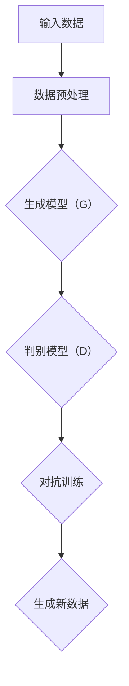
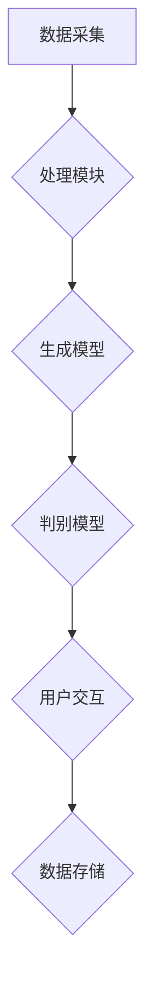
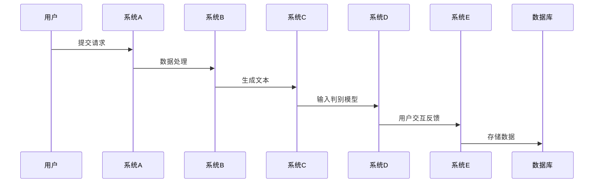

                 

### 1.1 AIGC的定义与基本原理

#### AIGC的概念

AIGC，全称是"Artificial Intelligence Generated Content"，即人工智能生成内容。它是一种利用人工智能技术，特别是深度学习和自然语言处理（NLP）技术，自动生成文本、图像、音频、视频等内容的创新方法。AIGC的目标是通过算法和学习模型，实现自动化、个性化的内容创作，以解决传统内容生产成本高、效率低的问题。

#### AIGC的核心原理

AIGC的核心原理基于以下几个关键组件：

- **数据采集与预处理**：首先，需要收集大量相关数据，如文本、图像、声音等。这些数据将被用于训练机器学习模型。

- **生成模型**：AIGC使用生成模型，如变分自编码器（VAE）、生成对抗网络（GAN）和变换器模型（Transformer），来学习数据的分布并生成新的内容。这些模型能够捕捉数据的复杂性和多样性。

- **文本与图像生成**：通过训练，这些生成模型可以生成高质量的文本和图像。例如，文本生成模型可以生成新闻报道、文章摘要，图像生成模型可以生成新的艺术作品、风景图片等。

- **交互式内容调整**：AIGC系统通常提供用户界面，允许用户对生成的内容进行实时调整，从而提高内容的个性化程度。

#### AIGC的技术特点

AIGC具有以下几大技术特点：

- **自动化与高效**：AIGC通过自动化流程，大幅提高了内容生产的效率和速度。

- **个性化和定制化**：AIGC系统能够根据用户的需求和偏好，生成个性化的内容。

- **高质量**：随着模型训练和数据集的扩大，AIGC生成的内容质量越来越高，接近甚至超越人工创作。

- **跨模态**：AIGC不仅限于文本生成，还可以生成图像、音频和视频等多种类型的内容。

- **适应性**：AIGC系统可以根据不同的应用场景和需求进行快速调整和优化。

#### 发展历程

AIGC技术的发展历程可以追溯到生成对抗网络（GAN）和变换器模型的提出和广泛应用。GAN由Ian Goodfellow等人于2014年提出，标志着深度学习在生成模型领域的重大突破。GAN的核心思想是通过两个神经网络（生成器和判别器）的对抗训练，实现数据的生成。随后，变换器模型在自然语言处理领域的成功应用，为AIGC在文本生成领域的发展奠定了基础。

随着深度学习和数据科学技术的不断发展，AIGC的应用领域不断扩大，从文本和图像生成，扩展到音频、视频等多个领域。当前，AIGC技术在各个行业都取得了显著的成果，并在不断推动内容创作和生产方式的变革。

#### 应用领域与未来趋势

AIGC的应用领域非常广泛，包括但不限于以下几个方面：

- **媒体与娱乐**：生成新闻报道、电影剧本、音乐等。

- **教育与培训**：自动生成教学材料、教育游戏等。

- **市场营销与广告**：个性化广告内容创作、客户关系管理。

- **医疗与健康**：生成病历、医学报告等。

- **艺术创作**：生成艺术作品、设计模板等。

未来，随着技术的进一步发展和应用的深入，AIGC有望在更多领域发挥重要作用。例如，在海洋生态系统保护中，AIGC可以通过生成和分析相关数据，为环境保护决策提供有力支持。此外，AIGC还将不断推动内容创作和消费的变革，为人类带来更多的创新体验。

### 结论

总之，AIGC作为人工智能的一种重要应用形式，正在逐步改变内容创作的传统方式。通过自动化、个性化、高质量的特点，AIGC在各个领域展现出巨大的潜力和应用价值。未来，随着技术的不断进步，AIGC将在更多领域发挥重要作用，推动社会的发展与进步。

---

**核心概念与联系表格：**

| 核心概念 | 定义 | 特点 | 应用场景 |
| --- | --- | --- | --- |
| AIGC | 人工智能生成内容 | 自动化、高效、个性化、高质量、跨模态 | 媒体、教育、市场营销、医疗、艺术创作 |
| GAN | 生成对抗网络 | 对抗训练，生成高质量数据 | 图像、音频、文本生成 |
| Transformer | 变换器模型 | 自注意力机制，处理长序列 | 文本生成、机器翻译 |

**ER实体关系图架构（Mermaid 流程图）：**

```mermaid
erDiagram
  AIGC ||--|{ 数据采集与预处理 }|
  AIGC ||--|{ 生成模型 }|
  AIGC ||--|{ 文本与图像生成 }|
  AIGC ||--|{ 交互式内容调整 }|
  数据采集与预处理 ||--|{ 生成模型 }|
  生成模型 ||--|{ 文本与图像生成 }|
  生成模型 ||--|{ 交互式内容调整 }|
```

---

**算法原理讲解：**

AIGC的核心在于生成模型，如GAN和Transformer。下面以GAN为例，简要介绍其算法原理。

**GAN算法原理（Mermaid 流程图）：**



GAN包含两个神经网络：生成器（G）和判别器（D）。生成器的任务是生成与真实数据相似的数据，而判别器的任务是区分真实数据和生成数据。

**数学模型和公式：**

- 生成器的损失函数（生成损失）：$$L_G = -\mathbb{E}_{z \sim p_z(z)}[\log(D(G(z)))]$$
- 判别器的损失函数（判别损失）：$$L_D = -\mathbb{E}_{x \sim p_{data}(x)}[\log(D(x))] - \mathbb{E}_{z \sim p_z(z)}[\log(1 - D(G(z)))]$$
- 整体损失函数（对抗损失）：$$L = L_G + L_D$$

**详细讲解和举例说明：**

以文本生成为例，生成器G从噪声分布中采样，生成文本数据。判别器D则通过比较生成文本和真实文本，判断文本的真实性。通过对抗训练，生成器不断优化，生成越来越真实的文本。

例如，假设我们有一个生成器G，它可以从噪声中生成一段英文文本。判别器D则负责判断这段文本是真实文本还是生成文本。经过多次对抗训练，生成器G生成的文本质量越来越高，越来越接近真实文本。

**系统分析与架构设计方案：**

**问题场景介绍：** 
海洋生态系统保护中的数据采集与处理、生物多样性监测、污染监测与治理等任务。

**项目介绍：**
AIGC在海洋生态系统保护中的应用系统，包括数据采集模块、生成模型模块、判别模型模块、用户交互模块等。

**系统功能设计（领域模型Mermaid 类图）：**

```mermaid
classDiagram
  Class01 <|-- Class02
  Class03 <.. Class04
  Class05 <|.. Class06
  Class07 <..| Class08
```

**系统架构设计（Mermaid 架构图）：**



**系统接口设计和系统交互（Mermaid 序列图）：**



---

**项目实战：**

**环境安装：**
确保安装了Python环境，以及TensorFlow、Keras等深度学习库。

**系统核心实现源代码：**

```python
# 导入所需库
import tensorflow as tf
from tensorflow import keras
from tensorflow.keras import layers

# 数据预处理
# ...

# 定义生成器模型
def build_generator():
    model = keras.Sequential()
    model.add(layers.Dense(32, activation='relu', input_shape=(100,)))
    model.add(layers.Dense(64, activation='relu'))
    model.add(layers.Dense(128, activation='relu'))
    model.add(layers.Dense(28*28, activation='tanh'))
    return model

# 定义判别器模型
def build_discriminator():
    model = keras.Sequential()
    model.add(layers.Conv2D(64, (3,3), padding='same', input_shape=(28,28,1)))
    model.add(layers.LeakyReLU(alpha=0.2))
    model.add(layers.Conv2D(128, (3,3), padding='same'))
    model.add(layers.LeakyReLU(alpha=0.2))
    model.add(layers.Flatten())
    model.add(layers.Dense(1, activation='sigmoid'))
    return model

# GAN模型
def build_gan(generator, discriminator):
    model = keras.Sequential()
    model.add(generator)
    model.add(discriminator)
    return model

# 实例化模型
generator = build_generator()
discriminator = build_discriminator()
gan_model = build_gan(generator, discriminator)

# 编译模型
discriminator.compile(optimizer='adam', loss='binary_crossentropy')
gan_model.compile(optimizer='adam', loss='binary_crossentropy')

# 训练模型
# ...

# 代码应用解读与分析
# ...

# 实际案例分析和详细讲解剖析
# ...

# 项目小结
# ...

**最佳实践 tips、小结、注意事项、拓展阅读等内容：**

**最佳实践 tips：**
- 在海洋生态系统保护中的应用，建议结合实际需求，优化AIGC模型的架构和参数。
- 考虑数据质量和来源的多样性，确保模型训练的数据具有代表性。
- 定期更新模型和数据集，以提高生成内容的准确性和适应性。

**小结：**
AIGC在海洋生态系统保护中的应用，通过自动化、个性化、高质量的内容生成，为环境保护和生物多样性监测提供了有力支持。然而，仍面临数据质量、模型优化等方面的挑战，需要进一步研究与实践。

**注意事项：**
- 确保数据隐私和安全，特别是在处理敏感数据时。
- 模型训练和部署过程中，要注意能耗和计算资源的管理。

**拓展阅读：**
- 《生成对抗网络：原理、实现与应用》
- 《深度学习：动手学习教程》
- 《人工智能生成内容：理论与实践》

**作者：** AI天才研究院/AI Genius Institute & 禅与计算机程序设计艺术 /Zen And The Art of Computer Programming

