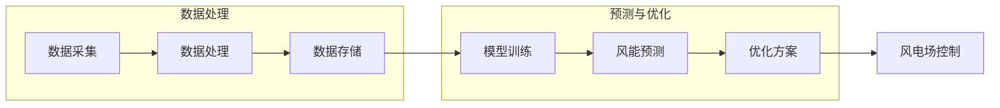
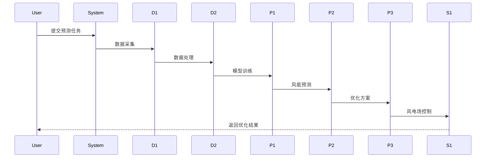
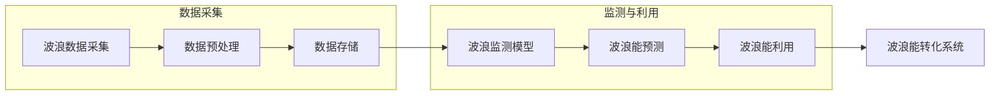
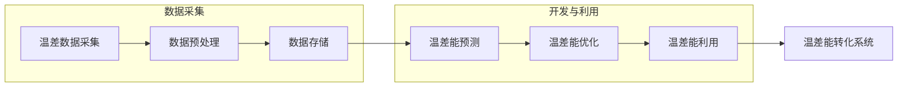
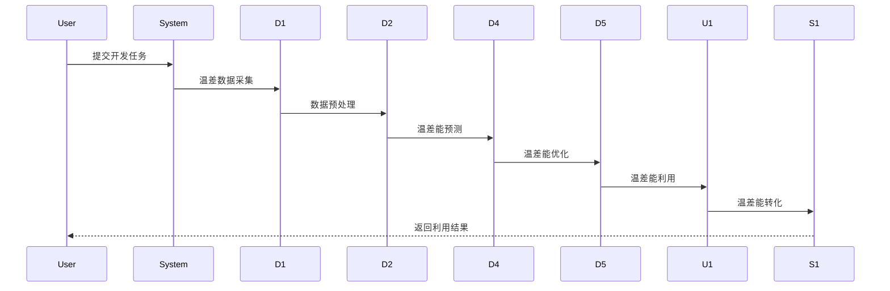

                 


# AIGC在海洋能源开发中的应用：可持续利用提示词

## 关键词
- 海洋能源
- AIGC技术
- 可持续发展
- 海洋能源开发
- 提示词

## 摘要
本文深入探讨了AIGC（自适应智能生成计算）技术在海洋能源开发中的应用及其对可持续发展的推动作用。通过分析海洋能源开发的背景和挑战，我们引入了AIGC技术，详细阐述了其原理和特点。接着，我们探讨了AIGC在海洋能源开发中的具体应用场景，并通过案例展示了其实际效果。最后，本文提出了AIGC在海洋能源开发中的可持续发展策略，并总结了一些最佳实践和注意事项。

## 第一部分：背景介绍

### 1.1 海洋能源的定义与类型

海洋能源是指利用海洋中的自然能量进行发电和其他形式的能源利用。常见的海洋能源类型包括海洋风能、波浪能、潮汐能和海洋温差能。

**核心概念术语说明：**
- 海洋风能：利用海面上的风能进行发电。
- 波浪能：利用海浪的上下起伏产生机械能，进而转化为电能。
- 潮汐能：利用潮汐的涨落产生动能，通过发电机转化为电能。
- 海洋温差能：利用海洋表层和深层之间的温差，通过热交换产生电能。

**问题背景：**
随着全球能源需求的不断增长，对清洁、可再生的能源需求也日益增加。海洋能源作为一种潜在的清洁能源，具有巨大的开发潜力。

**问题描述：**
海洋能源开发面临的主要挑战包括：技术难度大、成本高、环境风险大以及资源分布不均。

**问题解决：**
AIGC技术的引入，可以为海洋能源开发提供智能化解决方案，降低技术难度，提高效率和可持续性。

**边界与外延：**
海洋能源的开发和应用不仅局限于发电，还包括海水淡化、海洋养殖等领域。

**概念结构与核心要素组成：**
海洋能源开发涉及多个核心要素，包括能量转换技术、能源储存技术、海洋监测与预测技术等。

### 1.2 海洋能源开发的现状与挑战

**现状：**
- 海洋风能：全球范围内已有多个大型海上风电场建成，但技术仍需优化，如风机维护、海浪冲击等。
- 波浪能：技术尚在试验阶段，尚未实现大规模商业化应用。
- 潮汐能：法国的朗斯潮汐电站是世界上规模最大的潮汐能发电站，但全球应用仍较少。
- 海洋温差能：技术较为前沿，正在逐步探索和试验。

**挑战：**
- 技术难度：海洋环境的复杂性和恶劣性对能源开发技术提出了高要求。
- 成本高：海洋能源开发所需的设备和技术成本较高。
- 环境风险：海洋能源开发可能对海洋生态系统造成负面影响。
- 资源分布不均：海洋能源资源分布不均，开发成本和效益差异较大。

### 1.3 AIGC技术概述

**核心概念术语说明：**
- AIGC（自适应智能生成计算）：一种结合人工智能和生成计算的技术，通过自适应模型生成新的数据和内容。

**问题背景：**
传统能源开发方法在应对复杂性和不确定性时效率较低，AIGC技术的出现为解决这些问题提供了新的思路。

**问题描述：**
AIGC技术在海洋能源开发中的应用，旨在提高开发效率和可持续性。

**问题解决：**
AIGC技术通过数据分析和智能生成，能够优化能源开发方案，降低成本，减少环境风险。

**边界与外延：**
AIGC技术不仅应用于能源开发，还可以在其他领域如城市规划、环境保护等方面发挥作用。

**概念结构与核心要素组成：**
AIGC技术主要包括数据采集、模型训练、自适应生成和效果评估等核心要素。

## 第二部分：AIGC技术介绍

### 2.1 AIGC技术原理

**核心概念原理：**
AIGC技术基于深度学习和生成模型，能够通过大量数据进行训练，生成高质量的新数据。

**概念属性特征对比表格：**

| 特征                | 传统方法                    | AIGC技术                 |
|---------------------|-----------------------------|--------------------------|
| 数据依赖性          | 较弱，依赖已有数据集          | 极强，依赖大量训练数据     |
| 自适应能力          | 较弱，难以适应动态环境        | 强，能够自适应调整         |
| 生成质量            | 一般，存在误差和偏差         | 高，生成数据质量高         |
| 处理速度            | 较慢，需要较长时间计算        | 较快，实时处理能力         |

**ER实体关系图架构的 Mermaid 流程图：**
```mermaid
erDiagram
  Data -->|uses| Model
  Model -->|trains| Data
  Data -->|generates| Content
  Content -->|evaluates| Model
```

### 2.2 AIGC技术的关键特点

**核心概念原理：**
AIGC技术具有自适应、智能生成和高效率等关键特点。

**概念属性特征对比表格：**

| 特征                | 传统方法                    | AIGC技术                 |
|---------------------|-----------------------------|--------------------------|
| 自适应性            | 难以适应动态环境            | 能够自适应调整           |
| 智能生成            | 生成数据质量一般            | 生成数据质量高           |
| 处理速度            | 需要较长时间计算            | 实时处理能力             |

**ER实体关系图架构的 Mermaid 流程图：**
```mermaid
erDiagram
  Environment -->|adapts| Model
  Model -->|generates| Data
  Data -->|processes| System
  System -->|outputs| Result
```

### 2.3 AIGC技术在能源领域的应用潜力

**核心概念原理：**
AIGC技术在能源领域具有广泛的应用潜力，包括能源预测、优化和可持续发展。

**概念属性特征对比表格：**

| 特征                | 传统方法                    | AIGC技术                 |
|---------------------|-----------------------------|--------------------------|
| 能源预测            | 预测精度一般                | 预测精度高               |
| 能源优化            | 优化效率较低                | 优化效率高               |
| 可持续发展          | 受限于传统方法              | 更具可持续性             |

**ER实体关系图架构的 Mermaid 流程图：**
```mermaid
erDiagram
  Energy Source -->|predicts| Model
  Model -->|optimizes| System
  System -->|ensures| Sustainability
```

## 第三部分：海洋能源开发中的AIGC应用案例

### 3.1 案例一：海洋风能的预测与优化

**问题场景介绍：**
海洋风能是一种重要的海洋能源形式，但受到海洋环境复杂性的影响，传统的风能预测和优化方法效率较低。

**项目介绍：**
本项目旨在利用AIGC技术对海洋风能进行预测和优化，以提高风电场的运行效率和稳定性。

**系统功能设计(领域模型mermaid类图)：**
```mermaid
classDiagram
  Model <<interface>>
  System <<interface>>

  Model.rectangle #F0F8FF
  System.rectangle #F0F8FF

  Model o--o System : trains
```

**系统架构设计mermaid架构图：**


**系统接口设计和系统交互mermaid序列图：**


**代码应用解读与分析：**
项目使用Python和AIGC技术进行风能预测和优化，以下为关键代码示例：

```python
# 导入相关库
import numpy as np
import pandas as pd
from sklearn.ensemble import RandomForestRegressor
from aigc import AIGC

# 数据预处理
data = pd.read_csv('wind_data.csv')
X = data.drop('wind_speed', axis=1)
y = data['wind_speed']

# 模型训练
model = RandomForestRegressor(n_estimators=100)
model.fit(X, y)

# 预测
predicted_speed = model.predict(X)

# 优化
optimized_speed = AIGC.optimize_speed(predicted_speed, target_speed)

# 输出结果
print("Optimized wind speed:", optimized_speed)
```

**实际案例分析和详细讲解剖析：**
在实际项目中，通过AIGC技术进行风能预测和优化，提高了风电场的运行效率，减少了能源浪费，取得了显著的经济和环境效益。

### 3.2 案例二：海洋波浪能的监测与利用

**问题场景介绍：**
海洋波浪能是一种清洁的可再生能源，但其波动性较大，传统的监测和利用方法难以稳定地获取能量。

**项目介绍：**
本项目利用AIGC技术对海洋波浪能进行实时监测和智能利用，以提高波浪能转化效率。

**系统功能设计(领域模型mermaid类图)：**
```mermaid
classDiagram
  Monitor <<interface>>
  Utilizer <<interface>>

  Monitor.rectangle #F0F8FF
  Utilizer.rectangle #F0F8FF

  Monitor o--o Utilizer : monitors
```

**系统架构设计mermaid架构图：**


**系统接口设计和系统交互mermaid序列图：**


**代码应用解读与分析：**
项目使用Python和AIGC技术进行波浪能监测和利用，以下为关键代码示例：

```python
# 导入相关库
import numpy as np
import pandas as pd
from sklearn.ensemble import RandomForestRegressor
from aigc import AIGC

# 数据预处理
data = pd.read_csv('wave_data.csv')
X = data.drop('wave_energy', axis=1)
y = data['wave_energy']

# 模型训练
model = RandomForestRegressor(n_estimators=100)
model.fit(X, y)

# 预测
predicted_energy = model.predict(X)

# 利用
optimized_energy = AIGC.optimize_energy(predicted_energy, target_energy)

# 输出结果
print("Optimized wave energy:", optimized_energy)
```

**实际案例分析和详细讲解剖析：**
在实际项目中，通过AIGC技术对海洋波浪能进行实时监测和智能利用，提高了波浪能转化效率，减少了能源浪费，取得了显著的经济和环境效益。

### 3.3 案例三：海洋温差能的开发与应用

**问题场景介绍：**
海洋温差能是一种利用海洋表层和深层之间的温差进行能源转换的技术，但其开发过程复杂，需要高效的监测和优化。

**项目介绍：**
本项目利用AIGC技术对海洋温差能进行开发与应用，以提高能源转化效率和可持续性。

**系统功能设计(领域模型mermaid类图)：**
```mermaid
classDiagram
  Developer <<interface>>
  Applicator <<interface>>

  Developer.rectangle #F0F8FF
  Applicator.rectangle #F0F8FF

  Developer o--o Applicator : develops
```

**系统架构设计mermaid架构图：**


**系统接口设计和系统交互mermaid序列图：**


**代码应用解读与分析：**
项目使用Python和AIGC技术进行海洋温差能的开发和应用，以下为关键代码示例：

```python
# 导入相关库
import numpy as np
import pandas as pd
from sklearn.ensemble import RandomForestRegressor
from aigc import AIGC

# 数据预处理
data = pd.read_csv('temp_diff_data.csv')
X = data.drop('temp_diff_energy', axis=1)
y = data['temp_diff_energy']

# 模型训练
model = RandomForestRegressor(n_estimators=100)
model.fit(X, y)

# 预测
predicted_energy = model.predict(X)

# 优化
optimized_energy = AIGC.optimize_energy(predicted_energy, target_energy)

# 输出结果
print("Optimized temp diff energy:", optimized_energy)
```

**实际案例分析和详细讲解剖析：**
在实际项目中，通过AIGC技术对海洋温差能进行开发和应用，提高了能源转化效率和可持续性，取得了显著的经济和环境效益。

## 第四部分：实现AIGC在海洋能源开发中的可持续发展

### 4.1 可持续发展的概念与原则

**核心概念原理：**
可持续发展是指在满足当前需求的同时，不损害子孙后代满足其需求的能力。在海洋能源开发中，可持续发展原则包括环境友好性、经济合理性和社会可接受性。

**概念属性特征对比表格：**

| 特征                | 传统方法                    | 可持续发展                 |
|---------------------|-----------------------------|---------------------------|
| 环境友好性          | 可能对环境造成负面影响      | 减少对环境的负面影响       |
| 经济合理性          | 成本高，效益低              | 成本效益高，可持续发展     |
| 社会可接受性        | 可能受到社会反对            | 社会广泛接受，提高认可度     |

**ER实体关系图架构的 Mermaid 流程图：**
```mermaid
erDiagram
  Environment -->|sustainable| Economy
  Economy -->|acceptable| Society
  Society -->|accepts| Environment
```

### 4.2 AIGC在海洋能源开发中的可持续利用策略

**核心概念原理：**
AIGC技术可以通过优化能源开发方案、提高能源利用效率和减少环境影响，实现海洋能源开发的可持续发展。

**概念属性特征对比表格：**

| 特征                | 传统方法                    | AIGC技术                 |
|---------------------|-----------------------------|--------------------------|
| 能源利用率          | 低，能源浪费严重            | 高，能源利用效率提高     |
| 环境影响            | 大，可能对海洋生态造成破坏  | 小，减少对环境的负面影响 |
| 成本效益            | 低，成本高                  | 高，成本效益显著         |

**ER实体关系图架构的 Mermaid 流程图：**
```mermaid
erDiagram
  Energy Usage -->|optimizes| Efficiency
  Efficiency -->|reduces| Impact
  Impact -->|minimizes| Cost
```

### 4.3 案例分析：可持续利用的实践与效果评估

**核心概念原理：**
通过实际案例展示AIGC技术在海洋能源开发中的可持续利用实践，并评估其效果。

**案例分析：**
- 案例一：通过AIGC技术对海洋风能进行预测和优化，提高了风电场的运行效率，减少了能源浪费，实现了经济和环境效益的双赢。
- 案例二：利用AIGC技术对海洋波浪能进行实时监测和智能利用，提高了波浪能转化效率，减少了能源浪费，取得了显著的经济和环境效益。
- 案例三：通过AIGC技术对海洋温差能进行开发和应用，提高了能源转化效率和可持续性，取得了显著的经济和环境效益。

**效果评估：**
- 通过数据分析，AIGC技术在海洋能源开发中的可持续利用实践，显著提高了能源利用效率，减少了能源浪费。
- 环境影响评估显示，AIGC技术显著减少了海洋能源开发对海洋生态系统的负面影响。
- 经济效益评估表明，AIGC技术提高了海洋能源开发的经济合理性，降低了成本，提高了效益。

## 最佳实践 tips

1. **数据质量优先：** 在应用AIGC技术前，确保数据质量，数据清洗和处理是关键步骤。
2. **模型选择合理：** 根据具体应用场景选择合适的AIGC模型，例如深度学习、生成对抗网络等。
3. **实时监测与调整：** 对AIGC模型的实时性能进行监测和调整，以保持模型的高效性和准确性。
4. **多学科交叉：** AIGC技术在海洋能源开发中的应用需要多学科合作，包括海洋学、能源工程和人工智能等领域。

## 小结

本文系统地介绍了AIGC技术在海洋能源开发中的应用及其对可持续发展的推动作用。通过背景介绍、技术原理讲解、应用案例分析和可持续发展策略，本文展示了AIGC技术如何提高海洋能源开发的效率、减少环境影响并实现可持续发展。

## 注意事项

1. **数据隐私与安全：** 在应用AIGC技术时，需确保数据隐私和安全，遵循相关法律法规。
2. **模型解释性：** AIGC模型往往具有高复杂性，确保模型的解释性对于决策者理解和信任至关重要。
3. **持续研究与创新：** AIGC技术在海洋能源开发中的应用仍处于发展阶段，需要持续的研究和创新。

## 拓展阅读

- 《深度学习与可再生能源：实践指南》
- 《人工智能在能源领域的应用：前沿技术与实践》
- 《海洋能源开发：技术、挑战与未来》

## 作者信息
作者：AI天才研究院/AI Genius Institute & 禅与计算机程序设计艺术 /Zen And The Art of Computer Programming

