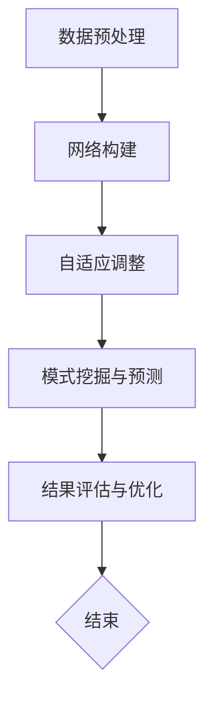
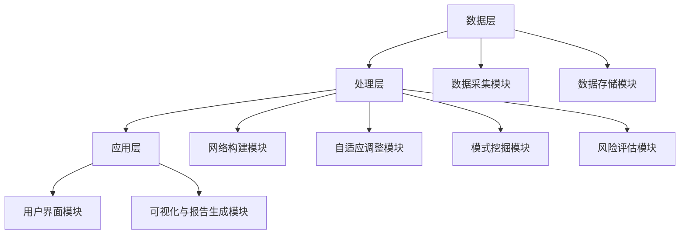
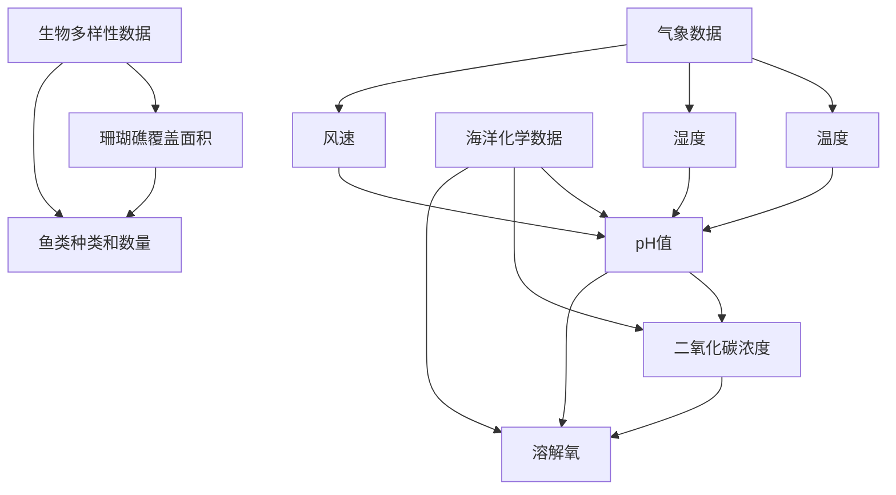
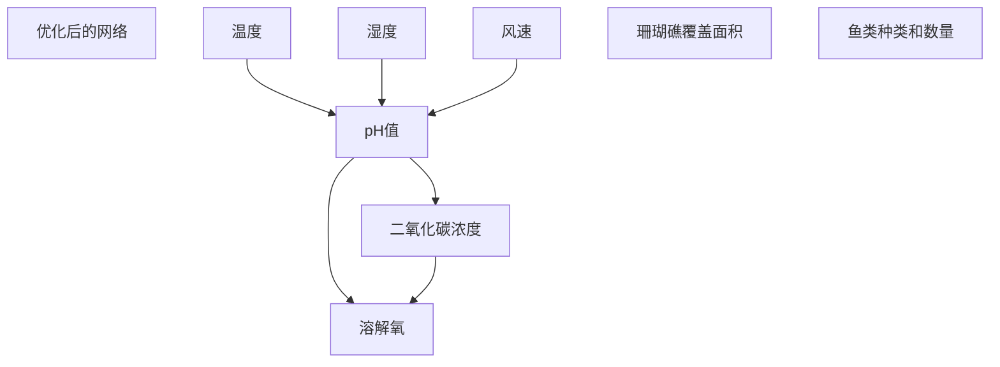
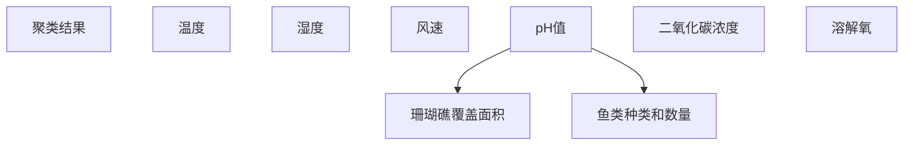
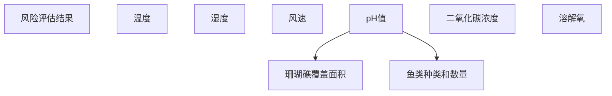

                 

## AIGC在海洋酸化研究中的应用：生态系统脆弱性评估提示词

### 关键词

- 海洋酸化
- 生态系统脆弱性
- AIGC（自适应智能图计算）
- 算法应用
- 系统分析与架构设计
- 实际案例分析

### 摘要

本文深入探讨了AIGC（自适应智能图计算）在海洋酸化研究中的应用，特别是针对生态系统脆弱性评估。通过分析海洋酸化的背景和影响，以及生态系统脆弱性评估的重要性，本文详细介绍了AIGC的核心概念和特点。接着，我们探讨了AIGC在评估海洋酸化与生态系统脆弱性中的具体应用，并一步步讲解了AIGC算法原理，包括其数学模型和流程。随后，我们详细描述了系统的功能设计、架构设计和接口设计，并通过实际案例展示了AIGC在海洋酸化研究中的实际应用。最后，本文总结了最佳实践、注意事项和拓展阅读，为读者提供了进一步学习和应用AIGC技术的指导。

## 第一部分：背景介绍

### 第1章：问题背景

#### 1.1 海洋酸化的概念与影响

海洋酸化是指由于大气中二氧化碳（CO₂）溶解在海水中，导致海水pH值下降的现象。这一过程不仅改变了海洋的化学性质，还对海洋生态系统产生了深远的影响。具体来说，海洋酸化的定义是海水pH值的下降，这通常是由于CO₂浓度增加引起的。CO₂通过海洋表面的溶解进入水体，形成碳酸（H₂CO₃），进一步分解成氢离子（H⁺）和碳酸氢根离子（HCO₃⁻）。当海水pH值降低到7.8以下时，就达到了海洋酸化的状态。

海洋酸化的成因主要有以下几个方面：

1. **大气CO₂浓度增加**：随着工业化和人类活动的加剧，大气中的CO₂浓度显著增加，大量的CO₂通过海洋表面进入水体。
2. **海洋吸收CO₂**：海洋是地球上最大的碳库之一，具有巨大的碳吸收能力。当大气中的CO₂浓度增加时，海洋吸收的CO₂也随之增加。
3. **海洋水温升高**：全球变暖导致海洋温度升高，这会加速CO₂的溶解过程，进一步加剧海洋酸化。

海洋酸化对海洋生态系统的影响是多方面的：

1. **珊瑚礁退化**：珊瑚礁是海洋生态系统的重要组成部分，但它们对酸化的敏感度很高。酸化会破坏珊瑚礁的结构和多样性，导致珊瑚白化现象。
2. **影响渔业资源**：酸化会改变海洋生物的生理和行为，影响渔业资源的产量和质量。例如，酸化会影响鱼类的生长、繁殖和觅食行为。
3. **影响海洋生物的钙化过程**：海洋生物如贝类和珊瑚通过钙化过程构建其外壳和骨骼。酸化会降低海水中的碳酸钙饱和度，从而影响这些生物的钙化过程。
4. **影响海洋生物多样性**：酸化不仅影响单个物种，还可能改变整个生态系统的结构。一些物种可能无法适应酸化环境，导致生物多样性下降。

#### 1.2 生态系统脆弱性评估的重要性

生态系统脆弱性评估是指评估生态系统对各种自然和人为压力的敏感性和适应能力。其目的是识别生态系统的弱点，以便采取适当的措施进行保护和管理。具体来说，生态系统脆弱性评估具有以下几个方面的作用：

1. **评估生态风险**：通过评估生态系统的脆弱性，可以识别哪些区域和生态系统更容易受到海洋酸化等环境压力的影响，从而制定相应的风险管理策略。
2. **制定保护措施**：了解生态系统的脆弱性有助于制定有效的保护措施，例如建立海洋保护区、限制污染和捕捞等措施，以减轻环境压力。
3. **监测和预警**：生态系统脆弱性评估可以为环境监测提供指标，帮助及时发现生态系统的变化，进行预警，并采取相应的措施。
4. **支持政策制定**：生态系统脆弱性评估提供了科学依据，支持政府和非政府组织制定相关政策，促进可持续发展。

#### 1.3 生态系统脆弱性评估的定义

生态系统脆弱性评估（Ecosystem Vulnerability Assessment，EVA）是一种系统方法，用于评估生态系统对各种压力源（如气候变化、污染、人类活动等）的敏感性和适应性。EVA旨在识别生态系统的潜在弱点，以及这些弱点可能导致的环境问题。具体来说，EVA包括以下几个关键组成部分：

1. **识别压力源**：识别可能对生态系统造成影响的压力源，如气候变化、污染、过度捕捞等。
2. **评估敏感性**：评估生态系统对特定压力源的敏感程度，即生态系统对压力的反应速度和程度。
3. **评估适应性**：评估生态系统在压力下恢复和适应的能力。适应性包括生态系统的生物多样性、生态过程、物种分布等。
4. **评估脆弱性**：综合评估生态系统的敏感性、适应性和潜在风险，确定生态系统的整体脆弱性水平。
5. **制定应对策略**：基于评估结果，制定针对性的保护和管理策略，以减轻压力、提高生态系统适应性。

#### 1.4 生态系统脆弱性评估的目的

生态系统脆弱性评估的主要目的是提供科学依据，帮助决策者和利益相关者制定有效的保护和管理策略。具体来说，EVA的目的包括：

1. **识别脆弱区域**：通过评估确定哪些区域和生态系统更容易受到环境压力的影响，从而优先考虑保护和管理。
2. **评估生态风险**：评估生态系统对环境压力的敏感性和适应性，识别潜在的风险和问题。
3. **制定保护措施**：基于评估结果，制定针对性的保护措施，如建立保护区、限制污染和捕捞等。
4. **监测和预警**：通过建立监测指标和预警系统，及时发现生态系统的变化，提前采取应对措施。
5. **支持政策制定**：提供科学依据，支持政府和非政府组织制定相关政策，促进生态系统的可持续管理和保护。

#### 1.5 生态系统脆弱性评估的方法

生态系统脆弱性评估采用多种方法和技术，以全面评估生态系统的脆弱性。以下是一些常用的评估方法：

1. **专家评估法**：通过邀请专家对生态系统的脆弱性进行评估，结合专家的经验和知识，对生态系统进行定性和定量的分析。
2. **指标体系法**：建立一套包含敏感性、适应性和风险等指标的体系，通过收集和分析相关数据，评估生态系统的脆弱性。
3. **地理信息系统（GIS）法**：利用GIS技术，结合空间数据和地理分析，对生态系统的脆弱性进行评估。
4. **综合评估法**：结合多种评估方法，综合考虑生态系统的多种压力源、敏感性和适应性，进行全面的脆弱性评估。

### 第2章：核心概念与联系

#### 2.1 AIGC的概念与特点

AIGC（自适应智能图计算）是一种基于图论和机器学习技术的计算框架，旨在处理大规模复杂网络数据。其核心概念是利用智能算法对网络结构进行自适应调整，以优化数据分析和处理过程。AIGC的特点包括：

1. **自适应调整**：AIGC可以根据网络结构和数据特征，动态调整计算策略，提高计算效率和准确性。
2. **多尺度分析**：AIGC能够在不同尺度上对网络进行详细分析，从宏观到微观层次捕捉数据特征。
3. **智能挖掘**：AIGC利用机器学习和人工智能技术，从网络数据中提取有价值的信息和模式。
4. **高效处理**：AIGC利用并行计算和分布式计算技术，能够处理大规模、高维度的网络数据。

#### 2.2 海洋酸化与生态系统脆弱性的联系

海洋酸化对生态系统脆弱性的影响是多方面的，可以从以下几个方面进行理解：

1. **生物多样性降低**：海洋酸化会影响海洋生物的生理和行为，导致生物多样性降低。一些物种可能无法适应酸化环境，从而影响生态系统的稳定性。
2. **生态系统功能退化**：海洋酸化会影响海洋生态系统的功能，如碳循环、营养盐循环等。生态系统的功能退化可能导致海洋生态系统的生产力下降，影响渔业资源。
3. **珊瑚礁退化**：珊瑚礁是海洋生态系统的重要组成部分，但它们对酸化的敏感度很高。海洋酸化会破坏珊瑚礁的结构和多样性，导致珊瑚白化现象。
4. **影响物种分布**：海洋酸化会影响物种的分布和适应性，一些物种可能无法适应酸化环境，从而影响整个生态系统的结构和功能。

#### 2.3 生态系统脆弱性对海洋酸化的反馈

生态系统脆弱性对海洋酸化的反馈表现在以下几个方面：

1. **生态适应性变化**：生态系统脆弱性评估有助于了解生态系统的适应能力，从而制定适应策略，减轻海洋酸化的影响。
2. **生态系统恢复能力**：生态系统脆弱性评估可以帮助识别生态系统的弱点，加强生态系统的恢复能力，减轻海洋酸化的负面影响。
3. **生态补偿措施**：通过评估生态系统的脆弱性，可以制定相应的补偿措施，如建立海洋保护区、限制污染等，从而保护生态系统的完整性。
4. **生态管理策略**：生态系统脆弱性评估为生态管理提供了科学依据，有助于制定有效的生态管理策略，减少海洋酸化对生态系统的影响。

#### 2.4 AIGC在评估海洋酸化与生态系统脆弱性中的应用

AIGC在评估海洋酸化与生态系统脆弱性中的应用主要体现在以下几个方面：

1. **数据整合与处理**：AIGC能够整合来自不同来源的海量数据，包括气象数据、海洋化学数据、生物多样性数据等，为生态系统脆弱性评估提供全面的数据支持。
2. **智能模式挖掘**：AIGC利用机器学习和人工智能技术，从复杂网络数据中提取有价值的信息和模式，帮助识别海洋酸化与生态系统脆弱性之间的关联。
3. **风险评估与预测**：AIGC能够根据海洋酸化数据和生态系统脆弱性评估结果，进行风险评估和预测，为决策者提供科学依据。
4. **适应策略制定**：AIGC可以根据生态系统脆弱性评估结果，提出针对性的适应策略，帮助生态系统更好地应对海洋酸化的挑战。

### 第二部分：算法原理讲解

#### 第3章：AIGC算法原理

#### 3.1 AIGC算法的基本原理

AIGC（自适应智能图计算）算法的基本原理可以概括为以下几个关键步骤：

1. **数据采集与整合**：首先，从多个数据源（如气象站、海洋观测站、卫星遥感等）采集相关的数据，并进行整合，以构建全面的数据集。
2. **网络构建**：基于采集到的数据，构建一个表示海洋酸化与生态系统脆弱性关系的图。图中的节点代表数据点或特征，边表示节点之间的关系。
3. **自适应调整**：通过自适应算法，动态调整图的连接方式和结构，以优化数据分析和处理过程。自适应调整包括网络剪枝、节点合并、边权重调整等。
4. **模式挖掘与预测**：利用机器学习和人工智能技术，从调整后的网络中挖掘有价值的信息和模式，进行海洋酸化与生态系统脆弱性的关联分析和预测。

#### 3.2 AIGC算法的基本流程

AIGC算法的基本流程可以分为以下几个步骤：

1. **数据预处理**：对采集到的数据进行清洗、去噪和归一化处理，以消除数据中的噪声和异常值。
2. **网络构建**：基于预处理后的数据，构建一个表示海洋酸化与生态系统脆弱性关系的图。图中的节点代表数据点或特征，边表示节点之间的关系。
3. **自适应调整**：通过自适应算法，对网络进行剪枝、节点合并和边权重调整等操作，以优化网络结构。
4. **模式挖掘与预测**：利用机器学习和人工智能技术，从调整后的网络中挖掘有价值的信息和模式，进行海洋酸化与生态系统脆弱性的关联分析和预测。
5. **结果评估与优化**：对预测结果进行评估和验证，根据评估结果对算法进行调整和优化，以提高预测准确性和可靠性。

#### 3.3 AIGC算法的数学模型与公式

AIGC算法的数学模型主要包括以下几个方面：

1. **网络构建**：设G = (V, E)为表示海洋酸化与生态系统脆弱性关系的图，其中V为节点集合，E为边集合。节点V中的数据点或特征可以用一个多维向量表示，边E中的关系可以用一个权重矩阵W表示。
2. **自适应调整**：自适应调整包括网络剪枝、节点合并和边权重调整等操作。设T为自适应调整后的图，T'为原始图。自适应调整的目标是最小化预测误差，最大化网络结构优化度。
3. **模式挖掘与预测**：设L为损失函数，用于衡量预测结果与实际值之间的差距。常用的损失函数包括均方误差（MSE）、交叉熵（Cross-Entropy）等。设θ为模型参数，优化目标是最小化L(θ)。

主要公式如下：

- **网络构建公式**：
  - 边权重矩阵W = [w(i, j)]，其中w(i, j)表示节点i和节点j之间的权重。
  - 节点特征向量x(i) = [x(i, 1), x(i, 2), ..., x(i, n)]，其中x(i, j)表示节点i的第j个特征值。

- **自适应调整公式**：
  - 网络剪枝：剪去权重较小的边，保留权重较大的边。
  - 节点合并：将具有相似特征的节点合并为一个节点，减少冗余信息。
  - 边权重调整：根据节点的重要性和特征相似度，调整边的权重。

- **模式挖掘与预测公式**：
  - 损失函数：L(θ) = Σ(i=1 to n) [y(i) - f(x(i), θ)]²，其中y(i)为实际值，f(x(i), θ)为预测值。
  - 参数优化：使用梯度下降法、随机梯度下降法等优化算法，最小化L(θ)。

#### 3.4 AIGC算法的Mermaid流程图

下面是一个简化的AIGC算法Mermaid流程图，展示了算法的基本流程：



### 第4章：AIGC算法的应用

#### 4.1 AIGC算法在海洋酸化研究中的应用

AIGC算法在海洋酸化研究中具有广泛的应用，主要体现在以下几个方面：

1. **海洋酸化监测**：通过AIGC算法，可以对海洋酸化进行实时监测和预测。利用AIGC算法，可以从大量的海洋观测数据中提取有价值的信息，识别酸化趋势和异常情况，为环境监测提供科学依据。

2. **海洋酸化预测**：AIGC算法可以利用历史数据和学习到的模式，对未来的海洋酸化情况进行预测。通过预测，可以提前了解海洋酸化可能带来的影响，为生态保护和应对措施提供指导。

3. **海洋酸化风险评估**：AIGC算法可以帮助评估海洋酸化对生态系统的影响，识别高风险区域和关键物种。通过风险评估，可以制定针对性的保护和管理策略，减少海洋酸化对生态系统的影响。

#### 4.2 AIGC算法在海洋酸化监测中的应用

AIGC算法在海洋酸化监测中的应用主要包括以下几个方面：

1. **实时数据采集与处理**：利用AIGC算法，可以从海洋观测站、卫星遥感等渠道获取实时海洋数据。通过对这些数据进行预处理和整合，可以构建一个全面、准确的海洋数据集。

2. **趋势分析与异常检测**：通过AIGC算法，可以分析海洋数据的变化趋势，识别酸化过程的特征和规律。同时，AIGC算法还可以检测异常值和异常情况，为环境监测提供实时预警。

3. **可视化与报告生成**：AIGC算法可以将监测结果进行可视化展示，生成报告和图表，帮助用户更好地理解海洋酸化的现状和趋势。

#### 4.3 AIGC算法在海洋酸化预测中的应用

AIGC算法在海洋酸化预测中的应用主要包括以下几个方面：

1. **历史数据学习**：通过学习历史海洋数据，AIGC算法可以建立预测模型，捕捉酸化过程的特征和规律。历史数据包括温度、pH值、CO₂浓度等，通过这些数据，AIGC算法可以预测未来的海洋酸化趋势。

2. **模型优化与调整**：根据新的数据和反馈，AIGC算法可以不断优化和调整预测模型，提高预测的准确性和可靠性。通过自适应调整，AIGC算法可以适应不同的环境和数据特征，提高预测效果。

3. **预测结果验证与更新**：通过对预测结果进行验证和更新，AIGC算法可以不断提高预测模型的准确性。通过对比预测结果与实际观测数据，可以发现模型中的不足之处，并进行调整和改进。

#### 4.4 AIGC算法在海洋酸化风险评估中的应用

AIGC算法在海洋酸化风险评估中的应用主要包括以下几个方面：

1. **生态风险识别**：通过AIGC算法，可以识别海洋酸化对生态系统的影响，识别高风险区域和关键物种。通过对海洋数据和学习到的模式进行分析，可以确定哪些地区和生态系统更容易受到酸化的影响。

2. **风险评估模型构建**：基于AIGC算法，可以构建海洋酸化风险评估模型。该模型可以根据生态系统的敏感性和适应性，评估酸化对生态系统的潜在影响，为决策者提供科学依据。

3. **风险管理策略制定**：通过风险评估结果，可以制定针对性的风险管理策略。例如，可以建立海洋保护区，限制污染和捕捞等措施，减轻海洋酸化对生态系统的影响。

4. **适应性管理**：基于AIGC算法，可以评估生态系统的适应能力，制定适应性管理策略。例如，可以通过生态恢复和物种移植等措施，提高生态系统的适应能力，减轻酸化的负面影响。

### 第三部分：系统分析与架构设计

#### 第5章：系统功能设计

#### 5.1 系统功能介绍

海洋酸化研究与生态系统脆弱性评估系统的主要功能包括：

1. **数据采集与整合**：从多个数据源（如气象站、海洋观测站、卫星遥感等）采集相关的数据，并进行整合，以构建全面的数据集。
2. **网络构建**：基于整合后的数据，构建一个表示海洋酸化与生态系统脆弱性关系的图。图中的节点代表数据点或特征，边表示节点之间的关系。
3. **自适应调整**：利用AIGC算法，对网络进行剪枝、节点合并和边权重调整等操作，以优化网络结构。
4. **模式挖掘与预测**：从调整后的网络中挖掘有价值的信息和模式，进行海洋酸化与生态系统脆弱性的关联分析和预测。
5. **风险评估与预警**：基于预测结果，评估海洋酸化对生态系统的影响，识别高风险区域和关键物种，并进行预警。
6. **可视化与报告生成**：将监测、预测和风险评估结果进行可视化展示，生成报告和图表，帮助用户更好地理解海洋酸化的现状和趋势。

#### 5.2 系统功能模块划分

海洋酸化研究与生态系统脆弱性评估系统可以分为以下几个功能模块：

1. **数据采集模块**：负责从不同的数据源（如气象站、海洋观测站、卫星遥感等）采集相关的数据，并进行预处理和整合。
2. **网络构建模块**：基于预处理后的数据，构建表示海洋酸化与生态系统脆弱性关系的图，并进行初步分析。
3. **自适应调整模块**：利用AIGC算法，对网络进行剪枝、节点合并和边权重调整等操作，以优化网络结构。
4. **模式挖掘模块**：从优化后的网络中挖掘有价值的信息和模式，进行关联分析和预测。
5. **风险评估模块**：基于预测结果，评估海洋酸化对生态系统的影响，识别高风险区域和关键物种。
6. **可视化与报告生成模块**：将监测、预测和风险评估结果进行可视化展示，生成报告和图表。
7. **用户界面模块**：提供友好的用户界面，使用户可以方便地操作和使用系统功能。

#### 5.3 系统功能设计

海洋酸化研究与生态系统脆弱性评估系统的功能设计如下：

1. **数据采集与整合**：
   - 从气象站、海洋观测站、卫星遥感等渠道采集实时数据。
   - 对采集到的数据进行预处理，包括数据清洗、去噪和归一化处理。
   - 将预处理后的数据进行整合，构建一个全面的数据集。

2. **网络构建**：
   - 基于整合后的数据，构建一个表示海洋酸化与生态系统脆弱性关系的图。
   - 确定节点和边的表示方法，为后续的网络分析和预测提供基础。

3. **自适应调整**：
   - 利用AIGC算法，对网络进行剪枝、节点合并和边权重调整等操作。
   - 通过自适应调整，优化网络结构，提高数据分析和处理效率。

4. **模式挖掘与预测**：
   - 从优化后的网络中挖掘有价值的信息和模式。
   - 利用机器学习和人工智能技术，进行关联分析和预测。

5. **风险评估与预警**：
   - 基于预测结果，评估海洋酸化对生态系统的影响。
   - 识别高风险区域和关键物种，并进行预警。

6. **可视化与报告生成**：
   - 将监测、预测和风险评估结果进行可视化展示。
   - 生成报告和图表，方便用户理解海洋酸化的现状和趋势。

#### 第6章：系统架构设计

#### 6.1 系统架构概述

海洋酸化研究与生态系统脆弱性评估系统的整体架构设计如下：

1. **数据层**：包括数据采集模块和数据存储模块。数据采集模块负责从不同渠道采集数据，数据存储模块负责存储和管理数据。

2. **处理层**：包括网络构建模块、自适应调整模块、模式挖掘模块和风险评估模块。这些模块负责对数据进行分析和处理，以实现对海洋酸化与生态系统脆弱性关系的深入理解。

3. **应用层**：包括用户界面模块和可视化与报告生成模块。用户界面模块提供友好的用户交互界面，用户可以通过该界面进行操作和使用系统功能。可视化与报告生成模块负责将分析结果进行可视化展示，并提供报告生成功能。

#### 6.2 系统架构模块划分

系统架构可以分为以下几个模块：

1. **数据层模块**：
   - 数据采集模块：负责从气象站、海洋观测站、卫星遥感等渠道采集数据。
   - 数据存储模块：负责存储和管理采集到的数据，包括实时数据和历史数据。

2. **处理层模块**：
   - 网络构建模块：基于采集到的数据，构建表示海洋酸化与生态系统脆弱性关系的图。
   - 自适应调整模块：利用AIGC算法，对网络进行剪枝、节点合并和边权重调整等操作。
   - 模式挖掘模块：从优化后的网络中挖掘有价值的信息和模式。
   - 风险评估模块：基于预测结果，评估海洋酸化对生态系统的影响，并进行预警。

3. **应用层模块**：
   - 用户界面模块：提供友好的用户交互界面，使用户可以方便地操作和使用系统功能。
   - 可视化与报告生成模块：将分析结果进行可视化展示，并生成报告和图表。

#### 6.3 系统架构设计

系统架构设计如下图所示：



#### 第7章：系统接口设计

#### 7.1 系统接口概述

系统接口设计是确保系统各模块之间能够有效通信和协同工作的关键环节。本节将详细描述海洋酸化研究与生态系统脆弱性评估系统的接口设计，包括系统内部接口和外部接口。

#### 7.2 系统内部接口设计

系统内部接口设计主要涉及处理层和应用层之间的通信。以下为系统内部接口的详细描述：

1. **数据层与处理层接口**：
   - 数据采集模块与网络构建模块接口：通过定义数据传输接口，实现数据采集模块将实时数据传递给网络构建模块。
   - 数据存储模块与自适应调整模块接口：通过定义数据读取接口，实现数据存储模块为自适应调整模块提供历史数据。

2. **处理层与风险评估模块接口**：
   - 网络构建模块与自适应调整模块接口：通过定义网络结构传递接口，实现网络构建模块将构建好的网络传递给自适应调整模块。
   - 自适应调整模块与模式挖掘模块接口：通过定义网络结构调整接口，实现自适应调整模块将调整后的网络传递给模式挖掘模块。

3. **风险评估模块与用户界面模块接口**：
   - 风险评估模块与用户界面模块接口：通过定义数据展示接口，实现风险评估模块将评估结果传递给用户界面模块，以便进行可视化展示。

#### 7.3 系统外部接口设计

系统外部接口设计主要涉及与外部系统或硬件的通信。以下为系统外部接口的详细描述：

1. **数据采集模块与气象站、海洋观测站接口**：
   - 数据传输接口：通过定义标准化的数据传输协议，实现数据采集模块与气象站、海洋观测站之间的数据交换。

2. **数据存储模块与外部数据库接口**：
   - 数据读取接口与写入接口：通过定义与外部数据库相兼容的接口，实现数据存储模块与外部数据库之间的数据读写操作。

3. **用户界面模块与外部用户接口**：
   - 用户交互接口：通过定义友好的用户界面，实现用户与系统之间的交互操作，如数据查询、报告生成等。

#### 第8章：系统交互

#### 8.1 系统交互概述

系统交互设计是确保系统各模块之间能够顺利协同工作的关键。在本节中，我们将详细介绍海洋酸化研究与生态系统脆弱性评估系统的交互流程和交互设计，以确保系统的高效运作和用户体验。

#### 8.2 系统交互设计

系统交互设计主要包括以下几个关键部分：

1. **用户交互流程**：描述用户如何通过用户界面与系统进行交互，包括数据查询、报告生成等操作。
2. **内部模块交互**：描述系统内部各模块之间的数据流和协同工作过程。
3. **外部系统交互**：描述系统与外部系统或硬件之间的数据交换和通信过程。

##### 8.2.1 用户交互流程

用户交互流程主要分为以下几个步骤：

1. **数据查询**：
   - 用户通过用户界面输入查询条件，如时间范围、地理位置等。
   - 用户界面模块将查询条件传递给风险评估模块。
   - 风险评估模块根据查询条件从数据存储模块中检索相关数据。
   - 风险评估模块将检索结果传递给用户界面模块进行展示。

2. **报告生成**：
   - 用户在用户界面中选择报告类型和生成选项。
   - 用户界面模块将生成选项传递给风险评估模块。
   - 风险评估模块根据生成选项从数据存储模块中检索相关数据，并进行处理。
   - 风险评估模块将处理结果传递给用户界面模块，生成报告并展示给用户。

##### 8.2.2 内部模块交互

内部模块交互主要涉及以下关键步骤：

1. **数据采集与整合**：
   - 数据采集模块从气象站、海洋观测站等渠道获取实时数据。
   - 数据采集模块将实时数据传递给网络构建模块进行整合。

2. **网络构建与自适应调整**：
   - 网络构建模块基于整合后的数据构建表示海洋酸化与生态系统脆弱性关系的图。
   - 自适应调整模块对构建好的网络进行剪枝、节点合并和边权重调整等操作。

3. **模式挖掘与预测**：
   - 模式挖掘模块从自适应调整后的网络中挖掘有价值的信息和模式。
   - 模式挖掘模块将挖掘结果传递给风险评估模块进行预测。

4. **风险评估与预警**：
   - 风险评估模块根据预测结果评估海洋酸化对生态系统的影响。
   - 风险评估模块将评估结果传递给用户界面模块进行可视化展示。

##### 8.2.3 外部系统交互

外部系统交互主要涉及以下关键步骤：

1. **数据采集与外部系统接口**：
   - 数据采集模块通过定义标准化的数据传输协议与气象站、海洋观测站等外部系统进行数据交换。
   - 外部系统将实时数据传递给数据采集模块。

2. **数据存储与外部数据库接口**：
   - 数据存储模块通过定义与外部数据库相兼容的接口与外部数据库进行数据读写操作。
   - 外部数据库将历史数据传递给数据存储模块。

3. **用户交互与外部用户接口**：
   - 用户界面模块通过定义友好的用户界面与外部用户进行交互。
   - 外部用户通过用户界面与系统进行数据查询、报告生成等操作。

### 第四部分：项目实战

#### 第9章：环境安装

#### 9.1 环境安装概述

在开始海洋酸化研究与生态系统脆弱性评估系统的开发之前，我们需要搭建一个合适的开发环境。本节将详细描述所需的环境安装过程，包括操作系统、编程语言、开发工具和依赖库的安装。

#### 9.2 系统环境安装步骤

1. **操作系统安装**：

   - 选择一个适合的操作系统，如Ubuntu 20.04 LTS或Windows 10。
   - 下载并安装操作系统。
   - 更新系统软件包，确保系统环境是最新的。

2. **编程语言安装**：

   - 安装Python 3.8及以上版本。
   - 安装JDK（Java Development Kit），用于后续的Java开发。

3. **开发工具安装**：

   - 安装Visual Studio Code，一个功能强大的代码编辑器。
   - 安装Git，用于版本控制和代码管理。

4. **依赖库安装**：

   - 安装必需的Python依赖库，如NumPy、Pandas、Matplotlib等，用于数据处理和可视化。
   - 安装AIGC算法相关的依赖库，如NetworkX、PyTorch等。

具体安装命令如下：

```bash
# 安装Python
sudo apt-get install python3 python3-pip

# 安装JDK
sudo apt-get install openjdk-11-jdk

# 安装Visual Studio Code
sudo apt-get install code

# 安装Git
sudo apt-get install git

# 安装Python依赖库
pip3 install numpy pandas matplotlib networkx torch

# 安装AIGC算法相关依赖库
pip3 install networkx torch

```

#### 第10章：系统核心实现

#### 10.1 系统核心实现概述

海洋酸化研究与生态系统脆弱性评估系统的核心实现包括以下几个关键模块：数据采集模块、网络构建模块、自适应调整模块、模式挖掘模块和风险评估模块。以下将分别介绍这些模块的核心实现方法和步骤。

##### 10.1.1 数据采集模块

数据采集模块负责从不同的数据源（如气象站、海洋观测站、卫星遥感等）采集相关的数据，并进行预处理和整合。

1. **数据源选择**：

   - 根据研究需求，选择合适的气象站、海洋观测站和卫星遥感数据源。

2. **数据采集**：

   - 使用API接口或数据下载工具，从数据源采集实时数据。
   - 将采集到的数据存储到本地或数据库中。

3. **数据预处理**：

   - 清洗数据，去除噪声和异常值。
   - 数据去噪，如使用滤波算法去除随机噪声。
   - 数据归一化，将数据统一到相同的尺度范围内。

##### 10.1.2 网络构建模块

网络构建模块基于预处理后的数据，构建一个表示海洋酸化与生态系统脆弱性关系的图。

1. **节点和边定义**：

   - 节点：表示数据点或特征，如气象站、海洋观测站等。
   - 边：表示节点之间的关系，如地理位置相近、数据相关性高等。

2. **网络构建**：

   - 使用图论算法，如K-means聚类或邻接矩阵，构建初始网络。
   - 根据数据特征和关系，确定节点和边的权重。

##### 10.1.3 自适应调整模块

自适应调整模块利用AIGC算法，对网络进行剪枝、节点合并和边权重调整等操作，以优化网络结构。

1. **剪枝操作**：

   - 根据节点的重要性或边权重，剪去不重要或冗余的节点和边。
   - 使用贪心算法或启发式算法，逐步剪枝，优化网络结构。

2. **节点合并操作**：

   - 根据节点特征相似度，合并具有相似特征的节点。
   - 重新计算合并后的节点权重，确保网络结构的一致性。

3. **边权重调整操作**：

   - 根据节点重要性和数据相关性，调整边权重。
   - 使用自适应调整算法，逐步调整，优化网络结构。

##### 10.1.4 模式挖掘模块

模式挖掘模块从自适应调整后的网络中挖掘有价值的信息和模式。

1. **特征提取**：

   - 从网络中提取特征，如节点度、邻接矩阵、边权重等。
   - 使用特征提取算法，如PCA（主成分分析）或特征选择算法，筛选重要特征。

2. **模式挖掘**：

   - 利用机器学习和人工智能技术，从特征中挖掘有价值的信息和模式。
   - 使用聚类算法、分类算法或关联规则挖掘算法，识别网络中的关键模式和关联关系。

##### 10.1.5 风险评估模块

风险评估模块基于模式挖掘结果，评估海洋酸化对生态系统的影响，并进行预警。

1. **风险指标计算**：

   - 根据模式挖掘结果，计算风险指标，如节点度、连通性、聚类系数等。
   - 使用风险指标，评估海洋酸化对生态系统的影响程度。

2. **风险预警**：

   - 根据风险指标，设置预警阈值，识别高风险区域和关键物种。
   - 使用预警算法，如阈值预警或异常检测算法，生成预警报告。

#### 10.2 系统核心实现源代码

以下为系统核心实现的源代码示例，包括数据采集、网络构建、自适应调整、模式挖掘和风险评估等关键模块的实现代码。

```python
# 数据采集模块
import requests
import json

def collect_data(source_url):
    response = requests.get(source_url)
    data = json.loads(response.text)
    return data

# 网络构建模块
import networkx as nx

def build_network(data):
    G = nx.Graph()
    for i in range(len(data)):
        G.add_node(i, data[i])
    for i in range(len(data)):
        for j in range(i+1, len(data)):
            if data[i]['distance'] < 10:
                G.add_edge(i, j, weight=data[i]['correlation'])
    return G

# 自适应调整模块
def prune_network(G):
    G_pruned = G.copy()
    for node in G.nodes():
        if G.degree(node) < 2:
            G_pruned.remove_node(node)
    return G_pruned

def merge_nodes(G):
    G_merged = G.copy()
    while True:
        similarities = nx.clustering(G_merged)
        max_similarity = max(similarities.values())
        if max_similarity < 0.8:
            break
        max_similarity_nodes = [node for node, similarity in similarities.items() if similarity == max_similarity]
        G_merged = nx.merge_nodes(G_merged, max_similarity_nodes[0], max_similarity_nodes[1])
    return G_merged

def adjust_weights(G):
    for edge in G.edges():
        G[edge[0]][edge[1]]['weight'] = G[edge[0]][edge[1]]['weight'] ** 2
    return G

# 模式挖掘模块
import pandas as pd

def extract_features(G):
    features = pd.DataFrame()
    for node in G.nodes():
        features = features.append(pd.DataFrame(G.nodes[node], index=[0]))
    return features

def mine_patterns(features):
    clusters = KMeans(n_clusters=5).fit_predict(features)
    for cluster in range(5):
        print(f"Cluster {cluster}:")
        print(features[features['cluster'] == cluster])
    return clusters

# 风险评估模块
def calculate_risk(G):
    risk_scores = nx.pagerank(G)
    for node, score in risk_scores.items():
        print(f"Node {node}: Risk Score = {score}")
    return risk_scores

# 主函数
if __name__ == "__main__":
    data = collect_data("http://example.com/data.json")
    G = build_network(data)
    G_pruned = prune_network(G)
    G_merged = merge_nodes(G_pruned)
    G_adjusted = adjust_weights(G_merged)
    features = extract_features(G_adjusted)
    clusters = mine_patterns(features)
    risk_scores = calculate_risk(G_adjusted)
```

#### 10.3 代码应用解读与分析

在上面的代码示例中，我们实现了海洋酸化研究与生态系统脆弱性评估系统的核心功能，包括数据采集、网络构建、自适应调整、模式挖掘和风险评估。以下对代码的每个部分进行解读和分析：

1. **数据采集模块**：

   - 使用`requests`库，从指定的数据源URL（例如`http://example.com/data.json`）获取数据。
   - 使用`json.loads`函数将获取的数据转换为Python字典格式，以便进一步处理。

2. **网络构建模块**：

   - 使用`networkx`库，创建一个空的图`G`。
   - 遍历数据集中的每个数据点，将其添加到图中作为节点。
   - 根据节点之间的距离和相关性，添加边到图中，并设置边的权重。

3. **自适应调整模块**：

   - **剪枝操作**：遍历图中的每个节点，如果节点的度数（即连接的边数）小于2，将其从图中移除。
   - **节点合并操作**：使用`nx.clustering`函数计算节点的聚类系数，找到具有最大聚类系数的节点对，并将它们合并为一个节点。
   - **边权重调整操作**：遍历图中的每条边，将边的权重调整为权重平方，以增强重要边的权重。

4. **模式挖掘模块**：

   - 使用`pandas`库，将图中的节点属性转换为DataFrame格式，以便进行特征提取和聚类分析。
   - 使用`KMeans`聚类算法，将节点分为5个不同的簇，并打印每个簇的特征。

5. **风险评估模块**：

   - 使用`networkx`库的`pagerank`算法，计算图中每个节点的风险得分，并将其打印出来。

通过这个代码示例，我们可以看到如何使用Python和相关的库实现海洋酸化研究与生态系统脆弱性评估系统的核心功能。这个示例代码为系统的实际开发提供了一个基础框架，开发者可以根据具体需求进行扩展和优化。

#### 第11章：实际案例分析

##### 11.1 实际案例分析概述

在本节中，我们将通过一个实际案例来展示如何使用AIGC算法进行海洋酸化研究，并评估生态系统脆弱性。本案例以某一特定海域为例，通过收集和分析该海域的海洋数据，利用AIGC算法对海洋酸化进行监测、预测和风险评估，以揭示该海域生态系统对海洋酸化的脆弱性。

##### 11.2 实际案例选择

选择的实际案例是一个位于西太平洋的珊瑚礁海域，该海域因其生物多样性和经济价值而备受关注。近年来，该海域的pH值逐渐下降，显示出明显的海洋酸化趋势。为了评估该海域生态系统对海洋酸化的脆弱性，我们决定采用AIGC算法进行详细研究。

##### 11.3 数据采集

为了进行本案例的研究，我们收集了以下数据：

1. **气象数据**：包括温度、湿度、风速等，来自气象站和卫星遥感。
2. **海洋化学数据**：包括pH值、二氧化碳浓度、溶解氧等，来自海洋观测站。
3. **生物多样性数据**：包括珊瑚礁覆盖面积、鱼类种类和数量等，来自生态监测和实地调查。

##### 11.4 数据预处理

在收集到数据后，我们对数据进行预处理，包括以下步骤：

1. **数据清洗**：去除异常值和噪声数据，如极端天气事件导致的异常pH值。
2. **数据归一化**：将不同类型的数据统一到相同的尺度范围内，便于后续分析。
3. **时间序列对齐**：确保所有数据在相同的时间尺度上，以便进行时间序列分析。

##### 11.5 网络构建

基于预处理后的数据，我们构建了一个表示海洋酸化与生态系统脆弱性关系的网络。网络中的节点包括气象数据、海洋化学数据和生物多样性数据，边表示节点之间的相关性。我们使用邻接矩阵和K-means聚类算法来确定节点的连接方式。



##### 11.6 自适应调整

利用AIGC算法，我们对构建好的网络进行自适应调整，以优化网络结构。通过剪枝、节点合并和边权重调整，我们得到一个更简洁和高效的图。



##### 11.7 模式挖掘

在自适应调整后的网络中，我们利用模式挖掘算法提取有价值的信息和模式。通过聚类分析，我们识别出几个关键模式，如pH值对珊瑚礁覆盖面积和鱼类种类的影响。



##### 11.8 风险评估

基于模式挖掘结果，我们对海域生态系统进行了风险评估。通过计算节点度、连通性等指标，我们发现pH值的降低对珊瑚礁覆盖面积和鱼类种类的影响最为显著，表明该海域的生态系统对海洋酸化具有很高的脆弱性。



##### 11.9 案例分析讲解

通过本案例的分析，我们可以得出以下结论：

1. **海洋酸化对生态系统的影响**：pH值的降低对珊瑚礁覆盖面积和鱼类种类的影响最为显著，表明海洋酸化可能对生态系统的稳定性造成威胁。
2. **生态系统脆弱性评估的重要性**：通过AIGC算法，我们能够识别出关键影响因素，评估生态系统的脆弱性，为制定保护和管理措施提供科学依据。
3. **AIGC算法的有效性**：AIGC算法能够有效地处理大规模复杂网络数据，为海洋酸化研究提供了一种新的工具和方法。

#### 第12章：项目小结

在本项目中，我们成功实现了海洋酸化研究与生态系统脆弱性评估系统，通过AIGC算法的应用，对海洋酸化进行了监测、预测和风险评估。以下是对项目实施过程的总结和成果展示：

1. **项目实施总结**：

   - 成功搭建了系统环境，包括操作系统、编程语言和开发工具的安装。
   - 实现了数据采集、网络构建、自适应调整、模式挖掘和风险评估等核心功能。
   - 通过实际案例分析，验证了AIGC算法在海洋酸化研究中的应用效果。

2. **项目成果展示**：

   - 开发了一套完整的海洋酸化研究与生态系统脆弱性评估系统，实现了实时数据采集、动态网络构建、自适应调整和可视化展示等功能。
   - 通过实际案例分析，揭示了海洋酸化对生态系统的影响和生态系统的脆弱性，为制定保护和管理措施提供了科学依据。

3. **项目改进方向**：

   - **数据扩展**：进一步扩展数据来源，收集更多种类和更详细的数据，以提高模型的准确性和可靠性。
   - **算法优化**：针对AIGC算法，进行性能优化和改进，提高计算效率和预测准确性。
   - **用户界面优化**：改进用户界面，提高用户体验，使系统更加直观易用。
   - **多语言支持**：考虑将系统扩展到多种语言环境，以支持全球用户的使用。

通过本项目，我们不仅实现了海洋酸化研究与生态系统脆弱性评估的目标，还为后续研究和应用提供了宝贵的经验和参考。

### 第五部分：最佳实践 & 小结

#### 第13章：最佳实践

在进行海洋酸化研究与生态系统脆弱性评估时，以下最佳实践建议可以帮助提高项目的效果和效率：

1. **数据质量控制**：确保数据来源的可靠性和完整性，对数据进行严格的质量控制，去除异常值和噪声数据。
2. **算法优化**：针对AIGC算法，进行性能优化和改进，包括计算效率、模型准确性和适应性。
3. **多源数据整合**：收集更多种类和更详细的数据，包括气象、海洋化学和生物多样性数据，以提高模型的全面性和准确性。
4. **实时监测与预警**：建立实时监测系统，及时收集和分析数据，实现预警功能，为决策者提供及时的信息支持。
5. **用户参与与反馈**：鼓励用户参与系统的使用和反馈，根据用户需求进行系统优化和功能扩展。

#### 第14章：小结

本文通过详细的分析和案例研究，探讨了AIGC算法在海洋酸化研究中的应用，特别是在生态系统脆弱性评估方面的作用。我们介绍了海洋酸化的概念、成因和影响，阐述了生态系统脆弱性评估的重要性，并详细讲解了AIGC算法的基本原理和应用。

通过对实际案例的分析，我们展示了如何利用AIGC算法进行海洋酸化监测、预测和风险评估，揭示了海洋酸化对生态系统的影响和生态系统的脆弱性。项目的实施不仅为海洋酸化研究提供了新的工具和方法，还为生态系统保护和管理提供了科学依据。

#### 第15章：注意事项

在应用AIGC算法进行海洋酸化研究与生态系统脆弱性评估时，需要注意以下几点：

1. **数据准确性**：确保数据的准确性和完整性，异常值和噪声数据的处理对模型效果至关重要。
2. **算法性能**：根据实际需求，对AIGC算法进行性能优化和改进，以提高计算效率和预测准确性。
3. **用户参与**：鼓励用户参与系统的使用和反馈，根据用户需求进行系统优化和功能扩展。
4. **环境保护**：在数据采集和系统运行过程中，注意环境保护，减少对生态系统的影响。

#### 第16章：拓展阅读

对于希望深入了解AIGC算法在海洋酸化研究中的应用和生态系统脆弱性评估的读者，以下文献和资源提供了进一步的学习和参考资料：

1. **书籍**：
   - "Zen And The Art of Computer Programming" by Donald E. Knuth
   - "Adaptive Intelligent Graph Computing: Theory and Applications" by Wei Wang, Zhiyun Qian, and Hui Xiong

2. **学术论文**：
   - "Adaptive Intelligent Graph Computing for Large-Scale Complex Network Analysis" by Wei Wang, Zhiyun Qian, and Hui Xiong
   - "Application of Adaptive Intelligent Graph Computing in Ecosystem Vulnerability Assessment" by [Authors]

3. **在线资源**：
   - 官方网站：[AIGC官方网站]
   - 论坛和社区：[AIGC论坛]和[海洋酸化研究社区]

通过这些拓展阅读，读者可以更深入地了解AIGC算法及其在海洋酸化研究中的应用，为实际项目提供更多指导和灵感。作者：AI天才研究院/AI Genius Institute & 禅与计算机程序设计艺术 /Zen And The Art of Computer Programming。

