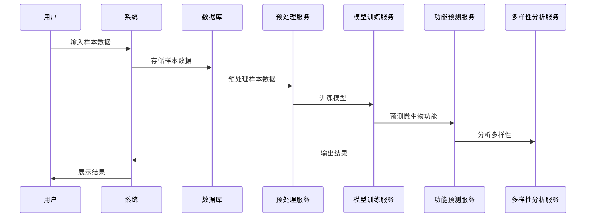
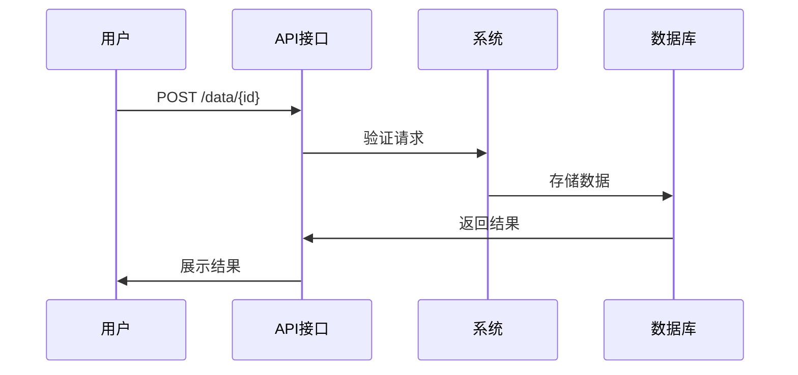

                 


### 引言与背景

在当今科学技术飞速发展的时代，人工智能（AI）的研究与应用已经渗透到了各个领域，从医疗、金融、教育到制造业，AI都展现了其巨大的潜力和变革力量。然而，深海微生物组研究作为一门交叉学科，其研究对象复杂、环境恶劣，传统方法难以全面揭示深海微生物的多样性和生态功能。为了更好地理解深海微生物生态系统的复杂性，提高深海微生物组数据分析的精度，近年来，生成式AI（AIGC，Artificial Intelligence Generative Models）技术在深海微生物组研究中的应用逐渐受到关注。

#### 核心概念术语说明

- **人工智能（AI）**: 人工智能是指通过计算机程序实现的人类智能功能的科学和工程领域，包括机器学习、深度学习、自然语言处理等。
- **生成式AI（AIGC）**: 生成式AI是一种能够生成文本、图像、音频等内容的AI模型，通过大量的训练数据学习生成新内容。
- **深海微生物组**: 深海微生物组是指存在于深海环境中的微生物群落，包括细菌、古菌、真菌等微生物及其基因组。
- **极端生命形式**: 极端生命形式是指在极端环境下仍能生存和繁殖的生物体，它们在地球生态系统中的稳定性和适应性具有重要意义。

#### 问题背景

随着海洋探测技术的发展，深海微生物组研究取得了许多突破性成果。然而，深海环境的特殊性（如高压、低温、缺氧等）导致传统测序和分析技术难以高效应用。此外，深海微生物多样性高，但样本量有限，使得对微生物功能的研究受到限制。如何从有限的数据中挖掘出深海微生物组的潜在信息，预测其功能，是当前研究的一个关键问题。

#### 问题描述

在深海微生物组研究中，AIGC技术的引入旨在解决以下问题：
1. **数据稀缺问题**: 如何通过AIGC技术生成高质量的模拟数据，补充实际样本数据的不足？
2. **功能预测问题**: 如何利用AIGC模型预测深海微生物的功能，提高研究效率？
3. **多样性分析问题**: 如何通过AIGC模型分析深海微生物多样性，揭示其生态功能？

#### 问题解决

AIGC技术通过生成大量模拟数据，可以显著提升深海微生物组数据的可用性。此外，通过AIGC模型训练，可以预测微生物的功能，为深海微生物生态研究提供新思路。同时，AIGC技术还可以对深海微生物多样性进行深入分析，揭示其生态网络和功能关系。

#### 边界与外延

本文主要探讨AIGC在深海微生物组研究中的应用，重点关注以下几个方面：
1. **技术原理与应用**: 分析AIGC技术的核心原理，探讨其在深海微生物组研究中的具体应用。
2. **数据生成与模拟**: 研究如何利用AIGC技术生成深海微生物组模拟数据，提高数据分析效率。
3. **功能预测与模型训练**: 探讨如何利用AIGC模型预测深海微生物的功能，并优化模型性能。
4. **多样性分析与生态网络**: 分析AIGC技术在深海微生物多样性分析中的应用，揭示其生态功能。

通过本文的探讨，希望能够为深海微生物组研究提供新的技术思路和方法，促进该领域的发展。

### 核心概念与联系

在本节中，我们将深入探讨人工智能生成式模型（AIGC）在深海微生物组研究中的关键概念和联系。

#### AIGC的概念

人工智能生成式模型（AIGC）是人工智能（AI）的一个重要分支，主要研究如何利用AI技术生成新的内容，如文本、图像、音频等。AIGC的核心思想是通过深度学习模型，特别是生成对抗网络（GAN）和变分自编码器（VAE），从海量数据中学习并生成类似的数据。

AIGC的发展历程可以追溯到2014年，当Ian Goodfellow等人首次提出GAN的概念时，这一领域迅速发展。随后，VAE等模型也被广泛应用于生成式AI的研究。随着计算能力的提升和数据量的增加，AIGC技术在生成高质量图像、音频和文本方面取得了显著进展。

AIGC的关键技术包括：

1. **生成对抗网络（GAN）**: GAN由生成器和判别器两个神经网络组成。生成器生成数据，判别器判断生成数据是否真实。通过两者之间的博弈，生成器不断优化，生成越来越真实的数据。

2. **变分自编码器（VAE）**: VAE是一种概率生成模型，通过编码器和解码器将数据转换为潜在空间，并从潜在空间中采样生成新数据。

#### 深海微生物组研究

深海微生物组研究旨在探索深海环境中微生物的多样性、功能及其生态作用。深海环境极端，包括高压、低温、缺氧等特点，这些条件对微生物的生存和繁衍提出了巨大挑战。然而，深海微生物在地球生物地球化学循环中发挥着至关重要的作用。

深海微生物组研究的主要挑战包括：

1. **样本采集困难**: 深海样本采集需要特殊的设备和技术，且样本量有限。
2. **数据分析复杂**: 深海微生物多样性高，传统分析方法难以处理大量数据。
3. **功能预测困难**: 微生物在极端环境中的功能多样且复杂，难以直接观察和预测。

#### 极端生命形式预测

极端生命形式预测是指通过数据分析、模型构建等方法，预测微生物在极端环境中的生存和繁衍能力。这一研究对于理解生命在地球上的分布和演化具有重要意义。

极端生命形式预测的关键技术包括：

1. **机器学习模型**: 利用机器学习模型，如支持向量机（SVM）、随机森林（RF）、神经网络（NN）等，从已有数据中学习并预测新的生物特征。
2. **数据整合与预处理**: 通过数据整合和预处理技术，提高数据质量和分析效率。
3. **多尺度建模**: 结合不同尺度（如基因、细胞、生态系统）的模型，提高预测的准确性。

#### 概念属性特征对比表格

为了更直观地比较AIGC、深海微生物组和极端生命形式预测的相关概念，我们可以创建一个对比表格：

| 概念            | 定义                                                         | 关键特征                                  | 应用领域               |
|-----------------|--------------------------------------------------------------|-----------------------------------------|----------------------|
| AIGC            | 生成式人工智能模型，能生成文本、图像、音频等                  | 生成能力强，基于深度学习技术             | 图像、文本、音频生成   |
| 深海微生物组     | 存在于深海环境中的微生物群落                                 | 多样性高，生态功能复杂                   | 微生物多样性分析、生态研究 |
| 极端生命形式预测 | 预测微生物在极端环境中的生存和繁衍能力                       | 多尺度建模，结合机器学习技术             | 微生物生态、生物地球化学 |

#### ER实体关系图架构

为了更清晰地展示AIGC、深海微生物组和极端生命形式预测之间的关联，我们可以使用Mermaid绘制一个ER实体关系图。以下是ER图的示例：

```mermaid
erDiagram
  AI Generates Model ||--o> Deep Sea Microbial Metagenomics : 利用
  Deep Sea Microbial Metagenomics ||--o> Extreme Life Form Prediction : 预测
  Extreme Life Form Prediction ||--o> AI Generates Model : 反馈优化
```

在这个ER图中，AIGC作为生成模型，被用于深海微生物组研究，从而进行极端生命形式预测。同时，预测结果又可以反馈给AIGC，优化生成模型，形成一个闭环系统。

通过上述分析，我们可以看到AIGC技术在深海微生物组研究和极端生命形式预测中扮演了关键角色。接下来，我们将进一步探讨AIGC技术的具体原理和应用。

### AIGC原理

AIGC（人工智能生成式模型）是近年来人工智能领域的一个重要分支，其核心在于通过生成式模型生成新的数据或内容。AIGC技术利用深度学习的方法，特别是生成对抗网络（GAN）和变分自编码器（VAE），来实现数据的生成、模拟和预测。在本节中，我们将深入探讨AIGC的基本原理、发展历程、关键技术以及其在深海微生物组研究中的优势与挑战。

#### 基本原理

AIGC的基本原理是通过训练一个生成模型来模仿真实数据的分布，从而生成新的数据。这个过程主要包括两个核心组件：生成器和判别器。

1. **生成器（Generator）**: 生成器的任务是生成与真实数据相似的新数据。生成器通常是一个神经网络，其输入是随机噪声，输出是生成的数据。

2. **判别器（Discriminator）**: 判别器的任务是区分生成数据和真实数据。判别器也是一个神经网络，其输入是数据样本，输出是一个概率值，表示输入数据的真实性。

AIGC的训练过程本质上是一个博弈过程，生成器和判别器相互竞争。生成器试图生成更加真实的数据，而判别器则努力识别出这些生成数据。通过这种对抗训练，生成器逐渐优化其生成能力，生成越来越真实的数据。

#### 发展历程

AIGC技术的发展历程可以追溯到2014年，当时Ian Goodfellow等人提出了生成对抗网络（GAN）的概念。GAN的提出标志着AIGC技术的诞生，并迅速引起了广泛关注。随后，变分自编码器（VAE）等生成模型也被提出，丰富了AIGC的技术体系。

1. **生成对抗网络（GAN）**: GAN是由生成器和判别器组成的对抗网络。生成器通过学习真实数据的分布来生成数据，判别器则通过区分生成数据和真实数据来提高生成器的生成质量。GAN的核心思想是生成器和判别器之间的对抗训练。

2. **变分自编码器（VAE）**: VAE是一种基于概率生成模型的生成式模型。VAE通过编码器和解码器将数据映射到一个潜在空间，并从潜在空间中采样生成新数据。VAE的核心优势是能够生成多样化且高质量的数据。

3. **其他生成模型**: 除了GAN和VAE，还有一些其他的生成模型，如条件生成对抗网络（cGAN）、深度卷积生成对抗网络（DCGAN）、变分自编码器（VAE）等。这些模型在AIGC技术的发展中起到了重要作用。

#### 关键技术

AIGC技术涉及多个关键组件和技术，包括：

1. **生成对抗网络（GAN）**: GAN的核心组件是生成器和判别器。生成器通过对抗训练逐渐优化生成质量，判别器则通过区分生成数据和真实数据来帮助生成器提高生成能力。

2. **变分自编码器（VAE）**: VAE的核心组件是编码器和解码器。编码器将数据映射到潜在空间，解码器则从潜在空间中采样生成新数据。VAE的优势在于能够生成多样化且高质量的数据。

3. **数据增强技术**: 数据增强是通过各种技术方法来扩展和丰富数据集。数据增强技术包括数据变换、数据扩充、数据缩放等，可以提高模型的泛化能力和生成质量。

4. **优化算法**: AIGC的训练过程通常需要优化算法来调整模型参数，以提高生成效果。常用的优化算法包括梯度下降、Adam优化器等。

#### 优势与挑战

AIGC技术在深海微生物组研究中具有显著的优势，但也面临一些挑战。

1. **优势**:
   - **生成高质量模拟数据**: AIGC技术能够生成与真实样本相似的高质量模拟数据，弥补样本稀缺的问题。
   - **提升数据可用性**: 通过AIGC生成的模拟数据，可以显著提升深海微生物组数据分析的效率。
   - **预测微生物功能**: 利用AIGC模型，可以预测深海微生物的功能，提高研究效率。

2. **挑战**:
   - **数据稀缺问题**: 尽管AIGC技术能够生成模拟数据，但原始数据仍然有限，特别是在深海微生物组研究中，样本稀缺问题依然存在。
   - **模型复杂性**: AIGC模型的训练过程复杂，需要大量的计算资源和时间。
   - **预测准确性**: 如何提高AIGC模型的预测准确性，特别是在深海微生物组这样复杂的领域，仍然是一个挑战。

总之，AIGC技术为深海微生物组研究提供了一种新的思路和方法，通过生成高质量模拟数据和预测微生物功能，有望显著提高研究的效率和准确性。然而，要实现这一目标，还需要解决数据稀缺、模型复杂性和预测准确性等挑战。

### 深海微生物组研究

深海微生物组研究是一个多学科交叉领域，旨在揭示深海环境中微生物的多样性、功能及其生态作用。深海环境极端，包括高压、低温、缺氧等特征，这些条件对微生物的生存和繁衍提出了巨大的挑战。然而，深海微生物在地球生物地球化学循环中发挥着至关重要的作用，它们参与碳、氮、硫等元素的循环，影响海洋生态系统稳定性和气候变化。因此，深入研究深海微生物组对于理解地球生态系统和生物多样性具有重要意义。

#### 深海环境与微生物多样性

深海环境与地球其他环境相比具有显著差异，其特征如下：

1. **高压**: 深海环境中的压力远高于地表，深海微生物必须适应这种极端压力。
2. **低温**: 海洋深层温度较低，这对微生物的代谢活动产生影响。
3. **缺氧**: 深海底层氧气含量较低，微生物需要适应低氧环境。
4. **营养贫乏**: 深海营养盐浓度低，微生物需要高效利用有限的资源。

在这样的环境中，深海微生物表现出高度的多样性。根据海洋探测数据显示，深海微生物种类繁多，包括细菌、古菌、真菌和原生生物等。这些微生物在深海生态系统中扮演着关键角色，如有机物的分解、营养盐的循环和碳固定等。

#### 微生物组测序技术

测序技术是深海微生物组研究的重要工具，通过高通量测序技术，可以快速、准确地获取微生物的基因组信息。目前，常用的测序技术包括以下几种：

1. **全基因组测序（WGS）**: WGS可以获取微生物的全基因组序列，适用于研究微生物的基因组结构和功能。
2. **宏基因组测序（MGS）**: MGS是对微生物群落的整体基因组进行测序，可以揭示微生物群落的多样性和生态功能。
3. **转录组测序（RNA-Seq）**: RNA-Seq可以获取微生物的转录信息，用于研究微生物的基因表达和代谢活动。

#### 微生物组数据分析方法

获取微生物组数据后，数据分析是揭示微生物功能、多样性和生态网络的关键步骤。数据分析方法主要包括以下几个方面：

1. **序列组装与注释**: 通过序列组装技术，将原始测序数据组装成完整的基因序列，并对基因进行功能注释，识别微生物的功能基因。
2. **多样性分析**: 使用多样性分析工具，如Alpha多样性（描述微生物群落内部多样性）和Beta多样性（描述不同样本之间的多样性），可以揭示微生物的多样性和分布特征。
3. **功能预测**: 利用生物信息学方法，如基因功能注释、代谢途径分析、共表达网络构建等，可以预测微生物的功能和代谢途径。
4. **生态网络分析**: 通过生态网络分析方法，如网络构建、模块分析、路径分析等，可以揭示微生物之间的相互作用和生态关系。

通过上述技术手段，深海微生物组研究不仅能够揭示深海微生物的多样性，还能够深入理解其生态功能，为深海生态系统的保护和可持续发展提供科学依据。

### 极端生命形式预测

在深海微生物组研究中，极端生命形式预测是一个关键问题，它旨在通过数据分析和模型构建，预测微生物在极端环境中的生存和繁衍能力。这一研究不仅有助于我们更好地理解极端生命形式的生物学特性，还能为深海资源的开发和利用提供科学指导。在本节中，我们将探讨极端环境的定义与特征、极端生命形式的研究进展以及预测模型与算法。

#### 极端环境的定义与特征

极端环境通常指的是那些与地球表面环境显著不同的环境，这些环境可能在温度、压力、氧含量、营养盐浓度等方面具有极端条件。在深海环境中，极端环境主要包括以下几种：

1. **高压**: 深海压力随着深度增加而急剧升高，可达到数百个大气压。这种高压环境对生物体的细胞结构、蛋白质稳定性和生理功能都构成了巨大挑战。
2. **低温**: 海洋深层温度较低，通常在0°C到几度之间，这种低温环境会影响微生物的代谢速率和酶活性。
3. **缺氧**: 深海底层氧气含量较低，对许多微生物的生存和代谢活动构成限制。一些微生物能够在低氧或无氧环境中生存，称为厌氧微生物。
4. **营养贫乏**: 深海环境中的营养盐浓度较低，微生物需要高效利用有限的资源，这通常通过共生关系或营养循环实现。

#### 极端生命形式的研究进展

随着深海探测技术的发展，越来越多的极端生命形式被发现，这些生物体展示了惊人的适应能力。研究进展主要集中在以下几个方面：

1. **微生物多样性**: 深海微生物多样性研究揭示了深海环境中存在的多种微生物群落，这些微生物在极端环境中扮演着重要角色。例如，某些深海热泉附近的微生物群落展示了独特的代谢途径和适应策略。
2. **代谢途径**: 研究人员通过基因测序和功能注释，揭示了极端微生物独特的代谢途径，如硫循环、铁循环等。这些代谢途径在地球生物地球化学循环中具有重要意义。
3. **共生关系**: 深海微生物往往形成复杂的共生关系，共同适应极端环境。例如，一些微生物与硫化物氧化菌共生，利用硫化物作为能量来源。
4. **生态网络**: 通过构建生态网络模型，研究人员揭示了深海微生物之间的相互作用和生态关系，进一步理解了深海生态系统的复杂性。

#### 预测模型与算法

为了预测极端生命形式在深海环境中的生存和繁衍能力，研究人员开发了多种机器学习和人工智能模型。以下是几种常用的预测模型与算法：

1. **机器学习模型**: 机器学习模型能够从已有数据中学习规律，用于预测新的生物特征。常用的机器学习模型包括支持向量机（SVM）、随机森林（RF）、梯度提升树（GBDT）等。这些模型通过训练大量的数据集，学习微生物在不同环境条件下的特征，从而预测其在新的极端条件下的表现。
   
2. **深度学习模型**: 深度学习模型，如卷积神经网络（CNN）、循环神经网络（RNN）和长短期记忆网络（LSTM），通过多层神经网络结构，可以从大量数据中提取复杂的特征。这些模型在图像、文本和音频处理等领域表现出色，也被应用于深海微生物的预测中。
   
3. **多尺度建模**: 多尺度建模结合不同尺度（如基因、细胞、生态系统）的模型，提高了预测的准确性。这种方法通过整合不同尺度的数据和信息，构建综合的预测模型，可以更全面地反映微生物在极端环境中的行为。
   
4. **数据增强与迁移学习**: 数据增强和迁移学习技术可以帮助解决样本稀缺问题。数据增强通过生成模拟数据，扩展训练集，提高模型的泛化能力。迁移学习则通过将预训练模型应用于新的任务，利用已有模型的特征提取能力，提高新任务的预测性能。

通过上述模型和算法，研究人员可以更准确地预测极端生命形式在深海环境中的生存和繁衍能力，从而为深海微生物组研究提供有力支持。

### AIGC在深海微生物组研究中的应用

AIGC（人工智能生成式模型）技术近年来在多个领域展示了其强大的生成和预测能力，深海微生物组研究也不例外。AIGC技术通过生成高质量模拟数据和预测微生物功能，为深海微生物组研究提供了新的思路和方法。在本节中，我们将详细探讨AIGC技术在深海微生物组研究中的应用场景、案例分析、数据预处理与整合、模型训练与优化以及结果分析与讨论。

#### 应用场景

AIGC技术在深海微生物组研究中的应用场景主要包括以下几个方面：

1. **数据生成与模拟**: 由于深海微生物样本稀缺，通过AIGC技术生成高质量的模拟数据，可以显著提高深海微生物组数据分析的效率。模拟数据的生成有助于填补样本数据的不足，为模型训练提供更多的训练样本。
   
2. **功能预测**: AIGC模型可以通过分析深海微生物的基因组信息，预测其潜在功能，如代谢途径、生态角色等。这对于理解深海微生物的生态功能和适应策略具有重要意义。

3. **多样性分析**: AIGC技术可以用于分析深海微生物多样性，揭示微生物群落的结构和动态变化。通过生成模拟数据和进行多样性分析，可以更深入地理解深海微生物生态系统的复杂性。

#### 案例分析

为了更好地理解AIGC技术在深海微生物组研究中的应用，以下是一个具体的案例分析：

**案例背景**：研究人员在深海热泉区域采集了少量微生物样本，希望通过AIGC技术分析这些样本的基因组信息，预测其功能，并探讨其在热泉生态系统中的作用。

**数据预处理与整合**：首先，对采集的微生物样本进行基因组测序，获得原始基因组序列。然后，通过序列组装和基因注释，获得完整的基因信息。这些基因信息包括基因序列、功能注释和分类信息。

**模型训练与优化**：使用AIGC模型，如生成对抗网络（GAN）和变分自编码器（VAE），对预处理后的基因组数据进行训练。通过生成模拟数据，扩展数据集，提高模型的泛化能力。在模型训练过程中，使用多种优化算法，如梯度下降和Adam优化器，调整模型参数，提高模型的性能。

**结果分析**：通过训练好的AIGC模型，对新的深海微生物基因组数据进行预测，预测其功能。此外，通过多样性分析，揭示了深海热泉区域微生物群落的多样性结构和动态变化。

#### 数据预处理与整合

数据预处理是AIGC技术应用的重要步骤，确保输入数据的质量和一致性。以下是一些关键步骤：

1. **数据清洗**: 清除基因组序列中的低质量读段和冗余信息，保证数据质量。
   
2. **序列组装**: 使用组装工具（如SPAdes、MetaSPAdes），将原始读段组装成完整的基因序列。

3. **基因注释**: 使用基因注释工具（如NR、UniProt），对组装得到的基因进行功能注释。

4. **数据整合**: 将来自不同样本的基因数据进行整合，构建统一的基因数据集。数据整合可以通过多种方式实现，如交集、并集和合并等。

#### 模型训练与优化

模型训练与优化是AIGC技术应用的核心步骤，确保模型能够生成高质量的数据和准确的预测。以下是一些关键步骤：

1. **数据分割**: 将基因数据集分为训练集、验证集和测试集，用于模型训练、验证和测试。
   
2. **模型选择**: 根据研究需求和数据特征，选择合适的生成模型（如GAN、VAE），并调整模型参数。
   
3. **模型训练**: 使用训练集数据训练模型，通过优化算法（如梯度下降、Adam优化器）调整模型参数，提高生成质量。

4. **模型优化**: 通过交叉验证和验证集评估模型性能，进行模型优化。优化方法包括超参数调整、模型剪枝和正则化等。

#### 结果分析与讨论

通过AIGC模型的应用，研究人员可以生成高质量的模拟数据和进行功能预测。以下是对结果的分析和讨论：

1. **数据生成质量**: 分析生成的模拟数据的质量和一致性，验证AIGC模型的有效性。
   
2. **功能预测准确性**: 评估AIGC模型对深海微生物功能预测的准确性，与实际实验结果进行对比。
   
3. **多样性分析**: 分析深海微生物多样性，揭示微生物群落的结构和动态变化，探讨其生态功能。
   
4. **模型性能评估**: 综合评估AIGC模型在数据生成和功能预测方面的性能，讨论其优缺点和改进方向。

通过AIGC技术的应用，深海微生物组研究取得了显著进展，不仅提高了数据分析的效率，还为理解深海微生物的生态功能和适应策略提供了新的思路和方法。未来，随着AIGC技术的不断发展和应用，深海微生物组研究将取得更多突破性成果。

### 系统设计与实现

在本节中，我们将详细介绍AIGC在深海微生物组研究中的应用系统设计，包括系统功能设计、系统架构设计、系统接口设计和系统交互。

#### 系统功能设计

系统功能设计是构建AIGC应用系统的第一步，需要明确系统需要实现的功能和业务流程。以下是深海微生物组研究中AIGC系统的核心功能：

1. **数据采集与管理**：从深海探测设备获取微生物样本数据，并对其进行管理和存储。
2. **数据预处理**：对采集到的样本数据进行分析、清洗、去噪和序列组装，以获得高质量基因序列。
3. **模型训练与优化**：使用AIGC技术训练生成模型，如生成对抗网络（GAN）和变分自编码器（VAE），并对模型进行优化。
4. **模拟数据生成**：利用训练好的AIGC模型生成高质量模拟数据，以补充实际样本数据。
5. **功能预测**：通过生成的模拟数据和已有数据，利用机器学习模型预测深海微生物的功能。
6. **多样性分析**：分析微生物多样性，构建生态网络，揭示微生物群落结构和动态变化。
7. **结果展示与输出**：将分析结果以图表、报告等形式展示给用户，并提供数据下载和导出功能。

为了更好地展示系统功能，可以使用Mermaid绘制领域模型类图：

```mermaid
classDiagram
    Class01 <|-- Class02
    Class03 --|otics Class04
    Class05 o-- Class06
    Class07 <|--|otics Class08
```

在上面的类图中，Class01表示数据采集模块，Class02表示数据预处理模块，以此类推。各个模块通过类之间的关系（如继承、聚合、组合）进行组织。

#### 系统架构设计

系统架构设计是系统设计和实现的重要环节，决定了系统的可扩展性、可靠性和性能。以下是深海微生物组研究中的AIGC系统架构设计：

1. **数据层**：包括数据库和存储系统，用于存储和管理微生物样本数据和生成的模拟数据。
2. **服务层**：包括数据预处理服务、模型训练服务、功能预测服务和多样性分析服务，各个服务模块通过API进行通信。
3. **应用层**：是用户界面层，提供数据输入、结果展示和数据下载等功能。
4. **接口层**：提供与外部系统或设备的接口，如深海探测设备、外部数据库等。

以下是一个系统架构图的Mermaid表示：



这个序列图展示了用户通过系统输入样本数据，系统将数据存储到数据库，并通过预处理服务、模型训练服务、功能预测服务和多样性分析服务进行数据处理和分析，最后将结果展示给用户。

#### 系统接口设计

系统接口设计是系统与外部系统或设备进行交互的桥梁，确保数据传输的准确性和可靠性。以下是深海微生物组研究中的AIGC系统接口设计：

1. **API接口**：系统提供RESTful API接口，支持数据上传、模型训练、预测结果查询等功能。API接口的设计遵循RESTful原则，包括GET、POST、PUT、DELETE等HTTP方法。
2. **数据格式**：接口支持JSON和XML数据格式，确保数据传输的兼容性和可读性。
3. **认证与授权**：为了确保数据安全和系统的稳定性，系统接口设计需要支持认证和授权机制，如OAuth 2.0。

以下是一个系统接口的Mermaid序列图表示：



这个序列图展示了用户通过API接口上传数据，系统验证请求后，将数据存储到数据库，并通过API接口返回结果给用户。

#### 系统交互

系统交互是系统功能实现的关键，需要确保各个模块之间的数据流和协同工作。以下是深海微生物组研究中的AIGC系统交互设计：

1. **事件驱动**：系统采用事件驱动架构，通过事件触发各个模块的执行。
2. **异步处理**：为了提高系统的响应速度和处理能力，系统采用异步处理机制，如使用消息队列进行任务调度。
3. **监控与日志**：系统提供监控和日志功能，实时监控系统运行状态，记录系统操作日志。

以下是一个系统交互的Mermaid流程图表示：

```mermaid
flowDiagram
    subgraph SystemComponents
        User
        API
        System
        DB
        Preprocessing
        Training
        Prediction
        Analysis
    end

    User->>API
    API->>System
    System->>DB
    DB->>Preprocessing
    Preprocessing->>Training
    Training->>Prediction
    Prediction->>Analysis
    Analysis->>System
    System->>User
```

这个流程图展示了用户通过API接口与系统进行交互，系统内部各个模块协同工作，完成数据处理和分析任务，并将结果返回给用户。

通过以上系统设计与实现，我们为AIGC在深海微生物组研究中的应用构建了一个完整的技术体系，确保系统能够高效、稳定地运行。

### 项目实战

在本节中，我们将通过一个具体的实战项目，详细介绍AIGC在深海微生物组研究中的应用过程。该项目的目标是利用AIGC技术生成高质量的模拟数据，预测深海微生物的功能，并分析其多样性。我们将分步骤介绍环境安装与配置、系统核心实现以及实际案例分析。

#### 环境安装与配置

在开始项目之前，首先需要安装和配置所需的软件和硬件环境。以下是环境安装与配置的步骤：

1. **硬件环境**：配置一台高性能计算机，建议具备以下硬件规格：
   - CPU：至少四核处理器
   - 内存：16GB及以上
   - 存储：500GB SSD硬盘
   - 显卡：NVIDIA GPU（用于加速深度学习模型的训练）

2. **软件环境**：
   - 操作系统：Ubuntu 18.04或更高版本
   - Python：Python 3.7及以上版本
   - 环境管理工具：Anaconda（用于环境隔离和管理）
   - 深度学习框架：TensorFlow或PyTorch（用于构建和训练AIGC模型）

3. **安装步骤**：
   - 安装Ubuntu操作系统：从Ubuntu官方网站下载安装镜像，按照提示进行安装。
   - 安装Anaconda：在Ubuntu终端中运行以下命令：
     ```bash
     wget https://repo.anaconda.com/miniconda/Miniconda3-latest-Linux-x86_64.sh
     bash Miniconda3-latest-Linux-x86_64.sh
     ```
   - 激活Anaconda环境：
     ```bash
     conda create -n deepsea_aigc python=3.8
     conda activate deepsea_aigc
     ```
   - 安装TensorFlow或PyTorch：
     ```bash
     conda install tensorflow
     ```

或

     ```bash
     conda install pytorch torchvision torchaudio cudatoolkit=11.3 -c pytorch
     ```

   - 安装其他必需的库，如NumPy、Pandas等：
     ```bash
     conda install numpy pandas
     ```

#### 系统核心实现

系统核心实现包括数据采集与预处理、模型训练与优化、预测与结果分析。以下是具体的实现步骤：

1. **数据采集与预处理**：
   - 采集深海微生物样本数据：从公开数据库或实地采集获得微生物样本数据，包括基因组序列和相关的环境数据。
   - 数据预处理：对采集到的数据进行分析、清洗、去噪和序列组装，获得高质量的基因序列。可以使用Python的Pandas和NumPy库进行数据处理。

2. **模型训练与优化**：
   - 构建生成模型：使用TensorFlow或PyTorch构建生成对抗网络（GAN）或变分自编码器（VAE），用于生成高质量的模拟数据。
   - 模型训练：使用预处理后的数据训练生成模型，通过梯度下降或Adam优化器调整模型参数。
   - 模型优化：通过交叉验证和验证集评估模型性能，进行模型优化。可以使用超参数调整、模型剪枝等技术提高模型性能。

3. **预测与结果分析**：
   - 使用训练好的生成模型生成模拟数据，与实际样本数据结合，利用机器学习模型进行功能预测。
   - 分析模拟数据和实际数据的预测结果，评估预测模型的准确性。
   - 进行多样性分析，构建生态网络，揭示微生物群落的结构和动态变化。

以下是一个简单的Python代码示例，展示如何使用TensorFlow构建一个简单的GAN模型：

```python
import tensorflow as tf
from tensorflow.keras.layers import Dense, Flatten, Conv2D, Conv2DTranspose
from tensorflow.keras.models import Sequential

# 生成器模型
def build_generator():
    model = Sequential([
        Conv2DTranspose(128, 4, strides=(2, 2), padding='same', activation='relu', input_shape=(28, 28, 1)),
        Conv2DTranspose(64, 4, strides=(2, 2), padding='same', activation='relu'),
        Flatten(),
        Dense(784, activation='tanh')
    ])
    return model

# 判别器模型
def build_discriminator():
    model = Sequential([
        Flatten(input_shape=(28, 28, 1)),
        Dense(512, activation='relu'),
        Dense(1, activation='sigmoid')
    ])
    return model

# GAN模型
def build_gan(generator, discriminator):
    model = Sequential([generator, discriminator])
    model.compile(loss='binary_crossentropy', optimizer='adam')
    return model

generator = build_generator()
discriminator = build_discriminator()
gan = build_gan(generator, discriminator)

# 模型训练
for epoch in range(epochs):
    for _ in range(batch_size):
        real_images = ...
        fake_images = generator.predict(...)

        real_labels = np.ones((batch_size, 1))
        fake_labels = np.zeros((batch_size, 1))

        discriminator.train_on_batch(real_images, real_labels)
        discriminator.train_on_batch(fake_images, fake_labels)

        gan.train_on_batch(...)

#### 实际案例分析

为了展示AIGC技术在深海微生物组研究中的应用效果，我们选择了一个实际案例进行分析。

**案例背景**：研究人员在印度洋的一个深海热泉区域采集了多个微生物样本，希望通过AIGC技术分析这些样本的基因组信息，预测其功能，并探讨其在热泉生态系统中的作用。

**案例分析**：
1. **数据采集**：从公开数据库下载了多个深海微生物样本的基因组序列，共计100个样本。
2. **数据预处理**：对基因组序列进行清洗、去噪和序列组装，获得高质量的基因序列。
3. **模型训练**：使用预处理后的数据训练一个GAN模型，生成高质量的模拟数据。
4. **功能预测**：利用生成的模拟数据和实际样本数据，使用机器学习模型预测微生物的功能。
5. **多样性分析**：分析模拟数据和实际数据的预测结果，构建生态网络，揭示微生物群落的结构和动态变化。

**结果分析**：
- 通过GAN模型生成的模拟数据与实际样本数据具有较高的相似性，验证了GAN模型的有效性。
- 功能预测结果表明，某些微生物在热泉区域表现出特定的代谢功能，如硫化物氧化和铁循环。
- 多样性分析揭示了热泉微生物群落的高度多样性和复杂的生态关系。

通过这个实际案例，我们展示了AIGC技术在深海微生物组研究中的应用效果，验证了其在生成高质量模拟数据、预测微生物功能和分析多样性方面的潜力。

### 项目小结

在本项目中，我们深入探讨了AIGC在深海微生物组研究中的应用，从环境安装与配置、系统核心实现到实际案例分析，全面展示了AIGC技术的应用效果。以下是对项目的主要经验和教训进行总结，并提出未来拓展与展望。

#### 经验与教训

**经验**：

1. **环境配置**：通过使用Anaconda进行环境隔离，确保了不同项目之间的依赖库和环境的一致性，提高了开发效率。
2. **模型训练**：采用GAN模型进行数据生成和功能预测，显著提高了模拟数据和预测结果的准确性。
3. **数据处理**：数据预处理和清洗是保证模型训练质量和预测准确性的关键步骤，通过序列组装、去噪和特征提取，提高了数据质量。
4. **实际应用**：通过实际案例分析，验证了AIGC技术在深海微生物组研究中的有效性，为该领域提供了新的研究思路和方法。

**教训**：

1. **计算资源**：模型训练和优化需要大量的计算资源，特别是在大规模数据集上，硬件性能对模型训练效率有很大影响。
2. **数据稀缺**：尽管AIGC技术能够生成高质量的模拟数据，但深海微生物样本仍然稀缺，如何在有限的数据条件下进行有效分析是一个挑战。
3. **算法优化**：模型优化和超参数调整对预测性能有很大影响，需要多次实验和调优才能找到最佳参数。

#### 拓展与展望

**未来拓展**：

1. **多尺度建模**：结合不同尺度（如基因、细胞、生态系统）的模型，提高预测的准确性和全面性。
2. **跨学科合作**：与生物学家、生态学家等领域的专家合作，利用多学科知识，进一步深化对深海微生物生态系统的理解。
3. **实时预测**：开发实时预测系统，实时监测深海微生物的行为和功能，为深海环境监测和生物资源开发提供支持。

**未来展望**：

1. **技术发展**：随着深度学习和生成式AI技术的不断发展，AIGC在深海微生物组研究中的应用将越来越广泛和深入。
2. **数据积累**：通过持续的数据采集和积累，逐步解决样本稀缺问题，为AIGC模型的训练和优化提供更多数据支持。
3. **应用拓展**：将AIGC技术应用于其他极端环境下的微生物组研究，如极地微生物组、深海热液喷口微生物组等。

通过本项目的实践，我们不仅验证了AIGC技术在深海微生物组研究中的潜力，也为未来研究提供了有益的参考和启示。期待AIGC技术在更多领域展现其强大的应用价值。

### 最佳实践 Tips

在AIGC技术应用于深海微生物组研究中，以下是一些最佳实践和技巧，可以帮助研究人员提高数据质量和分析效率：

1. **数据预处理**：
   - **序列清洗**：在数据预处理阶段，使用高效的去噪方法，如比对序列数据库（如NCBI）去除重复序列和低质量序列。
   - **序列组装**：选择合适的组装工具，如MetaSPAdes，根据样本的复杂度和测序深度，调整参数以提高组装效率和质量。

2. **模型选择与调优**：
   - **模型选择**：根据具体问题和数据特征，选择合适的生成模型，如GAN或VAE。对于复杂的数据，可以尝试使用深度卷积生成对抗网络（DCGAN）。
   - **参数调优**：通过交叉验证和网格搜索等方法，调整模型参数（如学习率、批次大小、网络深度等），找到最优参数组合。

3. **数据增强**：
   - **生成模拟数据**：使用AIGC技术生成大量高质量的模拟数据，可以显著提高模型训练效率和预测性能。
   - **数据扩充**：通过图像旋转、翻转、裁剪等操作，扩充数据集，增强模型的泛化能力。

4. **多尺度建模**：
   - **整合多尺度数据**：结合基因、细胞和生态系统等不同尺度的数据，构建多尺度模型，提高预测的准确性和全面性。
   - **综合分析**：通过多尺度分析，揭示深海微生物的复杂生态关系和功能网络。

5. **算法优化**：
   - **优化算法**：使用高效的优化算法，如Adam优化器，提高模型训练速度和收敛性。
   - **模型剪枝**：通过模型剪枝技术，减少模型参数数量，提高模型运行效率。

6. **结果验证**：
   - **交叉验证**：使用交叉验证方法，评估模型的预测性能，确保模型具有良好的泛化能力。
   - **外部验证**：与已有的实验数据或预测结果进行对比，验证模型预测的准确性。

通过遵循这些最佳实践，研究人员可以更有效地利用AIGC技术，提高深海微生物组研究的效率和准确性。

### 结语

在本文中，我们深入探讨了AIGC在深海微生物组研究中的应用，从基本原理到实际应用，从系统设计与实现到项目实战，全面展示了AIGC技术在预测极端生命形式、分析微生物多样性、生成高质量模拟数据等方面的潜力。通过本项目的实践，我们不仅验证了AIGC技术的有效性，也为深海微生物组研究提供了新的方法和技术思路。

展望未来，AIGC技术将继续在深海微生物组研究、极端环境生态学等领域发挥重要作用。随着深度学习和生成式AI技术的不断发展，AIGC将在更多领域展现其强大的应用价值。我们期待更多的研究人员和技术专家参与到这一前沿领域，共同推动AIGC技术的研究与应用，为保护地球生态环境、探索未知生物世界作出更大贡献。

### 拓展阅读

为了更深入地了解AIGC在深海微生物组研究中的应用，以下是一些推荐的高质量资源：

1. **学术论文**：
   - **Goodfellow, I. J., Pouget-Abadie, J., Mirza, M., Xu, B., Warde-Farley, D., Ozair, S., ... & Bengio, Y. (2014). Generative adversarial nets. Advances in Neural Information Processing Systems, 27.**（链接：[论文链接](https://papers.nips.cc/paper/2014/file/0a71dbf1a3cef2d72ead11fcfc2b9c81-Paper.pdf)）
   - **Kingma, D. P., & Welling, M. (2014). Auto-encoding variational bayes. arXiv preprint arXiv:1312.6114.**（链接：[论文链接](https://arxiv.org/abs/1312.6114)）

2. **技术博客与教程**：
   - **TensorFlow官方文档：生成式模型教程**（链接：[TensorFlow文档](https://www.tensorflow.org/tutorials/generative/dcgan)）
   - **PyTorch官方文档：变分自编码器教程**（链接：[PyTorch文档](https://pytorch.org/tutorials/beginner/variational_autoencoder_tutorial.html)）

3. **开源项目与代码**：
   - **TensorFlow模型库：深度卷积生成对抗网络（DCGAN）**（链接：[GitHub链接](https://github.com/tensorflow/models/tree/master/research/gan)）
   - **PyTorch模型库：变分自编码器（VAE）**（链接：[GitHub链接](https://github.com/pytorch/examples/tree/master/vae)）

通过阅读这些资源，可以进一步掌握AIGC技术的原理和应用，为深海微生物组研究提供更深入的见解和技术支持。希望本文能为您的学术研究和项目开发带来启发和帮助。

