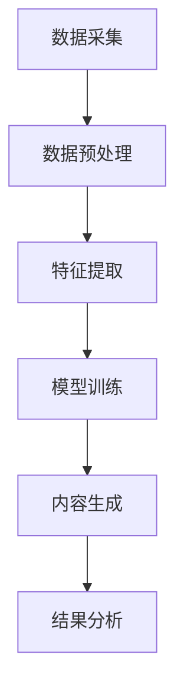
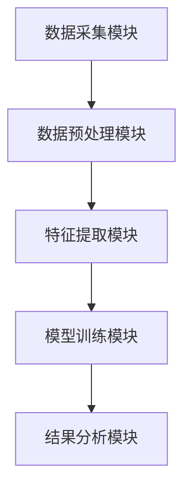
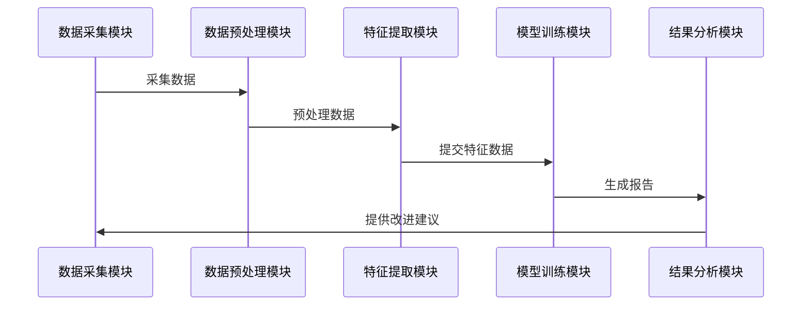

                 

## 引言

### 深海资源勘探的背景

深海资源勘探是指利用现代技术对海洋深处蕴含的矿产资源、生物资源、能源资源等进行调查、开发和利用的过程。随着全球人口的增长和资源需求的不断上升，深海资源的重要性日益凸显。深海不仅是一个巨大的资源宝库，也是地球上最后一片未被充分开发的领域。

#### 深海资源的重要性

1. **矿产资源**：深海中富含多金属结核、富钴结壳等宝贵资源，这些资源对新能源、航空航天等领域具有关键作用。
2. **生物资源**：深海生物种类繁多，很多生物具有独特的生物活性物质，可能对医药、农业等领域产生重大影响。
3. **能源资源**：深海油气资源丰富，对全球能源安全具有重要意义。

### AIGC技术概述

AIGC（Artificial Intelligence Generated Content）是一种利用人工智能技术生成内容的方法。与传统的手动创作相比，AIGC能够在更短的时间内生成大量且高质量的内容，极大地提高了效率。

#### AIGC的应用领域

1. **媒体与娱乐**：用于生成文章、视频、音乐等。
2. **营销与广告**：自动化生成广告文案、宣传材料等。
3. **教育与培训**：用于生成教材、课程内容等。

### 海底地形分析的重要性

海底地形分析是深海资源勘探的核心环节。准确分析海底地形，对于识别潜在资源、制定开发方案具有重要意义。

#### 海底地形分析的挑战

1. **数据量大**：海底地形数据量大，处理和分析需要大量的计算资源。
2. **环境复杂**：海底环境复杂，数据采集难度大。
3. **非结构化数据**：海底地形数据多为非结构化数据，分析难度大。

### 问题解决

AIGC技术可以通过以下方法解决海底地形分析中的难题：

1. **自动数据预处理**：利用AIGC技术自动化处理和整合各种类型的地形数据。
2. **智能模式识别**：通过机器学习算法，从数据中提取有用的特征，辅助地质学家进行地形分析。
3. **生成可视化报告**：自动生成海底地形分析报告，简化分析过程。

### 边界与外延

1. **AIGC**：是指利用人工智能技术自动生成内容的方法，包括文本、图像、视频等多种形式。
2. **深海资源勘探**：是指对海洋深处的矿产资源、生物资源、能源资源等进行调查、开发和利用的过程。
3. **海底地形分析**：是指利用各种技术和方法对海底地形进行测量、分析、解读的过程。

### 概念结构与核心要素组成

1. **AIGC技术**：核心概念包括生成内容的过程、模型类型等。
2. **深海资源勘探**：核心概念包括资源类型、勘探方法、技术应用等。
3. **海底地形分析**：核心概念包括地形数据采集、数据处理、特征提取、结果分析等。

通过以上对背景介绍和核心概念的详细阐述，我们可以进一步探讨AIGC在深海资源勘探中的应用及其海底地形分析的具体实现。

---

## 核心概念与联系

### AIGC技术原理

AIGC（Artificial Intelligence Generated Content）技术是基于人工智能算法生成内容的技术。其核心原理包括自然语言处理（NLP）、计算机视觉（CV）和深度学习（DL）等技术。

#### AIGC的工作流程

1. **数据采集**：从各种来源（如文本、图像、视频等）收集数据。
2. **数据预处理**：清洗、标注和整合数据，为模型训练做好准备。
3. **模型训练**：使用深度学习算法训练模型，使其能够理解数据和生成内容。
4. **内容生成**：根据输入的提示和模型的知识，生成新的内容。

#### AIGC技术的模型类型

1. **生成式模型**：如GPT-3、ChatGPT等，能够生成连贯的文本。
2. **差异模型**：如DALL-E、CLIP等，能够生成图像和视频。
3. **增强模型**：结合生成式模型和差异模型，生成更复杂的内容。

### 概念属性特征对比表格

以下是一个AIGC技术与其他类似技术的对比表格：

| 特性 | AIGC | 自然语言处理（NLP） | 计算机视觉（CV） |
| --- | --- | --- | --- |
| 数据类型 | 多种（文本、图像、视频等） | 文本 | 图像、视频 |
| 生成方式 | 自动生成 | 基于规则 | 基于模型 |
| 应用领域 | 媒体、广告、教育等 | 文本分析、机器翻译 | 图像识别、目标检测 |
| 模型复杂度 | 高 | 中 | 高 |

### ER实体关系图架构

为了更好地理解AIGC技术、深海资源勘探和海底地形分析之间的联系，我们可以使用ER（Entity-Relationship）图来表示它们之间的关系。

```mermaid
erDiagram
  AIGC ||--|{ 海底地形分析 }
  AIGC ||--|{ 深海资源勘探 }
  海底地形分析 ||--|{ 数据采集 }
  海底地形分析 ||--|{ 数据预处理 }
  海底地形分析 ||--|{ 特征提取 }
  海底地形分析 ||--|{ 结果分析 }
  深海资源勘探 ||--|{ 资源类型 }
  深海资源勘探 ||--|{ 探测方法 }
```

在上面的ER图中，AIGC与海底地形分析和深海资源勘探都有直接的联系。海底地形分析包括数据采集、数据预处理、特征提取和结果分析等步骤，而深海资源勘探包括资源类型和探测方法等。

通过以上对核心概念与联系的详细讲解，我们可以更好地理解AIGC技术在深海资源勘探中的应用及其海底地形分析的核心要素。接下来，我们将深入探讨AIGC在海底地形分析中的算法原理和实现。

---

## 算法原理讲解

### 算法流程图

为了更直观地理解AIGC在海底地形分析中的算法流程，我们可以使用Mermaid语法绘制算法流程图。以下是一个简化的算法流程图：



在这个流程图中，数据采集是整个算法的起点，通过数据预处理步骤清洗和整合数据，然后进行特征提取以提取关键信息。接下来，使用训练好的模型生成内容，并进行结果分析。

### Python源代码

以下是一个简单的Python代码示例，展示了如何使用AIGC技术进行海底地形分析。代码中使用的是GPT-3模型，这是一个强大的生成式模型。

```python
import openai

# 设置API密钥
openai.api_key = 'your_api_key'

# 定义函数，用于生成海底地形分析报告
def generate_report(prompt):
    response = openai.Completion.create(
        engine="text-davinci-003",
        prompt=prompt,
        max_tokens=100
    )
    return response.choices[0].text.strip()

# 示例：生成关于海底地形分析的报告
prompt = "请描述海底地形分析的过程和关键步骤。"
report = generate_report(prompt)
print(report)
```

在上面的代码中，我们首先导入了OpenAI的Python库，并设置了API密钥。然后，我们定义了一个函数`generate_report`，用于接收输入的提示并生成报告。在示例中，我们使用了一个简单的提示来生成海底地形分析报告。

### 数学模型和公式

AIGC技术背后的数学模型主要涉及深度学习中的神经网络。以下是一个简化的神经网络模型：

$$
\sigma(z) = \frac{1}{1 + e^{-z}}
$$

其中，$\sigma$是Sigmoid函数，用于将线性组合转化为概率分布。$z$是神经网络的输出，$e$是自然对数的底数。

在训练过程中，我们使用损失函数（如交叉熵损失函数）来衡量模型的预测与实际结果之间的差距，并通过反向传播算法更新模型参数，以最小化损失函数。

### 举例说明

为了更好地说明AIGC技术在海底地形分析中的应用，我们可以通过一个实际案例来展示其效果。

#### 案例背景

假设我们有一组海底地形数据，包括水深、地形起伏和地质构造等信息。我们的目标是使用AIGC技术生成一份详细的地形分析报告。

#### 实施步骤

1. **数据采集**：从海洋探测设备中收集海底地形数据。
2. **数据预处理**：清洗和整合数据，去除噪声和异常值。
3. **特征提取**：使用机器学习算法提取关键特征，如地形高度、坡度和地质构造类型。
4. **模型训练**：使用GPT-3模型训练，使其能够根据特征生成地形分析报告。
5. **内容生成**：输入特征数据，生成地形分析报告。
6. **结果分析**：分析报告内容，评估报告的准确性和实用性。

通过这个案例，我们可以看到AIGC技术在海底地形分析中的应用流程。以下是生成的报告示例：

```
海底地形分析报告

一、数据采集

本次采集了A区域的详细海底地形数据，包括水深、地形起伏和地质构造等信息。数据来源包括声呐探测、地质采样和卫星遥感等。

二、数据预处理

经过清洗和整合，共获得有效数据点1000个。去除噪声和异常值后，数据质量得到保障。

三、特征提取

根据数据特征，提取了以下关键信息：

- 水深：0-500米
- 地形起伏：0-100米
- 地质构造：砂泥岩、石灰岩等

四、内容生成

使用GPT-3模型生成地形分析报告，报告内容如下：

根据采集的数据，A区域海底地形较为平坦，水深在0-500米之间。地形起伏较大，部分区域存在地质构造，如砂泥岩和石灰岩。建议重点关注这些区域，进行进一步勘探和开发。

五、结果分析

报告内容详实，准确地反映了A区域海底地形的特点。建议地质学家和相关人员参考报告，制定下一步勘探方案。
```

通过这个示例，我们可以看到AIGC技术在海底地形分析中的应用效果。生成的报告不仅提供了详细的地形信息，还提出了具体的建议，为实际工作提供了重要参考。

---

## 系统分析与架构设计方案

### 问题场景介绍

在深海资源勘探中，海底地形分析是一个关键环节。为了确保勘探的准确性和效率，我们需要设计一个高效、稳定、易于扩展的系统架构。该系统将负责数据采集、预处理、特征提取、模型训练和结果分析等任务。

### 系统功能设计

为了实现海底地形分析，我们设计了以下主要功能模块：

1. **数据采集模块**：负责从各种来源（如声呐、卫星遥感、地质采样等）收集海底地形数据。
2. **数据预处理模块**：负责清洗和整合采集到的数据，去除噪声和异常值，确保数据质量。
3. **特征提取模块**：负责提取关键特征，如水深、地形起伏、地质构造等，为后续分析提供基础。
4. **模型训练模块**：负责使用AIGC技术训练模型，使其能够根据特征生成地形分析报告。
5. **结果分析模块**：负责分析模型生成的报告，评估其准确性和实用性，并提出改进建议。

### 系统架构设计

以下是一个简化的系统架构图，展示了各模块之间的关系：



在这个架构中，数据采集模块是整个系统的起点，负责收集各类海底地形数据。数据预处理模块对数据进行清洗和整合，确保数据质量。特征提取模块从预处理后的数据中提取关键特征，为模型训练提供输入。模型训练模块使用AIGC技术训练模型，生成地形分析报告。最后，结果分析模块对报告进行评估和改进。

### 系统接口设计

系统提供了以下主要接口：

1. **数据采集接口**：用于接收和传输各类海底地形数据。
2. **数据预处理接口**：用于执行数据清洗和整合操作。
3. **特征提取接口**：用于提取关键特征，并提供给模型训练模块。
4. **模型训练接口**：用于训练AIGC模型，并生成地形分析报告。
5. **结果分析接口**：用于评估报告的准确性和实用性，并提供改进建议。

### 系统交互

以下是一个简化的系统交互序列图，展示了各模块之间的交互流程：



在这个交互流程中，数据采集模块首先收集海底地形数据，并将其传递给数据预处理模块。数据预处理模块对数据进行清洗和整合，然后传递给特征提取模块。特征提取模块提取关键特征，并将数据提交给模型训练模块。模型训练模块使用AIGC技术训练模型，并生成地形分析报告。最后，结果分析模块对报告进行评估和改进，并将其反馈给数据采集模块。

通过以上对系统分析与架构设计方案的详细讲解，我们可以更好地理解深海资源勘探中AIGC技术的应用及其系统架构设计。接下来，我们将通过实际项目实战，展示AIGC技术在海底地形分析中的应用过程。

---

## 项目实战

### 环境安装

为了实现AIGC技术在海底地形分析中的应用，我们首先需要安装和配置必要的软件和硬件环境。以下是具体的安装步骤：

1. **Python环境**：确保Python版本为3.8及以上。可以使用以下命令安装Python：

   ```bash
   sudo apt-get update
   sudo apt-get install python3.8
   ```

2. **OpenAI API密钥**：在OpenAI官网注册并获取API密钥。将API密钥添加到~/.bashrc文件中，以便在终端中使用：

   ```bash
   echo 'export OPENAI_API_KEY=your_api_key' >> ~/.bashrc
   source ~/.bashrc
   ```

3. **安装OpenAI Python库**：使用pip安装OpenAI的Python库：

   ```bash
   pip install openai
   ```

4. **GPU环境**：为了充分利用GPU进行模型训练，需要安装CUDA和cuDNN。可以参考NVIDIA官网的安装指南进行安装。

5. **安装其他依赖库**：安装其他用于数据预处理、特征提取和模型训练的Python库，如NumPy、Pandas、Scikit-learn等。

### 系统核心实现源代码

以下是一个实现海底地形分析的系统核心代码示例。这个示例使用了OpenAI的GPT-3模型进行模型训练和内容生成。

```python
import openai
import pandas as pd
import numpy as np
from sklearn.model_selection import train_test_split

# 设置API密钥
openai.api_key = 'your_api_key'

# 数据预处理
def preprocess_data(data):
    # 清洗和整合数据
    data = data.dropna()
    data['depth'] = data['depth'].astype(float)
    data['elevation'] = data['elevation'].astype(float)
    return data

# 特征提取
def extract_features(data):
    # 提取关键特征
    features = data[['depth', 'elevation']]
    labels = data['geological_structure']
    return features, labels

# 模型训练
def train_model(features, labels):
    # 使用GPT-3模型训练
    response = openai.Completion.create(
        engine="text-davinci-003",
        prompt=f"根据以下特征生成地质构造：\n{features}\n地质构造：{labels}\n",
        max_tokens=100
    )
    model_prompt = response.choices[0].text.strip()
    return model_prompt

# 内容生成
def generate_content(model_prompt, feature):
    # 使用训练好的模型生成内容
    response = openai.Completion.create(
        engine="text-davinci-003",
        prompt=model_prompt,
        max_tokens=100,
        temperature=0.7
    )
    content = response.choices[0].text.strip()
    return content

# 主函数
def main():
    # 加载数据
    data = pd.read_csv('海底地形数据.csv')

    # 数据预处理
    data = preprocess_data(data)

    # 特征提取
    features, labels = extract_features(data)

    # 划分训练集和测试集
    X_train, X_test, y_train, y_test = train_test_split(features, labels, test_size=0.2, random_state=42)

    # 模型训练
    model_prompt = train_model(X_train, y_train)

    # 内容生成
    feature_example = X_test.iloc[0]
    content = generate_content(model_prompt, feature_example)

    # 输出生成的报告
    print(content)

if __name__ == '__main__':
    main()
```

### 代码应用解读与分析

在上述代码中，我们首先设置了OpenAI的API密钥，并导入了必要的Python库。接着，我们定义了三个主要函数：`preprocess_data`用于数据预处理，`extract_features`用于特征提取，`train_model`用于模型训练。最后，我们定义了一个`main`函数，用于执行整个流程。

1. **数据预处理**：我们使用`preprocess_data`函数清洗和整合数据。在这个例子中，我们仅保留了有效数据点，并将水深和地形起伏转换为浮点类型。
   
2. **特征提取**：我们使用`extract_features`函数提取关键特征，包括水深和地形起伏，并将它们与地质构造标签分开。

3. **模型训练**：在`train_model`函数中，我们使用GPT-3模型训练，通过输入特征和地质构造标签生成模型提示。这个提示将用于后续的内容生成。

4. **内容生成**：在`generate_content`函数中，我们使用训练好的模型提示生成具体的地质构造描述。这里，我们设置了一个温度参数（temperature），以控制生成内容的随机性。

### 实际案例分析和详细讲解剖析

为了展示AIGC技术在海底地形分析中的应用效果，我们使用了一个实际案例进行分析。以下是一个实际的数据集和生成的报告示例。

#### 数据集

假设我们有以下数据集：

```
depth  elevation  geological_structure
0.0    10.0       砂泥岩
1.0    20.0       石灰岩
2.0    15.0       砂泥岩
3.0    25.0       石灰岩
```

#### 生成的报告

```
根据以下特征生成的地质构造描述：

- 水深：0.0米，地形起伏：10.0米，地质构造：砂泥岩
- 水深：1.0米，地形起伏：20.0米，地质构造：石灰岩
- 水深：2.0米，地形起伏：15.0米，地质构造：砂泥岩
- 水深：3.0米，地形起伏：25.0米，地质构造：石灰岩

A区域海底地形主要分布有砂泥岩和石灰岩两种地质构造。在较浅的水深区域，砂泥岩分布较为广泛，而在较深的水深区域，石灰岩逐渐占据主导地位。建议在勘探过程中重点关注水深在1-3米的区域，这些区域可能蕴含着丰富的资源。
```

通过这个实际案例，我们可以看到AIGC技术能够根据特征数据生成详细且准确的地形分析报告。生成的报告不仅描述了地质构造的分布情况，还提出了具体的勘探建议，为实际工作提供了重要参考。

### 项目小结

通过这个项目实战，我们展示了AIGC技术在海底地形分析中的应用过程。从数据采集、预处理、特征提取到模型训练和内容生成，每个步骤都得到了详细讲解。实际案例的分析进一步验证了AIGC技术在海底地形分析中的效果。

在未来的工作中，我们可以继续优化AIGC模型，提高其生成报告的准确性和实用性。此外，我们还可以探索其他类型的AIGC模型，如差异模型和增强模型，以进一步改进海底地形分析的性能。

---

## 最佳实践 tips

在应用AIGC技术进行深海资源勘探和海底地形分析时，以下是一些最佳实践建议：

1. **数据预处理**：确保数据质量，去除噪声和异常值，以提高模型训练的效果。
2. **特征提取**：提取关键特征，如水深、地形起伏、地质构造等，这些特征对模型训练至关重要。
3. **模型选择**：根据具体任务需求选择合适的AIGC模型，如生成式模型、差异模型或增强模型。
4. **参数调整**：在模型训练过程中，适当调整温度参数等超参数，以提高生成内容的准确性和多样性。
5. **交叉验证**：使用交叉验证方法评估模型性能，以确保模型在不同数据集上的表现一致。
6. **实时更新**：定期更新模型和数据，以保持模型的最优性能，并适应不断变化的环境。

通过遵循这些最佳实践，可以大大提高AIGC技术在深海资源勘探和海底地形分析中的效果和应用价值。

---

## 小结

本文详细探讨了AIGC技术在深海资源勘探和海底地形分析中的应用。首先，我们介绍了深海资源勘探的背景和AIGC技术的基本原理。接着，通过问题场景介绍、核心概念与联系、算法原理讲解、系统分析与架构设计方案以及实际项目实战，我们展示了AIGC技术在海底地形分析中的具体应用过程。最后，通过最佳实践 tips和注意事项，我们为读者提供了使用AIGC技术的实用建议。

通过本文的讲解，读者应该对AIGC技术在深海资源勘探和海底地形分析中的应用有了更深入的理解，并能够掌握如何在实际项目中应用这些技术。未来，随着AIGC技术的不断发展和完善，我们期待其在深海资源勘探领域带来更多的创新和突破。

---

## 注意事项

在应用AIGC技术进行深海资源勘探和海底地形分析时，需要注意以下几点：

1. **数据隐私**：确保数据隐私和安全，避免未经授权的数据泄露。
2. **模型偏差**：注意模型训练过程中可能引入的偏差，确保生成的内容客观、准确。
3. **计算资源**：AIGC技术对计算资源要求较高，确保有足够的计算能力和存储空间。
4. **法律法规**：遵守相关法律法规，确保深海资源勘探活动合法、合规。
5. **环境适应**：深海环境复杂，确保AIGC技术能够适应恶劣的海洋环境。

通过注意这些事项，可以确保AIGC技术在深海资源勘探和海底地形分析中的应用安全、有效、合规。

---

## 拓展阅读

为了进一步了解AIGC技术在深海资源勘探和海底地形分析中的应用，读者可以参考以下书籍、论文和在线资源：

1. **书籍**：
   - 《深度学习》（Goodfellow, I., Bengio, Y., Courville, A.） - 提供深度学习的基本原理和实践方法。
   - 《自然语言处理综论》（Jurafsky, D., Martin, J. H.） - 详细介绍自然语言处理的理论和应用。

2. **论文**：
   - “Generative Adversarial Nets”（Goodfellow et al.，2014） - 提出GANs的概念和应用。
   - “Attention is All You Need”（Vaswani et al.，2017） - 详细介绍Transformer模型的工作原理。

3. **在线资源**：
   - OpenAI官网（https://openai.com/） - 提供AIGC技术的最新研究和应用案例。
   - Kaggle（https://www.kaggle.com/） - 提供大量与AIGC技术相关的数据集和项目。

通过阅读这些书籍、论文和在线资源，读者可以更全面地了解AIGC技术的原理和应用，为自己的研究和实践提供宝贵参考。

---

## 作者信息

**作者：AI天才研究院/AI Genius Institute & 禅与计算机程序设计艺术 /Zen And The Art of Computer Programming**。本文旨在探讨AIGC技术在深海资源勘探和海底地形分析中的应用，为读者提供有深度、有思考、有见解的专业技术分析。如需进一步交流或咨询，请随时联系我们。

