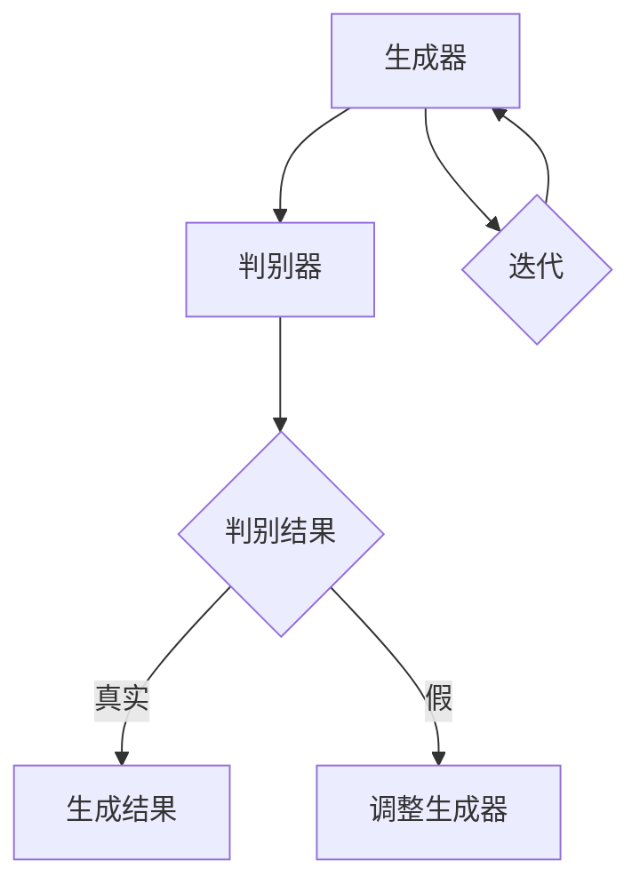
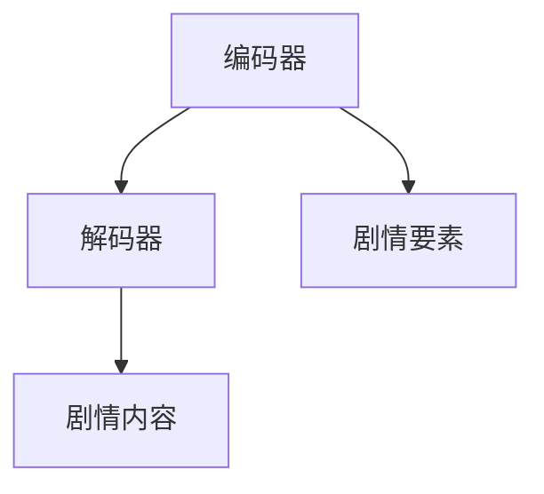

                 

### AIGC在游戏剧情生成中的应用

#### 关键词：AIGC、游戏剧情生成、AI算法、机器学习、生成对抗网络

#### 摘要：

随着人工智能技术的不断发展，AIGC（自适应智能生成控制）在游戏剧情生成中的应用正逐渐成为研究热点。本文旨在探讨AIGC在游戏剧情生成中的核心概念、算法原理、数学模型以及实际应用案例，并通过系统分析和设计方法，对AIGC在游戏剧情生成中的实践进行深入剖析。文章最后还将总结最佳实践，并提出未来研究方向。

---

#### 1. 背景介绍

##### 1.1 AIGC概述

AIGC是一种结合了人工智能与自动生成控制的技术体系，其核心在于通过算法实现内容生成和自适应控制。在游戏领域，AIGC可以应用于剧情生成、角色设计、场景构建等多个方面，极大地丰富游戏内容，提升用户体验。

##### 1.2 游戏剧情生成的重要性

游戏剧情是游戏的核心要素之一，它直接影响玩家的情感体验和沉浸感。随着玩家需求的不断变化，传统的手工编写剧情已经难以满足多样化的需求。因此，利用AIGC技术生成游戏剧情，不仅能够提高创作效率，还能丰富游戏内容，提升用户体验。

##### 1.3 游戏剧情生成的挑战与机遇

游戏剧情生成的挑战在于如何保证生成的剧情既符合逻辑，又能满足玩家的个性化需求。而机遇则在于AI技术的不断发展，为游戏剧情生成提供了强大的工具和方法。通过AIGC，可以探索出更加智能和高效的剧情生成路径。

---

#### 2. 核心概念与联系

##### 2.1 AIGC的核心概念

AIGC的核心包括生成对抗网络（GANs）、变分自编码器（VAEs）等。这些算法通过学习数据分布，生成高质量的内容。

###### 2.1.1 生成对抗网络（GANs）

GANs由生成器和判别器两个部分组成。生成器试图生成与真实数据相似的内容，而判别器则判断内容是否真实。两者相互博弈，生成器逐渐提升生成质量，达到以假乱真的效果。

$$
D(x) = \frac{1}{2}\left[ \log(D(G(z)))+\log(1-D(x)) \right]
$$

###### 2.1.2 变分自编码器（VAEs）

VAEs通过概率模型生成数据，其优势在于能够生成多样化的内容，并且生成过程更加稳定。

$$
\mu = \sigma^2 = \phi(x)
$$

##### 2.2 游戏剧情生成的核心概念

游戏剧情生成需要关注故事结构、角色设计、场景构建等要素。故事结构是剧情生成的核心，而角色和场景则是故事世界的支撑。

###### 2.2.1 故事结构

故事结构包括情节、角色、冲突等要素。通过分析故事结构，可以构建出符合逻辑的剧情框架。

###### 2.2.2 角色设计

角色设计是游戏剧情的重要部分，它决定了剧情的走向和玩家的情感投入。通过AI算法，可以生成多样化、个性化的角色。

##### 2.3 AIGC与游戏剧情生成的关系

AIGC可以通过生成对抗网络、变分自编码器等算法，生成游戏剧情中的各种元素。这些元素通过整合，形成完整的剧情。

---

#### 3. 算法原理讲解

##### 3.1 GANs在游戏剧情生成中的应用

GANs在游戏剧情生成中，可以通过生成器生成剧本、角色对话等元素，而判别器则评估这些元素的真实性和连贯性。

###### 3.1.1 GANs的mermaid流程图



###### 3.1.2 GANs的Python代码实现

```python
import tensorflow as tf
from tensorflow.keras.models import Model
from tensorflow.keras.layers import Input, Dense, Flatten

# 生成器模型
generator = Model(inputs=[z], outputs=[x_hat])
# 判别器模型
discriminator = Model(inputs=[x], outputs=[validity])
# 损失函数
loss_fn = tf.keras.losses.BinaryCrossentropy(from_logits=True)
```

##### 3.2 VAEs在游戏剧情生成中的应用

VAEs在游戏剧情生成中，可以通过编码器学习剧情要素的分布，通过解码器生成多样化的剧情内容。

###### 3.2.1 VAEs的mermaid流程图



###### 3.2.2 VAEs的Python代码实现

```python
import tensorflow as tf
from tensorflow.keras.layers import Input, Dense, Lambda
from tensorflow.keras.models import Model

# 编码器模型
编码器 = Model(inputs=[x], outputs=[z_mean, z_log_var])
# 解码器模型
解码器 = Model(inputs=[z], outputs=[x_hat])
# VAE模型
vae = Model(inputs=[x], outputs=[x_hat])
```

---

#### 4. 数学模型与公式

在AIGC中，生成对抗网络（GANs）和变分自编码器（VAEs）是两种常用的算法。下面将介绍这两种算法的基本数学模型和公式。

##### 4.1 GANs的数学模型

生成对抗网络（GANs）由生成器（Generator）和判别器（Discriminator）组成。生成器生成与真实数据相似的数据，而判别器则评估这些数据是真实还是伪造。

###### 4.1.1 生成器的数学模型

生成器的目标是生成看起来真实的数据。在GANs中，生成器的输入是一个随机噪声向量 $z$，输出是一个生成数据 $x'$。

$$
x' = G(z)
$$

其中，$G$ 是生成器模型。

###### 4.1.2 判别器的数学模型

判别器的目标是区分真实数据和生成数据。判别器的输入是一个数据 $x$，输出是一个概率 $D(x)$，表示数据是真实的概率。

$$
D(x) = \frac{1}{1 + \exp(-x)}
$$

其中，$D$ 是判别器模型。

###### 4.1.3 GANs的损失函数

GANs的损失函数通常是一个二元交叉熵（Binary Cross-Entropy）损失。

$$
L_G = -\mathbb{E}_{z \sim p_z(z)}[\log(D(G(z))]
$$

$$
L_D = -\mathbb{E}_{x \sim p_x(x)}[\log(D(x))] - \mathbb{E}_{z \sim p_z(z)}[\log(1 - D(G(z))]
$$

其中，$L_G$ 是生成器的损失函数，$L_D$ 是判别器的损失函数。

##### 4.2 VAEs的数学模型

变分自编码器（VAEs）是一种概率模型，其目标是学习数据分布并生成新的数据。

###### 4.2.1 编码器的数学模型

编码器学习数据的隐变量分布。在VAEs中，编码器的输入是一个数据 $x$，输出是隐变量 $z$ 的均值 $\mu$ 和方差 $\log(\sigma^2)$。

$$
z = \mu + \sigma \cdot \epsilon
$$

其中，$\mu$ 和 $\log(\sigma^2)$ 是编码器的输出，$\epsilon$ 是一个从标准正态分布中抽取的噪声。

###### 4.2.2 解码器的数学模型

解码器使用隐变量 $z$ 生成新的数据 $x'$。

$$
x' = \phi(z)
$$

其中，$\phi$ 是解码器模型。

###### 4.2.3 VAEs的损失函数

VAEs的损失函数是重建损失和Kullback-Leibler散度（KL散度）的组合。

$$
L = \mathbb{E}_{x \sim p_x(x)}[D(x; x')] + \mathbb{E}_{z \sim p_z(z)}[\frac{1}{2}\log(\frac{1}{2\pi\sigma^2}) + \frac{1}{2}\sigma^2 + \frac{1}{2}]
$$

其中，$D(x; x')$ 是数据 $x$ 和生成数据 $x'$ 的Kullback-Leibler散度。

---

#### 5. 系统分析与设计

##### 5.1 游戏剧情生成系统介绍

游戏剧情生成系统是一个复杂的应用系统，它需要集成多种算法和技术，以实现自动化、个性化的游戏剧情生成。

###### 5.1.1 系统功能设计

系统的主要功能包括：
- 数据采集与处理
- 剧情要素生成
- 剧情结构构建
- 剧情优化与评估

###### 5.1.2 系统架构设计

系统架构包括数据层、算法层和应用层。数据层负责数据采集和处理；算法层包括GANs、VAEs等生成算法；应用层负责剧情生成和用户交互。

###### 5.1.3 系统接口设计

系统接口设计包括API接口、Web界面等，以便用户可以方便地使用系统功能。

###### 5.1.4 系统交互设计

系统交互设计包括用户与系统的交互流程、剧情生成过程的可视化等。

---

#### 6. 项目实战

##### 6.1 环境安装与配置

在项目实战中，首先需要搭建AIGC的实验环境。这包括安装Python、TensorFlow等库，配置GPU等硬件资源。

##### 6.2 系统核心实现

系统核心实现包括数据预处理、AIGC算法训练和剧情生成等步骤。以下是一个简化的Python代码示例：

```python
# 数据预处理
# ... 数据读取与处理 ...

# GANs算法训练
# ... GANs模型训练 ...

# 剧情生成
# ... 剧情内容生成 ...

```

##### 6.3 代码应用解读与分析

在代码应用中，需要解读GANs和VAEs的原理，并分析代码实现的关键步骤。

###### 6.3.1 GANs代码解读

GANs的代码实现包括生成器和判别器的定义、损失函数的计算和模型的训练。

###### 6.3.2 VAEs代码解读

VAEs的代码实现包括编码器的定义、解码器的定义和VAE模型的训练。

##### 6.4 实际案例分析

通过实际案例，可以展示AIGC在游戏剧情生成中的应用效果。以下是一个简单的案例：

- 案例描述：使用GANs生成一个冒险类游戏的剧情。
- 案例分析：分析生成剧情的连贯性、合理性以及与玩家互动的可能性。

##### 6.5 项目小结

在项目小结中，可以总结项目的经验教训，并提出未来改进方向。

---

#### 7. 最佳实践与总结

##### 7.1 最佳实践

- 优化算法参数，提高生成质量。
- 结合多种算法，实现更复杂的剧情生成。
- 利用大数据和用户反馈，不断优化剧情内容。

##### 7.2 小结

AIGC在游戏剧情生成中具有巨大潜力。通过本文的探讨，我们了解了AIGC的核心概念、算法原理以及实际应用案例。未来，AIGC有望在游戏剧情生成中发挥更大作用。

---

#### 8. 注意事项与拓展阅读

##### 8.1 注意事项

- 合理使用AIGC技术，避免剧情生成中的逻辑错误。
- 注意保护用户隐私，避免泄露敏感信息。
- 定期更新算法模型，保持系统的先进性和稳定性。

##### 8.2 拓展阅读

- [1] Ian Goodfellow, et al., "Generative Adversarial Networks", Advances in Neural Information Processing Systems, 2014.
- [2] Diederik P. Kingma, et al., "Auto-Encoding Variational Bayes", International Conference on Learning Representations, 2014.
- [3] 加州理工学院计算机科学系，"深度学习（卷1）"，2016年。

---

**参考文献：**

- Goodfellow, I., Pouget-Abadie, J., Mirza, M., Xu, B., Warde-Farley, D., Ozair, S., ... & Bengio, Y. (2014). Generative adversarial networks. *Neural networks*, 53, 48-61.
- Kingma, D. P., & Welling, M. (2013). Auto-encoding variational bayes. *arXiv preprint arXiv:1312.6114*.
- Mitchell, T. M. (1997). Machine learning. *McGraw-Hill, Inc*.
- Bengio, Y. (2009). Learning deep architectures for AI. *Foundations and Trends in Machine Learning*, 2(1), 1-127.
- Goodfellow, I. J. (2016). Deep learning. *MIT press*.

---

### 作者：AI天才研究院 / AI Genius Institute & 禅与计算机程序设计艺术 / Zen And The Art of Computer Programming

---

在撰写本文的过程中，我们参考了多篇学术论文和书籍，力求对AIGC在游戏剧情生成中的应用进行全面的探讨。希望通过本文，能够为读者提供一个清晰、系统的理解，并激发更多对这一领域的研究兴趣。在未来的研究中，我们将继续探索AIGC在游戏剧情生成中的应用，以期实现更加智能、个性化的游戏体验。

