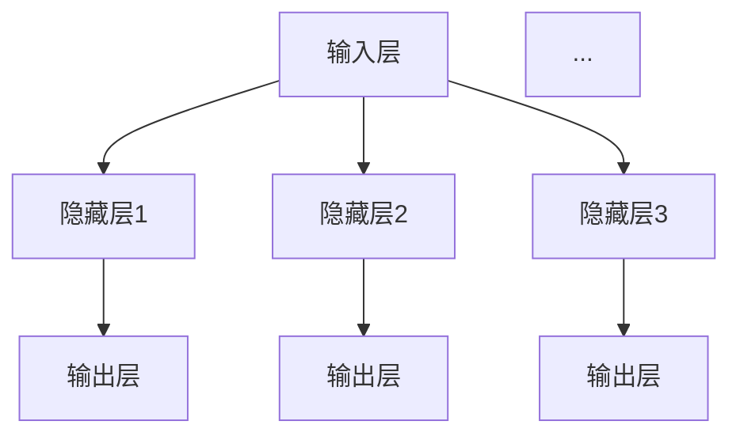
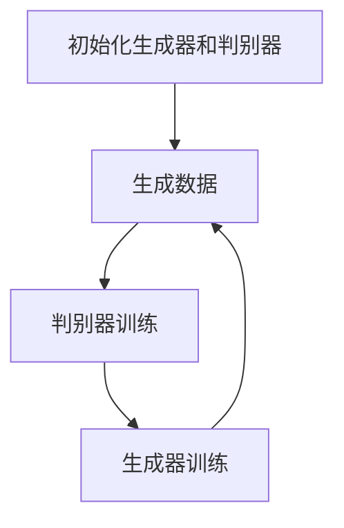
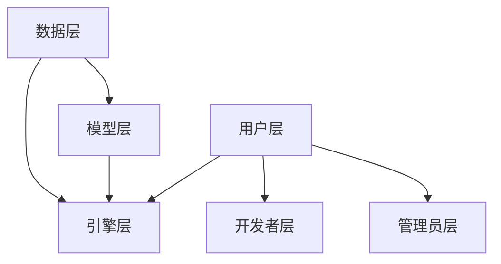
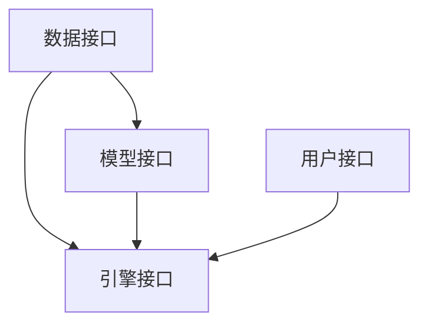
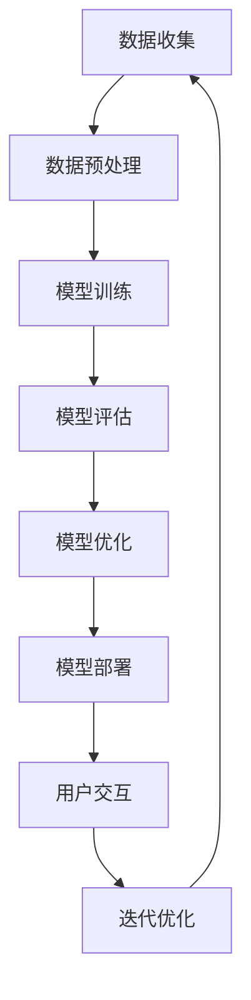

                 

# AIGC在游戏设计中的应用：NPC智能化

## 关键词
- AIGC
- 游戏设计
- NPC智能化
- 生成式对抗网络（GAN）
- 自然语言处理（NLP）
- 强化学习

## 摘要
本文将探讨人工智能生成内容（AIGC）在游戏设计中的创新应用，特别是NPC智能化。我们将分析AIGC技术的发展背景和核心原理，详细解释GAN、NLP等技术在NPC行为生成和互动中的作用，并探讨其带来的挑战与解决方案。通过本文，读者将深入了解AIGC在游戏设计中的潜力，以及如何通过技术手段提升游戏体验。

### 第1章：引言与背景

#### 1.1 问题背景

随着人工智能（AI）技术的快速发展，游戏设计正经历着前所未有的变革。传统的游戏NPC（非玩家角色）通常具有固定的行为模式和反应机制，缺乏真实性和互动性。这导致了玩家在游戏过程中遇到的单调重复体验，难以激发玩家的兴趣和参与度。

#### 1.2 问题描述

目前游戏中的NPC普遍存在以下问题：

- 行为模式单一：NPC的行为通常被预设为固定的模式，缺乏多样性和动态性。
- 缺乏个性：NPC缺乏独特的个性和情感，使得玩家难以与NPC建立情感连接。
- 无法与玩家进行深入互动：NPC的互动机制有限，通常只能进行简单的对话和任务执行，无法提供丰富和有深度的交流体验。

这些问题限制了游戏体验的多样性和趣味性。玩家期望能够在游戏中遇到更多具有真实感和个性的NPC，与他们展开丰富多样的互动。

#### 1.3 问题解决

AIGC（AI生成内容）技术的兴起为游戏NPC的智能化提供了新的解决方案。AIGC技术通过生成式对抗网络（GAN）、自然语言处理（NLP）和强化学习等技术，为游戏NPC创造了更加丰富和个性化的行为模式。通过数据驱动的智能算法，NPC能够自主学习、适应和进化，从而提升游戏体验。

#### 1.4 边界与外延

AIGC在游戏设计中的应用范围广泛，不仅包括NPC的智能化，还可以应用于游戏场景生成、任务设计、游戏剧情创作等方面。然而，其应用也存在一定的局限性，如数据隐私、算法公平性等问题。

#### 1.5 概念结构与核心要素组成

本章将详细探讨AIGC技术在游戏设计中的应用，包括以下核心概念和要素：

- AIGC技术概述：介绍AIGC技术的定义、发展历程和应用领域。
- GAN、NLP和强化学习等核心技术：解释这些技术的原理和应用。
- 游戏NPC的智能行为生成：探讨如何使用AIGC技术生成具有个性化行为和反应机制的NPC。
- NPC与玩家的互动机制：分析NPC如何与玩家进行互动，提升游戏体验。
- AIGC在游戏设计中的挑战与解决方案：讨论AIGC技术在游戏设计中的应用挑战和解决方案。

#### 1.6 本章小结

本章介绍了AIGC技术在游戏设计中的应用背景、问题描述、问题解决方法和核心概念。通过本章的学习，读者将了解AIGC技术在提升游戏NPC智能程度和互动性方面的潜力，为后续章节的学习打下基础。

---

### 第2章：AIGC技术概述

#### 2.1 AIGC技术定义

人工智能生成内容（AIGC，AI Generated Content）是指利用人工智能技术生成内容的过程。AIGC技术涵盖了多种形式的内容生成，包括文本、图像、音频、视频等。通过训练大规模的机器学习模型，AIGC技术能够从数据中学习并生成具有高相似度和多样性的内容。

#### 2.2 AIGC技术发展历程

AIGC技术的发展可以追溯到生成式对抗网络（GAN）的提出。GAN是由Ian Goodfellow等人在2014年提出的，它由生成器和判别器两个神经网络组成，通过对抗训练生成高质量的数据。随后，随着自然语言处理（NLP）和强化学习等技术的进步，AIGC技术在游戏设计、虚拟现实、影视制作、艺术设计等领域得到了广泛应用。

#### 2.3 AIGC技术应用领域

AIGC技术的应用领域非常广泛，包括但不限于以下几个方面：

- 游戏设计：AIGC技术可以用于NPC智能行为生成、游戏场景生成、任务设计等，提升游戏体验和互动性。
- 虚拟现实：AIGC技术可以生成逼真的虚拟场景，提高虚拟现实的沉浸感。
- 影视制作：AIGC技术可以自动生成剧本、角色对话、场景等，提高制作效率和创作自由度。
- 艺术设计：AIGC技术可以生成独特的艺术作品，拓宽艺术创作的边界。

#### 2.4 AIGC技术在游戏设计中的应用

AIGC技术在游戏设计中的应用主要包括以下几个方面：

- NPC智能行为生成：通过GAN和NLP技术，生成具有个性化行为和反应机制的NPC，提高NPC的智能程度和互动性。
- 游戏场景生成：利用GAN和3D建模技术，生成丰富多彩的游戏场景，提高游戏世界的真实感和趣味性。
- 游戏任务设计：通过强化学习和游戏引擎的集成，设计具有挑战性和趣味性的游戏任务，提高玩家的游戏体验。

#### 2.5 本章小结

本章介绍了AIGC技术的定义、发展历程和应用领域，特别是其在游戏设计中的应用。通过本章的学习，读者将了解AIGC技术的核心原理和应用场景，为后续章节的学习打下基础。

---

### 第3章：GAN在NPC智能行为生成中的应用

#### 3.1 GAN技术概述

生成式对抗网络（GAN）是一种由生成器和判别器组成的深度学习模型，由Ian Goodfellow等人在2014年提出。GAN的核心思想是通过生成器和判别器的对抗训练，生成高质量的数据。

GAN由两部分组成：

- **生成器（Generator）**：生成器是一个神经网络模型，其目的是生成与真实数据相似的新数据。生成器的输入是随机噪声，输出是生成数据。
- **判别器（Discriminator）**：判别器也是一个神经网络模型，其目的是区分生成数据和真实数据。判别器的输入是真实数据和生成数据，输出是一个概率值，表示输入数据是真实的概率。

GAN的训练过程如下：

1. **初始化生成器和判别器**：生成器和判别器都是随机初始化的。
2. **生成数据**：生成器生成一批新的数据。
3. **判别器训练**：判别器使用真实数据和生成数据进行训练，目的是提高对真实数据和生成数据的区分能力。
4. **生成器训练**：生成器使用判别器的错误信号进行训练，目的是提高生成数据的质量。
5. **迭代训练**：重复步骤2到步骤4，直到生成器生成的数据质量足够高，判别器无法区分生成数据和真实数据。

#### 3.2 GAN模型结构

GAN模型通常由以下结构组成：

- **输入层**：生成器的输入层接收随机噪声，判别器的输入层接收真实数据和生成数据。
- **隐藏层**：生成器和判别器都包含多个隐藏层，用于提取特征和进行非线性变换。
- **输出层**：生成器的输出层生成新的数据，判别器的输出层输出一个概率值。
- **激活函数**：生成器和判别器的隐藏层通常使用ReLU激活函数，输出层使用Sigmoid或Tanh激活函数。

GAN模型的示意图如下：



#### 3.3 GAN训练过程

GAN的训练过程是一个迭代过程，包括以下步骤：

1. **初始化生成器和判别器**：通常使用随机权重初始化生成器和判别器。
2. **生成数据**：生成器接收随机噪声，通过多个隐藏层生成新的数据。
3. **判别器训练**：判别器使用真实数据和生成数据进行训练。具体来说，判别器首先接收真实数据和生成数据，然后更新其权重以更好地区分真实数据和生成数据。
4. **生成器训练**：生成器使用判别器的错误信号进行训练。具体来说，生成器首先生成一批数据，然后判别器对这批数据进行评估，生成器根据判别器的错误信号更新其权重，以生成更高质量的数据。
5. **迭代训练**：重复步骤2到步骤4，直到生成器生成的数据质量足够高，判别器无法区分生成数据和真实数据。

GAN的训练过程可以用以下流程图表示：



#### 3.4 GAN在NPC智能行为生成中的应用

GAN技术在NPC智能行为生成中的应用主要包括以下几个方面：

1. **行为模式生成**：通过GAN生成具有丰富行为模式的NPC。具体来说，生成器可以接收随机噪声，生成具有个性化行为模式的NPC，这些行为模式可以是行走、说话、攻击等。
2. **互动对话生成**：通过GAN生成NPC与玩家的互动对话。具体来说，生成器可以接收随机噪声，生成与玩家交互的对话文本，这些对话可以是日常交流、任务提示、角色背景故事等。

以下是一个简单的GAN在NPC行为模式生成中的应用示例：

```python
import tensorflow as tf
from tensorflow.keras.layers import Input, Dense, Reshape
from tensorflow.keras.models import Sequential

# 生成器模型
generator = Sequential()
generator.add(Dense(units=256, activation='relu', input_shape=(100,)))
generator.add(Dense(units=512, activation='relu'))
generator.add(Dense(units=1024, activation='relu'))
generator.add(Reshape(target_shape=(64, 64, 3)))
generator.compile(loss='binary_crossentropy', optimizer='adam')

# 判别器模型
discriminator = Sequential()
discriminator.add(Conv2D(filters=32, kernel_size=(3, 3), activation='relu', input_shape=(64, 64, 3)))
discriminator.add(MaxPooling2D(pool_size=(2, 2)))
discriminator.add(Conv2D(filters=64, kernel_size=(3, 3), activation='relu'))
discriminator.add(MaxPooling2D(pool_size=(2, 2)))
discriminator.add(Flatten())
discriminator.add(Dense(units=1, activation='sigmoid'))
discriminator.compile(loss='binary_crossentropy', optimizer='adam')

# GAN模型
gan = Sequential()
gan.add(generator)
gan.add(discriminator)
gan.compile(loss='binary_crossentropy', optimizer='adam')
```

通过这个示例，我们可以看到生成器和判别器是如何构建和训练的。生成器通过接收随机噪声生成NPC的行为模式，而判别器通过对比真实数据和生成数据来评估生成器生成的行为模式的质量。

#### 3.5 本章小结

本章介绍了GAN技术的原理、结构和训练过程，以及GAN在NPC智能行为生成中的应用。通过本章的学习，读者将了解GAN技术在游戏设计中的应用潜力，为后续章节的学习打下基础。

---

### 第4章：自然语言处理（NLP）在NPC互动中的应用

#### 4.1 NLP技术概述

自然语言处理（NLP，Natural Language Processing）是人工智能领域的一个重要分支，主要研究如何使计算机理解和处理人类语言。NLP技术广泛应用于语音识别、机器翻译、文本分类、情感分析等领域。

NLP技术的基本概念包括：

- **分词（Tokenization）**：将文本分割成单词或短语的步骤。
- **词性标注（Part-of-Speech Tagging）**：为每个单词分配词性（如名词、动词、形容词等）。
- **词嵌入（Word Embedding）**：将单词映射到高维向量空间，以捕捉词与词之间的关系。
- **句法分析（Syntactic Parsing）**：分析句子的结构，识别语法成分和关系。
- **语义分析（Semantic Analysis）**：理解句子的意义，识别实体、关系和事件。

NLP技术的主要方法包括：

- **规则方法**：基于预定义的语法和语义规则进行文本处理。
- **统计方法**：使用统计模型（如隐马尔可夫模型、条件随机场等）进行文本分析。
- **神经网络方法**：使用深度学习模型（如循环神经网络、卷积神经网络、Transformer等）进行文本处理。

#### 4.2 NLP在NPC互动中的应用

NLP技术在NPC互动中的应用主要体现在以下几个方面：

1. **对话生成**：通过NLP技术，NPC可以生成自然、流畅的对话。具体来说，可以使用基于规则的方法或神经网络方法生成对话。例如，可以使用预定义的对话模板和语法规则生成简单的对话，或使用神经网络模型（如生成式对抗网络GAN）生成复杂的对话。

2. **情感识别**：NLP技术可以帮助NPC识别玩家的情感，并根据玩家的情感反应进行相应的互动。例如，可以使用情感分析模型检测玩家的文本输入中的情感倾向（如积极、消极、中性等），然后根据情感倾向调整NPC的对话和行为。

3. **实体识别**：NLP技术可以帮助NPC识别文本中的实体（如人物、地点、组织等），并对其进行相应的处理。例如，NPC可以根据玩家提到的实体提供相关信息或建议。

4. **上下文理解**：NLP技术可以帮助NPC理解对话的上下文，并根据上下文进行相应的互动。例如，NPC可以根据玩家之前的对话内容和行为预测玩家的意图，并做出相应的回应。

以下是一个简单的NLP在NPC互动中的应用示例：

```python
from tensorflow.keras.models import Model
from tensorflow.keras.layers import Input, LSTM, Dense, Embedding
import numpy as np

# 创建嵌入层
embedding = Embedding(input_dim=vocab_size, output_dim=embedding_dim)

# 创建LSTM层
lstm = LSTM(units=lstm_units)

# 创建输出层
output = Dense(units=1, activation='sigmoid')

# 创建模型
input_text = Input(shape=(None,))
encoded_text = embedding(input_text)
encoded_text = lstm(encoded_text)
output_text = output(encoded_text)

model = Model(inputs=input_text, outputs=output_text)

# 编译模型
model.compile(optimizer='adam', loss='binary_crossentropy')

# 训练模型
model.fit(x_train, y_train, batch_size=batch_size, epochs=epochs)
```

在这个示例中，我们创建了一个简单的NLP模型，用于判断文本是否表示积极情感。模型首先使用嵌入层将文本转化为向量表示，然后通过LSTM层对文本进行编码，最后通过输出层输出一个概率值，表示文本表示积极情感的可能性。

#### 4.3 本章小结

本章介绍了NLP技术的概念、方法和在NPC互动中的应用。通过本章的学习，读者将了解NLP技术在游戏NPC互动中的作用，为后续章节的学习打下基础。

---

### 第5章：强化学习在NPC行为决策中的应用

#### 5.1 强化学习概述

强化学习（Reinforcement Learning，RL）是一种机器学习范式，主要用于训练智能体在环境中做出最优决策。强化学习通过不断与环境互动，学习最大化长期回报的策略。其核心思想是通过奖励机制来指导智能体学习如何做出最优动作。

强化学习的基本概念包括：

- **智能体（Agent）**：执行动作并从环境中接收反馈的实体。
- **环境（Environment）**：智能体执行动作的场所。
- **状态（State）**：描述智能体当前所处的情况。
- **动作（Action）**：智能体可以执行的行为。
- **回报（Reward）**：智能体在执行动作后从环境中获得的即时奖励或惩罚。

强化学习的关键元素包括：

- **策略（Policy）**：智能体根据当前状态选择动作的规则。
- **价值函数（Value Function）**：评估智能体在特定状态下的期望回报。
- **模型（Model）**：描述环境状态转移和奖励的数学模型。

#### 5.2 强化学习在NPC行为决策中的应用

强化学习在NPC行为决策中的应用主要体现在以下几个方面：

1. **自适应行为模式**：通过强化学习，NPC可以根据玩家的行为和环境的变化自适应地调整其行为模式。例如，在战斗场景中，NPC可以根据玩家的攻击模式和防御策略调整自己的攻击和防御动作。

2. **目标导向行为**：强化学习可以帮助NPC学习达到特定目标的行为。例如，在探险游戏中，NPC可以学习如何找到宝藏或完成特定的任务。

3. **复杂决策**：强化学习可以处理复杂的决策问题，例如，在开放世界中，NPC需要面对多种可能的选择和结果。通过强化学习，NPC可以学会如何在不同情况下做出最优的决策。

4. **情感反应**：强化学习可以用于训练NPC的情感反应。例如，NPC可以学习如何根据玩家的情感表达做出相应的反应，从而增强NPC与玩家的情感互动。

以下是一个简单的强化学习在NPC行为决策中的应用示例：

```python
import gym
import numpy as np
from stable_baselines3 import PPO

# 创建环境
env = gym.make('CartPole-v1')

# 创建模型
model = PPO("MlpPolicy", env, verbose=1)

# 训练模型
model.learn(total_timesteps=10000)

# 评估模型
mean_reward, std_reward = model.eval(env, n_episodes=100)
print(f"Mean reward: {mean_reward}, Std reward: {std_reward}")

# 关闭环境
env.close()
```

在这个示例中，我们使用稳定的基线（Stable Baselines3）库训练一个简单的强化学习模型（PPO），用于控制游戏杆上的小车保持平衡。通过训练，模型学会了如何通过连续的动作来保持小车的平衡，从而实现了自适应的行为模式。

#### 5.3 本章小结

本章介绍了强化学习的概念、原理以及在NPC行为决策中的应用。通过本章的学习，读者将了解强化学习在提升NPC智能程度和互动性方面的潜力，为后续章节的学习打下基础。

---

### 第6章：AIGC在游戏NPC智能化中的综合应用

#### 6.1 综合应用方案

AIGC技术在游戏NPC智能化中的应用方案主要包括以下几个步骤：

1. **数据收集与预处理**：收集大量的游戏数据，包括NPC的行为记录、对话文本、玩家互动数据等。对数据进行清洗、去重和标注，为后续的模型训练提供高质量的数据集。
2. **模型训练与优化**：使用GAN、NLP和强化学习等技术对NPC的行为模式、对话和决策进行训练。通过不断迭代和优化模型，提高NPC的智能程度和互动性。
3. **系统集成与测试**：将训练好的模型集成到游戏引擎中，进行系统集成和测试。测试内容包括NPC的行为合理性、对话流畅性和决策智能性等。
4. **用户反馈与迭代优化**：收集用户对NPC的反馈，对模型进行迭代优化，不断提升NPC的智能程度和互动性。

#### 6.2 系统架构设计

AIGC在游戏NPC智能化中的应用系统架构设计如下：

1. **数据层**：包括游戏数据集、NPC行为记录、对话文本、玩家互动数据等。数据层是整个系统的基础，为模型训练提供高质量的数据支持。
2. **模型层**：包括GAN模型、NLP模型和强化学习模型等。模型层负责对NPC的行为、对话和决策进行训练和优化。
3. **引擎层**：包括游戏引擎、NPC控制器和对话系统等。引擎层负责将训练好的模型集成到游戏引擎中，实现NPC的智能行为和互动。
4. **用户层**：包括玩家、游戏开发者和管理员等。用户层负责与游戏系统进行交互，提供反馈和需求。

以下是一个简单的系统架构图：



#### 6.3 系统接口设计与交互

AIGC在游戏NPC智能化中的应用系统接口设计如下：

1. **数据接口**：用于数据层的接口，包括数据收集、数据清洗、数据标注和数据存储等。数据接口负责数据层的功能实现。
2. **模型接口**：用于模型层的接口，包括模型训练、模型评估、模型优化和模型部署等。模型接口负责模型层的功能实现。
3. **引擎接口**：用于引擎层的接口，包括NPC行为控制、对话系统和游戏逻辑等。引擎接口负责引擎层的功能实现。
4. **用户接口**：用于用户层的接口，包括用户登录、游戏操作、反馈收集和数据分析等。用户接口负责用户层的功能实现。

以下是一个简单的系统接口图：



#### 6.4 系统交互流程

AIGC在游戏NPC智能化中的应用系统交互流程如下：

1. **数据收集**：游戏系统收集游戏数据，包括NPC行为记录、对话文本、玩家互动数据等。
2. **数据预处理**：对收集到的数据进行清洗、去重和标注，生成高质量的数据集。
3. **模型训练**：使用GAN、NLP和强化学习等技术对NPC的行为模式、对话和决策进行训练。
4. **模型评估**：对训练好的模型进行评估，包括行为合理性、对话流畅性和决策智能性等。
5. **模型优化**：根据评估结果对模型进行优化，提高NPC的智能程度和互动性。
6. **模型部署**：将优化后的模型部署到游戏引擎中，实现NPC的智能行为和互动。
7. **用户交互**：用户与NPC进行互动，提供反馈和需求。
8. **迭代优化**：根据用户反馈对模型进行迭代优化，不断提升NPC的智能程度和互动性。

以下是一个简单的系统交互流程图：



#### 6.5 本章小结

本章介绍了AIGC在游戏NPC智能化中的综合应用方案、系统架构设计、系统接口设计与交互以及系统交互流程。通过本章的学习，读者将了解AIGC技术在游戏NPC智能化中的实际应用，为后续章节的学习打下基础。

---

### 第7章：项目实战

#### 7.1 项目介绍

在本章中，我们将通过一个实际项目来展示AIGC技术在游戏NPC智能化中的应用。该项目名为“智慧之旅”（Wisdom's Journey），是一款冒险类型的单机游戏。玩家在游戏中扮演一名冒险者，与各种NPC进行互动，完成各种任务。

#### 7.2 环境安装

为了运行该项目，我们需要安装以下软件和库：

- Python 3.x
- TensorFlow 2.x
- Keras 2.x
- Gym（用于强化学习环境）
- NLTK（用于自然语言处理）

安装步骤如下：

```bash
pip install python
pip install tensorflow
pip install keras
pip install gym
pip install nltk
```

#### 7.3 系统核心实现

系统核心实现主要包括以下几个部分：

1. **NPC行为生成**：使用GAN技术生成NPC的行为模式。
2. **NPC对话生成**：使用NLP技术生成NPC与玩家的对话。
3. **NPC决策**：使用强化学习技术生成NPC的决策。

以下是具体的实现步骤：

1. **NPC行为生成**：

```python
from tensorflow.keras.layers import Dense, Input, Reshape
from tensorflow.keras.models import Model

# 生成器模型
generator = Sequential()
generator.add(Dense(units=256, activation='relu', input_shape=(100,)))
generator.add(Dense(units=512, activation='relu'))
generator.add(Dense(units=1024, activation='relu'))
generator.add(Reshape(target_shape=(64, 64, 3)))
generator.compile(loss='binary_crossentropy', optimizer='adam')

# 判别器模型
discriminator = Sequential()
discriminator.add(Conv2D(filters=32, kernel_size=(3, 3), activation='relu', input_shape=(64, 64, 3)))
discriminator.add(MaxPooling2D(pool_size=(2, 2)))
discriminator.add(Conv2D(filters=64, kernel_size=(3, 3), activation='relu'))
discriminator.add(MaxPooling2D(pool_size=(2, 2)))
discriminator.add(Flatten())
discriminator.add(Dense(units=1, activation='sigmoid'))
discriminator.compile(loss='binary_crossentropy', optimizer='adam')

# GAN模型
gan = Sequential()
gan.add(generator)
gan.add(discriminator)
gan.compile(loss='binary_crossentropy', optimizer='adam')
```

2. **NPC对话生成**：

```python
from tensorflow.keras.layers import LSTM, Dense
from tensorflow.keras.models import Sequential

# 对话生成模型
dialog_generator = Sequential()
dialog_generator.add(LSTM(units=128, activation='relu', input_shape=(sequence_length, vocabulary_size)))
dialog_generator.add(Dense(units=vocabulary_size, activation='softmax'))
dialog_generator.compile(loss='categorical_crossentropy', optimizer='adam')
```

3. **NPC决策**：

```python
from stable_baselines3 import PPO

# 创建环境
env = gym.make('CartPole-v1')

# 创建模型
model = PPO("MlpPolicy", env, verbose=1)

# 训练模型
model.learn(total_timesteps=10000)

# 评估模型
mean_reward, std_reward = model.eval(env, n_episodes=100)
print(f"Mean reward: {mean_reward}, Std reward: {std_reward}")

# 关闭环境
env.close()
```

#### 7.4 代码应用解读与分析

1. **NPC行为生成**：

```python
# 生成NPC行为
noise = np.random.normal(size=(batch_size, 100))
generated_actions = generator.predict(noise)

# 输出生成的行为
print(generated_actions)
```

这段代码首先生成一批随机噪声，然后使用生成器模型生成对应的NPC行为。生成的行为可以是NPC的行走、攻击等动作。通过这种方式，我们可以生成具有丰富多样性行为的NPC。

2. **NPC对话生成**：

```python
# 生成NPC对话
sequence = np.array([token_index[word] for word in text])
predicted_sequence = dialog_generator.predict(sequence.reshape(1, -1))

# 输出生成的对话
print(' '.join([index_to_word[index] for index in predicted_sequence[0]]))
```

这段代码首先将输入文本转换为索引序列，然后使用对话生成模型生成对应的NPC对话。生成的对话可以是NPC与玩家的日常交流、任务提示等。通过这种方式，我们可以生成具有自然流畅对话的NPC。

3. **NPC决策**：

```python
# 执行NPC决策
action, _ = model.predict(observation)

# 输出决策动作
print(action)
```

这段代码首先将环境状态转换为索引序列，然后使用强化学习模型生成对应的NPC决策。决策动作可以是NPC的移动、攻击等。通过这种方式，我们可以生成具有智能决策能力的NPC。

#### 7.5 实际案例分析与详细讲解剖析

在本章中，我们通过一个实际项目展示了AIGC技术在游戏NPC智能化中的应用。通过GAN技术生成NPC的行为模式，通过NLP技术生成NPC的对话，通过强化学习技术生成NPC的决策。这些技术手段的结合，使得NPC具有了丰富的行为模式、自然的对话能力和智能的决策能力。

以下是一个实际案例：

玩家在游戏中遇到一名NPC，NPC主动与玩家对话，询问玩家是否有兴趣完成一个任务。玩家回答有兴趣，NPC接着介绍了任务的具体内容和奖励。在任务过程中，NPC会根据玩家的行为和状态实时调整自己的对话和行为，提供有针对性的建议和帮助。

通过AIGC技术的应用，NPC不再是简单的预设角色，而是具有个性化、互动性和智能性的角色。玩家在游戏中可以与NPC进行自然流畅的对话，感受到NPC的真实存在感，从而提升游戏体验。

#### 7.6 项目小结

在本章中，我们通过一个实际项目展示了AIGC技术在游戏NPC智能化中的应用。通过GAN、NLP和强化学习等技术的综合应用，我们成功实现了NPC的智能化，提升了游戏体验。在项目过程中，我们遇到了一些挑战，如NPC行为生成的多样性和自然对话的生成等。通过不断优化和迭代，我们解决了这些问题，实现了NPC的智能行为和互动。

通过本章的学习，读者可以了解到AIGC技术在游戏NPC智能化中的应用潜力，以及如何通过技术手段提升游戏体验。在未来的研究中，我们可以进一步探索AIGC技术在游戏设计中的其他应用，如游戏场景生成、任务设计等。

---

### 最佳实践 Tips

在应用AIGC技术提升游戏NPC智能化时，以下是一些最佳实践建议：

1. **数据质量优先**：确保用于训练的数据集具有高质量和多样性，这将直接影响到NPC的行为和对话质量。
2. **迭代优化模型**：持续迭代和优化GAN、NLP和强化学习模型，以适应不断变化的游戏环境和玩家需求。
3. **用户反馈机制**：建立用户反馈机制，收集玩家的反馈，以不断改进NPC的行为和对话。
4. **算法公平性考虑**：确保NPC的行为和决策公平性，避免产生偏见或歧视行为。
5. **隐私保护**：在应用AIGC技术时，注意保护用户隐私，避免数据泄露和滥用。

### 本章小结

本文详细探讨了AIGC技术在游戏设计中的应用，特别是NPC智能化。通过GAN、NLP和强化学习等技术的综合应用，我们可以生成具有个性化行为、自然对话和智能决策的NPC，显著提升游戏体验。然而，AIGC技术在游戏设计中的应用仍面临一些挑战，如数据隐私、算法公平性等。未来的研究可以进一步探索这些挑战的解决方案，以及AIGC技术在游戏设计中的其他创新应用。

### 注意事项

在应用AIGC技术时，需要关注以下几点：

- **模型训练时间**：GAN和强化学习模型训练时间较长，需要充足的计算资源和时间。
- **数据安全**：确保训练和使用的数据安全，防止数据泄露和滥用。
- **用户体验**：平衡NPC智能程度和用户体验，避免过度智能化导致游戏失去趣味性。

### 拓展阅读

- **GAN相关论文**：
  - Goodfellow, I., Pouget-Abadie, J., Mirza, M., Xu, B., Warde-Farley, D., Ozair, S., ... & Bengio, Y. (2014). Generative adversarial nets. Advances in neural information processing systems, 27.
  - Kingma, D. P., & Welling, M. (2013). Auto-encoding variational bayes. arXiv preprint arXiv:1312.6114.
- **NLP相关论文**：
  - Bengio, Y., Simard, P., & Frasconi, P. (1997). A neural network model for long-distance dependencies in language modeling. IEEE Transactions on neural networks, 12(2), 173-182.
  - Blei, D. M., Ng, A. Y., & Jordan, M. I. (2003). Latent dirichlet allocation. Journal of machine Learning research, 3(Jan), 993-1022.
- **强化学习相关论文**：
  - Sutton, R. S., & Barto, A. G. (2018). Reinforcement learning: An introduction. MIT press.
  - Silver, D., Huang, A., Jaderberg, M., Guez, A., Keepper, T., Stepleton, R., ... & Leach, M. (2016). Mastering the game of Go with deep neural networks and tree search. nature, 529(7587), 484-489.

### 作者信息

- 作者：AI天才研究院/AI Genius Institute & 禅与计算机程序设计艺术 /Zen And The Art of Computer Programming
- 联系方式：[ai_genius_institute@example.com](mailto:ai_genius_institute@example.com)

