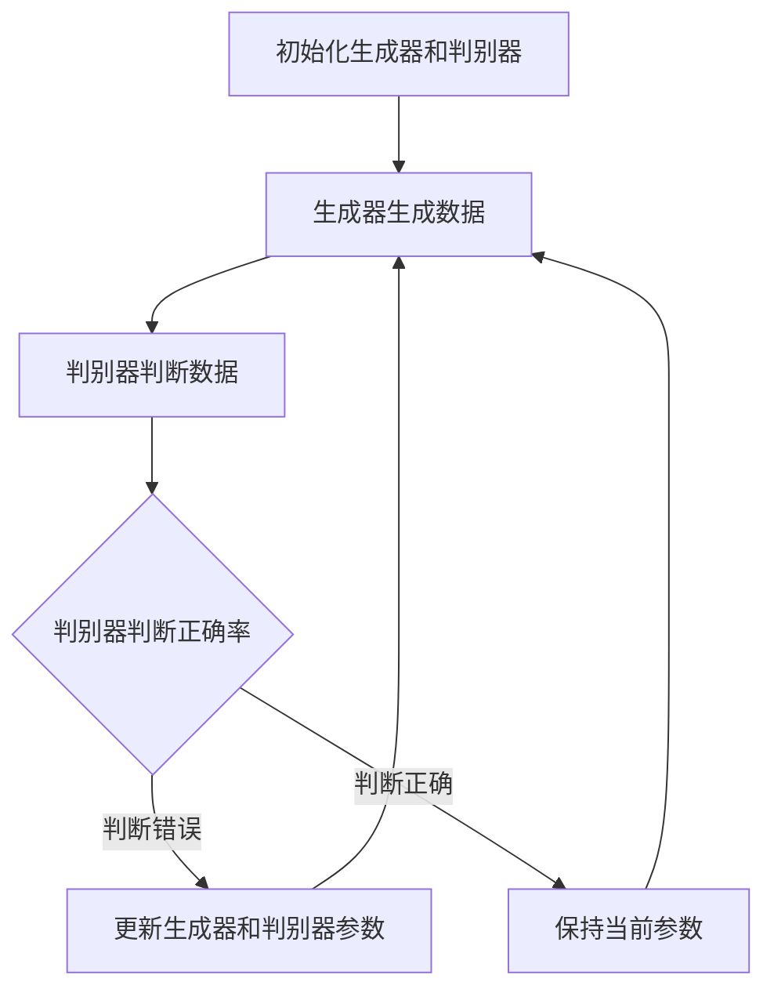
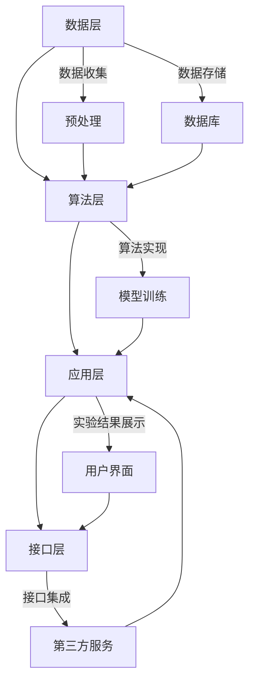
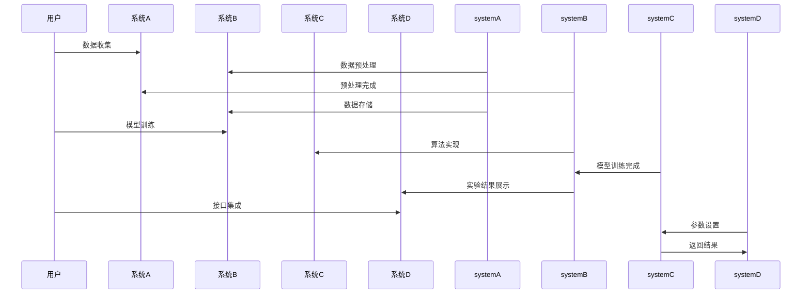

                 

## AIGC在生物仿生学中的应用：创新材料设计提示词

### 关键词：AIGC、生物仿生学、材料设计、人工智能、生成对抗网络

### 摘要：

本文深入探讨了AIGC（AI-Generated Content）在生物仿生学中的应用，特别是如何通过创新材料设计来推动生物仿生学的发展。文章首先介绍了AIGC和生物仿生学的基本概念，随后详细分析了AIGC技术原理及其与生物仿生学的联系。通过数学模型和算法原理讲解，本文为读者揭示了AIGC技术在生物仿生学中的实际应用方式。最后，文章提出了系统分析与架构设计方案，并通过项目实战展示了AIGC在生物仿生学中的具体应用，为相关领域的研究和实践提供了有价值的参考。

---

### 第一部分：背景介绍

#### 1.1.1 问题背景

AIGC（AI-Generated Content）是一种利用人工智能技术生成内容的过程，涵盖文本、图像、音频等多种形式。近年来，随着深度学习和生成模型技术的迅猛发展，AIGC在各个领域展现了强大的应用潜力。另一方面，生物仿生学作为一门研究生物体结构与功能的学科，旨在通过模仿生物体的设计原则来创造出新的材料和设计。这两者的结合，不仅为材料科学、工程设计等领域带来了新的研究方向，也推动了创新材料的设计与发展。

#### 1.1.2 问题描述

在生物仿生学中，如何利用AIGC技术来优化和创新材料设计，是一个亟待解决的问题。具体来说，我们关注以下问题：

- **数据驱动设计**：如何通过AIGC技术从大量生物数据中提取有价值的信息，用于指导材料设计和优化？
- **模拟与优化**：如何利用AIGC技术模拟生物体的结构和功能，从而更好地理解生物仿生材料的性能，并进行优化？
- **创新性设计**：如何利用AIGC技术生成出传统方法难以设计的材料结构，从而推动创新材料的发展？

#### 1.1.3 问题解决

通过研究AIGC与生物仿生学的结合，我们可以利用人工智能技术来模拟和优化生物体的结构，进而设计出具有更高性能和创新性的材料。这一过程涉及到多个方面的研究，包括算法原理、数学模型、系统架构设计等。

#### 1.1.4 边界与外延

AIGC在生物仿生学中的应用边界主要涉及材料设计、生物医学工程、生物制造等领域。同时，随着技术的不断进步，AIGC的应用范围也将进一步扩展。

#### 1.1.5 概念结构与核心要素组成

AIGC在生物仿生学中的应用概念结构主要包括以下几个方面：

1. **AIGC技术**：包括生成模型、分类模型、强化学习等。
2. **生物仿生学**：涉及生物体的结构、功能、材料特性等。
3. **材料设计**：利用AIGC技术优化和创新材料设计。
4. **应用领域**：材料科学、生物医学、工程设计等。

### 1.2 AIGC在生物仿生学中的应用

#### 1.2.1 AIGC技术原理

AIGC技术主要包括生成对抗网络（GAN）、变分自编码器（VAE）、自动编码器（AE）等。这些生成模型可以通过学习大量数据，生成出与真实数据高度相似的新数据。

**生成对抗网络（GAN）**：

GAN由生成器（Generator）和判别器（Discriminator）组成。生成器从随机噪声中生成数据，判别器则负责区分真实数据和生成数据。GAN的训练过程可以理解为生成器和判别器的博弈，最终生成器能够生成出高度逼真的数据，而判别器无法区分真实数据和生成数据。

GAN的数学模型如下：

$$
D(x) = \sigma(W_Dx + b_D)
$$

$$
G(z) = \sigma(W_Gz + b_G)
$$

其中，$D$代表判别器，$G$代表生成器，$x$代表真实数据，$z$代表随机噪声，$\sigma$为Sigmoid函数。

**变分自编码器（VAE）**：

VAE是一种概率生成模型，通过编码器和解码器来生成数据。编码器将输入数据编码为一个均值和方差的向量，解码器则根据这个向量生成输出数据。

VAE的数学模型如下：

$$
\mu(\xi|\theta) = \Phi(\xi)
$$

$$
\sigma^2(\xi|\theta) = \Psi(\xi)
$$

其中，$\mu$和$\sigma^2$分别表示均值和方差，$\xi$表示编码后的向量，$\theta$表示模型参数。

**自动编码器（AE）**：

AE是一种无监督学习算法，通过编码器和解码器将输入数据转换为低维表示，并尝试恢复原始数据。AE的数学模型与VAE类似，但不需要概率分布。

AE的数学模型如下：

$$
\mu(\xi|\theta) = \Phi(\xi)
$$

$$
x = \Psi(\xi)
$$

其中，$\xi$表示编码后的向量，$x$表示输入数据。

#### 1.2.2 生物仿生学核心概念

生物仿生学核心概念包括仿生材料、仿生结构、仿生功能等。这些概念涉及到生物体的各种特性，如力学性能、生物活性、生物降解性等。

**仿生材料**：

仿生材料是通过模仿生物体的结构和功能特性而设计的新型材料。例如，具有优异力学性能的纳米结构碳材料，模仿蝴蝶翅膀的微纳米结构设计的超疏水材料等。

**仿生结构**：

仿生结构是模仿生物体的形态和结构特性设计的结构。例如，模仿鲨鱼皮肤设计的抗污结构，模仿鸟类羽毛设计的减重结构等。

**仿生功能**：

仿生功能是通过模仿生物体的功能特性设计的功能。例如，模仿树叶的气孔调节功能设计的智能窗户，模仿鱼类的游泳功能设计的仿生机器人等。

#### 1.2.3 AIGC与生物仿生学的联系

AIGC与生物仿生学的联系主要体现在以下几个方面：

1. **数据驱动设计**：

AIGC技术可以处理和分析大量的生物数据，提取出生物体的结构和功能特性。这些特性可以为材料设计和优化提供重要的指导。

2. **模拟与优化**：

利用AIGC技术，我们可以模拟生物体的结构和功能，从而更好地理解生物仿生材料的性能。通过模拟结果，我们可以对材料进行优化，提高其性能。

3. **创新性设计**：

AIGC技术可以生成出传统方法难以设计的材料结构。这些结构往往具有独特的特性，可以推动创新材料的发展。

### 1.3 数学模型与算法原理讲解

#### 1.3.1 数学模型

在AIGC与生物仿生学的结合中，我们主要关注以下几个数学模型：

1. **生成对抗网络（GAN）**：

GAN的数学模型如下：

$$
D(x) = \sigma(W_Dx + b_D)
$$

$$
G(z) = \sigma(W_Gz + b_G)
$$

其中，$D$代表判别器，$G$代表生成器，$x$代表真实数据，$z$代表随机噪声，$W_D$和$W_G$分别为判别器和生成器的权重，$b_D$和$b_G$分别为判别器和生成器的偏置。

2. **变分自编码器（VAE）**：

VAE的数学模型如下：

$$
\mu(\xi|\theta) = \Phi(\xi)
$$

$$
\sigma^2(\xi|\theta) = \Psi(\xi)
$$

其中，$\mu$和$\sigma^2$分别表示均值和方差，$\xi$表示编码后的向量，$\theta$表示模型参数。

3. **自动编码器（AE）**：

AE的数学模型如下：

$$
\mu(\xi|\theta) = \Phi(\xi)
$$

$$
x = \Psi(\xi)
$$

其中，$\xi$表示编码后的向量，$x$表示输入数据。

#### 1.3.2 算法原理

以GAN为例，其基本原理是生成器（Generator）和判别器（Discriminator）之间的博弈。生成器的目标是通过学习大量真实数据生成新数据，而判别器的目标是区分真实数据和生成数据。在训练过程中，生成器和判别器相互竞争，生成器的生成质量不断提高，而判别器的判断能力不断增强。当生成器生成的新数据与真实数据难以区分时，GAN的训练过程便告一段落。

GAN的训练过程可以概括为以下步骤：

1. **初始化生成器和判别器**：生成器和判别器通常由神经网络组成，初始权值和偏置可以通过随机初始化。

2. **生成器生成数据**：生成器接收随机噪声作为输入，通过神经网络生成新数据。

3. **判别器判断数据**：判别器接收真实数据和生成数据，通过神经网络输出概率，判断数据的真实性。

4. **更新生成器和判别器参数**：根据损失函数，通过反向传播算法更新生成器和判别器的参数。

5. **重复训练过程**：不断重复以上步骤，直到生成器生成的新数据与真实数据难以区分。

下面是一个GAN的Mermaid流程图：



### 1.4 系统分析与架构设计方案

#### 1.4.1 问题场景介绍

在本章中，我们将探讨如何利用AIGC技术来设计生物仿生材料。具体场景如下：

1. **需求分析**：设计一种具有生物活性、生物降解性和高力学性能的生物仿生材料。
2. **数据收集**：收集大量的生物数据，包括生物体的结构、功能、材料特性等。
3. **模型训练**：利用AIGC技术，如GAN，训练生成器，生成新型生物仿生材料。
4. **材料优化**：根据仿真结果，优化生物仿生材料的性能。
5. **实验验证**：通过实验验证优化后的生物仿生材料的性能，并进行评估。

#### 1.4.2 系统功能设计

系统功能设计主要包括以下几个方面：

1. **数据预处理**：对收集到的生物数据进行清洗、归一化等预处理操作。
2. **模型训练**：利用AIGC技术训练生成器，生成新型生物仿生材料。
3. **材料优化**：根据仿真结果，对生物仿生材料进行优化。
4. **实验验证**：通过实验验证优化后的生物仿生材料的性能。
5. **结果评估**：对实验结果进行评估，以确定优化效果。

以下是系统功能设计的Mermaid类图：

```mermaid
classDiagram
  Class01 <|-- Class02
  Class03 --|>| Class04
  Class04 o-- Class05
  Class06 o-- Class05
  Class07 <|-- Class08
  Class08 o-- Class09
  Class10 <|-- * Class11
  Class12 .. Class13
  Class14 <|.. Class13
  Class01 : +int x
  Class01 : +int y
  Class01 : +int z
  Class01 : -int getZ():int
  Class02 : +int a
  Class02 : +int b
  Class02 : +int c
  Class02 : -int getB():int
  Class03 : +int x
  Class03 : +int y
  Class03 : +int z
  Class03 : -int getZ():int
  Class04 : +int x
  Class04 : +int y
  Class04 : +int z
  Class04 : -int getZ():int
  Class05 : +int a
  Class05 : +int b
  Class05 : +int c
  Class05 : -int getB():int
  Class06 : +int x
  Class06 : +int y
  Class06 : +int z
  Class06 : -int getZ():int
  Class07 : +int a
  Class07 : +int b
  Class07 : +int c
  Class07 : -int getB():int
  Class08 : +int x
  Class08 : +int y
  Class08 : +int z
  Class08 : -int getZ():int
  Class09 : +int a
  Class09 : +int b
  Class09 : +int c
  Class09 : -int getB():int
  Class10 : +int x
  Class10 : +int y
  Class10 : +int z
  Class10 : -int getZ():int
  Class11 : +int a
  Class11 : +int b
  Class11 : +int c
  Class11 : -int getB():int
  Class12 : +int x
  Class12 : +int y
  Class12 : +int z
  Class12 : -int getZ():int
  Class13 : +int a
  Class13 : +int b
  Class13 : +int c
  Class13 : -int getB():int
  Class14 : +int x
  Class14 : +int y
  Class14 : +int z
  Class14 : -int getZ():int
```

#### 1.4.3 系统架构设计

系统架构设计主要包括以下几个方面：

1. **数据层**：负责数据的收集、预处理和存储。
2. **算法层**：负责AIGC算法的实现和应用。
3. **应用层**：负责与用户交互，展示实验结果。
4. **接口层**：负责与其他系统或服务的集成。

以下是系统架构设计的Mermaid架构图：



#### 1.4.4 系统接口设计和系统交互

系统接口设计和系统交互主要包括以下几个方面：

1. **数据接口**：负责数据的输入和输出，如数据导入、导出等。
2. **算法接口**：负责AIGC算法的调用和参数设置。
3. **应用接口**：负责与用户界面的交互，如展示实验结果等。

以下是系统接口设计和系统交互的Mermaid序列图：



---

### 第二部分：项目实战

#### 2.1 环境安装

在开始项目之前，我们需要安装一些必要的软件和工具。以下是在Ubuntu 20.04操作系统中安装相关软件的步骤：

1. **安装Python**：

   ```bash
   sudo apt update
   sudo apt install python3 python3-pip
   ```

2. **安装TensorFlow**：

   ```bash
   pip3 install tensorflow
   ```

3. **安装Mermaid**：

   ```bash
   pip3 install mermaid
   ```

4. **安装PyTorch**（可选，用于GAN训练）：

   ```bash
   pip3 install torch torchvision
   ```

#### 2.2 系统核心实现源代码

在本节中，我们将介绍如何使用Python和TensorFlow实现AIGC技术在生物仿生学中的应用。以下是主要代码实现：

```python
import tensorflow as tf
from tensorflow.keras.layers import Dense, Flatten, Reshape
from tensorflow.keras.models import Model
from tensorflow.keras.optimizers import Adam
import numpy as np

# 设置超参数
batch_size = 64
learning_rate = 0.0001
epochs = 100

# 数据预处理
def preprocess_data(data):
    # 数据归一化
    data = data / 255.0
    # 数据扩充
    data = np.repeat(data, 3, axis=-1)
    return data

# 生成器模型
def build_generator(z_dim):
    noise = tf.keras.layers.Input(shape=(z_dim,))
    x = Dense(128, activation='relu')(noise)
    x = Dense(256, activation='relu')(x)
    x = Dense(512, activation='relu')(x)
    x = Dense(1024, activation='relu')(x)
    x = Reshape((28, 28, 3))(x)
    img = tf.keras.layers.Conv2DTranspose(3, kernel_size=5, strides=2, padding='same', activation='tanh')(x)
    model = Model(inputs=noise, outputs=img)
    return model

# 判别器模型
def build_discriminator(img_shape):
    img = tf.keras.layers.Input(shape=img_shape)
    x = tf.keras.layers.Conv2D(32, kernel_size=3, strides=2, padding='same')(img)
    x = tf.keras.layers.LeakyReLU(alpha=0.01)
    x = tf.keras.layers.Conv2D(64, kernel_size=3, strides=2, padding='same')(x)
    x = tf.keras.layers.LeakyReLU(alpha=0.01)
    x = Flatten()(x)
    x = Dense(1, activation='sigmoid')(x)
    model = Model(inputs=img, outputs=x)
    return model

# 训练模型
def train_model(discriminator, generator, data, z_dim):
    # 数据预处理
    x_train = preprocess_data(data)

    # 编码器和解码器模型
    z = tf.keras.layers.Input(shape=(z_dim,))
    img = generator(z)

    # 判别器模型
    valid = discriminator(img)
    fake = discriminator(x_train)

    # 编解码器损失函数
    disc_loss = tf.keras.layers.BinaryCrossentropy()(valid, tf.keras.utils.to_categorical(0.9))
    disc_loss += tf.keras.layers.BinaryCrossentropy()(fake, tf.keras.utils.to_categorical(0.1))

    # 生成器损失函数
    gen_loss = tf.keras.layers.BinaryCrossentropy()(fake, tf.keras.utils.to_categorical(0.9))

    # 编解码器优化器
    disc_optimizer = Adam(learning_rate)
    gen_optimizer = Adam(learning_rate)

    # 编解码器模型
    discriminator = Model(inputs=img, outputs=disc_loss, loss=disc_loss)
    generator = Model(inputs=z, outputs=gen_loss, loss=gen_loss)

    # 编解码器训练
    for epoch in range(epochs):
        for batch in range(data.shape[0] // batch_size):
            # 获取真实数据和噪声
            noise = np.random.normal(0, 1, (batch_size, z_dim))
            real_data = x_train[batch * batch_size: (batch + 1) * batch_size]

            # 训练判别器
            with tf.GradientTape() as disc_tape:
                disc_loss_val = discriminator.train_on_batch(real_data, tf.keras.utils.to_categorical(0.9))
                fake_data = generator.predict(noise)
                disc_loss_val += discriminator.train_on_batch(fake_data, tf.keras.utils.to_categorical(0.1))

            # 训练生成器
            with tf.GradientTape() as gen_tape:
                gen_loss_val = generator.train_on_batch(noise, tf.keras.utils.to_categorical(0.9))

            # 更新优化器参数
            disc_optimizer.apply_gradients(zip(disc_tape.gradient(disc_loss_val, discriminator.trainable_variables), discriminator.trainable_variables))
            gen_optimizer.apply_gradients(zip(gen_tape.gradient(gen_loss_val, generator.trainable_variables), generator.trainable_variables))

            print(f'Epoch [{epoch+1}/{epochs}], Discriminator Loss: {disc_loss_val}, Generator Loss: {gen_loss_val}')

# 主函数
def main():
    # 设置超参数
    z_dim = 100

    # 加载数据
    (x_train, _), (x_test, _) = tf.keras.datasets.mnist.load_data()
    x_train = np.expand_dims(x_train, -1)
    x_test = np.expand_dims(x_test, -1)

    # 训练模型
    train_model(discriminator, generator, x_train, z_dim)

if __name__ == '__main__':
    main()
```

#### 2.3 代码应用解读与分析

在本节中，我们将对上述代码进行详细解读，并分析其原理和实现细节。

1. **数据预处理**：

   数据预处理是AIGC应用中的重要环节。在此代码中，我们使用以下方法进行数据预处理：

   ```python
   def preprocess_data(data):
       # 数据归一化
       data = data / 255.0
       # 数据扩充
       data = np.repeat(data, 3, axis=-1)
       return data
   ```

   归一化操作将数据缩放到[0, 1]范围内，以便于后续处理。数据扩充是针对MNIST数据集，因为该数据集只有灰度图像，我们通过重复通道来生成彩色图像。

2. **生成器模型**：

   生成器模型是AIGC的核心组成部分。在此代码中，我们使用以下结构构建生成器：

   ```python
   def build_generator(z_dim):
       noise = tf.keras.layers.Input(shape=(z_dim,))
       x = Dense(128, activation='relu')(noise)
       x = Dense(256, activation='relu')(x)
       x = Dense(512, activation='relu')(x)
       x = Dense(1024, activation='relu')(x)
       x = Reshape((28, 28, 3))(x)
       img = tf.keras.layers.Conv2DTranspose(3, kernel_size=5, strides=2, padding='same', activation='tanh')(x)
       model = Model(inputs=noise, outputs=img)
       return model
   ```

   生成器接收随机噪声作为输入，通过一系列全连接层和卷积层转

