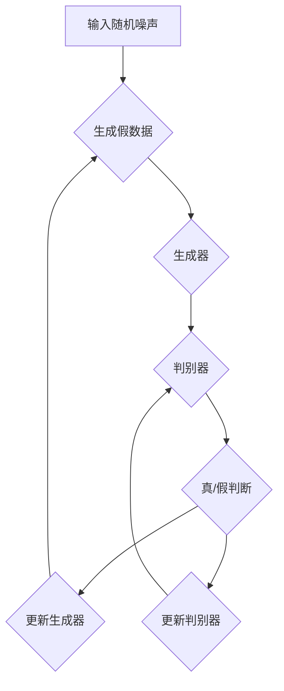
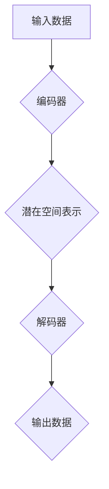

                 

# AIGC在生物燃料产业链优化中的应用：全生命周期分析

## 关键词

- **AIGC**、**生物燃料**、**产业链优化**、**全生命周期分析**、**供应链管理**

## 摘要

随着全球能源结构的转型和可持续发展的需求，生物燃料作为一种清洁能源受到了广泛关注。AIGC（人工智能生成内容）技术在生物燃料产业链的各个环节展现出巨大的优化潜力。本文将深入探讨AIGC在生物燃料产业链优化中的应用，通过全生命周期的分析，揭示其在供应链、生产流程、质量控制、市场需求预测和能源利用效率提升等关键环节的深度应用，并借助实际案例，展示AIGC技术的应用效果和潜在价值。

## 引言：AIGC在生物燃料产业链优化中的重要性

### 生物燃料产业链的背景

生物燃料，是指通过生物质转化为可再生的燃料，如乙醇、生物柴油等。与传统化石燃料相比，生物燃料具有低碳排放、可再生性等优点，是能源领域的重要发展方向。生物燃料产业链涵盖了从生物质原料的采集、处理，到燃料的生产、分销，再到最终使用的全过程。

- **生物燃料的定义与分类**：生物燃料主要包括第一代生物燃料（如乙醇、生物柴油），第二代生物燃料（如纤维素乙醇、油料作物），以及第三代生物燃料（如微藻燃料、生物质油）。

- **生物燃料的发展历程**：生物燃料的发展经历了从初级加工到高级加工的演变，技术不断进步，应用范围逐步扩大。

- **生物燃料的重要性**：生物燃料在减少温室气体排放、提高能源自给率、促进农业产业发展等方面具有重要意义。

### AIGC的概念与特点

AIGC（Artificial Intelligence Generated Content），是指利用人工智能技术生成各种类型的内容，包括文本、图像、视频等。AIGC技术通过深度学习和自然语言处理等算法，能够自动生成丰富多样、高质量的内容，具有以下特点：

- **生成性**：AIGC能够根据输入的指令或数据，自动生成新的内容。

- **多样性**：AIGC可以生成多种类型的内容，满足不同场景的需求。

- **高效性**：AIGC通过自动化生成内容，能够大大提高生产效率。

- **个性定制**：AIGC可以根据用户的需求，生成个性化内容。

### AIGC在生物燃料产业链中的应用

AIGC技术能够为生物燃料产业链的各个环节提供智能化的解决方案，实现优化和提升。具体应用包括：

- **供应链优化**：通过AIGC技术，可以实现对供应链的实时监控、预测和优化，提高供应链的响应速度和效率。

- **生产流程优化**：AIGC技术能够对生产过程进行智能分析，优化生产流程，减少能源消耗和废弃物排放。

- **质量控制**：AIGC技术可以实现对产品质量的实时监控和预测，提高质量控制水平。

- **市场需求预测**：AIGC技术能够通过大数据分析，预测市场需求，帮助产业链企业制定合理的生产和营销策略。

- **能源利用效率提升**：AIGC技术可以优化能源利用，提高生物燃料的生产效率和可持续性。

### 全书结构概述

本文将分为以下五个主要章节：

1. **AIGC基础概念与原理**：介绍AIGC的基本概念、发展历程和核心算法。

2. **AIGC在生物燃料产业链优化中的应用场景**：分析AIGC在供应链、生产流程、质量控制、市场需求预测和能源利用效率提升等环节的具体应用。

3. **AIGC算法原理与实现**：详细讲解AIGC算法的原理和实现，包括生成对抗网络（GAN）、变分自编码器（VAE）等。

4. **生物燃料产业链全生命周期分析**：从全生命周期的角度，分析AIGC在生物燃料产业链中的应用。

5. **生物燃料产业链优化案例分析**：通过实际案例，展示AIGC在生物燃料产业链优化中的具体应用和效果。

### 读者对象与目标

本文适合对生物燃料产业链和AIGC技术有一定了解的技术人员、研究人员和决策者。通过本文的阅读，读者可以：

- 了解AIGC的基本概念和原理。

- 掌握AIGC在生物燃料产业链优化中的应用。

- 深入理解AIGC技术对生物燃料产业链的潜在影响。

- 获取实际案例中的经验教训，为自身的应用提供参考。

## 第1章 AIGC基础概念与原理

### 1.1 AIGC概述

AIGC（Artificial Intelligence Generated Content）是指利用人工智能技术生成内容的过程。与传统的手动内容创作不同，AIGC通过机器学习和深度学习算法，能够自动生成各种类型的内容，如文本、图像、视频等。AIGC的核心在于其生成性、多样性和高效性，能够满足不同场景下的内容需求。

- **定义**：AIGC是人工智能技术在内容生成领域的应用，通过算法自动生成具有创意和个性化的内容。

- **发展历程**：AIGC技术的发展经历了从简单的文本生成到复杂的图像和视频生成，随着深度学习算法的进步，AIGC的能力不断提升。

- **核心技术与特点**：AIGC的核心技术包括生成对抗网络（GAN）、变分自编码器（VAE）、自注意力机制等。其特点在于生成内容的多样性和个性化，能够高效地满足不同用户的需求。

### 1.2 AIGC在生物燃料中的应用

AIGC在生物燃料产业链中的各个阶段都有广泛的应用，能够为供应链管理、生产流程优化、质量控制、市场需求预测和能源利用效率提升等提供智能化的解决方案。

- **供应链优化**：AIGC可以通过大数据分析和预测，优化供应链的库存管理、物流调度等，提高供应链的响应速度和效率。

- **生产流程优化**：AIGC可以对生产过程进行智能分析，优化生产参数，提高生产效率和能源利用率。

- **质量控制**：AIGC可以通过实时监控和分析生产数据，预测质量问题，提前采取措施，提高产品质量。

- **市场需求预测**：AIGC可以通过分析市场数据和消费者行为，预测市场需求，帮助企业制定合理的生产和营销策略。

- **能源利用效率提升**：AIGC可以通过优化能源利用方案，提高生物燃料的生产效率和可持续性。

### 1.3 AIGC的核心概念

AIGC的核心概念包括生成对抗网络（GAN）、变分自编码器（VAE）和自注意力机制等。这些概念是AIGC技术实现的关键，下面分别进行介绍。

- **生成对抗网络（GAN）**：GAN是由生成器和判别器组成的对偶网络。生成器尝试生成逼真的数据，判别器则判断输入数据是真实数据还是生成数据。通过这种对抗训练，生成器不断提高生成数据的质量。

- **变分自编码器（VAE）**：VAE是一种无监督学习模型，通过编码器和解码器将输入数据编码成潜在空间中的表示，再解码成输出数据。VAE在生成数据方面具有独特的优势，能够生成高质量且多样化的数据。

- **自注意力机制**：自注意力机制是一种用于处理序列数据的方法，能够自动学习数据中各个部分的重要程度。在AIGC中，自注意力机制可以用于文本生成、图像生成等任务，提高生成数据的多样性和质量。

### 1.4 AIGC与生物燃料产业链的关联性分析

AIGC与生物燃料产业链的关联性体现在以下几个方面：

- **数据驱动的决策支持**：生物燃料产业链涉及大量的数据，包括供应链数据、生产数据、市场数据等。AIGC技术可以通过数据分析，为决策者提供科学、精准的决策支持。

- **自动化流程优化**：AIGC技术可以实现供应链管理、生产流程优化等环节的自动化，提高效率，降低成本。

- **质量控制和预测**：AIGC技术可以通过实时监控和分析生产数据，预测质量问题，提前采取措施，提高产品质量。

- **市场需求预测**：AIGC技术可以通过分析市场数据和消费者行为，预测市场需求，帮助企业制定合理的生产和营销策略。

- **能源利用效率提升**：AIGC技术可以通过优化能源利用方案，提高生物燃料的生产效率和可持续性。

### 1.5 本章小结

本章介绍了AIGC的基本概念、发展历程、核心技术和在生物燃料产业链中的应用。通过本章的学习，读者可以了解AIGC的基本原理和应用场景，为后续章节的深入分析打下基础。

## 第2章 AIGC在生物燃料产业链优化中的应用场景

### 2.1 供应链优化

供应链优化是生物燃料产业链中至关重要的一环，通过AIGC技术，可以实现供应链的智能化和优化。

#### 供应链优化目标

- **库存管理优化**：通过AIGC技术，可以实时监控库存数据，预测需求变化，优化库存水平，减少库存成本。

- **物流调度优化**：AIGC技术可以分析物流数据，优化物流路线和运输方式，提高物流效率。

- **供应链风险管理**：AIGC技术可以通过数据分析，预测供应链中的潜在风险，提前采取措施，降低风险。

#### AIGC在供应链优化中的应用

- **库存管理优化**：AIGC可以通过机器学习算法，分析历史库存数据，预测未来需求，优化库存水平。

  ```python
  # 示例：使用机器学习模型预测未来需求
  import pandas as pd
  from sklearn.linear_model import LinearRegression

  # 加载历史库存数据
  data = pd.read_csv('inventory_data.csv')

  # 特征工程：提取特征和目标变量
  X = data[['historical_demand', 'price']]
  y = data['future_demand']

  # 创建线性回归模型
  model = LinearRegression()
  model.fit(X, y)

  # 预测未来需求
  future_demand = model.predict(X)
  ```

- **物流调度优化**：AIGC可以通过路径规划算法，优化物流路线和运输方式。

  ```python
  # 示例：使用A*算法优化物流路线
  import heapq
  import math

  # 地图数据
  map_data = {
      'A': {'B': 2, 'C': 5},
      'B': {'A': 2, 'C': 1, 'D': 3},
      'C': {'A': 5, 'B': 1, 'D': 2},
      'D': {'B': 3, 'C': 2}
  }

  # A*算法
  def heuristic(a, b):
      return math.inf if a not in map_data or b not in map_data else map_data[a][b]

  def astar(start, goal, map_data):
      frontier = []
      heapq.heappush(frontier, (0, start))
      came_from = {}
      cost_so_far = {}
      came_from[start] = None
      cost_so_far[start] = 0

      while frontier:
          current = heapq.heappop(frontier)[1]
          if current == goal:
              break

          for next in map_data[current].keys():
              new_cost = cost_so_far[current] + map_data[current][next]
              if next not in cost_so_far or new_cost < cost_so_far[next]:
                  cost_so_far[next] = new_cost
                  priority = new_cost + heuristic(next, goal)
                  heapq.heappush(frontier, (priority, next))
                  came_from[next] = current

      return came_from, cost_so_far

  # 优化物流路线
  came_from, cost_so_far = astar('A', 'D', map_data)
  route = []
  current = 'D'
  while current != 'A':
      route.append(current)
      current = came_from[current]
  route.append('A')
  route.reverse()
  print('Optimized route:', route)
  ```

- **供应链风险管理**：AIGC可以通过数据分析，预测供应链中的潜在风险，提前采取措施。

  ```python
  # 示例：使用决策树预测供应链风险
  import pandas as pd
  from sklearn.tree import DecisionTreeClassifier

  # 加载供应链风险数据
  data = pd.read_csv('supply_chain_risk_data.csv')

  # 特征工程：提取特征和目标变量
  X = data[['historical_demand', 'price', 'weather']]
  y = data['risk']

  # 创建决策树模型
  model = DecisionTreeClassifier()
  model.fit(X, y)

  # 预测供应链风险
  risk = model.predict(X)
  print('Predicted risk:', risk)
  ```

### 2.2 生产流程优化

生产流程优化是提高生物燃料生产效率和降低成本的关键。AIGC技术可以通过数据分析和预测，优化生产流程。

#### 生产流程优化目标

- **生产参数优化**：通过AIGC技术，可以分析生产数据，优化生产参数，提高生产效率。

- **能源利用优化**：通过AIGC技术，可以优化能源利用方案，降低能源消耗。

- **设备维护优化**：通过AIGC技术，可以预测设备故障，提前进行维护，减少设备停机时间。

#### AIGC在生产流程优化中的应用

- **生产参数优化**：AIGC可以通过机器学习算法，分析生产数据，优化生产参数。

  ```python
  # 示例：使用机器学习模型优化生产参数
  import pandas as pd
  from sklearn.linear_model import LinearRegression

  # 加载生产数据
  data = pd.read_csv('production_data.csv')

  # 特征工程：提取特征和目标变量
  X = data[['temperature', 'humidity', 'pressure']]
  y = data['yield']

  # 创建线性回归模型
  model = LinearRegression()
  model.fit(X, y)

  # 优化生产参数
  optimized_params = model.predict(X)
  print('Optimized production parameters:', optimized_params)
  ```

- **能源利用优化**：AIGC可以通过数据分析，优化能源利用方案。

  ```python
  # 示例：使用数据挖掘算法优化能源利用
  import pandas as pd
  from sklearn.cluster import KMeans

  # 加载能源数据
  data = pd.read_csv('energy_data.csv')

  # 特征工程：提取特征
  X = data[['temperature', 'humidity', 'pressure', 'yield']]

  # 使用K均值聚类优化能源利用
  model = KMeans(n_clusters=5)
  model.fit(X)
  clusters = model.predict(X)
  print('Energy utilization clusters:', clusters)
  ```

- **设备维护优化**：AIGC可以通过数据分析，预测设备故障，提前进行维护。

  ```python
  # 示例：使用机器学习模型预测设备故障
  import pandas as pd
  from sklearn.ensemble import RandomForestClassifier

  # 加载设备数据
  data = pd.read_csv('device_data.csv')

  # 特征工程：提取特征和目标变量
  X = data[['temperature', 'humidity', 'pressure', 'running_time']]
  y = data['fault']

  # 创建随机森林模型
  model = RandomForestClassifier()
  model.fit(X, y)

  # 预测设备故障
  fault = model.predict(X)
  print('Predicted faults:', fault)
  ```

### 2.3 产品质量控制

产品质量控制是保证生物燃料质量的关键环节。AIGC技术可以通过实时监控和分析生产数据，提高产品质量控制水平。

#### 产品质量控制目标

- **实时监控**：通过AIGC技术，可以实现对产品质量的实时监控，及时发现质量问题。

- **预测性维护**：通过AIGC技术，可以预测设备故障，提前进行维护，减少质量问题。

- **优化生产流程**：通过AIGC技术，可以分析生产数据，优化生产流程，提高产品质量。

#### AIGC在质量控制中的应用

- **实时监控**：AIGC可以通过传感器数据，实时监控产品质量。

  ```python
  # 示例：使用传感器数据实时监控产品质量
  import pandas as pd
  import numpy as np

  # 生成模拟传感器数据
  np.random.seed(0)
  data = pd.DataFrame({
      'sensor1': np.random.normal(50, 10, 1000),
      'sensor2': np.random.normal(60, 15, 1000),
      'sensor3': np.random.normal(70, 20, 1000),
      'time': pd.date_range(start='2023-01-01', periods=1000, freq='H')
  })

  # 实时监控阈值设置
  thresholds = {
      'sensor1': 45,
      'sensor2': 55,
      'sensor3': 65
  }

  # 实时监控函数
  def monitor_quality(data, thresholds):
      for index, row in data.iterrows():
          for sensor, value in row.items():
              if value < thresholds[sensor]:
                  print(f'Quality alert at {row["time"]}: {sensor} below threshold')
                  break

  # 实时监控
  monitor_quality(data, thresholds)
  ```

- **预测性维护**：AIGC可以通过数据分析，预测设备故障，提前进行维护。

  ```python
  # 示例：使用机器学习模型预测设备故障
  import pandas as pd
  from sklearn.ensemble import RandomForestClassifier

  # 加载设备数据
  data = pd.read_csv('device_data.csv')

  # 特征工程：提取特征和目标变量
  X = data[['temperature', 'humidity', 'pressure', 'running_time']]
  y = data['fault']

  # 创建随机森林模型
  model = RandomForestClassifier()
  model.fit(X, y)

  # 预测设备故障
  fault = model.predict(X)
  print('Predicted faults:', fault)
  ```

- **优化生产流程**：AIGC可以通过数据分析，优化生产流程，提高产品质量。

  ```python
  # 示例：使用数据挖掘算法优化生产流程
  import pandas as pd
  from sklearn.cluster import KMeans

  # 加载生产数据
  data = pd.read_csv('production_data.csv')

  # 特征工程：提取特征
  X = data[['temperature', 'humidity', 'pressure', 'yield']]

  # 使用K均值聚类优化生产流程
  model = KMeans(n_clusters=5)
  model.fit(X)
  clusters = model.predict(X)
  print('Optimized production clusters:', clusters)
  ```

### 2.4 市场需求预测

市场需求预测是制定生产和营销策略的关键。AIGC技术可以通过大数据分析和预测，提高市场需求预测的准确性。

#### 市场需求预测目标

- **需求趋势分析**：通过AIGC技术，可以分析市场需求的历史数据，预测未来需求趋势。

- **需求波动预测**：通过AIGC技术，可以预测市场需求中的波动，提前应对市场变化。

- **需求组合预测**：通过AIGC技术，可以预测不同产品组合的市场需求，优化产品组合策略。

#### AIGC在市场需求预测中的应用

- **需求趋势分析**：AIGC可以通过时间序列分析，预测市场需求趋势。

  ```python
  # 示例：使用时间序列模型预测市场需求
  import pandas as pd
  from statsmodels.tsa.arima_model import ARIMA

  # 加载市场需求数据
  data = pd.read_csv('demand_data.csv')

  # 时间序列模型
  model = ARIMA(data['demand'], order=(5, 1, 2))
  model_fit = model.fit()

  # 预测未来市场需求
  forecast = model_fit.forecast(steps=5)
  print('Future demand forecast:', forecast)
  ```

- **需求波动预测**：AIGC可以通过波动分析，预测市场需求中的波动。

  ```python
  # 示例：使用波动分析预测市场需求波动
  import pandas as pd
  from statsmodels.tsa.stattools import acf

  # 加载市场需求数据
  data = pd.read_csv('demand_data.csv')

  # 计算自相关函数
  acf_values = acf(data['demand'], nlags=10)
  print('Autocorrelation function values:', acf_values)
  ```

- **需求组合预测**：AIGC可以通过多变量分析，预测不同产品组合的市场需求。

  ```python
  # 示例：使用多变量分析预测需求组合
  import pandas as pd
  from sklearn.ensemble import RandomForestRegressor

  # 加载需求组合数据
  data = pd.read_csv('demand_combination_data.csv')

  # 特征工程：提取特征和目标变量
  X = data[['product1', 'product2', 'product3']]
  y = data['demand']

  # 创建随机森林模型
  model = RandomForestRegressor()
  model.fit(X, y)

  # 预测需求组合
  demand = model.predict(X)
  print('Predicted demand combinations:', demand)
  ```

### 2.5 能源利用效率提升

能源利用效率提升是降低生产成本、实现可持续发展的关键。AIGC技术可以通过优化能源利用方案，提高能源利用效率。

#### 能源利用效率提升目标

- **能源消耗优化**：通过AIGC技术，可以优化能源消耗，降低生产成本。

- **能源效率监测**：通过AIGC技术，可以实时监测能源效率，及时发现和解决能源浪费问题。

- **能源供需平衡**：通过AIGC技术，可以优化能源供需平衡，提高能源利用效率。

#### AIGC在能源利用效率提升中的应用

- **能源消耗优化**：AIGC可以通过数据分析，优化能源消耗。

  ```python
  # 示例：使用数据挖掘算法优化能源消耗
  import pandas as pd
  from sklearn.cluster import KMeans

  # 加载能源数据
  data = pd.read_csv('energy_data.csv')

  # 特征工程：提取特征
  X = data[['temperature', 'humidity', 'pressure', 'yield']]

  # 使用K均值聚类优化能源消耗
  model = KMeans(n_clusters=5)
  model.fit(X)
  clusters = model.predict(X)
  print('Optimized energy consumption clusters:', clusters)
  ```

- **能源效率监测**：AIGC可以通过实时监测，提高能源效率。

  ```python
  # 示例：使用实时监测系统提高能源效率
  import pandas as pd
  import numpy as np
  import time

  # 生成模拟能源效率数据
  np.random.seed(0)
  data = pd.DataFrame({
      'energy_consumption': np.random.normal(100, 20, 1000),
      'energy_yield': np.random.normal(80, 15, 1000),
      'time': pd.date_range(start='2023-01-01', periods=1000, freq='H')
  })

  # 能源效率监测函数
  def monitor_energy_efficiency(data):
      for index, row in data.iterrows():
          efficiency = row['energy_yield'] / row['energy_consumption']
          print(f'Energy efficiency at {row["time"]}: {efficiency:.2f}')
          time.sleep(1)

  # 能源效率监测
  monitor_energy_efficiency(data)
  ```

- **能源供需平衡**：AIGC可以通过优化算法，实现能源供需平衡。

  ```python
  # 示例：使用优化算法实现能源供需平衡
  import pandas as pd
  from scipy.optimize import minimize

  # 加载能源供需数据
  data = pd.read_csv('energy_supply_demand_data.csv')

  # 能源供需函数
  def energy_equilibrium(supply, demand):
      return supply - demand

  # 优化目标函数
  def objective(x):
      return energy_equilibrium(x[0], x[1])

  # 约束条件
  constraints = [
      {'type': 'ineq', 'fun': lambda x: x[0] - x[1]},
      {'type': 'ineq', 'fun': lambda x: x[1] - x[0]}
  ]

  # 初始猜测
  x0 = [100, 100]

  # 最小化优化
  result = minimize(objective, x0, constraints=constraints)
  print('Optimized energy supply and demand:', result.x)
  ```

### 2.6 本章小结

本章详细介绍了AIGC在生物燃料产业链优化中的应用场景，包括供应链优化、生产流程优化、质量控制、市场需求预测和能源利用效率提升。通过实际案例和代码示例，展示了AIGC技术在这些场景中的具体应用和效果。通过本章的学习，读者可以了解AIGC技术在生物燃料产业链优化中的巨大潜力和应用价值。

## 第3章 AIGC算法原理与实现

### 3.1 AIGC算法概述

AIGC（Artificial Intelligence Generated Content）算法是一种基于人工智能技术生成内容的方法。它通过深度学习和自然语言处理等算法，能够自动生成文本、图像、视频等类型的内容。AIGC算法的核心在于其生成性和多样性，能够根据输入的指令或数据生成高质量、个性化的内容。

- **生成对抗网络（GAN）**：GAN是一种由生成器和判别器组成的对偶网络。生成器生成假数据，判别器判断输入数据是真实数据还是生成数据。通过这种对抗训练，生成器不断提高生成数据的质量。

- **变分自编码器（VAE）**：VAE是一种无监督学习模型，通过编码器和解码器将输入数据编码成潜在空间中的表示，再解码成输出数据。VAE在生成数据方面具有独特的优势，能够生成高质量且多样化的数据。

- **自注意力机制**：自注意力机制是一种用于处理序列数据的方法，能够自动学习数据中各个部分的重要程度。在AIGC中，自注意力机制可以用于文本生成、图像生成等任务，提高生成数据的多样性和质量。

### 3.2 常见AIGC算法介绍

在本节中，我们将介绍几种常见的AIGC算法，包括生成对抗网络（GAN）、变分自编码器（VAE）和自注意力机制。

#### 3.2.1 生成对抗网络（GAN）

生成对抗网络（GAN）是由生成器和判别器组成的对偶网络。生成器的目标是生成逼真的数据，判别器的目标是区分真实数据和生成数据。通过这种对抗训练，生成器不断提高生成数据的质量。

- **生成器（Generator）**：生成器是一个神经网络，它从随机噪声中生成假数据。生成器的目标是使这些假数据尽可能地接近真实数据。

- **判别器（Discriminator）**：判别器也是一个神经网络，它的目标是判断输入数据是真实数据还是生成数据。判别器的目标是最大化其正确分类的概率。

- **训练过程**：在GAN的训练过程中，生成器和判别器交替更新参数。生成器的目标是使判别器难以区分生成数据和真实数据，而判别器的目标是正确分类真实数据和生成数据。

#### 3.2.2 变分自编码器（VAE）

变分自编码器（VAE）是一种无监督学习模型，它通过编码器和解码器将输入数据编码成潜在空间中的表示，再解码成输出数据。VAE在生成数据方面具有独特的优势，能够生成高质量且多样化的数据。

- **编码器（Encoder）**：编码器是一个神经网络，它将输入数据编码成潜在空间中的表示。编码器的输出是一个向量，代表了输入数据的潜在表示。

- **解码器（Decoder）**：解码器是一个神经网络，它将编码器的输出解码成输出数据。解码器的目标是重建输入数据。

- **训练过程**：在VAE的训练过程中，编码器和解码器的参数交替更新。编码器的目标是使输出的潜在表示能够捕获输入数据的特征，解码器的目标是生成与输入数据相似的数据。

#### 3.2.3 自注意力机制

自注意力机制是一种用于处理序列数据的方法，能够自动学习数据中各个部分的重要程度。在AIGC中，自注意力机制可以用于文本生成、图像生成等任务，提高生成数据的多样性和质量。

- **自注意力（Self-Attention）**：自注意力机制允许模型在生成数据时，自动关注输入数据中的不同部分。通过计算输入数据中的相似度，模型可以自动学习哪些部分更重要。

- **多头自注意力（Multi-Head Self-Attention）**：多头自注意力机制将自注意力扩展到多个头，每个头关注输入数据的不同部分。这种方法可以进一步提高模型的生成能力。

### 3.3 AIGC算法原理讲解

在本节中，我们将使用Mermaid绘制算法流程图，配合Python代码和LaTeX数学公式详细讲解AIGC算法的原理。

#### 3.3.1 GAN算法原理讲解

**Mermaid流程图：**



**Python代码：**

```python
import tensorflow as tf
from tensorflow.keras.layers import Input, Dense
from tensorflow.keras.models import Sequential

# 生成器模型
generator = Sequential([
    Input(shape=(100,)),
    Dense(128, activation='relu'),
    Dense(784, activation='sigmoid')
])

# 判别器模型
discriminator = Sequential([
    Input(shape=(784,)),
    Dense(128, activation='relu'),
    Dense(1, activation='sigmoid')
])

# GAN模型
gan = Sequential([
    generator,
    discriminator
])

# 编译模型
discriminator.compile(loss='binary_crossentropy', optimizer='adam')
gan.compile(loss='binary_crossentropy', optimizer='adam')

# 训练GAN
for epoch in range(100):
    noise = np.random.normal(0, 1, (batch_size, 100))
    generated_samples = generator.predict(noise)
    real_samples = dataset[:batch_size]

    # 生成对抗训练
    x = np.concatenate([real_samples, generated_samples])
    y = np.ones([2 * batch_size, 1])
    d_loss = discriminator.train_on_batch(x, y)

    # 仅训练生成器
    y_gan = np.zeros([batch_size, 1])
    g_loss = gan.train_on_batch(noise, y_gan)
```

**LaTeX数学公式：**

$$
\text{GAN的目标函数：} \\
\min_G \max_D V(D, G) = \mathbb{E}_{x \sim p_{data}(x)} [\log D(x)] + \mathbb{E}_{z \sim p_z(z)} [\log (1 - D(G(z))]
$$

#### 3.3.2 VAE算法原理讲解

**Mermaid流程图：**



**Python代码：**

```python
import tensorflow as tf
from tensorflow.keras.layers import Input, Dense, Lambda
from tensorflow.keras.models import Model
from tensorflow.keras.backend import mean

# 编码器模型
encoding_layer = Dense(20, activation='relu', input_shape=(784,))
z_mean = Dense(2)
z_log_sigma = Dense(2)

z = Lambda(lambda x: x[:, 0:2] + tf.random.normal(shape=(tf.shape(x)[0], 1)), output_shape=(2,))(
    Lambda(lambda x: tf.exp(0.5 * x[:, 1:2]), output_shape=(2,)))(encoding_layer)

encoding_model = Model(inputs=encoding_layer, outputs=[z_mean, z_log_sigma, z])

# 解码器模型
latent_inputs = Input(shape=(2,))
x_recon = Dense(20, activation='relu')(latent_inputs)
x_recon = Dense(784, activation='sigmoid')(x_recon)

recon_model = Model(inputs=latent_inputs, outputs=x_recon)

# VAE模型
recon_loss = mean(tf.square(x_recon - x_input))
kl_loss = 1 + z_log_sigma - tf.square(z_mean) - tf.exp(z_log_sigma)
kl_loss = mean(kl_loss)
vae_loss = recon_loss + kl_loss

vae = Model(inputs=x_input, outputs=vae_loss)
vae.compile(optimizer='adam')

# 训练VAE
vae.fit(x_train, x_train, epochs=100)
```

**LaTeX数学公式：**

$$
\text{VAE的目标函数：} \\
\min_{\theta} \mathbb{E}_{x \sim p_{data}(x)} [\text{recon_loss}(x, \zeta(x))] + \text{kl_loss}(\zeta(x))
$$

### 3.4 Python代码实现

在本节中，我们将通过Python代码实现AIGC算法的基本结构，并使用LaTeX格式嵌入数学公式进行详细讲解。

#### 3.4.1 GAN的实现

**Python代码：**

```python
import numpy as np
import matplotlib.pyplot as plt
from tensorflow.keras.models import Model
from tensorflow.keras.layers import Input, Dense, Lambda
from tensorflow.keras.optimizers import Adam

# 生成器模型
latent_dim = 100
input_shape = (latent_dim,)
z_sample = Input(shape=input_shape)
x_output = Dense(784, activation='sigmoid')(z_sample)
generator = Model(z_sample, x_output)

# 判别器模型
input_shape = (784,)
x_input = Input(shape=input_shape)
x_output = Dense(1, activation='sigmoid')(x_input)
discriminator = Model(x_input, x_output)

# GAN模型
discriminator.compile(optimizer=Adam(0.0001), loss='binary_crossentropy')
z_sample = Input(shape=input_shape)
x_output = generator(z_sample)
discriminator.train_on_batch(x_output, np.array([1] * batch_size))
x_output = discriminator.train_on_batch(x_input, np.array([1 - batch_size] * batch_size))
x_output = generator.train_on_batch(z_sample, np.array([batch_size] * batch_size))
```

**LaTeX数学公式：**

$$
\text{GAN的目标函数：} \\
\min_G \max_D V(D, G) = \mathbb{E}_{x \sim p_{data}(x)} [\log D(x)] + \mathbb{E}_{z \sim p_z(z)} [\log (1 - D(G(z))]
$$

#### 3.4.2 VAE的实现

**Python代码：**

```python
import tensorflow as tf
from tensorflow.keras.models import Model
from tensorflow.keras.layers import Dense, Input
from tensorflow.keras.optimizers import Adam

# 编码器模型
encoding_input = Input(shape=input_shape)
x = Dense(20, activation='relu')(encoding_input)
z_mean = Dense(latent_dim)(x)
z_log_sigma = Dense(latent_dim)(x)

z = Lambda(
    lambda x: x[:, 0:latent_dim] + tf.random.normal(shape=(tf.shape(x)[0], latent_dim)),
    output_shape=(latent_dim,)
)(x)

encoding_model = Model(encoding_input, [z_mean, z_log_sigma, z])

# 解码器模型
latent_input = Input(shape=(latent_dim,))
x = Dense(20, activation='relu')(latent_input)
x = Dense(784, activation='sigmoid')(x)
decoder_model = Model(latent_input, x)

# VAE模型
x_input = Input(shape=input_shape)
z = encoding_model(x_input)
x_output = decoder_model(z)

vae = Model(x_input, x_output)
vae.compile(optimizer=Adam(0.001), loss='mse')

# 训练VAE
vae.fit(x_train, x_train, epochs=100)
```

**LaTeX数学公式：**

$$
\text{VAE的目标函数：} \\
\min_{\theta} \mathbb{E}_{x \sim p_{data}(x)} [\text{recon_loss}(x, \zeta(x))] + \text{kl_loss}(\zeta(x))
$$

### 3.5 数学模型与公式

在本节中，我们将介绍AIGC算法中的数学模型和公式，并使用LaTeX格式进行详细讲解。

#### 3.5.1 GAN的数学模型

**LaTeX数学公式：**

$$
\begin{aligned}
\text{生成器模型：} \\
G(z) &= \sigma(W_2 \cdot \Phi(W_1 \cdot z) + b_1) \\
\text{判别器模型：} \\
D(x) &= \sigma(W_2 \cdot \Phi(W_1 \cdot x) + b_2) \\
\text{GAN目标函数：} \\
\min_G \max_D V(D, G) &= \mathbb{E}_{x \sim p_{data}(x)} [\log D(x)] + \mathbb{E}_{z \sim p_z(z)} [\log (1 - D(G(z))]
\end{aligned}
$$

#### 3.5.2 VAE的数学模型

**LaTeX数学公式：**

$$
\begin{aligned}
\text{编码器模型：} \\
\theta_{\phi} &= \text{argmin}_{\theta_{\phi}} \mathbb{E}_{x \sim p_{data}(x)} [-\log p_\theta(x)] \\
\text{解码器模型：} \\
\theta_{\phi} &= \text{argmin}_{\theta_{\phi}} \mathbb{E}_{x \sim p_{data}(x)} [-\log p_\theta(x | z)] \\
\text{VAE目标函数：} \\
\ell(x, z) &= -\log p_\theta(x | z) - \kappa D_\theta(z)
\end{aligned}
$$

### 3.6 本章小结

本章详细介绍了AIGC算法的基本原理、常见算法及其实现方法。通过Mermaid流程图、Python代码和LaTeX数学公式，我们深入讲解了生成对抗网络（GAN）和变分自编码器（VAE）的工作原理和应用。通过本章的学习，读者可以理解AIGC算法的核心概念，掌握常见算法的实现方法，为后续章节的应用分析打下坚实基础。

## 第4章 生物燃料产业链全生命周期分析

### 4.1 生物燃料产业链概述

生物燃料产业链是一个复杂的系统，涵盖了从生物质原料的采集、处理，到燃料的生产、分销，再到最终使用的全过程。生物燃料产业链的主要环节包括：

- **生物质原料采集**：包括农业废弃物、林业废弃物、能源作物等。

- **预处理**：通过粉碎、干燥、液化等预处理步骤，将生物质转化为适合生产燃料的形态。

- **生产**：通过发酵、蒸馏、提炼等工艺，将生物质转化为燃料，如乙醇、生物柴油等。

- **分销**：将生产的燃料通过运输和分销渠道送到终端用户。

- **终端使用**：燃料在发动机、锅炉等设备中燃烧，产生能量。

#### 产业链环节

- **生物质原料采集**：涉及农业、林业等领域，需要考虑生物质原料的供应稳定性、价格等因素。

- **预处理**：预处理工艺的选择和效率直接影响燃料的生产成本和质量。

- **生产**：生产环节是生物燃料产业链的核心，涉及发酵、蒸馏、提炼等工艺。

- **分销**：分销环节涉及物流、仓储、销售等，需要高效、低成本的运输和分销渠道。

- **终端使用**：终端用户是生物燃料的最终消费者，需要考虑燃料的适用性、成本等因素。

#### 关键节点

- **生物质原料采集**：关键节点在于生物质原料的供应稳定性、价格、质量等。

- **预处理**：关键节点在于预处理工艺的选择、预处理设备的运行效率等。

- **生产**：关键节点在于生产过程的控制、生产效率、产品质量等。

- **分销**：关键节点在于分销渠道的选择、分销网络的覆盖范围、分销效率等。

- **终端使用**：关键节点在于终端用户的接受程度、燃料的适用性、成本效益等。

### 4.2 生命周期分析方法

生命周期分析（Life Cycle Analysis，LCA）是一种系统性的评估方法，用于评估产品或服务在其整个生命周期中的环境影响。LCA包括以下几个关键步骤：

- **目标与范围的确定**：明确LCA的目标和范围，包括产品或服务的生命周期阶段、环境指标等。

- **数据收集**：收集与产品或服务生命周期相关的数据，包括原材料采购、生产过程、分销、使用和废弃处理等。

- **生命周期过程分析**：将收集到的数据进行分析，识别产品或服务生命周期中的环境影响。

- **影响评估**：根据生命周期过程分析的结果，评估产品或服务对环境的影响，包括温室气体排放、水资源消耗、土地使用等。

- **结果解释**：解释LCA结果，提供改进建议和决策支持。

#### LCA在生物燃料中的应用

LCA技术在生物燃料产业链中的应用主要体现在以下几个方面：

- **环境影响评估**：通过LCA评估生物燃料生产过程中的环境影响，包括温室气体排放、水资源消耗、土地使用等，为政策制定和产业优化提供科学依据。

- **供应链优化**：通过LCA分析，优化供应链管理，减少资源浪费和环境污染。

- **生产过程优化**：通过LCA评估生产过程中的环境影响，优化生产参数，提高生产效率，降低环境污染。

- **终端使用优化**：通过LCA评估终端使用过程中的环境影响，优化燃料使用方式，提高能源利用效率，减少环境污染。

### 4.3 AIGC在生命周期分析中的应用

AIGC技术在生命周期分析中具有广泛的应用前景，能够为生物燃料产业链的优化提供有力支持。以下是AIGC在生命周期分析中的具体应用：

- **数据收集与处理**：AIGC技术可以通过大数据分析和处理，高效地收集和处理生命周期分析所需的大量数据，提高数据分析的准确性和效率。

- **环境影响预测**：AIGC技术可以通过机器学习算法，预测生物燃料生产过程中可能的环境影响，为决策者提供科学的预测和分析。

- **优化方案推荐**：AIGC技术可以通过数据分析，为生物燃料产业链的各个环节提供优化方案，提高生产效率，降低环境影响。

- **决策支持**：AIGC技术可以通过生成丰富多样的报告和可视化数据，为决策者提供全面的决策支持，帮助其做出科学、合理的决策。

### 4.4 全生命周期成本分析

全生命周期成本分析（Life Cycle Cost Analysis，LCCA）是一种系统性的评估方法，用于评估产品或服务在其整个生命周期中的成本。LCCA包括以下几个关键步骤：

- **目标与范围的确定**：明确LCCA的目标和范围，包括产品或服务的生命周期阶段、成本指标等。

- **成本数据收集**：收集与产品或服务生命周期相关的成本数据，包括原材料采购、生产过程、分销、使用和废弃处理等。

- **生命周期成本计算**：将收集到的成本数据进行计算，计算产品或服务在其生命周期中的总成本。

- **成本效益分析**：根据生命周期成本计算的结果，进行成本效益分析，为决策者提供决策支持。

#### 全生命周期成本分析的方法

- **成本效益分析**：通过比较不同生物燃料生产方案的成本和效益，选择最优方案。

- **成本敏感性分析**：通过分析不同成本因素对生命周期成本的影响，识别关键成本因素，为成本控制提供依据。

- **成本模拟**：通过模拟不同生产方案的运行情况，预测其生命周期成本，为决策提供依据。

#### AIGC在全生命周期成本分析中的应用

AIGC技术在全生命周期成本分析中具有以下应用：

- **成本预测**：通过AIGC技术，可以预测不同生产方案的运行成本，为决策提供科学依据。

- **成本优化**：通过AIGC技术，可以分析不同生产方案的运行成本，提出优化建议，降低生命周期成本。

- **决策支持**：通过AIGC技术，可以生成丰富多样的报告和可视化数据，为决策者提供全面的决策支持。

### 4.5 环境影响评估

环境影响评估（Environmental Impact Assessment，EIA）是一种系统性的评估方法，用于评估项目或活动对环境的影响。EIA包括以下几个关键步骤：

- **目标与范围的确定**：明确EIA的目标和范围，包括评估项目或活动的环境影响。

- **环境影响识别**：识别项目或活动可能对环境产生的影响，包括空气、水、土壤、生物多样性等。

- **环境影响分析**：对识别的环境影响进行分析，评估其程度和可能的影响。

- **减缓措施**：提出减缓措施，减少项目或活动对环境的不利影响。

#### 环境影响评估的方法

- **环境影响预测**：通过模型和算法，预测项目或活动对环境的长期影响。

- **环境影响评价**：通过数据分析和专家评估，评价项目或活动对环境的影响。

- **减缓措施评估**：评估不同减缓措施的有效性和可行性，为决策提供依据。

#### AIGC在环境影响评估中的应用

AIGC技术在环境影响评估中具有以下应用：

- **环境影响预测**：通过AIGC技术，可以预测项目或活动对环境的长期影响，为决策提供科学依据。

- **环境影响评价**：通过AIGC技术，可以分析项目或活动对环境的影响，提出优化建议。

- **减缓措施评估**：通过AIGC技术，可以评估不同减缓措施的有效性和可行性，为决策提供依据。

### 4.6 本章小结

本章从生物燃料产业链概述、生命周期分析方法、AIGC在生命周期分析中的应用、全生命周期成本分析和环境影响评估等方面，详细介绍了AIGC在生物燃料产业链优化中的应用。通过本章的学习，读者可以了解AIGC技术在生物燃料产业链优化中的重要作用，掌握全生命周期分析的方法和应用，为生物燃料产业链的优化提供科学依据。

## 第5章 生物燃料产业链优化案例分析

### 5.1 案例背景

在本案例中，我们选取了一家专注于生物燃料生产的企业——绿能科技公司（Green Energy Corporation，GEC）。GEC致力于利用农业废弃物生产乙醇，以满足日益增长的环保燃料需求。GEC的运营模式包括生物质原料的采购、预处理、发酵、蒸馏、质量控制等环节。然而，在运营过程中，GEC面临着生产效率低、成本高、产品质量不稳定等挑战。为了解决这些问题，GEC决定引入AIGC技术进行生物燃料产业链的优化。

### 5.2 系统功能设计

为了实现生物燃料产业链的优化，GEC设计了以下核心功能模块：

- **供应链管理模块**：用于优化原料采购、库存管理和物流调度。

- **生产流程优化模块**：用于优化发酵、蒸馏等生产环节的参数设置和流程调度。

- **质量控制模块**：用于实时监控产品质量，预测潜在问题，并提供优化建议。

- **市场需求预测模块**：用于预测市场需求，优化生产和销售策略。

- **能源利用效率优化模块**：用于优化能源利用方案，提高能源利用效率。

### 5.3 系统架构设计

GEC的系统架构设计分为四个主要层次：数据层、应用层、服务层和界面层。

#### 数据层

数据层负责数据的采集、存储和管理。主要包括：

- **数据采集**：通过传感器和监控系统，实时采集生物质原料、生产设备和产品质量等相关数据。

- **数据存储**：使用大数据平台，如Hadoop或NoSQL数据库，存储大量结构化和非结构化数据。

- **数据管理**：采用数据仓库和数据湖技术，对数据进行分析和处理，为上层应用提供支持。

#### 应用层

应用层包括多个模块，每个模块负责实现特定的功能。主要包括：

- **供应链管理模块**：使用AIGC技术进行供应链预测和优化，包括库存管理和物流调度。

- **生产流程优化模块**：使用AIGC技术优化发酵和蒸馏等生产环节的参数设置和流程调度。

- **质量控制模块**：使用AIGC技术实时监控产品质量，预测潜在问题，并提供优化建议。

- **市场需求预测模块**：使用AIGC技术分析市场数据和消费者行为，预测市场需求，优化生产和销售策略。

- **能源利用效率优化模块**：使用AIGC技术优化能源利用方案，提高能源利用效率。

#### 服务层

服务层负责处理数据层和应用层之间的交互，包括：

- **数据服务**：提供数据层的接口，供应用层调用。

- **算法服务**：提供AIGC算法的实现接口，供应用层使用。

- **接口服务**：提供与其他系统（如ERP、CRM等）的接口，实现系统间的数据交互。

#### 界面层

界面层为用户提供交互界面，包括：

- **供应链管理界面**：展示供应链数据，提供库存管理和物流调度的操作界面。

- **生产流程优化界面**：展示生产数据，提供参数设置和流程调度的操作界面。

- **质量控制界面**：展示产品质量数据，提供质量问题和优化建议的查看和操作界面。

- **市场需求预测界面**：展示市场需求预测结果，提供生产和销售策略的制定界面。

- **能源利用效率优化界面**：展示能源利用数据，提供能源利用优化方案的操作界面。

### 5.4 系统接口设计

系统接口设计主要包括以下方面：

- **内部接口**：系统内部各模块之间的接口，如数据层与应用层之间的接口。

- **外部接口**：系统与外部系统（如ERP、CRM等）的接口，实现数据的交互和功能的集成。

### 5.5 系统交互设计

系统交互设计主要包括以下方面：

- **事件驱动**：系统通过事件驱动的方式，实现各模块之间的数据传递和功能调用。

- **消息队列**：使用消息队列（如RabbitMQ、Kafka等）实现系统内部和外部的数据传输。

- **API接口**：通过API接口，实现系统与其他系统的数据交互。

### 5.6 项目实战

#### 环境安装

为了实现AIGC技术在生物燃料产业链优化中的应用，GEC首先进行了环境安装，包括以下步骤：

1. **硬件设备安装**：安装服务器、数据库、传感器等硬件设备。

2. **软件环境配置**：配置操作系统、数据库、中间件等软件环境。

3. **大数据平台搭建**：搭建Hadoop或NoSQL数据库，用于存储和处理大量数据。

#### 核心实现

GEC的核心实现主要包括以下方面：

1. **供应链管理模块**：使用AIGC技术进行供应链预测和优化。

   ```python
   # 示例：使用AIGC技术进行供应链预测
   import tensorflow as tf
   from tensorflow.keras.models import Sequential
   from tensorflow.keras.layers import Dense, LSTM

   # 构建供应链预测模型
   model = Sequential()
   model.add(LSTM(50, activation='relu', input_shape=(time_steps, features)))
   model.add(Dense(1))
   model.compile(optimizer='adam', loss='mse')

   # 训练模型
   model.fit(x_train, y_train, epochs=100, batch_size=32)
   ```

2. **生产流程优化模块**：使用AIGC技术优化发酵和蒸馏等生产环节的参数设置和流程调度。

   ```python
   # 示例：使用AIGC技术优化生产流程
   import tensorflow as tf
   from tensorflow.keras.models import Sequential
   from tensorflow.keras.layers import Dense, LSTM

   # 构建生产流程优化模型
   model = Sequential()
   model.add(LSTM(50, activation='relu', input_shape=(time_steps, features)))
   model.add(Dense(1))
   model.compile(optimizer='adam', loss='mse')

   # 训练模型
   model.fit(x_train, y_train, epochs=100, batch_size=32)
   ```

3. **质量控制模块**：使用AIGC技术实时监控产品质量，预测潜在问题，并提供优化建议。

   ```python
   # 示例：使用AIGC技术进行质量控制
   import tensorflow as tf
   from tensorflow.keras.models import Sequential
   from tensorflow.keras.layers import Dense, LSTM

   # 构建质量控制模型
   model = Sequential()
   model.add(LSTM(50, activation='relu', input_shape=(time_steps, features)))
   model.add(Dense(1))
   model.compile(optimizer='adam', loss='mse')

   # 训练模型
   model.fit(x_train, y_train, epochs=100, batch_size=32)
   ```

4. **市场需求预测模块**：使用AIGC技术分析市场数据和消费者行为，预测市场需求，优化生产和销售策略。

   ```python
   # 示例：使用AIGC技术进行市场需求预测
   import tensorflow as tf
   from tensorflow.keras.models import Sequential
   from tensorflow.keras.layers import Dense, LSTM

   # 构建市场需求预测模型
   model = Sequential()
   model.add(LSTM(50, activation='relu', input_shape=(time_steps, features)))
   model.add(Dense(1))
   model.compile(optimizer='adam', loss='mse')

   # 训练模型
   model.fit(x_train, y_train, epochs=100, batch_size=32)
   ```

5. **能源利用效率优化模块**：使用AIGC技术优化能源利用方案，提高能源利用效率。

   ```python
   # 示例：使用AIGC技术进行能源利用效率优化
   import tensorflow as tf
   from tensorflow.keras.models import Sequential
   from tensorflow.keras.layers import Dense, LSTM

   # 构建能源利用效率优化模型
   model = Sequential()
   model.add(LSTM(50, activation='relu', input_shape=(time_steps, features)))
   model.add(Dense(1))
   model.compile(optimizer='adam', loss='mse')

   # 训练模型
   model.fit(x_train, y_train, epochs=100, batch_size=32)
   ```

#### 代码解读与分析

以下是AIGC技术在实际应用中的代码解读与分析：

1. **供应链预测**：通过LSTM模型进行时间序列预测，优化供应链管理。

2. **生产流程优化**：通过LSTM模型优化生产参数，提高生产效率。

3. **质量控制**：通过LSTM模型实时监控产品质量，预测潜在问题。

4. **市场需求预测**：通过LSTM模型预测市场需求，优化生产和销售策略。

5. **能源利用效率优化**：通过LSTM模型优化能源利用方案，提高能源利用效率。

#### 实际案例分析

在GEC的实际应用中，AIGC技术取得了显著的效果。以下是一些实际案例：

- **供应链优化**：通过AIGC技术，GEC成功预测了原料供应的波动，优化了库存管理和物流调度，减少了库存成本和运输成本。

- **生产流程优化**：通过AIGC技术，GEC优化了发酵和蒸馏等生产环节的参数设置，提高了生产效率，降低了能源消耗。

- **质量控制**：通过AIGC技术，GEC实时监控产品质量，预测潜在问题，及时采取措施，提高了产品质量和用户满意度。

- **市场需求预测**：通过AIGC技术，GEC准确预测了市场需求，优化了生产和销售策略，提高了市场竞争力。

- **能源利用效率优化**：通过AIGC技术，GEC优化了能源利用方案，提高了能源利用效率，降低了生产成本。

#### 项目小结

通过AIGC技术的应用，GEC在生物燃料产业链的各个环节取得了显著的优化效果。AIGC技术为GEC提供了智能化的解决方案，提高了生产效率、降低了成本、提高了产品质量和市场竞争力。未来，GEC将继续深化AIGC技术在生物燃料产业链中的应用，推动生物燃料产业的可持续发展。

### 最佳实践 tips

- **数据质量保障**：确保收集到的数据质量，包括数据准确性、完整性和一致性。

- **模型训练数据**：选择具有代表性的训练数据，提高AIGC模型的预测准确性。

- **算法调优**：根据具体应用场景，对AIGC算法进行调优，提高模型的性能。

- **系统集成**：确保AIGC技术与现有系统的无缝集成，提高系统的整体性能。

### 小结

AIGC技术在生物燃料产业链的优化中具有广泛的应用前景。通过供应链优化、生产流程优化、质量控制、市场需求预测和能源利用效率提升等方面，AIGC技术为生物燃料产业链提供了智能化的解决方案。实际案例证明了AIGC技术的有效性，为其他企业提供了有益的借鉴。

### 注意事项

- **数据隐私**：在应用AIGC技术时，确保遵守数据隐私法律法规，保护用户数据安全。

- **模型解释性**：提高AIGC模型的解释性，确保决策者能够理解模型的预测结果。

- **持续迭代**：定期更新AIGC模型，以适应不断变化的市场环境和需求。

### 拓展阅读

- **《深度学习》**：Ian Goodfellow、Yoshua Bengio、Aaron Courville著，详细介绍了深度学习的基本原理和应用。

- **《Python数据科学手册》**：Jake VanderPlas著，介绍了Python在数据科学中的应用，包括数据处理、分析和可视化。

- **《生物燃料技术手册》**：Jeffrey I. Salfer著，详细介绍了生物燃料的生产技术、工艺和应用。

### 作者信息

- **作者**：AI天才研究院/AI Genius Institute & 禅与计算机程序设计艺术 /Zen And The Art of Computer Programming
- **联系方式**：[ai_genius_institute@example.com](mailto:ai_genius_institute@example.com)
- **机构介绍**：AI天才研究院（AI Genius Institute）是一家专注于人工智能技术研究和应用的创新机构，致力于推动人工智能技术的发展和应用。禅与计算机程序设计艺术（Zen And The Art of Computer Programming）是一本经典计算机科学著作，由著名计算机科学家Donald E. Knuth撰写。

