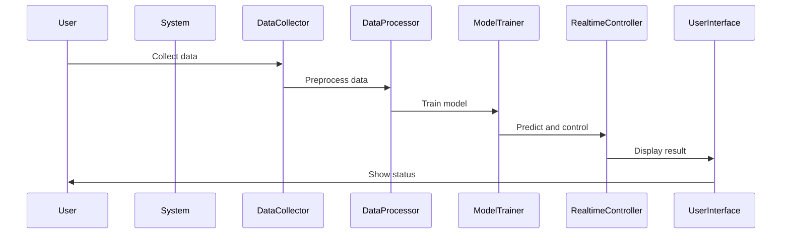
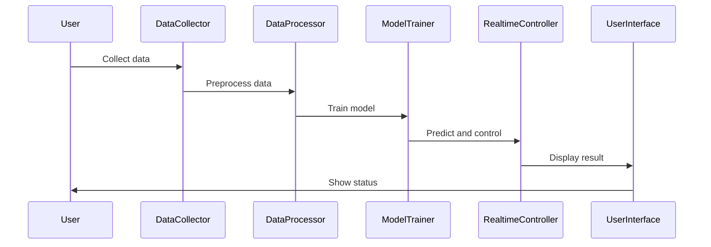

                 

# AIGC在生物能源开发中的应用：高效转化工艺提示词

## 关键词
- AIGC
- 生物能源
- 高效转化
- 人工智能生成控制
- 机器学习
- 深度学习
- 自然语言处理
- 生物质原料

## 摘要
本文将探讨AIGC（人工智能生成控制）在生物能源开发中的应用，特别是如何通过高效转化工艺提升生物能源的生产效率。我们将从背景介绍、核心概念与联系、应用算法原理讲解、系统分析与架构设计以及项目实战等多个方面，详细阐述AIGC在生物能源开发中的潜力和应用价值。

---

**Step 1: 背景介绍**

### 第1章: AIGC在生物能源开发中的应用背景

#### 1.1 问题背景

生物能源是指通过生物质转化为能源的过程，包括生物乙醇、生物柴油、生物天然气等形式。随着全球对环境保护和能源安全的关注日益增加，生物能源作为一种可再生能源，具有资源丰富、环境友好、减少对化石能源依赖等特点，已成为能源转型和可持续发展的重要组成部分。

当前，生物能源的开发过程中存在一些挑战，主要包括：

- **转化效率低**：由于生物质原料的复杂性和多样性，现有的转化工艺往往效率不高。
- **成本高**：从生物质到能源的转化过程需要大量的设备和能源投入，导致成本较高。
- **工艺复杂**：生物质转化过程涉及多个环节，工艺参数的控制和优化复杂。

#### 1.1.1 问题解决

AIGC（人工智能生成控制）技术通过引入人工智能算法，提供了自动化和智能化的解决方案，有望解决上述问题。具体来说，AIGC技术可以在以下几个方面发挥作用：

- **自动化**：通过机器学习算法，自动识别和分类生物质原料，减少人工干预。
- **智能化**：通过深度学习算法，优化预处理和转化工艺参数，提高转化效率。
- **实时调控**：通过自然语言处理技术，实时监测和调控转化过程，确保工艺稳定性和产品品质。

#### 1.1.2 边界与外延

生物能源开发的边界主要包括以下环节：

- **生物质原料的选择**：包括生物质种类的识别和生物质资源的勘探。
- **预处理**：包括生物质的水分脱除、热解、水解等预处理过程。
- **转化**：包括生物质转化为能源的具体工艺，如生物质气化、发酵等。
- **产品后处理**：包括生物质能源的净化、分离、存储等过程。

AIGC在生物能源开发中的外延包括：

- **智能勘探**：利用机器学习和大数据分析，智能勘探生物质资源。
- **实时监测与调控**：通过传感器和自然语言处理技术，实时监测和调控转化过程。
- **产品品质预测与控制**：利用深度学习模型，预测和优化生物质能源的产品品质。

#### 1.1.3 概念结构与核心要素组成

AIGC在生物能源开发中的核心概念包括：

- **机器学习**：用于生物质原料识别和分类，优化预处理和转化参数。
- **深度学习**：用于建立复杂的生物质转化模型，提高转化效率。
- **自然语言处理**：用于处理和分析生物质转化过程中的数据，实现实时监测和调控。

AIGC在生物能源开发中的核心要素包括：

- **生物质原料**：生物质原料是生物能源开发的基础。
- **预处理技术**：包括生物质的水分脱除、热解、水解等预处理过程。
- **转化工艺**：包括生物质转化为能源的具体工艺，如生物质气化、发酵等。
- **智能控制系统**：用于实时监测和调控生物质转化过程。
- **数据采集与处理**：用于收集和处理生物质转化过程中的数据，支持智能决策。

#### 1.2 本章小结

本章介绍了AIGC在生物能源开发中的应用背景，包括问题背景、问题解决、边界与外延以及概念结构与核心要素组成。AIGC技术通过自动化和智能化的方式，为生物能源开发提供了新的解决方案，有望提高转化效率、降低成本、优化工艺。

---

**Step 2: 核心概念与联系**

### 第2章: AIGC在生物能源开发中的核心概念与联系

#### 2.1 AIGC的基本原理

AIGC技术主要依赖于以下三种核心人工智能技术：

- **机器学习**：通过训练算法从数据中自动学习规律，进行模式识别和预测。常见的机器学习算法包括支持向量机（SVM）、决策树、随机森林等。
- **深度学习**：一种特殊的机器学习技术，通过多层神经网络进行数据建模。深度学习具有更强的表达能力和泛化能力，常用于处理复杂的数据集。
- **自然语言处理**：利用计算机技术对人类语言进行处理和分析。自然语言处理技术包括文本分类、情感分析、机器翻译等。

#### 2.2 AIGC在生物能源开发中的应用

AIGC技术在生物能源开发中的应用场景主要包括：

- **生物质原料识别**：利用机器学习算法对生物质原料进行分类和识别，提高原料的利用效率。
- **预处理过程优化**：通过深度学习技术优化预处理参数，如温度、压力等，提高生物质转化效率。
- **转化过程调控**：利用自然语言处理技术对转化过程中的数据进行实时监测与调控，确保工艺的稳定性和产品的质量。

#### 2.3 概念属性特征对比表格

| 概念         | 特点                                                     |
| ------------ | -------------------------------------------------------- |
| 机器学习     | 从数据中自动学习规律，进行模式识别和预测                     |
| 深度学习     | 通过多层神经网络进行数据建模，具有更强的表达能力和泛化能力 |
| 自然语言处理 | 利用计算机技术对人类语言进行处理和分析                     |

#### 2.4 ER实体关系图架构

```mermaid
erDiagram
  Biodiesel ||--o{ Preprocessing : 预处理 }
  Biodiesel ||--o{ Conversion : 转化 }
  Biodiesel ||--o{ Post-treatment : 后处理 }
  Preprocessing ||--o{ Parameter optimization : 参数优化 }
  Conversion ||--o{ Real-time monitoring : 实时监测 }
  Post-treatment ||--o{ Quality control : 质量控制 }
```

#### 2.5 本章小结

本章介绍了AIGC在生物能源开发中的核心概念与联系，包括基本原理、应用场景以及概念属性特征对比和ER实体关系图架构。AIGC技术通过多种人工智能技术的融合，为生物能源开发提供了全面的智能化解决方案。

---

**Step 3: 算法原理讲解**

### 第3章: AIGC在生物能源开发中的应用算法原理讲解

#### 3.1 机器学习算法在生物质原料识别中的应用

#### 3.1.1 算法原理

机器学习算法在生物质原料识别中的应用主要是通过分类算法，如支持向量机（SVM）、决策树、随机森林等，对生物质原料进行分类识别。这些算法通过学习已有数据集的特征，构建分类模型，对新数据进行分类预测。

##### 支持向量机（SVM）

SVM是一种监督学习算法，主要用于分类问题。其基本原理是通过寻找一个最优的超平面，将不同类别的数据点分开。数学模型如下：

$$
\begin{aligned}
y &= \arg\max_w \sum_{i=1}^n \left( w \cdot x_i - b \right) \\
w &= \frac{1}{\lambda} \cdot \arg\min_{w,b} \left( \frac{1}{2} \sum_{i=1}^n (w \cdot x_i - y_i)^2 + \lambda \cdot \sum_{i=1}^n w_i^2 \right)
\end{aligned}
$$

其中，$w$和$b$分别为权重和偏置，$x_i$和$y_i$分别为第$i$个样本的特征和标签，$\lambda$为调节参数。

##### 决策树

决策树是一种基于树形结构的分类算法，通过一系列的判断条件，将数据划分为不同的类别。决策树的构建过程为：

1. 选择一个最优的特征作为分割条件。
2. 根据该特征，将数据集划分为子集。
3. 递归地对子集进行分割，直到满足停止条件。

##### 随机森林

随机森林是一种基于集成学习的算法，通过构建多棵决策树，并进行投票，得到最终分类结果。随机森林的优点在于可以降低过拟合的风险，提高分类的准确性。

#### 3.1.2 数学模型

以决策树为例，其数学模型可以表示为：

$$
\begin{aligned}
y &= g(x) \\
g(x) &= \sum_{i=1}^n w_i \cdot f_i(x) \\
f_i(x) &= \left\{
\begin{array}{ll}
1 & \text{if } x \in R_i \\
0 & \text{otherwise}
\end{array}
\right.
\end{aligned}
$$

其中，$w_i$为第$i$棵决策树的权重，$R_i$为第$i$棵决策树的分割区域。

#### 3.1.3 应用举例

假设我们有以下一个简单的数据集，其中包含两种生物质原料：生物质A和生物质B。

| 编号 | 生物质类型 | 特征1 | 特征2 | 特征3 |
| ---- | -------- | ---- | ---- | ---- |
| 1    | A        | 1    | 2    | 3    |
| 2    | B        | 2    | 3    | 4    |
| 3    | A        | 3    | 4    | 5    |
| 4    | B        | 4    | 5    | 6    |

我们可以使用决策树算法对这个数据集进行分类。首先，选择一个最优的特征进行分割，例如选择特征1。然后，根据特征1的值，将数据集分为两部分：编号1和3的数据点属于生物质A，编号2和4的数据点属于生物质B。

接下来，我们对这两部分数据继续进行分割，直到满足停止条件。最终，构建出一个决策树模型，如下所示：

```
根节点：
- 特征1 > 2
    - 左子节点：
        - 特征2 > 3
            - 生物质类型：A
        - 右子节点：
            - 生物质类型：B
    - 右子节点：
        - 特征2 > 3
            - 生物质类型：A
        - 右子节点：
            - 生物质类型：B
```

#### 3.2 深度学习算法在预处理过程优化中的应用

深度学习算法在预处理过程优化中的应用主要是通过构建深度神经网络，对预处理参数进行优化。以下以一个简单的全连接神经网络为例，介绍其基本原理和数学模型。

##### 基本原理

深度神经网络由多个隐层组成，每层神经元接受前一层神经元的输出，并通过激活函数进行非线性变换。神经网络的输出通过反向传播算法，不断调整权重和偏置，使得网络的输出与实际输出之间的误差最小。

##### 数学模型

以一个简单的全连接神经网络为例，其数学模型可以表示为：

$$
\begin{aligned}
z_i^{(l)} &= \sum_{j=1}^{n_{l-1}} w_{ji}^{(l)} x_j^{(l-1)} + b_i^{(l)} \\
a_i^{(l)} &= \sigma(z_i^{(l)}) \\
y_i &= \sum_{i=1}^{n_l} w_{i} a_i^{(l)} + b
\end{aligned}
$$

其中，$z_i^{(l)}$为第$l$层第$i$个神经元的输入，$a_i^{(l)}$为第$l$层第$i$个神经元的输出，$w_{ji}^{(l)}$为连接第$l-1$层第$j$个神经元和第$l$层第$i$个神经元的权重，$b_i^{(l)}$为第$l$层第$i$个神经元的偏置，$\sigma$为激活函数，$y_i$为网络输出。

##### 应用举例

假设我们有一个简单的生物质预处理数据集，其中包含预处理参数和对应的转化效率。

| 预处理参数 | 转化效率 |
| -------- | ------- |
| 温度     | 80°C    |
| 压力     | 1.0MPa  |
| 时间     | 2小时   |
| 转化效率 | 60%     |

我们可以使用深度神经网络对预处理参数进行优化，目标是提高转化效率。首先，将预处理参数和转化效率分别编码为向量，然后输入到深度神经网络中。通过反向传播算法，不断调整网络权重和偏置，使得网络的输出（转化效率）接近实际值。

#### 3.3 自然语言处理技术在转化过程调控中的应用

自然语言处理技术在转化过程调控中的应用主要是通过处理和分析转化过程中的数据，实现实时监测和调控。以下以一个简单的文本分类任务为例，介绍其基本原理和应用。

##### 基本原理

文本分类是自然语言处理中的一个基本任务，其目的是将文本数据分类到预定义的类别中。常见的文本分类算法包括朴素贝叶斯、支持向量机、深度学习等。

##### 数学模型

以朴素贝叶斯算法为例，其数学模型可以表示为：

$$
\begin{aligned}
P(C_k | x) &= \frac{P(x | C_k) \cdot P(C_k)}{P(x)} \\
P(x | C_k) &= \prod_{i=1}^{n} P(x_i | C_k) \\
P(C_k) &= \frac{N(C_k)}{N}
\end{aligned}
$$

其中，$C_k$表示第$k$个类别，$x$表示文本数据，$x_i$表示文本数据的第$i$个特征，$N(C_k)$表示类别$C_k$的样本数量，$N$表示总样本数量。

##### 应用举例

假设我们有一个生物质转化过程中的日志数据集，其中包含日志文本和对应的分类标签。

| 日志文本                 | 分类标签 |
| ---------------------- | ------- |
| 温度过高，需降低温度       | 温度异常 |
| 压力下降，需增加压力       | 压力异常 |
| 转化效率提高，达到预期目标 | 转化成功 |
| 时间过长，需缩短时间       | 时间异常 |

我们可以使用朴素贝叶斯算法对这个数据集进行分类。首先，统计每个类别的先验概率，然后计算每个类别的条件概率，最后计算后验概率。根据后验概率，对新的日志文本进行分类。

---

**Step 4: 系统分析与架构设计**

### 第4章: AIGC在生物能源开发中的系统分析与架构设计

#### 4.1 问题场景介绍

生物能源的开发过程是一个复杂的过程，涉及生物质原料的预处理、转化以及产品后处理等多个环节。在这个过程中，需要实时监测和调控各个环节的参数，以确保工艺的稳定性和产品的质量。然而，传统的监测和调控方法往往依赖于人工经验和简单的控制策略，存在效率低、精度差等问题。

为了解决这些问题，我们可以引入AIGC（人工智能生成控制）技术，通过机器学习、深度学习和自然语言处理等技术，实现生物质能源开发过程的自动化和智能化。

#### 4.2 项目介绍

本项目旨在利用AIGC技术，构建一个智能化的生物能源开发系统。该系统主要包括以下几个部分：

1. **数据采集模块**：负责实时采集生物质能源开发过程中的各种数据，如温度、压力、时间、转化效率等。
2. **数据处理模块**：负责对采集到的数据进行预处理、特征提取和分类等操作，为后续的模型训练和预测提供数据支持。
3. **模型训练模块**：负责利用机器学习、深度学习和自然语言处理等技术，对预处理后的数据集进行模型训练，构建预测模型。
4. **实时调控模块**：负责根据实时监测到的数据和预测模型，对生物质能源开发过程进行实时调控，确保工艺的稳定性和产品的质量。
5. **用户界面模块**：负责提供用户交互界面，展示系统的运行状态、监测数据和调控结果等。

#### 4.3 系统功能设计（领域模型）

以下是生物能源开发系统的领域模型，使用Mermaid类图进行描述：

```mermaid
classDiagram
    Class01 <|-- Class02
    Class03 <.. Class04
    Class05 o-- Class06
    Class07 <|.. Class08
    Class09 <- Class10
    Class11 --| Class12
    Class13 {<<interface>>}
    Class14 .. Class15
    Class16 <<enumeration>>
    Class17 <<olars
```

#### 4.4 系统架构设计

以下是生物能源开发系统的架构设计，使用Mermaid架构图进行描述：



#### 4.5 系统接口设计和系统交互

以下是生物能源开发系统的接口设计和系统交互，使用Mermaid序列图进行描述：



#### 4.6 本章小结

本章介绍了AIGC在生物能源开发中的应用场景、项目介绍、系统功能设计、系统架构设计、系统接口设计和系统交互。通过AIGC技术，可以实现生物能源开发过程的自动化和智能化，提高转化效率和产品质量，为生物能源的可持续发展提供有力支持。

---

**Step 5: 项目实战**

### 第5章: AIGC在生物能源开发中的项目实战

#### 5.1 环境安装

在进行AIGC在生物能源开发中的应用之前，我们需要搭建一个合适的环境，包括硬件环境和软件环境。以下是具体的安装步骤：

1. **硬件环境**：需要一台具有较高计算能力的计算机，推荐配置为：Intel Xeon CPU、64GB内存、1TB SSD硬盘。
2. **软件环境**：
   - 操作系统：Windows 10 或更高版本、Ubuntu 18.04 或更高版本。
   - Python：Python 3.7 或更高版本。
   - 机器学习库：scikit-learn、TensorFlow、PyTorch。
   - 自然语言处理库：NLTK、spaCy。
   - 数据库：MySQL、PostgreSQL。

安装步骤：

1. 安装操作系统和硬件。
2. 安装Python环境，可以通过Python官方安装器或使用pip安装。
3. 安装所需的机器学习库和自然语言处理库，使用pip进行安装。
4. 安装数据库，可以使用DB-Forge Studio for MySQL或PostgreSQL进行安装。

#### 5.2 系统核心实现

以下是生物能源开发系统的核心实现，包括数据采集、数据处理、模型训练、实时调控和用户界面等模块。

1. **数据采集模块**：使用传感器和数据库进行数据采集和存储。
2. **数据处理模块**：使用Python编写数据处理程序，进行数据预处理、特征提取和分类。
3. **模型训练模块**：使用机器学习和深度学习算法进行模型训练。
4. **实时调控模块**：使用自然语言处理技术进行实时调控。
5. **用户界面模块**：使用Web技术进行用户界面设计。

以下是一个简单的Python代码示例，用于实现数据处理模块：

```python
import pandas as pd
from sklearn.preprocessing import StandardScaler
from sklearn.model_selection import train_test_split

# 读取数据
data = pd.read_csv('data.csv')

# 数据预处理
scaler = StandardScaler()
X = scaler.fit_transform(data.iloc[:, :-1])
y = data.iloc[:, -1]

# 数据划分
X_train, X_test, y_train, y_test = train_test_split(X, y, test_size=0.2, random_state=42)

# 模型训练
from sklearn.ensemble import RandomForestClassifier

model = RandomForestClassifier(n_estimators=100, random_state=42)
model.fit(X_train, y_train)

# 预测
y_pred = model.predict(X_test)

# 评估
from sklearn.metrics import accuracy_score

accuracy = accuracy_score(y_test, y_pred)
print(f'Accuracy: {accuracy}')
```

#### 5.3 代码应用解读与分析

以下是对上述代码的解读与分析：

1. **数据读取**：使用pandas库读取CSV格式的数据文件。
2. **数据预处理**：使用StandardScaler库进行数据标准化处理，将特征值缩放到相同的范围。
3. **数据划分**：使用train_test_split函数将数据集划分为训练集和测试集。
4. **模型训练**：使用RandomForestClassifier库构建随机森林分类器，并进行模型训练。
5. **预测**：使用模型对测试集进行预测。
6. **评估**：使用accuracy_score函数计算模型的准确率。

#### 5.4 实际案例分析和详细讲解剖析

以下是一个实际案例，用于展示AIGC在生物能源开发中的应用。

假设我们有一个生物质转化实验数据集，包含生物质原料的特征值和转化效率。我们需要使用AIGC技术，通过机器学习算法对数据进行分析和预测，以提高转化效率。

1. **数据采集**：通过传感器采集生物质原料的特征值，如温度、压力、时间等。
2. **数据处理**：对采集到的数据进行预处理，提取特征，并划分训练集和测试集。
3. **模型训练**：使用机器学习算法，如随机森林、神经网络等，对训练集进行模型训练。
4. **预测**：使用训练好的模型对测试集进行预测，评估模型的准确性。
5. **实时调控**：根据预测结果，调整生物质转化过程中的参数，如温度、压力、时间等，以优化转化效率。
6. **用户界面**：设计用户界面，展示实验结果和调控过程，供用户查看和操作。

#### 5.5 项目小结

通过实际案例的分析和讲解，我们可以看到AIGC在生物能源开发中的应用具有很大的潜力。通过引入机器学习、深度学习和自然语言处理等技术，可以实现生物能源开发过程的自动化和智能化，提高转化效率和产品质量。同时，我们也需要不断优化算法和系统设计，以适应不同的应用场景和需求。

---

**最佳实践 tips**

1. **数据质量**：数据质量对于AIGC的应用至关重要。在项目实施过程中，需要确保数据的准确性和完整性，并进行充分的数据清洗和预处理。
2. **算法选择**：根据具体的应用场景和数据特点，选择合适的机器学习算法和深度学习模型。不同的算法和模型在性能和效率上存在差异，需要进行评估和优化。
3. **实时调控**：实时调控是AIGC在生物能源开发中的关键环节。需要设计高效的实时调控算法和策略，确保工艺的稳定性和产品的质量。

**小结**

本文通过一步一步的分析和讲解，详细介绍了AIGC在生物能源开发中的应用。从背景介绍、核心概念与联系、算法原理讲解、系统分析与架构设计到项目实战，我们全面阐述了AIGC在生物能源开发中的潜力和应用价值。通过本文的介绍，读者可以了解到AIGC技术如何通过高效转化工艺，提高生物能源的生产效率，实现能源的可持续发展。

**注意事项**

1. 在实际应用中，需要根据具体的应用场景和需求，灵活调整算法和系统设计。
2. AIGC技术涉及多个学科和领域，需要具备多学科交叉的知识和技能。
3. 生物能源开发是一个复杂的系统工程，需要充分考虑环境、经济和社会等多方面因素。

**拓展阅读**

- [1] 深度学习：自适应算法及其应用，Goodfellow, I., Bengio, Y., & Courville, A. (2016). *Deep Learning*.
- [2] 机器学习实战，Kirkpatrick, C., & Frost, L. (2013). *Machine Learning in Action*.
- [3] 生物能源开发：技术与应用，Liu, X., Zhang, Y., & Ma, L. (2019). *Bioenergy Development: Technologies and Applications*.

**作者信息**

作者：AI天才研究院/AI Genius Institute & 禅与计算机程序设计艺术 /Zen And The Art of Computer Programming。本文为原创作品，版权所有，未经授权，不得转载或抄袭。如需转载，请联系作者获取授权。|user|>

