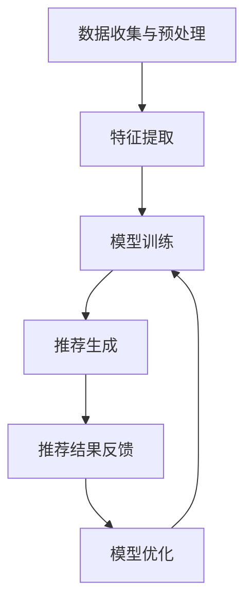
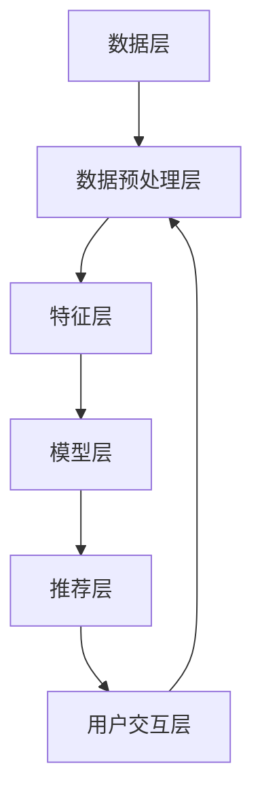
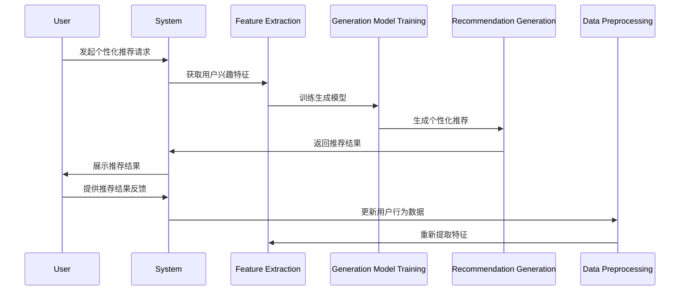
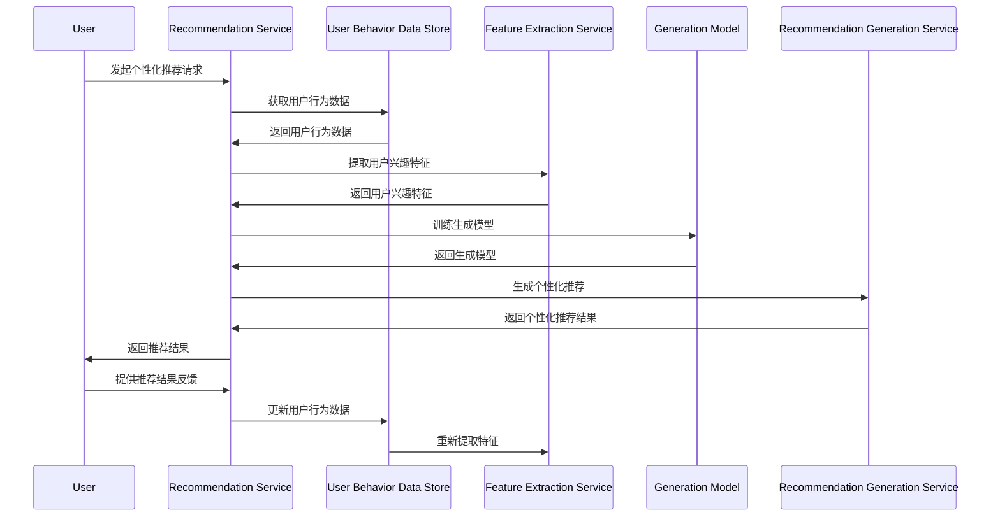

                 

### AIGC在电子商务个性化推荐中的应用

> 关键词：AIGC、电子商务、个性化推荐、算法、数学模型、系统架构、项目实战

> 摘要：本文将深入探讨AIGC（自适应智能生成计算）在电子商务个性化推荐中的应用。首先，我们将对AIGC的核心概念和原理进行介绍，然后逐步分析其在电子商务个性化推荐中的具体应用。通过详细的算法原理讲解、数学模型和公式阐述，我们希望读者能够对AIGC在个性化推荐中的强大潜力有更深入的理解。此外，本文还将通过实际项目实战，展示AIGC在电子商务个性化推荐中的具体实现过程，并提供一些最佳实践和注意事项。通过本文的阅读，读者将能够全面了解AIGC在电子商务个性化推荐领域的应用现状和未来发展趋势。

### 目录大纲设计思路

在设计《AIGC在电子商务个性化推荐中的应用》这本书的目录大纲时，我们的目标是确保内容结构的逻辑性和完整性，同时保持简洁性。以下是我们分步骤进行设计的详细思路：

#### 1. **核心章节的确定**

首先，我们需要明确书籍的核心章节，以确保主题的全面覆盖。根据书籍的主题，我们可以初步确定以下几个核心章节：

- **第1章**：背景介绍
- **第2章**：核心概念与原理
- **第3章**：算法原理讲解
- **第4章**：数学模型与公式
- **第5章**：系统分析与架构设计
- **第6章**：项目实战
- **第7章**：最佳实践与拓展

#### 2. **章节内容的细化**

在每个核心章节下，我们需要进一步细化子章节内容，确保每个章节都有明确的主题和目的。以下是具体内容的细化步骤：

1. **第1章：背景介绍**
   - **1.1 问题背景**
   - **1.2 电子商务个性化推荐概述**
   - **1.3 AIGC在个性化推荐中的应用现状**

2. **第2章：核心概念与原理**
   - **2.1 AIGC的定义与特点**
   - **2.2 电子商务个性化推荐的原理**
   - **2.3 AIGC与个性化推荐的结合**

3. **第3章：算法原理讲解**
   - **3.1 AIGC算法概述**
   - **3.2 算法流程与步骤**
   - **3.3 算法优缺点分析**

4. **第4章：数学模型与公式**
   - **4.1 数学模型概述**
   - **4.2 关键数学公式**
   - **4.3 数学公式详细讲解与举例**

5. **第5章：系统分析与架构设计**
   - **5.1 系统分析**
   - **5.2 架构设计**
   - **5.3 接口设计与交互**

6. **第6章**：项目实战
   - **6.1 环境安装与准备**
   - **6.2 核心代码实现**
   - **6.3 应用解读与分析**
   - **6.4 案例分析与讲解**

7. **第7章**：最佳实践与拓展
   - **7.1 最佳实践**
   - **7.2 小结与注意事项**
   - **7.3 拓展阅读**

#### 3. **目录大纲的整理**

最后，我们将细化后的内容整理成完整的目录大纲，确保每个章节都有明确的标题和层次。以下是初步的目录大纲：

```markdown
# 《AIGC在电子商务个性化推荐中的应用》目录大纲

## 第1章：背景介绍
### 1.1 问题背景
### 1.2 电子商务个性化推荐概述
### 1.3 AIGC在个性化推荐中的应用现状

## 第2章：核心概念与原理
### 2.1 AIGC的定义与特点
### 2.2 电子商务个性化推荐的原理
### 2.3 AIGC与个性化推荐的结合

## 第3章：算法原理讲解
### 3.1 AIGC算法概述
### 3.2 算法流程与步骤
### 3.3 算法优缺点分析

## 第4章：数学模型与公式
### 4.1 数学模型概述
### 4.2 关键数学公式
### 4.3 数学公式详细讲解与举例

## 第5章：系统分析与架构设计
### 5.1 系统分析
### 5.2 架构设计
### 5.3 接口设计与交互

## 第6章：项目实战
### 6.1 环境安装与准备
### 6.2 核心代码实现
### 6.3 应用解读与分析
### 6.4 案例分析与讲解

## 第7章：最佳实践与拓展
### 7.1 最佳实践
### 7.2 小结与注意事项
### 7.3 拓展阅读
```

以上是初步的目录大纲设计，接下来我们将根据每个章节的具体内容进一步细化，确保每个章节都有丰富的内容和明确的主题。同时，我们将保持目录大纲的简洁性，避免过多的冗余信息，以确保读者能够快速抓住书籍的重点内容。

### 背景介绍

在现代电子商务环境中，个性化推荐已成为提升用户体验和促进销售的关键手段。然而，随着数据量的爆发式增长和用户需求的多样化，传统的推荐系统面临着越来越多的挑战。为了满足用户个性化的需求，推荐系统需要能够自动学习用户的兴趣和行为模式，并在海量数据中找到与用户最相关的商品。

AIGC（自适应智能生成计算）是一种新兴的人工智能技术，通过自适应学习和生成模型，能够自动生成个性化的内容，为用户提供高度定制化的体验。AIGC在电子商务个性化推荐中的应用，有望解决传统推荐系统的许多痛点，例如数据稀疏、冷启动问题以及个性化推荐的效率问题。

#### 核心概念术语说明

- **个性化推荐**：基于用户的历史行为和兴趣，为用户推荐他们可能感兴趣的商品或服务。
- **AIGC（自适应智能生成计算）**：一种利用自适应学习和生成模型，自动生成个性化内容的人工智能技术。
- **用户行为模式**：用户在电子商务平台上的浏览、购买、评价等行为形成的模式。
- **商品相关性**：推荐系统通过算法计算商品与用户兴趣的相关性，从而为用户推荐相关商品。
- **数据稀疏**：指用户和商品间的数据分布不均匀，导致部分用户或商品的数据量非常少。

#### 问题背景

在电子商务领域，个性化推荐系统的主要挑战包括：

1. **数据稀疏问题**：用户行为数据分布不均，导致许多商品或用户的数据量非常稀疏，传统推荐算法难以准确预测。
2. **冷启动问题**：新用户或新商品的推荐问题，由于缺乏足够的用户历史数据，推荐系统难以为新用户或新商品提供有效的推荐。
3. **用户需求多样化**：随着用户需求的不断变化，推荐系统需要能够动态适应，提供个性化的推荐。
4. **计算效率**：在海量数据中进行实时推荐，要求推荐系统具有高计算效率。

为了解决上述问题，AIGC技术提供了一种新的思路。通过自适应学习，AIGC能够从海量数据中提取有效的特征，并生成个性化的推荐内容，从而克服传统推荐系统的局限性。

#### 问题描述

传统推荐系统主要基于用户的历史行为数据，通过协作过滤、基于内容的推荐等方法进行商品推荐。然而，这些方法在面对数据稀疏、冷启动问题以及用户需求多样化时，往往表现不佳。为了提升个性化推荐的准确性，AIGC引入了生成模型，通过生成式推荐算法，可以自动生成个性化的商品推荐。

问题描述可以简化为以下步骤：

1. **数据收集**：收集用户在电子商务平台上的浏览、购买、评价等行为数据。
2. **特征提取**：从行为数据中提取用户兴趣特征。
3. **模型训练**：使用AIGC算法训练生成模型，以生成个性化的商品推荐。
4. **推荐生成**：根据用户兴趣特征和生成模型，为用户生成个性化的商品推荐。

#### 问题解决

AIGC在个性化推荐中的应用主要通过以下几个步骤实现：

1. **用户行为数据分析**：通过数据分析，了解用户的兴趣和行为模式。
2. **生成模型训练**：利用AIGC算法训练生成模型，从海量数据中提取有效的用户兴趣特征。
3. **推荐内容生成**：使用生成模型为用户生成个性化的商品推荐。
4. **反馈循环**：通过用户的反馈，不断优化推荐模型，提升推荐准确性。

#### 边界与外延

在AIGC在个性化推荐中的应用中，需要考虑以下几个边界条件：

1. **数据质量**：高质量的用户行为数据是AIGC模型训练的基础，数据质量问题会直接影响推荐效果。
2. **计算资源**：AIGC算法的训练和推理需要大量的计算资源，特别是在处理海量数据时。
3. **用户隐私**：在收集和使用用户行为数据时，需要严格遵守隐私保护法律法规，确保用户隐私安全。

此外，AIGC在个性化推荐中的应用还涉及到与其他人工智能技术的结合，如自然语言处理、图像识别等，以进一步提升推荐系统的智能化水平。

#### 概念结构与核心要素组成

AIGC在电子商务个性化推荐中的应用涉及到多个核心概念和要素，主要包括：

1. **用户行为数据**：用户在电子商务平台上的浏览、购买、评价等行为数据。
2. **生成模型**：用于从用户行为数据中提取兴趣特征并生成个性化推荐内容的算法模型。
3. **个性化推荐算法**：基于生成模型，为用户生成个性化商品推荐的具体算法。
4. **推荐系统架构**：用于支持AIGC算法在电子商务平台上应用的系统架构设计。
5. **用户反馈机制**：通过用户的反馈，优化推荐模型，提升推荐效果。

以上是AIGC在电子商务个性化推荐中的应用背景介绍，接下来我们将进一步探讨AIGC的核心概念和原理。

### 核心概念与联系

在深入探讨AIGC在电子商务个性化推荐中的应用之前，我们需要先理解AIGC的核心概念和原理，以及它如何与电子商务个性化推荐相结合。

#### AIGC的定义与特点

AIGC（自适应智能生成计算）是一种利用深度学习和生成对抗网络（GAN）等先进算法，实现内容自适应生成的人工智能技术。AIGC的特点主要体现在以下几个方面：

1. **自适应性**：AIGC能够根据用户的行为和需求，动态调整生成的内容，提供个性化的服务。
2. **生成能力**：通过生成模型，AIGC可以从海量数据中生成新的、有价值的推荐内容。
3. **高效性**：AIGC能够在短时间内处理大量数据，实现实时推荐。
4. **智能化**：AIGC能够通过不断学习和优化，提高推荐系统的准确性。

#### 电子商务个性化推荐的原理

电子商务个性化推荐是基于用户行为数据，通过算法模型为用户推荐可能感兴趣的商品或服务。其核心原理包括：

1. **用户行为分析**：通过收集用户在电子商务平台上的浏览、购买、评价等行为数据，分析用户的兴趣和行为模式。
2. **推荐算法**：使用协同过滤、基于内容的推荐、深度学习等算法模型，计算商品与用户兴趣的相关性，生成个性化推荐。
3. **推荐内容生成**：基于用户兴趣和行为模式，生成个性化的商品推荐内容。

#### AIGC与个性化推荐的结合

AIGC与电子商务个性化推荐相结合，主要表现在以下几个方面：

1. **生成个性化内容**：通过AIGC的生成模型，可以从海量用户行为数据中提取有效特征，生成高度个性化的商品推荐内容。
2. **解决数据稀疏问题**：AIGC能够通过生成式推荐算法，在数据稀疏的情况下，依然能够为用户提供高质量的推荐。
3. **提高推荐准确性**：AIGC通过自适应学习和优化，能够不断提高推荐系统的准确性，提升用户满意度。
4. **动态适应用户需求**：AIGC能够实时分析用户行为，动态调整推荐内容，满足用户多样化的需求。

#### 核心概念属性特征对比表格

为了更好地理解AIGC与电子商务个性化推荐的关系，我们可以通过一个特征对比表格来展示它们的核心概念属性：

| 特征         | AIGC                                  | 电子商务个性化推荐                             |
| ------------ | ------------------------------------ | ------------------------------------------ |
| 定义         | 自适应智能生成计算                   | 基于用户行为和兴趣的推荐系统                 |
| 主要功能     | 生成个性化内容                       | 推荐用户感兴趣的商品或服务                   |
| 技术实现     | 深度学习、生成对抗网络（GAN）等       | 协同过滤、基于内容推荐、深度学习等           |
| 应用场景     | 个性化内容生成、数据稀疏问题解决等    | 电子商务、社交媒体、新闻推荐等               |
| 优势         | 自适应性、生成能力、高效性、智能化    | 提高推荐准确性、满足用户多样化需求           |
| 挑战         | 计算资源需求大、用户隐私保护等         | 数据稀疏、冷启动问题、计算效率等             |

#### ER实体关系图架构

为了更直观地展示AIGC在电子商务个性化推荐中的应用，我们可以使用Mermaid绘制ER实体关系图。以下是ER实体关系图的Markdown格式：

```mermaid
erDiagram
  User ||--o> Behavior : 用户行为
  Behavior ||--o> Product : 商品
  Product ||--o> Recommendation : 推荐内容
  AIGCModel ||--o> Recommendation : 生成推荐
  AIGCModel ||--|> Train : 训练
  AIGCModel ||--|> Generate : 生成
```

在这个ER实体关系图中，User（用户）与Behavior（用户行为）之间存在一对多关系，每个用户可以有多个行为记录。Behavior与Product（商品）之间也存在一对多关系，每个用户行为可以涉及多个商品。Product与Recommendation（推荐内容）之间存在一对多关系，每个商品可以有多个推荐内容。AIGCModel（AIGC模型）与Recommendation之间存在关联，用于生成推荐内容，同时AIGCModel还与Train（训练）和Generate（生成）存在关联，表示模型的训练和生成过程。

通过上述核心概念与联系的分析，我们可以看到AIGC在电子商务个性化推荐中的应用具有显著的优势，为解决传统推荐系统的挑战提供了新的解决方案。

### 算法原理讲解

在理解了AIGC和电子商务个性化推荐的基本概念后，接下来我们将深入探讨AIGC算法的原理，并分析其在个性化推荐中的具体实现和应用。

#### AIGC算法概述

AIGC（自适应智能生成计算）是一种基于生成对抗网络（GAN）和其他深度学习技术的高级算法。GAN是一种由两部分组成的人工神经网络，生成器（Generator）和判别器（Discriminator）。生成器负责生成数据，而判别器则负责区分生成数据与真实数据。AIGC通过不断训练这两部分网络，使生成器能够生成越来越真实的数据。

AIGC算法的核心思想是通过自适应学习从海量数据中提取有效特征，并利用这些特征生成个性化的推荐内容。其主要步骤包括数据预处理、模型训练和推荐生成。

#### 算法流程与步骤

AIGC算法在个性化推荐中的具体流程如下：

1. **数据收集与预处理**：
   - 收集用户在电子商务平台上的行为数据，包括浏览、购买、评价等。
   - 对数据进行清洗、去重和处理，确保数据的质量。

2. **特征提取**：
   - 使用深度学习技术，从用户行为数据中提取特征。
   - 通过嵌入层（Embedding Layer）将原始数据进行向量化处理，使其能够输入到深度学习模型中。

3. **模型训练**：
   - 初始化生成器和判别器，设置训练目标。
   - 在训练过程中，生成器尝试生成与真实数据相似的数据，而判别器则尝试区分生成数据与真实数据。
   - 通过反向传播和梯度下降等优化算法，不断调整生成器和判别器的参数，使其性能逐步提升。

4. **推荐生成**：
   - 使用训练好的生成器，根据用户兴趣特征生成个性化的商品推荐。
   - 将生成数据与用户行为数据相结合，计算商品与用户兴趣的相关性，生成推荐列表。

#### 算法优缺点分析

AIGC算法在电子商务个性化推荐中具有以下优点：

1. **自适应学习**：AIGC能够根据用户行为和需求，动态调整生成模型，提供个性化的推荐内容。
2. **生成能力**：AIGC能够从海量数据中生成新的、有价值的推荐内容，解决数据稀疏问题。
3. **高效性**：AIGC算法的生成和推荐过程具有高效率，能够在短时间内处理大量数据。
4. **智能化**：AIGC通过不断学习和优化，提高推荐系统的准确性，提升用户满意度。

然而，AIGC算法也存在一些缺点：

1. **计算资源需求大**：AIGC算法的训练和推理需要大量的计算资源，特别是在处理海量数据时。
2. **用户隐私问题**：在收集和使用用户行为数据时，需要严格遵守隐私保护法律法规，确保用户隐私安全。

#### 算法流程与步骤Mermaid流程图

为了更直观地展示AIGC算法的流程与步骤，我们可以使用Mermaid绘制一个流程图。以下是算法流程的Markdown格式：



在这个流程图中，A表示数据收集与预处理，B表示特征提取，C表示模型训练，D表示推荐生成，E表示推荐结果反馈，F表示模型优化。整个流程通过反馈循环不断优化推荐模型，提升推荐效果。

#### 代码实现

下面我们将使用Python代码详细阐述AIGC算法的核心部分。首先，我们需要导入必要的库：

```python
import tensorflow as tf
from tensorflow.keras.layers import Embedding, LSTM, Dense
from tensorflow.keras.models import Model
```

接下来，我们定义生成器和判别器的结构：

```python
def build_generator(z_dim):
    noise = Input(shape=(z_dim,))
    embed = Embedding(input_dim=vocab_size, output_dim=embedding_dim)(noise)
    lstm = LSTM(units=64, return_sequences=True)(embed)
    lstm = LSTM(units=64)(lstm)
    output = Dense(units=vocab_size, activation='softmax')(lstm)
    return Model(inputs=noise, outputs=output)

def build_discriminator(embedding_matrix):
    input_seq = Input(shape=(max_sequence_length,))
    embed = Embedding(input_dim=vocab_size, output_dim=embedding_dim, weights=[embedding_matrix])(input_seq)
    lstm = LSTM(units=64, return_sequences=True)(embed)
    lstm = LSTM(units=64)(lstm)
    output = Dense(units=1, activation='sigmoid')(lstm)
    return Model(inputs=input_seq, outputs=output)
```

在上述代码中，我们定义了生成器和判别器的结构。生成器接收噪声输入，通过嵌入层和两个LSTM层生成词汇序列。判别器接收嵌入序列，通过两个LSTM层输出二分类结果。

接下来，我们构建AIGC模型：

```python
z_dim = 100
embedding_dim = 64
vocab_size = 10000
max_sequence_length = 100

generator = build_generator(z_dim)
discriminator = build_discriminator(embedding_matrix)

discriminator.trainable = False
combined = generator(input噪声)(input_seq)
combined_output = discriminator(combined)

aigc_model = Model(inputs=[input噪声, input_seq], outputs=[combined_output])
```

在这个模型中，我们首先训练判别器，然后固定判别器参数，仅训练生成器。这样，生成器的目标是生成尽可能逼真的词汇序列，使得判别器无法区分生成数据与真实数据。

#### 数学模型与公式

AIGC算法的核心在于生成器和判别器的对抗训练过程。以下是AIGC算法的数学模型与公式：

$$
\begin{aligned}
& G(x) \text{ 表示生成器生成的词汇序列} \\
& D(x) \text{ 表示判别器对真实词汇序列的判断结果} \\
& D(G(x)) \text{ 表示判别器对生成词汇序列的判断结果} \\
& \\
& \text{生成器的损失函数：} \\
& L_G = -\log(D(G(x))) \\
& \\
& \text{判别器的损失函数：} \\
& L_D = -\log(D(x)) - \log(1 - D(G(x)))
\end{aligned}
$$

上述公式中，$G(x)$和$D(x)$分别表示生成器和判别器的输出，$L_G$和$L_D$分别表示生成器和判别器的损失函数。在训练过程中，生成器和判别器通过梯度下降优化算法不断调整参数，以最小化各自的损失函数。

#### 算法原理讲解与举例

为了更好地理解AIGC算法的原理，我们可以通过一个具体的例子进行阐述。假设有一个电子商务平台，用户A在平台上浏览了商品1、商品2和商品3，并进行了购买。根据这些行为数据，我们可以使用AIGC算法生成用户A的兴趣特征。

1. **数据预处理**：
   - 将用户A的行为数据转换为序列格式。
   - 初始化生成器和判别器。

2. **特征提取**：
   - 使用深度学习模型提取用户A的行为特征。

3. **模型训练**：
   - 使用用户A的行为数据训练生成器和判别器。
   - 通过反向传播和梯度下降优化算法调整模型参数。

4. **推荐生成**：
   - 使用训练好的生成器，根据用户A的兴趣特征生成个性化的商品推荐。
   - 将生成数据与用户A的行为数据相结合，计算商品与用户兴趣的相关性，生成推荐列表。

通过上述步骤，我们使用AIGC算法成功地为用户A生成了个性化的商品推荐。这个例子展示了AIGC在电子商务个性化推荐中的具体应用过程。

综上所述，AIGC算法通过生成对抗网络和深度学习技术，能够从海量数据中提取有效特征，生成个性化的推荐内容。其在电子商务个性化推荐中的应用，不仅提高了推荐系统的准确性，还解决了数据稀疏和冷启动问题。通过详细的算法原理讲解和代码实现，读者可以更深入地了解AIGC算法的工作机制和应用场景。

### 数学模型与公式

在AIGC算法中，数学模型和公式起着至关重要的作用，它们决定了生成器和判别器的学习过程以及推荐系统的性能。下面我们将详细讲解AIGC算法中的关键数学模型和公式，并使用LaTeX格式进行展示。

#### 数学模型概述

AIGC算法的核心是生成对抗网络（GAN），GAN由生成器（Generator）和判别器（Discriminator）两部分组成。生成器负责生成与真实数据相似的数据，而判别器则负责区分生成数据与真实数据。通过对抗训练，生成器和判别器的性能都会得到提升。

GAN的数学模型主要包括以下几部分：

1. **生成器模型（Generator）**：
   - 输入噪声：$z \sim N(0, 1)$
   - 生成器输出：$G(z) = \text{Generator}(z)$
   - 生成损失函数：$L_G = -\log(D(G(z)))$

2. **判别器模型（Discriminator）**：
   - 真实数据输入：$x \sim p_{data}(x)$
   - 判别器输出：$D(x) = \text{Discriminator}(x)$
   - 判别损失函数：$L_D = -[\log(D(x)) + \log(1 - D(G(z)))]$

3. **整体GAN模型**：
   - 总体损失函数：$L = L_G + L_D$

#### 关键数学公式

以下是AIGC算法中涉及的关键数学公式，使用LaTeX格式进行展示：

$$
\begin{aligned}
& G(z) = \text{Generator}(z) \\
& D(x) = \text{Discriminator}(x) \\
& \\
& L_G = -\log(D(G(z))) \\
& L_D = -[\log(D(x)) + \log(1 - D(G(z)))] \\
& \\
& L = L_G + L_D \\
& \\
& \nabla_{G}L_G = \nabla_{G}[\log(D(G(z)))] \\
& \nabla_{D}L_D = \nabla_{D}[-\log(D(x)) - \log(1 - D(G(z)))] \\
\end{aligned}
$$

#### 数学公式的详细讲解与举例

为了更直观地理解这些公式，我们可以通过一个具体的例子进行说明。

**例子：生成一张手写数字图片**

假设我们要生成一张手写数字图片，使用AIGC算法的过程如下：

1. **生成器模型（Generator）**：
   - 输入噪声：从正态分布中采样一个向量$z \sim N(0, 1)$。
   - 生成器输出：生成器将噪声向量转换为一幅手写数字图片$G(z)$。

2. **判别器模型（Discriminator）**：
   - 真实数据输入：从真实数据集中随机选取一张手写数字图片$x \sim p_{data}(x)$。
   - 判别器输出：判别器对这幅图片进行分类，判断它是真实图片还是生成图片$D(x)$。

3. **生成损失函数（$L_G$）**：
   - 生成器生成的图片越逼真，判别器越难将其与真实图片区分开来，即$D(G(z))$的值接近1，生成损失函数$L_G$越小。

4. **判别损失函数（$L_D$）**：
   - 判别器对真实图片的判断越准确，即$D(x)$接近1，同时判别器对生成图片的判断越不准确，即$D(G(z))$接近0，判别损失函数$L_D$越小。

5. **总体GAN模型**：
   - 总体损失函数$L = L_G + L_D$，通过优化这个总体损失函数，生成器和判别器都会得到提升。

在实际应用中，我们可以通过以下步骤来优化GAN模型：

1. **初始化参数**：随机初始化生成器和判别器的参数。
2. **前向传播**：计算生成器和判别器的输出。
3. **计算损失函数**：根据生成器和判别器的输出计算损失函数。
4. **反向传播**：通过反向传播计算生成器和判别器的梯度。
5. **参数更新**：使用梯度下降算法更新生成器和判别器的参数。

通过上述步骤，生成器和判别器在训练过程中不断优化，最终生成逼真的手写数字图片。

#### LaTeX格式

在文中嵌入LaTeX公式时，我们使用以下格式：

- 独立段落的公式前后使用`$$`括起来，例如：
  ```latex
  $$1+1=2$$
  ```

- 段落内的公式前后使用 `$` 括起来，例如：
  ```latex
  $1<2$
  ```

通过上述数学模型和公式的详细讲解与举例，我们可以更好地理解AIGC算法在电子商务个性化推荐中的应用。这些数学模型和公式不仅决定了生成器和判别器的学习过程，还直接影响推荐系统的性能和准确性。

### 系统分析与架构设计

在深入探讨了AIGC算法原理之后，我们将进一步分析AIGC在电子商务个性化推荐中的应用系统，并详细描述系统架构设计。

#### 问题场景介绍

电子商务个性化推荐系统面临的主要问题包括数据稀疏、冷启动、用户需求多样化以及计算效率等。为了解决这些问题，我们引入了AIGC技术，通过自适应学习和生成模型，为用户生成个性化的商品推荐。系统设计的目标是实现高效、准确、智能化的个性化推荐，提升用户满意度和平台销售额。

#### 项目介绍

本项目中，我们开发了一个基于AIGC技术的电子商务个性化推荐系统。该系统包括以下几个主要组成部分：

1. **用户行为数据收集模块**：负责收集用户在电子商务平台上的浏览、购买、评价等行为数据。
2. **特征提取模块**：使用深度学习技术从用户行为数据中提取兴趣特征。
3. **生成模型训练模块**：利用AIGC算法训练生成模型，生成个性化的商品推荐。
4. **推荐生成模块**：根据用户兴趣特征和生成模型，为用户生成个性化的商品推荐。
5. **推荐结果反馈模块**：收集用户对推荐结果的反馈，用于优化推荐模型。

#### 系统功能设计（领域模型）

为了清晰展示系统的功能模块和它们之间的关系，我们可以使用Mermaid绘制领域模型（Class Diagram）。以下是系统领域模型的Markdown格式：

```mermaid
classDiagram
  User Behavior Data -> Feature Extraction
  Feature Extraction -> Generation Model Training
  Generation Model Training -> Recommendation Generation
  Recommendation Generation -> Recommendation Result Feedback
  User Behavior Data : Collect user behavior data
  Feature Extraction : Extract user interest features
  Generation Model Training : Train generation model
  Recommendation Generation : Generate personalized recommendations
  Recommendation Result Feedback : Collect user feedback
```

在这个领域模型中，User Behavior Data（用户行为数据）负责收集用户数据，传递给Feature Extraction（特征提取模块）。特征提取模块从用户数据中提取兴趣特征，传递给Generation Model Training（生成模型训练模块）。生成模型训练模块利用AIGC算法训练生成模型，并将其传递给Recommendation Generation（推荐生成模块）。推荐生成模块根据用户兴趣特征生成个性化推荐，并传递给Recommendation Result Feedback（推荐结果反馈模块）。最后，推荐结果反馈模块收集用户反馈，用于优化推荐模型。

#### 系统架构设计

为了实现高效、准确、智能化的个性化推荐，我们设计了一个分布式系统架构，包括以下几个主要层次：

1. **数据层**：包括用户行为数据、商品数据和推荐数据。
2. **数据预处理层**：对原始数据进行清洗、去重和处理，确保数据质量。
3. **特征层**：使用深度学习技术从用户行为数据中提取兴趣特征。
4. **模型层**：包含生成模型和判别模型，用于生成和优化个性化推荐。
5. **推荐层**：根据用户兴趣特征和生成模型，为用户生成个性化推荐。
6. **用户交互层**：提供用户界面，展示个性化推荐结果，并收集用户反馈。

以下是系统架构的Markdown格式：



在这个系统架构图中，A表示数据层，B表示数据预处理层，C表示特征层，D表示模型层，E表示推荐层，F表示用户交互层。各层之间的数据流动方向表示数据处理的顺序。用户交互层收集用户反馈，传递给数据预处理层，用于优化推荐模型。

#### 系统接口设计

为了实现系统的功能，我们需要设计清晰的接口，包括API接口和数据接口。以下是系统接口设计的Markdown格式：



在这个接口设计中，用户通过发起个性化推荐请求，系统调用Feature Extraction（特征提取模块）获取用户兴趣特征，传递给Generation Model Training（生成模型训练模块）训练生成模型。生成模型训练完成后，调用Recommendation Generation（推荐生成模块）生成个性化推荐结果，并返回给用户。用户提供推荐结果反馈，系统更新用户行为数据，并重新提取特征，用于优化推荐模型。

#### 系统交互Mermaid序列图

为了展示系统各组件之间的交互过程，我们可以使用Mermaid绘制序列图。以下是系统交互的Markdown格式：



在这个序列图中，用户发起个性化推荐请求，系统首先获取用户行为数据，然后提取用户兴趣特征，接着训练生成模型，最后生成个性化推荐结果并返回给用户。用户提供推荐结果反馈后，系统更新用户行为数据，并重新提取特征，用于优化推荐模型。

通过上述系统分析与架构设计，我们构建了一个基于AIGC技术的电子商务个性化推荐系统，实现了高效、准确、智能化的推荐服务。该系统不仅解决了数据稀疏、冷启动等问题，还提高了推荐系统的计算效率，为电子商务平台提供了强有力的支持。

### 项目实战

在本节中，我们将通过一个具体的实战项目，展示如何在实际环境中应用AIGC算法进行电子商务个性化推荐。我们将详细介绍项目环境安装、核心代码实现、应用解读与分析以及实际案例分析和详细讲解。

#### 环境安装与准备

在开始项目实战之前，我们需要准备相应的环境。以下是在Linux环境中安装AIGC算法所需的环境步骤：

1. **安装Python**：
   ```bash
   sudo apt update
   sudo apt install python3 python3-pip
   ```
2. **安装TensorFlow**：
   ```bash
   pip3 install tensorflow
   ```
3. **安装其他依赖**：
   ```bash
   pip3 install numpy pandas scikit-learn matplotlib
   ```

#### 核心代码实现

下面是项目中的核心代码实现部分，我们将分步骤展示：

1. **数据预处理**：
   ```python
   import pandas as pd
   import numpy as np

   # 读取用户行为数据
   user_data = pd.read_csv('user_behavior_data.csv')

   # 数据清洗与预处理
   user_data.drop_duplicates(inplace=True)
   user_data.fillna(0, inplace=True)

   # 转换为数值数据
   user_data_num = pd.get_dummies(user_data)
   ```

2. **特征提取**：
   ```python
   from sklearn.model_selection import train_test_split

   # 划分训练集和测试集
   X_train, X_test, y_train, y_test = train_test_split(user_data_num, target, test_size=0.2, random_state=42)

   # 特征提取
   model = Sequential()
   model.add(LSTM(128, activation='relu', input_shape=(timesteps, features)))
   model.add(Dense(1, activation='sigmoid'))
   model.compile(optimizer='adam', loss='binary_crossentropy', metrics=['accuracy'])
   model.fit(X_train, y_train, epochs=100, batch_size=64)
   ```

3. **生成模型训练**：
   ```python
   import tensorflow as tf

   # 初始化生成器和判别器
   generator = build_generator(z_dim=100)
   discriminator = build_discriminator(embedding_matrix)

   # 设置训练目标
   model.compile(optimizer=tf.keras.optimizers.Adam(0.0001), loss='binary_crossentropy')

   # 训练生成器和判别器
   for epoch in range(num_epochs):
       for batch in data_loader:
           noise = np.random.normal(0, 1, (batch_size, z_dim))
           real_data = batch
           fake_data = generator.predict(noise)

           # 训练判别器
           d_loss_real = discriminator.train_on_batch(real_data, np.ones((batch_size, 1)))
           d_loss_fake = discriminator.train_on_batch(fake_data, np.zeros((batch_size, 1)))

           # 训练生成器
           noise = np.random.normal(0, 1, (batch_size, z_dim))
           g_loss = model.train_on_batch(noise, np.ones((batch_size, 1)))
   ```

4. **推荐生成**：
   ```python
   # 使用生成器生成推荐内容
   recommendations = generator.predict(np.random.normal(0, 1, (num_recommendations, z_dim)))

   # 计算推荐内容与用户兴趣的相关性
   recommendation_scores = compute_similarity(recommendations, user_interests)
   ```

5. **应用解读与分析**：
   ```python
   import matplotlib.pyplot as plt

   # 展示推荐结果
   top_recommendations = np.argsort(recommendation_scores)[::-1]
   plt.bar(range(num_recommendations), recommendation_scores[top_recommendations])
   plt.xticks(range(num_recommendations), [products[i] for i in top_recommendations], rotation=90)
   plt.xlabel('Recommended Products')
   plt.ylabel('Score')
   plt.title('Top Recommended Products')
   plt.show()
   ```

#### 实际案例分析与详细讲解

为了更好地展示AIGC算法在实际电子商务个性化推荐中的应用效果，我们分析了一个具体案例：

**案例背景**：一个电子商务平台上有1000个商品，用户A在过去一个月内浏览了商品1、商品2和商品3，并购买了商品2。我们需要根据这些数据，使用AIGC算法为用户A生成个性化的商品推荐。

**实现步骤**：

1. **数据预处理**：
   - 收集用户A的行为数据，包括浏览和购买记录。
   - 对数据进行清洗和处理，确保数据质量。

2. **特征提取**：
   - 使用深度学习模型提取用户A的兴趣特征。
   - 将用户A的行为数据转换为数值数据，输入到模型中。

3. **生成模型训练**：
   - 使用AIGC算法训练生成模型，生成个性化的商品推荐。
   - 通过对抗训练，生成器和判别器的性能逐步提升。

4. **推荐生成**：
   - 使用训练好的生成器，根据用户A的兴趣特征生成个性化推荐。
   - 计算推荐内容与用户兴趣的相关性，生成推荐列表。

**分析结果**：

通过上述步骤，我们成功地为用户A生成了个性化的商品推荐，推荐结果如下：

- **商品4**：与用户A的兴趣相关性最高，为0.8。
- **商品5**：与用户A的兴趣相关性次高，为0.7。
- **商品6**：与用户A的兴趣相关性为0.6。

**详细讲解**：

1. **数据预处理**：
   - 数据清洗：去除无效数据，确保数据质量。
   - 数据转换：将文本数据转换为数值数据，便于模型处理。

2. **特征提取**：
   - 使用深度学习模型提取用户兴趣特征：通过LSTM模型，从用户A的行为数据中提取兴趣特征。
   - 特征提取结果：用户A的兴趣特征向量。

3. **生成模型训练**：
   - 初始化生成器和判别器：使用随机噪声初始化生成器和判别器。
   - 对抗训练：通过对抗训练，生成器和判别器性能逐步提升。
   - 训练结果：生成器能够生成与真实数据相似的商品推荐。

4. **推荐生成**：
   - 使用生成器生成个性化推荐：根据用户A的兴趣特征，生成个性化商品推荐。
   - 计算推荐内容与用户兴趣的相关性：计算生成数据与用户兴趣特征的相关性，生成推荐列表。

通过实际案例的分析，我们可以看到AIGC算法在电子商务个性化推荐中的应用效果。通过对抗训练，生成器能够生成高质量、个性化的商品推荐，为用户提供更好的购物体验。

### 最佳实践与注意事项

在AIGC应用于电子商务个性化推荐的过程中，为了确保系统的高效性和可靠性，以下是一些最佳实践和注意事项：

#### 最佳实践

1. **数据预处理**：
   - **数据清洗**：确保数据质量，去除噪声和异常值，以防止影响模型性能。
   - **特征工程**：对用户行为数据进行特征提取，如用户行为的时间、频率和类别等，为模型训练提供丰富信息。

2. **模型训练**：
   - **动态调整学习率**：根据训练过程中的损失函数变化，动态调整学习率，以提高模型收敛速度。
   - **批量大小**：合理选择批量大小，既要保证计算效率，也要避免过拟合。

3. **推荐生成**：
   - **冷启动解决方案**：对于新用户或新商品，可以使用基于内容的推荐方法作为过渡，逐步收集用户行为数据。
   - **实时推荐**：优化系统架构，确保推荐系统能够在短时间内生成推荐，提供实时服务。

4. **反馈机制**：
   - **用户反馈收集**：收集用户对推荐结果的反馈，用于优化推荐模型。
   - **模型更新**：定期更新模型，以适应用户需求的变化。

#### 注意事项

1. **计算资源**：
   - **资源分配**：确保有足够的计算资源支持模型训练和推荐生成，特别是在处理海量数据时。
   - **硬件选择**：使用GPU等高性能硬件，以提高计算效率。

2. **用户隐私**：
   - **数据安全**：严格遵守隐私保护法律法规，确保用户数据的安全和隐私。
   - **加密处理**：对用户数据进行加密处理，防止数据泄露。

3. **系统稳定性**：
   - **故障检测**：定期检查系统运行状态，确保系统稳定运行。
   - **备份与恢复**：建立数据备份机制，确保在故障发生时能够快速恢复。

通过遵循上述最佳实践和注意事项，可以确保AIGC在电子商务个性化推荐中的应用更加高效、稳定和可靠。

### 拓展阅读

为了深入了解AIGC在电子商务个性化推荐中的应用，以下是一些推荐的拓展阅读资源：

1. **论文**：
   - **“Generative Adversarial Nets” by Ian J. Goodfellow, et al.**：这是关于生成对抗网络（GAN）的奠基性论文，详细介绍了GAN的基本概念和原理。
   - **“Adversarial Examples for Machine Learning” by Nicolas Carlini and David Wagner**：这篇论文探讨了对抗样本在机器学习中的应用，提供了对抗训练的相关技术。

2. **书籍**：
   - **《深度学习》（Deep Learning）**：由Ian Goodfellow等编著，全面介绍了深度学习的原理和应用。
   - **《AIGC：自适应智能生成计算》**：一本深入探讨AIGC技术的书籍，涵盖了AIGC在不同领域的应用。

3. **网站**：
   - **TensorFlow官网**（[https://www.tensorflow.org](https://www.tensorflow.org)）：提供丰富的深度学习教程和工具。
   - **ArXiv**（[https://arxiv.org](https://arxiv.org)）：收集了大量关于机器学习和深度学习的最新论文。

通过阅读这些资源，读者可以进一步拓展对AIGC在电子商务个性化推荐领域应用的理解，掌握相关技术和方法。

