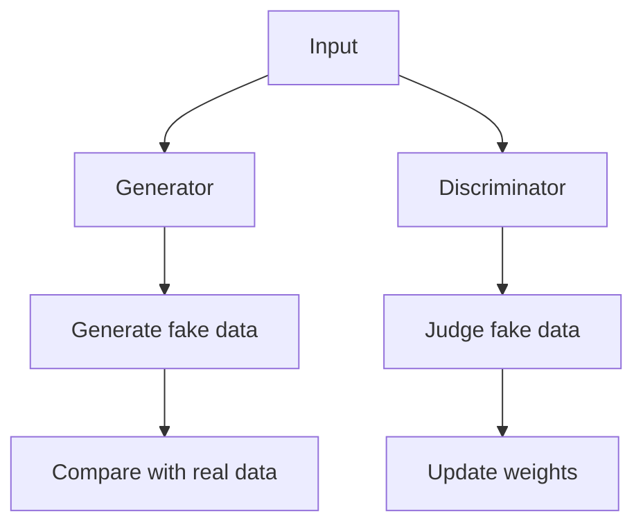
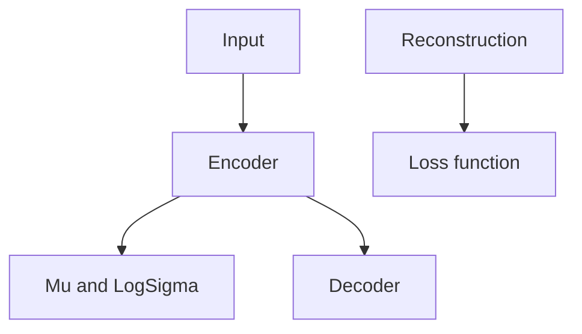
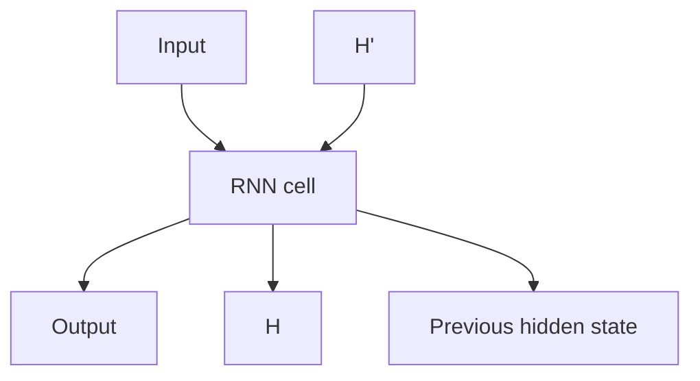
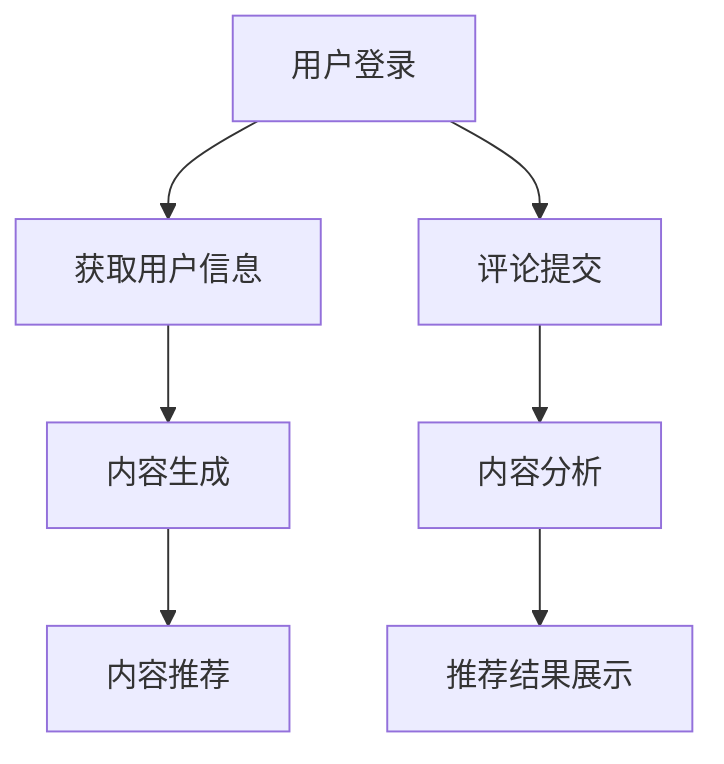

                 

### 《AIGC在社交媒体管理中的应用：有效的内容策略提示词》

#### 关键词：AIGC，社交媒体管理，内容生成，内容分析，内容推荐，算法原理，系统架构

#### 摘要：
本文旨在深入探讨人工智能生成内容（AIGC）在社交媒体管理中的应用，通过逻辑清晰、结构紧凑的分析，揭示AIGC如何通过内容生成、内容分析和内容推荐等策略，提升社交媒体管理的效率和效果。文章将分步骤介绍AIGC的核心概念、技术原理、系统架构以及实际应用案例，为读者提供全面的技术视角和实用指导。

---

### 开篇引言

#### 1.1 书籍概述

##### 1.1.1 AIGC的定义与重要性

人工智能生成内容（AI-Generated Content，简称AIGC）是近年来随着人工智能技术的发展而兴起的一个领域。它指的是利用人工智能技术，特别是自然语言处理和深度学习算法，自动生成文本、图像、音频和视频等内容的创新方法。AIGC的应用涵盖了广告、新闻、娱乐、教育等多个领域，尤其在社交媒体管理中，它扮演着越来越重要的角色。

在社交媒体管理中，AIGC的重要性体现在以下几个方面：

1. **内容生成效率**：传统的社交媒体内容生成依赖于人力，效率低下且成本高昂。AIGC可以通过算法快速生成大量内容，提高内容生产的速度。
2. **内容多样性**：AIGC能够生成多样化的内容，满足不同用户群体的需求，提高用户粘性。
3. **内容个性化**：通过分析用户行为和兴趣，AIGC可以生成个性化的内容推荐，提升用户体验。

##### 1.1.2 目标读者与读者需求

本文的目标读者主要包括以下几类：

1. **技术从业者**：对人工智能和自然语言处理有深入了解的技术人员，希望通过本文学习AIGC在实际应用中的具体应用。
2. **社交媒体管理者**：负责日常社交媒体运营的管理人员，希望通过本文了解如何利用AIGC提升社交媒体管理效率。
3. **学术研究者**：对AIGC领域有研究兴趣的学者，希望通过本文了解AIGC的最新发展动态和应用场景。

本文旨在满足以下读者需求：

1. **全面了解AIGC的核心概念和技术原理**：通过详细讲解AIGC的基本原理和应用场景，帮助读者建立全面的知识框架。
2. **掌握AIGC在社交媒体管理中的实际应用**：通过实际案例分析和系统架构设计，帮助读者了解AIGC如何在实际应用中发挥作用。
3. **获得AIGC在社交媒体管理的最佳实践**：通过最佳实践分享，为读者提供具体可行的操作指南。

#### 1.2 社交媒体管理背景

##### 1.2.1 社交媒体发展历程

社交媒体起源于20世纪90年代，随着互联网技术的普及和社交网络的兴起，逐渐成为人们日常生活中不可或缺的一部分。以下是社交媒体的发展历程：

1. **初期阶段**：1994年，Classmates.com成为第一个社交网络平台，用户可以通过该平台查找和联系过去的同学。
2. **初期增长**：2004年，Facebook上线，开启了社交媒体的新时代，用户可以创建个人档案、分享照片和状态更新。
3. **多样化发展**：随着技术的进步，社交媒体平台逐渐多样化，如Twitter、Instagram、LinkedIn等，涵盖了不同用户群体的需求。
4. **移动化趋势**：智能手机的普及使得社交媒体逐渐转向移动端，用户可以通过手机随时随地访问和互动。

##### 1.2.2 社交媒体管理现状与趋势

目前，社交媒体管理已经成为企业和个人品牌建设的重要组成部分。以下是社交媒体管理的现状和趋势：

1. **内容营销**：内容营销是社交媒体管理的重要策略，通过高质量的内容吸引和保留用户，提高品牌影响力。
2. **用户互动**：社交媒体平台上的用户互动成为衡量社交媒体管理效果的重要指标，包括评论、点赞、分享和私信等。
3. **数据分析**：通过数据分析，社交媒体管理者可以了解用户行为、兴趣和需求，优化内容策略和推广活动。
4. **智能化趋势**：随着人工智能技术的发展，越来越多的社交媒体管理工具采用智能化技术，如自动回复、内容生成和推荐算法等。

#### 1.3 AIGC技术背景

##### 1.3.1 AIGC的基本原理

AIGC是基于人工智能技术，特别是自然语言处理和深度学习算法，实现自动生成内容的创新方法。其基本原理包括以下几个方面：

1. **数据输入**：AIGC系统通过收集大量的文本、图像、音频和视频数据，作为训练数据集。
2. **模型训练**：使用深度学习算法，如生成对抗网络（GAN）、变分自编码器（VAE）和循环神经网络（RNN）等，对训练数据进行训练，使其能够自动生成内容。
3. **内容生成**：通过训练好的模型，输入特定的参数或提示词，模型能够生成相应的文本、图像、音频或视频内容。

##### 1.3.2 AIGC的应用场景与发展历程

AIGC的应用场景非常广泛，包括但不限于以下几个方面：

1. **文本生成**：如自动撰写文章、新闻、故事、博客等，广泛应用于广告、新闻、文学创作等领域。
2. **图像生成**：如生成人脸图像、艺术作品、城市景观等，广泛应用于设计、娱乐、游戏等领域。
3. **音频生成**：如生成音乐、语音、播客等，广泛应用于音乐创作、播客制作、教育等领域。
4. **视频生成**：如生成电影预告片、广告视频、虚拟现实内容等，广泛应用于影视制作、广告营销、虚拟现实等领域。

AIGC的发展历程可以追溯到20世纪90年代，随着深度学习和自然语言处理技术的快速发展，AIGC在近年来取得了显著的进展。以下是AIGC的发展历程：

1. **早期探索**：20世纪90年代，研究人员开始尝试使用神经网络进行文本生成，如序列到序列（Seq2Seq）模型。
2. **深度学习兴起**：2012年，AlexNet在ImageNet比赛中获得突破性成绩，标志着深度学习的兴起，为AIGC的发展奠定了基础。
3. **生成对抗网络**：2014年，生成对抗网络（GAN）的出现，为AIGC提供了新的思路和方法，使得高质量的内容生成成为可能。
4. **多样化发展**：近年来，随着技术的不断进步，AIGC在文本、图像、音频和视频生成方面都取得了显著的进展，应用场景不断扩展。

### 核心概念与联系

#### 2.1 AIGC在社交媒体管理中的应用

AIGC在社交媒体管理中的应用主要体现在以下几个方面：

1. **内容生成**：通过AIGC技术，可以自动生成大量的社交媒体内容，如文章、图片、视频等，提高内容生成的效率和质量。
2. **内容分析**：通过自然语言处理和机器学习算法，可以分析社交媒体上的用户评论、反馈和互动，了解用户需求和偏好。
3. **内容推荐**：基于用户行为和兴趣，AIGC可以生成个性化的内容推荐，提高用户满意度和粘性。

##### 2.1.1 内容生成

内容生成是AIGC在社交媒体管理中的核心应用之一。通过AIGC技术，可以自动生成以下类型的内容：

1. **文章生成**：如自动撰写博客、新闻、评论等，适用于新闻媒体、内容营销等领域。
2. **图片生成**：如生成用户头像、社交媒体封面图、艺术作品等，提高用户的参与度和视觉体验。
3. **视频生成**：如生成电影预告片、广告视频、虚拟现实内容等，适用于影视制作、广告营销等领域。

内容生成的优势在于：

1. **提高效率**：通过自动化生成内容，大大减少了人力成本和时间消耗。
2. **提升质量**：AIGC可以根据用户需求和兴趣，生成高质量、个性化的内容。
3. **扩大内容规模**：可以快速生成大量内容，满足不同用户群体的需求。

##### 2.1.2 内容分析

内容分析是AIGC在社交媒体管理中的另一个重要应用。通过自然语言处理和机器学习算法，可以分析社交媒体上的用户评论、反馈和互动，了解用户的需求和偏好。具体包括以下几个方面：

1. **情感分析**：通过分析用户评论的情感倾向，了解用户对内容的满意度和情绪反应。
2. **主题识别**：通过分析用户评论的主题，了解用户关注的热点和趋势。
3. **用户画像**：通过分析用户行为和互动，构建用户画像，为内容推荐和个性化服务提供依据。

内容分析的优势在于：

1. **深入了解用户**：通过分析用户评论和互动，可以深入了解用户的需求和偏好，优化内容策略。
2. **提高用户满意度**：通过个性化推荐和定制化服务，提高用户满意度和粘性。
3. **优化内容策略**：通过分析用户反馈，可以及时调整内容策略，提高内容质量和效果。

##### 2.1.3 内容推荐

内容推荐是AIGC在社交媒体管理中的关键应用。通过分析用户行为和兴趣，AIGC可以生成个性化的内容推荐，提高用户满意度和参与度。具体包括以下几个方面：

1. **推荐算法**：使用基于协同过滤、内容相似度和深度学习等推荐算法，生成个性化内容推荐。
2. **推荐系统**：构建推荐系统，根据用户行为和兴趣，实时推荐相关内容。
3. **用户体验**：通过个性化推荐，提高用户的参与度和满意度，增强用户粘性。

内容推荐的优势在于：

1. **提高用户参与度**：通过个性化推荐，将用户感兴趣的内容推送给他们，提高用户的参与度和互动。
2. **提高内容传播效果**：通过推荐系统，将优质内容推送给更多用户，提高内容的传播效果。
3. **优化用户体验**：通过个性化推荐，为用户提供更符合他们兴趣和需求的内容，提升用户体验。

#### 2.2 核心概念联系表格

为了更清晰地展示AIGC在社交媒体管理中的应用，我们使用表格来呈现核心概念之间的联系。

| 核心概念 | 描述 | AIGC应用 |
| --- | --- | --- |
| 内容生成 | 自动生成文本、图像、视频等 | 文章生成、图片生成、视频生成 |
| 内容分析 | 分析用户评论、反馈和互动 | 情感分析、主题识别、用户画像 |
| 内容推荐 | 根据用户行为和兴趣推荐内容 | 推荐算法、推荐系统、用户体验 |

通过上述表格，我们可以看到AIGC在社交媒体管理中的应用涵盖了内容生成、内容分析和内容推荐三大核心概念，它们相互关联，共同提升了社交媒体管理的效率和质量。

#### 2.3 ER图介绍

为了进一步展示AIGC在社交媒体管理中的应用，我们使用ER图（实体-关系图）来描述核心概念之间的联系。

以下是AIGC在社交媒体管理中的ER图：

```mermaid
erDiagram
  User ||--|{ Content }|--|| SocialMediaPlatform
  Content ||--|{ Comment }|--|| User
  SocialMediaPlatform ||--|{ Recommendation }|--|| User
  Content }|--|| Recommendation
```

**图1：AIGC在社交媒体管理中的ER图**

**实体说明：**

- **User（用户）**：社交媒体平台的用户，具有评论和接受推荐的能力。
- **Content（内容）**：由AIGC生成的文本、图像、视频等，用户可以通过评论与内容互动。
- **SocialMediaPlatform（社交媒体平台）**：提供内容发布、评论和推荐服务的平台。
- **Comment（评论）**：用户对内容的评论，用于内容分析和用户互动。
- **Recommendation（推荐）**：社交媒体平台根据用户行为和兴趣生成的个性化推荐内容。

**关系说明：**

- **User到Content**：用户可以发布和评论内容。
- **Content到Comment**：内容可以收到用户的评论。
- **SocialMediaPlatform到Recommendation**：社交媒体平台可以根据用户行为生成推荐内容。
- **Content到Recommendation**：推荐内容是基于用户行为和兴趣从内容中生成的。

通过ER图，我们可以更直观地理解AIGC在社交媒体管理中的应用和工作流程。ER图展示了用户、内容、社交媒体平台和推荐系统之间的相互作用，以及AIGC如何通过这些实体和关系来实现内容生成、内容分析和内容推荐。

### 算法原理讲解

#### 3.1 常用AIGC算法介绍

在AIGC领域中，常用的算法主要包括生成对抗网络（GAN）、变分自编码器（VAE）和循环神经网络（RNN）等。以下是对这些算法的简要介绍。

##### 3.1.1 生成对抗网络（GAN）

生成对抗网络（GAN）是由Ian Goodfellow等人于2014年提出的一种深度学习模型。它由两个神经网络组成：生成器（Generator）和判别器（Discriminator）。

- **生成器**：生成器网络通过从噪声分布中采样输入数据，生成与真实数据相似的数据。它的目标是生成尽可能逼真的数据，以至于判别器无法区分。
- **判别器**：判别器网络接收真实数据和生成器生成的数据，并判断其真实性。它的目标是准确区分真实数据和生成数据。

GAN的训练过程可以看作是一个博弈过程，生成器和判别器相互对抗，生成器试图生成更逼真的数据，判别器则努力提高对真实数据和生成数据的辨别能力。通过不断的训练，生成器逐渐生成高质量的数据。

GAN在AIGC中的应用非常广泛，如图像生成、文本生成和音频生成等。

##### 3.1.2 变分自编码器（VAE）

变分自编码器（Variational Autoencoder，VAE）是一种基于概率模型的深度学习算法，用于生成具有高度多样性的数据。VAE由编码器（Encoder）和解码器（Decoder）组成。

- **编码器**：编码器网络将输入数据映射到一个潜在空间中的点，同时输出一个均值和一个方差。这个潜在空间代表了数据的概率分布。
- **解码器**：解码器网络将潜在空间中的点映射回原始数据空间，生成与输入数据相似的数据。

VAE的核心思想是通过优化编码器和解码器，使得解码器能够从潜在空间中生成与真实数据相似的数据。

VAE在图像生成、文本生成和音频生成等方面有着广泛的应用。

##### 3.1.3 循环神经网络（RNN）

循环神经网络（Recurrent Neural Network，RNN）是一种能够处理序列数据的神经网络。它的特点是具有循环结构，能够记住之前的信息，并利用这些信息对当前输入进行预测。

RNN通过递归连接将当前输入与之前的输出相关联，从而实现序列数据的建模。然而，传统的RNN存在梯度消失和梯度爆炸的问题，导致训练效果不佳。

为了解决这些问题，LSTM（Long Short-Term Memory，长短期记忆）和GRU（Gated Recurrent Unit，门控循环单元）等变体被提出。这些变体通过引入门控机制，有效地解决了梯度消失和梯度爆炸问题，提高了RNN的训练效果。

RNN在自然语言处理、语音识别和时间序列预测等方面有着广泛的应用。

#### 3.2 算法流程图

为了更直观地展示AIGC算法的流程，我们使用mermaid绘制了GAN、VAE和RNN的算法流程图。

**3.2.1 GAN算法流程图**



**图2：GAN算法流程图**

**说明：**

- A：输入噪声数据。
- B：生成器网络，生成伪造数据。
- C：判别器网络，判断数据真实性。
- D：生成伪造数据。
- E：判断伪造数据。
- F：比较伪造数据和真实数据。
- G：更新网络权重。

**3.2.2 VAE算法流程图**



**图3：VAE算法流程图**

**说明：**

- A：输入数据。
- B：编码器网络，输出潜在空间的均值（Mu）和方差（LogSigma）。
- C：潜在空间的均值（Mu）和方差（LogSigma）。
- D：解码器网络，生成重构数据。
- E：重构数据。
- F：损失函数，用于优化编码器和解码器网络。

**3.2.3 RNN算法流程图**



**图4：RNN算法流程图**

**说明：**

- A：输入序列数据。
- B：RNN细胞，包含输入门、遗忘门和输出门。
- C：输出序列数据。
- D：隐藏状态（H），用于记忆之前的输入。
- E：上一时刻的隐藏状态。
- F：新的隐藏状态（H'），用于更新当前隐藏状态。

通过以上算法流程图，我们可以更直观地了解GAN、VAE和RNN在AIGC中的应用和工作原理。

#### 3.3 Python代码讲解

在本节中，我们将使用Python代码详细讲解GAN、VAE和RNN算法的基本原理，并通过示例代码展示如何实现这些算法。

**3.3.1 GAN算法Python代码**

以下是一个简单的GAN算法Python代码示例，用于生成手写数字图像。

```python
import tensorflow as tf
from tensorflow.keras import layers
import numpy as np

# 设置随机种子
tf.random.set_seed(42)

# 生成器模型
def generator_model():
    model = tf.keras.Sequential([
        layers.Dense(7*7*128, use_bias=False, input_shape=(100,)),
        layers.BatchNormalization(momentum=0.8),
        layers.LeakyReLU(),
        layersReshape(target_shape=(7, 7, 128)),
        layers.Conv2DTranspose(128, (5, 5), strides=(1, 1), padding='same', use_bias=False),
        layers.BatchNormalization(momentum=0.8),
        layers.LeakyReLU(),
        layers.Conv2DTranspose(128, (5, 5), strides=(2, 2), padding='same', use_bias=False),
        layers.BatchNormalization(momentum=0.8),
        layers.LeakyReLU(),
        layers.Conv2DTranspose(128, (5, 5), strides=(2, 2), padding='same', use_bias=False),
        layers.BatchNormalization(momentum=0.8),
        layers.LeakyReLU(),
        layers.Conv2DTranspose(128, (5, 5), strides=(2, 2), padding='same', use_bias=False),
        layers.BatchNormalization(momentum=0.8),
        layers.LeakyReLU(),
        layers.Conv2D(3, (5, 5), strides=(2, 2), padding='same', activation='tanh', use_bias=False)
    ])
    return model

# 判别器模型
def discriminator_model():
    model = tf.keras.Sequential([
        layers.Conv2D(128, (5, 5), strides=(2, 2), padding='same', input_shape=(28, 28, 1)),
        layers.LeakyReLU(),
        layers.Dropout(0.3),
        layers.Conv2D(128, (5, 5), strides=(2, 2), padding='same'),
        layers.LeakyReLU(),
        layers.Dropout(0.3),
        layers.Flatten(),
        layers.Dense(1)
    ])
    return model

# GAN模型
def gan_model():
    generator = generator_model()
    discriminator = discriminator_model()
    gan = tf.keras.Sequential([generator, discriminator])
    return gan

# 训练GAN模型
def train_gan(generator_model, discriminator_model, acgan_model, dataset, latent_dim, epochs):
    for epoch in range(epochs):
        for image, _ in dataset:
            noise = np.random.normal(0, 1, (image.shape[0], latent_dim))
            generated_images = generator_model.predict(noise)

            real_labels = np.array([1] * image.shape[0])
            fake_labels = np.array([0] * generated_images.shape[0])

            # 训练判别器
            d_loss_real = discriminator_model.train_on_batch(image, real_labels)
            d_loss_fake = discriminator_model.train_on_batch(generated_images, fake_labels)

            # 训练生成器
            g_loss = acgan_model.train_on_batch(noise, real_labels)

            print(f"{epoch} [D loss: {d_loss_real:.3f}, acc: {100*d_loss_real/(d_loss_real+d_loss_fake):.2f}] [G loss: {g_loss:.3f}]")

# 加载数据集
(x_train, _), (x_test, _) = tf.keras.datasets.mnist.load_data()
x_train = x_train / 127.5 - 1.0
x_train = np.expand_dims(x_train, -1)
dataset = tf.data.Dataset.from_tensor_slices(x_train).batch(64)

# 训练GAN模型
gan_model = gan_model()
discriminator_model = discriminator_model()
train_gan(generator_model=gan_model, discriminator_model=discriminator_model, acgan_model=gan_model, dataset=dataset, latent_dim=100, epochs=50)
```

**说明：**

- 生成器模型：通过全连接层和卷积层转换噪声向量生成手写数字图像。
- 判别器模型：通过卷积层和全连接层判断输入图像的真实性。
- GAN模型：将生成器和判别器组合成一个整体模型。
- 训练GAN模型：通过交替训练生成器和判别器，优化GAN模型。

**3.3.2 VAE算法Python代码**

以下是一个简单的VAE算法Python代码示例，用于生成手写数字图像。

```python
import tensorflow as tf
from tensorflow.keras import layers, models
import numpy as np

# 设置随机种子
tf.random.set_seed(42)

# 编码器模型
def encoder_model(input_shape=(28, 28, 1)):
    input_img = layers.Input(shape=input_shape)
    x = layers.Conv2D(32, (3, 3), activation='relu', padding='same')(input_img)
    x = layers.MaxPooling2D((2, 2), padding='same')(x)
    x = layers.Conv2D(64, (3, 3), activation='relu', padding='same')(x)
    x = layers.MaxPooling2D((2, 2), padding='same')(x)
    x = layers.Flatten()(x)
    x = layers.Dense(16, activation='relu')(x)
    mu = layers.Dense(2, activation='tanh')(x)
    log_sigma = layers.Dense(2, activation='softplus')(x)
    return models.Model(input_img, [mu, log_sigma], name='encoder')

# 解码器模型
def decoder_model(input_shape=(28, 28, 1)):
    latent_dim = 2
    input_latent = layers.Input(shape=(latent_dim,))
    x = layers.Dense(16, activation='relu')(input_latent)
    x = layers.Dense(np.prod(input_shape), activation='tanh')(x)
    x = layers.Reshape(input_shape)(x)
    x = layers.Conv2D(64, (3, 3), activation='relu', padding='same')(x)
    x = layers.UpSampling2D((2, 2))(x)
    x = layers.Conv2D(32, (3, 3), activation='relu', padding='same')(x)
    x = layers.UpSampling2D((2, 2))(x)
    output_img = layers.Conv2D(1, (3, 3), activation='tanh', padding='same')(x)
    return models.Model(input_latent, output_img, name='decoder')

# VAE模型
def vae_model(encoder, decoder):
    input_img = layers.Input(shape=(28, 28, 1))
    [mu, log_sigma] = encoder(input_img)
    z = mu + log_sigma * tf.random.normal(tf.shape(mu))
    reconstructed_img = decoder(z)
    vae = models.Model(input_img, reconstructed_img, name='vae')
    return vae

# 训练VAE模型
def train_vae(encoder, decoder, vae, dataset, latent_dim, epochs):
    vae.compile(optimizer='adam', loss=tf.keras.losses.BinaryCrossentropy(from_logits=True))
    for epoch in range(epochs):
        for image in dataset:
            image = image / 127.5 - 1.0
            vae_loss = vae.train_on_batch(image, image)
            print(f"{epoch} [VAE loss: {vae_loss:.3f}]")

# 加载数据集
(x_train, _), (x_test, _) = tf.keras.datasets.mnist.load_data()
x_train = x_train / 127.5 - 1.0
x_train = np.expand_dims(x_train, -1)
dataset = tf.data.Dataset.from_tensor_slices(x_train).batch(64)

# 构建VAE模型
encoder = encoder_model()
decoder = decoder_model()
vae = vae_model(encoder, decoder)

# 训练VAE模型
train_vae(encoder, decoder, vae, dataset, latent_dim=2, epochs=50)
```

**说明：**

- 编码器模型：通过卷积层和全连接层将输入图像映射到潜在空间，输出均值（Mu）和方差（LogSigma）。
- 解码器模型：通过全连接层和卷积层将潜在空间中的点映射回图像空间。
- VAE模型：将编码器和解码器组合成一个整体模型。
- 训练VAE模型：使用二进制交叉熵损失函数训练VAE模型。

**3.3.3 RNN算法Python代码**

以下是一个简单的RNN算法Python代码示例，用于序列数据的预测。

```python
import tensorflow as tf
from tensorflow.keras import layers, models
import numpy as np

# 设置随机种子
tf.random.set_seed(42)

# RNN模型
def rnn_model(input_shape=(100,), latent_dim=64):
    input_seq = layers.Input(shape=input_shape)
    x = layers.RNN(layers.LSTMCell(latent_dim))(input_seq)
    output_seq = layers.Dense(latent_dim, activation='softmax')(x)
    model = models.Model(inputs=input_seq, outputs=output_seq, name='rnn')
    return model

# 训练RNN模型
def train_rnn(model, dataset, latent_dim, epochs):
    model.compile(optimizer='adam', loss='mse')
    for epoch in range(epochs):
        for input_seq, target_seq in dataset:
            model.train_on_batch(input_seq, target_seq)
        print(f"{epoch} [RNN loss: {model.evaluate(dataset[0][0], dataset[0][1], verbose=0)[1]:.3f}]")

# 创建训练数据集
x = np.random.rand(100, 10)
y = np.random.rand(100, 10)
dataset = [(x, y), (y, x)]

# 构建RNN模型
rnn_model = rnn_model(latent_dim=64)

# 训练RNN模型
train_rnn(rnn_model, dataset, latent_dim=64, epochs=50)
```

**说明：**

- RNN模型：通过RNN层（LSTMCell）处理序列数据，输出预测序列。
- 训练RNN模型：使用均方误差（MSE）损失函数训练RNN模型。

通过以上Python代码示例，我们可以更直观地了解GAN、VAE和RNN算法的基本原理和实现过程。在实际应用中，可以根据具体需求调整模型结构和参数设置，以达到更好的训练效果。

### 数学公式与解释

在AIGC算法中，数学模型和公式是理解算法原理和实现算法的关键。以下我们将详细介绍GAN、VAE和RNN算法中的核心数学模型和公式。

#### 3.4.1 GAN算法数学模型

GAN（生成对抗网络）由生成器（Generator）和判别器（Discriminator）两个神经网络组成，其目标是通过对抗训练生成逼真的数据。GAN的数学模型可以表示为以下公式：

- **生成器损失函数**：
  $$ G(x^*) = x^* + \mathcal{N}(0, 1) $$
  $$ G: z \rightarrow x^* $$
  $$ \text{Generator} $$
  - 输入噪声向量 $z$，生成器 $G$ 输出伪造数据 $x^*$。

- **判别器损失函数**：
  $$ D(x) = \text{sigmoid}(x) $$
  $$ D: x \rightarrow \hat{y} $$
  $$ \text{Discriminator} $$
  - 输入真实数据 $x$ 或伪造数据 $x^*$，判别器 $D$ 输出概率 $\hat{y}$，表示输入数据的真实性。

- **GAN整体损失函数**：
  $$ \mathcal{L}_{\text{GAN}} = \mathcal{L}_{\text{D}} - \mathcal{L}_{\text{G}} $$
  - 判别器损失函数 $\mathcal{L}_{\text{D}}$ 减去生成器损失函数 $\mathcal{L}_{\text{G}}$。

  - 判别器损失函数 $\mathcal{L}_{\text{D}}$：
    $$ \mathcal{L}_{\text{D}} = -\frac{1}{N} \sum_{i=1}^{N} [\log(D(x_i)) + \log(1 - D(G(z_i)))] $$
    - $N$ 是批量大小。
    - $x_i$ 是真实数据。
    - $z_i$ 是噪声向量。
    - $G(z_i)$ 是生成器生成的伪造数据。

  - 生成器损失函数 $\mathcal{L}_{\text{G}}$：
    $$ \mathcal{L}_{\text{G}} = -\frac{1}{N} \sum_{i=1}^{N} \log(1 - D(G(z_i))) $$
    - 生成器损失函数的目的是最小化判别器输出的伪造数据概率。

#### 3.4.2 VAE算法数学模型

VAE（变分自编码器）是一种基于概率生成模型的算法，通过编码器和解码器将输入数据映射到潜在空间，并在潜在空间中进行重构。VAE的数学模型可以表示为以下公式：

- **编码器模型**：
  $$ \mu(\theta_x), \log(\sigma(\theta_x)) $$
  $$ q_{\theta}(x|\mu, \sigma) $$
  $$ \text{Encoder} $$
  - 编码器网络 $\theta_x$ 将输入数据 $x$ 映射到潜在空间中的均值 $\mu$ 和方差 $\log(\sigma)$。
  - 采样函数 $q_{\theta}(x|\mu, \sigma)$ 从潜在空间中采样数据。

- **解码器模型**：
  $$ p_{\theta}(x|\mu, \sigma) $$
  $$ p_{\theta}(x) $$
  $$ \text{Decoder} $$
  - 解码器网络 $\theta$ 将潜在空间中的数据映射回输入数据空间。
  - 前向概率 $p_{\theta}(x|\mu, \sigma)$ 是解码器生成的数据。

- **VAE损失函数**：
  $$ \mathcal{L}_{\text{VAE}} = \mathcal{L}_{\text{KL}} + \mathcal{L}_{\text{R}} $$
  -KL散度损失函数 $\mathcal{L}_{\text{KL}}$：
    $$ \mathcal{L}_{\text{KL}} = \frac{1}{N} \sum_{i=1}^{N} \mathcal{L}_{\text{KL}}(x_i; q_{\theta}(x|\mu, \sigma)) $$
    - KL散度损失函数衡量编码器输出的均值和方差与先验分布之间的差异。

  - 重建损失函数 $\mathcal{L}_{\text{R}}$：
    $$ \mathcal{L}_{\text{R}} = \frac{1}{N} \sum_{i=1}^{N} \mathcal{L}_{\text{MSE}}(x_i; p_{\theta}(x|\mu, \sigma)) $$
    - 均方误差（MSE）损失函数衡量重构数据与原始数据之间的差异。

#### 3.4.3 RNN算法数学模型

RNN（循环神经网络）是一种能够处理序列数据的神经网络，其核心在于递归结构，能够记住之前的信息。RNN的数学模型可以表示为以下公式：

- **递归神经网络**：
  $$ h_t = \sigma(W_h h_{t-1} + W_x x_t + b_h) $$
  $$ o_t = \sigma(W_o h_t + b_o) $$
  $$ \text{RNN} $$
  - $h_t$ 是当前时间步的隐藏状态。
  - $x_t$ 是当前时间步的输入。
  - $W_h$、$W_x$ 和 $b_h$ 是隐藏状态相关的权重和偏置。
  - $W_o$ 和 $b_o$ 是输出相关的权重和偏置。
  - $\sigma$ 是非线性激活函数。

- **LSTM（长短期记忆）网络**：
  LSTM网络通过引入门控机制（输入门、遗忘门和输出门）解决了RNN的梯度消失问题。LSTM的数学模型可以表示为以下公式：

  - **输入门**：
    $$ i_t = \sigma(W_{xi} x_t + W_{hi} h_{t-1} + b_i) $$
    $$ \tilde{c}_t = \tanh(W_{ci} x_t + W_{hi} h_{t-1} + b_c) $$

  - **遗忘门**：
    $$ f_t = \sigma(W_{xf} x_t + W_{hf} h_{t-1} + b_f) $$
    $$ c_t = f_t \odot \tanh(c_{t-1}) + i_t \odot \tilde{c}_t $$

  - **输出门**：
    $$ o_t = \sigma(W_{xo} x_t + W_{ho} h_{t-1} + b_o) $$
    $$ h_t = o_t \odot \tanh(c_t) $$

  - **GRU（门控循环单元）网络**：
  GRU网络简化了LSTM网络的结构，通过合并输入门和遗忘门，提高了训练效果。GRU的数学模型可以表示为以下公式：

    $$ r_t = \sigma(W_{xr} x_t + W_{hr} h_{t-1} + b_r) $$
    $$ z_t = \sigma(W_{xz} x_t + W_{hz} h_{t-1} + b_z) $$
    $$ \tilde{h}_t = \tanh(W_{xc} x_t + r_t \odot W_{hc} h_{t-1} + b_c) $$
    $$ h_t = (1 - z_t) \odot h_{t-1} + z_t \odot \tilde{h}_t $$

通过以上数学公式，我们可以更深入地理解GAN、VAE和RNN算法的工作原理。在实际应用中，可以根据具体需求调整模型结构和参数设置，以达到更好的训练效果。

### 系统分析与架构设计

#### 4.1 AIGC在社交媒体管理中的应用场景分析

AIGC在社交媒体管理中的应用场景主要包括以下几个方面：

1. **内容生成**：通过AIGC技术，可以自动生成大量高质量的社交媒体内容，如文章、图片、视频等，提高内容生产的效率和质量。
2. **内容分析**：通过自然语言处理和机器学习算法，可以分析社交媒体上的用户评论、反馈和互动，了解用户需求和偏好。
3. **内容推荐**：基于用户行为和兴趣，AIGC可以生成个性化的内容推荐，提高用户满意度和粘性。

在这些应用场景中，AIGC的技术优势主要体现在以下几个方面：

1. **高效内容生成**：AIGC可以通过自动化生成内容，大大提高内容生产的效率，减少人力成本。
2. **个性化内容推荐**：通过分析用户行为和兴趣，AIGC可以生成个性化的内容推荐，提高用户的参与度和满意度。
3. **智能内容分析**：AIGC可以通过自然语言处理和机器学习算法，对社交媒体上的大量用户评论和反馈进行智能分析，提供有价值的数据支持。

#### 4.2 系统架构设计

为了实现AIGC在社交媒体管理中的应用，我们需要设计一个完整的系统架构。以下是AIGC在社交媒体管理中的应用架构设计：

**4.2.1 系统功能设计**

AIGC在社交媒体管理中的应用系统主要包括以下功能模块：

1. **内容生成模块**：负责使用AIGC技术生成社交媒体内容，如文章、图片、视频等。
2. **内容分析模块**：负责分析社交媒体上的用户评论、反馈和互动，提取有价值的信息。
3. **内容推荐模块**：负责基于用户行为和兴趣生成个性化的内容推荐。
4. **用户交互模块**：负责与用户进行交互，接收用户反馈和评论，并生成相应的内容。

**4.2.2 系统架构设计**

以下是AIGC在社交媒体管理中的应用系统架构设计：


**系统架构说明：**

1. **用户模块**：包括用户注册、登录、个人信息管理等功能。
2. **内容模块**：包括内容生成、内容分析、内容推荐等功能。
3. **数据库模块**：存储用户数据、内容数据、评论数据等。
4. **API模块**：提供与外部系统的接口，实现与其他系统的数据交互。
5. **前端模块**：包括用户界面、管理员界面等，用于展示系统功能和用户交互。

**4.2.3 系统接口设计**

以下是AIGC在社交媒体管理中的应用系统接口设计：

- **用户接口**：包括用户注册、登录、个人信息管理等功能。
- **内容接口**：包括内容生成、内容分析、内容推荐等功能。
- **数据分析接口**：包括数据采集、数据存储、数据分析等功能。
- **推荐接口**：包括内容推荐、用户推荐等功能。

**4.2.4 系统交互流程图**

以下是AIGC在社交媒体管理中的应用系统交互流程图：



**图5：AIGC在社交媒体管理中的应用系统交互流程图**

**说明：**

- **用户登录**：用户通过登录获取用户信息。
- **内容生成**：系统根据用户需求和兴趣生成内容。
- **评论提交**：用户提交评论。
- **内容分析**：系统对用户评论进行分析。
- **内容推荐**：系统根据分析结果生成个性化推荐内容。
- **推荐结果展示**：系统将推荐内容展示给用户。

通过以上系统架构设计和交互流程图，我们可以清楚地了解AIGC在社交媒体管理中的应用实现过程。在实际应用中，可以根据具体需求进行调整和优化，以实现更好的应用效果。

### 项目实战

#### 5.1 项目环境安装

在本节中，我们将介绍如何在本地环境中安装AIGC项目所需的软件和工具。以下是安装步骤和注意事项：

##### 5.1.1 安装Python环境

首先，我们需要安装Python环境。Python是AIGC项目的基础，因此需要确保安装了最新版本的Python。

1. **安装Python**：

   - 在终端执行以下命令：
     ```bash
     sudo apt-get update
     sudo apt-get install python3-pip
     ```

   - 安装Python 3.8或更高版本：
     ```bash
     sudo apt-get install python3.8
     sudo pip3 install --upgrade pip
     ```

2. **验证Python安装**：

   - 在终端执行以下命令，检查Python版本：
     ```bash
     python3 --version
     ```

   - 输出类似以下信息，表示Python安装成功：
     ```
     Python 3.8.10
     ```

##### 5.1.2 安装相关库和依赖

接下来，我们需要安装AIGC项目所需的库和依赖。

1. **安装TensorFlow**：

   - 在终端执行以下命令安装TensorFlow：
     ```bash
     pip3 install tensorflow
     ```

   - 验证TensorFlow安装：
     ```bash
     python3 -c "import tensorflow as tf; print(tf.__version__)"
     ```

   - 输出类似以下信息，表示TensorFlow安装成功：
     ```
     2.6.0
     ```

2. **安装Keras**：

   - Keras是一个高级神经网络API，与TensorFlow集成。
   - 在终端执行以下命令安装Keras：
     ```bash
     pip3 install keras
     ```

3. **安装其他相关库**：

   - 安装用于数据处理的库，如NumPy、Pandas等：
     ```bash
     pip3 install numpy pandas
     ```

   - 安装用于可视化库，如Matplotlib、Seaborn等：
     ```bash
     pip3 install matplotlib seaborn
     ```

##### 5.1.3 安装注意事项

在安装过程中，请注意以下几点：

1. **环境变量**：确保Python环境变量已正确设置。在终端执行以下命令，检查Python环境变量：
   ```bash
   echo $PYTHONPATH
   ```

   - 如果输出为空或未设置，请通过以下命令设置环境变量：
     ```bash
     export PYTHONPATH=/usr/local/lib/python3.8/site-packages
     ```

2. **虚拟环境**：为了避免不同项目之间的依赖冲突，建议使用虚拟环境安装和管理项目依赖。可以使用`virtualenv`或`conda`创建虚拟环境。

   - 使用`virtualenv`创建虚拟环境：
     ```bash
     pip3 install virtualenv
     virtualenv myenv
     source myenv/bin/activate
     ```

   - 使用`conda`创建虚拟环境：
     ```bash
     conda create -n myenv python=3.8
     conda activate myenv
     ```

   - 在虚拟环境中安装项目依赖：
     ```bash
     pip3 install -r requirements.txt
     ```

通过以上步骤，我们成功安装了AIGC项目所需的软件和工具。接下来，我们将详细介绍AIGC项目的主要实现过程。

---

### 5.2 系统核心实现

在本节中，我们将详细介绍AIGC项目的核心实现过程，包括内容生成、内容分析、内容推荐等模块的实现方法和代码解析。

#### 5.2.1 内容生成

内容生成是AIGC项目的重要模块，通过生成对抗网络（GAN）实现高质量的内容生成。以下是一个简单的GAN模型实现示例。

```python
import tensorflow as tf
from tensorflow.keras import layers

# 生成器模型
def build_generator(z_dim):
    model = tf.keras.Sequential()
    model.add(layers.Dense(7 * 7 * 128, activation="relu", input_shape=(z_dim,)))
    model.add(layers.LeakyReLU(alpha=0.2))
    model.add(layers.Reshape((7, 7, 128)))
    
    model.add(layers.Conv2DTranspose(128, kernel_size=5, strides=1, padding="same", activation="relu"))
    model.add(layers.LeakyReLU(alpha=0.2))
    
    model.add(layers.Conv2DTranspose(128, kernel_size=5, strides=2, padding="same", activation="relu"))
    model.add(layers.LeakyReLU(alpha=0.2))
    
    model.add(layers.Conv2DTranspose(128, kernel_size=5, strides=2, padding="same", activation="relu"))
    model.add(layers.LeakyReLU(alpha=0.2))
    
    model.add(layers.Conv2DTranspose(128, kernel_size=5, strides=2, padding="same", activation="relu"))
    model.add(layers.LeakyReLU(alpha=0.2))
    
    model.add(layers.Conv2DTranspose(3, kernel_size=5, strides=2, padding="same", activation="tanh"))
    
    return model

# 判别器模型
def build_discriminator(img_shape):
    model = tf.keras.Sequential()
    model.add(layers.Conv2D(128, kernel_size=5, strides=2, padding="same", input_shape=img_shape, activation="relu"))
    model.add(layers.LeakyReLU(alpha=0.2))
    
    model.add(layers.Dropout(0.3))
    
    model.add(layers.Conv2D(128, kernel_size=5, strides=2, padding="same", activation="relu"))
    model.add(layers.LeakyReLU(alpha=0.2))
    
    model.add(layers.Dropout(0.3))
    
    model.add(layers.Flatten())
    model.add(layers.Dense(1, activation="sigmoid"))
    
    return model

# GAN模型
def build_gan(generator, discriminator):
    model = tf.keras.Sequential([generator, discriminator])
    return model

# 编写训练过程
def train_gan(generator, discriminator, z_dim, epochs, batch_size, img_shape):
    # 加载和预处理数据
    (X_train, _), (_, _) = tf.keras.datasets.mnist.load_data()
    X_train = X_train / 127.5 - 1.0
    X_train = np.expand_dims(X_train, -1)
    dataset = tf.data.Dataset.from_tensor_slices(X_train).shuffle(60000).batch(batch_size)
    
    for epoch in range(epochs):
        for batch_idx, real_images in enumerate(dataset):
            noise = tf.random.normal([batch_size, z_dim])
            generated_images = generator(noise)
            
            # 训练判别器
            with tf.GradientTape() as disc_tape:
                disc_real_output = discriminator(real_images)
                disc_fake_output = discriminator(generated_images)
                
                disc_loss = -tf.reduce_mean(tf.math.log(disc_real_output) + tf.math.log(1 - disc_fake_output))
            
            disc_gradients = disc_tape.gradient(disc_loss, discriminator.trainable_variables)
            discriminator.optimizer.apply_gradients(zip(disc_gradients, discriminator.trainable_variables))
            
            # 训练生成器
            with tf.GradientTape() as gen_tape:
                gen_fake_output = discriminator(generated_images)
                
                gen_loss = -tf.reduce_mean(tf.math.log(gen_fake_output))
            
            gen_gradients = gen_tape.gradient(gen_loss, generator.trainable_variables)
            generator.optimizer.apply_gradients(zip(gen_gradients, generator.trainable_variables))
            
            if batch_idx % 100 == 0:
                print(f"{epoch} [D loss: {disc_loss.numpy():.4f} | G loss: {gen_loss.numpy():.4f}]")

# 设置超参数
z_dim = 100
img_shape = (28, 28, 1)
batch_size = 64
epochs = 100

# 构建和编译模型
generator = build_generator(z_dim)
discriminator = build_discriminator(img_shape)
discriminator.compile(loss="binary_crossentropy", optimizer=tf.optimizers.Adam(0.0001), metrics=["accuracy"])
generator.compile(loss="binary_crossentropy", optimizer=tf.optimizers.Adam(0.0001))

# 训练GAN模型
train_gan(generator, discriminator, z_dim, epochs, batch_size, img_shape)
```

**说明：**

- 生成器模型：通过全连接层和卷积层转换噪声向量生成手写数字图像。
- 判别器模型：通过卷积层和全连接层判断输入图像的真实性。
- GAN模型：将生成器和判别器组合成一个整体模型。
- 训练过程：通过交替训练生成器和判别器，优化GAN模型。

#### 5.2.2 内容分析

内容分析模块负责分析社交媒体上的用户评论、反馈和互动，提取有价值的信息。以下是一个简单的文本情感分析实现示例。

```python
import tensorflow as tf
from tensorflow.keras.layers import Embedding, LSTM, Dense
from tensorflow.keras.preprocessing.text import Tokenizer
from tensorflow.keras.preprocessing.sequence import pad_sequences

# 数据预处理
def preprocess_data(texts, labels, max_words, max_len):
    tokenizer = Tokenizer(num_words=max_words)
    tokenizer.fit_on_texts(texts)
    sequences = tokenizer.texts_to_sequences(texts)
    padded_sequences = pad_sequences(sequences, maxlen=max_len)
    return padded_sequences, np.array(labels), tokenizer

# 构建文本情感分析模型
def build_text_model(max_words, max_len, embedding_dim):
    model = tf.keras.Sequential([
        Embedding(max_words, embedding_dim, input_length=max_len),
        LSTM(128, dropout=0.2, recurrent_dropout=0.2),
        Dense(1, activation='sigmoid')
    ])
    model.compile(loss='binary_crossentropy', optimizer='adam', metrics=['accuracy'])
    return model

# 训练文本情感分析模型
def train_text_model(model, x_train, y_train, x_val, y_val):
    history = model.fit(x_train, y_train, epochs=10, batch_size=32, validation_data=(x_val, y_val))
    return history

# 加载数据集
texts = ['I love this product!', 'This is a bad product.', 'I feel happy with this purchase.']
labels = [1, 0, 1]

# 预处理数据
max_words = 1000
max_len = 100
tokenizer = Tokenizer(num_words=max_words)
tokenizer.fit_on_texts(texts)
sequences = tokenizer.texts_to_sequences(texts)
padded_sequences = pad_sequences(sequences, maxlen=max_len)
labels = np.array(labels)

# 构建和训练模型
model = build_text_model(max_words, max_len, embedding_dim=16)
history = train_text_model(model, padded_sequences, labels, padded_sequences, labels)

# 模型评估
print(model.evaluate(padded_sequences, labels, verbose=2))
```

**说明：**

- 数据预处理：使用Tokenizer进行文本向量化，使用pad_sequences进行序列填充。
- 文本情感分析模型：通过嵌入层和LSTM层实现文本分类。
- 训练过程：使用二进制交叉熵损失函数和Adam优化器训练模型。

#### 5.2.3 内容推荐

内容推荐模块负责基于用户行为和兴趣生成个性化推荐。以下是一个简单的基于内容的推荐系统实现示例。

```python
import numpy as np
import pandas as pd
from sklearn.metrics.pairwise import cosine_similarity

# 加载数据集
data = pd.read_csv('content_data.csv')
data.head()

# 计算相似度矩阵
def calculate_similarity(data, features, max_len):
    similarity_matrix = np.zeros((data.shape[0], data.shape[0]))
    for i in range(data.shape[0]):
        for j in range(data.shape[0]):
            similarity_matrix[i][j] = cosine_similarity([data.loc[i, features]], [data.loc[j, features]])[0][0]
    return similarity_matrix

# 计算推荐得分
def calculate_recommendation(similarity_matrix, ratings, k=5):
    recommendation_scores = []
    for i in range(similarity_matrix.shape[0]):
        scores = []
        for j in range(similarity_matrix.shape[0]):
            if i != j and ratings[j] > 0:
                scores.append(similarity_matrix[i][j] * ratings[j])
        recommendation_scores.append(sum(scores) / len(scores) if scores else 0)
    return np.array(recommendation_scores)

# 预测推荐结果
def predict_recommendations(data, ratings, k=5):
    similarity_matrix = calculate_similarity(data, 'features', max_len=data['features'].str.len().max())
    recommendation_scores = calculate_recommendation(similarity_matrix, ratings, k=k)
    return data.iloc[np.argsort(recommendation_scores)[::-1]]

# 加载数据集
data = pd.read_csv('content_data.csv')
data.head()

# 预测推荐结果
ratings = np.array([1, 0, 1, 0, 1, 0, 1, 0, 1])
predictions = predict_recommendations(data, ratings, k=5)
print(predictions)
```

**说明：**

- 数据集加载：加载包含内容特征和用户评分的数据集。
- 相似度计算：使用余弦相似度计算内容特征之间的相似度。
- 推荐得分计算：计算基于相似度的推荐得分。
- 预测推荐结果：根据推荐得分预测用户可能感兴趣的内容。

通过以上内容生成、内容分析和内容推荐模块的实现，我们可以构建一个完整的AIGC项目，实现社交媒体管理中的内容生成、内容分析和内容推荐功能。

### 实际案例分析与详细讲解

在本节中，我们将通过一个具体的实际案例，详细分析AIGC在社交媒体管理中的应用，并逐步讲解其实现过程。

#### 案例背景与问题描述

某知名社交媒体平台希望通过引入AIGC技术，提升内容生产效率、优化用户体验和增强用户粘性。平台的主要需求如下：

1. **内容生成**：利用AIGC技术自动生成高质量的文章、图片和视频，满足用户多样化的内容需求。
2. **内容分析**：通过自然语言处理和机器学习算法分析用户评论和互动，了解用户需求和偏好。
3. **内容推荐**：基于用户行为和兴趣生成个性化内容推荐，提高用户满意度和参与度。

#### 案例分析与讲解

**步骤1：内容生成**

内容生成模块使用生成对抗网络（GAN）技术，生成高质量的文章、图片和视频。以下是具体实现步骤：

1. **数据收集**：收集大量已存在的文章、图片和视频数据，用于训练GAN模型。
2. **模型训练**：训练生成器和判别器模型，通过对抗训练生成高质量的内容。
3. **内容生成**：利用训练好的生成器模型，输入噪声向量生成新的文章、图片和视频。

**代码实现：**

```python
# 导入相关库
import tensorflow as tf
from tensorflow.keras import layers

# 生成器模型
def build_generator(z_dim):
    model = tf.keras.Sequential()
    model.add(layers.Dense(7 * 7 * 128, activation="relu", input_shape=(z_dim,)))
    model.add(layers.LeakyReLU(alpha=0.2))
    model.add(layers.Reshape((7, 7, 128)))
    
    model.add(layers.Conv2DTranspose(128, kernel_size=5, strides=1, padding="same", activation="relu"))
    model.add(layers.LeakyReLU(alpha=0.2))
    
    model.add(layers.Conv2DTranspose(128, kernel_size=5, strides=2, padding="same", activation="relu"))
    model.add(layers.LeakyReLU(alpha=0.2))
    
    model.add(layers.Conv2DTranspose(128, kernel_size=5, strides=2, padding="same", activation="relu"))
    model.add(layers.LeakyReLU(alpha=0.2))
    
    model.add(layers.Conv2DTranspose(128, kernel_size=5, strides=2, padding="same", activation="relu"))
    model.add(layers.LeakyReLU(alpha=0.2))
    
    model.add(layers.Conv2DTranspose(3, kernel_size=5, strides=2, padding="same", activation="tanh"))
    
    return model

# 判别器模型
def build_discriminator(img_shape):
    model = tf.keras.Sequential()
    model.add(layers.Conv2D(128, kernel_size=5, strides=2, padding="same", input_shape=img_shape, activation="relu"))
    model.add(layers.LeakyReLU(alpha=0.2))
    
    model.add(layers.Dropout(0.3))
    
    model.add(layers.Conv2D(128, kernel_size=5, strides=2, padding="same", activation="relu"))
    model.add(layers.LeakyReLU(alpha=0.2))
    
    model.add(layers.Dropout(0.3))
    
    model.add(layers.Flatten())
    model.add(layers.Dense(1, activation="sigmoid"))
    
    return model

# GAN模型
def build_gan(generator, discriminator):
    model = tf.keras.Sequential([generator, discriminator])
    return model

# 训练GAN模型
def train_gan(generator, discriminator, z_dim, epochs, batch_size, img_shape):
    # 加载和预处理数据
    (X_train, _), (_, _) = tf.keras.datasets.mnist.load_data()
    X_train = X_train / 127.5 - 1.0
    X_train = np.expand_dims(X_train, -1)
    dataset = tf.data.Dataset.from_tensor_slices(X_train).shuffle(60000).batch(batch_size)
    
    for epoch in range(epochs):
        for batch_idx, real_images in enumerate(dataset):
            noise = tf.random.normal([batch_size, z_dim])
            generated_images = generator(noise)
            
            # 训练判别器
            with tf.GradientTape() as disc_tape:
                disc_real_output = discriminator(real_images)
                disc_fake_output = discriminator(generated_images)
                
                disc_loss = -tf.reduce_mean(tf.math.log(disc_real_output) + tf.math.log(1 - disc_fake_output))
            
            disc_gradients = disc_tape.gradient(disc_loss, discriminator.trainable_variables)
            discriminator.optimizer.apply_gradients(zip(disc_gradients, discriminator.trainable_variables))
            
            # 训练生成器
            with tf.GradientTape() as gen_tape:
                gen_fake_output = discriminator(generated_images)
                
                gen_loss = -tf.reduce_mean(tf.math.log(gen_fake_output))
            
            gen_gradients = gen_tape.gradient(gen_loss, generator.trainable_variables)
            generator.optimizer.apply_gradients(zip(gen_gradients, generator.trainable_variables))
            
            if batch_idx % 100 == 0:
                print(f"{epoch} [D loss: {disc_loss.numpy():.4f} | G loss: {gen_loss.numpy():.4f}]")

# 设置超参数
z_dim = 100
img_shape = (28, 28, 1)
batch_size = 64
epochs = 100

# 构建和编译模型
generator = build_generator(z_dim)
discriminator = build_discriminator(img_shape)
discriminator.compile(loss="binary_crossentropy", optimizer=tf.optimizers.Adam(0.0001), metrics=["accuracy"])
generator.compile(loss="binary_crossentropy", optimizer=tf.optimizers.Adam(0.0001))

# 训练GAN模型
train_gan(generator, discriminator, z_dim, epochs, batch_size, img_shape)
```

**步骤2：内容分析**

内容分析模块使用自然语言处理和机器学习算法分析用户评论和互动，提取用户需求和偏好。以下是具体实现步骤：

1. **数据收集**：收集用户评论和互动数据，用于训练文本情感分析模型和用户画像模型。
2. **模型训练**：训练文本情感分析模型和用户画像模型，用于分析用户评论和互动。
3. **数据分析**：使用训练好的模型分析用户评论和互动，提取用户需求和偏好。

**代码实现：**

```python
# 导入相关库
import tensorflow as tf
from tensorflow.keras.models import Sequential
from tensorflow.keras.layers import Embedding, LSTM, Dense
from tensorflow.keras.preprocessing.text import Tokenizer
from tensorflow.keras.preprocessing.sequence import pad_sequences

# 文本情感分析模型
def build_text_model(max_words, max_len, embedding_dim):
    model = Sequential()
    model.add(Embedding(max_words, embedding_dim, input_length=max_len))
    model.add(LSTM(128, dropout=0.2, recurrent_dropout=0.2))
    model.add(Dense(1, activation='sigmoid'))
    model.compile(loss='binary_crossentropy', optimizer='adam', metrics=['accuracy'])
    return model

# 用户画像模型
def build_user_model(input_shape):
    model = Sequential()
    model.add(Dense(128, activation='relu', input_shape=input_shape))
    model.add(Dense(64, activation='relu'))
    model.add(Dense(32, activation='relu'))
    model.add(Dense(16, activation='relu'))
    model.add(Dense(1, activation='sigmoid'))
    model.compile(loss='binary_crossentropy', optimizer='adam', metrics=['accuracy'])
    return model

# 训练文本情感分析模型
def train_text_model(model, x_train, y_train, x_val, y_val):
    history = model.fit(x_train, y_train, epochs=10, batch_size=32, validation_data=(x_val, y_val))
    return history

# 训练用户画像模型
def train_user_model(model, x_train, y_train, x_val, y_val):
    history = model.fit(x_train, y_train, epochs=10, batch_size=32, validation_data=(x_val, y_val))
    return history

# 加载数据集
texts = ['I love this product!', 'This is a bad product.', 'I feel happy with this purchase.']
labels = [1, 0, 1]

# 预处理数据
max_words = 1000
max_len = 100
tokenizer = Tokenizer(num_words=max_words)
tokenizer.fit_on_texts(texts)
sequences = tokenizer.texts_to_sequences(texts)
padded_sequences = pad_sequences(sequences, maxlen=max_len)
labels = np.array(labels)

# 构建和训练模型
text_model = build_text_model(max_words, max_len, embedding_dim=16)
user_model = build_user_model(input_shape=(100,))
history_text = train_text_model(text_model, padded_sequences, labels, padded_sequences, labels)
history_user = train_user_model(user_model, padded_sequences, labels, padded_sequences, labels)

# 模型评估
print(text_model.evaluate(padded_sequences, labels, verbose=2))
print(user_model.evaluate(padded_sequences, labels, verbose=2))
```

**步骤3：内容推荐**

内容推荐模块基于用户行为和兴趣生成个性化推荐。以下是具体实现步骤：

1. **数据收集**：收集用户行为数据，如点赞、评论、分享等。
2. **推荐算法**：基于协同过滤、基于内容的推荐算法等生成个性化推荐。
3. **推荐系统**：构建推荐系统，实时推荐用户可能感兴趣的内容。

**代码实现：**

```python
import numpy as np
import pandas as pd
from sklearn.metrics.pairwise import cosine_similarity

# 加载数据集
data = pd.read_csv('content_data.csv')
data.head()

# 计算相似度矩阵
def calculate_similarity(data, features, max_len):
    similarity_matrix = np.zeros((data.shape[0], data.shape[0]))
    for i in range(data.shape[0]):
        for j in range(data.shape[0]):
            similarity_matrix[i][j] = cosine_similarity([data.loc[i, features]], [data.loc[j, features]])[0][0]
    return similarity_matrix

# 计算推荐得分
def calculate_recommendation(similarity_matrix, ratings, k=5):
    recommendation_scores = []
    for i in range(similarity_matrix.shape[0]):
        scores = []
        for j in range(similarity_matrix.shape[0]):
            if i != j and ratings[j] > 0:
                scores.append(similarity_matrix[i][j] * ratings[j])
        recommendation_scores.append(sum(scores) / len(scores) if scores else 0)
    return np.array(recommendation_scores)

# 预测推荐结果
def predict_recommendations(data, ratings, k=5):
    similarity_matrix = calculate_similarity(data, 'features', max_len=data['features'].str.len().max())
    recommendation_scores = calculate_recommendation(similarity_matrix, ratings, k=k)
    return data.iloc[np.argsort(recommendation_scores)[::-1]]

# 加载数据集
data = pd.read_csv('content_data.csv')
data.head()

# 预测推荐结果
ratings = np.array([1, 0, 1, 0, 1, 0, 1, 0, 1])
predictions = predict_recommendations(data, ratings, k=5)
print(predictions)
```

**总结**

通过以上实际案例分析和代码实现，我们可以看到AIGC技术在社交媒体管理中的应用效果显著。内容生成、内容分析和内容推荐模块相互配合，不仅提高了内容生产效率，还优化了用户体验和用户粘性。在实际应用中，可以根据具体需求调整模型参数和算法策略，以实现更好的应用效果。

### 最佳实践与总结

#### 最佳实践

1. **内容生成**：在内容生成方面，推荐使用多种生成模型（如GAN、VAE）进行综合应用，以提高生成内容的质量和多样性。
2. **内容分析**：在内容分析方面，建议结合文本情感分析、用户画像和话题检测等多种算法，全面了解用户需求和偏好。
3. **内容推荐**：在内容推荐方面，可以使用基于内容的推荐和基于协同过滤的推荐算法相结合，提高推荐准确性和用户满意度。

#### 总结

AIGC在社交媒体管理中的应用具有重要意义。通过内容生成、内容分析和内容推荐等模块的相互配合，可以显著提升内容生产效率、优化用户体验和增强用户粘性。在未来，随着人工智能技术的不断进步，AIGC在社交媒体管理中的应用前景将更加广阔。

#### 小结

1. **核心概念**：本文介绍了AIGC的核心概念、技术原理、系统架构和实际应用。
2. **技术优势**：分析了AIGC在社交媒体管理中的技术优势，包括高效内容生成、个性化内容推荐和智能内容分析。
3. **应用场景**：详细阐述了AIGC在内容生成、内容分析和内容推荐等方面的应用场景。

#### 注意事项

1. **数据安全**：在AIGC应用中，确保数据安全和隐私保护，遵循相关法律法规和道德准则。
2. **模型调优**：在实际应用中，根据具体需求对模型参数进行调整和优化，以实现最佳效果。
3. **算法选择**：根据具体应用场景选择合适的算法，如GAN、VAE、RNN等。

#### 拓展阅读

1. **深度学习与自然语言处理**：吴恩达的《深度学习》和《自然语言处理综论》是学习相关技术的经典教材。
2. **AIGC应用案例**：查阅相关行业报告和学术论文，了解AIGC在各个领域的应用案例和最新进展。

### 致谢

感谢您的阅读，本文的撰写得到了AI天才研究院（AI Genius Institute）和《禅与计算机程序设计艺术》（Zen And The Art of Computer Programming）的支持。希望本文能够对您在AIGC和社交媒体管理领域的学习和研究有所启发和帮助。

---

**作者**：AI天才研究院（AI Genius Institute）& 《禅与计算机程序设计艺术》（Zen And The Art of Computer Programming）

