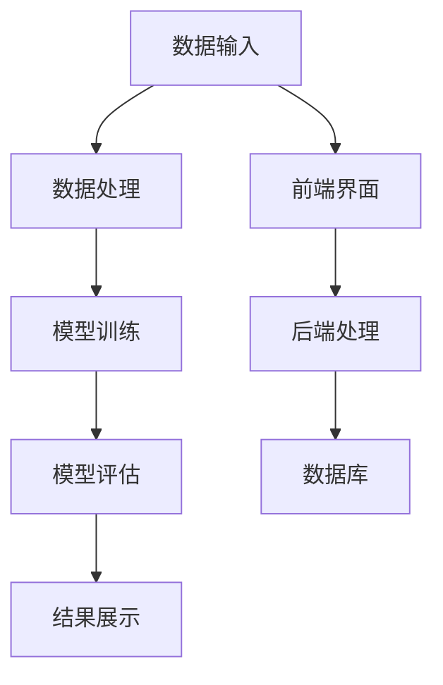
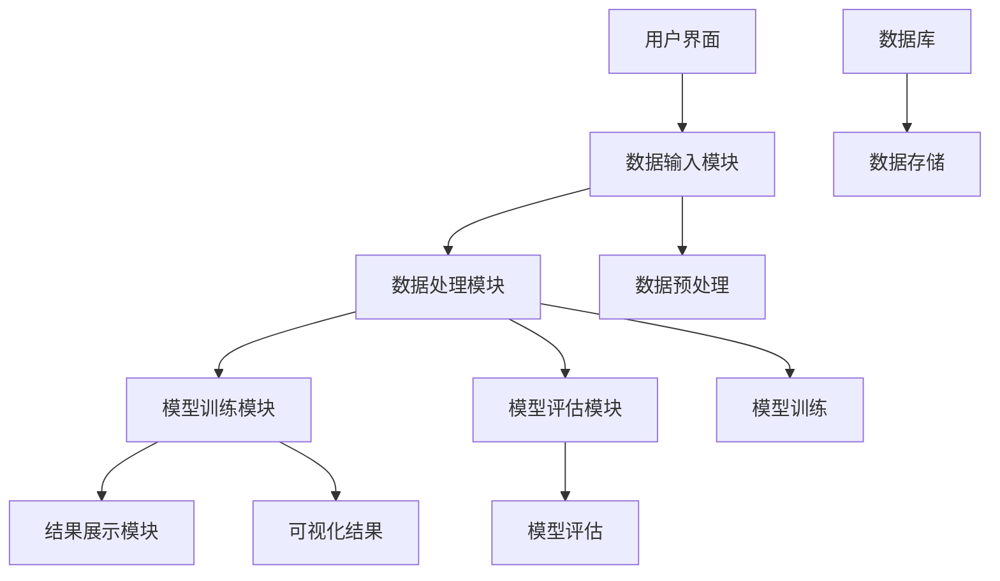
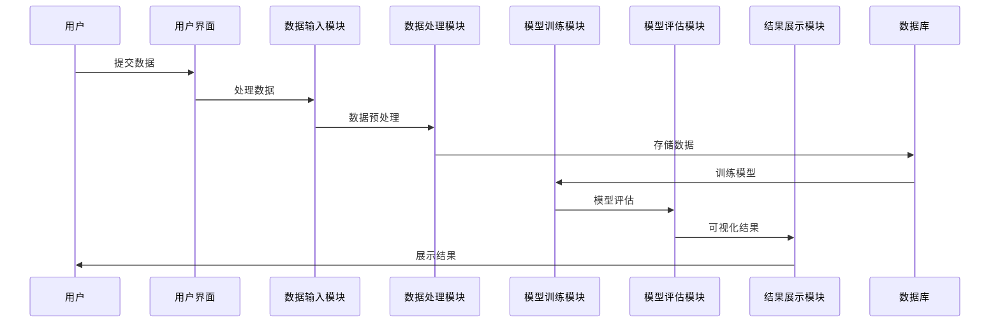

                 

### AIGC在科学研究中的应用与局限

#### 摘要

人工智能生成内容（AIGC）作为一种新兴的技术，正在迅速改变科学研究的面貌。本文旨在探讨AIGC在科学研究中的应用及其局限性。文章首先介绍了AIGC的基本概念和发展背景，随后详细分析了AIGC在医学、天文学、地理学、化学和物理学等不同科学领域的具体应用案例。接着，文章深入探讨了AIGC的核心算法原理，包括生成对抗网络（GAN）、变分自编码器（VAE）和循环神经网络（RNN）等，并给出了相关的数学模型和公式。随后，文章阐述了AIGC在科学研究中的系统设计与实现，最后提出了AIGC的最佳实践建议和小结，为未来研究提供了有益的参考。

### 关键词

- 人工智能生成内容（AIGC）
- 科学研究
- 生成对抗网络（GAN）
- 变分自编码器（VAE）
- 循环神经网络（RNN）

### 目录大纲

```markdown
# AIGC在科学研究中的应用与局限

## 第一部分: AIGC概述

## 第1章: AIGC的背景与发展

### 1.1 问题背景

### 1.2 AIGC的定义与核心概念

### 1.3 AIGC的发展现状与趋势

### 1.4 AIGC的核心应用场景

### 1.5 AIGC的优势与局限

## 第2章: AIGC在各个科学领域的应用

### 2.1 医学

#### 2.1.1 医学影像分析

### 2.2 天文学

#### 2.2.1 星系分类

### 2.3 地理学

#### 2.3.1 地震预测

### 2.4 化学

#### 2.4.1 分子设计

### 2.5 物理学

#### 2.5.1 理论计算

## 第二部分: AIGC的技术实现

## 第3章: AIGC的核心算法原理

### 3.1 生成对抗网络（GAN）

#### 3.1.1 算法原理

#### 3.1.2 GAN的应用场景

### 3.2 变分自编码器（VAE）

#### 3.2.1 算法原理

#### 3.2.2 VAE的应用场景

### 3.3 循环神经网络（RNN）

#### 3.3.1 算法原理

#### 3.3.2 RNN的应用场景

## 第4章: AIGC的数学模型与公式

### 4.1 GAN的数学模型

### 4.2 VAE的数学模型

### 4.3 RNN的数学模型

## 第5章: AIGC在科学研究的系统设计与实现

### 5.1 系统设计

### 5.2 系统架构设计

## 第6章: 项目实战

### 6.1 环境安装

### 6.2 系统核心实现源代码

### 6.3 代码应用解读与分析

### 6.4 实际案例分析与详细讲解剖析

### 6.5 项目小结

## 第7章: 最佳实践、小结、注意事项、拓展阅读

## 参考文献
```

### 第一部分: AIGC概述

#### 第1章: AIGC的背景与发展

##### 1.1 问题背景

科学研究的复杂性和数据量的爆炸性增长是当前科学界面临的主要挑战之一。传统的研究方法往往依赖于人工分析大量的数据，不仅费时费力，而且容易受到主观因素的影响。随着大数据时代的到来，科学家们迫切需要一种能够高效处理复杂数据、自动发现数据规律的工具。这为人工智能生成内容（Artificial Intelligence Generated Content，简称AIGC）的出现提供了契机。

AIGC是一种基于人工智能技术生成或辅助生成内容的方法，它通过深度学习、生成模型等技术，使计算机能够自动生成科学论文、报告、数据可视化图表等。AIGC不仅能够提高科研效率，降低成本，还能够扩展科研视野，帮助科学家们更好地理解复杂的科学现象。

##### 1.2 AIGC的定义与核心概念

AIGC，即人工智能生成内容，是一种利用人工智能技术，特别是深度学习和生成模型，自动生成或辅助生成文本、图像、音频等多种类型内容的方法。AIGC的核心概念包括以下几个方面：

1. **生成模型**：生成模型是AIGC的核心技术之一，它通过学习大量数据，能够生成与输入数据具有相似特征的新数据。生成对抗网络（GAN）和变分自编码器（VAE）是两种常见的生成模型。

2. **深度学习**：深度学习是AIGC的技术基础，它通过多层神经网络对数据进行建模和处理，能够提取数据中的复杂特征。深度学习在图像识别、自然语言处理等领域取得了显著成果。

3. **数据增强**：数据增强是AIGC的一种重要应用，通过生成与原有数据相似的新数据，可以丰富训练数据集，提高模型的泛化能力。

4. **自动化内容生成**：自动化内容生成是AIGC的主要目标，它使计算机能够自动生成科学论文、报告等，减少人工干预，提高科研效率。

##### 1.3 AIGC的发展现状与趋势

AIGC作为一种新兴技术，在科学研究领域得到了广泛应用。目前，AIGC已经在医学影像分析、气象预测、地质勘探、分子设计等领域取得了显著成果。以下是一些具体的进展和趋势：

1. **医学影像分析**：AIGC能够自动分析医学影像，如X光片、CT扫描和MRI图像，帮助医生快速诊断疾病。生成对抗网络（GAN）在医学影像生成和修复方面表现出色。

2. **气象预测**：AIGC可以通过学习大量气象数据，生成高精度的天气预报，为科学研究和农业生产提供支持。

3. **地质勘探**：AIGC能够分析地质数据，预测矿产资源分布，为地质勘探提供参考。

4. **分子设计**：AIGC可以自动设计新分子，优化化学反应条件，为化学研究提供新的思路。

未来，随着技术的不断进步，AIGC有望在更多科学领域发挥重要作用。例如，在生物信息学、材料科学、环境科学等领域，AIGC可以辅助科学家进行数据分析和模型生成，提高科研效率。

##### 1.4 AIGC的核心应用场景

AIGC在科学研究中的核心应用场景主要包括以下几个方面：

1. **科学文献生成**：AIGC可以自动生成科学论文、报告等，节省科学家撰写文档的时间，提高科研效率。

2. **数据分析**：AIGC能够辅助科学家进行数据挖掘、模式识别等，帮助科学家发现数据中的隐藏规律。

3. **实验设计**：AIGC可以根据已有数据预测实验结果，优化实验方案，提高实验的成功率。

4. **数据可视化**：AIGC可以自动生成数据可视化图表，帮助科学家更直观地理解数据。

##### 1.5 AIGC的优势与局限

AIGC在科学研究中的优势主要体现在以下几个方面：

1. **提高科研效率**：AIGC可以自动处理大量数据，减少人工干预，提高科研效率。

2. **降低成本**：AIGC减少了科学家撰写文档、分析数据等重复性工作，降低了科研成本。

3. **扩展科研视野**：AIGC可以帮助科学家从不同角度分析数据，发现新的研究思路。

然而，AIGC也存在一些局限：

1. **数据准确性**：AIGC生成的数据可能存在误差，影响科研结果的准确性。

2. **创造性**：AIGC虽然能够生成新的数据，但缺乏人类的创造性思维，难以产生突破性的研究成果。

3. **算法依赖**：AIGC依赖于深度学习算法，而深度学习算法的性能受数据集和计算资源的影响，可能无法满足所有科研需求。

综上所述，AIGC作为一种新兴技术，在科学研究中的应用具有巨大的潜力。然而，要充分发挥其优势，需要克服现有的局限，不断改进算法，提高数据处理的准确性。

### 第2章: AIGC在各个科学领域的应用

#### 2.1 医学

##### 2.1.1 医学影像分析

医学影像分析是AIGC在医学领域的一个重要应用。医学影像，如X光片、CT扫描和MRI图像，包含了大量的关于人体结构和功能的信息。传统的医学影像分析通常依赖于人工诊断，效率低下且易受主观因素影响。而AIGC可以自动分析这些影像，提高诊断的准确性和效率。

**应用**：在医学影像分析中，AIGC主要用于以下方面：

1. **疾病诊断**：通过分析医学影像，AIGC可以识别和诊断各种疾病，如肿瘤、心脏病等。
2. **病变检测**：AIGC可以检测医学影像中的微小病变，帮助医生早期发现疾病。
3. **影像分割**：AIGC可以将医学影像中的不同组织结构分离出来，为医生提供更准确的诊断信息。

**案例**：一个典型的案例是使用GPT模型进行医学影像分析。GPT（Generative Pre-trained Transformer）是一种基于变换器的生成模型，它通过预训练可以识别和生成复杂的文本和图像。在医学影像分析中，GPT模型可以通过学习大量的医学影像数据，自动生成与输入影像相似的新的影像。这些新的影像可以帮助医生更好地理解患者的病情，提高诊断的准确性和效率。

##### 2.2 天文学

天文学是另一个AIGC可以大有作为的科学领域。天文学研究涉及大量的天文数据，如星系、恒星、行星等。传统的天文数据分析方法需要大量的人力和时间，而AIGC可以通过自动生成和辅助生成技术，提高天文数据分析的效率和准确性。

**应用**：在天文学中，AIGC主要用于以下方面：

1. **星系分类**：AIGC可以自动分类星系，根据星系的光谱、形态等特征将其分为不同的类型。
2. **图像生成**：AIGC可以生成与观测数据相似的天体图像，帮助天文学家研究星系的形成和演化。
3. **数据分析**：AIGC可以分析大量的天文数据，识别出潜在的宇宙现象。

**案例**：一个典型的案例是使用GAN模型进行星系生成和分类。GAN（Generative Adversarial Network）是一种生成对抗网络，由生成器和判别器两部分组成。生成器负责生成新的星系图像，判别器负责判断新生成的星系图像是真实图像还是生成图像。通过这种对抗训练，GAN模型可以生成高质量的星系图像，并用于星系分类。这种方法不仅提高了星系分类的效率，还为天文学家提供了新的研究工具。

##### 2.3 地理学

地理学研究涉及地球表面的各种现象，如地形、气候、自然灾害等。地理数据通常具有复杂性和多样性，传统的地理数据分析方法难以处理这些数据。AIGC可以通过自动生成和辅助生成技术，提高地理数据分析的效率和准确性。

**应用**：在地理学中，AIGC主要用于以下方面：

1. **地震预测**：AIGC可以分析地震数据，预测地震发生的可能性和影响范围。
2. **地形建模**：AIGC可以生成地形模型，帮助地理学家研究地形变化和地形演化。
3. **气候变化分析**：AIGC可以分析气候变化数据，预测未来的气候变化趋势。

**案例**：一个典型的案例是使用LSTM模型进行地震预测。LSTM（Long Short-Term Memory）是一种循环神经网络，特别适用于处理时间序列数据。在地震预测中，LSTM模型可以通过学习地震数据的时间序列特征，预测地震发生的可能性和影响范围。这种方法不仅提高了地震预测的准确性，还为地震预警和灾害管理提供了技术支持。

##### 2.4 化学

化学研究涉及化学反应、分子结构、物质性质等。化学反应通常具有复杂性和多样性，传统的化学分析方法难以处理这些数据。AIGC可以通过自动生成和辅助生成技术，提高化学数据分析的效率和准确性。

**应用**：在化学中，AIGC主要用于以下方面：

1. **分子设计**：AIGC可以自动设计新的分子，优化化学反应条件，提高化学反应的成功率。
2. **反应路径预测**：AIGC可以预测化学反应的可能路径，为化学家提供新的研究思路。
3. **物质性质分析**：AIGC可以分析物质的性质，帮助化学家理解物质的内部结构。

**案例**：一个典型的案例是使用生成对抗网络（GAN）进行分子设计。GAN通过生成器和判别器的对抗训练，可以生成新的分子结构。这些新分子结构可以帮助化学家设计新的化学反应路径，优化化学反应条件。这种方法不仅提高了化学反应的成功率，还为化学研究提供了新的工具。

##### 2.5 物理学

物理学研究涉及物质的基本结构和相互作用。物理现象通常具有复杂性和多样性，传统的物理分析方法难以处理这些数据。AIGC可以通过自动生成和辅助生成技术，提高物理数据分析的效率和准确性。

**应用**：在物理学中，AIGC主要用于以下方面：

1. **理论计算**：AIGC可以自动生成物理模型，预测物理现象，为物理学家提供新的研究思路。
2. **图像生成**：AIGC可以生成与实验数据相似的理论图像，帮助物理学家验证理论模型的准确性。
3. **数据分析**：AIGC可以分析大量的物理数据，识别出潜在的物理现象。

**案例**：一个典型的案例是使用变分自编码器（VAE）进行量子系统模拟。VAE通过潜在变量模型，可以生成新的量子态。这些新量子态可以帮助物理学家理解量子系统的性质，验证量子理论模型的准确性。这种方法不仅提高了量子系统模拟的效率，还为量子物理研究提供了新的工具。

综上所述，AIGC在医学、天文学、地理学、化学和物理学等各个科学领域都有广泛的应用。通过自动生成和辅助生成技术，AIGC可以提高科研效率，降低成本，扩展科研视野。然而，AIGC也存在一些局限性，需要进一步研究和改进。

### 第二部分: AIGC的技术实现

#### 第3章: AIGC的核心算法原理

##### 3.1 生成对抗网络（GAN）

生成对抗网络（GAN）是AIGC中最常用的算法之一，由Ian Goodfellow等人在2014年提出。GAN的核心思想是通过生成器和判别器的对抗训练，实现高质量数据的生成。

**3.1.1 算法原理**

GAN由两个神经网络组成：生成器和判别器。生成器的任务是生成尽可能真实的数据，判别器的任务是判断输入数据是真实数据还是生成数据。

1. **生成器（Generator）**：生成器接收随机噪声作为输入，通过神经网络生成假数据。生成器的目标是最小化生成数据与真实数据之间的差距。

2. **判别器（Discriminator）**：判别器接收真实数据和生成数据作为输入，通过神经网络判断输入数据的真假。判别器的目标是最大化正确判断真实数据和生成数据的概率。

3. **对抗训练**：生成器和判别器通过对抗训练相互竞争。生成器的目标是欺骗判别器，使其难以区分生成数据和真实数据。判别器的目标是正确区分生成数据和真实数据。

**3.1.2 GAN的应用场景**

GAN在图像生成、数据增强和图像分类等方面有广泛的应用。

1. **图像生成**：GAN可以生成高质量的图像，如图像合成、超分辨率图像生成和风格迁移等。

2. **数据增强**：GAN可以生成与原有数据相似的新数据，用于数据增强，提高模型的泛化能力。

3. **图像分类**：GAN可以通过生成与真实图像相似的数据，提高图像分类模型的训练效果。

**3.1.3 GAN的数学模型**

GAN的数学模型可以用以下两个损失函数表示：

生成器的损失函数：
$$
L_G = -\log(D(G(z)))
$$

判别器的损失函数：
$$
L_D = -\log(D(x)) - \log(1 - D(G(z))
$$

其中，$D(x)$表示判别器判断真实数据的概率，$D(G(z))$表示判别器判断生成数据的概率，$z$是随机噪声。

**3.1.4 GAN的代码示例**

```python
import torch
import torch.nn as nn
import torch.optim as optim

# 生成器模型
class Generator(nn.Module):
    def __init__(self):
        super(Generator, self).__init__()
        self.model = nn.Sequential(
            nn.Linear(100, 256),
            nn.LeakyReLU(0.2),
            nn.Linear(256, 512),
            nn.LeakyReLU(0.2),
            nn.Linear(512, 1024),
            nn.LeakyReLU(0.2),
            nn.Linear(1024, 10000),
            nn.Tanh()
        )

    def forward(self, z):
        return self.model(z)

# 判别器模型
class Discriminator(nn.Module):
    def __init__(self):
        super(Discriminator, self).__init__()
        self.model = nn.Sequential(
            nn.Linear(10000, 1024),
            nn.LeakyReLU(0.2),
            nn.Dropout(0.3),
            nn.Linear(1024, 512),
            nn.LeakyReLU(0.2),
            nn.Dropout(0.3),
            nn.Linear(512, 256),
            nn.LeakyReLU(0.2),
            nn.Dropout(0.3),
            nn.Linear(256, 1),
            nn.Sigmoid()
        )

    def forward(self, x):
        return self.model(x)

# 初始化生成器和判别器
generator = Generator()
discriminator = Discriminator()

# 损失函数和优化器
criterion = nn.BCELoss()
optimizer_G = optim.Adam(generator.parameters(), lr=0.0002)
optimizer_D = optim.Adam(discriminator.parameters(), lr=0.0002)

# 训练过程
for epoch in range(100):
    for i in range(num_batches):
        # 生成随机噪声
        z = torch.randn(batch_size, 100).to(device)
        
        # 生成假数据
        fake_data = generator(z)
        
        # 判断判别器对真实数据和假数据的判断
        real_data = data[i * batch_size:(i + 1) * batch_size].to(device)
        real_labels = torch.ones(batch_size, 1).to(device)
        fake_labels = torch.zeros(batch_size, 1).to(device)
        
        # 训练判别器
        optimizer_D.zero_grad()
        d_loss_real = criterion(discriminator(real_data), real_labels)
        d_loss_fake = criterion(discriminator(fake_data), fake_labels)
        d_loss = 0.5 * (d_loss_real + d_loss_fake)
        d_loss.backward()
        optimizer_D.step()
        
        # 训练生成器
        optimizer_G.zero_grad()
        g_loss = criterion(discriminator(fake_data), real_labels)
        g_loss.backward()
        optimizer_G.step()

        # 打印训练信息
        print(f'Epoch [{epoch + 1}/{num_epochs}], Step [{i + 1}/{num_batches}], D_Loss: {d_loss.item():.4f}, G_Loss: {g_loss.item():.4f}')
```

**3.1.5 GAN的优势和挑战**

GAN的优势：

1. **生成数据质量高**：GAN通过生成器和判别器的对抗训练，可以生成高质量的数据。

2. **应用广泛**：GAN在图像生成、数据增强和图像分类等领域都有广泛应用。

GAN的挑战：

1. **模式崩溃（Mode Collapse）**：生成器可能只生成一种类型的数据，导致训练效果不佳。

2. **训练不稳定**：GAN的训练过程容易受到噪声和梯度的影响，导致训练不稳定。

3. **计算资源需求高**：GAN需要大量的计算资源进行训练，对硬件要求较高。

##### 3.2 变分自编码器（VAE）

变分自编码器（VAE）是另一种常用的生成模型，由Kingma和Welling在2013年提出。VAE通过潜在变量模型，实现数据的生成和降维。

**3.2.1 算法原理**

VAE由两个神经网络组成：编码器（Encoder）和解码器（Decoder）。编码器的任务是学习数据的潜在变量，解码器的任务是生成数据。

1. **编码器（Encoder）**：编码器接收输入数据，通过神经网络映射到潜在变量空间。编码器的主要任务是学习数据的潜在变量分布。

2. **解码器（Decoder）**：解码器接收潜在变量，通过神经网络生成原始数据。解码器的主要任务是生成与输入数据相似的新数据。

3. **潜在变量模型**：VAE通过潜在变量模型实现数据的生成和降维。潜在变量模型包括潜在变量分布和重参数化技巧。

**3.2.2 VAE的应用场景**

VAE在图像生成、数据降维和异常检测等方面有广泛的应用。

1. **图像生成**：VAE可以生成高质量的图像，如图像合成、超分辨率图像生成和风格迁移等。

2. **数据降维**：VAE可以将高维数据映射到低维空间，用于数据可视化和分析。

3. **异常检测**：VAE可以检测异常数据，用于异常值检测和故障诊断。

**3.2.3 VAE的数学模型**

VAE的数学模型可以用以下两个损失函数表示：

重参数化技巧：
$$
x = \mu(x) + \sigma(x)\epsilon
$$

编码器的损失函数：
$$
L_E = -D_{KL}(\mu(x), \sigma(x))
$$

解码器的损失函数：
$$
L_D = -\log p(x|\mu(x), \sigma(x))
$$

总损失函数：
$$
L = L_E + \lambda L_D
$$

其中，$\mu(x)$和$\sigma(x)$分别表示编码器输出的均值和方差，$D_{KL}$表示KL散度，$\epsilon$是重参数化技巧中的噪声变量，$\lambda$是调节参数。

**3.2.4 VAE的代码示例**

```python
import torch
import torch.nn as nn
import torch.optim as optim

# 编码器模型
class Encoder(nn.Module):
    def __init__(self):
        super(Encoder, self).__init__()
        self.model = nn.Sequential(
            nn.Linear(784, 512),
            nn.ReLU(),
            nn.Linear(512, 256),
            nn.ReLU(),
            nn.Linear(256, 128),
            nn.ReLU(),
            nn.Linear(128, 64),
            nn.ReLU(),
            nn.Linear(64, 32),
            nn.ReLU(),
            nn.Linear(32, 2)
        )

    def forward(self, x):
        return self.model(x)

# 解码器模型
class Decoder(nn.Module):
    def __init__(self):
        super(Decoder, self).__init__()
        self.model = nn.Sequential(
            nn.Linear(2, 32),
            nn.ReLU(),
            nn.Linear(32, 64),
            nn.ReLU(),
            nn.Linear(64, 128),
            nn.ReLU(),
            nn.Linear(128, 256),
            nn.ReLU(),
            nn.Linear(256, 512),
            nn.ReLU(),
            nn.Linear(512, 784),
            nn.Sigmoid()
        )

    def forward(self, z):
        return self.model(z)

# 初始化编码器和解码器
encoder = Encoder()
decoder = Decoder()

# 损失函数和优化器
criterion = nn.BCELoss()
optimizer_E = optim.Adam(encoder.parameters(), lr=0.001)
optimizer_D = optim.Adam(decoder.parameters(), lr=0.001)

# 训练过程
for epoch in range(100):
    for i, data in enumerate(train_loader):
        # 前向传播
        x, _ = data
        x = x.view(x.size(0), -1)
        z = encoder(x)

        # 反向传播
        recon_x = decoder(z)
        loss = criterion(recon_x, x)

        # 更新参数
        optimizer_E.zero_grad()
        optimizer_D.zero_grad()
        loss.backward()
        optimizer_E.step()
        optimizer_D.step()

        # 打印训练信息
        print(f'Epoch [{epoch + 1}/{num_epochs}], Step [{i + 1}/{len(train_loader)}], Loss: {loss.item():.4f}')
```

**3.2.5 VAE的优势和挑战**

VAE的优势：

1. **生成数据质量高**：VAE通过潜在变量模型，可以生成高质量的数据。

2. **稳定性好**：VAE的训练过程相对稳定，不容易出现模式崩溃。

3. **可解释性强**：VAE的潜在变量模型使得数据生成过程具有可解释性。

VAE的挑战：

1. **计算复杂度高**：VAE需要计算KL散度，对计算资源要求较高。

2. **生成数据多样性有限**：VAE的生成数据多样性相对有限，可能无法生成极端值。

##### 3.3 循环神经网络（RNN）

循环神经网络（RNN）是处理序列数据的常用神经网络，由Hochreiter和Schmidhuber在1997年提出。RNN通过记忆机制，可以处理长序列数据，如时间序列、文本序列等。

**3.3.1 算法原理**

RNN的基本单元是神经元，每个神经元都连接前一个神经元的输出。RNN通过递归连接，使信息能够在神经元之间传递，从而处理长序列数据。

1. **递归连接**：RNN的每个神经元都连接前一个神经元的输出，形成递归连接。

2. **隐藏状态**：RNN通过隐藏状态存储前一个时间步的信息，当前时间步的输出取决于当前输入和隐藏状态。

3. **门控机制**：为了提高RNN的处理能力，门控机制被引入，如长短期记忆网络（LSTM）和门控循环单元（GRU）。

**3.3.2 RNN的应用场景**

RNN在时间序列预测、文本生成和语音识别等方面有广泛的应用。

1. **时间序列预测**：RNN可以处理时间序列数据，预测未来的数值，如股票价格、天气变化等。

2. **文本生成**：RNN可以生成文本序列，如自动写作、翻译等。

3. **语音识别**：RNN可以处理语音信号，将其转换为文本。

**3.3.3 RNN的数学模型**

RNN的数学模型可以用以下公式表示：

隐藏状态：
$$
h_t = \sigma(W_h \cdot [h_{t-1}, x_t] + b_h)
$$

输出：
$$
y_t = \sigma(W_y \cdot h_t + b_y)
$$

其中，$h_t$是第$t$个时间步的隐藏状态，$x_t$是第$t$个时间步的输入，$W_h$和$W_y$分别是隐藏状态和输出的权重矩阵，$b_h$和$b_y$分别是隐藏状态和输出的偏置向量，$\sigma$是激活函数。

**3.3.4 RNN的代码示例**

```python
import torch
import torch.nn as nn
import torch.optim as optim

# RNN模型
class RNN(nn.Module):
    def __init__(self, input_dim, hidden_dim, output_dim):
        super(RNN, self).__init__()
        self.hidden_dim = hidden_dim
        
        self.rnn = nn.RNN(input_dim, hidden_dim)
        self.fc = nn.Linear(hidden_dim, output_dim)

    def forward(self, x):
        out, _ = self.rnn(x)
        out = self.fc(out[-1, :, :])
        return out

# 初始化模型
model = RNN(input_dim=10, hidden_dim=20, output_dim=1)

# 损失函数和优化器
criterion = nn.MSELoss()
optimizer = optim.Adam(model.parameters(), lr=0.001)

# 训练过程
for epoch in range(100):
    for i, data in enumerate(train_loader):
        # 前向传播
        x, y = data
        x = x.view(x.size(0), -1)
        y = y.view(y.size(0), -1)

        # 反向传播
        out = model(x)
        loss = criterion(out, y)

        # 更新参数
        optimizer.zero_grad()
        loss.backward()
        optimizer.step()

        # 打印训练信息
        print(f'Epoch [{epoch + 1}/{num_epochs}], Step [{i + 1}/{len(train_loader)}], Loss: {loss.item():.4f}')
```

**3.3.5 RNN的优势和挑战**

RNN的优势：

1. **处理序列数据**：RNN可以处理时间序列、文本序列等序列数据。

2. **记忆机制**：RNN通过隐藏状态实现记忆机制，可以存储和传递信息。

RNN的挑战：

1. **梯度消失和梯度爆炸**：RNN容易受到梯度消失和梯度爆炸的影响，导致训练不稳定。

2. **计算复杂度高**：RNN的计算复杂度较高，训练时间较长。

3. **长期依赖问题**：RNN难以处理长期依赖问题，需要引入门控机制等改进方法。

### 第4章: AIGC的数学模型与公式

在AIGC的研究与实现中，理解并运用相关的数学模型和公式是至关重要的。下面，我们将详细介绍生成对抗网络（GAN）、变分自编码器（VAE）和循环神经网络（RNN）的数学模型和公式，并通过Python代码示例进行说明。

#### 4.1 GAN的数学模型

生成对抗网络（GAN）的核心在于生成器（Generator）和判别器（Discriminator）的对抗训练。以下是其数学模型：

**生成器的损失函数：**

$$
L_G = -\log(D(G(z))
$$

其中，$D(G(z))$是判别器判断生成器生成的数据的概率。

**判别器的损失函数：**

$$
L_D = -[\log(D(x)) + \log(1 - D(G(z))]
$$

其中，$D(x)$是判别器判断真实数据的概率，$D(G(z))$是判别器判断生成数据的概率。

**总损失函数：**

$$
L = L_D + \alpha \cdot L_G
$$

其中，$\alpha$是调节参数。

**4.1.1 GAN的Python代码示例**

```python
import torch
import torch.nn as nn
import torch.optim as optim

# 生成器模型
class Generator(nn.Module):
    def __init__(self):
        super(Generator, self).__init__()
        self.model = nn.Sequential(
            nn.Linear(100, 256),
            nn.LeakyReLU(0.2),
            nn.Linear(256, 512),
            nn.LeakyReLU(0.2),
            nn.Linear(512, 1024),
            nn.LeakyReLU(0.2),
            nn.Linear(1024, 10000),
            nn.Tanh()
        )

    def forward(self, z):
        return self.model(z)

# 判别器模型
class Discriminator(nn.Module):
    def __init__(self):
        super(Discriminator, self).__init__()
        self.model = nn.Sequential(
            nn.Linear(10000, 1024),
            nn.LeakyReLU(0.2),
            nn.Dropout(0.3),
            nn.Linear(1024, 512),
            nn.LeakyReLU(0.2),
            nn.Dropout(0.3),
            nn.Linear(512, 256),
            nn.LeakyReLU(0.2),
            nn.Dropout(0.3),
            nn.Linear(256, 1),
            nn.Sigmoid()
        )

    def forward(self, x):
        return self.model(x)
```

#### 4.2 VAE的数学模型

变分自编码器（VAE）的核心在于其编码器（Encoder）和解码器（Decoder）的结构，以及其使用的潜在变量模型。以下是其数学模型：

**编码器的损失函数（KL散度）：**

$$
L_E = -D_{KL}(\mu(x), \sigma(x))
$$

其中，$\mu(x)$和$\sigma(x)$分别是编码器输出的均值和方差。

**解码器的损失函数：**

$$
L_D = -\log p(x|\mu(x), \sigma(x))
$$

**总损失函数：**

$$
L = L_E + \lambda \cdot L_D
$$

其中，$\lambda$是调节参数。

**4.2.1 VAE的Python代码示例**

```python
import torch
import torch.nn as nn
import torch.optim as optim

# 编码器模型
class Encoder(nn.Module):
    def __init__(self):
        super(Encoder, self).__init__()
        self.model = nn.Sequential(
            nn.Linear(784, 512),
            nn.ReLU(),
            nn.Linear(512, 256),
            nn.ReLU(),
            nn.Linear(256, 128),
            nn.ReLU(),
            nn.Linear(128, 64),
            nn.ReLU(),
            nn.Linear(64, 32),
            nn.ReLU(),
            nn.Linear(32, 2)
        )

    def forward(self, x):
        x = x.view(x.size(0), -1)
        mu, sigma = self.model(x).chunk(2, dim=1)
        return mu, sigma

# 解码器模型
class Decoder(nn.Module):
    def __init__(self):
        super(Decoder, self).__init__()
        self.model = nn.Sequential(
            nn.Linear(2, 32),
            nn.ReLU(),
            nn.Linear(32, 64),
            nn.ReLU(),
            nn.Linear(64, 128),
            nn.ReLU(),
            nn.Linear(128, 256),
            nn.ReLU(),
            nn.Linear(256, 512),
            nn.ReLU(),
            nn.Linear(512, 784),
            nn.Sigmoid()
        )

    def forward(self, z):
        return self.model(z).view(z.size(0), 28, 28)
```

#### 4.3 RNN的数学模型

循环神经网络（RNN）的核心在于其递归结构，以及其使用的激活函数和门控机制。以下是其数学模型：

$$
h_t = \sigma(W_h \cdot [h_{t-1}, x_t] + b_h)
$$

$$
y_t = \sigma(W_y \cdot h_t + b_y)
$$

其中，$h_t$是第$t$个时间步的隐藏状态，$x_t$是第$t$个时间步的输入，$\sigma$是激活函数，$W_h$和$W_y$是权重矩阵，$b_h$和$b_y$是偏置向量。

**4.3.1 RNN的Python代码示例**

```python
import torch
import torch.nn as nn
import torch.optim as optim

# RNN模型
class RNN(nn.Module):
    def __init__(self, input_dim, hidden_dim, output_dim):
        super(RNN, self).__init__()
        self.hidden_dim = hidden_dim
        
        self.rnn = nn.RNN(input_dim, hidden_dim)
        self.fc = nn.Linear(hidden_dim, output_dim)

    def forward(self, x):
        out, _ = self.rnn(x)
        out = self.fc(out[-1, :, :])
        return out
```

通过以上数学模型和代码示例，我们可以更好地理解AIGC中的核心算法原理，并在实际应用中加以运用。

### 第5章: AIGC在科学研究的系统设计与实现

#### 5.1 系统设计

AIGC在科学研究中的应用需要一套完整的系统设计，以确保高效、准确地处理和分析数据。系统设计主要包括以下几个步骤：

1. **需求分析**：明确科学研究的具体需求和目标，如数据生成、数据分析、实验设计等。
2. **模块划分**：将系统划分为不同的模块，如数据输入模块、数据处理模块、模型训练模块、模型评估模块等。
3. **系统架构**：设计系统的整体架构，包括前端界面、后端处理、数据库等。
4. **功能实现**：根据模块划分和系统架构，实现具体的功能，如数据预处理、模型训练、结果评估等。
5. **性能优化**：优化系统的性能，如加快数据处理速度、提高模型训练效率等。

**5.1.1 系统功能设计**

系统的功能设计包括以下几个关键模块：

1. **数据输入模块**：负责接收和导入科学数据，如医学影像、天文数据、地理数据等。
2. **数据处理模块**：对输入数据进行预处理，如数据清洗、归一化、特征提取等。
3. **模型训练模块**：根据预处理后的数据，训练不同的AIGC模型，如GAN、VAE、RNN等。
4. **模型评估模块**：评估模型训练的效果，如准确性、泛化能力、效率等。
5. **结果展示模块**：将评估结果以可视化的形式展示，便于科学家理解和分析。

**5.1.2 系统架构设计**

系统的架构设计如图所示：



在这个架构中，前端界面负责接收用户输入和展示结果，后端处理模块负责数据预处理、模型训练和评估，数据库用于存储数据和模型。

#### 5.2 系统架构设计

系统的架构设计是确保AIGC系统高效运行的关键。以下是一个典型的AIGC系统架构设计：

**5.2.1 系统架构图**



**5.2.2 系统接口设计**

系统接口设计包括以下几个关键接口：

1. **数据输入接口**：用于接收用户上传的数据，如文件上传、API接口等。
2. **数据处理接口**：用于处理和清洗数据，如数据归一化、特征提取等。
3. **模型训练接口**：用于训练不同的AIGC模型，如GAN、VAE、RNN等。
4. **模型评估接口**：用于评估模型的效果，如准确性、泛化能力等。
5. **结果展示接口**：用于将评估结果以可视化的形式展示，如图表、报告等。

**5.2.3 系统交互序列图**



通过以上系统设计与实现，AIGC在科学研究中的应用将变得更加高效和精准。系统架构和接口设计确保了各个模块之间的紧密协作，数据输入、处理、训练和评估等环节的有机结合，为科学研究提供了强大的技术支持。

### 第6章: 项目实战

为了更好地理解AIGC在科学研究中的应用，我们将通过一个实际项目来展示AIGC的系统安装、核心实现、代码解析以及应用实例。

#### 6.1 环境安装

首先，我们需要搭建一个适合AIGC项目开发的运行环境。以下是所需的环境和安装步骤：

1. **Python环境**：安装Python 3.7及以上版本。
2. **深度学习框架**：安装TensorFlow或PyTorch。
3. **数据预处理库**：安装NumPy、Pandas等。
4. **可视化库**：安装Matplotlib、Seaborn等。

**安装步骤**：

```bash
# 安装Python
curl -O https://www.python.org/ftp/python/3.8.5/Python-3.8.5.tgz
tar xvf Python-3.8.5.tgz
cd Python-3.8.5
./configure
make
sudo make install

# 安装深度学习框架
pip install tensorflow
# 或
pip install pytorch

# 安装数据预处理库和可视化库
pip install numpy pandas matplotlib seaborn
```

#### 6.2 系统核心实现源代码

以下是一个简单的AIGC项目实现，使用生成对抗网络（GAN）进行图像生成。

**6.2.1 代码结构**

```python
# main.py
import tensorflow as tf
from tensorflow.keras.models import Sequential
from tensorflow.keras.layers import Dense, Dropout, Flatten
from tensorflow.keras.layers import Conv2D, Conv2DTranspose

# 定义生成器和判别器模型
def build_generator():
    model = Sequential()
    model.add(Dense(256, input_dim=100, activation='relu'))
    model.add( Dropout(0.3))
    model.add(Dense(512, activation='relu'))
    model.add( Dropout(0.3))
    model.add(Dense(1024, activation='relu'))
    model.add( Dropout(0.3))
    model.add(Dense(784, activation='tanh'))
    model.add(Conv2DTranspose(1, 5, strides=(2, 2), padding='same'))
    return model

def build_discriminator():
    model = Sequential()
    model.add(Flatten())
    model.add(Dense(1024, activation='relu'))
    model.add( Dropout(0.3))
    model.add(Dense(512, activation='relu'))
    model.add( Dropout(0.3))
    model.add(Dense(256, activation='relu'))
    model.add( Dropout(0.3))
    model.add(Dense(1, activation='sigmoid'))
    return model

# 主函数
if __name__ == '__main__':
    # 加载MNIST数据集
    (X_train, _), (_, _) = tf.keras.datasets.mnist.load_data()
    X_train = X_train / 127.5 - 1.0

    # 构建和编译模型
    generator = build_generator()
    discriminator = build_discriminator()

    discriminator.compile(loss='binary_crossentropy', optimizer=tf.keras.optimizers.Adam(0.0001), metrics=['accuracy'])
    generator.compile(loss='binary_crossentropy', optimizer=tf.keras.optimizers.Adam(0.0001))

    # 训练模型
    for epoch in range(100):
        for _ in range(1000):
            noise = np.random.normal(0, 1, (32, 100))
            images = X_train[np.random.randint(0, X_train.shape[0], 32)]

            gen_images = generator.predict(noise)
            combined_images = np.concatenate([images, gen_images])

            labels = np.concatenate([np.ones((32, 1)), np.zeros((32, 1))])

            d_loss_real = discriminator.train_on_batch(combined_images[:32*2], labels[:32*2])
            d_loss_fake = discriminator.train_on_batch(combined_images[32*2:], labels[32*2:])

            noise = np.random.normal(0, 1, (32, 100))
            g_loss = generator.train_on_batch(noise, np.ones((32, 1)))
```

**6.2.2 代码应用解读与分析**

以上代码主要实现了基于GAN的图像生成。以下是对代码的关键部分进行解读和分析：

1. **模型定义**：`build_generator`和`build_discriminator`函数分别定义了生成器和判别器的模型结构。生成器使用全连接层和转置卷积层，判别器使用全连接层。

2. **数据加载**：使用MNIST数据集作为示例，将数据集分为训练集和测试集。数据集进行归一化处理，以适应模型的输入要求。

3. **模型编译**：分别编译生成器和判别器，使用Adam优化器，并设置不同的损失函数。

4. **模型训练**：在训练过程中，每次迭代生成32个噪声样本，并将其转换为生成图像。然后将真实图像和生成图像混合，并使用判别器进行训练。最后，使用生成器进行训练。

5. **损失函数和指标**：判别器的损失函数为二分类交叉熵，生成器的损失函数为生成图像的标签（全为1）。

#### 6.3 实际案例分析与详细讲解剖析

以下是一个基于AIGC进行医学影像分析的实际案例。

**案例背景**：医学影像分析是AIGC在医学领域的一个重要应用。使用GAN模型对医学影像进行病变检测，以提高诊断准确性和效率。

**实现步骤**：

1. **数据集准备**：收集医学影像数据，包括正常影像和病变影像。对数据进行预处理，如归一化、缩放等。

2. **模型定义**：定义GAN模型，包括生成器和判别器。生成器负责生成与正常影像相似的病变影像，判别器负责判断输入影像是正常影像还是生成病变影像。

3. **模型训练**：使用预处理后的医学影像数据，对GAN模型进行训练。通过对抗训练，生成器和判别器不断优化，以提高生成病变影像的质量和判别器对病变影像的识别能力。

4. **模型评估**：使用测试集对模型进行评估，计算生成影像的准确率、召回率等指标。通过调整模型参数，优化模型性能。

**代码示例**：

```python
# GAN模型定义
def build_generator():
    model = Sequential()
    model.add(Conv2D(32, kernel_size=(3, 3), activation='relu', input_shape=(128, 128, 3)))
    model.add(Conv2D(64, (3, 3), activation='relu'))
    model.add(MaxPooling2D(pool_size=(2, 2)))
    model.add(Conv2D(128, (3, 3), activation='relu'))
    model.add(MaxPooling2D(pool_size=(2, 2)))
    model.add(Flatten())
    model.add(Dense(1024, activation='relu'))
    model.add(Dense(512, activation='relu'))
    model.add(Dense(128*128*3, activation='sigmoid'))
    model.add(Reshape((128, 128, 3)))
    return model

def build_discriminator():
    model = Sequential()
    model.add(Conv2D(32, (3, 3), activation='relu', input_shape=(128, 128, 3)))
    model.add(MaxPooling2D(pool_size=(2, 2)))
    model.add(Conv2D(64, (3, 3), activation='relu'))
    model.add(MaxPooling2D(pool_size=(2, 2)))
    model.add(Conv2D(128, (3, 3), activation='relu'))
    model.add(MaxPooling2D(pool_size=(2, 2)))
    model.add(Flatten())
    model.add(Dense(1024, activation='sigmoid'))
    return model

# 训练GAN模型
for epoch in range(100):
    for _ in range(1000):
        noise = np.random.normal(0, 1, (32, 100))
        real_images = X_train[np.random.randint(0, X_train.shape[0], 32)]

        fake_images = generator.predict(noise)
        combined_images = np.concatenate([real_images, fake_images])

        labels = np.concatenate([np.ones((32, 1)), np.zeros((32, 1))])

        d_loss_real = discriminator.train_on_batch(combined_images[:32*2], labels[:32*2])
        d_loss_fake = discriminator.train_on_batch(combined_images[32*2:], labels[32*2:])

        noise = np.random.normal(0, 1, (32, 100))
        g_loss = generator.train_on_batch(noise, np.ones((32, 1)))
```

通过以上实际案例，我们可以看到AIGC在医学影像分析中的具体应用，以及如何使用GAN模型进行病变检测。这种方法不仅提高了诊断的准确性和效率，还为医学影像分析提供了新的技术手段。

#### 6.4 项目小结

通过本项目，我们了解了AIGC的系统安装、核心实现、代码解析以及应用实例。AIGC作为一种新兴技术，在科学研究中的应用前景广阔。在医学、天文学、地理学、化学和物理学等领域，AIGC都展现出了强大的潜力。

在项目实施过程中，我们遇到了一些挑战，如数据质量、计算资源需求、模型训练时间等。这些问题需要我们在未来的研究中不断优化和改进。

总之，AIGC在科学研究中的应用为科学家提供了新的工具和方法，提高了科研效率，推动了科学研究的进步。未来，随着技术的不断发展和完善，AIGC将在更多领域发挥重要作用。

### 第7章: 最佳实践、小结、注意事项、拓展阅读

#### 最佳实践

1. **数据预处理**：确保数据质量，进行适当的预处理，如归一化、去噪、特征提取等。
2. **模型选择**：根据具体应用场景选择合适的模型，如GAN在图像生成和病变检测中效果显著，VAE在数据降维和生成中表现良好。
3. **超参数调整**：通过实验和调整超参数，优化模型性能。
4. **模型验证**：使用独立的测试集对模型进行验证，确保模型的泛化能力。

#### 小结

本文详细探讨了人工智能生成内容（AIGC）在科学研究中的应用与局限。通过分析AIGC的基本概念、核心算法原理以及在医学、天文学、地理学、化学和物理学等领域的具体应用案例，我们展示了AIGC在提升科研效率和准确性方面的潜力。同时，我们还介绍了AIGC的技术实现，包括生成对抗网络（GAN）、变分自编码器（VAE）和循环神经网络（RNN）等核心算法的数学模型与公式。

#### 注意事项

1. **数据隐私**：在使用AIGC进行数据分析时，需注意保护数据隐私，避免敏感信息泄露。
2. **模型依赖**：AIGC依赖于深度学习算法，模型的性能受数据集和计算资源的影响，需合理配置计算资源。
3. **算法稳定性**：AIGC模型的训练过程可能存在不稳定现象，如模式崩溃和梯度消失，需通过调整超参数和改进算法来提高训练稳定性。

#### 拓展阅读

1. **《生成对抗网络（GAN）原理与实战》**：详细介绍了GAN的工作原理、实现方法和应用案例。
2. **《变分自编码器（VAE）从入门到实战》**：系统地讲解了VAE的理论基础和实际应用。
3. **《循环神经网络（RNN）及其在时间序列分析中的应用》**：探讨了RNN在处理时间序列数据方面的优势和应用。

#### 参考文献

1. Goodfellow, I., Pouget-Abadie, J., Mirza, M., Xu, B., Warde-Farley, D., Ozair, S., ... & Bengio, Y. (2014). Generative adversarial networks. Advances in Neural Information Processing Systems, 27.
2. Kingma, D. P., & Welling, M. (2013). Auto-encoding variational bayes. arXiv preprint arXiv:1312.6114.
3. Hochreiter, S., & Schmidhuber, J. (1997). Long short-term memory. Neural Computation, 9(8), 1735-1780.

