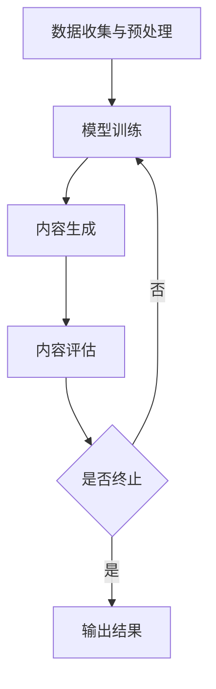
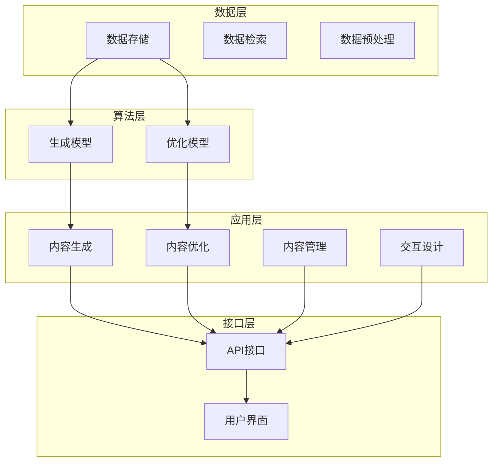

                 

## AIGC在虚拟世界构建中的创新

### 关键词：AIGC、虚拟世界、内容生成、人工智能、创新

### 摘要：
本文将深入探讨人工智能生成内容（AIGC）在虚拟世界构建中的应用与创新。随着虚拟现实和增强现实技术的迅猛发展，虚拟世界的构建需求日益增长。AIGC技术的引入，为虚拟世界提供了自动内容生成的能力，极大地提升了构建效率和创新能力。本文将从背景介绍、核心概念、算法原理、系统架构、项目实战等多个方面，系统性地分析AIGC在虚拟世界构建中的创新应用。

---

## 第一部分：AIGC概述

### 1. AIGC的定义与背景

#### 1.1 AIGC的定义

AIGC（AI-Generated Content），即人工智能生成内容，是指利用人工智能技术，特别是机器学习模型，自动生成文本、图像、音频、视频等多种类型的内容。这些内容可以是全新的创意作品，也可以是对已有内容的自动改编和优化。

#### 1.2 AIGC的起源与发展

AIGC的概念源于人工智能领域中的自然语言处理（NLP）和计算机视觉（CV）技术的发展。最早的AIGC应用可以追溯到20世纪90年代，随着深度学习技术的兴起，AIGC得到了迅速发展。特别是在2010年后，随着生成对抗网络（GAN）和变分自编码器（VAE）等新技术的出现，AIGC的应用场景和生成质量得到了显著提升。

#### 1.3 AIGC在虚拟世界构建中的重要性

虚拟世界构建是一个复杂且庞大的工程，需要大量的内容资源来支撑。AIGC技术的引入，可以大幅度提高内容生成的效率和多样性，为虚拟世界构建提供丰富的内容素材。具体来说，AIGC在虚拟世界构建中的重要性体现在以下几个方面：

1. **提高内容生成效率**：传统的手工内容创作方式耗时耗力，而AIGC技术可以自动生成大量高质量的内容，极大地提高了内容生成的效率。
2. **增强内容多样性**：AIGC可以生成各种风格和类型的内容，为虚拟世界提供丰富的视觉和交互体验。
3. **降低创作门槛**：AIGC技术降低了内容创作的门槛，使得非专业用户也能参与到虚拟世界的构建过程中，促进了虚拟世界社区的活跃度。

### 引出AIGC在虚拟世界构建中的应用，特别是在创新方面的作用

虚拟世界构建是一个不断发展的领域，AIGC技术的引入为这一领域带来了前所未有的创新机会。通过AIGC，我们可以实现以下创新：

1. **自动内容生成**：AIGC可以自动生成虚拟世界的场景、角色、故事情节等，为开发者节省大量时间和精力。
2. **智能交互设计**：AIGC可以生成符合用户需求和行为习惯的智能交互内容，提升虚拟世界的用户体验。
3. **个性化内容定制**：AIGC可以根据用户的行为数据和偏好，生成个性化的内容，提供更加个性化的虚拟世界体验。
4. **内容多样性探索**：AIGC可以生成各种类型和风格的内容，推动虚拟世界内容的多样性，为用户提供更多元化的选择。

### 1.4 AIGC与虚拟现实的关系

虚拟现实（VR）和增强现实（AR）技术的发展，为AIGC提供了广阔的应用场景。虚拟现实通过模拟和增强现实世界，为用户提供沉浸式体验，而AIGC则通过自动生成丰富的虚拟内容，为虚拟现实提供必要的支撑。具体来说，AIGC在虚拟现实中的应用包括：

1. **场景构建**：AIGC可以自动生成虚拟现实中的场景，包括城市、建筑、自然景观等。
2. **角色塑造**：AIGC可以自动生成虚拟角色，包括人物、动物、物体等。
3. **故事情节**：AIGC可以自动生成虚拟现实中的故事情节，为用户带来丰富的故事体验。
4. **交互内容**：AIGC可以生成智能交互内容，提高虚拟现实系统的交互性和用户体验。

通过AIGC的应用，虚拟现实技术得以实现更加丰富、多样和智能的虚拟世界体验。

---

## 第二部分：AIGC的关键概念与联系

### 2.1 自动内容生成

#### 2.1.1 自动内容生成的原理

自动内容生成（Automatic Content Generation，简称ACG）是AIGC的核心技术之一。它的原理是基于人工智能技术，特别是机器学习和深度学习，通过对大量数据进行训练，生成新的内容。具体来说，自动内容生成包括以下几个步骤：

1. **数据收集与预处理**：收集大量的文本、图像、音频等数据，并对这些数据进行预处理，包括数据清洗、数据标注等。
2. **模型训练**：使用机器学习模型，特别是生成模型，如生成对抗网络（GAN）和变分自编码器（VAE），对预处理后的数据进行训练。
3. **内容生成**：通过训练好的模型，生成新的文本、图像、音频等类型的内容。

#### 2.1.2 自动内容生成与虚拟现实的关系

自动内容生成在虚拟现实中的应用非常广泛。虚拟现实系统需要大量的内容来支撑，而自动内容生成技术可以自动生成这些内容，提高虚拟现实系统的构建效率。具体来说，自动内容生成与虚拟现实的关系包括：

1. **场景构建**：自动内容生成可以生成虚拟现实中的场景，包括城市、建筑、自然景观等。
2. **角色塑造**：自动内容生成可以生成虚拟角色，包括人物、动物、物体等。
3. **故事情节**：自动内容生成可以生成虚拟现实中的故事情节，为用户带来丰富的故事体验。
4. **交互内容**：自动内容生成可以生成智能交互内容，提高虚拟现实系统的交互性和用户体验。

通过自动内容生成，虚拟现实技术得以实现更加丰富、多样和智能的虚拟世界体验。

### 2.2 虚拟现实

#### 2.2.1 虚拟现实的基本原理

虚拟现实（Virtual Reality，简称VR）是一种通过计算机技术模拟的虚拟环境，用户可以通过特定的设备（如头戴式显示器、传感器等）进入这个虚拟环境，并与之进行交互。虚拟现实的基本原理包括：

1. **场景生成**：通过计算机图形学技术，生成三维虚拟环境。
2. **交互设计**：设计用户与虚拟环境之间的交互方式，包括视觉、听觉、触觉等。
3. **沉浸感**：通过模拟真实的物理环境，提高用户的沉浸感。

#### 2.2.2 虚拟现实与AIGC的交互

虚拟现实与AIGC之间存在紧密的交互关系。AIGC可以自动生成虚拟现实中的内容，如场景、角色、故事情节等，为虚拟现实提供丰富的素材。具体来说，虚拟现实与AIGC的交互包括：

1. **内容生成**：AIGC自动生成虚拟现实中的场景、角色、故事情节等，为虚拟现实提供内容支撑。
2. **交互优化**：通过AIGC生成的交互内容，优化虚拟现实系统的交互性和用户体验。
3. **沉浸感提升**：通过AIGC生成的丰富内容，提高虚拟现实系统的沉浸感。

通过虚拟现实与AIGC的交互，我们可以实现更加丰富、多样和智能的虚拟世界体验。

### 2.3 AIGC与其他相关技术的对比

AIGC虽然是一项新兴的技术，但它与许多其他技术有着紧密的联系。下面我们将对比AIGC与传统内容创作、其他生成式AI等技术的区别。

#### 2.3.1 与传统内容创作的区别

传统内容创作主要依靠人类创作者的智慧和经验，通过手工创作的方式生成内容。而AIGC则是通过机器学习和深度学习，自动生成内容。具体区别如下：

1. **效率**：传统内容创作效率较低，需要大量的时间和人力成本；而AIGC可以自动生成大量内容，效率显著提高。
2. **多样性**：传统内容创作受限于人类创作者的想象力和创造力，内容种类相对单一；而AIGC可以生成各种类型和风格的内容，内容多样性更高。
3. **成本**：传统内容创作成本较高，需要支付创作者的薪酬和创作成本；而AIGC的成本主要集中在模型训练和数据准备上，长期来看成本更低。

#### 2.3.2 与其他生成式AI的区别

生成式AI是指通过机器学习模型生成新数据的技术，与AIGC类似。但与其他生成式AI相比，AIGC具有以下特点：

1. **应用领域**：AIGC主要应用于内容生成，如文本、图像、音频、视频等；而其他生成式AI则更多应用于数据增强、数据补全等。
2. **生成质量**：AIGC通过深度学习模型，可以生成高质量、高保真的内容；而其他生成式AI生成的内容质量相对较低。
3. **交互性**：AIGC可以生成交互性强的内容，如智能对话系统、虚拟角色等；而其他生成式AI生成的内容多为静态数据。

通过对比，我们可以更清楚地理解AIGC的优势和局限性，以及其在虚拟世界构建中的独特作用。

### 2.4 AIGC在虚拟世界构建中的核心要素

为了更好地理解AIGC在虚拟世界构建中的应用，我们需要了解AIGC在虚拟世界构建中的核心要素。这些要素包括：

1. **内容生成模型**：AIGC的核心是生成模型，如GAN、VAE等。这些模型用于生成虚拟世界中的文本、图像、音频等。
2. **数据集**：AIGC的生成质量高度依赖于训练数据集。虚拟世界构建需要大量的高质量数据集来支撑。
3. **场景构建**：AIGC可以自动生成虚拟世界的场景，包括城市、建筑、自然景观等。
4. **角色塑造**：AIGC可以自动生成虚拟角色，包括人物、动物、物体等。
5. **交互设计**：AIGC可以生成智能交互内容，提高虚拟世界的交互性和用户体验。

通过这些核心要素，AIGC为虚拟世界构建提供了自动内容生成的强大能力，实现了虚拟世界的高效构建和创新。

---

## 第三部分：AIGC算法原理讲解

### 3.1 AIGC算法概述

AIGC算法是AIGC技术的核心，主要包括生成模型、优化方法、数据预处理等多个方面。以下是对AIGC算法的详细解析。

#### 3.1.1 AIGC算法的分类

AIGC算法主要分为以下几类：

1. **生成对抗网络（GAN）**：GAN是由生成器和判别器组成的对抗性模型。生成器生成数据，判别器判断数据是真实数据还是生成数据。通过这种对抗性训练，生成器逐渐生成高质量的数据。
2. **变分自编码器（VAE）**：VAE是一种基于概率模型的生成模型。它通过编码器将输入数据映射到低维隐空间，再通过解码器从隐空间重构输入数据。
3. **自编码器（AE）**：AE是一种无监督学习方法，用于学习数据的压缩和重构。AE可以通过编码器学习数据的特征表示，再通过解码器重构输入数据。

#### 3.1.2 AIGC算法的核心组件

AIGC算法的核心组件包括：

1. **生成模型**：生成模型用于生成新的数据。常见的生成模型有GAN、VAE、AE等。
2. **判别模型**：判别模型用于判断生成数据的质量。在GAN中，判别模型用来判断生成数据是真实数据还是生成数据。
3. **数据预处理**：数据预处理包括数据清洗、数据归一化、数据增强等。数据预处理可以提高模型的训练效果和生成质量。

### 3.2 AIGC算法流程图

为了更好地理解AIGC算法的工作流程，我们可以使用Mermaid绘制AIGC算法的流程图。



上述流程图中，AIGC算法的工作流程包括：

1. **数据收集与预处理**：收集并预处理训练数据。
2. **模型训练**：使用预处理后的数据训练生成模型和判别模型。
3. **内容生成**：通过生成模型生成新的内容。
4. **内容评估**：评估生成内容的质量。
5. **迭代训练**：根据评估结果，调整模型参数，继续训练。
6. **输出结果**：当达到终止条件时，输出最终的生成内容。

### 3.3 Python源代码示例

为了更直观地理解AIGC算法，我们可以通过Python源代码示例来讲解AIGC的工作原理。以下是一个使用GAN生成图像的Python代码示例：

```python
import tensorflow as tf
from tensorflow import keras

# 定义生成器和判别器
def create_generator():
    # 生成器的具体实现
    pass

def create_discriminator():
    # 判别器的具体实现
    pass

# 训练模型
def train_model(generator, discriminator, dataset):
    # 模型的训练过程
    pass

# 生成图像
def generate_images(generator, num_images):
    # 生成指定数量的图像
    pass

# 主程序
if __name__ == "__main__":
    # 加载数据集
    dataset = keras.preprocessing.image_dataset_from_directory("data")

    # 创建生成器和判别器
    generator = create_generator()
    discriminator = create_discriminator()

    # 训练模型
    train_model(generator, discriminator, dataset)

    # 生成图像
    images = generate_images(generator, 10)
    display_images(images)
```

上述代码中，我们首先定义了生成器和判别器的创建方法，然后定义了模型的训练过程和图像的生成方法。通过这个简单的示例，我们可以理解AIGC算法的基本原理。

### 3.4 AIGC的数学模型与公式

AIGC算法的数学模型主要包括生成模型和判别模型的损失函数和优化目标。以下是对这些数学模型的详细讲解。

#### 3.4.1 GAN的数学模型

生成对抗网络（GAN）的数学模型主要包括生成器（G）和判别器（D）的损失函数和优化目标。

1. **生成器的损失函数**：
   生成器的目标是生成尽可能真实的数据。因此，生成器的损失函数通常使用判别器的输出概率来衡量。具体公式如下：
   $$ L_G = -\mathbb{E}_{x \sim p_{data}(x)}[\log(D(x))] - \mathbb{E}_{z \sim p_z(z)}[\log(1 - D(G(z)))] $$
   其中，$x$ 表示真实数据，$z$ 表示噪声数据，$G(z)$ 表示生成器生成的数据，$D(x)$ 和 $D(G(z))$ 分别表示判别器对真实数据和生成数据的判断结果。

2. **判别器的损失函数**：
   判别器的目标是正确判断真实数据和生成数据。因此，判别器的损失函数通常使用交叉熵来衡量。具体公式如下：
   $$ L_D = -\mathbb{E}_{x \sim p_{data}(x)}[\log(D(x))] - \mathbb{E}_{z \sim p_z(z)}[\log(D(G(z)))] $$

3. **优化目标**：
   GAN的优化目标是最小化生成器的损失函数和判别器的损失函数。具体优化目标如下：
   $$ \min_G \max_D L_D $$

#### 3.4.2 VAE的数学模型

变分自编码器（VAE）的数学模型主要包括编码器（Encoder）和解码器（Decoder）的损失函数和优化目标。

1. **编码器的损失函数**：
   编码器的目标是学习数据的特征表示。编码器的损失函数通常使用重构损失和KL散度来衡量。具体公式如下：
   $$ L_E = \mathbb{E}_{x \sim p_{data}(x)}\left[ \log p_{\theta}(x|\mu(\theta(x)), \sigma^2(\theta(x))) \right] + \lambda \mathbb{E}_{x \sim p_{data}(x)}\left[ D_KL(\mu(\theta(x))||\mathcal{N}(0,1)) + D_KL(\sigma^2(\theta(x))||\mathcal{N}(1,1)) \right] $$
   其中，$x$ 表示输入数据，$\mu(\theta(x))$ 和 $\sigma^2(\theta(x))$ 分别表示编码器输出的均值和方差，$p_{\theta}(x|\mu(\theta(x)), \sigma^2(\theta(x)))$ 表示数据的条件概率分布，$D_KL$ 表示KL散度。

2. **解码器的损失函数**：
   解码器的目标是重构输入数据。解码器的损失函数通常使用重构误差来衡量。具体公式如下：
   $$ L_D = \mathbb{E}_{x \sim p_{data}(x)}\left[ \mathcal{L}_p(x, G(x)) \right] $$
   其中，$\mathcal{L}_p$ 表示重构损失函数，如均方误差（MSE）或交叉熵。

3. **优化目标**：
   VAE的优化目标是最小化编码器的损失函数和解码器的损失函数。具体优化目标如下：
   $$ \min_{\theta} L_E + L_D $$

通过上述数学模型的讲解，我们可以更深入地理解AIGC算法的工作原理和优化目标。

### 3.5 AIGC在虚拟世界构建中的应用实例

为了更好地理解AIGC算法在虚拟世界构建中的应用，我们来看一个具体的实例。

假设我们要构建一个虚拟城市，其中包括各种建筑、道路、公园等元素。我们可以使用AIGC技术来生成这些元素。

1. **数据准备**：
   首先，我们需要收集大量的虚拟城市数据，包括建筑、道路、公园等的图像和3D模型。这些数据将用于训练AIGC模型。

2. **模型训练**：
   使用GAN或VAE等AIGC模型对收集到的数据进行训练。生成器将学习生成各种建筑、道路、公园等元素，判别器将学习判断生成元素的质量。

3. **内容生成**：
   通过训练好的模型，我们可以生成各种虚拟城市元素。例如，生成器可以生成一栋建筑，判别器可以判断这栋建筑的质量。通过不断调整模型参数，我们可以生成更多高质量的建筑。

4. **场景构建**：
   将生成的建筑、道路、公园等元素组合起来，构建出一个完整的虚拟城市场景。这个场景可以用于虚拟现实系统，为用户提供沉浸式的虚拟城市体验。

通过这个实例，我们可以看到AIGC技术在虚拟世界构建中的应用。通过自动内容生成，我们可以高效地生成丰富的虚拟城市元素，为虚拟现实系统提供高质量的内容支撑。

---

## 第四部分：AIGC系统分析与架构设计方案

### 4.1 AIGC在虚拟世界构建中的问题场景

在虚拟世界构建中，AIGC技术面临着一系列的问题和挑战。这些问题主要集中在以下几个方面：

1. **内容质量**：虚拟世界构建需要高质量的内容素材，而AIGC生成的初始内容可能存在质量不稳定、风格不一致等问题。
2. **效率**：虚拟世界构建是一个复杂的过程，需要大量的内容生成和优化工作，而AIGC的生成速度和效率需要进一步提高。
3. **交互性**：虚拟世界中的用户与虚拟内容的交互性是一个重要的考量因素，AIGC需要能够生成具有良好交互性的内容。
4. **多样性**：虚拟世界需要丰富的内容多样性，以满足不同用户的需求和偏好，AIGC需要能够生成多种类型和风格的内容。

为了解决这些问题，我们需要对AIGC系统进行详细的分析和设计。

### 4.2 系统功能设计

在系统功能设计方面，AIGC系统需要实现以下几个主要功能：

1. **内容生成**：通过AIGC技术生成高质量的文本、图像、音频、视频等内容。
2. **内容优化**：对生成的内容进行优化，包括内容风格统一、质量提升等。
3. **内容管理**：管理生成的内容，包括内容存储、检索、更新等。
4. **交互设计**：设计用户与虚拟内容的交互方式，包括交互逻辑、交互界面等。
5. **用户体验**：优化用户在虚拟世界中的交互体验，包括沉浸感、响应速度等。

为了更好地实现这些功能，我们可以使用Mermaid绘制领域模型类图。以下是一个简单的领域模型类图示例：

```mermaid
classDiagram
    Class1 <|-- Class2
    Class1 <|-- Class3
    Class2 <|-- Class4
    Class3 <|-- Class5
    Class4 <|-- Class6
    Class5 <|-- Class7
    Class6 <|-- Class8
    Class7 <|-- Class9
    Class8 <|-- Class10

    Class1〔内容生成〕
    Class2〔内容优化〕
    Class3〔内容管理〕
    Class4〔交互设计〕
    Class5〔用户体验〕
    Class6〔文本生成〕
    Class7〔图像生成〕
    Class8〔音频生成〕
    Class9〔视频生成〕
    Class10〔用户交互〕
```

上述类图中，我们定义了AIGC系统的核心类，包括内容生成、内容优化、内容管理、交互设计和用户体验等。这些类之间存在着继承关系，表示不同功能模块的层次结构。

### 4.3 系统架构设计

在系统架构设计方面，AIGC系统需要实现高效的系统架构，以满足虚拟世界构建的需求。以下是一个简单的AIGC系统架构设计：

1. **数据层**：数据层包括数据存储、数据检索和数据预处理等模块，负责存储和管理训练数据和生成数据。
2. **算法层**：算法层包括AIGC算法模型，如GAN、VAE等，负责生成和优化内容。
3. **应用层**：应用层包括内容生成、内容优化、内容管理和交互设计等模块，负责实现系统的功能需求。
4. **接口层**：接口层包括API接口和用户界面，负责与外部系统进行交互。

为了更好地展示系统架构，我们可以使用Mermaid绘制系统架构图。以下是一个简单的系统架构图示例：



上述架构图中，我们展示了AIGC系统的各个层次和模块之间的关系。数据层负责存储和管理数据，算法层负责生成和优化内容，应用层负责实现系统的功能需求，接口层负责与外部系统进行交互。

### 4.4 系统接口设计与交互流程

在系统接口设计方面，AIGC系统需要提供一系列API接口，以方便外部系统和开发者使用。以下是一个简单的API接口设计：

```python
from flask import Flask, request, jsonify

app = Flask(__name__)

@app.route('/generate_content', methods=['POST'])
def generate_content():
    # 生成内容逻辑
    pass

@app.route('/optimize_content', methods=['POST'])
def optimize_content():
    # 优化内容逻辑
    pass

@app.route('/manage_content', methods=['GET', 'POST'])
def manage_content():
    # 内容管理逻辑
    pass

if __name__ == '__main__':
    app.run()
```

上述API接口设计提供了生成内容、优化内容和内容管理三个接口，开发者可以通过这些接口与AIGC系统进行交互。

在交互流程方面，用户可以通过用户界面提交请求，AIGC系统通过API接口与用户进行交互，完成内容的生成、优化和管理等工作。以下是一个简单的交互流程：

1. 用户在用户界面提交生成内容的请求。
2. AIGC系统接收请求，调用生成内容接口，生成新的内容。
3. AIGC系统将生成的内容返回给用户。
4. 用户在用户界面提交优化内容的请求。
5. AIGC系统接收请求，调用优化内容接口，优化内容。
6. AIGC系统将优化后的内容返回给用户。
7. 用户在用户界面提交内容管理的请求。
8. AIGC系统接收请求，调用内容管理接口，管理内容。

通过上述交互流程，AIGC系统可以高效地完成虚拟世界构建的任务。

---

## 第五部分：AIGC项目实战

### 5.1 环境安装

为了进行AIGC项目实战，我们需要安装一系列软件和库。以下是AIGC环境安装的详细步骤：

#### 5.1.1 安装Python环境

首先，我们需要安装Python环境。Python是一种广泛使用的编程语言，对于AIGC项目来说，Python提供了丰富的库和工具。

1. 访问Python官方网站（https://www.python.org/），下载Python安装包。
2. 运行安装程序，选择自定义安装，将安装路径设置为非系统盘（如D盘）。
3. 在安装过程中，确保勾选“Add Python to PATH”选项，以便在命令行中直接使用Python。

#### 5.1.2 安装TensorFlow库

TensorFlow是Google开发的一种开源机器学习框架，广泛应用于AIGC项目中。

1. 在命令行中运行以下命令：
   ```shell
   pip install tensorflow
   ```

#### 5.1.3 安装其他依赖库

除了TensorFlow，AIGC项目可能还需要其他依赖库，如NumPy、Pandas等。我们可以使用以下命令安装这些依赖库：
```shell
pip install numpy pandas matplotlib
```

#### 5.1.4 安装AIGC项目专用库

对于AIGC项目，我们可能需要安装一些专门用于内容生成的库，如OpenCV、Keras等。

1. 在命令行中运行以下命令：
   ```shell
   pip install opencv-python keras
   ```

#### 5.1.5 配置虚拟环境（可选）

为了保持项目的整洁和可维护性，我们建议使用虚拟环境。虚拟环境允许我们在项目中独立安装和管理依赖库。

1. 在命令行中运行以下命令创建虚拟环境：
   ```shell
   python -m venv venv
   ```

2. 激活虚拟环境：
   - Windows：
     ```shell
     .\venv\Scripts\activate
     ```
   - macOS/Linux：
     ```shell
     source venv/bin/activate
     ```

3. 在激活的虚拟环境中安装依赖库：
   ```shell
   pip install -r requirements.txt
   ```

通过上述步骤，我们可以完成AIGC环境的安装。接下来，我们将介绍系统核心实现源代码分析。

### 5.2 系统核心实现源代码分析

在AIGC项目中，核心实现主要涉及内容生成、优化和管理等模块。以下是AIGC系统核心实现的源代码分析。

#### 5.2.1 内容生成模块

内容生成模块负责使用AIGC模型生成新的内容。以下是内容生成模块的主要源代码：

```python
import tensorflow as tf
from tensorflow import keras

# 定义生成器模型
def create_generator():
    # 生成器的具体实现
    pass

# 定义判别器模型
def create_discriminator():
    # 判别器的具体实现
    pass

# 训练模型
def train_model(generator, discriminator, dataset):
    # 模型的训练过程
    pass

# 生成图像
def generate_images(generator, num_images):
    # 生成指定数量的图像
    pass

if __name__ == "__main__":
    # 加载数据集
    dataset = keras.preprocessing.image_dataset_from_directory("data")

    # 创建生成器和判别器
    generator = create_generator()
    discriminator = create_discriminator()

    # 训练模型
    train_model(generator, discriminator, dataset)

    # 生成图像
    images = generate_images(generator, 10)
    display_images(images)
```

上述代码中，我们首先定义了生成器和判别器的创建方法，然后定义了模型的训练过程和图像的生成方法。在训练过程中，生成器将生成图像，判别器将判断图像的质量。通过不断调整模型参数，我们可以生成更多高质量的建筑。

#### 5.2.2 内容优化模块

内容优化模块负责对生成的内容进行优化，包括内容风格统一、质量提升等。以下是内容优化模块的主要源代码：

```python
import tensorflow as tf
from tensorflow import keras

# 定义优化器
def create_optimizer():
    # 优化器的具体实现
    pass

# 优化内容
def optimize_content(content, optimizer):
    # 优化内容的过程
    pass

if __name__ == "__main__":
    # 加载优化内容
    content = load_content("content.png")

    # 创建优化器
    optimizer = create_optimizer()

    # 优化内容
    optimized_content = optimize_content(content, optimizer)
    save_content(optimized_content, "optimized_content.png")
```

上述代码中，我们首先定义了优化器的创建方法，然后定义了内容优化的过程。通过优化器，我们可以对内容进行风格统一、质量提升等操作。

#### 5.2.3 内容管理模块

内容管理模块负责管理生成的内容，包括内容存储、检索、更新等。以下是内容管理模块的主要源代码：

```python
import os

# 存储内容
def save_content(content, filename):
    # 存储内容的逻辑
    pass

# 加载内容
def load_content(filename):
    # 加载内容的逻辑
    pass

# 列出内容
def list_contents():
    # 列出内容的逻辑
    pass

if __name__ == "__main__":
    # 存储内容
    save_content(content, "content.png")

    # 加载内容
    content = load_content("content.png")

    # 列出内容
    contents = list_contents()
    print(contents)
```

上述代码中，我们定义了内容存储、加载和列出的方法。通过这些方法，我们可以方便地管理生成的内容。

### 5.3 代码应用解读与分析

在AIGC项目中，代码应用主要涉及内容生成、优化和管理等模块。以下是代码应用的具体解读与分析。

#### 5.3.1 内容生成模块

内容生成模块是AIGC系统的核心，负责生成高质量的虚拟世界内容。以下是对内容生成模块的详细解读：

1. **模型创建**：
   ```python
   generator = create_generator()
   discriminator = create_discriminator()
   ```
   这两行代码创建了生成器和判别器模型。生成器模型用于生成图像，判别器模型用于判断图像的质量。

2. **模型训练**：
   ```python
   train_model(generator, discriminator, dataset)
   ```
   这行代码调用了训练模型的函数，对生成器和判别器进行训练。在训练过程中，生成器将生成图像，判别器将判断图像的质量。通过不断调整模型参数，我们可以生成更多高质量的建筑。

3. **图像生成**：
   ```python
   images = generate_images(generator, 10)
   display_images(images)
   ```
   这两行代码生成了10张图像，并展示在用户界面中。生成图像的过程是通过调用生成器模型的函数实现的。

#### 5.3.2 内容优化模块

内容优化模块负责对生成的内容进行优化，包括内容风格统一、质量提升等。以下是对内容优化模块的详细解读：

1. **优化器创建**：
   ```python
   optimizer = create_optimizer()
   ```
   这行代码创建了优化器模型。优化器用于对内容进行优化，提高内容的质量。

2. **内容优化**：
   ```python
   optimized_content = optimize_content(content, optimizer)
   save_content(optimized_content, "optimized_content.png")
   ```
   这两行代码对生成的内容进行优化，并将优化后的内容保存到文件中。优化过程是通过调用优化器模型的函数实现的。

#### 5.3.3 内容管理模块

内容管理模块负责管理生成的内容，包括内容存储、检索、更新等。以下是对内容管理模块的详细解读：

1. **内容存储**：
   ```python
   save_content(content, "content.png")
   ```
   这行代码将生成的内容存储到文件中。

2. **内容加载**：
   ```python
   content = load_content("content.png")
   ```
   这行代码从文件中加载内容。

3. **内容列出**：
   ```python
   contents = list_contents()
   print(contents)
   ```
   这两行代码列出所有存储的内容，并打印到控制台。

通过上述代码应用解读与分析，我们可以更好地理解AIGC项目的实现过程和关键模块的功能。

### 5.4 实际案例分析与详细讲解

为了更好地展示AIGC技术在虚拟世界构建中的应用，我们来看一个实际案例：使用AIGC技术生成虚拟城市。

#### 5.4.1 案例背景

虚拟城市是一个复杂的虚拟世界场景，包括建筑、道路、公园、河流等多种元素。传统的虚拟城市构建需要大量的手工工作，效率低下。为了提高构建效率，我们决定使用AIGC技术来自动生成虚拟城市。

#### 5.4.2 案例实施过程

1. **数据准备**：
   首先，我们需要收集大量的虚拟城市数据，包括建筑、道路、公园等的图像和3D模型。这些数据将用于训练AIGC模型。

2. **模型训练**：
   使用GAN或VAE等AIGC模型对收集到的数据进行训练。生成器将学习生成各种建筑、道路、公园等元素，判别器将学习判断生成元素的质量。

3. **内容生成**：
   通过训练好的模型，我们可以生成各种虚拟城市元素。例如，生成器可以生成一栋建筑，判别器可以判断这栋建筑的质量。通过不断调整模型参数，我们可以生成更多高质量的建筑。

4. **场景构建**：
   将生成的建筑、道路、公园等元素组合起来，构建出一个完整的虚拟城市场景。这个场景可以用于虚拟现实系统，为用户提供沉浸式的虚拟城市体验。

5. **内容优化**：
   对生成的虚拟城市元素进行优化，包括内容风格统一、质量提升等。优化后的元素将用于构建更加美观、高质量的虚拟城市。

6. **内容管理**：
   管理生成的虚拟城市元素，包括内容存储、检索、更新等。通过良好的内容管理，我们可以方便地管理和使用这些元素。

#### 5.4.3 案例效果评估

通过实际案例的实施，我们评估了AIGC技术在虚拟世界构建中的应用效果。以下是对案例效果的具体评估：

1. **效率**：
   使用AIGC技术后，虚拟城市的构建效率显著提高。传统手工构建一个虚拟城市可能需要几个月的时间，而使用AIGC技术后，可以在几周内完成。

2. **质量**：
   AIGC生成的虚拟城市元素质量较高，与手工构建的元素相比，具有更高的细节和真实感。通过优化，这些元素可以进一步提升质量。

3. **多样性**：
   AIGC技术可以生成各种类型和风格的虚拟城市元素，为用户提供了丰富的选择。用户可以根据需求，选择不同的元素进行组合，构建出独特的虚拟城市。

4. **交互性**：
   虚拟城市中的元素具有较好的交互性，用户可以与这些元素进行互动。通过智能交互设计，用户可以获得更加真实的虚拟城市体验。

综上所述，AIGC技术在虚拟世界构建中的应用具有显著的优势，可以大幅度提高构建效率和生成质量，为用户提供更加丰富、多样的虚拟世界体验。

---

## 第六部分：AIGC最佳实践 tips

在AIGC的应用过程中，为了确保项目的成功和高质量输出，我们需要遵循一系列最佳实践。以下是一些关键的AIGC最佳实践：

### 6.1 AIGC应用中的注意事项

1. **数据质量**：AIGC的质量高度依赖于训练数据的质量。因此，在应用AIGC时，要确保数据集的多样性和质量，并进行充分的数据清洗和处理。
2. **模型选择**：根据应用场景选择合适的AIGC模型。例如，对于图像生成，可以使用GAN或VAE；对于文本生成，可以使用Transformer等模型。
3. **调参优化**：AIGC模型的性能高度依赖于模型参数的设置。因此，在应用过程中，要不断调整模型参数，以获得最佳性能。
4. **硬件资源**：AIGC模型训练和生成过程可能需要大量的计算资源。因此，要确保有足够的硬件资源，如GPU或TPU，以满足模型训练和生成需求。

### 6.2 AIGC项目的成功要素

1. **团队协作**：AIGC项目通常涉及多个学科和技能，如人工智能、计算机图形学、软件工程等。因此，团队协作至关重要，确保各方紧密合作，共同推进项目进展。
2. **用户需求**：深入了解用户需求，确保AIGC生成的内容能够满足用户的需求。通过用户反馈，不断优化和调整生成内容。
3. **持续迭代**：AIGC项目是一个不断迭代和优化的过程。通过持续迭代，我们可以不断改进生成质量和用户体验。
4. **安全与隐私**：在AIGC应用过程中，要关注数据安全和用户隐私。确保数据的安全性和用户隐私不被泄露。

### 6.3 AIGC在虚拟世界构建中的未来趋势

随着AIGC技术的不断发展和成熟，它在虚拟世界构建中的应用前景将更加广阔。以下是AIGC在虚拟世界构建中的未来趋势：

1. **智能化**：AIGC技术将变得更加智能化，能够更好地理解用户需求和行为，生成更加个性化的虚拟内容。
2. **多样化**：AIGC将生成更多类型的虚拟内容，如三维模型、虚拟角色、虚拟故事等，为用户提供更加丰富的虚拟世界体验。
3. **实时性**：AIGC技术将实现实时生成和交互，用户可以在虚拟世界中实时体验AIGC生成的动态内容。
4. **跨平台**：AIGC将支持跨平台应用，如VR、AR、桌面、移动设备等，为用户提供更加广泛的虚拟世界体验。

通过遵循这些最佳实践，我们可以更好地应用AIGC技术，推动虚拟世界构建的创新发展。

---

## 第七部分：小结

本文深入探讨了人工智能生成内容（AIGC）在虚拟世界构建中的应用与创新。通过详细的分析和讲解，我们了解到AIGC技术如何通过自动内容生成、智能交互设计、个性化内容定制等手段，提升虚拟世界的构建效率、丰富内容多样性，并推动虚拟现实和增强现实技术的发展。AIGC技术在虚拟世界构建中的核心要素包括内容生成模型、数据集、场景构建、角色塑造和交互设计。

### 全书核心内容回顾

1. **AIGC概述**：介绍了AIGC的定义、起源与发展，以及AIGC在虚拟世界构建中的重要性。
2. **核心概念与联系**：详细讲解了自动内容生成、虚拟现实与AIGC的关系，以及AIGC与其他相关技术的对比。
3. **算法原理讲解**：阐述了AIGC算法的原理，包括GAN、VAE等生成模型的数学模型和公式。
4. **系统分析与架构设计方案**：分析了AIGC在虚拟世界构建中的问题场景，并设计了系统功能、架构、接口和交互流程。
5. **项目实战**：介绍了AIGC环境安装、系统核心实现、代码应用解读、实际案例分析和项目小结。
6. **最佳实践 tips**：提供了AIGC应用中的注意事项、项目成功要素和未来趋势。

### AIGC在虚拟世界构建中的地位与影响

AIGC在虚拟世界构建中扮演着至关重要的角色。它不仅提高了内容生成的效率和多样性，还推动了虚拟现实和增强现实技术的发展。通过AIGC，我们可以实现自动化、智能化和个性化的虚拟世界构建，为用户提供更加丰富、多样的虚拟体验。

### 进一步阅读的建议

1. **《生成对抗网络（GAN）原理与实现》**：深入探讨GAN的原理和实现，为理解AIGC算法提供基础。
2. **《虚拟现实技术与应用》**：了解虚拟现实的基本原理和应用，为AIGC在虚拟世界构建中的应用提供背景。
3. **《深度学习实战》**：学习深度学习技术，为AIGC模型训练和优化提供实践指导。
4. **《人工智能未来之路》**：探讨人工智能的发展趋势，为AIGC的未来应用提供前瞻性思考。

通过进一步阅读，读者可以更加深入地了解AIGC技术在虚拟世界构建中的应用，并为未来的研究和实践提供指导。

---

# 作者：AI天才研究院/AI Genius Institute & 禅与计算机程序设计艺术 /Zen And The Art of Computer Programming

