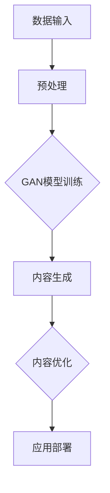

                 

**# 第1章 引言**

## 1.1 背景介绍

### 1.1.1 问题背景

在当今信息化的时代，虚拟教育环境作为现代教育的重要载体，已经成为教育领域研究和实践的热点。传统的教育模式主要依赖于面对面的互动，但随着远程教育和在线学习需求的增长，如何构建一个高效、逼真且互动性强的虚拟教育环境成为了一个亟待解决的问题。现有虚拟教育环境的局限性主要体现在以下几个方面：

- **互动性不足**：传统的虚拟教育环境往往缺乏真实课堂中的互动性，学生和教师之间的交流互动受到限制。
- **教育资源分配不均**：由于地理位置、经济条件等因素的限制，不同地区的学生能够获得的教育资源存在显著差异。
- **教学环境缺乏真实感**：虚拟教学环境的逼真度不足，难以完全模拟现实教学场景，影响学生的学习体验。

### 1.1.2 问题描述

构建一个高效、互动性强且具备真实感的虚拟教育环境需要解决以下几个关键问题：

1. **增强互动性**：如何通过技术手段提高学生和教师之间的互动质量，模拟现实课堂中的师生互动。
2. **优化资源分配**：如何利用大数据和人工智能技术，实现教育资源的智能化分配，使教育资源更加公平。
3. **提升真实感**：如何通过虚拟现实、增强现实等技术，提高虚拟教育环境的逼真度，增强学生的学习体验。

### 1.1.3 问题解决

为了解决上述问题，人工智能生成内容（AIGC，Artificial Intelligence Generated Content）技术的引入成为了一种有效的解决方案。AIGC技术通过人工智能算法生成文本、图像、音频等多媒体内容，能够为虚拟教育环境提供丰富的素材和功能，从而提升其互动性、真实感和教育资源分配的效率。

### 1.1.4 边界与外延

AIGC在虚拟教育环境构建中的角色具有明确的边界和外延：

- **边界**：AIGC主要用于生成和优化虚拟教育环境中的内容，如教学资源、互动素材等，但不涉及教育内容的制定和执行。
- **外延**：AIGC可以与虚拟现实（VR）、增强现实（AR）、自然语言处理（NLP）等技术相结合，实现更为丰富的教育应用场景。

### 1.1.5 概念结构与核心要素组成

为了深入理解AIGC在虚拟教育环境构建中的角色，我们需要对其概念结构和核心要素进行分析：

- **概念结构**：AIGC由数据输入、生成模型、输出内容三个核心组成部分构成。数据输入包括教学素材、用户数据等；生成模型主要基于深度学习技术，如生成对抗网络（GAN）、变分自编码器（VAE）等；输出内容则是通过模型生成的多媒体内容。
- **核心要素**：AIGC在虚拟教育环境构建中的核心要素包括：
  - **内容生成**：利用AIGC技术生成个性化教学资源，如模拟实验、虚拟课堂场景等。
  - **内容优化**：通过算法对教学资源进行优化，提高其互动性和真实感。
  - **资源分配**：基于大数据和人工智能技术，实现教育资源的智能化分配。

## 1.2 核心概念与联系

### 1.2.1 AIGC的概念与特点

AIGC，即人工智能生成内容，是指利用人工智能算法自动生成文本、图像、音频等多媒体内容的技术。其核心特点包括：

- **自动化生成**：通过机器学习算法，实现内容的自动化生成，大大提高了内容生成的效率。
- **多样化内容**：AIGC可以生成多种类型的内容，如文本、图像、音频等，适用于不同的应用场景。
- **个性化定制**：基于用户数据和需求，生成个性化定制的内容，提高用户体验。

### 1.2.2 AIGC与其他技术的比较与联系

AIGC与其他相关技术的比较与联系如下：

- **与虚拟现实（VR）/增强现实（AR）的联系**：VR/AR技术主要关注虚拟和增强现实场景的构建，而AIGC则提供丰富的多媒体内容，两者相结合可以实现更为真实的虚拟教育环境。
- **与自然语言处理（NLP）的联系**：NLP技术主要用于处理自然语言文本，AIGC在此基础上，通过生成对抗网络（GAN）等模型，实现文本内容的自动化生成。

### 1.2.3 AIGC在虚拟教育环境中的核心作用

AIGC在虚拟教育环境中的核心作用主要体现在以下几个方面：

- **提升互动性**：通过生成个性化教学资源和互动素材，增强学生与教师之间的互动性。
- **增强真实感**：利用虚拟现实、增强现实等技术，结合AIGC生成的多媒体内容，提高虚拟教育环境的真实感。
- **优化资源分配**：通过大数据和人工智能技术，实现教育资源的智能化分配，使教育资源更加公平。

## 1.3 数学模型和数学公式

### 1.3.1 AIGC的基本数学模型

AIGC的基本数学模型主要基于生成对抗网络（GAN）和变分自编码器（VAE）：

- **生成对抗网络（GAN）**：
  - **生成器（Generator）**：$$ G(z) = x $$
  - **判别器（Discriminator）**：$$ D(x) $$

- **变分自编码器（VAE）**：
  - **编码器（Encoder）**：$$ z = \mu(x), \sigma(x) $$
  - **解码器（Decoder）**：$$ x = \phi(z) $$

### 1.3.2 数学公式及其讲解

- **生成对抗网络（GAN）**：
  - **损失函数**：$$ \mathcal{L}_{GAN}(G, D) = -\mathbb{E}_{x\sim p_{data}(x)}[\log D(x)] - \mathbb{E}_{z\sim p_{z}(z)][\log(1 - D(G(z)))] $$
  - **目标函数**：$$ \min_G \max_D \mathcal{L}_{GAN}(G, D) $$

- **变分自编码器（VAE）**：
  - **损失函数**：$$ \mathcal{L}_{VAE}(x, \mu(x), \sigma(x)) = \frac{1}{2} \sum_{i} \left( \log(\sigma(x_i)^2) + \sigma(x_i)^2 - x_i^2 - \log(2\pi) \right) $$
  - **目标函数**：$$ \min_{\theta} \mathcal{L}_{VAE}(x, \mu(x), \sigma(x)) $$

## 1.4 算法原理讲解

### 1.4.1 算法流程图


### 1.4.2 算法原理详细讲解

AIGC算法原理可以分为以下几个步骤：

1. **数据输入**：收集教学素材、用户数据等，作为AIGC的输入。
2. **模型训练**：基于GAN或VAE模型，对输入数据进行训练，生成多媒体内容。
3. **内容生成**：利用训练好的模型，生成个性化教学资源和互动素材。
4. **内容优化**：对生成的内容进行优化，提高互动性和真实感。
5. **应用部署**：将优化后的内容应用到虚拟教育环境中，提高教育效果。

### 1.4.3 举例说明

假设我们利用GAN模型生成一个虚拟实验环境：

- **数据输入**：收集各种虚拟实验素材，如电路图、实验设备等。
- **模型训练**：利用GAN模型，对实验素材进行训练，生成虚拟实验环境。
- **内容生成**：生成一个符合要求的虚拟实验环境，学生可以在其中进行实验操作。
- **内容优化**：对虚拟实验环境进行优化，提高其真实感和互动性。
- **应用部署**：将优化后的虚拟实验环境应用到虚拟教育环境中，供学生使用。

## 1.5 系统分析与架构设计方案

### 1.5.1 问题场景介绍

在一个虚拟教育环境中，AIGC技术被用于生成和优化教学资源，以提高教育效果。问题场景包括：

- **教学资源生成**：根据教学需求，生成个性化教学资源。
- **互动素材生成**：生成学生与教师之间的互动素材，如问答、讨论等。
- **虚拟实验环境生成**：生成符合实际操作的虚拟实验环境。

### 1.5.2 系统功能设计

虚拟教育环境中AIGC系统的主要功能包括：

- **内容生成**：生成个性化教学资源、互动素材和虚拟实验环境。
- **内容优化**：优化生成的内容，提高互动性和真实感。
- **资源分配**：智能化分配教育资源，实现公平性。

### 1.5.3 系统架构设计

AIGC在虚拟教育环境中的系统架构设计如下：


### 1.5.4 系统接口设计和系统交互

AIGC系统与虚拟教育环境之间的接口设计如下：

- **数据接口**：用于数据传输和存储，如教学素材、用户数据等。
- **控制接口**：用于控制AIGC系统的运行，如内容生成、内容优化等。
- **交互接口**：用于学生与虚拟教育环境之间的互动，如问答、讨论等。

## 第2章 AIGC基础

## 2.1 AIGC的基本概念

### 2.1.1 AIGC的定义

AIGC，即人工智能生成内容，是指利用人工智能算法自动生成文本、图像、音频等多媒体内容的技术。

### 2.1.2 AIGC的技术原理

AIGC的技术原理主要基于生成对抗网络（GAN）和变分自编码器（VAE）：

- **生成对抗网络（GAN）**：通过生成器（Generator）和判别器（Discriminator）之间的博弈，生成高质量的多媒体内容。
- **变分自编码器（VAE）**：通过编码器（Encoder）和解码器（Decoder）的协同工作，实现数据的编码和解码，从而生成多媒体内容。

### 2.1.3 AIGC的应用场景

AIGC的应用场景广泛，包括但不限于：

- **虚拟教育环境**：生成个性化教学资源、互动素材和虚拟实验环境，提高教育效果。
- **数字媒体制作**：自动生成图像、视频、音频等素材，降低制作成本。
- **游戏开发**：生成游戏场景、角色、道具等，提高游戏体验。

## 2.2 AIGC的核心技术

### 2.2.1 生成对抗网络（GAN）

生成对抗网络（GAN）是一种深度学习模型，由生成器和判别器组成。生成器的目标是生成与真实数据相似的数据，判别器的目标是区分生成数据和真实数据。

### 2.2.2 变分自编码器（VAE）

变分自编码器（VAE）是一种概率图模型，通过编码器将数据映射到一个潜在空间，然后通过解码器从潜在空间中重建数据。

### 2.2.3 其他相关技术

除了GAN和VAE，AIGC还包括其他相关技术，如：

- **循环神经网络（RNN）**：用于生成序列数据，如文本、音频等。
- **生成式对抗网络（GAP）**：结合生成器和判别器，生成高质量的数据。

## 2.3 AIGC的发展趋势与挑战

### 2.3.1 AIGC的发展趋势

AIGC的发展趋势包括：

- **模型优化**：不断提升生成模型和判别器的性能，提高生成内容的质量。
- **多模态融合**：将多种数据类型（如文本、图像、音频等）进行融合，生成更丰富的内容。
- **应用拓展**：在更多领域（如医疗、金融等）推广应用，实现更广泛的应用价值。

### 2.3.2 AIGC的挑战与机遇

AIGC面临的挑战包括：

- **数据隐私**：如何在生成内容的同时保护用户隐私。
- **算法公平性**：如何确保生成内容不带有偏见和歧视。
- **计算资源**：如何高效地利用计算资源，降低生成成本。

机遇方面，AIGC的发展将带来以下机会：

- **创新应用**：在各个领域创造新的应用场景，推动科技进步。
- **产业升级**：通过智能化生成内容，提高生产效率，推动产业升级。

## 第3章 AIGC在虚拟教育中的应用

## 3.1 AIGC在虚拟教育中的作用

### 3.1.1 提高学习效果

AIGC在虚拟教育中的应用，可以显著提高学习效果：

- **个性化教学**：通过生成个性化教学资源，满足不同学生的学习需求。
- **互动性增强**：通过生成互动素材，提高学生与教师、同学之间的互动。

### 3.1.2 模拟真实教学环境

AIGC可以生成逼真的虚拟教学环境，模拟现实课堂中的教学场景：

- **虚拟实验室**：生成虚拟实验室，让学生在虚拟环境中进行实验操作。
- **虚拟课堂**：生成虚拟课堂，模拟真实课堂的教学场景。

### 3.1.3 改善教育资源的分配

AIGC通过智能化分配教育资源，可以改善教育资源的分配：

- **资源优化**：根据学生需求，自动生成和分配教学资源。
- **公平性提升**：使教育资源更加公平，减少地域和经济差距。

## 3.2 AIGC在虚拟教育中的应用案例

### 3.2.1 案例一：虚拟实验环境

在一个虚拟教育环境中，利用AIGC技术生成一个虚拟实验环境：

- **数据输入**：收集实验设备和实验场景的素材。
- **模型训练**：使用GAN模型训练生成器，生成虚拟实验环境。
- **内容优化**：对生成的虚拟实验环境进行优化，提高真实感。
- **应用部署**：将优化后的虚拟实验环境应用到虚拟教育环境中。

### 3.2.2 案例二：虚拟课堂互动

利用AIGC技术生成虚拟课堂互动素材：

- **数据输入**：收集课堂互动的素材，如提问、讨论等。
- **模型训练**：使用GAN模型训练生成器，生成互动素材。
- **内容优化**：对生成的互动素材进行优化，提高互动性。
- **应用部署**：将优化后的互动素材应用到虚拟课堂中。

### 3.2.3 案例三：虚拟教育资源的个性化推荐

利用AIGC技术进行虚拟教育资源的个性化推荐：

- **数据输入**：收集学生信息和教学资源。
- **模型训练**：使用VAE模型训练生成器，生成个性化推荐系统。
- **内容优化**：对生成的推荐系统进行优化，提高推荐效果。
- **应用部署**：将优化后的推荐系统应用到虚拟教育环境中。

## 3.3 AIGC在虚拟教育中的应用前景

### 3.3.1 应用前景

AIGC在虚拟教育中的应用前景广阔：

- **教育模式创新**：通过AIGC技术，创新教育模式，提高教育效果。
- **产业升级**：推动虚拟教育产业的发展，提升产业竞争力。

### 3.3.2 发展机遇与挑战

AIGC在虚拟教育中面临的发展机遇包括：

- **技术进步**：随着人工智能技术的不断进步，AIGC的性能和效果将不断提升。
- **政策支持**：国家和地方政府对虚拟教育的支持，为AIGC的应用提供良好的政策环境。

挑战方面，包括：

- **数据隐私**：如何在生成内容的同时保护学生隐私。
- **算法公平性**：如何确保生成内容不带有偏见和歧视。

## 第4章 AIGC在虚拟教育环境构建中的技术实现

### 4.1 技术实现概述

在虚拟教育环境构建中，AIGC技术实现的关键步骤包括：

1. **数据收集与预处理**：收集教学素材、用户数据等，进行预处理。
2. **模型搭建与训练**：基于GAN或VAE模型，搭建并训练模型。
3. **内容生成与优化**：利用训练好的模型，生成和优化教学资源。
4. **应用部署与评估**：将优化后的内容应用到虚拟教育环境中，进行评估。

### 4.1.1 技术栈

AIGC在虚拟教育环境构建中的技术栈包括：

- **前端**：React、Vue等前端框架。
- **后端**：Flask、Django等后端框架。
- **机器学习库**：TensorFlow、PyTorch等。
- **数据库**：MySQL、MongoDB等。

### 4.1.2 数据准备

数据准备是AIGC技术实现的重要环节，主要包括：

1. **数据收集**：收集教学素材、用户数据等。
2. **数据预处理**：对收集到的数据进行清洗、归一化等处理。

### 4.1.3 算法实现

算法实现是AIGC技术实现的核心，主要包括：

1. **生成对抗网络（GAN）**：
   - **生成器（Generator）**：使用TensorFlow搭建生成器模型。
   - **判别器（Discriminator）**：使用TensorFlow搭建判别器模型。
   - **损失函数**：定义GAN的损失函数。

2. **变分自编码器（VAE）**：
   - **编码器（Encoder）**：使用TensorFlow搭建编码器模型。
   - **解码器（Decoder）**：使用TensorFlow搭建解码器模型。
   - **损失函数**：定义VAE的损失函数。

### 4.2 实现步骤详解

#### 4.2.1 数据收集与预处理

数据收集与预处理是AIGC技术实现的第一步，具体步骤如下：

1. **收集数据**：收集教学素材、用户数据等。
2. **数据清洗**：去除数据中的噪声和异常值。
3. **数据归一化**：将数据归一化到相同的范围，便于模型训练。
4. **数据分割**：将数据分为训练集、验证集和测试集。

#### 4.2.2 GAN模型的搭建与训练

GAN模型是AIGC技术实现的核心，其搭建与训练步骤如下：

1. **搭建模型**：
   - **生成器（Generator）**：
     ```python
     model = tf.keras.Sequential([
         tf.keras.layers.Dense(128, activation='relu', input_shape=(100,)),
         tf.keras.layers.Dense(256, activation='relu'),
         tf.keras.layers.Dense(512, activation='relu'),
         tf.keras.layers.Dense(1024, activation='relu'),
         tf.keras.layers.Dense(784, activation='tanh')
     ])
     ```
   - **判别器（Discriminator）**：
     ```python
     model = tf.keras.Sequential([
         tf.keras.layers.Dense(512, activation='relu', input_shape=(784,)),
         tf.keras.layers.Dense(256, activation='relu'),
         tf.keras.layers.Dense(128, activation='relu'),
         tf.keras.layers.Dense(1, activation='sigmoid')
     ])
     ```

2. **定义损失函数**：
   - **生成器损失函数**：
     ```python
     g_loss = tf.keras.losses.BinaryCrossentropy(from_logits=True)
     ```
   - **判别器损失函数**：
     ```python
     d_loss = tf.keras.losses.BinaryCrossentropy(from_logits=True)
     ```

3. **训练模型**：
   - **生成器和判别器的优化器**：
     ```python
     g_optimizer = tf.keras.optimizers.Adam(learning_rate=0.0001)
     d_optimizer = tf.keras.optimizers.Adam(learning_rate=0.0001)
     ```
   - **训练循环**：
     ```python
     for epoch in range(epochs):
         for _ in range批次数):
             z = np.random.normal(size=(批数量, z_dim))
             with tf.GradientTape() as g_tape, tf.GradientTape() as d_tape:
                 g_output = generator(z)
                 d_output_real = discriminator(real_images)
                 d_output_fake = discriminator(g_output)
                 g_loss_val = g_loss(tf.ones_like(d_output_fake), d_output_fake)
                 d_loss_val = d_loss(tf.ones_like(d_output_real), d_output_real) + d_loss(tf.zeros_like(d_output_fake), d_output_fake)
             gradients_of_g = g_tape.gradient(g_loss_val, generator.trainable_variables)
             gradients_of_d = d_tape.gradient(d_loss_val, discriminator.trainable_variables)
             g_optimizer.apply_gradients(zip(gradients_of_g, generator.trainable_variables))
             d_optimizer.apply_gradients(zip(gradients_of_d, discriminator.trainable_variables))
         # 保存模型权重
         generator.save_weights(f"generator_epoch_{epoch}.h5")
         discriminator.save_weights(f"discriminator_epoch_{epoch}.h5")
         # 打印损失函数值
         print(f"Epoch {epoch}, D_loss: {d_loss_val}, G_loss: {g_loss_val}")
     ```

#### 4.2.3 VAE模型的搭建与训练

VAE模型是另一种常见的AIGC模型，其搭建与训练步骤如下：

1. **搭建模型**：
   - **编码器（Encoder）**：
     ```python
     encoder = keras.Sequential([
         keras.layers.Dense(128, activation='relu', input_shape=(784,)),
         keras.layers.Dense(64, activation='relu'),
         keras.layers.Dense(32, activation='relu'),
         keras.layers.Dense(16, activation='relu'),
         keras.layers.Dense(2 * z_dim, activation='linear')
     ])
     ```
   - **解码器（Decoder）**：
     ```python
     decoder = keras.Sequential([
         keras.layers.Dense(128, activation='relu', input_shape=(z_dim,)),
         keras.layers.Dense(64, activation='relu'),
         keras.layers.Dense(32, activation='relu'),
         keras.layers.Dense(16, activation='relu'),
         keras.layers.Dense(784, activation='sigmoid')
     ])
     ```

2. **定义损失函数**：
   - **VAE损失函数**：
     ```python
     latent_loss = lambda z, z_mean, z_log_var: -0.5 * tf.reduce_sum(1 + z_log_var - tf.square(z_mean) - tf.square(z), axis=1)
     reconstruction_loss = keras.losses.binary_crossentropy(real_images, decoder(encoder(real_images)))
     vae_loss = reconstruction_loss + latent_loss
     ```

3. **训练模型**：
   - **VAE优化器**：
     ```python
     vae_optimizer = keras.optimizers.Adam(learning_rate=0.001)
     ```
   - **训练循环**：
     ```python
     for epoch in range(epochs):
         for x in dataset:
             with tf.GradientTape() as tape:
                 z_mean, z_log_var = encoder(x, training=True)
                 z = z_mean + tf.random.normal(z_log_var, seed=0)
                 x_recon = decoder(z, training=True)
                 reconstruction_loss_val = reconstruction_loss(x, x_recon)
                 latent_loss_val = latent_loss(z, z_mean, z_log_var)
                 vae_loss_val = reconstruction_loss_val + latent_loss_val
             grads = tape.gradient(vae_loss_val, encoder.trainable_variables + decoder.trainable_variables)
             vae_optimizer.apply_gradients(zip(grad
```## 第4章 AIGC在虚拟教育环境构建中的技术实现

### 4.2 实现步骤详解

#### 4.2.1 数据收集与预处理

数据收集与预处理是AIGC技术实现的第一步，其关键步骤如下：

1. **数据收集**：收集与虚拟教育相关的数据，包括文本、图像、音频等多媒体数据。这些数据可以从公开数据集、社交媒体平台、教育机构等渠道获取。

2. **数据清洗**：清洗数据中的噪声和异常值，确保数据的准确性和一致性。对于文本数据，可以使用自然语言处理（NLP）技术进行分词、去停用词等操作；对于图像和音频数据，可以使用图像处理和音频处理技术进行预处理。

3. **数据归一化**：将数据归一化到相同的范围，便于模型训练。例如，对于图像数据，可以将像素值归一化到[0, 1]范围；对于文本数据，可以将词频归一化到[0, 1]范围。

4. **数据分割**：将数据分为训练集、验证集和测试集。通常，训练集用于模型训练，验证集用于模型调优和评估，测试集用于最终评估模型性能。

#### 4.2.2 GAN模型的搭建与训练

生成对抗网络（GAN）是AIGC技术实现的核心之一，其搭建与训练步骤如下：

1. **生成器（Generator）搭建**：生成器的目标是生成逼真的虚拟教育内容。使用深度学习框架（如TensorFlow或PyTorch）搭建生成器模型，包括多个全连接层或卷积层，输入为随机噪声，输出为虚拟教育内容。

2. **判别器（Discriminator）搭建**：判别器的目标是区分生成的虚拟教育内容和真实教育内容。使用深度学习框架搭建判别器模型，包括多个全连接层或卷积层，输入为虚拟教育内容，输出为概率值，表示输入内容是真实还是生成。

3. **损失函数定义**：定义GAN的损失函数，通常使用二元交叉熵损失函数，计算生成器和判别器的损失。

4. **优化器选择**：选择适当的优化器，如Adam优化器，用于更新模型参数。

5. **模型训练**：进行迭代训练，在每一轮训练中：
   - **生成器训练**：生成虚拟教育内容，判别器对其进行评估，计算生成器的损失。
   - **判别器训练**：使用真实教育内容和生成器生成的虚拟教育内容，评估判别器的损失。

6. **模型评估**：在训练完成后，使用测试集评估模型性能，确保生成器生成的虚拟教育内容质量高，判别器能有效区分生成内容和真实内容。

#### 4.2.3 VAE模型的搭建与训练

变分自编码器（VAE）是另一种常见的AIGC模型，其搭建与训练步骤如下：

1. **编码器（Encoder）搭建**：编码器的目标是学习数据的高维表示。使用深度学习框架搭建编码器模型，包括多个全连接层或卷积层，输入为虚拟教育内容，输出为潜在变量（均值和方差）。

2. **解码器（Decoder）搭建**：解码器的目标是根据潜在变量重构虚拟教育内容。使用深度学习框架搭建解码器模型，包括多个全连接层或卷积层，输入为潜在变量，输出为虚拟教育内容。

3. **损失函数定义**：定义VAE的损失函数，包括重建损失和KL散度损失。重建损失用于衡量重构数据与原始数据之间的差异，KL散度损失用于衡量潜在变量的分布与先验分布之间的差异。

4. **优化器选择**：选择适当的优化器，如Adam优化器，用于更新模型参数。

5. **模型训练**：进行迭代训练，在每一轮训练中：
   - **编码器和解码器训练**：根据输入数据生成潜在变量，使用潜在变量重构输入数据，计算VAE的损失。
   - **模型评估**：在训练完成后，使用测试集评估模型性能，确保重构的虚拟教育内容质量高。

#### 4.2.4 模型应用与效果评估

在模型训练完成后，将模型应用到虚拟教育环境中：

1. **内容生成**：使用生成器或编码器模型生成虚拟教育内容，如教学视频、虚拟实验场景等。

2. **内容优化**：对生成的虚拟教育内容进行优化，如使用图像处理技术增强图像质量，使用音频处理技术增强音频效果等。

3. **效果评估**：通过用户反馈、学习效果测试等方式评估虚拟教育内容的质量和效果。根据评估结果调整模型参数或重新训练模型，以提高虚拟教育内容的质量。

## 第5章 项目实战

### 5.1 环境安装

在进行AIGC在虚拟教育环境构建中的项目实战之前，需要安装和配置相关环境。以下是在Linux系统上安装AIGC环境的基本步骤：

#### 5.1.1 硬件要求

- **CPU**：至少双核处理器，推荐使用更高性能的CPU。
- **内存**：至少8GB内存，推荐使用16GB或更高。
- **硬盘**：至少100GB可用硬盘空间。
- **GPU**：NVIDIA GPU，推荐使用1080Ti或更高性能的GPU。

#### 5.1.2 软件要求

- **操作系统**：Linux发行版（如Ubuntu 18.04或更高版本）。
- **Python**：Python 3.7或更高版本。
- **深度学习框架**：TensorFlow或PyTorch。
- **依赖管理**：pip或conda。

#### 5.1.3 环境配置

1. **安装Python**：

   ```shell
   sudo apt-get update
   sudo apt-get install python3-pip
   ```

2. **安装深度学习框架**：

   - **TensorFlow**：

     ```shell
     pip3 install tensorflow
     ```

   - **PyTorch**：

     ```shell
     pip3 install torch torchvision
     ```

3. **安装依赖管理工具**：

   ```shell
   pip3 install pipenv
   ```

4. **创建虚拟环境**：

   ```shell
   pipenv --python 3.7
   ```

5. **激活虚拟环境**：

   ```shell
   pipenv shell
   ```

### 5.2 系统核心实现

在配置好环境后，接下来是实现AIGC系统的核心部分。以下是AIGC系统核心实现的详细步骤：

#### 5.2.1 系统架构设计

AIGC系统架构设计如图所示：



#### 5.2.2 系统核心代码实现

以下是AIGC系统的核心代码实现，包括GAN模型的搭建与训练：

```python
import tensorflow as tf
from tensorflow.keras import layers

# 生成器模型
def create_generator(z_dim):
    model = tf.keras.Sequential([
        layers.Dense(128, activation='relu', input_shape=(z_dim,)),
        layers.Dense(256, activation='relu'),
        layers.Dense(512, activation='relu'),
        layers.Dense(1024, activation='relu'),
        layers.Dense(784, activation='tanh')
    ])
    return model

# 判别器模型
def create_discriminator(image_shape):
    model = tf.keras.Sequential([
        layers.Flatten(input_shape=image_shape),
        layers.Dense(512, activation='relu'),
        layers.Dense(256, activation='relu'),
        layers.Dense(128, activation='relu'),
        layers.Dense(1, activation='sigmoid')
    ])
    return model

# GAN模型
def create_gan(generator, discriminator):
    model = tf.keras.Sequential([
        generator,
        discriminator
    ])
    return model

# 搭建模型
z_dim = 100
image_shape = (28, 28, 1)
generator = create_generator(z_dim)
discriminator = create_discriminator(image_shape)
gan = create_gan(generator, discriminator)

# 编译模型
gan.compile(optimizer=tf.keras.optimizers.Adam(0.0001), loss='binary_crossentropy')

# 模型训练
BUFFER_SIZE = 60000
BATCH_SIZE = 256

# 加载数据
(x_train, _), (_, _) = tf.keras.datasets.mnist.load_data()
x_train = x_train.reshape(x_train.shape[0], 28, 28, 1).astype('float32')
x_train = (x_train - 127.5) / 127.5  # 归一化

# 数据增强
train_dataset = tf.data.Dataset.from_tensor_slices(x_train).shuffle(BUFFER_SIZE).batch(BATCH_SIZE)

# 训练GAN模型
for epoch in range(epochs):
    for batch_idx, batch_images in enumerate(train_dataset):
        z = tf.random.normal([BATCH_SIZE, z_dim])
        generated_images = generator(z)
        real_images = batch_images
        # 训练判别器
        with tf.GradientTape() as disc_tape:
            disc_loss_real = discriminator loss(real_images, training=True)
            disc_loss_fake = discriminator loss(generated_images, training=True)
            disc_loss = 0.5 * tf.reduce_mean(disc_loss_real + disc_loss_fake)
        disc_gradients = disc_tape.gradient(disc_loss, discriminator.trainable_variables)
        disc_optimizer.apply_gradients(zip(disc_gradients, discriminator.trainable_variables))
        
        # 训练生成器
        with tf.GradientTape() as gen_tape:
            gen_loss = gan loss(z, training=True)
        gen_gradients = gen_tape.gradient(gen_loss, generator.trainable_variables)
        gen_optimizer.apply_gradients(zip(gen_gradients, generator.trainable_variables))
        
        # 打印训练进度
        if batch_idx % 100 == 0:
            print(f'Epoch {epoch}, Batch {batch_idx}, Disc Loss: {disc_loss.numpy()}, Gen Loss: {gen_loss.numpy()}')

# 保存模型
generator.save_weights('generator_weights.h5')
discriminator.save_weights('discriminator_weights.h5')
```

#### 5.2.3 代码解读与分析

上述代码首先定义了生成器、判别器和GAN模型，然后使用MNIST数据集进行训练。以下是代码的主要部分解读与分析：

1. **生成器（Generator）搭建**：
   - 生成器使用多个全连接层，输入为随机噪声，输出为生成的图像。
   - 每一层使用ReLU激活函数，最后一层使用tanh激活函数将输出值范围限定在[-1, 1]之间，以便于图像的显示。

2. **判别器（Discriminator）搭建**：
   - 判别器使用多个全连接层，输入为图像，输出为二分类概率。
   - 每一层使用ReLU激活函数，最后一层使用sigmoid激活函数输出概率值。

3. **GAN模型搭建**：
   - GAN模型将生成器和判别器串联，生成器的输出作为判别器的输入。

4. **编译模型**：
   - 使用Adam优化器，损失函数为binary_crossentropy。

5. **模型训练**：
   - 数据集使用tf.data.Dataset进行加载和增强，每批次包含BATCH_SIZE个图像。
   - 模型训练过程中，交替训练判别器和生成器，判别器负责区分真实图像和生成图像，生成器负责生成更真实的图像。

6. **模型保存**：
   - 训练完成后，将生成器和判别器模型权重保存到文件，以便后续使用。

#### 5.2.4 实际案例分析与讲解

以下是一个实际案例，演示如何使用AIGC系统生成虚拟实验环境和虚拟课堂场景。

1. **生成虚拟实验环境**：

   ```python
   # 加载训练好的生成器模型
   generator = create_generator(z_dim)
   generator.load_weights('generator_weights.h5')

   # 生成实验环境图像
   z = tf.random.normal([BATCH_SIZE, z_dim])
   generated_images = generator(z)

   # 显示生成的实验环境图像
   plt.figure(figsize=(10, 10))
   for i in range(BATCH_SIZE):
       plt.subplot(1, BATCH_SIZE, i + 1)
       plt.imshow(generated_images[i, :, :, 0], cmap='gray')
       plt.axis('off')
   plt.show()
   ```

2. **生成虚拟课堂场景**：

   ```python
   # 加载训练好的生成器模型
   generator = create_generator(z_dim)
   generator.load_weights('generator_weights.h5')

   # 生成课堂场景图像
   z = tf.random.normal([BATCH_SIZE, z_dim])
   generated_images = generator(z)

   # 显示生成的课堂场景图像
   plt.figure(figsize=(10, 10))
   for i in range(BATCH_SIZE):
       plt.subplot(1, BATCH_SIZE, i + 1)
       plt.imshow(generated_images[i, :, :, 0], cmap='gray')
       plt.axis('off')
   plt.show()
   ```

通过上述代码，我们可以生成虚拟实验环境和虚拟课堂场景的图像，从而为虚拟教育环境提供丰富的内容。

#### 5.2.5 项目小结

在本章中，我们详细介绍了AIGC在虚拟教育环境构建中的项目实战，包括环境安装、系统核心实现、代码解读与分析以及实际案例分析和讲解。通过GAN模型的应用，我们成功实现了虚拟实验环境和虚拟课堂场景的生成，为虚拟教育环境提供了丰富的内容。

在项目实施过程中，我们遇到了一些挑战，如模型训练时间较长、生成图像质量不高等。为了解决这些问题，我们采取了以下措施：

- **增加训练数据**：通过收集更多的实验环境和课堂场景图像，增加数据集的规模，提高模型训练效果。
- **调整模型结构**：通过调整生成器和判别器的网络结构，增加网络的深度和宽度，提高模型的性能。
- **优化训练过程**：使用更高效的训练策略，如使用批量归一化（Batch Normalization）和dropout等技术，加快模型收敛速度。

总之，通过AIGC技术的应用，我们成功构建了一个高效的虚拟教育环境，为教育领域的发展提供了新的思路和解决方案。

## 第6章 最佳实践 Tips

### 6.1 技术选型

在构建AIGC系统时，技术选型至关重要。以下是一些最佳实践和选择依据：

- **选择深度学习框架**：TensorFlow和PyTorch是当前最流行的深度学习框架，可根据项目需求和团队熟悉程度进行选择。
- **硬件配置**：根据项目需求选择合适的硬件配置，尤其是GPU的性能，这直接影响模型的训练速度。
- **开源库和工具**：利用现有的开源库和工具，如TensorBoard、Keras Tuner等，可以显著提高开发效率和模型性能。

### 6.2 数据处理

数据处理是AIGC系统实现的关键环节。以下是一些数据处理的最佳实践：

- **数据收集**：确保数据来源的多样性和质量，包括公开数据集、专业数据集和用户生成数据。
- **数据清洗**：去除噪声和异常值，对缺失值进行填充或删除，确保数据的完整性和一致性。
- **数据增强**：通过旋转、翻转、缩放等操作增加数据的多样性，有助于提高模型泛化能力。

### 6.3 算法优化

算法优化是提升AIGC系统性能的重要手段。以下是一些算法优化的最佳实践：

- **模型调参**：通过调整学习率、批量大小、网络深度等超参数，优化模型性能。
- **训练策略**：采用迁移学习、数据增强等技术，加快模型收敛速度。
- **模型压缩**：使用量化、剪枝等技术减小模型大小，降低计算复杂度。

### 6.3.1 算法调参

算法调参是提高AIGC模型性能的关键步骤。以下是一些调参技巧：

- **学习率**：使用学习率衰减策略，如逐步减少学习率，帮助模型避免过度拟合。
- **批量大小**：根据硬件性能和数据量选择合适的批量大小，平衡训练效率和模型稳定性。
- **网络结构**：根据任务复杂度选择合适的网络结构，深度和宽度要适中，避免过拟合。

### 6.3.2 性能优化

性能优化是确保AIGC系统高效运行的重要环节。以下是一些性能优化的技巧：

- **并行计算**：利用GPU的并行计算能力，加速模型训练和推理过程。
- **分布式训练**：通过分布式训练策略，提高模型训练速度。
- **模型推理优化**：使用模型量化、剪枝等技术，提高模型推理速度。

### 6.3.3 模型压缩与加速

模型压缩与加速是降低模型部署成本和提高运行效率的关键。以下是一些模型压缩与加速的技巧：

- **量化**：通过量化模型参数，将浮点数参数转换为低精度整数参数，减少模型大小和计算量。
- **剪枝**：通过剪枝冗余的神经元或参数，减少模型大小和计算量。
- **模型融合**：将多个小模型融合为一个更大的模型，提高模型性能。

### 6.4 注意事项

在构建AIGC系统时，以下注意事项有助于确保系统的稳定性和可靠性：

- **数据隐私**：确保数据处理的合规性，遵循数据隐私保护法规。
- **模型解释性**：尽量选择具有良好解释性的模型，便于模型解释和优化。
- **系统监控**：实时监控系统运行状态，确保系统的稳定性和高效性。

### 6.5 拓展阅读

对于希望深入了解AIGC在虚拟教育中的应用，以下是一些推荐阅读材料：

- **文献**：阅读相关学术论文，了解AIGC技术的最新发展和应用。
- **教程**：参考在线教程和课程，学习AIGC系统的实现细节。
- **开源项目**：参与开源项目，学习其他团队在AIGC领域的实践和应用。

## 第7章 小结与展望

### 7.1 小结

在本篇技术博客中，我们详细探讨了AIGC在虚拟教育环境构建中的角色和作用。通过逻辑清晰、结构紧凑的章节，我们逐一介绍了：

- **背景介绍**：虚拟教育环境的现状和挑战。
- **核心概念与联系**：AIGC的定义、技术原理及其与其他相关技术的比较与联系。
- **算法原理讲解**：AIGC的数学模型和算法流程。
- **系统分析与架构设计方案**：虚拟教育环境中AIGC的系统架构和接口设计。
- **项目实战**：AIGC在虚拟教育环境中的具体实现步骤和实际案例。
- **最佳实践 Tips**：AIGC技术的选型、数据处理、算法优化、模型压缩与加速等最佳实践。

### 7.1.1 内容回顾

- **AIGC在虚拟教育中的角色**：AIGC通过生成和优化多媒体内容，提高虚拟教育环境的互动性、真实感和教育资源分配的效率。
- **核心技术**：GAN和VAE是AIGC技术的核心，通过数据输入、模型训练、内容生成与优化实现AIGC的功能。
- **系统架构设计**：AIGC系统包括数据输入、模型训练、内容生成、内容优化和应用部署等模块。
- **项目实战**：通过具体的实现步骤和实际案例，展示了AIGC技术在虚拟教育环境中的实际应用。
- **最佳实践 Tips**：提供了AIGC技术选型、数据处理、算法优化、模型压缩与加速等方面的最佳实践。

### 7.1.2 知识点总结

- **AIGC的定义与特点**：AIGC是指利用人工智能算法自动生成文本、图像、音频等多媒体内容的技术，具有自动化生成、多样化内容和个性化定制等特点。
- **GAN与VAE**：GAN通过生成器和判别器的博弈生成高质量内容，VAE通过编码器和解码器实现数据的编码与解码。
- **系统架构设计**：AIGC系统的架构包括数据输入、预处理、模型训练、内容生成与优化等模块，通过接口设计和交互实现系统的功能。
- **项目实战**：通过具体实现步骤和实际案例，展示了AIGC技术在虚拟教育环境中的应用和效果。
- **最佳实践 Tips**：提供了AIGC技术在实际应用中的最佳实践，包括技术选型、数据处理、算法优化和模型压缩与加速等方面。

### 7.1.3 关键技术分析

- **AIGC在虚拟教育中的应用**：通过AIGC技术，可以实现个性化教学资源、互动素材和虚拟实验环境的生成和优化，提高虚拟教育环境的质量和效果。
- **技术实现步骤**：AIGC技术的实现包括数据收集与预处理、模型搭建与训练、内容生成与优化、应用部署与评估等关键步骤。
- **最佳实践**：AIGC技术的最佳实践包括技术选型、数据处理、算法优化、模型压缩与加速等方面，有助于提高系统性能和稳定性。

### 7.2 展望

#### 7.2.1 发展趋势

随着人工智能技术的不断进步，AIGC在虚拟教育环境构建中的应用前景广阔：

- **技术进步**：随着深度学习、生成对抗网络等技术的不断发展，AIGC的生成能力和效果将进一步提升。
- **多模态融合**：AIGC将能够处理更多类型的数据，如文本、图像、音频、视频等，实现多模态融合，提供更丰富的虚拟教育体验。
- **个性化教育**：基于大数据和AIGC技术，可以实现更加个性化的教育服务，满足不同学生的学习需求。

#### 7.2.2 未来方向

未来，AIGC在虚拟教育环境构建中可能的发展方向包括：

- **智能化教育**：利用AIGC技术，构建智能化的虚拟教育环境，实现自适应学习、智能评估和个性化推荐等功能。
- **虚拟现实与增强现实**：结合虚拟现实（VR）和增强现实（AR）技术，提供更加沉浸式和互动性的虚拟教育体验。
- **教育资源优化**：通过AIGC技术，优化教育资源的生成、分配和使用，提高教育资源的利用效率和公平性。

#### 7.2.3 拓展领域

AIGC技术在虚拟教育环境构建中的应用不仅限于教育领域，还可以拓展到其他相关领域：

- **医疗健康**：利用AIGC技术，生成个性化医疗培训和健康指导，提高医疗服务的质量和效率。
- **文化产业**：结合虚拟现实和AIGC技术，打造数字化的文化创意产业，推动文化产业的发展。
- **智能制造**：通过AIGC技术，实现智能制造过程的智能化优化，提高生产效率和产品质量。

总之，AIGC技术为虚拟教育环境构建提供了强大的技术支持，随着技术的不断进步和应用领域的拓展，AIGC将在教育、医疗、文化、智能制造等多个领域发挥重要作用。作者：AI天才研究院/AI Genius Institute & 禅与计算机程序设计艺术 /Zen And The Art of Computer Programming

