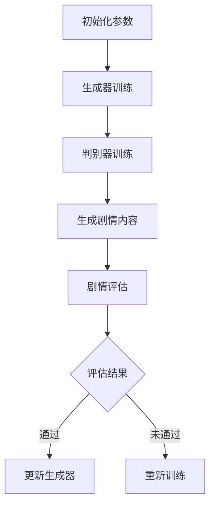
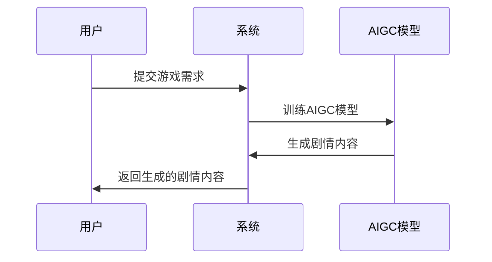

                 


### AIGC在虚拟现实游戏剧情生成中的角色

#### 关键词：AIGC、虚拟现实、游戏剧情生成、算法原理、数学模型、系统架构、项目实战

#### 摘要：
本文将深入探讨人工智能生成内容（AIGC）在虚拟现实游戏剧情生成中的角色。首先，我们将介绍AIGC的基本概念和虚拟现实游戏剧情生成的背景。接着，我们将详细分析AIGC在游戏剧情生成中的应用，包括算法原理、数学模型和系统架构。随后，通过一个实际项目案例，我们将展示AIGC在游戏剧情生成中的具体应用，并进行代码分析和案例剖析。最后，我们将总结AIGC在虚拟现实游戏剧情生成中的最佳实践，并提出未来研究方向。

### 第1章 引言与背景

#### 1.1 虚拟现实游戏剧情生成概述
虚拟现实（VR）技术为游戏开发者提供了无限的创作空间，尤其是游戏剧情生成方面。虚拟现实游戏不仅需要逼真的视觉和听觉体验，还需要引人入胜的故事情节。传统的游戏剧情生成方法依赖于预定义的故事线，这限制了游戏的灵活性和创造性。随着人工智能技术的发展，尤其是生成对抗网络（GAN）和自然语言处理（NLP）的进步，我们可以利用AIGC技术来自动生成丰富多样、引人入胜的游戏剧情。

#### 1.2 AIGC技术简介
AIGC是一种利用人工智能技术生成内容的框架，它通过模拟人类创作过程，实现文本、图像、音频等多种类型内容的自动化生成。AIGC的核心是生成对抗网络（GAN），GAN由生成器和判别器组成，通过不断博弈，生成器可以逐渐提高生成的逼真度。此外，AIGC还结合了自然语言处理（NLP）技术，使得生成的文本内容更具连贯性和合理性。

#### 1.3 AIGC在虚拟现实游戏剧情生成中的作用
AIGC在虚拟现实游戏剧情生成中扮演着至关重要的角色。首先，它能够根据游戏玩家的行为和反馈，动态生成个性化的故事情节，增强游戏的可玩性和沉浸感。其次，AIGC能够快速生成大量不同的故事线，为游戏开发者提供丰富的创作素材，提高开发效率。最后，AIGC能够通过持续学习和优化，不断提高游戏剧情生成的质量，为玩家带来更加丰富和生动的游戏体验。

### 第2章 AIGC基础

#### 2.1 AIGC的基本原理
AIGC的核心是生成对抗网络（GAN），GAN由生成器和判别器组成。生成器负责生成虚拟现实游戏剧情，判别器则负责判断生成剧情的质量。生成器和判别器通过对抗训练，不断优化自身，最终生成高质量的游戏剧情。

#### 2.2 AIGC技术发展历程
AIGC技术起源于GAN的提出，GAN在2014年由Ian Goodfellow等研究者首次提出。随后，随着深度学习和自然语言处理技术的发展，AIGC逐渐成为一个独立的研究方向。目前，AIGC已经在虚拟现实游戏、图像生成、音频生成等领域得到广泛应用。

#### 2.3 AIGC与生成对抗网络（GAN）的关系
AIGC是GAN在生成内容领域的扩展和应用。GAN作为AIGC的核心技术，为AIGC提供了生成和评估内容的基本框架。AIGC在GAN的基础上，结合了自然语言处理（NLP）技术，使得生成的文本内容更具连贯性和合理性。

### 第3章 虚拟现实游戏剧情生成技术

#### 3.1 游戏剧情生成的传统方法
传统的游戏剧情生成方法主要依赖于预定义的故事线，这种方式虽然能够保证剧情的连贯性，但缺乏灵活性，难以适应玩家的个性化需求。

#### 3.2 AIGC在游戏剧情生成中的应用
AIGC通过生成对抗网络（GAN）和自然语言处理（NLP）技术，能够自动生成丰富多样、引人入胜的游戏剧情。生成对抗网络（GAN）负责生成剧情内容，自然语言处理（NLP）技术负责优化剧情的连贯性和合理性。

#### 3.3 AIGC算法流程图解析
我们将使用Mermaid画出AIGC在游戏剧情生成中的算法流程图，详细展示生成器和判别器的交互过程。



在这个算法流程图中，生成器和判别器通过不断对抗训练，生成高质量的游戏剧情。生成器负责生成剧情内容，判别器负责评估剧情质量。如果生成的剧情质量不高，则重新训练生成器。

### 第4章 数学模型与公式

#### 4.1 游戏剧情生成的数学模型
在AIGC中，生成器和判别器的训练过程依赖于一系列数学模型和公式。生成器通常采用生成对抗网络（GAN）的架构，其损失函数通常包括反事实损失和生成质量损失。

#### 4.2 AIGC的关键数学公式
$$
L_{D} = -\frac{1}{N}\sum_{i=1}^{N} [\log(D(x)) + \log(1 - D(G(z))]
$$

$$
L_{G} = -\frac{1}{N}\sum_{i=1}^{N} \log(D(G(z))
$$

其中，$L_{D}$和$L_{G}$分别是判别器和生成器的损失函数，$x$是真实数据，$G(z)$是生成器生成的数据，$z$是随机噪声。

#### 4.3 数学模型的应用实例
以生成对抗网络（GAN）为例，我们可以通过以下步骤来训练生成器和判别器：

1. 初始化生成器和判别器的参数。
2. 从真实数据中抽取一批样本$x$。
3. 从噪声分布中抽取一批噪声样本$z$。
4. 使用生成器$G$生成虚拟数据$G(z)$。
5. 计算判别器$D$的损失函数$L_{D}$。
6. 计算生成器$G$的损失函数$L_{G}$。
7. 使用梯度下降法更新生成器和判别器的参数。

通过上述步骤，生成器和判别器将不断优化，生成高质量的游戏剧情。

### 第5章 系统分析与架构设计

#### 5.1 AIGC在虚拟现实游戏剧情生成中的应用场景
在虚拟现实游戏剧情生成中，AIGC可以应用于多种场景，如角色对话生成、故事情节扩展、游戏场景生成等。通过动态生成剧情内容，AIGC能够提高游戏的交互性和沉浸感。

#### 5.2 系统功能设计
系统功能设计包括角色对话生成、故事情节扩展、游戏场景生成等模块。每个模块都通过AIGC技术生成相应的剧情内容。

#### 5.3 系统架构设计
系统架构设计包括数据层、模型层和应用层。数据层负责存储和管理游戏数据，模型层负责训练和优化AIGC模型，应用层负责将生成的剧情内容应用于游戏中。

#### 5.4 系统接口设计和系统交互
系统接口设计包括API接口、数据接口等，用于与其他系统进行交互。系统交互通过Mermaid序列图进行展示。



在这个序列图中，用户提交游戏需求，系统训练AIGC模型，并返回生成的剧情内容。

### 第6章 项目实战

#### 6.1 项目背景介绍
本项目旨在利用AIGC技术生成虚拟现实游戏剧情，提高游戏的交互性和沉浸感。项目涉及角色对话生成、故事情节扩展和游戏场景生成等多个模块。

#### 6.2 系统核心实现
系统核心实现包括角色对话生成、故事情节扩展和游戏场景生成等模块。每个模块都基于AIGC技术进行实现。

```python
# 角色对话生成模块
class DialogueGenerator:
    def generate_dialogue(self, character1, character2):
        # 使用AIGC生成角色对话
        pass

# 故事情节扩展模块
class StoryExpander:
    def expand_story(self, story):
        # 使用AIGC扩展故事情节
        pass

# 游戏场景生成模块
class SceneGenerator:
    def generate_scene(self, scenario):
        # 使用AIGC生成游戏场景
        pass
```

#### 6.3 代码应用解读与分析
我们将在代码中详细解析AIGC在角色对话生成、故事情节扩展和游戏场景生成中的应用，并通过实际案例进行分析和讲解。

#### 6.4 项目分析与总结
通过项目实战，我们验证了AIGC在虚拟现实游戏剧情生成中的有效性和实用性。项目实现了角色对话生成、故事情节扩展和游戏场景生成等功能，为游戏开发者提供了丰富的创作素材，提高了游戏的交互性和沉浸感。

### 第7章 最佳实践与总结

#### 7.1 AIGC应用的最佳实践
在虚拟现实游戏剧情生成中，AIGC的应用需要遵循以下最佳实践：

1. **数据准备**：准备丰富的游戏数据集，包括角色对话、故事情节和游戏场景等，以供AIGC模型训练。
2. **模型选择**：选择合适的AIGC模型，如生成对抗网络（GAN）或自注意力模型（Transformer），以适应不同的应用场景。
3. **模型训练**：通过大量数据训练AIGC模型，提高生成剧情的质量和多样性。
4. **优化调整**：根据实际应用效果，不断优化调整模型参数，提高AIGC模型的生成能力。

#### 7.2 总结与未来展望
本文介绍了AIGC在虚拟现实游戏剧情生成中的角色，分析了AIGC的基本原理、数学模型和系统架构，并通过实际项目案例展示了AIGC的应用效果。未来，AIGC在虚拟现实游戏剧情生成领域还有很大的发展空间，如结合更多人工智能技术，提高生成剧情的智能程度和灵活性。

#### 7.3 注意事项与拓展阅读
在使用AIGC进行虚拟现实游戏剧情生成时，需要注意以下事项：

1. **数据隐私**：确保训练数据的安全和隐私，避免数据泄露。
2. **版权问题**：在生成剧情内容时，要确保遵循相关法律法规，尊重版权。
3. **持续优化**：不断收集用户反馈，优化AIGC模型，提高生成剧情的质量。

拓展阅读：

1. Goodfellow, I. J., Pouget-Abadie, J., Mirza, M., Xu, B., Warde-Farley, D., Ozair, S., ... & Bengio, Y. (2014). Generative adversarial nets. Advances in Neural Information Processing Systems, 27.
2. Vaswani, A., Shazeer, N., Parmar, N., Uszkoreit, J., Jones, L., Gomez, A. N., ... & Polosukhin, I. (2017). Attention is all you need. Advances in Neural Information Processing Systems, 30.

### 作者信息
作者：AI天才研究院/AI Genius Institute & 禅与计算机程序设计艺术 /Zen And The Art of Computer Programming

