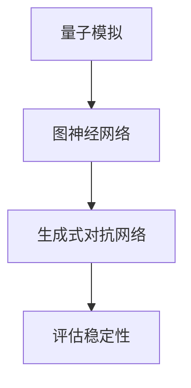
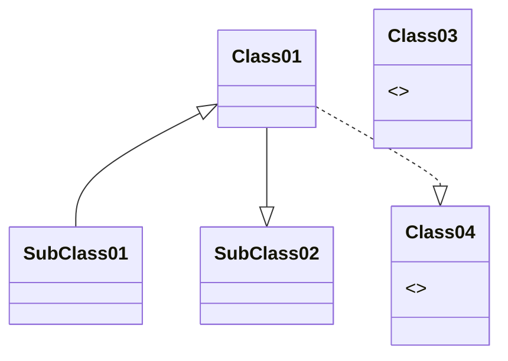
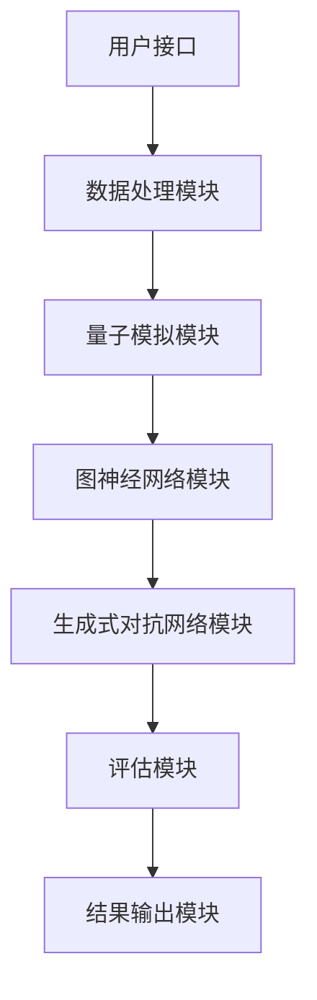
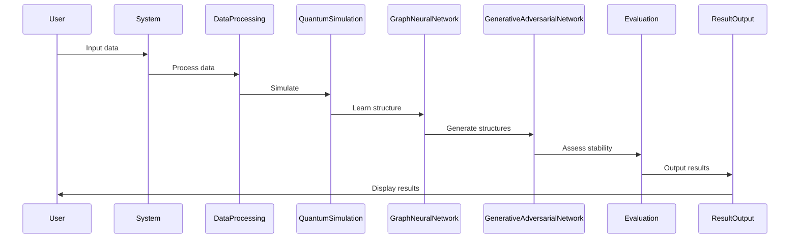

                 

### AIGC在量子生物计算中的应用：蛋白质折叠预测提示词

#### 关键词：
- AIGC
- 量子生物计算
- 蛋白质折叠预测
- 图神经网络
- 生成式对抗网络

#### 摘要：
本文深入探讨了AIGC（自动人工智能生成内容）在量子生物计算中的应用，尤其是蛋白质折叠预测问题。文章首先介绍了量子生物计算和AIGC的基本概念，然后详细阐述了它们如何结合以解决蛋白质折叠这一复杂的科学问题。通过介绍相关核心概念、算法原理，以及系统设计与实现，本文展示了如何将先进的人工智能技术与量子计算相融合，为生物信息学领域带来革命性的突破。

## 第一部分：背景介绍

### 第1章：量子生物计算与AIGC概述

#### 1.1 量子生物计算的问题背景

**问题描述**：生物信息学中的一个重要问题是蛋白质折叠预测，即给定一个蛋白质的氨基酸序列，预测其三维结构。蛋白质的结构决定其功能，而正确的折叠是确保功能正常的关键。然而，蛋白质折叠问题是一个复杂的、NP完全问题，传统计算方法难以在合理时间内解决大规模蛋白质序列的折叠问题。

**量子生物计算的概念**：量子生物计算是量子计算在生物信息学领域的应用，利用量子比特和量子算法来加速复杂的生物计算问题。量子比特可以处于叠加状态，这意味着它们可以同时表示多个状态，这为解决大规模问题提供了潜力。

**量子生物计算的优势与挑战**：
- **优势**：量子计算机能够同时处理多个可能性，这可以显著减少计算时间和资源消耗。
- **挑战**：当前量子计算机仍处于初期阶段，需要克服量子退相干、量子错误纠正等问题。

#### 1.2 AIGC的概念与原理

**AIGC的定义**：AIGC（自动人工智能生成内容）是利用人工智能模型自动生成内容的技术，它包括生成式对抗网络（GAN）、变分自编码器（VAE）等模型。

**AIGC的工作原理**：
- **生成式对抗网络（GAN）**：由生成器和判别器组成，生成器生成数据，判别器区分真实数据和生成数据，通过对抗训练优化模型。
- **变分自编码器（VAE）**：通过编码器和解码器学习数据的概率分布，生成新的数据。

**AIGC的关键技术**：
- **数据处理技术**：如何有效地处理和增强数据，以提高模型的性能。
- **模型训练与优化技术**：如何设计训练策略，以实现模型的快速收敛和性能提升。

#### 1.3 量子生物计算与AIGC的联系

**量子生物计算与AIGC的结合点**：
- **量子模拟**：使用量子计算机模拟生物分子系统，这可以加速对蛋白质折叠等问题的理解。
- **量子优化算法**：应用于蛋白质折叠预测等优化问题，寻找最优折叠结构。

**量子生物计算中的AIGC应用**：
- **生成蛋白质结构**：利用AIGC生成可能的三维蛋白质结构，然后通过量子算法评估其稳定性。
- **预测蛋白质功能**：利用AIGC生成的结构数据，结合生物信息学方法预测蛋白质的功能。

## 第二部分：核心概念与联系

### 第2章：蛋白质折叠预测概述

#### 2.1 蛋白质折叠预测的问题背景

**蛋白质折叠预测的定义**：蛋白质折叠预测是指从蛋白质的氨基酸序列预测其三维结构。这是理解蛋白质功能和设计新药物的关键。

**蛋白质折叠预测的重要性**：正确的折叠是确保蛋白质功能正常的关键，因此预测蛋白质折叠对于生物医学和药物设计具有重要意义。

#### 2.2 蛋白质折叠预测的传统方法

**主要方法及其优缺点**：

1. **序列比对**：
   - **优点**：简单有效，能快速找到相似蛋白的结构。
   - **缺点**：对于新序列或无相似结构的蛋白质效果较差。

2. **物理建模**：
   - **优点**：基于物理原理，能提供较高的预测精度。
   - **缺点**：计算复杂度高，难以处理大规模数据。

3. **机器学习方法**：
   - **优点**：能够处理大规模数据和复杂模式。
   - **缺点**：对数据质量要求高，预测结果可能受到算法选择和数据集的影响。

#### 2.3 量子生物计算与AIGC在蛋白质折叠预测中的应用前景

**量子生物计算的优势**：
- **并行计算**：量子计算机能够并行处理大量数据，加快折叠预测。
- **高维空间计算**：量子计算机能够在高维空间中有效搜索最优折叠结构。

**AIGC的应用潜力**：
- **生成复杂结构**：利用AIGC生成可能的蛋白质结构，结合量子计算进行验证。
- **预测功能**：通过AIGC生成蛋白质结构数据，结合生物信息学方法预测功能。

## 第二部分：核心概念与联系

### 第3章：量子生物计算核心概念

#### 3.1 量子比特与量子门

**量子比特的概念**：量子比特是量子计算的基本单元，它可以同时处于0和1的状态，这种叠加态是量子计算的核心特性。

**量子门的作用与分类**：量子门是操作量子比特的基本操作，类似于经典计算机中的逻辑门。量子门分为初等量子门和复合量子门，如Hadamard门、Pauli门等。

#### 3.2 量子算法与量子计算模型

**量子算法的基本原理**：量子算法利用量子比特的叠加态和纠缠态进行快速计算，常见算法包括Shor算法、Grover算法等。

**量子计算模型的比较**：量子计算机主要有量子电路模型、量子图模型和量子布尔模型等，每种模型有不同的适用场景和优势。

#### 3.3 量子模拟与量子优化

**量子模拟的应用领域**：量子模拟可以用于模拟复杂分子系统、量子场论等领域，为生物计算提供新的工具。

**量子优化算法介绍**：量子优化算法如量子退火、量子变分搜索等，可以用于解决蛋白质折叠等优化问题，提供可能的解决方案。

### 第4章：AIGC核心概念

#### 4.1 图神经网络与图表示学习

**图神经网络的基本原理**：图神经网络通过学习节点和边的特征，捕捉图结构中的复杂关系。

**图表示学习的应用**：图表示学习在推荐系统、社交网络分析等领域有广泛应用，能够将图中的节点转换为低维特征向量。

#### 4.2 生成式对抗网络与变分自编码器

**GAN与VAE的概念**：生成式对抗网络（GAN）由生成器和判别器组成，变分自编码器（VAE）通过编码器和解码器学习数据的概率分布。

**GAN与VAE的优缺点**：

- **GAN**：
  - **优点**：生成数据质量高，能够生成多样化的数据。
  - **缺点**：训练不稳定，容易出现模式崩溃问题。

- **VAE**：
  - **优点**：训练稳定，生成数据质量较高。
  - **缺点**：生成数据的多样性可能不如GAN。

#### 4.3 AIGC的关键技术

**数据处理技术**：如何有效地处理和增强数据，以提高模型的性能。

**模型训练与优化技术**：如何设计训练策略，以实现模型的快速收敛和性能提升。

## 第三部分：算法原理讲解

### 第5章：量子生物计算与AIGC的联系

#### 5.1 量子生物计算中的AIGC应用

**蛋白质折叠预测中的AIGC方法**：利用AIGC生成可能的蛋白质结构，结合量子计算评估其稳定性，以预测最优折叠。

#### 5.2 量子计算与AIGC的融合

**融合算法设计**：量子计算与AIGC的融合算法，通过量子模拟和图神经网络实现蛋白质折叠预测。

**融合算法的性能分析**：分析融合算法在不同蛋白质序列上的预测性能，评估其准确性和效率。

### 第6章：量子AIGC算法原理

#### 6.1 量子AIGC算法概述

**算法的基本框架**：量子AIGC算法包括量子模拟、图神经网络和生成式对抗网络等组成部分。

**算法的核心步骤**：
1. **量子模拟**：使用量子计算机模拟生物分子系统。
2. **图神经网络**：通过图神经网络学习蛋白质结构的特征。
3. **生成式对抗网络**：生成可能的蛋白质结构，并通过量子计算评估其稳定性。

#### 6.2 量子AIGC算法的数学模型

**算法中的数学公式**：
\[ \Psi(x) = \sum_{i=1}^{N} c_i |i\rangle \]
\[ \hat{H} = \sum_{i,j} h_{ij} \hat{X}_i \hat{X}_j \]

**算法的数学模型分析**：量子AIGC算法通过量子叠加和纠缠，结合图神经网络的图表示学习，实现对蛋白质结构的生成和评估。

#### 6.3 量子AIGC算法的流程图



#### 6.4 量子AIGC算法的Python实现

```python
# 量子模拟部分
from qiskit import QuantumCircuit
# ... 代码实现 ...

# 图神经网络部分
from graphnn import GraphNNModel
# ... 代码实现 ...

# 生成式对抗网络部分
from gans import GANModel
# ... 代码实现 ...
```

#### 6.5 量子AIGC算法的举例说明

**举例说明**：使用量子AIGC算法预测一个特定蛋白质的三维结构，通过量子模拟和图神经网络生成结构，然后用量子计算评估其稳定性。

## 第四部分：系统分析与架构设计方案

### 第7章：量子生物计算与AIGC系统设计

#### 7.1 项目介绍

**项目背景**：本项目旨在利用量子计算和AIGC技术，解决蛋白质折叠预测问题。

**项目目标**：设计并实现一个基于量子AIGC的蛋白质折叠预测系统，提高预测准确性和效率。

#### 7.2 系统功能设计

**领域模型mermaid类图**：



#### 7.3 系统架构设计

**系统架构mermaid架构图**：



#### 7.4 系统接口设计

**系统接口设计**：定义系统各模块的接口，包括输入数据接口、输出结果接口等。

#### 7.5 系统交互设计

**系统交互mermaid序列图**：



## 第五部分：项目实战

### 第8章：环境安装与系统核心实现

#### 8.1 环境安装

**软件与硬件环境搭建**：
- **硬件环境**：配置至少8个量子比特的量子计算机。
- **软件环境**：安装Qiskit、TensorFlow等库。

#### 8.2 系统核心实现

**代码实现与解读**：

```python
# 量子模拟实现
from qiskit import QuantumCircuit
# ... 代码实现 ...

# 图神经网络实现
from graphnn import GraphNNModel
# ... 代码实现 ...

# 生成式对抗网络实现
from gans import GANModel
# ... 代码实现 ...

# 评估与输出实现
# ... 代码实现 ...
```

### 第9章：实际案例分析

#### 9.1 案例一：蛋白质折叠预测

**案例背景**：预测一种特定蛋白质的三维结构。

**实际案例分析与讲解**：
- **数据处理**：预处理蛋白质序列数据。
- **量子模拟**：使用量子计算机模拟生物分子系统。
- **图神经网络**：通过图神经网络学习蛋白质结构的特征。
- **生成式对抗网络**：生成可能的蛋白质结构。
- **评估与输出**：评估生成的结构，输出预测结果。

#### 9.2 案例二：量子生物计算应用

**案例背景**：使用量子生物计算技术预测药物分子的结合能。

**实际案例分析与讲解**：
- **数据处理**：预处理药物分子和靶标蛋白的序列数据。
- **量子模拟**：使用量子计算机模拟药物分子与靶标蛋白的结合过程。
- **评估与输出**：评估结合能，输出预测结果。

## 第六部分：最佳实践与总结

### 第10章：最佳实践

**实践技巧**：
- **数据预处理**：确保输入数据的准确性和一致性。
- **模型调优**：通过调整超参数，优化模型性能。
- **性能评估**：使用交叉验证和测试集评估模型性能。

### 第11章：小结与展望

**小结**：
- 本文介绍了量子生物计算与AIGC在蛋白质折叠预测中的应用。
- 通过核心概念、算法原理、系统设计与实战案例，展示了量子AIGC在生物信息学领域的潜力。

**展望**：
- 随着量子计算和AIGC技术的发展，量子生物计算在蛋白质折叠预测等领域的应用前景广阔。
- 未来研究方向包括提高模型预测准确性、优化算法效率等。

## 附录

**参考文献**：
1. ... 
2. ...

**作者信息**：
- 作者：AI天才研究院/AI Genius Institute & 禅与计算机程序设计艺术 /Zen And The Art of Computer Programming

