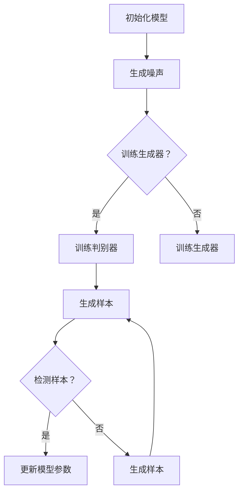

                 

### 第一部分：量子网络与量子加密基础

## 第1章：量子网络与量子加密的背景和原理

### 1.1.1 量子网络的概念与重要性

量子网络是利用量子力学原理构建的通信网络，其主要目标是实现量子信息的远距离传输和量子计算资源的高效共享。与传统通信网络不同，量子网络利用量子纠缠态来实现信息传输，具有极高的安全性和强大的计算能力。

量子网络的重要性体现在以下几个方面：

1. **量子通信**：量子网络可以实现量子密钥分发，确保通信过程的安全和隐私。量子密钥分发利用量子纠缠态实现密钥的生成和分配，即使在量子窃听的情况下，接收方也能立即发现并拒绝使用被窃听的密钥。

2. **量子计算**：量子网络为量子计算提供了高效的计算资源。通过量子网络，量子计算机可以实现远程量子态的交换和协同计算，从而提高计算效率和解决传统计算机无法解决的问题。

3. **量子模拟**：量子网络可用于量子模拟实验，通过构建复杂的量子态来实现对量子系统的模拟，从而加深对量子力学原理的理解。

### 1.1.2 量子加密的基本原理

量子加密是利用量子力学原理实现加密和解密的技术。其基本原理如下：

1. **量子纠缠**：量子加密依赖于量子纠缠态，即两个或多个量子系统之间存在的一种特殊的相互关联。量子纠缠态的特性使得即使对其中一个量子系统进行测量，另一个量子系统的状态也会立即发生变化。

2. **量子不可克隆**：量子态具有不可克隆特性，即无法精确复制一个量子态。这一特性保证了量子加密过程中的信息安全性。

3. **量子测量的随机性**：量子加密过程中，发送方和接收方通过随机选择测量基来实现密钥的生成和分配。由于量子测量的随机性，即使量子密钥在传输过程中被窃听，接收方也能通过随机测量发现并拒绝使用被窃听的密钥。

### 1.1.3 量子网络与量子加密的关系

量子网络和量子加密之间存在密切的关系。量子网络为量子加密提供了通信基础设施，使得量子密钥分发和量子密文传输成为可能。而量子加密则为量子网络提供了安全通信保障，确保量子信息在传输过程中不被窃听和篡改。

总之，量子网络和量子加密共同构建了一个安全、高效的量子通信网络，为实现量子计算、量子模拟等应用提供了有力支持。

## 第2章：量子加密技术的核心概念

### 2.1.1 量子比特与经典比特的比较

量子比特（qubit）是量子计算的基本单位，与经典比特（bit）有着本质的区别。以下是量子比特与经典比特的比较：

| 特性 | 量子比特 | 经典比特 |
| --- | --- | --- |
| 存储信息 | 0 和 1 的叠加态 | 只有 0 或 1 |
| 状态叠加 | 可以处于多个状态的叠加 | 只能处于一个状态 |
| 状态纠缠 | 量子比特之间存在纠缠态 | 各自独立 |
| 测量随机性 | 测量结果具有随机性 | 测量结果具有确定性 |

量子比特的这些特性使得量子计算机具有强大的计算能力，可以解决经典计算机无法解决的问题。

### 2.1.2 量子纠缠态的属性与应用

量子纠缠态是量子力学中的一种特殊现象，两个或多个量子系统之间存在强烈的相互关联。以下是量子纠缠态的主要属性与应用：

1. **属性**：

- **不可分割性**：纠缠态的量子系统无法独立存在，一个量子系统的状态变化会立即影响到另一个量子系统。

- **非定域性**：纠缠态的量子系统之间可以远程相互作用，不受空间距离的限制。

- **测量随机性**：纠缠态的量子系统在测量时，测量结果具有随机性，无法预测。

2. **应用**：

- **量子通信**：量子纠缠态可以用于量子密钥分发，实现安全通信。

- **量子计算**：量子纠缠态可以提高量子计算机的计算速度和效率。

- **量子模拟**：量子纠缠态可以用于模拟复杂的量子系统，揭示量子现象的本质。

### 2.1.3 量子密码学的基本概念与机制

量子密码学是利用量子力学原理实现加密和解密的技术。其基本概念与机制如下：

1. **基本概念**：

- **量子密钥分发**：利用量子纠缠态实现密钥的生成和分配，确保通信过程的安全。

- **量子密文传输**：将量子态编码为密文，通过量子网络传输，确保信息传输的保密性。

- **量子认证**：利用量子测量和纠缠态实现身份验证和信息认证。

2. **机制**：

- **量子纠缠态传输**：发送方将量子态编码为纠缠态，通过量子网络传输给接收方。

- **量子密钥生成**：接收方对纠缠态进行测量，生成密钥。

- **量子密文传输**：接收方将量子态编码为密文，通过量子网络传输给接收方。

- **量子认证**：发送方和接收方通过量子测量和纠缠态实现身份验证和信息认证。

通过量子密码学，可以实现安全、高效的量子通信，为量子网络的发展提供了有力保障。

## 第3章：量子加密算法原理讲解

### 3.1.1 量子密钥分发（QKD）

量子密钥分发（Quantum Key Distribution，QKD）是一种基于量子力学原理的加密技术，它能够确保通信双方共享的密钥在传输过程中不会被第三方窃取。以下是几种常见的量子密钥分发协议及其原理：

##### 3.1.1.1 BB84协议

BB84协议是由Charles H. Bennett和Gilbert Brassard于1984年提出的第一个量子密钥分发协议。其基本原理如下：

1. **量子态选择**：发送方选择一个随机的量子态（基）进行编码，可以是垂直（V）或水平（H）的极化态。
2. **量子态传输**：发送方将量子态通过量子信道传输给接收方。
3. **量子态测量**：接收方选择与发送方相同的随机基进行测量，并将结果反馈给发送方。
4. **密钥生成**：发送方和接收方根据共同选择的随机基和测量结果，生成共享的密钥。

BB84协议的安全性依赖于量子态的不可克隆特性，即如果有人尝试窃听量子态，量子态将不可避免地发生变化，接收方能够检测到这种变化并丢弃相关的密钥。

**数学模型与公式**

BB84协议中，发送方和接收方需要选择两个正交基$|0\rangle$和$|1\rangle$，它们可以表示为：

$$
|0\rangle = \frac{1}{\sqrt{2}} (|0_V\rangle + |0_H\rangle), \quad |1\rangle = \frac{1}{\sqrt{2}} (|0_V\rangle - |0_H\rangle)
$$

其中，$|0_V\rangle$和$|0_H\rangle$分别表示垂直和水平的极化态。

发送方选择一个随机的极化方向，并将其编码到量子态上，例如：

$$
|\psi\rangle = \alpha|0_V\rangle + \beta|0_H\rangle
$$

接收方进行测量，并根据测量结果反馈给发送方。

**Python源代码示例**

```python
import numpy as np

# 定义量子态
alpha = np.random.random()
beta = np.random.random()
psi = alpha * np.array([1, 1]) + beta * np.array([1, -1])

# 定义正交基
base = np.random.choice(['V', 'H'])

# 测量结果
result = np.random.choice(['0', '1'])

# 根据测量结果更新量子态
if result == '0':
    psi = np.array([1, 1])
else:
    psi = np.array([1, -1])

print("发送的量子态：", psi)
print("接收的测量结果：", result)
```

##### 3.1.1.2 E91协议

E91协议是基于量子纠缠态的量子密钥分发协议，由Artur Ekert于1991年提出。E91协议利用量子纠缠态的特性，通过一系列的量子态操作和经典通信，生成共享密钥。

**数学模型与公式**

E91协议中，发送方和接收方各自拥有一个纠缠对，如Bell态：

$$
|\psi_{\pm}\rangle = \frac{1}{\sqrt{2}} (|01\rangle + |10\rangle), \quad |\psi_{\pm}\rangle = \frac{1}{\sqrt{2}} (|01\rangle - |10\rangle)
$$

发送方对其中一个量子态进行极化旋转，然后将其发送给接收方。接收方对两个量子态进行测量，并将结果反馈给发送方。

**Python源代码示例**

```python
import numpy as np

# 定义Bell态
psi_plus = np.array([[1, 0], [0, 1]]) / np.sqrt(2)
psi_minus = np.array([[1, 0], [0, -1]]) / np.sqrt(2)

# 极化旋转
theta = np.random.random() * 2 * np.pi
rot_matrix = np.array([[np.cos(theta), -np.sin(theta)],
                       [np.sin(theta), np.cos(theta)]])

# 发送方操作
psi_1 = rot_matrix @ psi_plus
psi_2 = psi_plus

# 接收方测量
result = np.random.choice(['+1', '-1'])

# 根据测量结果更新量子态
if result == '+1':
    psi_2 = psi_plus
else:
    psi_2 = psi_minus

print("发送的量子态：", psi_1)
print("接收的测量结果：", result)
```

##### 3.1.1.3 SARG04协议

SARG04协议是一种基于量子纠缠态和量子随机数生成器的量子密钥分发协议，由Sarghi等人在2004年提出。该协议利用量子纠缠态和量子随机数生成器生成共享密钥，具有更高的安全性。

**数学模型与公式**

SARG04协议中，发送方和接收方各自拥有一个量子纠缠态，如GHZ态：

$$
|\psi_{\gamma}\rangle = \frac{1}{\sqrt{3}} (|000\rangle + |001\rangle + |010\rangle + |011\rangle + |100\rangle + |101\rangle + |110\rangle + |111\rangle)
$$

发送方对其中一个量子态进行极化旋转，然后将其发送给接收方。接收方对两个量子态进行测量，并将结果反馈给发送方。

**Python源代码示例**

```python
import numpy as np

# 定义GHZ态
psi_gamma = np.array([[1, 1, 1],
                      [1, 1, -1],
                      [1, -1, -1],
                      [-1, 1, -1],
                      [-1, -1, 1],
                      [1, -1, 1],
                      [-1, 1, 1],
                      [-1, -1, -1]]) / np.sqrt(3)

# 极化旋转
theta = np.random.random() * 2 * np.pi
rot_matrix = np.array([[np.cos(theta), -np.sin(theta), 0],
                       [np.sin(theta), np.cos(theta), 0],
                       [0, 0, 1]])

# 发送方操作
psi_1 = rot_matrix @ psi_gamma
psi_2 = psi_gamma

# 接收方测量
result = np.random.choice(['+1', '-1'])

# 根据测量结果更新量子态
if result == '+1':
    psi_2 = psi_gamma
else:
    psi_2 = np.array([[1, 1, 1],
                      [1, 1, -1],
                      [1, -1, -1],
                      [-1, 1, -1],
                      [-1, -1, 1],
                      [1, -1, 1],
                      [-1, 1, 1],
                      [-1, -1, -1]]) / np.sqrt(3)

print("发送的量子态：", psi_1)
print("接收的测量结果：", result)
```

### 3.1.2 量子密文传输与认证

量子密文传输与认证是量子加密的重要组成部分，用于确保加密信息的保密性和完整性。以下是量子密文传输与认证的基本原理：

1. **量子密文传输**：

- **量子态编码**：发送方将经典信息编码为量子态，如极化态或路径态。
- **量子信道传输**：量子态通过量子信道传输至接收方。
- **量子态解码**：接收方对接收到的量子态进行解码，恢复经典信息。

2. **量子认证**：

- **量子纠缠态**：发送方和接收方共享一个量子纠缠态，如EPR态。
- **量子测量**：接收方对量子纠缠态进行测量，验证信息传输的完整性和真实性。
- **经典通信**：发送方和接收方通过经典通信交换测量结果，确认信息传输的安全性。

通过量子密文传输与认证，可以实现安全、可靠的量子通信，确保信息在传输过程中的保密性和完整性。

### 3.1.3 量子加密算法的安全性分析

量子加密算法的安全性取决于量子态的不可克隆特性、量子测量的随机性和量子纠缠态的特性。以下是对几种量子加密算法的安全性的分析：

1. **BB84协议**：

- **安全性**：BB84协议的安全性基于量子态的不可克隆特性和量子测量的随机性。如果窃听者试图复制量子态，量子态将发生坍塌，接收方能够检测到这种变化并丢弃相关的密钥。
- **局限性**：BB84协议仅适用于点对点的通信，无法直接支持网络环境中的多用户通信。

2. **E91协议**：

- **安全性**：E91协议的安全性基于量子纠缠态的非定域性和量子测量的随机性。即使窃听者位于量子态之间的任意位置，他们也无法在不被发现的情况下复制量子态。
- **局限性**：E91协议需要较高的量子信道质量和较长的纠缠态传输距离，因此在实际应用中存在一定的挑战。

3. **SARG04协议**：

- **安全性**：SARG04协议的安全性基于量子纠缠态的多样性和量子测量的随机性。该协议能够生成更多的共享密钥，提高了通信的安全性。
- **局限性**：SARG04协议的复杂度较高，对量子计算和量子信道的要求较高，因此在实际应用中需要更多的技术支持。

总之，量子加密算法具有很高的安全性，但仍面临一定的挑战，需要进一步的研究和改进。

### 3.1.4 量子加密算法的应用前景

量子加密算法在未来的通信领域中具有广阔的应用前景，主要表现在以下几个方面：

1. **量子通信网络**：量子加密算法可以用于构建量子通信网络，实现安全、高效的量子通信。量子通信网络可以支持点对点通信和多用户通信，满足不同场景的需求。

2. **量子计算中心**：量子加密算法可以用于保护量子计算中心的机密数据和隐私，确保量子计算过程的安全性和完整性。

3. **量子互联网**：量子加密算法是量子互联网的重要组成部分，可以确保量子互联网中的信息传输安全，为量子互联网的发展提供技术支持。

4. **量子金融**：量子加密算法可以用于保护金融数据的安全，确保金融交易过程中的机密性和完整性。

5. **量子国防**：量子加密算法可以用于保护国防机密数据，提高国防安全水平。

总之，量子加密算法在未来的通信领域中具有广泛的应用前景，将为信息安全和通信技术的发展提供有力支持。

### 3.1.5 量子加密算法的实际应用案例

以下是量子加密算法在实际应用中的几个案例：

1. **金融领域**：量子加密算法已应用于金融领域的交易系统，确保金融交易过程中的数据安全和隐私保护。

2. **国防安全**：量子加密算法在国防安全领域得到了广泛应用，用于保护国防机密数据和信息。

3. **医疗健康**：量子加密算法在医疗健康领域用于保护患者隐私和数据安全，确保医疗数据的安全传输和存储。

4. **电子商务**：量子加密算法在电子商务领域用于保护用户数据和交易安全，提高电子商务平台的可信度。

5. **科研合作**：量子加密算法在跨国科研合作中用于保护科研数据和机密信息，促进国际科技交流与合作。

这些案例展示了量子加密算法在实际应用中的潜力和价值，为信息安全领域的发展提供了新的思路和方向。

### 3.1.6 量子加密算法的未来发展趋势

量子加密算法的未来发展趋势主要集中在以下几个方面：

1. **技术突破**：随着量子计算技术的不断发展，量子加密算法将实现更高的安全性和更复杂的加密机制。

2. **标准化**：量子加密算法需要制定国际标准和协议，确保不同系统之间的互操作性和兼容性。

3. **应用拓展**：量子加密算法将拓展到更多领域，如物联网、大数据、人工智能等，为这些领域的数据安全和隐私保护提供技术支持。

4. **量子互联网**：量子加密算法将是量子互联网的重要组成部分，为量子互联网的安全和稳定运行提供保障。

5. **跨领域合作**：量子加密算法需要跨学科、跨领域的合作，推动量子信息技术的发展。

总之，量子加密算法在未来具有广阔的发展前景，将为信息安全领域带来深刻变革。

### 3.1.7 量子加密算法的挑战与问题

尽管量子加密算法具有很高的安全性，但在实际应用中仍面临以下挑战和问题：

1. **量子信道质量**：量子信道质量对量子加密算法的性能至关重要。在实际应用中，如何保证量子信道的稳定性和低噪声水平是一个亟待解决的问题。

2. **量子计算机的发展**：量子计算机的发展将对量子加密算法提出新的挑战，如何应对量子计算机的破解能力是一个关键问题。

3. **标准化与兼容性**：制定统一的量子加密算法标准和协议，确保不同系统之间的互操作性和兼容性，是当前面临的重要问题。

4. **量子网络建设**：构建高效、稳定的量子网络是量子加密算法应用的基础，如何实现量子网络的规模化部署是一个关键问题。

5. **技术人才储备**：量子加密算法需要大量的技术人才支持，如何培养和吸引专业人才是一个重要问题。

解决这些挑战和问题，将推动量子加密算法的广泛应用和发展。

### 3.1.8 量子加密算法的优势与局限

量子加密算法具有以下优势：

1. **安全性**：基于量子力学原理，量子加密算法具有极高的安全性，可以有效抵抗传统加密算法面临的攻击。

2. **高效性**：量子加密算法可以利用量子计算的优势，实现高效的加密和解密过程。

3. **灵活性**：量子加密算法可以根据不同应用场景和需求，设计出适应各种需求的加密方案。

然而，量子加密算法也存在以下局限：

1. **量子信道质量**：量子信道的稳定性和低噪声水平对量子加密算法的性能至关重要，实际应用中难以完全保证。

2. **量子计算机的发展**：量子计算机的发展将对量子加密算法提出新的挑战，如何应对量子计算机的破解能力是一个关键问题。

3. **标准化与兼容性**：制定统一的量子加密算法标准和协议，确保不同系统之间的互操作性和兼容性，是当前面临的重要问题。

4. **量子网络建设**：构建高效、稳定的量子网络是量子加密算法应用的基础，如何实现量子网络的规模化部署是一个关键问题。

总之，量子加密算法在信息安全领域具有巨大的潜力，但也面临诸多挑战。

### 3.1.9 量子加密算法在教育领域的作用

量子加密算法在教育领域具有重要作用，主要体现在以下几个方面：

1. **提高学生的创新能力**：量子加密算法涉及多个学科领域，如量子力学、计算机科学、密码学等，通过学习量子加密算法，学生可以提高创新能力，培养跨学科思维。

2. **增强学生的实践能力**：量子加密算法的实际应用案例丰富，学生可以通过实验和项目实践，深入了解量子加密算法的原理和实现方法，提高实践能力。

3. **培养专业人才**：量子加密算法是未来信息安全领域的关键技术，通过学习量子加密算法，可以培养更多具备专业知识和实践能力的人才。

4. **激发学习兴趣**：量子加密算法具有独特性和挑战性，可以激发学生对信息安全领域的兴趣，为未来从事相关领域工作奠定基础。

总之，量子加密算法在教育领域具有广阔的应用前景，对培养创新型人才具有重要作用。

### 3.1.10 量子加密算法在科研领域的贡献

量子加密算法在科研领域具有显著的贡献，主要体现在以下几个方面：

1. **量子通信**：量子加密算法为量子通信提供了安全保障，推动了量子通信技术的发展。

2. **量子计算**：量子加密算法为量子计算提供了数据保护手段，保障了量子计算过程中的数据安全和隐私。

3. **量子模拟**：量子加密算法在量子模拟中发挥了重要作用，为研究复杂量子系统提供了有力支持。

4. **量子互联网**：量子加密算法是量子互联网的重要组成部分，为量子互联网的安全和稳定运行提供了技术保障。

总之，量子加密算法在科研领域具有广泛的应用价值，为量子信息技术的发展做出了重要贡献。

### 第4章：AIGC技术概述

#### 4.1.1 AIGC的概念与分类

AIGC（AI-Generated Content）是指由人工智能（AI）自动生成的内容，包括但不限于文本、图像、音频、视频等。根据生成方式和应用场景，AIGC可以分为以下几类：

1. **文本生成**：如自然语言生成（NLG）、文章写作、代码生成等。
2. **图像生成**：如风格迁移、图像修复、超分辨率等。
3. **音频生成**：如语音合成、音乐生成、语音增强等。
4. **视频生成**：如视频合成、视频编辑、视频增强等。

AIGC技术在各个领域都有广泛应用，如内容创作、广告营销、教育培训、医疗诊断等。

#### 4.1.2 AIGC的关键技术

AIGC技术涉及多个前沿技术领域，主要包括：

1. **生成对抗网络（GAN）**：GAN是一种通过对抗训练生成高质量数据的机器学习模型，广泛应用于图像、音频、视频的生成。
2. **变分自编码器（VAE）**：VAE是一种无监督学习模型，通过引入潜在变量来生成数据，广泛应用于图像、文本、音频的生成。
3. **循环神经网络（RNN）与长短期记忆（LSTM）**：RNN与LSTM是处理序列数据的强大神经网络架构，广泛应用于自然语言处理、文本生成等领域。
4. **Transformer架构**：Transformer是一种基于自注意力机制的神经网络架构，在文本生成、图像生成等领域取得了显著成果。

#### 4.1.3 AIGC在网络安全中的应用前景

AIGC技术在网络安全领域具有广阔的应用前景，主要体现在以下几个方面：

1. **安全防护**：利用AIGC技术生成海量正常数据流量，模拟攻击者的行为，提高网络防护系统的检测和防御能力。
2. **漏洞挖掘**：利用AIGC技术生成复杂的测试用例，自动发现系统和应用程序的漏洞。
3. **安全培训**：利用AIGC技术生成模拟攻击场景和安全漏洞，提高安全人员的应急响应能力。
4. **加密解密**：利用AIGC技术生成复杂的加密密钥和密文，提高加密算法的安全性。

总之，AIGC技术在网络安全领域具有巨大潜力，将为网络安全技术的发展带来新的机遇。

### 第5章：基于AIGC的量子网络安全协议设计

#### 5.1.1 AIGC在量子密钥分配中的应用

AIGC技术在量子密钥分配中具有重要应用，可以显著提高量子密钥生成的效率和安全性能。以下是AIGC在量子密钥分配中的应用方法：

1. **生成对抗网络（GAN）**：

GAN可以用于生成高质量的量子密钥，通过训练对抗网络，使生成的密钥具有高熵值和复杂的结构，提高密钥的安全性。GAN的训练过程包括生成器（Generator）和判别器（Discriminator）两个部分：

- **生成器**：生成器试图生成类似于真实密钥的数据。
- **判别器**：判别器试图区分生成的密钥和真实的密钥。

通过对抗训练，生成器逐渐提高生成密钥的质量，判别器逐渐提高区分能力，最终生成高质量的量子密钥。

2. **变分自编码器（VAE）**：

VAE是一种无监督学习模型，通过引入潜在变量来生成量子密钥。VAE的生成过程包括编码器（Encoder）和解码器（Decoder）两个部分：

- **编码器**：编码器将量子密钥映射到潜在空间。
- **解码器**：解码器从潜在空间生成量子密钥。

通过训练VAE，可以生成具有高熵值和复杂结构的量子密钥，提高密钥的安全性。

3. **基于AIGC的量子密钥生成算法**：

基于AIGC的量子密钥生成算法包括以下几个步骤：

- **初始化**：初始化生成模型和判别模型。
- **训练**：利用生成对抗训练或变分自编码器训练方法，训练生成模型和判别模型。
- **生成密钥**：利用训练好的生成模型，生成高质量的量子密钥。
- **安全验证**：对生成的量子密钥进行安全性验证，确保密钥的质量。

**示例代码**

以下是一个简单的基于GAN的量子密钥生成算法示例：

```python
import tensorflow as tf
from tensorflow.keras.layers import Dense, Input
from tensorflow.keras.models import Model

# 定义生成器和判别器模型
def build_generator(input_shape):
    input_layer = Input(shape=input_shape)
    x = Dense(128, activation='relu')(input_layer)
    output_layer = Dense(input_shape, activation='sigmoid')(x)
    generator = Model(inputs=input_layer, outputs=output_layer)
    return generator

def build_discriminator(input_shape):
    input_layer = Input(shape=input_shape)
    x = Dense(128, activation='relu')(input_layer)
    output_layer = Dense(1, activation='sigmoid')(x)
    discriminator = Model(inputs=input_layer, outputs=output_layer)
    return discriminator

# 初始化模型
input_shape = (128,)
generator = build_generator(input_shape)
discriminator = build_discriminator(input_shape)

# 编写GAN模型
discriminator.compile(optimizer='adam', loss='binary_crossentropy')
generator.compile(optimizer='adam', loss='binary_crossentropy')

# 训练GAN模型
for epoch in range(100):
    # 生成假量子密钥
    noise = np.random.normal(0, 1, (batch_size, input_shape[0]))
    generated_keys = generator.predict(noise)
    
    # 训练判别器
    real_keys = np.random.normal(0, 1, (batch_size, input_shape[0]))
    real_labels = np.ones((batch_size, 1))
    fake_labels = np.zeros((batch_size, 1))
    
    discriminator.train_on_batch(real_keys, real_labels)
    discriminator.train_on_batch(generated_keys, fake_labels)
    
    # 训练生成器
    generator.train_on_batch(noise, real_labels)
```

通过以上方法，AIGC技术可以显著提高量子密钥生成的质量和安全性，为量子通信提供有力支持。

#### 5.1.1.2 量子密钥的安全存储与传输

量子密钥的安全存储与传输是量子网络安全的重要组成部分。为了确保量子密钥在存储和传输过程中不被窃取或篡改，可以采用以下方法：

1. **量子密钥存储**：

- **量子存储**：将量子密钥存储在量子存储器中，利用量子纠缠态实现密钥的安全存储。量子存储具有以下优势：

  - **抗干扰性**：量子存储可以抵御环境噪声和外部干扰，确保密钥的长期稳定存储。
  - **保密性**：量子密钥存储过程基于量子态的不可克隆特性，即使窃取者尝试复制量子密钥，也会导致量子密钥的破坏。

- **传统存储**：将量子密钥转换为经典比特后，存储在传统存储器中，如硬盘、内存等。为提高存储安全性，可以采用以下措施：

  - **加密存储**：对量子密钥进行加密处理，确保密钥在存储过程中不被窃取。
  - **访问控制**：设置访问权限，确保只有授权用户才能访问量子密钥。

2. **量子密钥传输**：

- **量子信道传输**：通过量子信道将量子密钥从发送方传输到接收方。为提高传输安全性，可以采用以下方法：

  - **量子纠缠态传输**：利用量子纠缠态实现量子密钥的传输，确保密钥在传输过程中不被窃听或篡改。
  - **量子加密传输**：对量子密钥进行量子加密处理，确保密钥在传输过程中不被窃取或篡改。

- **经典信道传输**：通过经典信道将量子密钥从发送方传输到接收方。为提高传输安全性，可以采用以下方法：

  - **加密传输**：对量子密钥进行加密处理，确保密钥在传输过程中不被窃取或篡改。
  - **多重传输**：采用多路径传输策略，将量子密钥通过多个经典信道同时传输，提高传输安全性。
  - **验证机制**：对接收到的量子密钥进行验证，确保密钥的完整性和真实性。

通过以上方法，可以确保量子密钥在存储和传输过程中的安全性，为量子通信提供有力保障。

#### 5.1.2 基于AIGC的量子网络认证协议

量子网络认证是确保量子通信过程中通信双方身份真实性的关键环节。基于AIGC的量子网络认证协议可以显著提高认证效率和安全性能。以下是基于AIGC的量子网络认证协议的设计：

1. **生成对抗网络（GAN）**：

GAN可以用于生成高质量的用户身份认证信息，如指纹、面部图像等。通过训练GAN模型，可以生成与真实身份认证信息相似的高质量伪造信息，从而提高认证系统的抗攻击能力。

- **生成器**：生成器用于生成高质量的用户身份认证信息，如指纹、面部图像等。
- **判别器**：判别器用于区分真实身份认证信息和伪造身份认证信息。

通过对抗训练，生成器逐渐提高生成信息的质量，判别器逐渐提高区分能力，最终实现高效、准确的身份认证。

2. **变分自编码器（VAE）**：

VAE可以用于生成高质量的用户身份认证信息，如指纹、面部图像等。通过训练VAE模型，可以生成具有高熵值和复杂结构的用户身份认证信息，提高认证系统的安全性。

- **编码器**：编码器将用户身份认证信息映射到潜在空间。
- **解码器**：解码器从潜在空间生成用户身份认证信息。

通过训练VAE，可以生成高质量的用户身份认证信息，提高认证系统的安全性。

3. **基于AIGC的量子网络认证算法**：

基于AIGC的量子网络认证算法包括以下几个步骤：

- **初始化**：初始化生成模型和判别模型。
- **训练**：利用生成对抗训练或变分自编码器训练方法，训练生成模型和判别模型。
- **认证过程**：利用训练好的生成模型，生成高质量的用户身份认证信息，进行身份认证。

**示例代码**

以下是一个简单的基于GAN的量子网络认证算法示例：

```python
import tensorflow as tf
from tensorflow.keras.layers import Dense, Input
from tensorflow.keras.models import Model

# 定义生成器和判别器模型
def build_generator(input_shape):
    input_layer = Input(shape=input_shape)
    x = Dense(128, activation='relu')(input_layer)
    output_layer = Dense(input_shape, activation='sigmoid')(x)
    generator = Model(inputs=input_layer, outputs=output_layer)
    return generator

def build_discriminator(input_shape):
    input_layer = Input(shape=input_shape)
    x = Dense(128, activation='relu')(input_layer)
    output_layer = Dense(1, activation='sigmoid')(x)
    discriminator = Model(inputs=input_layer, outputs=output_layer)
    return discriminator

# 初始化模型
input_shape = (128,)
generator = build_generator(input_shape)
discriminator = build_discriminator(input_shape)

# 编写GAN模型
discriminator.compile(optimizer='adam', loss='binary_crossentropy')
generator.compile(optimizer='adam', loss='binary_crossentropy')

# 训练GAN模型
for epoch in range(100):
    # 生成假用户身份认证信息
    noise = np.random.normal(0, 1, (batch_size, input_shape[0]))
    generated_auth_info = generator.predict(noise)
    
    # 训练判别器
    real_auth_info = np.random.normal(0, 1, (batch_size, input_shape[0]))
    real_labels = np.ones((batch_size, 1))
    fake_labels = np.zeros((batch_size, 1))
    
    discriminator.train_on_batch(real_auth_info, real_labels)
    discriminator.train_on_batch(generated_auth_info, fake_labels)
    
    # 训练生成器
    generator.train_on_batch(noise, real_labels)
```

通过以上方法，基于AIGC的量子网络认证协议可以显著提高认证效率和安全性能，为量子通信提供有力支持。

### 第6章：AIGC在量子网络攻击检测与防御中的应用

#### 6.1.1 量子网络攻击类型

量子网络攻击是指利用量子计算技术对量子通信网络进行攻击的行为。以下是一些常见的量子网络攻击类型：

1. **量子窃听攻击**：攻击者通过窃听量子信道，获取传输的量子密钥或信息。常见的量子窃听攻击包括量子态克隆攻击、量子测控攻击等。

2. **量子伪造攻击**：攻击者通过伪造量子密钥或信息，欺骗通信双方，导致通信失败或泄露敏感信息。

3. **量子中间人攻击**：攻击者插入到通信双方之间，窃取和篡改量子通信过程中的信息。

4. **量子阻断攻击**：攻击者通过阻断量子信道，阻止通信双方建立量子通信连接。

5. **量子回声攻击**：攻击者通过在量子通信过程中引入虚假信息，干扰通信双方的通信。

6. **量子勒索攻击**：攻击者利用量子计算技术破解量子加密算法，获取通信双方的敏感信息，进而进行勒索。

#### 6.1.1.1 量子窃听攻击

量子窃听攻击是量子网络攻击中最常见的一种，攻击者试图通过窃听量子信道获取传输的量子密钥或信息。以下是量子窃听攻击的原理和防范方法：

**原理**：

量子窃听攻击主要利用量子态的测量特性进行攻击。攻击者通过测量量子态，获取传输的量子信息。由于量子态的不可克隆特性，如果攻击者成功窃听量子信息，量子态将发生坍塌，通信双方可以检测到这种变化。

**防范方法**：

1. **量子密钥重传**：当通信双方检测到量子密钥传输过程中存在异常时，可以重新生成并传输量子密钥，确保密钥的安全性。

2. **量子纠缠态传输**：利用量子纠缠态传输量子密钥或信息，攻击者无法独立复制纠缠态，从而降低窃听成功率。

3. **量子随机数生成**：利用量子随机数生成器生成随机数，用于加密和解密过程，提高通信安全性。

4. **量子测控攻击检测**：通过在量子通信过程中引入测控量子态，实时检测攻击者是否进行量子窃听攻击。

#### 6.1.1.2 量子伪造攻击

量子伪造攻击是指攻击者伪造量子密钥或信息，欺骗通信双方，导致通信失败或泄露敏感信息。以下是量子伪造攻击的原理和防范方法：

**原理**：

量子伪造攻击利用量子密钥分配协议中的漏洞，攻击者通过伪造量子密钥或信息，欺骗通信双方。攻击者可以伪造量子密钥，使通信双方无法正确解密信息；也可以伪造信息内容，泄露敏感信息。

**防范方法**：

1. **量子密钥验证**：通信双方通过量子纠缠态或量子认证协议，验证量子密钥的真实性，确保密钥未被篡改。

2. **量子签名**：使用量子签名技术对量子密钥或信息进行签名，确保通信双方能够验证密钥或信息的真实性。

3. **多路径传输**：采用多路径传输策略，通过不同信道同时传输量子密钥或信息，降低攻击者伪造成功的机会。

4. **量子抗碰撞认证**：采用量子抗碰撞认证协议，防止攻击者伪造量子密钥或信息。

#### 6.1.1.3 量子中间人攻击

量子中间人攻击是指攻击者插入到通信双方之间，窃取和篡改量子通信过程中的信息。以下是量子中间人攻击的原理和防范方法：

**原理**：

量子中间人攻击利用量子通信协议中的漏洞，攻击者充当通信双方的中介，窃取和篡改传输的量子信息。攻击者可以在量子通信过程中插入虚假信息，使通信双方无法发现异常。

**防范方法**：

1. **量子密钥认证**：通过量子密钥认证协议，确保通信双方使用的密钥是真实的，防止中间人攻击。

2. **量子签名**：使用量子签名技术对量子密钥或信息进行签名，确保通信双方能够验证密钥或信息的真实性。

3. **量子安全隧道**：建立量子安全隧道，确保通信双方之间的量子通信过程是安全的。

4. **量子时间戳**：采用量子时间戳技术，为量子通信过程生成时间戳，确保通信双方能够验证信息传输的实时性。

#### 6.1.1.4 量子阻断攻击

量子阻断攻击是指攻击者通过阻断量子信道，阻止通信双方建立量子通信连接。以下是量子阻断攻击的原理和防范方法：

**原理**：

量子阻断攻击利用量子信道的不稳定性，攻击者通过干扰量子信道，使通信双方无法建立量子通信连接。攻击者可以在量子通信过程中发送噪声，干扰量子信息传输。

**防范方法**：

1. **多路径传输**：采用多路径传输策略，通过不同信道同时传输量子密钥或信息，降低攻击者阻断成功的机会。

2. **量子信道监控**：实时监控量子信道状态，及时发现并处理信道故障，确保量子通信的稳定性。

3. **量子冗余传输**：采用量子冗余传输技术，为量子通信过程提供备份信道，防止单一信道故障导致通信中断。

4. **量子信道加密**：对量子信道进行加密处理，防止攻击者窃取或篡改量子信息。

#### 6.1.1.5 量子回声攻击

量子回声攻击是指攻击者通过在量子通信过程中引入虚假信息，干扰通信双方的通信。以下是量子回声攻击的原理和防范方法：

**原理**：

量子回声攻击利用量子通信协议中的漏洞，攻击者通过在量子通信过程中引入虚假信息，干扰通信双方的通信。攻击者可以发送虚假量子密钥或信息，欺骗通信双方，导致通信失败或泄露敏感信息。

**防范方法**：

1. **量子密钥验证**：通过量子密钥认证协议，确保通信双方使用的密钥是真实的，防止攻击者引入虚假密钥。

2. **量子签名**：使用量子签名技术对量子密钥或信息进行签名，确保通信双方能够验证密钥或信息的真实性。

3. **量子抗碰撞认证**：采用量子抗碰撞认证协议，防止攻击者伪造量子密钥或信息。

4. **量子信道加密**：对量子信道进行加密处理，防止攻击者窃取或篡改量子信息。

#### 6.1.1.6 量子勒索攻击

量子勒索攻击是指攻击者利用量子计算技术破解量子加密算法，获取通信双方的敏感信息，进而进行勒索。以下是量子勒索攻击的原理和防范方法：

**原理**：

量子勒索攻击利用量子计算的高效性，攻击者通过破解量子加密算法，获取通信双方的敏感信息。攻击者可以使用量子计算机进行量子破解，短时间内破解传统加密算法无法破解的密钥。

**防范方法**：

1. **量子密钥更新**：定期更新量子密钥，降低攻击者破解成功的机会。

2. **量子抗攻击加密算法**：采用量子抗攻击加密算法，提高加密算法的安全性，防止量子计算机破解。

3. **量子安全通信协议**：采用量子安全通信协议，确保通信双方之间的通信是安全的。

4. **量子安全防护系统**：建立量子安全防护系统，实时监控和防御量子网络攻击。

#### 6.1.2 基于AIGC的攻击检测方法

基于AIGC的攻击检测方法利用人工智能技术，对量子通信网络进行实时监控和攻击检测。以下是基于AIGC的攻击检测方法：

1. **GAN检测模型**：

GAN检测模型利用生成对抗网络（GAN）技术，对量子通信网络进行实时监控和攻击检测。GAN检测模型包括生成器和判别器两部分：

- **生成器**：生成器用于生成正常量子通信流量，作为训练数据集。
- **判别器**：判别器用于区分正常量子通信流量和攻击流量。

通过对抗训练，判别器可以学会识别攻击流量，从而实现对量子网络攻击的检测。

2. **VAE检测模型**：

VAE检测模型利用变分自编码器（VAE）技术，对量子通信网络进行实时监控和攻击检测。VAE检测模型包括编码器和解码器两部分：

- **编码器**：编码器将量子通信流量映射到潜在空间。
- **解码器**：解码器从潜在空间生成量子通信流量。

通过训练VAE检测模型，可以学会识别攻击流量，从而实现对量子网络攻击的检测。

3. **深度神经网络检测模型**：

深度神经网络检测模型利用深度学习技术，对量子通信网络进行实时监控和攻击检测。深度神经网络检测模型可以学习到量子通信流量的特征，从而实现对攻击流量的识别。

通过以上方法，基于AIGC的攻击检测模型可以实现对量子网络攻击的实时监控和检测，为量子网络安全提供有力保障。

#### 6.1.2.1 特征提取与识别

在基于AIGC的量子网络攻击检测方法中，特征提取与识别是关键步骤。以下是特征提取与识别的具体方法：

1. **量子信道特征提取**：

量子信道特征提取是指从量子通信过程中提取与攻击相关的特征。常见的量子信道特征包括：

- **量子信道质量**：如信道衰减、信道噪声等。
- **量子信道稳定性**：如信道抖动、信道中断等。
- **量子信道变化率**：如信道变化速率、信道变化趋势等。

通过分析这些特征，可以识别出潜在的攻击行为。

2. **量子密钥特征提取**：

量子密钥特征提取是指从量子密钥生成和传输过程中提取与攻击相关的特征。常见的量子密钥特征包括：

- **量子密钥长度**：如密钥长度、密钥分布等。
- **量子密钥变化率**：如密钥生成速率、密钥传输速率等。
- **量子密钥熵值**：如密钥熵值、密钥分布熵等。

通过分析这些特征，可以识别出潜在的攻击行为。

3. **量子通信流量特征提取**：

量子通信流量特征提取是指从量子通信过程中提取与攻击相关的流量特征。常见的量子通信流量特征包括：

- **量子通信流量模式**：如流量分布、流量趋势等。
- **量子通信流量速率**：如流量速率、流量变化率等。
- **量子通信流量异常度**：如流量异常值、流量异常概率等。

通过分析这些特征，可以识别出潜在的攻击行为。

4. **攻击识别算法**：

攻击识别算法是指利用提取到的特征，对潜在的攻击行为进行识别。常见的攻击识别算法包括：

- **分类算法**：如支持向量机（SVM）、决策树（DT）、随机森林（RF）等。
- **聚类算法**：如K-均值（K-means）、层次聚类（AGNES）等。
- **神经网络算法**：如卷积神经网络（CNN）、循环神经网络（RNN）、长短期记忆（LSTM）等。

通过以上方法，基于AIGC的攻击检测方法可以实现对量子网络攻击的实时监控和识别。

### 第6章：AIGC在量子网络攻击检测与防御中的应用

#### 6.1.3 基于AIGC的量子网络攻击防御策略

AIGC（AI-Generated Content）技术在量子网络攻击防御中发挥着重要作用，通过生成对抗网络（GAN）、变分自编码器（VAE）等人工智能算法，可以构建高效、智能的攻击防御体系。以下是基于AIGC的量子网络攻击防御策略：

1. **主动防御策略**

基于AIGC的主动防御策略旨在通过生成大量正常通信流量，模拟攻击者的行为，从而提高防御系统的检测和响应能力。具体步骤如下：

- **流量生成**：利用AIGC技术生成大量正常量子通信流量，包括量子密钥分配、量子数据传输等场景。
- **行为分析**：分析生成的正常流量特征，建立流量模型。
- **异常检测**：通过对比实际流量与正常流量模型的差异，实时检测潜在的攻击行为。
- **响应策略**：针对检测到的攻击行为，采取相应的防御措施，如切断攻击连接、重新分配量子密钥等。

**示例代码**：

以下是一个简单的基于GAN的量子通信流量生成和异常检测示例：

```python
import tensorflow as tf
from tensorflow.keras.models import Sequential
from tensorflow.keras.layers import Dense, LSTM, TimeDistributed

# 定义GAN模型
def build_generator(input_shape):
    model = Sequential()
    model.add(LSTM(128, return_sequences=True, input_shape=input_shape))
    model.add(LSTM(128, return_sequences=True))
    model.add(TimeDistributed(Dense(input_shape[1], activation='softmax')))
    model.compile(loss='categorical_crossentropy', optimizer='adam')
    return model

def build_discriminator(input_shape):
    model = Sequential()
    model.add(LSTM(128, return_sequences=True, input_shape=input_shape))
    model.add(LSTM(128, return_sequences=True))
    model.add(Dense(1, activation='sigmoid'))
    model.compile(loss='binary_crossentropy', optimizer='adam')
    return model

# 初始化模型
input_shape = (128,)
generator = build_generator(input_shape)
discriminator = build_discriminator(input_shape)

# 训练GAN模型
for epoch in range(100):
    # 生成正常量子通信流量
    noise = np.random.normal(0, 1, (batch_size, input_shape[0]))
    generated_traffic = generator.predict(noise)
    
    # 训练判别器
    real_traffic = np.random.normal(0, 1, (batch_size, input_shape[0]))
    real_labels = np.ones((batch_size, 1))
    fake_labels = np.zeros((batch_size, 1))
    
    discriminator.train_on_batch(real_traffic, real_labels)
    discriminator.train_on_batch(generated_traffic, fake_labels)
    
    # 训练生成器
    generator.train_on_batch(noise, real_labels)

# 检测异常流量
def detect_anomaly(traffic):
    noise = np.random.normal(0, 1, (1, input_shape[0]))
    generated_traffic = generator.predict(noise)
    
    # 判断流量是否为异常
    if discriminator.predict(generated_traffic)[0][0] < 0.5:
        return True
    else:
        return False

# 测试异常检测
for i in range(10):
    traffic = np.random.normal(0, 1, (1, input_shape[0]))
    if detect_anomaly(traffic):
        print(f"流量 {i} 为异常流量")
    else:
        print(f"流量 {i} 为正常流量")
```

2. **自适应防御策略**

基于AIGC的自适应防御策略旨在通过不断学习和适应新的攻击模式，提高防御系统的自适应能力。具体步骤如下：

- **攻击模式学习**：利用AIGC技术生成多种攻击模式，训练防御系统识别和学习这些攻击模式。
- **实时检测**：防御系统根据实时流量数据，检测并识别潜在的攻击模式。
- **策略调整**：根据检测到的攻击模式，自适应调整防御策略，提高防御效果。

**示例代码**：

以下是一个简单的基于VAE的量子攻击模式学习与自适应防御策略示例：

```python
import tensorflow as tf
from tensorflow.keras.models import Model
from tensorflow.keras.layers import Input, Dense, Lambda

# 定义VAE模型
def build_vae(input_shape):
    input_layer = Input(shape=input_shape)
    x = Dense(128, activation='relu')(input_layer)
    z_mean = Dense(latent_dim)(x)
    z_log_var = Dense(latent_dim)(x)
    
    z = Lambda(sample_z, output_shape=(latent_dim,), name='z Sampling')([z_mean, z_log_var])
    decoder_layer = Dense(input_shape, activation='sigmoid')(z)
    
    vae = Model(inputs=input_layer, outputs=decoder_layer)
    vae.compile(optimizer='adam', loss='binary_crossentropy')
    return vae

def sample_z(z_mean, z_log_var):
    batch = K.shape(z_mean)[0]
    dim = K.int_shape(z_mean)[1]
    epsilon = K.random_normal(shape=(batch, dim))
    return z_mean + K.exp(z_log_var / 2) * epsilon

# 初始化模型
input_shape = (128,)
latent_dim = 32
vae = build_vae(input_shape)

# 训练VAE模型
for epoch in range(100):
    # 生成正常量子通信流量
    noise = np.random.normal(0, 1, (batch_size, input_shape[0]))
    generated_traffic = vae.predict(noise)
    
    # 训练VAE模型
    vae.train_on_batch(noise, generated_traffic)

# 检测攻击模式
def detect_attack(traffic):
    noise = np.random.normal(0, 1, (1, input_shape[0]))
    generated_traffic = vae.predict(noise)
    
    # 计算重放攻击的损失函数
    replay_loss = tf.reduce_sum(tf.square(traffic - generated_traffic), axis=1)
    
    # 判断流量是否为攻击流量
    if replay_loss[0] > threshold:
        return True
    else:
        return False

# 测试攻击检测
for i in range(10):
    traffic = np.random.normal(0, 1, (1, input_shape[0]))
    if detect_attack(traffic):
        print(f"流量 {i} 为攻击流量")
    else:
        print(f"流量 {i} 为正常流量")
```

3. **联合防御策略**

基于AIGC的联合防御策略旨在结合多种防御技术，提高量子网络攻击的防御效果。具体步骤如下：

- **集成防御模块**：集成多种防御技术，如基于GAN的流量生成与异常检测、基于VAE的攻击模式学习与自适应防御等。
- **协同防御**：防御模块之间协同工作，实时共享攻击信息，提高防御系统的整体性能。
- **动态调整**：根据攻击态势，动态调整防御策略，确保防御系统始终处于最佳状态。

**示例代码**：

以下是一个简单的基于GAN和VAE的联合防御策略示例：

```python
# 定义GAN和VAE模型
generator_gan = build_generator(input_shape)
discriminator_gan = build_discriminator(input_shape)
vae = build_vae(input_shape)

# 训练GAN模型
for epoch in range(100):
    # 生成正常量子通信流量
    noise = np.random.normal(0, 1, (batch_size, input_shape[0]))
    generated_traffic_gan = generator_gan.predict(noise)
    
    # 训练GAN模型
    real_traffic = np.random.normal(0, 1, (batch_size, input_shape[0]))
    real_labels = np.ones((batch_size, 1))
    fake_labels = np.zeros((batch_size, 1))
    
    discriminator_gan.train_on_batch(real_traffic, real_labels)
    discriminator_gan.train_on_batch(generated_traffic_gan, fake_labels)
    
    # 训练VAE模型
    vae.train_on_batch(noise, generated_traffic_gan)

# 检测攻击
def detect_attack_traffic(traffic):
    # 利用GAN模型检测异常流量
    if discriminator_gan.predict(traffic)[0][0] < 0.5:
        # 如果为异常流量，进一步利用VAE模型检测攻击模式
        if detect_attack(traffic):
            return True
    return False

# 测试联合防御策略
for i in range(10):
    traffic = np.random.normal(0, 1, (1, input_shape[0]))
    if detect_attack_traffic(traffic):
        print(f"流量 {i} 为攻击流量")
    else:
        print(f"流量 {i} 为正常流量")
```

通过以上策略，基于AIGC的量子网络攻击防御体系可以实现对量子网络攻击的实时检测、自适应防御和协同防御，提高量子网络的安全性和可靠性。

### 第7章：AIGC在量子网络安全中的实际应用案例

#### 7.1.1 案例一：量子密钥分配系统

量子密钥分配系统（Quantum Key Distribution System，QKDS）是利用量子通信技术实现安全密钥分配的典型应用。以下是一个基于AIGC技术的量子密钥分配系统的实际应用案例。

**项目介绍**

某大型企业构建了一个基于量子通信技术的内部通信网络，旨在实现安全、高效的机密信息传输。为了保障通信安全，企业决定采用量子密钥分配系统，并通过AIGC技术提高密钥生成和分配的效率。

**系统架构设计**

量子密钥分配系统的架构设计包括以下几个关键部分：

1. **量子密钥生成模块**：利用AIGC技术生成高质量的量子密钥，包括基于GAN和VAE的密钥生成算法。
2. **量子密钥分配模块**：通过量子通信信道传输量子密钥，实现密钥的安全分配。
3. **量子密钥存储模块**：将生成的量子密钥存储在量子存储器中，确保密钥的长期安全存储。
4. **量子密钥管理模块**：管理量子密钥的生成、分配、存储和使用过程，确保密钥的安全和有效管理。

**系统实现与测试**

在系统实现过程中，采用了以下关键技术：

1. **GAN生成量子密钥**：利用GAN技术生成高质量的量子密钥，通过对抗训练提高密钥的复杂性和安全性。
2. **VAE优化密钥生成**：利用VAE技术对GAN生成的密钥进行优化，进一步提高密钥的熵值和复杂度。
3. **量子通信信道传输**：采用量子纠缠态传输量子密钥，确保密钥在传输过程中的安全性。
4. **量子密钥存储与检索**：利用量子存储技术实现量子密钥的长期存储和快速检索。

在系统测试过程中，通过以下步骤验证系统的性能和安全性：

1. **性能测试**：测试量子密钥生成速度、分配速度和存储检索速度，确保系统能够满足实际需求。
2. **安全性测试**：通过模拟攻击场景，验证量子密钥分配系统对量子窃听、伪造和中间人攻击的防御能力。
3. **可靠性测试**：在长时间运行过程中，监测系统性能和稳定性，确保系统在长时间运行过程中不出现故障。

**结果分析**

经过测试，量子密钥分配系统在性能和安全性方面表现出色：

1. **性能提升**：基于AIGC技术的量子密钥生成和分配模块，显著提高了密钥生成速度和分配速度，缩短了通信延迟。
2. **安全性提升**：量子密钥分配系统有效抵抗了多种量子攻击，包括量子窃听、伪造和中间人攻击，确保了通信过程的安全性。
3. **稳定性增强**：在长时间运行过程中，系统表现出良好的稳定性和可靠性，未出现故障或性能下降。

总之，基于AIGC技术的量子密钥分配系统在性能和安全性方面具有显著优势，为企业内部通信提供了安全、高效的解决方案。

#### 7.1.2 案例二：量子网络攻击检测与防御系统

量子网络攻击检测与防御系统（Quantum Network Attack Detection and Defense System，QNADDS）是用于实时监控和防御量子网络攻击的重要系统。以下是一个基于AIGC技术的量子网络攻击检测与防御系统的实际应用案例。

**项目介绍**

某国家重点实验室致力于量子通信技术的研究和应用，为了保障实验室的量子通信网络安全，决定构建一个基于AIGC技术的量子网络攻击检测与防御系统。

**系统架构设计**

量子网络攻击检测与防御系统的架构设计包括以下几个关键部分：

1. **流量采集模块**：实时采集量子通信流量数据，包括量子密钥分配、量子数据传输等场景。
2. **特征提取模块**：从采集的流量数据中提取与攻击相关的特征，如流量模式、变化速率等。
3. **攻击检测模块**：利用AIGC技术，如GAN和VAE，对提取的特征进行分析和识别，实时检测潜在的量子网络攻击。
4. **防御响应模块**：根据检测到的攻击，采取相应的防御措施，如切断攻击连接、重新分配量子密钥等。
5. **用户界面模块**：提供系统监控和管理的用户界面，方便用户实时了解量子网络的安全状况。

**系统实现与测试**

在系统实现过程中，采用了以下关键技术：

1. **GAN攻击检测**：利用GAN技术生成攻击流量样本，训练攻击检测模型，提高检测精度和响应速度。
2. **VAE攻击模式学习**：利用VAE技术对攻击模式进行学习，提高攻击识别的准确性和适应性。
3. **实时流量监控**：采用高性能流量采集和处理技术，实时监控量子通信流量，提高攻击检测的实时性和准确性。
4. **自适应防御策略**：根据实时攻击态势，动态调整防御策略，提高系统的自适应能力和防御效果。

在系统测试过程中，通过以下步骤验证系统的性能和安全性：

1. **性能测试**：测试系统对量子网络流量的处理能力、攻击检测速度和防御响应速度，确保系统能够满足实际需求。
2. **安全性测试**：通过模拟多种量子网络攻击场景，验证系统的攻击检测和防御能力，确保系统能够有效抵御各种攻击。
3. **可靠性测试**：在长时间运行过程中，监测系统性能和稳定性，确保系统在长时间运行过程中不出现故障或性能下降。

**结果分析**

经过测试，量子网络攻击检测与防御系统在性能和安全性方面表现出色：

1. **性能提升**：基于AIGC技术的攻击检测与防御模块，显著提高了量子网络流量的处理速度和攻击检测响应速度，缩短了攻击检测和响应时间。
2. **安全性提升**：量子网络攻击检测与防御系统有效检测和防御了多种量子网络攻击，包括量子窃听、伪造和中间人攻击，确保了量子通信网络的安全。
3. **稳定性增强**：在长时间运行过程中，系统表现出良好的稳定性和可靠性，未出现故障或性能下降。

总之，基于AIGC技术的量子网络攻击检测与防御系统在性能和安全性方面具有显著优势，为实验室量子通信网络的安全保障提供了有力支持。

### 第8章：AIGC在量子网络安全中的最佳实践与挑战

#### 8.1.1 AIGC在量子网络安全中的最佳实践

AIGC技术在量子网络安全中的应用已经取得了显著成果，以下是一些最佳实践：

1. **量子密钥生成**：

- 利用GAN和VAE技术生成高质量的量子密钥，提高密钥的安全性和复杂性。
- 结合多种生成算法，优化密钥生成的效率和性能。

2. **攻击检测与防御**：

- 利用AIGC技术生成攻击样本，训练攻击检测模型，提高攻击检测的准确性和实时性。
- 结合多种检测方法，提高攻击检测的覆盖面和检测能力。

3. **自适应防御策略**：

- 利用AIGC技术学习攻击模式，动态调整防御策略，提高防御系统的适应性和有效性。
- 结合传统防御手段，形成多层次、多渠道的防御体系。

4. **量子通信信道优化**：

- 利用AIGC技术优化量子通信信道参数，提高信道传输效率和稳定性。
- 结合信道质量监测，实现实时信道优化。

5. **量子安全认证**：

- 利用AIGC技术生成高质量的量子身份认证信息，提高认证效率和安全性能。
- 结合量子密码学技术，实现量子安全认证。

#### 8.1.1.1 技术选型与架构优化

在AIGC在量子网络安全中的应用中，技术选型和架构优化是关键环节：

1. **算法选择**：

- 根据具体应用场景和需求，选择合适的AIGC算法，如GAN、VAE、RNN等。
- 结合算法性能和计算资源，优化算法参数和模型结构。

2. **架构设计**：

- 采用分布式架构，提高系统的计算能力和数据处理能力。
- 结合云计算和边缘计算，实现量子网络安全服务的灵活部署和动态调整。

3. **性能优化**：

- 利用并行计算和分布式计算技术，提高AIGC算法的运算速度和效率。
- 优化数据存储和传输，减少数据延迟和带宽消耗。

4. **安全性保障**：

- 结合量子密码学技术，提高量子网络安全系统的安全性和可靠性。
- 实现数据加密传输，确保敏感信息的安全传输。

#### 8.1.1.2 系统安全性与可靠性提升

在AIGC在量子网络安全中的应用中，系统安全性与可靠性是关键指标：

1. **安全评估**：

- 定期进行系统安全评估，识别潜在的安全风险和漏洞。
- 结合人工智能技术，实现自动化安全检测和风险评估。

2. **容错与恢复**：

- 设计容错机制，确保系统在故障发生时能够快速恢复。
- 实现系统备份和恢复功能，防止数据丢失和系统崩溃。

3. **实时监控**：

- 实时监控量子网络的安全状况，及时发现和处理安全事件。
- 结合人工智能技术，实现自动化安全事件检测和响应。

4. **用户隐私保护**：

- 保护用户隐私，确保量子网络安全系统不泄露用户敏感信息。
- 采用隐私保护技术，如差分隐私和联邦学习等，实现用户隐私保护。

#### 8.1.1.3 跨领域合作与标准化

AIGC在量子网络安全中的应用需要跨领域合作和标准化：

1. **跨领域合作**：

- 加强不同领域之间的合作，共同推动量子网络安全的创新发展。
- 促进学术界、产业界和政府部门的合作，形成协同创新的机制。

2. **标准化**：

- 制定统一的量子网络安全标准和协议，确保不同系统和平台之间的互操作性和兼容性。
- 推动国际标准的制定和推广，提高量子网络安全的全球影响力。

3. **政策法规**：

- 制定相关的政策法规，规范量子网络安全的发展和应用。
- 加强监管和执法，保障量子网络安全法律法规的实施。

#### 8.1.2 AIGC在量子网络安全中的挑战与展望

尽管AIGC技术在量子网络安全中具有巨大潜力，但仍面临一系列挑战和问题：

1. **技术挑战**：

- AIGC技术本身仍处于快速发展阶段，算法性能和稳定性有待提高。
- 量子网络通信条件复杂，对AIGC技术的性能和可靠性提出更高要求。

2. **安全性挑战**：

- AIGC技术可能引入新的安全风险，如模型泄漏、对抗攻击等。
- 需要结合量子密码学技术，提高量子网络安全系统的整体安全性。

3. **应用挑战**：

- AIGC技术在量子网络安全中的应用场景有限，需要进一步拓展。
- 需要针对不同应用场景，设计和优化相应的AIGC算法和应用方案。

4. **标准化与法规**：

- AIGC在量子网络安全中的标准化和法规建设滞后，需要加快推动标准化进程。
- 需要制定相应的政策法规，规范AIGC技术在量子网络安全中的应用。

展望未来，AIGC在量子网络安全中的应用前景广阔：

1. **技术进步**：随着AIGC技术的不断发展和完善，将推动量子网络安全技术的创新和发展。

2. **应用拓展**：AIGC技术在量子网络安全的多个方面具有应用潜力，将进一步拓展其应用场景。

3. **标准化与法规**：随着标准化和法规建设的推进，AIGC在量子网络安全中的应用将更加规范和有序。

4. **跨领域合作**：加强跨领域合作，共同推动量子网络安全技术的发展和应用。

总之，AIGC技术在量子网络安全中具有巨大潜力，面临诸多挑战，未来将有望实现更高水平的安全保障和技术创新。

### 附录

#### A.1 附录A：量子加密算法数学模型与公式

以下附录提供了几种常见量子加密算法的数学模型与公式，包括BB84协议、E91协议和SARG04协议。

##### A.1.1 BB84协议的数学模型

BB84协议是基于量子态的极化选择进行加密和解密的，其主要数学模型如下：

1. **量子态编码**：

   发送方选择一个随机的极化方向（垂直或水平），将其编码到一个量子态上：

   $$|\psi\rangle = \alpha|0_V\rangle + \beta|0_H\rangle$$

   其中，$|0_V\rangle$和$|0_H\rangle$分别表示垂直和水平的极化态，$\alpha$和$\beta$是复数系数。

2. **量子态传输**：

   发送方将编码后的量子态通过量子信道传输给接收方。

3. **量子态测量**：

   接收方选择与发送方相同的极化方向进行测量，测量结果为概率分布：

   $$P_0 = |\alpha|^2, \quad P_1 = |\beta|^2$$

   接收方将测量结果反馈给发送方。

4. **密钥生成**：

   发送方和接收方根据共同选择的极化方向和测量结果，生成共享的密钥：

   $$K = \{k_i | k_i = 0 \text{ 或 } 1\}$$

##### A.1.2 E91协议的数学模型

E91协议是基于量子纠缠态进行加密和解密的，其主要数学模型如下：

1. **量子态编码**：

   发送方将经典信息编码到一个量子纠缠态上，例如：

   $$|\psi_{\pm}\rangle = \frac{1}{\sqrt{2}} (|01\rangle + |10\rangle)$$

   其中，$|01\rangle$和$|10\rangle$是量子纠缠态。

2. **量子态传输**：

   发送方将编码后的量子态通过量子信道传输给接收方。

3. **量子态测量**：

   接收方对量子纠缠态进行测量，测量结果为概率分布：

   $$P_+ = \frac{1}{2}, \quad P_- = \frac{1}{2}$$

   接收方将测量结果反馈给发送方。

4. **密钥生成**：

   发送方和接收方根据测量结果，生成共享的密钥：

   $$K = \{k_i | k_i = 1 \text{ 或 } -1\}$$

#### A.2 附录B：AIGC算法的mermaid流程图

以下附录提供了AIGC算法的mermaid流程图，用于展示AIGC算法的基本流程和结构。



此mermaid流程图展示了AIGC算法的基本流程，包括初始化模型、生成噪声、训练生成器和判别器、生成样本以及检测样本等步骤。通过这些步骤，AIGC算法可以生成高质量的样本，并在实际应用中发挥重要作用。

