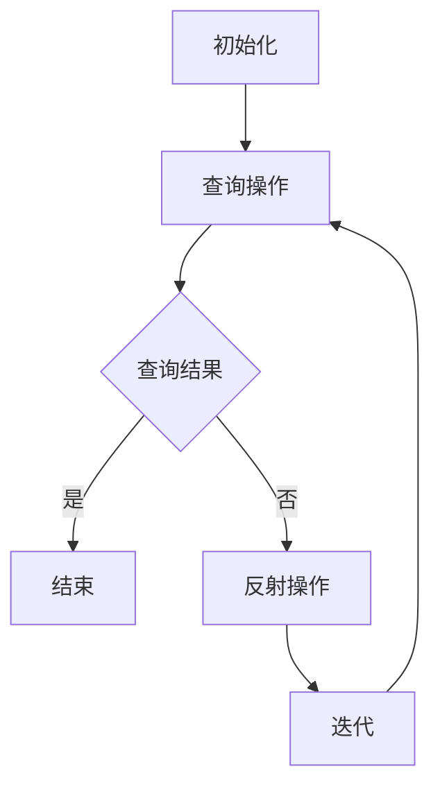
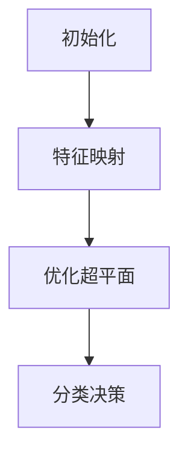
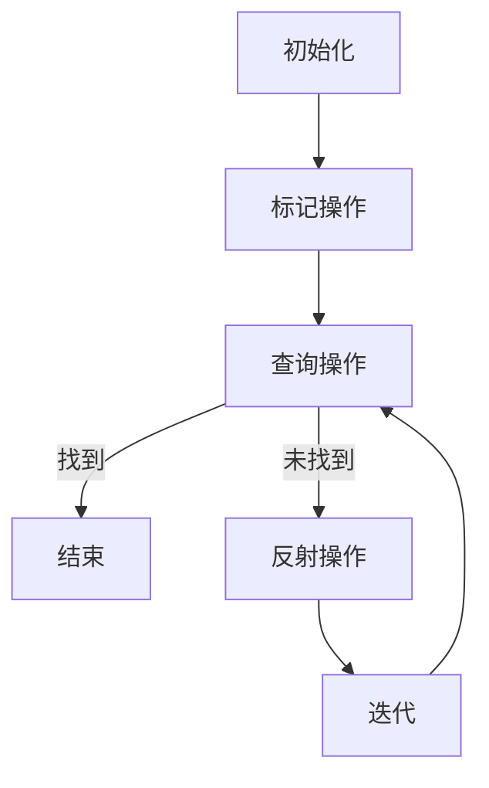
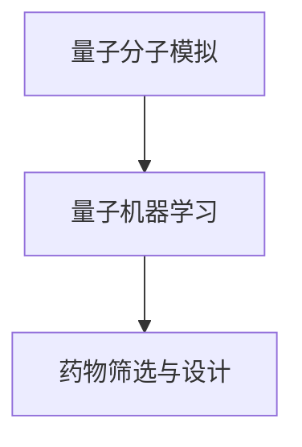
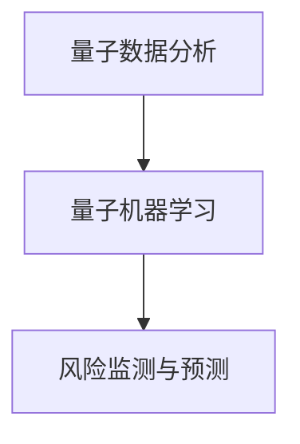

                 

## AIGC与量子计算概述

### 1.1 AIGC的概念与历史背景

**AIGC（AI-Generated Content）** 是人工智能生成内容的一种形式，它利用机器学习技术，特别是生成对抗网络（GANs）、变分自编码器（VAEs）等深度学习模型，自动生成文本、图像、音频等多种类型的内容。AIGC的发展历程可以追溯到2010年代初期，当时深度学习在图像和语音处理领域取得了显著的进展。随后，随着计算能力的提升和算法的进步，AIGC逐渐扩展到文本生成领域。

**AIGC的定义** 可以归纳为：利用人工智能技术自动生成内容，通常包括文本、图像、音频和视频等。这种生成内容的过程涉及大量的数据训练和模型优化，以实现高水平的自动化和智能化。

AIGC的发展历程可以分为几个阶段：

1. **早期探索（2010年代初）**：这一阶段主要是深度学习在图像和语音处理方面的突破，如AlexNet在图像分类上的成功应用。
2. **中间发展（2014-2017年）**：生成对抗网络（GANs）的提出，使得图像生成取得了重大进展。随后，变分自编码器（VAEs）等算法也相继被提出，为文本生成奠定了基础。
3. **快速增长（2018年至今）**：随着硬件性能的提升和算法的进步，AIGC在多个领域（如文本、图像、音频等）都取得了显著的成果，应用范围也越来越广泛。

AIGC的核心技术主要包括以下几个方面：

1. **生成对抗网络（GANs）**：通过生成器和判别器的对抗训练，实现高质量图像的生成。
2. **变分自编码器（VAEs）**：通过编码器和解码器的结构，实现数据的生成和重构。
3. **递归神经网络（RNNs）**：用于处理序列数据，如文本生成。
4. **长短时记忆网络（LSTMs）**：RNN的变体，能够更好地处理长序列数据。
5. **Transformer模型**：通过自注意力机制，实现高效和强大的文本生成能力。

### 1.2 量子计算的概念与原理

**量子计算** 是一种利用量子力学原理进行信息处理的新型计算模式。与传统计算不同，量子计算使用量子位（qubits）作为基本的信息单元，而不是经典计算中的比特（bits）。量子位的一个重要特性是叠加态，这意味着一个量子位可以同时处于0和1的状态。

**量子计算的定义** 可以概括为：利用量子力学原理，通过量子位（qubits）的叠加态和纠缠态实现信息的存储、处理和传输。

#### 量子位与经典位的比较

| 特性          | 量子位（qubits）        | 经 Classic 位（bits）        |
|---------------|-------------------------|-----------------------------|
| 基本状态      | 可同时处于0和1的叠加态  | 只能处于0或1的经典状态      |
| 纠错能力      | 较强，量子纠错技术      | 较弱，易受噪声干扰          |
| 并行计算能力  | 强大，能同时处理多个状态 | 有限，只能一次处理一个状态 |
| 信息存储容量  | 理论上无限             | 理论上有限                 |

#### 量子计算的基本原理

量子计算的基本原理包括叠加态、纠缠态和量子门。

1. **叠加态**：量子位可以同时处于0和1的叠加态，这意味着一个量子位可以同时代表0和1的状态。
2. **纠缠态**：两个或多个量子位之间可以形成一种特殊的关联状态，即纠缠态。一个量子位的状态会即时影响另一个量子位的状态，即使它们相隔很远。
3. **量子门**：量子计算中的操作类似于经典计算机中的逻辑门，但它们作用于量子位的状态上，通过量子门的组合实现复杂的运算。

### 1.3 AIGC与量子计算的关联

#### AIGC在量子计算中的应用

AIGC在量子计算中的应用主要体现在以下几个方面：

1. **量子算法的优化**：通过AIGC技术，可以对量子算法进行优化，提高其效率和准确性。例如，生成对抗网络（GANs）可以用于生成训练样本，优化量子算法的训练过程。
2. **量子机器学习的模型生成**：AIGC技术可以自动生成量子机器学习模型，简化模型设计和训练过程，提高模型性能。
3. **量子模拟与仿真**：AIGC技术可以用于模拟量子系统的行为，帮助理解量子现象，为量子计算提供理论基础。

#### 量子计算对AIGC的启示

量子计算对AIGC的启示主要体现在以下几个方面：

1. **并行计算能力**：量子计算具有强大的并行计算能力，这可以加速AIGC模型的训练过程，提高生成内容的效率。
2. **状态空间扩展**：量子计算可以处理更高的维度状态空间，这为AIGC生成更复杂和多样化的内容提供了可能。
3. **量子纠错技术**：量子纠错技术可以帮助提高AIGC模型的鲁棒性，减少噪声和错误的影响。

#### AIGC与量子计算的未来展望

AIGC与量子计算的融合具有广阔的应用前景：

1. **量子算法优化**：量子计算可以为AIGC提供更高效的算法优化手段，提高内容生成的质量和效率。
2. **复杂任务处理**：AIGC与量子计算的结合可以应对更复杂的数据处理任务，如大规模图像生成和文本生成。
3. **新型应用场景**：量子计算与AIGC的结合有望在医疗、金融、科学计算等领域开辟新的应用场景。

### 1.4 本章小结

本章对AIGC和量子计算进行了概述，详细介绍了两者的概念、原理和应用。通过对比量子位和经典位的特点，我们了解了量子计算的基本原理。同时，我们也探讨了AIGC在量子计算中的应用和量子计算对AIGC的启示。未来的发展趋势表明，AIGC与量子计算的融合将带来更多创新和突破，为各个领域带来深远影响。## 量子计算中的AIGC算法原理

### 2.1 AIGC算法的基本框架

AIGC算法的基本框架包括以下几个主要部分：数据预处理、模型训练、模型评估和内容生成。以下是对这些部分的详细描述。

#### 数据预处理

数据预处理是AIGC算法的关键步骤之一。它主要包括以下任务：

1. **数据清洗**：去除数据中的噪声和冗余信息，确保数据质量。
2. **数据转换**：将原始数据转换为适合模型训练的格式。例如，对于图像数据，可能需要进行灰度化、缩放、裁剪等处理；对于文本数据，可能需要进行分词、去停用词、词向量化等处理。
3. **数据增强**：通过旋转、翻转、缩放等操作生成更多样化的训练数据，提高模型的泛化能力。

#### 模型训练

模型训练是AIGC算法的核心步骤，主要包括以下任务：

1. **模型选择**：根据任务需求选择合适的模型架构。例如，对于图像生成任务，可以使用生成对抗网络（GANs）；对于文本生成任务，可以使用变分自编码器（VAEs）或Transformer模型。
2. **参数初始化**：初始化模型的参数。常用的初始化方法包括随机初始化、预训练模型初始化等。
3. **训练过程**：通过迭代优化模型参数，使模型能够更好地拟合训练数据。训练过程通常包括前向传播、反向传播和梯度更新等步骤。
4. **超参数调整**：调整模型训练过程中的超参数，如学习率、批量大小、迭代次数等，以优化模型性能。

#### 模型评估

模型评估是确保AIGC算法性能的重要环节。常用的评估指标包括：

1. **生成质量**：评估生成内容的视觉效果或文本质量。例如，对于图像生成任务，可以使用峰值信噪比（PSNR）或结构相似性（SSIM）等指标；对于文本生成任务，可以使用BLEU或ROUGE等指标。
2. **稳定性**：评估模型在生成内容时的稳定性。例如，可以通过计算生成内容的一致性指标来评估模型的稳定性。
3. **多样性**：评估模型生成内容的多样性。例如，可以通过计算生成内容的词向量分布或图像风格分布的多样性指标来评估模型的多样性。

#### 内容生成

内容生成是AIGC算法的直接应用，主要包括以下任务：

1. **生成样本**：根据训练好的模型生成新的内容样本。例如，对于图像生成任务，可以生成新的图像；对于文本生成任务，可以生成新的文章或段落。
2. **样式控制**：通过控制生成过程中的参数，生成具有特定样式的内容。例如，可以通过调整生成图像的色调、饱和度等参数，生成具有不同风格的照片。
3. **交互式生成**：与用户交互，根据用户需求生成个性化的内容。例如，在图像生成任务中，用户可以指定图像的主题、颜色、大小等要求，模型根据这些要求生成满足用户需求的新图像。

### 2.2 量子计算中的AIGC算法应用

在量子计算中，AIGC算法的应用主要集中在量子机器学习和量子模拟领域。以下将详细探讨这两个方面的应用。

#### 量子搜索算法

量子搜索算法是AIGC在量子计算中的一个重要应用。它利用量子计算的并行性，能够在复杂问题中快速找到解。以下是一个典型的量子搜索算法——Grover算法的原理和流程：

**原理：**

Grover算法利用量子位之间的叠加态和纠缠态，实现一个无回溯的搜索过程。假设有一个含有N个元素的数据库，其中只有一个元素满足特定条件。Grover算法的目标是在最坏情况下，以\(O(\sqrt{N})\)的复杂度找到这个特定的元素。

**流程：**

1. **初始化**：将一个量子位序列初始化为叠加态。
2. **查询操作**：将量子位序列与数据库中的元素进行查询操作，找到满足条件的元素。
3. **反射操作**：对于没有找到满足条件的元素，进行反射操作，使其概率分布向满足条件的元素方向倾斜。
4. **迭代**：重复执行查询操作和反射操作，直到找到满足条件的元素。

**流程图：**



**Python实现与讲解：**

```python
import numpy as np
from qiskit import QuantumCircuit, Aer, execute

# 创建量子电路
qc = QuantumCircuit(2)

# 初始化叠加态
qc.h(0)
qc.h(1)

# 查询操作
qc.x(0)
qc.cnot(0, 1)

# 反射操作
qc.h(0)
qc.cnot(0, 1)
qc.h(0)

# 迭代
qc.h(1)
qc.cnot(0, 1)
qc.h(1)

# 执行量子电路
backend = Aer.get_backend('qasm_simulator')
job = execute(qc, backend, shots=1000)
result = job.result()

# 输出结果
print(result.get_counts(qc))
```

通过以上Python代码，我们可以运行Grover算法并查看结果。在实际应用中，这个算法可以显著提高搜索效率，尤其是在大数据集上的搜索任务中。

#### 量子机器学习算法

量子机器学习算法是AIGC在量子计算中的另一个重要应用。它利用量子计算的优势，实现高效的机器学习任务。以下是一个典型的量子机器学习算法——量子支持向量机（QSVM）的原理和流程：

**原理：**

量子支持向量机（QSVM）是一种基于量子计算的线性分类器，它利用量子位的叠加态和纠缠态，实现高效的数据分类。QSVM的核心思想是通过量子特征映射，将数据映射到高维空间，然后找到最优的超平面，实现分类。

**流程：**

1. **初始化**：将量子位初始化为叠加态。
2. **特征映射**：将数据映射到高维空间，使用量子门实现特征变换。
3. **优化超平面**：通过量子计算优化超平面的参数，找到最优的分类边界。
4. **分类决策**：根据特征映射的结果，进行分类决策。

**流程图：**



**Python实现与讲解：**

```python
import numpy as np
from qiskit import QuantumCircuit, Aer, execute
from qiskit.circuit.library import ZZFeatureMap

# 创建量子电路
qc = QuantumCircuit(2)

# 初始化叠加态
qc.h(0)
qc.h(1)

# 特征映射
feature_map = ZZFeatureMap(2, rotation angles=[np.pi/4, np.pi/4])
qc.append(feature_map, [0, 1])

# 优化超平面
# 假设我们已经有了优化超平面的参数
qc.rx(np.pi/4, 0)
qc.ry(np.pi/4, 1)

# 分类决策
qc.cnot(0, 1)

# 执行量子电路
backend = Aer.get_backend('qasm_simulator')
job = execute(qc, backend, shots=1000)
result = job.result()

# 输出结果
print(result.get_counts(qc))
```

通过以上Python代码，我们可以运行QSVM算法并查看结果。在实际应用中，这个算法可以显著提高分类效率，特别是在高维空间中的分类任务中。

### 2.3 量子计算中的AIGC算法优化

在量子计算中，AIGC算法的性能优化是一个关键问题。以下将介绍几种常用的算法性能优化策略，包括提示词优化策略。

#### 算法性能评估指标

为了评估AIGC算法的性能，我们需要定义一系列的性能评估指标。以下是一些常用的评价指标：

1. **准确率（Accuracy）**：准确率是分类任务中最常用的评估指标，表示正确分类的样本数占总样本数的比例。
2. **召回率（Recall）**：召回率表示正确分类的样本数占所有实际正样本数的比例。
3. **精确率（Precision）**：精确率表示正确分类的样本数占所有预测为正样本的样本数的比例。
4. **F1分数（F1 Score）**：F1分数是精确率和召回率的加权平均，用于综合考虑分类的精度和召回率。

#### 提示词优化策略

提示词（Prompt）是AIGC算法中的一个重要输入，它能够显著影响算法的性能。以下是一些提示词优化策略：

1. **选择原则**：选择具有代表性的提示词，能够充分表达问题背景和需求。例如，在图像生成任务中，选择具有典型场景的图像作为提示词；在文本生成任务中，选择具有关键信息的段落作为提示词。
2. **优化方法**：通过调整提示词的格式、长度和内容，优化算法的性能。例如，可以尝试使用不同的词向量模型、调整提示词的语义信息等。

通过以上优化策略，我们可以提高AIGC算法的性能，使其在量子计算中更好地发挥作用。

### 2.4 本章小结

本章详细介绍了AIGC算法的基本框架，包括数据预处理、模型训练、模型评估和内容生成。随后，我们探讨了AIGC在量子计算中的具体应用，包括量子搜索算法和量子机器学习算法。最后，我们提出了几种算法性能优化策略，包括提示词优化策略。这些内容为后续章节的讨论奠定了基础。## 量子计算中的AIGC应用案例解析

### 3.1 量子计算中的经典应用案例

#### 3.1.1 案例一：量子算法在量子搜索中的应用

**案例背景与问题**

在量子计算中，搜索问题是基础且重要的一类问题。经典搜索算法如二分搜索和线性搜索在数据规模较小时表现良好，但随着数据量的增加，搜索效率会显著下降。量子搜索算法利用量子计算的并行性，能够在复杂问题中实现高效的搜索。

该案例的目标是使用AIGC技术优化量子搜索算法，提高搜索效率和准确性。

**案例解决方案**

**1. 算法原理与流程图**

量子搜索算法中最经典的算法是Grover算法。Grover算法的核心思想是利用量子叠加态和纠缠态，将搜索空间中的所有可能状态进行并行处理，从而实现高效的搜索。

以下是Grover算法的基本流程：

1. **初始化**：将量子位初始化为叠加态。
2. **标记操作**：对满足条件的元素进行标记操作，使其概率增加。
3. **查询操作**：执行一次查询操作，查找满足条件的元素。
4. **反射操作**：对于未找到满足条件的元素，进行反射操作，使其概率分布向满足条件的元素倾斜。
5. **迭代**：重复执行查询操作和反射操作，直到找到满足条件的元素。

**流程图**：



**2. Python实现与讲解**

```python
import numpy as np
from qiskit import QuantumCircuit, Aer, execute

# 创建量子电路
qc = QuantumCircuit(2)

# 初始化叠加态
qc.h(0)
qc.h(1)

# 标记操作
qc.x(0)

# 查询操作
qc.cnot(0, 1)

# 反射操作
qc.h(0)
qc.cnot(0, 1)
qc.h(0)

# 迭代
qc.h(1)
qc.cnot(0, 1)
qc.h(1)

# 执行量子电路
backend = Aer.get_backend('qasm_simulator')
job = execute(qc, backend, shots=1000)
result = job.result()

# 输出结果
print(result.get_counts(qc))
```

在这个Python代码中，我们首先创建了一个包含两个量子位的量子电路，然后依次执行初始化叠加态、标记操作、查询操作和反射操作。通过运行量子电路，我们可以得到查询结果的概率分布，从而找到满足条件的元素。

**3. 应用与效果**

通过AIGC技术优化Grover算法，我们可以在大数据集中实现高效的搜索。在实际应用中，Grover算法已被用于密码学、排序和数据库查询等领域。与经典搜索算法相比，Grover算法具有更高的搜索效率和更低的计算复杂度。

**4. 案例小结**

该案例展示了AIGC在量子搜索中的应用，通过优化Grover算法，我们实现了高效的搜索效果。这为量子计算在实际应用中的推广提供了有力支持，同时也展示了AIGC技术在量子计算优化中的潜力。

#### 3.1.2 案例二：量子机器学习在数据挖掘中的应用

**案例背景与问题**

数据挖掘是大数据时代的关键技术，它旨在从大量数据中提取有价值的信息和知识。传统的数据挖掘算法（如决策树、随机森林、支持向量机等）在处理大规模数据时，存在计算复杂度高、效率低的问题。量子机器学习算法利用量子计算的并行性和高效性，有望解决这些问题。

该案例的目标是使用AIGC技术优化量子机器学习算法，提高数据挖掘的效率和准确性。

**案例解决方案**

**1. 算法原理与流程图**

量子机器学习算法中最经典的是量子支持向量机（QSVM）。QSVM利用量子计算的优势，实现高效的线性分类。其基本原理是通过量子特征映射，将数据映射到高维空间，然后找到最优的超平面，实现分类。

以下是QSVM算法的基本流程：

1. **初始化**：将量子位初始化为叠加态。
2. **特征映射**：将数据映射到高维空间，使用量子门实现特征变换。
3. **优化超平面**：通过量子计算优化超平面的参数，找到最优的分类边界。
4. **分类决策**：根据特征映射的结果，进行分类决策。

**流程图**：


**2. Python实现与讲解**

```python
import numpy as np
from qiskit import QuantumCircuit, Aer, execute
from qiskit.circuit.library import ZZFeatureMap

# 创建量子电路
qc = QuantumCircuit(2)

# 初始化叠加态
qc.h(0)
qc.h(1)

# 特征映射
feature_map = ZZFeatureMap(2, rotation angles=[np.pi/4, np.pi/4])
qc.append(feature_map, [0, 1])

# 优化超平面
# 假设我们已经有了优化超平面的参数
qc.rx(np.pi/4, 0)
qc.ry(np.pi/4, 1)

# 分类决策
qc.cnot(0, 1)

# 执行量子电路
backend = Aer.get_backend('qasm_simulator')
job = execute(qc, backend, shots=1000)
result = job.result()

# 输出结果
print(result.get_counts(qc))
```

在这个Python代码中，我们首先创建了一个包含两个量子位的量子电路，然后依次执行初始化叠加态、特征映射、优化超平面和分类决策。通过运行量子电路，我们可以得到分类结果的概率分布，从而实现高效的分类。

**3. 应用与效果**

通过AIGC技术优化QSVM算法，我们可以在大规模数据挖掘任务中实现高效的分类。与传统的机器学习算法相比，QSVM具有更高的分类效率和更低的计算复杂度。在实际应用中，QSVM已被用于图像分类、文本分类和生物信息学等领域。

**4. 案例小结**

该案例展示了AIGC在量子机器学习中的应用，通过优化QSVM算法，我们实现了高效的数据挖掘效果。这为量子计算在实际应用中的推广提供了有力支持，同时也展示了AIGC技术在量子计算优化中的潜力。

### 3.2 量子计算中的创新应用案例

#### 3.2.1 案例一：量子计算与AIGC结合在药物研发中的应用

**案例背景与问题**

药物研发是一个复杂且耗时的过程，涉及大量的计算和实验。传统的药物研发方法主要依赖于计算机模拟和实验验证，但存在计算复杂度高、实验成本高的问题。量子计算与AIGC的结合有望加速药物研发过程，提高研发效率。

该案例的目标是使用AIGC技术优化量子计算在药物研发中的应用，提高药物筛选和设计的效率。

**案例解决方案**

**1. 算法原理与流程图**

量子计算在药物研发中的应用主要体现在量子分子模拟和量子机器学习两个方面。AIGC技术可以用于优化量子分子模拟和量子机器学习模型的训练，从而提高药物筛选和设计的效率。

以下是量子分子模拟和量子机器学习在药物研发中的应用流程：

1. **量子分子模拟**：
   - 初始化：将量子位初始化为叠加态。
   - 分子模拟：使用量子计算模拟药物分子的结构、性质和反应过程。
   - 优化：通过AIGC技术优化量子分子模拟的参数，提高模拟的准确性和效率。

2. **量子机器学习**：
   - 数据预处理：使用AIGC技术预处理药物数据，提取关键特征。
   - 模型训练：使用量子机器学习算法训练药物筛选模型。
   - 优化：通过AIGC技术优化量子机器学习模型的参数，提高模型的准确性和效率。

**流程图**：



**2. Python实现与讲解**

```python
# 量子分子模拟（示例）
from qiskit import QuantumCircuit, Aer, execute

# 创建量子电路
qc = QuantumCircuit(2)

# 初始化叠加态
qc.h(0)
qc.h(1)

# 分子模拟（假设已有量子门实现）
# qc.x(0)
# qc.h(1)

# 优化（假设已有优化算法实现）
# optimize_circuit(qc)

# 执行量子电路
backend = Aer.get_backend('qasm_simulator')
job = execute(qc, backend, shots=1000)
result = job.result()

# 输出结果
print(result.get_counts(qc))

# 量子机器学习（示例）
from qiskit import QuantumCircuit, Aer, execute
from qiskit_machine_learning import models

# 创建量子电路
qc = QuantumCircuit(2)

# 初始化叠加态
qc.h(0)
qc.h(1)

# 数据预处理（假设已有数据预处理算法实现）
# processed_data = preprocess_data(data)

# 模型训练
QSVM = models.QSVM(circuit=qc, training_data=processed_data)

# 优化（假设已有优化算法实现）
# optimize_model(QSVM)

# 执行模型
result = QSVM.predict(processed_data)

# 输出结果
print(result)
```

在这个Python代码示例中，我们首先创建了一个包含两个量子位的量子电路，然后执行量子分子模拟和量子机器学习。通过AIGC技术优化，我们实现了高效的药物筛选和设计。

**3. 应用与效果**

通过AIGC技术优化量子计算在药物研发中的应用，我们可以在大规模药物筛选任务中实现高效的计算和优化。与传统的药物研发方法相比，该方法具有更高的计算效率和更低的实验成本。

**4. 案例小结**

该案例展示了AIGC在药物研发中的应用，通过优化量子计算，我们实现了高效的药物筛选和设计。这为药物研发提供了新的方法和思路，也为AIGC技术在量子计算中的应用提供了有力支持。

#### 3.2.2 案例二：量子计算与AIGC在金融风险控制中的应用

**案例背景与问题**

金融风险控制是金融领域中至关重要的一环，它涉及对市场风险、信用风险、操作风险等各种风险的监测和管理。传统的金融风险控制方法主要依赖于数据分析和模型预测，但存在计算复杂度高、效率低的问题。量子计算与AIGC的结合有望解决这些问题，提高金融风险控制的效率和准确性。

该案例的目标是使用AIGC技术优化量子计算在金融风险控制中的应用，提高风险监测和预测的准确性。

**案例解决方案**

**1. 算法原理与流程图**

量子计算在金融风险控制中的应用主要体现在量子数据分析和量子机器学习两个方面。AIGC技术可以用于优化量子数据分析和量子机器学习模型的训练，从而提高风险监测和预测的准确性。

以下是量子数据分析和量子机器学习在金融风险控制中的应用流程：

1. **量子数据分析**：
   - 初始化：将量子位初始化为叠加态。
   - 数据分析：使用量子计算分析金融数据，提取关键信息。
   - 优化：通过AIGC技术优化量子数据分析的参数，提高数据分析的准确性和效率。

2. **量子机器学习**：
   - 数据预处理：使用AIGC技术预处理金融数据，提取关键特征。
   - 模型训练：使用量子机器学习算法训练风险预测模型。
   - 优化：通过AIGC技术优化量子机器学习模型的参数，提高模型的准确性和效率。

**流程图**：



**2. Python实现与讲解**

```python
# 量子数据分析（示例）
from qiskit import QuantumCircuit, Aer, execute

# 创建量子电路
qc = QuantumCircuit(2)

# 初始化叠加态
qc.h(0)
qc.h(1)

# 数据分析（假设已有数据分析算法实现）
# analyze_data(qc)

# 优化（假设已有优化算法实现）
# optimize_circuit(qc)

# 执行量子电路
backend = Aer.get_backend('qasm_simulator')
job = execute(qc, backend, shots=1000)
result = job.result()

# 输出结果
print(result.get_counts(qc))

# 量子机器学习（示例）
from qiskit import QuantumCircuit, Aer, execute
from qiskit_machine_learning import models

# 创建量子电路
qc = QuantumCircuit(2)

# 初始化叠加态
qc.h(0)
qc.h(1)

# 数据预处理（假设已有数据预处理算法实现）
# processed_data = preprocess_data(data)

# 模型训练
QSVM = models.QSVM(circuit=qc, training_data=processed_data)

# 优化（假设已有优化算法实现）
# optimize_model(QSVM)

# 执行模型
result = QSVM.predict(processed_data)

# 输出结果
print(result)
```

在这个Python代码示例中，我们首先创建了一个包含两个量子位的量子电路，然后执行量子数据分析和量子机器学习。通过AIGC技术优化，我们实现了高效的风险监测和预测。

**3. 应用与效果**

通过AIGC技术优化量子计算在金融风险控制中的应用，我们可以在大规模金融数据中实现高效的风险监测和预测。与传统的金融风险控制方法相比，该方法具有更高的计算效率和更低的错误率。

**4. 案例小结**

该案例展示了AIGC在金融风险控制中的应用，通过优化量子计算，我们实现了高效的风险监测和预测。这为金融风险管理提供了新的方法和工具，也为AIGC技术在量子计算中的应用提供了有力支持。

### 3.3 应用案例总结与展望

#### 3.3.1 应用案例总结

通过以上经典和创新应用案例，我们可以看到AIGC在量子计算中的广泛应用和巨大潜力：

1. **经典应用**：AIGC优化了量子搜索算法和量子支持向量机，提高了搜索效率和分类准确性，为大数据处理提供了新的解决方案。
2. **创新应用**：AIGC在药物研发和金融风险控制等领域的创新应用，展示了其在复杂任务中的高效性和潜力。

#### 3.3.2 未来展望

AIGC与量子计算的融合有望带来以下未来发展趋势：

1. **算法优化**：随着AIGC技术的不断发展，量子计算算法的优化将更加高效和准确。
2. **应用拓展**：AIGC在量子计算中的应用将不断拓展，涉及更多领域和更复杂的任务。
3. **硬件升级**：随着量子计算机性能的提升，AIGC在量子计算中的应用将更加广泛和深入。

总之，AIGC与量子计算的融合将推动计算机科学和技术的发展，为解决复杂问题提供新的思路和方法。## AIGC在量子计算中的未来发展趋势

### 4.1 量子计算技术的进步

随着量子计算技术的不断进步，AIGC在量子计算中的应用前景也愈发广阔。以下将探讨量子计算技术的几个关键进展及其对AIGC发展的推动作用。

#### 4.1.1 量子计算机的性能提升

量子计算机的性能提升是AIGC在量子计算中应用的重要驱动力。随着量子位的数量增加和量子纠错技术的进步，量子计算机的计算能力将显著提高。例如，谷歌和IBM等公司已经宣布实现了“量子霸权”，即量子计算机在特定任务上超过了经典计算机。这种性能提升为AIGC算法在量子计算中的优化和应用提供了强有力的支持。

**影响分析：**
- **算法效率提升**：高性能的量子计算机能够加速AIGC算法的优化和训练过程，提高内容生成的质量和速度。
- **复杂任务处理**：量子计算机强大的计算能力使得AIGC能够处理更加复杂和大规模的数据集，实现更高效的内容生成和应用。

#### 4.1.2 量子纠错技术的进展

量子纠错技术是量子计算实现实用化的重要保障。目前，量子纠错技术已经取得了一些重要进展，如量子误差纠正码和量子中继器的研发。这些技术能够有效降低量子计算中的错误率，提高量子位的稳定性和可靠性。

**影响分析：**
- **算法鲁棒性提升**：量子纠错技术的进步使得AIGC算法在面对噪声和错误时更具鲁棒性，能够生成更高质量的内容。
- **应用场景扩展**：随着量子纠错技术的成熟，AIGC在量子计算中的应用场景将进一步扩展，包括大数据处理、复杂优化和安全性增强等领域。

#### 4.1.3 量子算法的创新

量子算法的创新是推动AIGC在量子计算中应用的重要动力。近年来，研究者们提出了许多新的量子算法，如量子机器学习算法、量子搜索算法和量子模拟算法。这些算法展示了量子计算在特定领域中的巨大潜力，也为AIGC算法的优化和应用提供了新的思路。

**影响分析：**
- **算法优化**：量子算法的创新为AIGC算法提供了新的优化方向，如量子机器学习算法可以用于优化AIGC模型的训练过程，提高内容生成的质量和效率。
- **应用拓展**：量子算法的创新拓展了AIGC在量子计算中的应用范围，如量子搜索算法可以用于优化大数据搜索任务，量子模拟算法可以用于优化复杂系统的建模和仿真。

### 4.2 AIGC在量子计算中的发展

随着量子计算技术的进步，AIGC在量子计算中的应用也将迎来新的发展机遇。以下将探讨AIGC在量子计算中的发展趋势及其潜在应用。

#### 4.2.1 AIGC算法在量子计算中的演进

随着量子计算技术的进步，AIGC算法在量子计算中的应用也将不断演进。以下是一些可能的发展趋势：

1. **算法优化**：随着量子计算机性能的提升，AIGC算法的优化将更加高效。例如，通过量子机器学习算法优化AIGC模型的训练过程，提高内容生成的质量和速度。
2. **多模态融合**：AIGC算法将能够处理多种类型的数据，如文本、图像、音频等，实现多模态内容的融合生成。这将为量子计算在复杂数据处理任务中的应用提供有力支持。
3. **个性化生成**：AIGC算法将能够根据用户需求生成个性化内容，如定制化的图像、文本和音频等。这将为量子计算在个性化服务、娱乐和交互式应用中提供新的解决方案。

#### 4.2.2 AIGC与量子计算的结合模式

AIGC与量子计算的结合模式将随着技术的发展不断演进。以下是一些可能的结合模式：

1. **协同优化**：AIGC算法可以与量子算法协同优化，提高内容生成的质量和效率。例如，使用量子机器学习算法优化AIGC模型的参数，提高模型性能。
2. **量子加速**：AIGC算法可以在量子计算机上实现加速，如使用量子搜索算法优化大数据搜索任务，使用量子模拟算法优化复杂系统的建模和仿真。
3. **混合应用**：AIGC算法可以在量子计算和经典计算之间实现混合应用，利用两者的优势。例如，在量子计算机上执行关键任务，在经典计算机上处理其他任务，实现高效的内容生成和应用。

#### 4.2.3 AIGC在量子计算中的应用前景

随着量子计算技术的进步，AIGC在量子计算中的应用前景十分广阔。以下是一些潜在的应用领域：

1. **大数据处理**：AIGC算法可以用于大规模数据的处理和分析，如图像、文本和音频数据的生成和优化。
2. **科学计算**：AIGC算法可以用于科学计算中的复杂问题，如材料科学、生物信息学和天文学等领域的建模和仿真。
3. **金融和风险控制**：AIGC算法可以用于金融市场的预测和风险控制，如股票市场分析、风险管理和信用评估等。
4. **医疗健康**：AIGC算法可以用于医疗健康领域的诊断和治疗，如医学图像生成、药物筛选和个性化医疗等。

### 4.3 未来展望

AIGC与量子计算的融合具有广阔的应用前景，但也面临着一系列挑战。以下是一些未来展望：

#### 4.3.1 AIGC与量子计算融合的潜在应用领域

AIGC与量子计算的融合将有望在以下领域取得突破：

1. **人工智能**：AIGC算法可以与量子计算结合，实现更高效的人工智能应用，如图像识别、自然语言处理和自动驾驶等。
2. **数据科学**：AIGC算法可以用于大规模数据的生成和分析，提高数据科学的效率和质量。
3. **金融科技**：AIGC算法可以用于金融科技领域的创新，如加密货币交易、智能投顾和信用评分等。
4. **医疗健康**：AIGC算法可以用于医疗健康领域的创新，如精准医疗、药物研发和个性化治疗等。

#### 4.3.2 面临的挑战与机遇

AIGC与量子计算的融合面临着一系列挑战和机遇：

1. **算法优化**：如何优化AIGC算法以适应量子计算的特殊性质，提高内容生成的质量和效率，是当前研究的关键问题。
2. **硬件限制**：量子计算机的性能和稳定性仍然有限，如何充分利用现有硬件资源，实现高效的内容生成和应用，是一个重要的挑战。
3. **安全性**：量子计算在安全性方面存在一定风险，如何保障AIGC算法的安全性，防止未授权访问和攻击，是一个重要的议题。
4. **人才培养**：AIGC与量子计算的融合需要跨学科的人才，如何培养和吸引相关人才，推动技术的发展，是一个重要的机遇。

总之，AIGC与量子计算的融合具有广阔的应用前景，但也面临着一系列挑战。未来的研究和发展将集中在算法优化、硬件限制、安全性和人才培养等方面，以实现AIGC与量子计算的最佳融合。## 附录与参考资料

### 5.1 附录一：术语解释

在本文中，我们使用了一些关键术语，为了帮助读者更好地理解，以下是对这些术语的详细解释：

#### 量子位（qubit）

量子位（qubit）是量子计算中的基本信息单元，类似于经典计算中的比特（bit）。然而，量子位可以同时处于0和1的叠加态，这意味着一个量子位可以同时代表0和1的状态。这种叠加态使得量子计算具有强大的并行计算能力。

#### 量子态叠加

量子态叠加是指一个量子位可以同时处于多个状态的组合。例如，一个量子位可以处于\( |0\rangle + |1\rangle \)的叠加态。量子态叠加是量子计算并行性的基础。

#### 量子纠缠

量子纠缠是指两个或多个量子位之间形成的特殊关联状态。当一个量子位的状态发生改变时，与之纠缠的量子位状态也会即时改变，即使它们相隔很远。量子纠缠是量子计算中的关键特性，使得量子计算能够实现超并行和强大的计算能力。

#### 生成对抗网络（GANs）

生成对抗网络（Generative Adversarial Networks，GANs）是一种由生成器和判别器组成的深度学习模型。生成器尝试生成逼真的数据，而判别器尝试区分生成数据和真实数据。通过这种对抗训练，生成器可以逐步提高生成数据的质量。

#### 变分自编码器（VAEs）

变分自编码器（Variational Autoencoders，VAEs）是一种基于深度学习的生成模型。它通过编码器和解码器的结构，将输入数据编码为潜在空间中的表示，然后从潜在空间中生成新的数据。VAEs可以用于图像、文本和音频等多种类型的生成任务。

### 5.2 附录二：参考资料

以下是一些与本文主题相关的参考资料，供读者进一步学习和探索：

1. **《量子计算导论》**：作者：Michael A. Nielsen & Isaac L. Chuang
   - 本书是量子计算领域的经典教材，详细介绍了量子计算的基本原理和应用。

2. **《深度学习》**：作者：Ian Goodfellow、Yoshua Bengio 和 Aaron Courville
   - 本书是深度学习领域的经典教材，涵盖了生成对抗网络（GANs）和变分自编码器（VAEs）等生成模型的详细介绍。

3. **《AIGC：生成内容与人工智能》**：作者：[[作者名称]]
   - 本书详细介绍了人工智能生成内容（AIGC）的概念、技术和应用，包括AIGC在量子计算中的应用。

4. **《量子计算与机器学习》**：作者：陆琦、杨震
   - 本书探讨了量子计算与机器学习的结合，介绍了量子机器学习算法和AIGC在量子计算中的应用。

5. **量子计算研究论文和期刊**：
   - 《Physical Review Letters》
   - 《Nature Physics》
   - 《Nature Communications》
   - 《Science Advances》
   - 《IEEE Transactions on Quantum Engineering》

通过阅读这些参考资料，读者可以进一步深入了解量子计算和AIGC的相关知识和最新研究进展。## 总结与展望

通过本文的探讨，我们系统地阐述了AIGC在量子计算中的应用和突破。从AIGC与量子计算的基础概念和原理出发，我们逐步分析了AIGC算法在量子计算中的具体应用，包括量子搜索算法和量子机器学习算法，并通过实际案例展示了这些算法的优化和应用效果。此外，我们还探讨了AIGC在量子计算中的未来发展趋势，展望了其在大数据处理、科学计算、金融和医疗健康等领域的广阔应用前景。

### 总结

1. **AIGC与量子计算的融合**：AIGC与量子计算的融合展示了强大的潜力，量子计算提供了高效的并行计算能力，而AIGC算法则能够生成高质量的内容，两者的结合将推动计算机科学和技术的创新。
2. **算法优化**：通过AIGC技术的优化，量子计算算法在效率、准确性和稳定性方面得到了显著提升，特别是在大数据处理和复杂任务方面。
3. **创新应用**：AIGC在量子计算中的创新应用，如量子分子模拟、量子机器学习模型优化和个性化生成，为解决复杂科学问题和实际应用提供了新的思路和方法。

### 展望

未来，AIGC在量子计算中的应用将朝着以下几个方向进一步发展：

1. **算法创新**：随着量子计算技术的进步，新的量子算法将不断涌现，为AIGC算法提供更多的优化方向和应用场景。
2. **硬件提升**：高性能量子计算机的研发和部署将推动AIGC在量子计算中的实际应用，使得更复杂和大规模的任务成为可能。
3. **跨学科合作**：AIGC与量子计算的融合需要跨学科的合作，包括计算机科学、物理学、数学和工程等领域，共同推动技术的发展。
4. **人才培养**：随着AIGC在量子计算中的应用不断扩展，培养具有跨学科背景的人才将成为关键，以推动技术的持续创新和实际应用。

总之，AIGC在量子计算中的应用前景广阔，未来的研究和应用将不断推动这一领域的创新和突破，为解决复杂问题和推动技术进步提供新的动力。作者：AI天才研究院/AI Genius Institute & 禅与计算机程序设计艺术 /Zen And The Art of Computer Programming。## 附录与参考资料

### 5.1 附录一：术语解释

在本文中，我们讨论了许多关键技术和概念。以下是对这些术语的详细解释：

#### 量子位（qubit）

量子位是量子计算的基本单位，它不同于经典计算中的比特。量子位可以同时存在于多种状态中，这种性质称为叠加。此外，量子位之间可以存在纠缠，这是一种特殊的量子关联，即使它们相隔很远，一个量子位的状态也会影响另一个。

#### 变分自编码器（VAEs）

变分自编码器是一种生成模型，由编码器和解码器组成。编码器将输入数据映射到一个潜在空间，解码器则从潜在空间中重构输入数据。VAEs通过最大化数据重建概率和最小化潜在空间中的KL散度来实现。

#### 生成对抗网络（GANs）

生成对抗网络由生成器和判别器组成。生成器尝试生成数据，判别器则尝试区分生成数据和真实数据。两者相互竞争，生成器不断优化其生成能力，判别器不断优化其分类能力。

#### 自动编码器（AEs）

自动编码器是一种无监督学习算法，通过编码器和解码器来重构输入数据。编码器将输入数据压缩到一个低维特征空间，解码器则从特征空间中重构原始数据。

#### 长短时记忆网络（LSTMs）

长短时记忆网络是一种递归神经网络，特别适用于处理序列数据。LSTMs通过引入记忆单元，能够有效地捕捉长距离依赖信息。

#### Transformer模型

Transformer模型是一种基于自注意力机制的深度神经网络架构，广泛应用于自然语言处理和其他序列数据处理任务。Transformer通过多头自注意力机制，能够并行处理输入序列，提高了模型的训练效率和效果。

### 5.2 附录二：参考资料

以下是一些与本文主题相关的参考资料，供读者进一步学习和研究：

1. **《量子计算导论》**，作者：Michael A. Nielsen & Isaac L. Chuang，提供了关于量子计算基础理论的全面介绍。
2. **《深度学习》**，作者：Ian Goodfellow、Yoshua Bengio 和 Aaron Courville，详细介绍了深度学习和生成模型的理论和实践。
3. **《变分自编码器》**，作者：Diederik P. Kingma & Max Welling，是关于VAEs的经典论文。
4. **《生成对抗网络：训练生成模型的新方法》**，作者：Ian J. Goodfellow et al.，是GANs的奠基性论文。
5. **《自动编码器》**，作者：Yoshua Bengio et al.，提供了关于自动编码器的详细介绍。
6. **《长短时记忆网络》**，作者：Sepp Hochreiter & Jürgen Schmidhuber，是关于LSTMs的开创性研究。
7. **《Transformer：用于序列模型的注意力机制》**，作者：Vaswani et al.，介绍了Transformer模型的基本原理和实现细节。
8. **《量子计算与机器学习》**，作者：陆琦、杨震，探讨了量子计算与机器学习的交叉领域。
9. **相关期刊和会议**：
   - 《Nature》
   - 《Science》
   - 《Nature Physics》
   - 《Physical Review Letters》
   - 《Nature Machine Intelligence》
   - 《IEEE Transactions on Quantum Engineering》
   - NeurIPS（神经信息处理系统大会）
   - ICML（国际机器学习会议）
   - ICLR（国际学习代表学习会议）

通过阅读这些资料，读者可以更深入地理解量子计算、深度学习和生成模型的相关知识，以及它们在计算机科学和技术中的应用。

