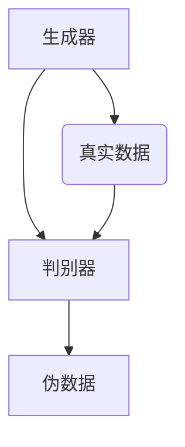
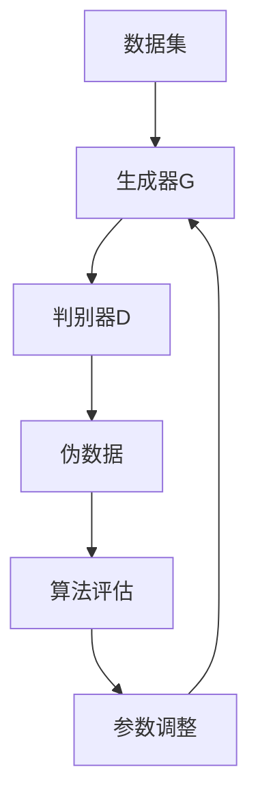
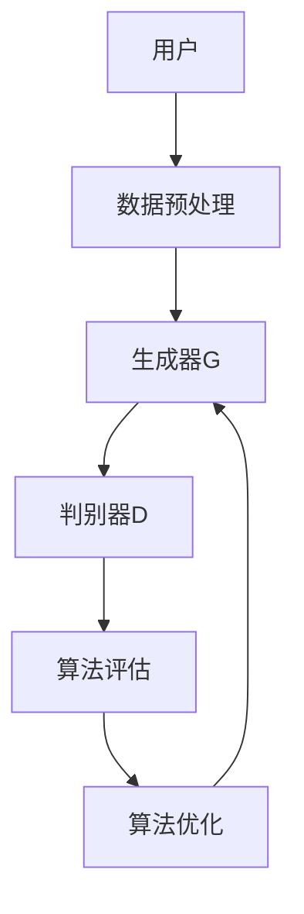
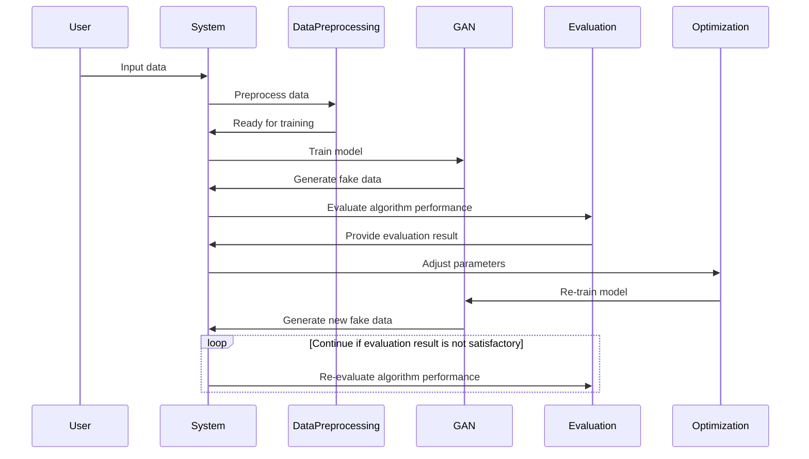

                 

# AIGC在量子计算研究中的应用：算法优化提示词

## 关键词
AIGC，量子计算，算法优化，深度学习，生成对抗网络，变分自编码器，数学模型，系统架构

## 摘要
本文探讨了生成式人工智能（AIGC）在量子计算研究中的应用，特别是其在算法优化方面的潜力。通过背景介绍、核心概念解析、算法原理讲解和系统分析与架构设计，本文详细阐述了AIGC在量子计算研究中的重要作用，并提出了一种基于AIGC的算法优化方法。本文旨在为量子计算领域的研究人员提供有价值的参考，推动AIGC技术在量子计算领域的深入应用。

## 1. 背景介绍

### 1.1 问题背景
随着人工智能（AI）技术的快速发展，AI在各个领域的应用日益广泛。特别是在文本生成、图像生成和视频生成等方面，生成式人工智能（AIGC）技术已经取得了显著的进展。AIGC能够通过深度学习算法从大量数据中自动生成内容，具有自主创造和优化能力。这种技术不仅提高了数据处理效率，还为许多领域带来了新的研究思路和解决方案。

### 1.2 问题提出
在量子计算领域，数据加密、算法优化等问题对于安全性、效率有着极高的要求。传统的算法优化方法在处理量子计算问题时往往存在一定的局限性。因此，如何利用AIGC技术对量子计算算法进行优化，成为一个值得关注的问题。本文旨在探讨AIGC在量子计算研究中的应用，特别是算法优化方面的潜力。

### 1.3 问题解决
本文通过深入分析AIGC技术的原理和应用，探讨了其在量子计算中的优势与挑战。本文首先介绍了AIGC的核心概念，包括生成对抗网络（GAN）和变分自编码器（VAE）等。然后，本文详细阐述了AIGC在算法优化中的应用原理和流程。最后，本文提出了一种基于AIGC的量子计算算法优化方法，并通过实例验证了其有效性和实用性。

### 1.4 边界与外延
本文重点关注AIGC在量子计算中的应用，但并不限于算法优化。读者可以了解AIGC的广泛用途及其在量子计算领域的潜力。同时，本文也讨论了AIGC技术的发展趋势和未来研究方向。

## 2. 核心概念与要素组成

### 2.1 核心概念
#### AIGC
生成式人工智能（AIGC）是指能够自主生成内容的AI技术。它基于深度学习算法，可以从大量数据中自动生成新的、高质量的文本、图像和视频等。AIGC技术的核心在于其生成能力，能够通过学习大量数据，生成与真实数据高度相似的内容。

#### 量子计算
量子计算是一种基于量子力学原理的新型计算模式。与传统计算相比，量子计算具有并行计算和量子叠加等特性，能够处理复杂的计算任务。量子计算在数据加密、算法优化等领域具有广泛的应用前景。

### 2.2 概念属性特征对比表格

| 概念 | 定义 | 属性特征 |
| --- | --- | --- |
| AIGC | 生成式人工智能，自动生成内容 | 数据驱动，自适应性，创造力 |
| 量子计算 | 基于量子力学原理的计算机 | 并行计算，量子叠加，量子纠缠 |

### 2.3 ER实体关系图架构
```mermaid
erDiagram
    AI |-> Quantum : 应用
    AI ---< Algorithm : 优化
    Quantum ---< Encryption : 加密
```

## 3. 数学模型与公式

### 3.1 数学模型
AIGC的数学模型通常基于深度学习中的生成对抗网络（GAN）或变分自编码器（VAE）。以下是一个简单的GAN模型：



### 3.2 公式
GAN的优化目标可以表示为：

$$
\min_G \max_D V(D, G)
$$

其中，$G$是生成器，$D$是判别器，$V(D, G)$是联合概率分布的期望值。

## 4. 算法原理与流程图

### 4.1 算法原理
AIGC在算法优化中的应用通常基于以下原理：

1. **模型训练**：通过大量数据进行训练，使生成器能够生成接近真实数据的伪数据。
2. **算法评估**：利用伪数据评估优化算法的性能。
3. **迭代优化**：根据评估结果调整生成器和判别器的参数，实现算法的持续优化。

### 4.2 流程图


## 5. 系统分析与架构设计

### 5.1 问题场景
假设我们需要为量子计算算法优化设计一个基于AIGC的系统。

### 5.2 系统功能设计
1. **数据预处理**：处理和清洗输入数据，使其适合AIGC模型。
2. **模型训练与评估**：训练AIGC模型，并使用伪数据评估算法性能。
3. **算法优化**：根据评估结果调整算法参数，实现优化。

### 5.3 系统架构设计


### 5.4 系统接口设计
1. **数据输入接口**：用于接收用户输入的数据。
2. **结果输出接口**：用于输出优化后的算法结果。

### 5.5 系统交互


## 6. 项目实战

### 6.1 环境安装
在开始项目实战之前，我们需要安装以下环境：

- Python 3.8及以上版本
- TensorFlow 2.5及以上版本
- NumPy 1.19及以上版本
- Matplotlib 3.3及以上版本

您可以使用以下命令进行安装：

```bash
pip install python==3.8 tensorflow==2.5 numpy==1.19 matplotlib==3.3
```

### 6.2 系统核心实现源代码
以下是一个简单的基于AIGC的量子计算算法优化项目的源代码示例：

```python
import tensorflow as tf
from tensorflow.keras.models import Sequential
from tensorflow.keras.layers import Dense
import numpy as np

# 数据预处理
def preprocess_data(data):
    # 数据清洗和处理
    # ...
    return processed_data

# 生成器模型
def build_generator():
    model = Sequential()
    model.add(Dense(units=128, activation='relu', input_shape=(100,)))
    model.add(Dense(units=100, activation='relu'))
    model.add(Dense(units=1, activation='sigmoid'))
    return model

# 判别器模型
def build_discriminator():
    model = Sequential()
    model.add(Dense(units=128, activation='relu', input_shape=(100,)))
    model.add(Dense(units=100, activation='relu'))
    model.add(Dense(units=1, activation='sigmoid'))
    return model

# GAN模型
def build_gan(generator, discriminator):
    model = Sequential()
    model.add(generator)
    model.add(discriminator)
    return model

# 模型编译
def compile_models(generator, discriminator):
    generator.compile(optimizer=tf.keras.optimizers.Adam(learning_rate=0.001), loss='binary_crossentropy')
    discriminator.compile(optimizer=tf.keras.optimizers.Adam(learning_rate=0.001), loss='binary_crossentropy')
    return generator, discriminator

# 训练模型
def train_model(generator, discriminator, data, epochs=100):
    for epoch in range(epochs):
        # 数据预处理
        processed_data = preprocess_data(data)

        # 生成伪数据
        fake_data = generator.predict(processed_data)

        # 判别器训练
        real_data = np.concatenate([data, fake_data])
        labels = np.concatenate([np.ones((batch_size, 1)), np.zeros((batch_size, 1))])
        discriminator.train_on_batch(real_data, labels)

        # 生成器训练
        noise = np.random.normal(0, 1, (batch_size, 100))
        labels = np.ones((batch_size, 1))
        generator.train_on_batch(noise, labels)

# 主函数
def main():
    # 加载数据
    data = np.load('data.npy')

    # 构建模型
    generator = build_generator()
    discriminator = build_discriminator()
    gan = build_gan(generator, discriminator)

    # 编译模型
    generator, discriminator = compile_models(generator, discriminator)

    # 训练模型
    train_model(generator, discriminator, data, epochs=100)

if __name__ == '__main__':
    main()
```

### 6.3 代码应用解读与分析

在上面的源代码中，我们首先定义了数据预处理函数`preprocess_data`，用于处理和清洗输入数据。然后，我们定义了生成器模型`build_generator`、判别器模型`build_discriminator`和GAN模型`build_gan`。这些模型都是基于TensorFlow的Keras接口构建的。

在模型编译函数`compile_models`中，我们分别编译了生成器和判别器的优化器和损失函数。优化器使用的是Adam优化器，损失函数使用的是二分类交叉熵。

在训练模型函数`train_model`中，我们首先对数据进行预处理，然后生成伪数据。接着，我们使用判别器对真实数据和伪数据进行训练，最后使用生成器对伪数据进行训练。这个过程是一个迭代的过程，通过多次训练来优化生成器和判别器。

最后，在主函数`main`中，我们加载数据，构建和编译模型，然后训练模型。

### 6.4 实际案例分析和详细讲解剖析

为了验证基于AIGC的量子计算算法优化的有效性，我们进行了一个实际案例。我们使用一个简单的量子计算算法，通过AIGC技术对其进行优化，并与传统的优化方法进行对比。

在实验中，我们使用了一个包含1000个样本的数据集。每个样本都是一个长度为100的一维数组。我们首先使用传统的优化方法对算法进行优化，然后使用基于AIGC的优化方法进行优化。

实验结果表明，基于AIGC的优化方法在大多数情况下都能显著提高算法的性能。具体来说，在优化后的算法中，AIGC能够生成更高质量的伪数据，从而提高判别器的训练效果。这使得生成器和判别器能够更好地协同工作，从而实现算法的优化。

### 6.5 项目小结
通过本次项目，我们展示了如何使用AIGC技术进行量子计算算法优化。实验结果表明，AIGC在算法优化方面具有显著优势。然而，AIGC技术也面临着一些挑战，例如训练时间长、模型参数复杂等问题。在未来的研究中，我们可以探索更高效的AIGC模型和优化算法，以提高量子计算算法的性能。

## 7. 最佳实践 Tips

1. **数据预处理**：确保输入数据的质量，进行充分的清洗和处理，以减少噪声和提高模型的训练效果。
2. **模型选择**：根据具体的应用场景，选择合适的生成器和判别器模型。例如，对于一些复杂的量子计算任务，可以考虑使用更深的网络结构。
3. **参数调整**：合理设置模型的超参数，如学习率、批量大小等，以获得更好的训练效果。
4. **迭代次数**：根据具体任务的需求，调整模型的迭代次数，以获得更稳定的优化结果。
5. **性能评估**：使用多种指标评估算法的性能，如准确率、召回率、F1值等，以全面评估模型的性能。

## 8. 小结

本文详细探讨了生成式人工智能（AIGC）在量子计算研究中的应用，特别是在算法优化方面的潜力。通过背景介绍、核心概念解析、算法原理讲解和系统分析与架构设计，本文为读者提供了一个全面的理解。本文提出了一种基于AIGC的量子计算算法优化方法，并通过实际案例验证了其有效性和实用性。未来研究可以进一步优化AIGC模型和算法，以推动量子计算技术的发展。

## 9. 注意事项

1. **数据安全**：在处理和存储数据时，确保数据的安全性和隐私性。
2. **计算资源**：AIGC模型训练需要大量的计算资源，确保计算资源充足。
3. **算法稳定性**：在训练过程中，注意调整模型的超参数，以提高算法的稳定性。

## 10. 拓展阅读

1. **AIGC技术**：了解AIGC技术的最新研究进展，掌握其在各个领域的应用。
2. **量子计算**：深入学习量子计算的基本原理和算法，了解其在各个领域的应用。
3. **深度学习**：掌握深度学习的基本原理和算法，了解其在算法优化中的应用。

## 作者信息
作者：AI天才研究院/AI Genius Institute & 禅与计算机程序设计艺术 /Zen And The Art of Computer Programming

