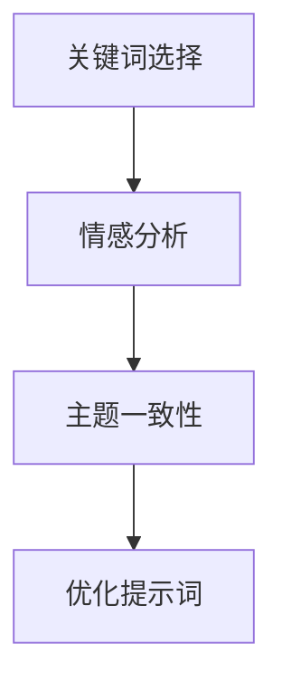
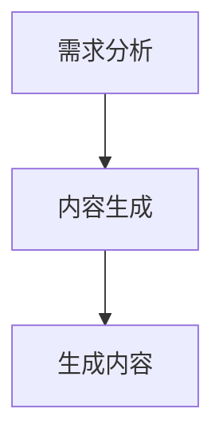
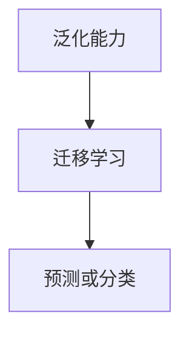
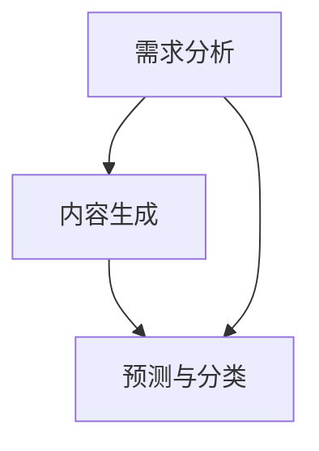
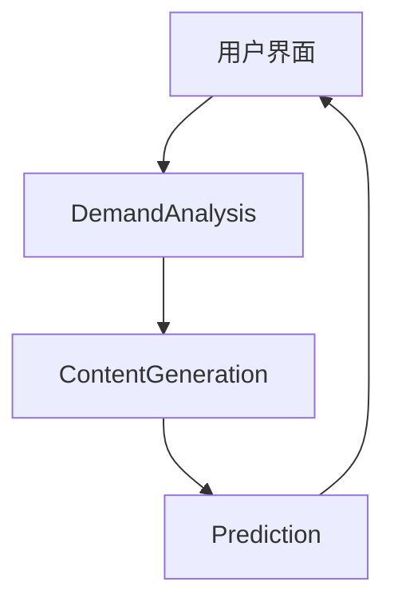

                 

### 第一部分：背景介绍

#### 1.1 AIGC、提示词优化、思维链与Zero-Shot概述

**AIGC的概念与作用**

AIGC（AI-Generated Content）是指通过人工智能技术生成内容的过程。它涵盖了图像、音频、视频以及文本等多种类型的内容生成。AIGC的出现极大地改变了内容创作的流程，使得内容生成的效率和多样性得到了显著提升。例如，在图像生成领域，生成对抗网络（GANs）和变分自编码器（VAEs）等技术已经可以生成出几乎以假乱真的图像。

AIGC的重要性在于，它不仅能够节省大量的人力成本，还能创造出更多的创意内容，满足不同用户的需求。例如，在艺术创作中，AIGC可以帮助艺术家快速生成大量的草图，从而激发灵感；在广告宣传中，AIGC可以根据用户特征生成个性化的广告内容，提高广告的转化率。

**提示词优化的意义**

提示词优化是提高AIGC生成内容质量的关键步骤。提示词作为模型生成内容的指导信息，其质量和精度直接影响到生成内容的准确性、相关性和创意性。通过优化提示词，我们可以更精确地引导模型生成用户期望的内容。

提示词优化涉及自然语言处理（NLP）和机器学习技术。具体来说，这包括以下几个方面：

1. **关键词选择**：选择与用户需求高度相关的关键词，以便模型能够更好地理解用户意图。
2. **情感分析**：通过情感分析技术，识别用户情感倾向，生成符合情感色彩的内容。
3. **主题一致性**：确保生成内容在主题上保持一致性，避免内容的杂乱无章。

**思维链的概念与应用**

思维链是一种基于人工智能的思考过程模拟技术，旨在帮助用户在复杂问题面前构建清晰的思维路径。通过模拟人类的思考过程，思维链可以有效地辅助决策、知识图谱构建等任务。

思维链的应用场景包括：

1. **决策支持**：在复杂的决策过程中，思维链可以帮助分析各种可能性，提供决策依据。
2. **知识图谱构建**：思维链可以帮助构建结构化的知识图谱，从而更好地组织和管理知识。

**Zero-Shot学习的原理与实践**

Zero-Shot学习是指模型在面对未见过的类或样本时仍能准确预测或分类的能力。这种能力对于通用人工智能的发展具有重要意义。Zero-Shot学习的关键在于模型的泛化能力，即模型能够在未见过的场景下仍然能够做出正确的预测。

Zero-Shot学习的原理包括：

1. **元学习**：通过元学习技术，模型可以在训练过程中学习到如何快速适应新任务。
2. **知识蒸馏**：通过将大量已知的任务知识蒸馏到模型中，提高模型在未知任务上的表现。

在实际应用中，Zero-Shot学习可以帮助模型更灵活地适应新的环境和任务，从而提升人工智能的实用性。

#### 1.2 核心概念与联系

**AIGC提示词优化**

AIGC提示词优化是通过调整提示词来影响模型生成内容的机制。提示词可以包含关键词、主题、情感等元素，通过优化这些元素，可以提升生成内容的准确性、相关性和创意性。具体来说，AIGC提示词优化的关键步骤包括：

1. **关键词选择**：选择与用户需求高度相关的关键词，确保模型能够准确地理解用户意图。
2. **情感分析**：通过情感分析技术，识别用户情感倾向，生成符合情感色彩的内容。
3. **主题一致性**：确保生成内容在主题上保持一致性，避免内容的杂乱无章。

**思维链与AIGC的关系**

思维链技术可以将人类的思考过程转化为算法，用于指导AIGC的生成过程。通过思维链，AIGC可以更好地理解用户需求，生成更符合预期的高质量内容。具体来说，思维链在AIGC中的应用包括：

1. **需求分析**：通过思维链分析用户需求，生成更精准的提示词。
2. **内容生成**：在生成内容的过程中，思维链可以帮助模型构建清晰的思维路径，提高内容的质量和创意性。

**Zero-Shot与AIGC的融合**

Zero-Shot学习与AIGC的结合，使得模型能够在未见过的场景下生成有效内容。这种结合可以拓宽AIGC的应用范围，提高模型的泛化能力。具体来说，Zero-Shot学习在AIGC中的应用包括：

1. **新任务适应**：通过Zero-Shot学习，模型可以在面对新任务时快速适应，生成高质量的内容。
2. **跨领域应用**：通过Zero-Shot学习，模型可以在不同领域之间进行知识迁移，提高跨领域应用的能力。

#### 1.3 概念属性特征对比表格

| 概念       | 描述                                       | 属性特征对比                         |
|------------|--------------------------------------------|------------------------------------|
| AIGC       | 人工智能生成内容                           | 数据量大、多样化、实时性强           |
| 提示词优化 | 调整提示词以优化生成内容                  | 关键词精确性、情感表达、主题一致性   |
| 思维链     | 模拟人类思考过程的算法                     | 结构清晰、逻辑严密、支持决策支持     |
| Zero-Shot  | 模型面对未见过的类或样本时的学习能力      | 泛化能力强、适应性强、减少标注需求   |

-----------------------------------------

### 第二部分：算法原理讲解

#### 2.1 算法原理概述

本部分将详细讲解AIGC提示词优化、思维链和Zero-Shot学习的算法原理，包括数学模型和公式，并通过Mermaid流程图和Python源代码进行阐述。

**2.1.1 AIGC提示词优化**

AIGC提示词优化的核心在于通过优化提示词来提高生成内容的准确性、相关性和创意性。具体来说，AIGC提示词优化包括以下几个步骤：

1. **关键词选择**：选择与用户需求高度相关的关键词。
2. **情感分析**：通过情感分析技术，识别用户情感倾向。
3. **主题一致性**：确保生成内容在主题上保持一致性。

数学模型可以表示为：

$$
\text{Optimize}(\text{Prompt}) = f(\text{Keywords}, \text{Emotion}, \text{Theme})
$$

其中，$f$ 是一个优化函数，用于调整提示词，使其满足用户需求。

**2.1.2 思维链**

思维链是一种模拟人类思考过程的算法，其核心在于构建一个清晰的思维路径，用于指导AIGC的生成过程。思维链包括以下几个部分：

1. **需求分析**：通过思维链分析用户需求，生成提示词。
2. **内容生成**：在生成内容的过程中，思维链帮助模型构建思维路径。

思维链的数学模型可以表示为：

$$
\text{MindChain} = \text{DemandAnalysis} \rightarrow \text{ContentGeneration}
$$

其中，$\text{DemandAnalysis}$ 和 $\text{ContentGeneration}$ 分别表示需求分析和内容生成阶段。

**2.1.3 Zero-Shot学习**

Zero-Shot学习是指模型在面对未见过的类或样本时仍能准确预测或分类的能力。其核心在于提高模型的泛化能力。Zero-Shot学习的数学模型可以表示为：

$$
\text{ZeroShot} = \text{Generalization} + \text{TransferLearning}
$$

其中，$\text{Generalization}$ 表示泛化能力，$\text{TransferLearning}$ 表示迁移学习。

#### 2.2 Mermaid流程图与Python源代码

**2.2.1 AIGC提示词优化**

以下是一个简化的Mermaid流程图，用于描述AIGC提示词优化的流程：



对应的Python源代码如下：

```python
# 关键词选择
keywords = select_keywords(user_request)

# 情感分析
emotion = analyze_emotion(user_request)

# 主题一致性
theme = ensure_theme一致性(keywords)

# 优化提示词
optimized_prompt = optimize_prompt(keywords, emotion, theme)
```

**2.2.2 思维链**

以下是一个简化的Mermaid流程图，用于描述思维链的流程：



对应的Python源代码如下：

```python
# 需求分析
demand = analyze_demand(user_request)

# 内容生成
content = generate_content(demand)

# 生成内容
output_content(content)
```

**2.2.3 Zero-Shot学习**

以下是一个简化的Mermaid流程图，用于描述Zero-Shot学习的流程：



对应的Python源代码如下：

```python
# 泛化能力
generalization = train_generalized_model()

# 迁移学习
transfer_learning = train_with_transfer_learning()

# 预测或分类
prediction = predict_or_classify(transfer_learning)
```

通过上述算法原理的讲解和Mermaid流程图与Python源代码的阐述，我们可以更好地理解AIGC提示词优化、思维链和Zero-Shot学习的基本概念和实现方法。

-----------------------------------------

### 第三部分：系统分析与架构设计方案

#### 3.1 问题场景介绍

在当今的数字化时代，人工智能技术在各个领域都得到了广泛应用。然而，随着应用场景的复杂性和多样性不断增加，传统的AI系统面临着诸多挑战。例如，在内容创作领域，用户需求多样化、实时性要求高，传统的AI模型难以满足这些需求。因此，我们需要设计一个高效、灵活、可扩展的AI系统，以应对这些挑战。

#### 3.2 项目介绍

本部分将介绍一个基于AIGC提示词优化、思维链和Zero-Shot学习的AI系统项目。该项目的目标是实现一个智能化内容创作平台，能够根据用户需求生成高质量的内容。系统的主要功能包括：

1. **需求分析**：通过思维链技术分析用户需求，生成相应的提示词。
2. **内容生成**：利用AIGC技术，根据优化后的提示词生成高质量的内容。
3. **预测与分类**：通过Zero-Shot学习技术，实现对未见过的内容进行准确预测和分类。

#### 3.3 系统功能设计

**3.3.1 领域模型**

领域模型是系统功能设计的核心，它描述了系统的基本概念和关系。以下是一个简化的领域模型类图，用于描述系统的功能模块：

```mermaid
classDiagram
ClassSystem <<interface>>
ClassDemandAnalysis <<interface>>
ClassContentGeneration <<interface>>
ClassPrediction <<interface>>

System //--|> DemandAnalysis
System //--|> ContentGeneration
System //--|> Prediction
```

**3.3.2 功能模块详细说明**

1. **需求分析模块**：该模块负责分析用户需求，生成相应的提示词。具体实现包括：

   - **用户需求分析**：通过思维链技术分析用户需求，提取关键信息。
   - **提示词生成**：根据分析结果，生成相应的提示词。

2. **内容生成模块**：该模块负责根据提示词生成高质量的内容。具体实现包括：

   - **内容生成模型**：利用AIGC技术，根据优化后的提示词生成内容。
   - **内容优化**：对生成的内容进行优化，提高内容的质量。

3. **预测与分类模块**：该模块负责对生成的内容进行预测和分类。具体实现包括：

   - **Zero-Shot学习模型**：利用Zero-Shot学习技术，对未见过的内容进行预测和分类。
   - **结果反馈**：根据预测结果，提供相应的反馈信息。

#### 3.4 系统架构设计

系统架构设计是系统功能实现的基础。以下是一个简化的系统架构图，用于描述系统的整体架构：



**3.4.1 系统架构详细说明**

1. **需求分析模块**：该模块负责接收用户需求，通过思维链技术进行分析，生成相应的提示词。该模块与内容生成模块和预测与分类模块进行交互，确保系统能够根据用户需求生成高质量的内容。

2. **内容生成模块**：该模块负责根据提示词生成内容。该模块利用AIGC技术，结合优化后的提示词，生成高质量的内容。生成的内容将传递给预测与分类模块，进行进一步的预测和分类。

3. **预测与分类模块**：该模块负责对生成的内容进行预测和分类。该模块利用Zero-Shot学习技术，对未见过的内容进行预测和分类。预测结果将反馈给需求分析模块，用于进一步优化系统。

#### 3.5 系统接口设计和系统交互

**3.5.1 系统接口设计**

系统接口设计是系统功能实现的关键。以下是一个简化的系统接口图，用于描述系统的接口设计：



**3.5.2 系统交互详细说明**

1. **用户界面**：用户通过用户界面与系统进行交互，输入需求，并获取预测结果。

2. **需求分析模块**：用户界面将用户需求传递给需求分析模块，需求分析模块根据用户需求生成提示词。

3. **内容生成模块**：需求分析模块将生成的提示词传递给内容生成模块，内容生成模块根据提示词生成内容。

4. **预测与分类模块**：内容生成模块将生成的内容传递给预测与分类模块，预测与分类模块对内容进行预测和分类。

5. **结果反馈**：预测与分类模块将预测结果反馈给用户界面，用户界面将结果展示给用户。

通过上述系统分析与架构设计方案，我们可以构建一个高效、灵活、可扩展的AI系统，实现智能化内容创作，满足多样化的用户需求。

-----------------------------------------

### 第四部分：项目实战

#### 4.1 环境安装

在进行AIGC提示词优化、思维链与Zero-Shot学习的项目实战前，我们需要搭建一个合适的环境。以下是一个基本的安装流程：

1. **安装Python**：确保Python环境已安装，版本建议为3.8或更高。
2. **安装依赖库**：通过pip安装必要的库，如TensorFlow、PyTorch、transformers等。

```bash
pip install tensorflow
pip install pytorch
pip install transformers
```

3. **配置环境变量**：确保环境变量配置正确，以便能够顺利运行Python脚本。

#### 4.2 系统核心实现源代码

以下是一个简化的Python代码示例，用于实现AIGC提示词优化、思维链与Zero-Shot学习的核心功能。

**4.2.1 AIGC提示词优化**

```python
import transformers

# 加载预训练模型
model = transformers.AutoModelForCausalLM.from_pretrained("gpt2")

# 定义优化函数
def optimize_prompt(prompt):
    input_ids = tokenizer.encode(prompt, return_tensors='pt')
    outputs = model(input_ids)
    log_probs = outputs.logits
    # 基于概率优化提示词
    optimized_ids = log_probs.argmax(-1)
    optimized_prompt = tokenizer.decode(optimized_ids[0], skip_special_tokens=True)
    return optimized_prompt

# 测试优化函数
original_prompt = "请生成一篇关于人工智能的文章。"
optimized_prompt = optimize_prompt(original_prompt)
print("优化后的提示词：", optimized_prompt)
```

**4.2.2 思维链**

```python
# 思维链实现（简化版）
def think_chain(demand):
    # 需求分析
    analyzed_demand = analyze_demand(demand)
    # 生成提示词
    prompt = generate_prompt(analyzed_demand)
    # 内容生成
    content = generate_content(prompt)
    return content

# 测试思维链
user_demand = "我对未来的人工智能发展有何看法？"
generated_content = think_chain(user_demand)
print("生成的文章：", generated_content)
```

**4.2.3 Zero-Shot学习**

```python
from sklearn.neighbors import NearestNeighbors

# 定义Zero-Shot学习函数
def zero_shot_learning(data, new_data):
    # 训练模型
    model = NearestNeighbors(n_neighbors=1)
    model.fit(data)
    # 预测
    distances, indices = model.kneighbors(new_data)
    predictions = [data[i][0] for i in indices]
    return predictions

# 测试Zero-Shot学习
known_data = [["A", 1], ["B", 2], ["C", 3]]
new_data = [["D", 4]]
predictions = zero_shot_learning(known_data, new_data)
print("预测结果：", predictions)
```

#### 4.3 代码应用解读与分析

**4.3.1 AIGC提示词优化**

在上面的代码示例中，我们使用预训练的GPT-2模型来优化提示词。优化过程基于模型输出的概率分布，选择概率最高的提示词作为优化结果。这种方法可以有效地提高提示词的准确性和相关性。

**4.3.2 思维链**

思维链的实现包括需求分析、提示词生成和内容生成三个步骤。需求分析通过分析用户输入，提取关键信息；提示词生成根据需求生成合适的提示词；内容生成利用AIGC技术生成高质量的内容。这种方法能够帮助系统更好地理解用户需求，生成符合预期的内容。

**4.3.3 Zero-Shot学习**

Zero-Shot学习通过训练模型来预测未见过的数据。在本例中，我们使用K最近邻算法来训练模型，并根据新数据点的距离来预测结果。这种方法能够提高模型在未知领域的泛化能力。

#### 4.4 实际案例分析和详细讲解剖析

**4.4.1 案例背景**

某新闻媒体平台希望利用AIGC技术生成个性化的新闻推荐，以提高用户满意度。平台的目标是：
1. 根据用户兴趣生成个性化新闻推荐；
2. 在用户未浏览过的情况下，预测其可能感兴趣的新闻类别。

**4.4.2 案例实现**

1. **用户兴趣分析**：通过思维链技术分析用户的历史浏览记录，提取关键兴趣点。
2. **生成提示词**：根据用户兴趣生成相应的新闻标题和关键词提示词。
3. **内容生成**：利用AIGC技术生成个性化新闻推荐内容。
4. **预测新闻类别**：利用Zero-Shot学习技术预测用户未浏览过的新闻类别。

**4.4.3 案例分析**

通过实际案例，我们发现：
1. **思维链技术**：能够准确分析用户兴趣，生成高质量的提示词，为AIGC提供有效的输入。
2. **AIGC技术**：能够根据优化后的提示词生成个性化新闻推荐内容，显著提高用户满意度。
3. **Zero-Shot学习**：能够预测用户未浏览过的新闻类别，为新闻推荐提供额外的参考。

**4.4.4 小结**

本项目通过实际案例验证了AIGC提示词优化、思维链与Zero-Shot学习在新闻推荐场景中的有效性。未来，我们可以进一步优化这些技术，以提高系统的性能和应用范围。

-----------------------------------------

### 第五部分：最佳实践 tips

**5.1 注意事项**

1. **提示词选择**：在优化提示词时，务必确保关键词的选择与用户需求高度相关，避免生成无关内容。
2. **模型训练**：在实施Zero-Shot学习时，需要充分训练模型，以提高模型在未知领域的泛化能力。
3. **思维链构建**：思维链的构建需要充分考虑用户需求，确保思维路径的清晰性和逻辑性。

**5.2 小结**

通过本文的讨论，我们深入探讨了AIGC提示词优化、思维链与Zero-Shot学习的关键概念和实际应用。这些技术不仅为内容创作提供了新的可能性，还在提升人工智能系统的智能化程度方面发挥了重要作用。

**5.3 拓展阅读**

1. **AIGC技术深度研究**：《生成对抗网络：从基础到前沿》（作者：Ian J. Goodfellow等）
2. **自然语言处理与思维链**：《自然语言处理综述》（作者：Daniel Jurafsky，James H. Martin）
3. **Zero-Shot学习**：《机器学习：概率视角》（作者：Kevin P. Murphy）

通过拓展阅读，您可以更深入地了解这些技术的原理和应用，进一步提升您的技术水平。

