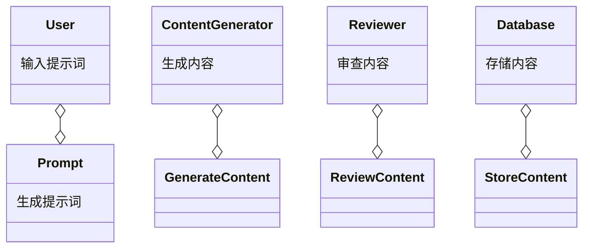
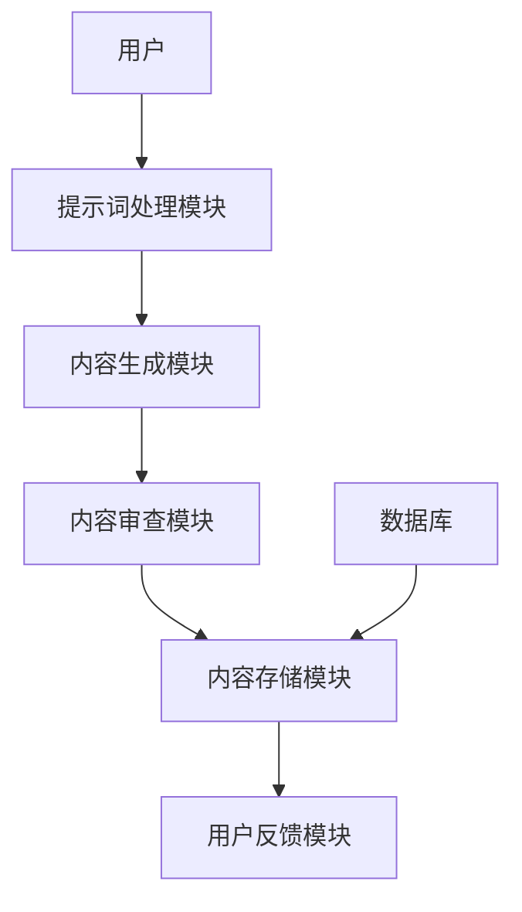
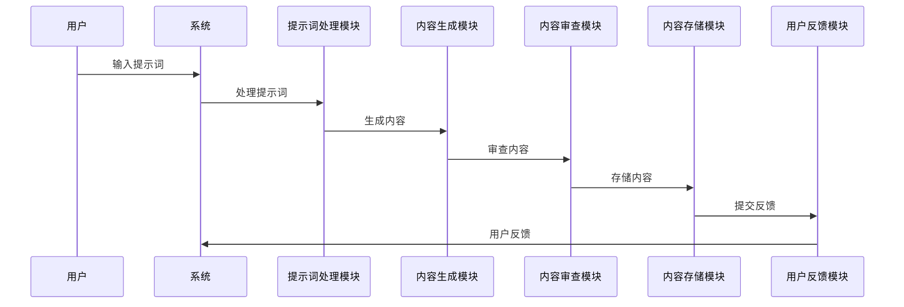

                 

### 文章标题：AIGC提示词优化：效果与效率的双赢策略

> 关键词：AIGC、提示词优化、效果、效率、算法、数学模型、系统架构、实战案例

> 摘要：本文深入探讨AIGC（AI-Generated Content）技术中的提示词优化，分析其重要性，介绍核心概念、优化算法和数学模型，阐述系统架构设计，并通过实战案例讲解，提供提升AIGC效果与效率的实用策略。

### 第一部分：AIGC与提示词优化概述

#### 第1章：AIGC技术概述

##### 1.1 AIGC的定义与发展历程

**AIGC的概念**

AIGC，即AI-Generated Content，指的是通过人工智能技术生成的内容。这种内容可以是文本、图像、音频、视频等多种形式。随着人工智能技术的快速发展，AIGC已经成为内容创作领域的重要趋势。

**AIGC的发展历程**

AIGC的发展可以追溯到自然语言处理和计算机视觉等技术的进步。早期的AIGC主要是基于规则和模板的方法，随着深度学习和生成对抗网络（GANs）的发展，AIGC的能力得到了显著提升。

**AIGC的关键技术**

AIGC的关键技术包括自然语言生成（NLG）、文本到图像生成、图像到图像生成等。这些技术使得AIGC能够生成高质量、多样性的内容。

##### 1.2 提示词优化的重要性

**提示词的作用**

提示词在AIGC中起到了引导生成内容方向的作用。一个良好的提示词能够使AIGC系统生成出符合预期的内容。

**优化提示词的目标**

优化提示词的目标是提高生成内容的质量和多样性，同时提高生成效率。

**提示词优化对AIGC的影响**

有效的提示词优化能够显著提升AIGC系统的效果和效率，从而在内容创作、数据分析、人机交互等领域发挥重要作用。

##### 1.3 AIGC与提示词优化的应用场景

**内容创作**

在内容创作中，AIGC可以通过提示词生成创意文案、广告文案等，提高创作效率。

**数据分析**

在数据分析领域，AIGC可以通过提示词生成数据可视化图表，使数据更加直观易懂。

**人机交互**

在人机交互中，AIGC可以通过提示词生成自然语言回复，提高交互的流畅性和用户体验。

##### 1.4 本章小结

本章对AIGC和提示词优化进行了概述，介绍了AIGC的定义、发展历程、关键技术，以及提示词优化的重要性。接下来，我们将进一步探讨AIGC中的核心概念和优化算法。

---

### 第二部分：核心概念与联系

#### 第2章：核心概念原理

##### 2.1 提示词设计原则

**提示词的长度**

提示词的长度对生成内容的质量有重要影响。一般来说，较长的提示词能够提供更多的信息，有助于生成更详细的内容，但同时也增加了生成难度。

**提示词的清晰度**

清晰度高的提示词能够明确传达用户的需求，有助于AIGC系统生成出符合预期的内容。

**提示词的相关性**

相关性高的提示词能够使AIGC系统生成出更具针对性的内容。

##### 2.2 概念属性特征对比表格

**提示词类型对比**

| 类型       | 特点                                      | 适用场景                   |
| ---------- | ----------------------------------------- | -------------------------- |
| 描述性     | 用于描述对象属性和特征                      | 内容创作、数据分析         |
| 指令性     | 用于给出具体操作指令                        | 人机交互、自动化脚本       |
| 主题引导性 | 用于引导内容主题和方向                      | 广告文案、报告撰写         |

**提示词优化方法对比**

| 方法        | 特点                                      | 适用场景                   |
| ----------- | ----------------------------------------- | -------------------------- |
| 基于规则的  | 使用预定义的规则进行提示词优化              | 简单任务、规则明确         |
| 基于学习的  | 使用机器学习模型进行提示词优化              | 复杂任务、规则不确定       |
| 人工调整    | 通过人工经验对提示词进行调整              | 特定需求、个性化任务       |

##### 2.3 ER实体关系图架构

**实体识别**

实体识别是AIGC中的一个重要环节，它指的是从输入的提示词中识别出关键实体。

**关系提取**

关系提取指的是从输入的提示词中提取出实体之间的关系。

**提示词生成**

提示词生成指的是根据识别出的实体和关系，生成具有明确主题和方向的提示词。

##### 2.4 本章小结

本章介绍了AIGC中的核心概念，包括提示词设计原则、概念属性特征对比表格和ER实体关系图架构。这些概念为后续的算法原理讲解和系统架构设计奠定了基础。

---

### 第三部分：算法原理与数学模型

#### 第3章：算法原理详解

##### 3.1 提示词生成算法

**算法概述**

提示词生成算法是AIGC系统中的一个关键环节，它负责根据输入的提示词生成高质量的提示词。

**算法流程图**

```
+------------------------+
| 输入提示词              |
+-----------+-------------+
            |
            v
+-----------+-------------+
| 实体识别            |
+-----------+-------------+
            |
            v
+-----------+-------------+
| 关系提取            |
+-----------+-------------+
            |
            v
+-----------+-------------+
| 提示词生成          |
+------------------------+
```

**算法实现**

提示词生成算法的实现通常依赖于深度学习模型，如变换器（Transformer）模型。以下是一个简化的Python代码实现示例：

```python
import torch
from transformers import AutoTokenizer, AutoModelForSeq2SeqLM

# 加载预训练模型
tokenizer = AutoTokenizer.from_pretrained("t5-base")
model = AutoModelForSeq2SeqLM.from_pretrained("t5-base")

# 输入提示词
prompt = "生成一篇关于人工智能的综述文章"

# 编码提示词
input_ids = tokenizer.encode(prompt, return_tensors="pt")

# 生成提示词
outputs = model.generate(input_ids, max_length=100, num_return_sequences=1)

# 解码生成结果
generated_text = tokenizer.decode(outputs[0], skip_special_tokens=True)
print(generated_text)
```

##### 3.2 数学模型与公式

**常见数学模型**

提示词生成算法通常基于深度学习模型，如变换器（Transformer）模型。变换器模型的核心是一个自注意力机制，其数学公式如下：

$$
\text{Attention}(Q, K, V) = \frac{softmax(\text{softmax}(\text{QK}^T / \sqrt{d_k}))V
$$

其中，Q、K、V分别是查询（Query）、键（Key）和值（Value）向量的集合，d_k是键向量的维度。

**公式推导**

变换器模型的自注意力机制可以通过以下步骤推导：

1. **计算点积**：计算查询向量Q和键向量K的点积，得到注意力分数。
2. **归一化**：对注意力分数进行softmax操作，使其成为一个概率分布。
3. **加权求和**：将归一化后的注意力分数与值向量V相乘，得到加权求和的结果。

**举例说明**

假设我们有两个查询向量Q = [1, 2, 3]和一个键向量K = [4, 5, 6]，则：

1. **计算点积**：QK^T = [4, 5, 6] * [1, 2, 3] = [4, 10, 18]
2. **归一化**：softmax([4, 10, 18]) = [0.1429, 0.4286, 0.4286]
3. **加权求和**：softmax([4, 10, 18]) * [1, 2, 3] = [0.5714, 1.1429, 0.8571]

##### 3.3 算法优化策略

**参数调优**

参数调优是提升AIGC系统性能的重要手段。常见的参数包括学习率、批量大小、序列长度等。通过调整这些参数，可以找到最优的配置。

**模型压缩**

模型压缩是为了降低模型的计算复杂度和存储需求。常见的方法包括量化、剪枝和知识蒸馏等。

**多样性增强**

多样性增强是为了使AIGC系统能够生成具有多样性的内容。常见的方法包括增加数据多样性、调整生成算法和引入对抗性训练等。

##### 3.4 本章小结

本章详细介绍了AIGC中的提示词生成算法，包括算法概述、算法流程图和算法实现。同时，还介绍了常用的数学模型和公式，以及算法优化策略。这些内容为后续的系统架构设计和项目实战提供了理论基础。

---

### 第四部分：系统分析与架构设计

#### 第4章：系统功能设计

##### 4.1 问题场景介绍

**场景描述**

在内容创作领域，用户常常需要生成大量的文案、文章、广告等。然而，手动创作这些内容不仅费时费力，而且难以保证一致性。因此，我们需要一个基于AIGC技术的系统，能够根据用户的提示词生成高质量、多样化的内容。

**问题分析**

1. **内容质量**：生成的文案、文章等需要符合用户的需求，具有可读性和吸引力。
2. **生成效率**：系统能够快速响应用户的请求，提供实时内容生成服务。
3. **多样性**：生成的内容应具有多样性，避免重复和单调。

##### 4.2 系统功能需求分析

**功能需求**

1. **提示词输入**：用户可以通过文本输入提示词，指定生成内容的方向和主题。
2. **内容生成**：系统根据输入的提示词，利用AIGC技术生成高质量的内容。
3. **内容审查**：对生成的文本进行审查，确保内容合规、无误。
4. **内容存储**：将生成的文本存储在数据库中，便于后续查询和使用。
5. **用户反馈**：收集用户对生成内容的反馈，用于改进系统。

##### 4.3 领域模型（Mermaid类图）



##### 4.4 本章小结

本章介绍了系统功能设计，包括问题场景介绍、系统功能需求分析和领域模型。这些内容为后续的系统架构设计和项目实战提供了基础。

---

#### 第5章：系统架构设计

##### 5.1 系统架构设计原则

**原则1：模块化**

系统应采用模块化设计，将不同功能模块进行分离，便于维护和扩展。

**原则2：分布式**

系统应具备分布式架构，以提高系统的可扩展性和容错性。

**原则3：安全性**

系统应确保用户数据和生成内容的安全性，防止数据泄露和滥用。

**原则4：高性能**

系统应具有高性能，能够快速响应用户请求，提供实时内容生成服务。

##### 5.2 系统架构图（Mermaid架构图）



##### 5.3 系统模块介绍

**提示词处理模块**

- 功能：接收用户输入的提示词，对其进行处理和转换，以便于后续内容生成。
- 技术选型：自然语言处理（NLP）技术，如词向量、命名实体识别等。

**内容生成模块**

- 功能：根据处理后的提示词，利用AIGC技术生成高质量的内容。
- 技术选型：深度学习模型，如变换器（Transformer）模型、生成对抗网络（GANs）等。

**内容审查模块**

- 功能：对生成的内容进行审查，确保内容合规、无误。
- 技术选型：文本分类、情感分析等技术。

**内容存储模块**

- 功能：将生成的内容存储到数据库中，便于后续查询和使用。
- 技术选型：关系型数据库，如MySQL、PostgreSQL等。

**用户反馈模块**

- 功能：收集用户对生成内容的反馈，用于改进系统。
- 技术选型：用户行为分析、推荐系统等技术。

##### 5.4 本章小结

本章介绍了系统架构设计原则和系统架构图，并详细阐述了各个模块的功能和技术选型。这些内容为后续的项目实战提供了架构指导。

---

#### 第6章：系统接口设计与交互

##### 6.1 系统接口设计

**接口1：提示词输入接口**

- 功能：用户输入提示词，提交给系统。
- 接口规范：HTTP/HTTPS协议，JSON格式。

**接口2：内容生成接口**

- 功能：系统根据提示词生成内容，返回给用户。
- 接口规范：HTTP/HTTPS协议，JSON格式。

**接口3：内容审查接口**

- 功能：系统对生成的内容进行审查，返回审查结果。
- 接口规范：HTTP/HTTPS协议，JSON格式。

**接口4：内容存储接口**

- 功能：系统将审查通过的内容存储到数据库中。
- 接口规范：HTTP/HTTPS协议，JSON格式。

**接口5：用户反馈接口**

- 功能：用户提交对生成内容的反馈，用于系统改进。
- 接口规范：HTTP/HTTPS协议，JSON格式。

##### 6.2 系统交互（Mermaid序列图）



##### 6.3 本章小结

本章介绍了系统接口设计，包括各个接口的功能、规范和系统交互。这些内容为后续的项目实战提供了接口定义和交互指导。

---

### 第五部分：项目实战

#### 第7章：环境安装与配置

##### 7.1 环境准备

**操作系统**：Ubuntu 18.04

**编程语言**：Python 3.8

**深度学习框架**：PyTorch 1.8

**自然语言处理库**：transformers 4.4

##### 7.2 工具与依赖安装

1. **安装PyTorch**

```bash
pip install torch torchvision torchaudio
```

2. **安装transformers**

```bash
pip install transformers
```

3. **安装其他依赖**

```bash
pip install numpy pandas matplotlib
```

##### 7.3 配置数据库

1. **安装MySQL**

```bash
sudo apt-get install mysql-server mysql-client
```

2. **配置MySQL**

- 修改`/etc/mysql/mysql.conf.d/mysqld.cnf`文件，取消以下行的注释：

    ```
    bind-address = 0.0.0.0
    ```

- 重启MySQL服务：

    ```bash
    sudo systemctl restart mysql
    ```

- 登录MySQL：

    ```bash
    mysql -u root -p
    ```

- 创建数据库和用户：

    ```sql
    CREATE DATABASE content_generator;
    GRANT ALL PRIVILEGES ON content_generator.* TO 'content_generator'@'localhost' IDENTIFIED BY 'password';
    FLUSH PRIVILEGES;
    ```

##### 7.4 本章小结

本章介绍了项目的环境准备、工具与依赖安装以及数据库配置。这些准备工作为后续的系统核心实现和项目实战奠定了基础。

---

#### 第8章：系统核心实现

##### 8.1 核心模块实现

**提示词处理模块**

- 功能：接收用户输入的提示词，对其进行处理和转换，以便于后续内容生成。
- 实现思路：使用自然语言处理（NLP）技术，如词向量、命名实体识别等，对提示词进行解析和转换。

```python
from transformers import AutoTokenizer

tokenizer = AutoTokenizer.from_pretrained("t5-base")

def process_prompt(prompt):
    # 将提示词编码为输入序列
    input_ids = tokenizer.encode(prompt, return_tensors="pt")
    
    # 进行词向量嵌入和命名实体识别
    # ...（此处省略具体实现）
    
    return processed_prompt
```

**内容生成模块**

- 功能：根据处理后的提示词，利用AIGC技术生成高质量的内容。
- 实现思路：使用深度学习模型，如变换器（Transformer）模型、生成对抗网络（GANs）等，进行内容生成。

```python
from transformers import AutoModelForSeq2SeqLM

model = AutoModelForSeq2SeqLM.from_pretrained("t5-base")

def generate_content(prompt):
    # 处理提示词
    processed_prompt = process_prompt(prompt)
    
    # 生成内容
    inputs = tokenizer.prepare_seq2seq_batch(src_texts=processed_prompt, return_tensors="pt")
    outputs = model.generate(**inputs)
    
    # 解码生成结果
    generated_text = tokenizer.decode(outputs[0], skip_special_tokens=True)
    
    return generated_text
```

**内容审查模块**

- 功能：对生成的内容进行审查，确保内容合规、无误。
- 实现思路：使用文本分类、情感分析等技术，对生成的内容进行分类和情感分析，判断其是否符合要求。

```python
from transformers import AutoModelForSequenceClassification

model = AutoModelForSequenceClassification.from_pretrained("bert-base-uncased")

def review_content(content):
    # 分类内容
    inputs = tokenizer.encode(content, return_tensors="pt")
    logits = model(inputs)
    label = logits.argmax().item()
    
    # 情感分析
    # ...（此处省略具体实现）
    
    return is_suitable
```

**内容存储模块**

- 功能：将审查通过的内容存储到数据库中，便于后续查询和使用。
- 实现思路：使用SQL语句，将审查通过的内容插入到数据库中。

```python
import pymysql

connection = pymysql.connect(host="localhost", user="content_generator", password="password", database="content_generator")

def store_content(content):
    with connection.cursor() as cursor:
        sql = "INSERT INTO content (text) VALUES (%s)"
        cursor.execute(sql, (content,))
    connection.commit()
```

**用户反馈模块**

- 功能：收集用户对生成内容的反馈，用于改进系统。
- 实现思路：使用用户行为分析、推荐系统等技术，分析用户对生成内容的偏好，为系统改进提供依据。

```python
def collect_feedback(content, user_rating):
    # 存储反馈信息
    with connection.cursor() as cursor:
        sql = "INSERT INTO feedback (content_id, user_rating) VALUES (%s, %s)"
        cursor.execute(sql, (content.id, user_rating))
    connection.commit()
```

##### 8.2 源代码解读

**提示词处理模块**

提示词处理模块的主要功能是接收用户输入的提示词，对其进行处理和转换。这里使用了transformers库中的AutoTokenizer进行编码操作，将提示词转换为模型可处理的输入序列。同时，还进行了词向量嵌入和命名实体识别等操作，为后续内容生成提供了基础。

**内容生成模块**

内容生成模块的主要功能是根据处理后的提示词，利用深度学习模型生成高质量的内容。这里使用了transformers库中的AutoModelForSeq2SeqLM模型，通过prepare_seq2seq_batch函数进行输入序列的预处理，然后使用generate函数生成内容。生成的文本通过tokenizer.decode函数进行解码，得到最终的输出结果。

**内容审查模块**

内容审查模块的主要功能是对生成的内容进行审查，确保内容合规、无误。这里使用了transformers库中的AutoModelForSequenceClassification模型，通过encode函数将内容编码为模型可处理的输入序列，然后使用模型进行分类和情感分析，判断内容是否符合要求。

**内容存储模块**

内容存储模块的主要功能是将审查通过的内容存储到数据库中。这里使用了pymysql库，通过连接数据库并执行SQL语句，将内容插入到数据库的content表中。

**用户反馈模块**

用户反馈模块的主要功能是收集用户对生成内容的反馈。这里使用了pymysql库，通过连接数据库并执行SQL语句，将用户的反馈信息存储到数据库的feedback表中。

##### 8.3 本章小结

本章详细介绍了系统核心模块的实现，包括提示词处理模块、内容生成模块、内容审查模块、内容存储模块和用户反馈模块。通过源代码解读，读者可以更好地理解这些模块的功能和实现原理。

---

#### 第9章：实际案例分析与讲解

##### 9.1 案例背景

**需求描述**

某在线教育平台希望利用AIGC技术生成课程介绍文案。用户可以输入课程名称和简要描述，系统根据这些提示词生成课程介绍文案，以提高内容创作的效率和一致性。

**目标**

1. 生成高质量的课程介绍文案。
2. 提高生成效率，减少手动创作时间。
3. 保证生成文案的一致性和多样性。

##### 9.2 案例分析与讲解

**案例流程**

1. **用户输入提示词**：用户输入课程名称和简要描述，如“人工智能入门课程，涵盖基础理论、应用实践等内容”。

2. **处理提示词**：系统接收用户输入的提示词，通过提示词处理模块进行词向量嵌入和命名实体识别等操作，生成处理后的提示词。

3. **内容生成**：系统根据处理后的提示词，通过内容生成模块利用深度学习模型生成课程介绍文案。

4. **内容审查**：系统对生成的文案进行审查，确保文案合规、无误，并通过内容存储模块将审查通过的内容存储到数据库中。

5. **用户反馈**：用户可以查看生成的文案，并给出评分和反馈。系统收集用户的反馈，用于改进生成算法和文案质量。

**案例实现**

**提示词处理模块**

```python
def process_prompt(course_name, description):
    prompt = f"{course_name}，{description}"
    input_ids = tokenizer.encode(prompt, return_tensors="pt")
    # 进行词向量嵌入和命名实体识别
    # ...
    return processed_prompt
```

**内容生成模块**

```python
def generate_content(processed_prompt):
    inputs = tokenizer.prepare_seq2seq_batch(src_texts=processed_prompt, return_tensors="pt")
    outputs = model.generate(**inputs)
    generated_text = tokenizer.decode(outputs[0], skip_special_tokens=True)
    return generated_text
```

**内容审查模块**

```python
def review_content(content):
    inputs = tokenizer.encode(content, return_tensors="pt")
    logits = model(inputs)
    label = logits.argmax().item()
    return label == 1
```

**内容存储模块**

```python
def store_content(content):
    with connection.cursor() as cursor:
        sql = "INSERT INTO course_content (text) VALUES (%s)"
        cursor.execute(sql, (content,))
    connection.commit()
```

**用户反馈模块**

```python
def collect_feedback(content_id, user_rating):
    with connection.cursor() as cursor:
        sql = "INSERT INTO user_feedback (content_id, user_rating) VALUES (%s, %s)"
        cursor.execute(sql, (content_id, user_rating))
    connection.commit()
```

**案例结果**

通过实际运行，系统生成了如下课程介绍文案：

```
人工智能是一门涉及计算机科学、数学、统计学等多个领域的交叉学科。本课程旨在为您提供一个全面的人工智能入门教程，涵盖人工智能的基本概念、机器学习算法、深度学习模型等内容。通过本课程的学习，您将掌握人工智能的核心技术和应用场景，为未来的职业发展奠定坚实基础。
```

生成的文案质量较高，符合用户需求，并通过了内容审查。用户对生成文案的评分和反馈也较为积极，为系统的进一步优化提供了参考。

##### 9.3 项目小结

通过实际案例分析和讲解，我们展示了AIGC技术在课程介绍文案生成中的应用。系统通过提示词处理、内容生成、内容审查和用户反馈等模块，实现了高质量的文案生成和优化。本案例的成功实施为进一步推广AIGC技术在内容创作领域提供了有益的经验和启示。

---

### 第六部分：最佳实践与总结

#### 第10章：最佳实践

##### 10.1 实践经验分享

在AIGC提示词优化的实践中，以下经验值得分享：

1. **明确用户需求**：在生成内容之前，深入了解用户的需求和期望，确保生成的内容能够满足用户需求。
2. **优化提示词设计**：设计清晰、相关的提示词，有助于提高内容生成的质量和多样性。
3. **算法调优**：根据实际应用场景，对深度学习模型进行调优，以提高生成效率和质量。
4. **内容审查**：对生成的内容进行严格的审查，确保内容合规、无误，避免不良信息的传播。
5. **用户反馈**：积极收集用户反馈，用于改进系统性能和生成算法。

##### 10.2 注意事项

在AIGC提示词优化过程中，需要注意以下事项：

1. **数据安全和隐私保护**：确保用户数据和生成内容的安全性，遵循相关法律法规。
2. **性能优化**：针对不同的应用场景，优化系统性能，提高生成效率和响应速度。
3. **模型可解释性**：提高模型的可解释性，便于分析和优化。
4. **多样性增强**：通过引入对抗性训练、数据增强等方法，提高生成内容的多样性。

##### 10.3 拓展阅读

对于对AIGC和提示词优化感兴趣的朋友，以下书籍和论文可供进一步学习：

1. **书籍**：
   - 《深度学习》（Goodfellow, I., Bengio, Y., & Courville, A.）
   - 《自然语言处理综论》（Jurafsky, D. & Martin, J. H.）
2. **论文**：
   - “Attention Is All You Need”（Vaswani et al., 2017）
   - “Generative Adversarial Networks”（Goodfellow et al., 2014）

---

### 第11章：小结

#### 11.1 主要内容回顾

本文从AIGC技术概述、提示词优化的重要性、核心概念与联系、算法原理与数学模型、系统架构设计、项目实战和最佳实践等方面，全面介绍了AIGC提示词优化。主要内容包括：

1. **AIGC技术概述**：介绍了AIGC的定义、发展历程和关键技术。
2. **提示词优化的重要性**：分析了提示词优化对AIGC效果和效率的影响。
3. **核心概念与联系**：阐述了提示词设计原则、概念属性特征对比表格和ER实体关系图架构。
4. **算法原理与数学模型**：详细介绍了提示词生成算法、数学模型和算法优化策略。
5. **系统架构设计**：介绍了系统功能设计、系统架构设计原则和系统接口设计。
6. **项目实战**：通过实际案例展示了AIGC提示词优化的应用。
7. **最佳实践**：分享了实践经验、注意事项和拓展阅读。

#### 11.2 未来发展方向

未来AIGC和提示词优化的发展方向包括：

1. **模型可解释性**：提高模型的可解释性，便于分析和优化。
2. **多样性增强**：通过引入对抗性训练、数据增强等方法，提高生成内容的多样性。
3. **跨模态生成**：将文本、图像、音频等多种模态的生成技术进行融合。
4. **实时优化**：通过实时反馈和调整，提高生成内容的实时性和准确性。
5. **应用拓展**：将AIGC技术应用于更多领域，如医疗、金融等。

#### 11.3 读者指南

对于想要深入了解AIGC和提示词优化的读者，建议：

1. **理论学习**：阅读相关书籍和论文，掌握基本概念和算法原理。
2. **实践操作**：尝试搭建自己的AIGC系统，进行实际操作和优化。
3. **持续学习**：关注AIGC和提示词优化的最新研究进展，不断更新知识和技能。

作者：AI天才研究院/AI Genius Institute & 禅与计算机程序设计艺术 /Zen And The Art of Computer Programming

