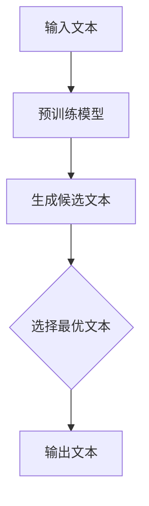
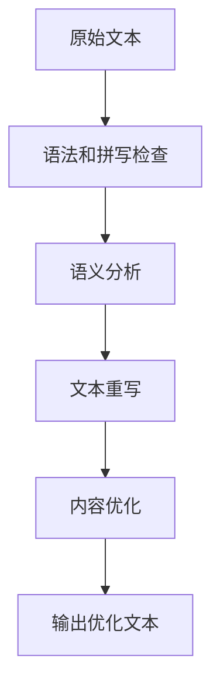
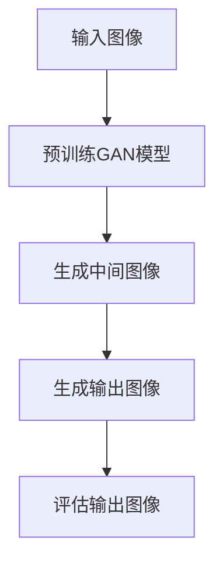
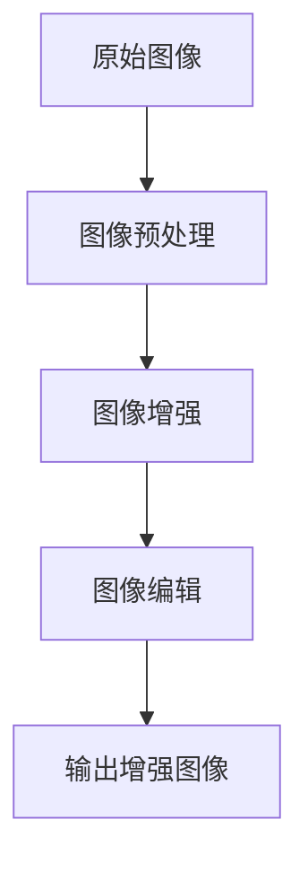
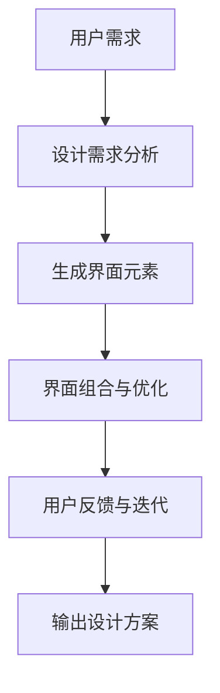
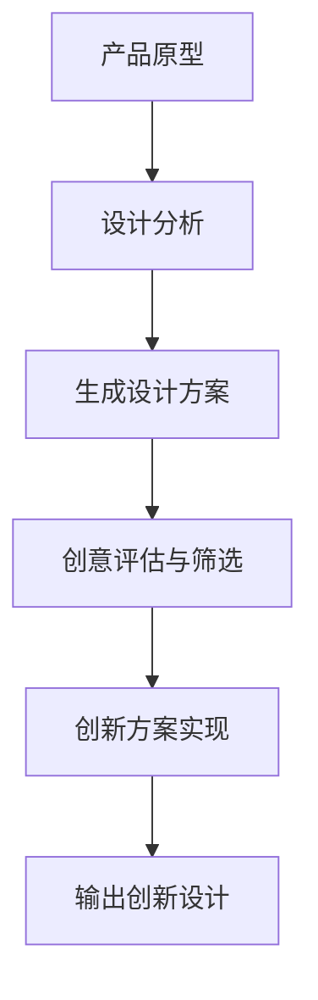
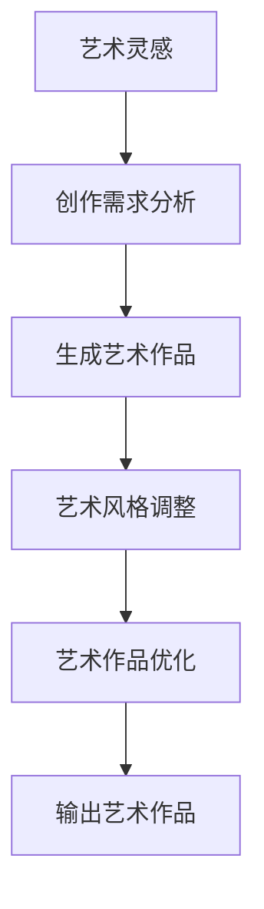
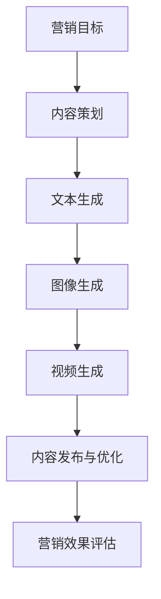
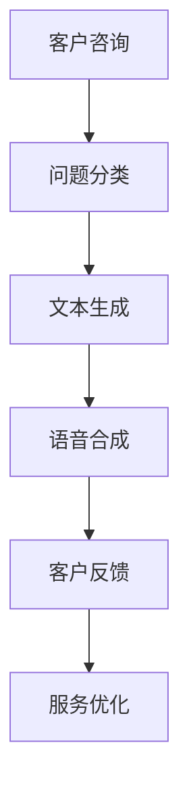
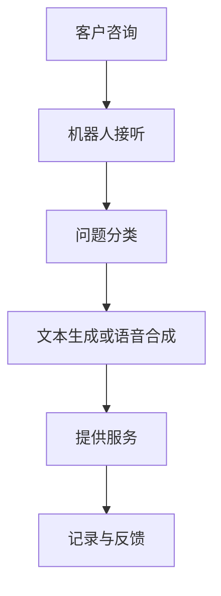

                 

### 第1章：AIGC概述

### 1.1 AIGC的概念与背景

**AIGC的定义**

AIGC，即AI-Generated Content，是指通过人工智能技术自动生成内容的过程。这一概念与传统的人工内容创作方式不同，它利用机器学习算法，特别是深度学习技术，模拟人类的创造力和逻辑推理能力，生成具有特定用途和风格的文本、图像、音频等多种形式的内容。

**AIGC的发展历程**

AIGC技术的发展可以追溯到上世纪80年代，当时研究人员开始探索如何利用计算机生成自然语言文本。此后，随着计算能力的提升和人工智能技术的进步，特别是生成对抗网络（GAN）和自然语言处理（NLP）技术的突破，AIGC技术逐渐从理论走向实际应用。

- **早期探索**：1980年代，早期的研究主要集中在规则驱动的文本生成，例如生成简单的新闻报道。
- **GAN与NLP技术引入**：2014年，生成对抗网络（GAN）的出现为图像生成带来了革命性的变化。随后，自然语言处理（NLP）技术的进步，使得文本生成变得更加复杂和自然。
- **近年发展**：近年来，随着GPT-3等大型语言模型的推出，AIGC技术进入了一个新的发展阶段，应用范围不断扩大，从文本生成扩展到图像、音频等多种形式的内容创作。

**AIGC的应用领域**

AIGC技术的应用非常广泛，涵盖了多个领域：

- **内容创作**：在文学、新闻、广告、剧本等创作领域中，AIGC技术能够高效地生成大量文本内容，节省人力和时间成本。
- **产品设计**：在产品设计过程中，AIGC可以帮助设计师生成多种设计方案，快速迭代和优化设计。
- **教育**：在教育领域，AIGC可以生成个性化学习材料，提高教育资源的利用效率。
- **娱乐**：在影视、游戏等领域，AIGC技术可以生成新的故事情节、角色设计和音效等元素，创造丰富的虚拟体验。

### 1.2 AIGC的核心技术与原理

**生成对抗网络（GAN）**

生成对抗网络（GAN）是由两部分组成：生成器（Generator）和判别器（Discriminator）。生成器的任务是生成尽可能逼真的数据，而判别器的任务是区分生成器和真实数据。GAN通过两个网络的对抗训练，最终使生成器能够生成高质量的数据。

- **基本结构**：GAN的基本结构可以用mermaid流程图表示：

  ```mermaid
  graph TD
  A[生成器] --> B[判别器]
  B --> C[损失函数]
  ```

- **GAN的工作原理**：

  1. 生成器生成一批数据。
 2. 判别器将生成器生成的数据和真实数据进行比较。
 3. 通过梯度下降算法，调整生成器的参数，使生成的数据越来越接近真实数据。
 4. 判别器同时调整参数，以更好地区分生成器和真实数据。
 5. 当生成器的生成数据达到一定程度时，判别器将无法区分生成的数据和真实数据。

**自然语言处理（NLP）**

自然语言处理（NLP）是计算机科学和人工智能领域中的一个重要分支，它致力于使计算机能够理解、生成和处理人类语言。在AIGC中，NLP技术被广泛应用于文本生成、文本编辑和文本理解等方面。

- **语言模型**：语言模型是NLP的核心技术之一，它通过学习大量文本数据，预测下一个词的概率分布。例如，GPT-3就是一种基于Transformer的预训练语言模型，它能够生成高质量的自然语言文本。

- **文本生成算法**：文本生成算法基于语言模型，通过输入一定长度的种子文本，生成新的文本。例如，GPT-3可以通过递归地生成新的词，从而生成一篇完整的文章。

**深度学习基础**

深度学习是机器学习的一个分支，它使用多层神经网络模型对数据进行分析和建模。在AIGC中，深度学习技术被广泛应用于图像生成、文本生成和语音合成等方面。

- **神经网络**：神经网络是由多个神经元组成的模型，每个神经元都与其他神经元相连，并通过权重传递信息。通过学习大量数据，神经网络可以提取数据中的特征，并进行分类或回归等操作。

- **卷积神经网络（CNN）**：卷积神经网络是一种专门用于图像处理和识别的神经网络，它通过卷积操作提取图像中的局部特征。

- **递归神经网络（RNN）**：递归神经网络是一种用于处理序列数据的神经网络，它通过递归结构对序列中的每个元素进行建模，并保持对之前信息的记忆。

### 1.3 AIGC的优势与挑战

**优势**

AIGC技术带来了许多优势：

- **高效的内容创作**：AIGC技术可以自动化内容创作过程，大大提高内容的生产效率。
- **创意激发**：AIGC技术可以帮助人类发现新的创意和灵感，促进创新。
- **个性化内容**：AIGC可以根据用户的需求和偏好，生成个性化的内容，提高用户体验。
- **资源节省**：AIGC技术可以减少人力和时间成本，降低生产成本。

**挑战**

然而，AIGC技术也面临一些挑战：

- **数据安全**：AIGC技术需要处理大量数据，如何确保数据的安全和保护是一个重要问题。
- **伦理问题**：AIGC技术的应用可能引发一系列伦理问题，如隐私、偏见和版权等。
- **质量控制**：如何保证AIGC生成的内容的准确性和可靠性，是一个亟待解决的问题。

### 第2章：AIGC在内容创作中的应用

### 2.1 文本生成与编辑

文本生成与编辑是AIGC在内容创作中的重要应用之一，通过机器学习算法，尤其是自然语言处理技术，AIGC可以生成和优化大量的文本内容。

#### 2.1.1 文本生成技术

文本生成技术是AIGC的核心组成部分，它利用预训练的语言模型和生成算法，生成具有连贯性和逻辑性的文本。以下是一个基于GPT-3的文本生成算法的mermaid流程图：



**GPT-3的工作原理**：

1. **预训练阶段**：GPT-3使用大量的文本数据进行预训练，学习语言的统计规律和语义信息。
2. **生成阶段**：给定一个种子文本，GPT-3通过递归地生成新的词，直到生成完整的文本。

**文本生成算法的应用场景**：

- **自动化写作**：例如，新闻、报告、论文等文档的自动生成。
- **聊天机器人**：生成对话文本，提供交互式服务。
- **创意内容生成**：例如，生成诗歌、故事、剧本等。

#### 2.1.2 文本编辑与优化

文本编辑与优化是通过对已有文本进行修改和改进，以提高文本的质量和吸引力。以下是一个文本编辑与优化的mermaid流程图：



**文本编辑与优化的步骤**：

1. **语法和拼写检查**：使用语法和拼写检查工具，修正文本中的错误。
2. **语义分析**：分析文本的语义结构，理解文本的主旨和逻辑关系。
3. **文本重写**：根据语义分析的结果，对文本进行重写，使其更加清晰、简洁。
4. **内容优化**：通过调整文本的结构和内容，提高文本的吸引力和可读性。

**文本编辑与优化的应用场景**：

- **内容审核**：自动检测和修改文本中的不当内容，确保内容的合规性。
- **营销文案优化**：优化广告语、宣传语等，提高营销效果。
- **文档编辑**：对学术文章、报告等进行编辑和优化，提高文档的质量。

### 2.2 图像生成与编辑

图像生成与编辑是AIGC在视觉内容创作中的关键应用，通过生成对抗网络（GAN）等技术，AIGC可以生成和编辑高质量、创意丰富的图像内容。

#### 2.2.1 图像生成技术

图像生成技术利用生成对抗网络（GAN）等深度学习算法，生成具有真实感的人造图像。以下是一个基于CycleGAN的图像生成算法的mermaid流程图：



**CycleGAN的工作原理**：

1. **预训练阶段**：CycleGAN使用大量的图像对进行预训练，学习图像内容到图像内容的映射。
2. **生成阶段**：给定一个输入图像，CycleGAN通过迭代地生成中间图像，最终生成输出图像。

**图像生成算法的应用场景**：

- **艺术创作**：生成独特的艺术作品，如油画、漫画等。
- **产品设计**：生成各种设计方案，辅助设计师进行创意设计。
- **虚拟现实**：生成虚拟场景和角色，提高虚拟现实体验的逼真度。

#### 2.2.2 图像编辑与增强

图像编辑与增强是对已有图像进行修改和优化，以改善其视觉效果或实现特定的创意效果。以下是一个图像编辑与增强的mermaid流程图：



**图像编辑与增强的步骤**：

1. **图像预处理**：对图像进行去噪、剪裁、调整大小等预处理操作。
2. **图像增强**：通过调整图像的亮度、对比度、饱和度等参数，改善图像的视觉效果。
3. **图像编辑**：使用各种图像编辑工具，对图像进行颜色调整、特效添加、修复等操作。

**图像编辑与增强的应用场景**：

- **图像修复**：修复图像中的破损、污渍等问题，恢复图像的原始状态。
- **图像美化**：对图像进行美化处理，提高图像的视觉效果。
- **图像风格转换**：将一种风格的图像转换为另一种风格，如将照片转换为油画风格。

### 2.3 媒体内容创作

媒体内容创作是AIGC在多媒体领域的重要应用，通过生成和编辑文本、图像、视频和音频等多种媒体内容，创造丰富多样的媒体体验。

#### 2.3.1 视频生成与编辑

视频生成与编辑是AIGC在媒体内容创作中的关键技术。通过生成对抗网络（GAN）和视频处理技术，AIGC可以生成和编辑高质量的视频内容。

**视频生成技术**：

- **视频生成算法**：使用生成对抗网络（GAN）等技术，生成新的视频内容。以下是一个基于VideoGAN的视频生成算法的mermaid流程图：

  ```mermaid
  graph TD
  A[输入视频] --> B[预训练VideoGAN模型]
  B --> C[生成中间视频]
  C --> D[生成输出视频]
  D --> E[评估输出视频]
  ```

- **视频生成应用场景**：例如，生成电影片段、广告视频、教育视频等。

**视频编辑技术**：

- **视频编辑算法**：通过视频编辑算法，对视频进行剪辑、特效添加、音频处理等操作。以下是一个基于DeepFlow的视频编辑算法的mermaid流程图：

  ```mermaid
  graph TD
  A[原始视频] --> B[视频预处理]
  B --> C[视频剪辑]
  C --> D[视频增强]
  D --> E[视频合成]
  E --> F[输出编辑视频]
  ```

- **视频编辑应用场景**：例如，电影剪辑、电视节目制作、直播内容编辑等。

#### 2.3.2 音频内容创作

音频内容创作是AIGC在音频领域的应用，通过生成和编辑音频内容，创造丰富多样的音频体验。

**音频生成技术**：

- **音频生成算法**：使用生成对抗网络（GAN）等技术，生成新的音频内容。以下是一个基于WaveGAN的音频生成算法的mermaid流程图：

  ```mermaid
  graph TD
  A[输入音频] --> B[预训练WaveGAN模型]
  B --> C[生成中间音频]
  C --> D[生成输出音频]
  D --> E[评估输出音频]
  ```

- **音频生成应用场景**：例如，生成音乐、语音合成、音频特效等。

**音频编辑技术**：

- **音频编辑算法**：通过音频编辑算法，对音频进行剪辑、音效添加、混音等操作。以下是一个基于SalientAudios的音频编辑算法的mermaid流程图：

  ```mermaid
  graph TD
  A[原始音频] --> B[音频预处理]
  B --> C[音频剪辑]
  C --> D[音频增强]
  D --> E[音频合成]
  E --> F[输出编辑音频]
  ```

- **音频编辑应用场景**：例如，音乐制作、广播制作、语音合成等。

### 第3章：AIGC在创意设计中的应用

#### 3.1 产品设计

AIGC技术在产品设计中的应用，不仅能够提高设计的效率，还能激发设计师的创意，创造出独特的产品体验。

**AIGC在产品界面设计中的应用**

AIGC可以通过生成对抗网络（GAN）和自然语言处理（NLP）技术，生成大量的界面设计方案，为设计师提供灵感。以下是一个AIGC在产品界面设计中的应用流程：



- **界面元素生成**：利用GAN技术，根据用户需求生成多种界面元素，如按钮、图标、菜单等。
- **界面组合与优化**：通过NLP技术，分析用户反馈和设计目标，优化界面元素的组合和布局。
- **用户反馈与迭代**：根据用户的使用反馈，对设计方案进行迭代优化，直至达到用户满意的效果。

**AIGC在产品设计创新中的应用**

AIGC技术在产品设计创新中，可以通过生成大量的设计方案，帮助设计师发现新的设计方向和创意。以下是一个AIGC在产品设计创新中的应用流程：



- **设计分析**：对现有的产品原型进行分析，确定设计改进的方向。
- **生成设计方案**：利用GAN技术生成多种设计方案，涵盖不同的设计风格和功能。
- **创意评估与筛选**：通过用户调研和专家评估，筛选出最具创新性和实用性的设计方案。
- **创新方案实现**：将筛选出的创新设计转化为实际的产品设计，进行原型制作和测试。

#### 3.2 艺术创作

AIGC技术在艺术创作中的应用，为艺术家提供了全新的创作手段和灵感来源。

**AIGC在艺术创作中的应用**

AIGC可以通过生成对抗网络（GAN）和自然语言处理（NLP）技术，生成各种形式的艺术作品，如绘画、音乐、视频等。以下是一个AIGC在艺术创作中的应用流程：



- **艺术灵感**：艺术家通过思考、观察和体验，获取创作灵感。
- **创作需求分析**：根据艺术灵感，分析创作需求，确定艺术作品的主题、风格和形式。
- **生成艺术作品**：利用GAN和NLP技术，生成符合创作需求的艺术作品。
- **艺术风格调整**：通过调整艺术作品的风格、色彩、构图等元素，使其更符合艺术家的审美要求。
- **艺术作品优化**：根据艺术家的反馈，对艺术作品进行优化和修改，直至达到满意的效果。
- **输出艺术作品**：将最终的艺术作品呈现给观众，进行展览或销售。

**AIGC与艺术的融合**

AIGC与艺术的融合，创造了新的艺术形式和体验。通过AIGC技术，艺术家可以探索前所未有的创作方式，创造出独特的艺术作品。以下是一个AIGC与艺术融合的示例：

- **交互艺术**：艺术家利用AIGC技术，创作出能够与观众互动的艺术作品，如虚拟现实（VR）艺术展、增强现实（AR）艺术作品等。
- **动态艺术**：艺术家利用AIGC技术，创作出能够根据观众行为和环境动态变化的动态艺术作品，如音乐可视化、动画等。
- **数据艺术**：艺术家利用AIGC技术，创作出基于大数据和人工智能的艺术作品，如数据可视化、机器学习艺术等。

### 第4章：AIGC在商业领域的应用

#### 4.1 数字营销

数字营销是商业领域的一个重要分支，通过互联网和各种数字渠道，对企业产品或服务进行推广和宣传。AIGC技术在数字营销中具有广泛的应用，能够提高营销效果，降低营销成本。

**AIGC在数字营销中的应用**

AIGC技术可以通过文本生成、图像生成和视频生成等多种方式，提高数字营销的效率和质量。以下是一个AIGC在数字营销中的应用流程：



- **营销目标**：明确数字营销的目标，如提高品牌知名度、增加产品销量等。
- **内容策划**：根据营销目标，策划合适的营销内容，如广告文案、宣传海报、视频脚本等。
- **文本生成**：利用AIGC技术生成高质量的广告文案，提高文案的吸引力和转化率。
- **图像生成**：利用AIGC技术生成精美的宣传海报、产品图片等，提高视觉效果。
- **视频生成**：利用AIGC技术生成创意视频，提高视频的观看率和分享率。
- **内容发布与优化**：将生成的营销内容发布到各大数字渠道，如社交媒体、搜索引擎等，并根据用户反馈进行内容优化。
- **营销效果评估**：通过数据分析，评估营销效果，如点击率、转化率、销售额等，以便进一步优化营销策略。

**案例研究**

以下是一个AIGC在数字营销中的成功案例：

- **案例背景**：一家在线服装店希望通过数字营销提高销量。
- **AIGC应用**：利用AIGC技术生成以下内容：
  - **广告文案**：通过文本生成技术，生成吸引人的广告文案，提高点击率。
  - **宣传海报**：通过图像生成技术，生成精美的宣传海报，提高视觉效果。
  - **视频广告**：通过视频生成技术，生成创意视频广告，提高观看率和转化率。
- **营销效果**：通过AIGC技术的应用，该在线服装店的销售额同比增长了30%，品牌知名度得到了显著提升。

#### 4.2 客户服务

客户服务是商业领域的重要环节，直接影响企业的声誉和客户满意度。AIGC技术通过生成和优化客户服务内容，能够提高客户服务的效率和满意度。

**AIGC在客户服务中的应用**

AIGC技术可以通过文本生成和语音合成等多种方式，提高客户服务的效率和质量。以下是一个AIGC在客户服务中的应用流程：



- **客户咨询**：客户通过电话、邮件、社交媒体等渠道向企业寻求帮助。
- **问题分类**：利用自然语言处理技术，对客户的咨询问题进行分类，如常见问题、技术问题、投诉等。
- **文本生成**：对于常见问题，利用AIGC技术生成标准化的回答，提高回答的效率。
- **语音合成**：将生成的文本内容转化为语音，通过语音合成技术，提供语音服务，提高客户的体验。
- **客户反馈**：收集客户的反馈，如满意度、问题解决情况等，用于优化客户服务流程。
- **服务优化**：根据客户反馈，优化客户服务的回答策略和服务流程，提高客户满意度。

**客户服务机器人**

AIGC技术还可以用于开发客户服务机器人，提供24/7全天候的服务。以下是一个客户服务机器人的工作流程：



- **客户咨询**：客户通过电话、邮件、社交媒体等渠道向企业寻求帮助。
- **机器人接听**：客户服务机器人接听电话或接收邮件，并根据客户的问题，进行初步的对话。
- **问题分类**：机器人利用自然语言处理技术，对客户的问题进行分类，并选择相应的回答策略。
- **文本生成或语音合成**：对于常见问题，机器人利用AIGC技术生成标准化的回答，并通过语音合成技术转化为语音。
- **提供服务**：机器人提供回答或解决问题，提高客户满意度。
- **记录与反馈**：机器人记录客户的咨询内容和反馈，用于进一步优化客户服务。

### 第5章：AIGC的安全与伦理问题

#### 5.1 数据安全

数据安全是AIGC应用中的一个重要问题，特别是在处理大量敏感数据时，如何确保数据的安全和隐私保护。

**AIGC中的数据安全挑战**

- **数据泄露**：AIGC系统在处理和存储数据时，可能面临数据泄露的风险，如未经授权的访问和泄露。
- **数据滥用**：数据可能被滥用，用于生成虚假信息、误导用户或侵犯个人隐私。
- **模型入侵**：通过攻击模型，可能导致模型产生错误的结果，影响系统的稳定性和可靠性。

**数据保护措施**

为了确保AIGC中的数据安全，可以采取以下措施：

- **数据加密**：对存储和传输的数据进行加密，防止未经授权的访问。
- **访问控制**：实施严格的访问控制策略，确保只有授权用户可以访问敏感数据。
- **数据匿名化**：在数据分析和建模过程中，对个人身份信息进行匿名化处理，保护个人隐私。
- **持续监控**：对数据访问和操作进行实时监控，及时发现和应对潜在的安全威胁。

**案例研究**

以下是一个关于AIGC数据安全保护的案例：

- **案例背景**：一家公司开发了一个基于AIGC技术的个性化推荐系统，用于向用户提供定制化的内容。
- **数据安全措施**：该公司采取了以下措施保护用户数据：
  - **数据加密**：对用户数据进行了加密存储和传输。
  - **访问控制**：设置了严格的访问控制策略，确保只有授权员工可以访问用户数据。
  - **数据匿名化**：在数据分析和建模过程中，对用户身份信息进行了匿名化处理。
  - **持续监控**：对数据访问和操作进行了实时监控，并设置了警报机制，及时发现和处理潜在的安全威胁。
- **效果评估**：通过这些数据安全措施，该公司有效降低了数据泄露和滥用的风险，用户数据得到了充分保护。

#### 5.2 伦理问题

AIGC技术的应用不仅带来了技术上的挑战，还引发了一系列伦理问题，如偏见、隐私和版权等。

**AIGC中的伦理问题**

- **偏见**：AIGC系统在生成内容时，可能受到训练数据中的偏见影响，导致生成的结果具有偏见性。
- **隐私**：AIGC技术在处理和分析数据时，可能侵犯用户的隐私权，如个人身份信息、行为数据等。
- **版权**：AIGC技术可能生成的内容与已有作品相似，引发版权纠纷。

**伦理指南与政策**

为了规范AIGC技术的应用，制定相关的伦理指南和政策是必要的。以下是一些伦理指南和政策：

- **数据隐私保护**：制定数据隐私保护政策，确保用户数据的安全和隐私。
- **公平与无偏见**：确保AIGC系统在生成内容时，不会受到偏见的影响，保证公平性。
- **版权保护**：明确AIGC生成的作品的版权归属，避免版权纠纷。
- **责任认定**：明确AIGC应用中的责任主体，如数据提供者、模型训练者、内容生成者等。

**案例研究**

以下是一个关于AIGC伦理问题的案例：

- **案例背景**：一家公司开发了一个基于AIGC技术的自动新闻生成系统，用于生成新闻内容。
- **伦理问题**：该系统在生成新闻内容时，可能受到训练数据中的偏见影响，导致某些新闻内容具有偏见性，影响公众的认知。
- **解决方案**：该公司采取了以下措施解决伦理问题：
  - **数据清洗**：对训练数据进行了清洗和去偏，减少偏见的影响。
  - **公平性评估**：对生成的新闻内容进行了公平性评估，确保不会产生偏见。
  - **用户反馈**：引入用户反馈机制，让用户对生成的新闻内容进行评价，进一步优化系统的公平性和准确性。

### 第6章：AIGC的未来趋势与发展

#### 6.1 技术发展

AIGC技术正处于快速发展阶段，未来将在多个领域产生深远的影响。以下是一些AIGC技术发展的趋势：

- **模型规模与计算能力提升**：随着计算能力的提升，AIGC模型的规模和复杂度将不断增加，生成的内容质量也将得到显著提高。
- **多模态融合**：AIGC技术将实现文本、图像、音频、视频等多种模态的融合，生成更加丰富和多样的内容。
- **自适应生成**：AIGC技术将实现根据用户需求和场景自动调整生成策略，提供更加个性化的内容。

**技术创新**

以下是一些可能推动AIGC技术发展的创新：

- **混合现实（MR）**：利用AIGC技术生成虚拟场景和角色，提高混合现实（MR）体验的逼真度和交互性。
- **情感计算**：通过情感计算技术，AIGC能够理解用户的情感状态，生成更具情感共鸣的内容。
- **自动创作**：利用AIGC技术实现完全自动化的内容创作，减少人类干预，提高创作效率。

#### 6.2 社会影响

AIGC技术的快速发展将对社会、经济和就业等方面产生深远的影响。以下是一些可能的影响：

- **经济影响**：AIGC技术将推动数字内容产业的增长，提高生产效率，降低内容创作的成本。
- **就业影响**：虽然AIGC技术将部分替代传统的工作岗位，但也将创造新的就业机会，如AIGC开发、维护和优化等。
- **伦理影响**：AIGC技术的应用将带来一系列伦理问题，如偏见、隐私、版权等，需要制定相应的政策和法规进行规范。

**应对策略**

为了应对AIGC技术带来的挑战和机遇，可以采取以下策略：

- **政策制定**：政府和企业应制定相关政策和法规，确保AIGC技术的合法、合规和道德应用。
- **教育培训**：加强AIGC技术相关的教育培训，提高从业人员的技能和素质。
- **社会参与**：鼓励社会各界参与AIGC技术的讨论和研究，形成共识，共同推动技术的发展。

### 第7章：AIGC实践指南

#### 7.1 环境准备

在开始AIGC项目之前，需要搭建合适的技术环境，包括软件和硬件资源。以下是一个AIGC开发环境的准备流程：

**开发环境搭建**

1. **软件安装**：
   - **操作系统**：选择适合的操作系统，如Ubuntu 18.04或Windows 10。
   - **Python**：安装Python 3.8或更高版本。
   - **深度学习框架**：安装TensorFlow 2.0或PyTorch 1.8等深度学习框架。
   - **其他依赖库**：安装其他必要的依赖库，如NumPy、Pandas、Matplotlib等。

2. **硬件资源**：
   - **GPU**：安装NVIDIA GPU驱动，并确保GPU支持CUDA。
   - **计算资源**：根据项目需求，选择合适的GPU和CPU，确保足够的计算能力。

**工具与资源推荐**

1. **深度学习框架**：
   - **TensorFlow**：官方文档：[TensorFlow文档](https://www.tensorflow.org/)。
   - **PyTorch**：官方文档：[PyTorch文档](https://pytorch.org/docs/stable/)。

2. **数据集**：
   - **ImageNet**：[ImageNet数据集](https://www.image-net.org/challenges/LSVRC/)。
   - **COCO数据集**：[COCO数据集](http://cocodataset.org/#home)。

3. **在线资源**：
   - **Kaggle**：[Kaggle](https://www.kaggle.com/) 提供丰富的数据集和竞赛。
   - **GitHub**：[GitHub](https://github.com/) 提供大量的AIGC项目代码和资源。

#### 7.2 项目实战

**项目案例**

以下是一个基于GPT-3的文本生成项目的实战案例，包括项目介绍、环境搭建、代码实现和效果评估。

**项目介绍**

- **项目名称**：文本生成应用（Text Generation Application）。
- **项目目标**：使用GPT-3模型生成高质量的文本内容，应用于新闻写作、内容审核、自动化写作等领域。

**环境搭建**

1. **安装依赖库**：

   ```bash
   pip install tensorflow
   pip install transformers
   ```

2. **配置GPU环境**：

   ```bash
   export CUDA_VISIBLE_DEVICES=0,1,2,3
   ```

**代码实现**

以下是一个简单的GPT-3文本生成项目，使用Hugging Face的Transformers库：

```python
from transformers import pipeline

# 初始化文本生成模型
text_generator = pipeline("text-generation", model="gpt3")

# 输入种子文本
input_text = "今天是一个美好的一天，我喜欢阅读和编程。"

# 生成文本
output_text = text_generator(input_text, max_length=50, num_return_sequences=5)

# 打印生成的文本
for text in output_text:
    print(text)
```

**效果评估**

1. **文本质量**：评估生成的文本是否具有连贯性和逻辑性，是否符合预期。
2. **文本多样性**：评估生成的文本是否具有多样性，避免重复或单调。
3. **用户满意度**：通过用户反馈评估生成的文本是否满足用户需求。

**实际案例分析和详细讲解剖析**

以下是一个实际案例，使用GPT-3生成新闻文章：

**案例背景**：一家新闻网站希望使用AIGC技术自动生成新闻文章，以提高内容更新速度和降低人力成本。

**案例步骤**：

1. **数据准备**：收集大量新闻文章数据，用于训练GPT-3模型。
2. **模型训练**：使用训练数据训练GPT-3模型，生成新闻文章生成器。
3. **文章生成**：输入关键词或主题，使用GPT-3生成新闻文章。
4. **文章审核**：对生成的文章进行审核，确保内容的准确性和合规性。
5. **发布文章**：将审核通过的文章发布到网站。

**案例效果**：

- **效率提升**：通过AIGC技术，新闻文章的生成速度显著提升，每日更新量增加。
- **内容质量**：生成的新闻文章内容丰富、逻辑清晰，具有较高的可读性。
- **人力成本**：减少了对人工编辑和写作的需求，降低了人力成本。

**项目小结**

通过这个实际案例，我们可以看到AIGC技术在新闻写作中的应用潜力。虽然AIGC技术还面临一些挑战，如内容质量控制和版权问题，但其在提高内容生产效率和创造力的优势，使其在未来具有广泛的应用前景。

#### 7.3 最佳实践

在AIGC技术的应用过程中，遵循最佳实践是确保项目成功的关键。以下是一些AIGC技术的最佳实践：

**数据准备与处理**

1. **数据清洗**：在训练模型之前，对数据进行清洗和预处理，去除噪声和冗余信息。
2. **数据平衡**：确保训练数据中各类别或标签的平衡，避免模型偏向某一部分数据。
3. **数据增强**：通过数据增强技术，如旋转、缩放、裁剪等，增加训练数据多样性。

**模型选择与优化**

1. **模型选择**：根据应用场景选择合适的模型，如文本生成使用GPT-3，图像生成使用GAN。
2. **超参数调整**：通过调整模型超参数，如学习率、批量大小等，优化模型性能。
3. **模型融合**：结合多个模型的优势，实现更好的生成效果。

**安全性保障**

1. **数据加密**：对敏感数据进行加密处理，确保数据在传输和存储过程中的安全性。
2. **访问控制**：实施严格的访问控制策略，防止未经授权的访问和数据泄露。
3. **模型安全**：定期更新模型，修复潜在的安全漏洞。

**伦理合规性**

1. **偏见检测与消除**：检测并消除训练数据中的偏见，确保生成的内容公平无偏见。
2. **隐私保护**：在数据处理过程中，严格遵守隐私保护法规，确保用户数据的安全和隐私。
3. **版权合规**：明确AIGC生成的作品的版权归属，避免版权纠纷。

**项目评估与迭代**

1. **性能评估**：定期评估AIGC项目的性能和效果，如文本生成质量、图像生成清晰度等。
2. **用户反馈**：收集用户反馈，了解用户需求和体验，优化项目功能和服务。
3. **持续迭代**：根据评估结果和用户反馈，不断迭代和优化AIGC项目。

通过遵循这些最佳实践，可以确保AIGC项目的成功实施，提高项目的效率和质量。### 文章总结与扩展阅读

在本篇博客中，我们系统地探讨了AIGC（AI-Generated Content）的多个方面。从AIGC的概念与背景，到其在内容创作、创意设计、商业应用中的具体应用，再到安全与伦理问题，以及未来的发展趋势与实践指南，我们详细分析了AIGC技术的核心概念、原理、应用案例和最佳实践。

**核心内容回顾**：

1. **AIGC概述**：介绍了AIGC的定义、发展历程和应用领域。
2. **核心技术**：探讨了生成对抗网络（GAN）、自然语言处理（NLP）和深度学习在AIGC中的应用。
3. **内容创作应用**：详细阐述了文本生成与编辑、图像生成与编辑、媒体内容创作的具体应用案例。
4. **创意设计应用**：介绍了AIGC在产品设计、艺术创作中的创新应用。
5. **商业应用**：分析了AIGC在数字营销、客户服务中的价值。
6. **安全与伦理问题**：讨论了AIGC在数据安全、伦理问题方面的挑战和解决方案。
7. **未来趋势与发展**：展望了AIGC技术的未来发展方向和社会影响。
8. **实践指南**：提供了AIGC项目的环境准备、项目实战和最佳实践。

**扩展阅读建议**：

1. **《生成对抗网络：理论、算法与应用》**：详细介绍了GAN的理论基础和应用。
2. **《自然语言处理：理论、算法与应用》**：探讨NLP技术在文本生成中的应用。
3. **《深度学习》**：提供深度学习的基础知识和实践方法。
4. **《人工智能时代：伦理、社会与法律问题》**：讨论人工智能带来的伦理和社会问题。
5. **《AIGC技术与应用》**：深入了解AIGC技术的实际应用案例和最新进展。

**注意事项**：

- 在应用AIGC技术时，需充分考虑数据安全和隐私保护，遵循相关法规和伦理规范。
- AIGC技术的应用需结合具体场景和需求，进行适当的模型选择和优化。
- 定期评估AIGC项目的性能和效果，收集用户反馈，不断迭代和优化。

通过本篇博客，我们期望读者能够全面了解AIGC技术，掌握其在实际应用中的方法和技巧，并在未来的项目中取得成功。作者：AI天才研究院/AI Genius Institute & 禅与计算机程序设计艺术 /Zen And The Art of Computer Programming。

