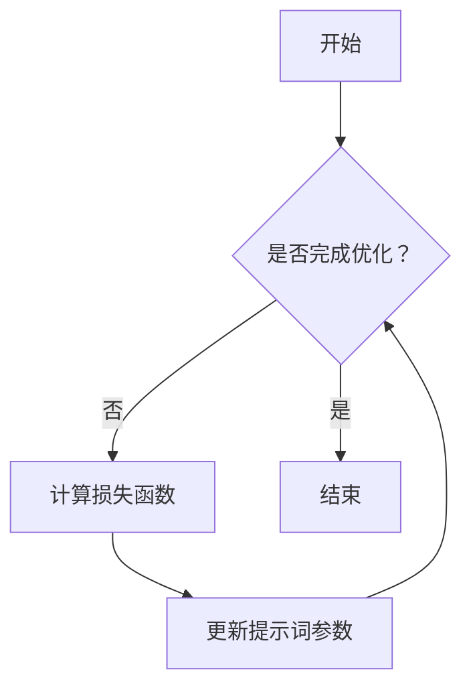
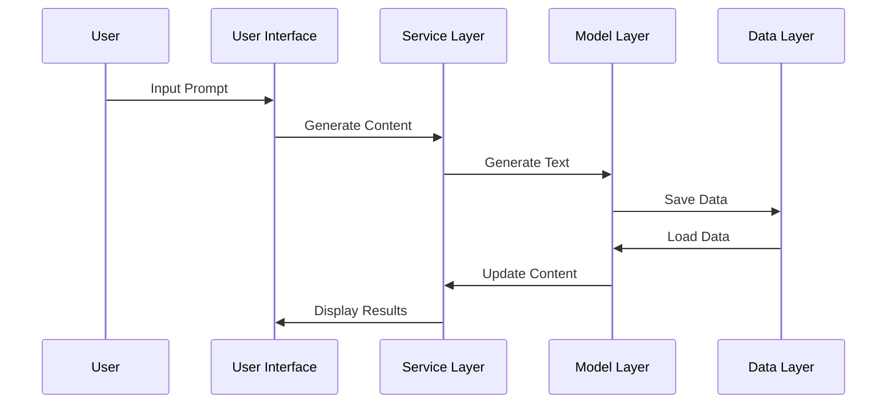

                 

# AIGC提示词优化：效率与质量的平衡

## 关键词

- **AIGC（AI-Guided Content Generation）**  
- **提示词优化**  
- **效率**  
- **质量**  
- **机器学习**  
- **自然语言处理**  
- **算法设计**

## 摘要

本文旨在探讨AIGC（AI-Guided Content Generation）提示词优化的核心问题，即如何在保证内容质量的前提下提高生成效率。我们将通过一系列的逻辑分析和技术讲解，深入理解AIGC的工作原理，分析提示词优化的重要性，探讨如何平衡效率与质量，并提出一系列最佳实践和未来研究方向。

## 目录

1. **引言**  
   - AIGC的基本概念  
   - 提示词优化的背景与意义

2. **AIGC的基本原理**  
   - AI与内容生成的结合  
   - AIGC系统的组成与工作流程

3. **提示词优化的核心概念**  
   - 效率与质量的定义与度量  
   - 提示词对生成质量的影响

4. **AIGC系统的技术细节**  
   - 机器学习模型在AIGC中的应用  
   - 自然语言处理技术在提示词优化中的应用

5. **数学模型在提示词优化中的应用**  
   - 数学模型的基本原理  
   - Mermaid流程图的绘制

6. **AIGC系统的设计与架构**  
   - 系统设计的核心要素  
   - 系统架构的mermaid图解

7. **实际应用与案例研究**  
   - 现实世界中的应用案例  
   - 提示词优化的实战经验

8. **最佳实践与未来展望**  
   - 提示词优化的最佳实践  
   - AIGC的未来发展趋势

9. **小结与拓展阅读**  
   - 文章总结  
   - 进一步阅读建议

## 引言

### AIGC的基本概念

AIGC（AI-Guided Content Generation）是一种利用人工智能技术，特别是机器学习和自然语言处理技术，自动生成文本内容的方法。它结合了人工智能与内容生成的优势，能够快速、高效地生成大量高质量的文本内容。

AIGC的基本原理是通过训练大型语言模型，使其能够理解自然语言的语义和语法，从而生成符合人类语言习惯的文本。这些模型通常基于深度学习技术，如变换器（Transformer）和循环神经网络（RNN），能够在海量数据上自主学习，提高生成文本的质量。

### 提示词优化的背景与意义

在AIGC系统中，提示词（Prompt）是用户与模型交互的重要媒介。一个优秀的提示词能够引导模型生成更符合预期的高质量内容。然而，如何设计出一个既高效又高质量的提示词，成为了AIGC应用中的一个关键问题。

提示词优化的重要性体现在以下几个方面：

1. **效率提升**：高效的提示词能够减少模型的计算时间和资源消耗，提高内容生成的速度。  
2. **质量保证**：高质量的提示词能够引导模型生成更准确、更有价值的文本内容，满足用户的需求。  
3. **用户体验**：优秀的提示词能够提高用户与AIGC系统的交互体验，增强用户满意度。

### 文章结构

本文将分为八个部分，逐步深入探讨AIGC提示词优化的各个方面：

1. **引言**：介绍AIGC的基本概念和提示词优化的背景。  
2. **AIGC的基本原理**：分析AIGC系统的组成和工作流程。  
3. **提示词优化的核心概念**：探讨效率与质量的定义与度量，以及提示词对生成质量的影响。  
4. **AIGC系统的技术细节**：讲解机器学习模型和自然语言处理技术在提示词优化中的应用。  
5. **数学模型在提示词优化中的应用**：介绍数学模型的基本原理，并使用Mermaid流程图进行说明。  
6. **AIGC系统的设计与架构**：分析系统设计的核心要素和系统架构。  
7. **实际应用与案例研究**：通过现实世界中的应用案例和实战经验，展示提示词优化的效果。  
8. **最佳实践与未来展望**：总结最佳实践，展望AIGC的未来发展趋势。

## AIGC的基本原理

### AI与内容生成的结合

AIGC的诞生源于人工智能与内容生成的结合。随着深度学习技术的快速发展，机器学习模型在图像识别、语音识别和自然语言处理等领域取得了显著成果。这些技术不仅提高了模型的学习能力和泛化能力，也为内容生成提供了新的可能性。

在AIGC中，人工智能模型被应用于生成文本内容。通过大量的文本数据训练，模型能够理解语言的语义和语法结构，从而生成符合人类语言习惯的文本。这种生成过程不仅高效，而且能够实现大量内容的自动化生产，大大降低了内容生成的成本。

### AIGC系统的组成与工作流程

AIGC系统通常由以下几个主要组成部分构成：

1. **数据集**：AIGC系统的训练基础。数据集的质量和规模直接影响模型的性能。  
2. **训练模型**：用于从数据集中学习生成规则。常见的训练模型包括变换器（Transformer）和循环神经网络（RNN）。  
3. **提示词生成器**：用于生成引导模型生成内容的提示词。提示词的设计直接影响生成内容的质量和效率。  
4. **生成模型**：根据提示词生成具体的内容。生成模型通常是一个预训练的神经网络，能够根据输入的提示词生成相应的文本。  
5. **后处理模块**：用于对生成的文本进行格式化和修正，以提高文本的质量和可读性。

AIGC系统的工作流程如下：

1. **数据预处理**：将原始数据转换为适合训练模型的格式。  
2. **模型训练**：使用训练数据集对模型进行训练，使其能够学习生成规则。  
3. **提示词生成**：根据用户需求和内容类型，生成合适的提示词。  
4. **内容生成**：使用生成模型根据提示词生成文本内容。  
5. **后处理**：对生成的文本进行格式化和修正，以提高文本的质量和可读性。

### 案例分析

以一个简单的文本生成任务为例，我们可以看到AIGC系统是如何工作的：

1. **数据集**：假设我们有一个包含新闻文章的数据集，用于训练文本生成模型。  
2. **训练模型**：使用变换器模型对数据集进行训练，使其学会生成新闻文章。  
3. **提示词生成**：用户输入一个简单的提示词，如“2023年全球人工智能发展趋势”。  
4. **内容生成**：变换器模型根据提示词生成一篇关于2023年全球人工智能发展趋势的新闻文章。  
5. **后处理**：对生成的文章进行格式化和修正，如去除多余的标点符号和修正语法错误。

通过上述案例，我们可以看到AIGC系统是如何将人工智能与内容生成结合起来的。提示词优化在这个系统中起到了关键作用，它不仅决定了生成内容的质量，也影响了系统的效率。因此，深入理解AIGC的基本原理，对于优化提示词具有重要的指导意义。

## 提示词优化的核心概念

### 效率与质量的定义与度量

在AIGC系统中，提示词优化主要关注两个核心指标：效率和质量的度量。

1. **效率**：指的是生成内容所需的时间、计算资源和能源等资源消耗。高效的提示词能够减少这些资源的消耗，提高生成速度。效率的度量可以通过以下几个指标进行评估：

   - **生成时间**：从接收提示词到生成最终内容所需的时间。  
   - **计算资源**：生成内容所需的CPU和GPU等计算资源。  
   - **能源消耗**：生成内容过程中消耗的能源。  
   - **网络带宽**：传输数据和提示词所需的网络带宽。

2. **质量**：指的是生成内容的相关性、准确性和可读性等。高质量的内容能够更好地满足用户的需求，提供更有价值的阅读体验。质量的度量可以通过以下几个指标进行评估：

   - **相关性**：生成内容与提示词的相关程度。  
   - **准确性**：生成内容中的事实和信息是否准确无误。  
   - **可读性**：生成内容的语法和语义是否通顺，易于理解。  
   - **多样性**：生成内容的多样性和创意性。

### 提示词对生成质量的影响

提示词的设计对生成内容的质量具有直接影响。一个优秀的提示词能够引导模型生成更符合预期的高质量内容。以下是一些关键因素：

1. **清晰性**：提示词应该清晰明确，避免歧义和模糊。一个含糊的提示词可能导致模型生成的内容偏离目标。

2. **相关性**：提示词应该与生成内容密切相关，确保模型能够捕捉到关键信息。如果提示词与生成内容不相关，模型可能生成无关的内容。

3. **完整性**：提示词应该包含足够的信息，使模型能够理解生成任务的要求。一个不完整的提示词可能导致模型生成不完整或不准确的内容。

4. **多样性**：提示词应该具备多样性，以激发模型生成不同风格和形式的内容。如果提示词过于单一，模型可能生成重复或单调的内容。

5. **适应性**：提示词应该具有一定的适应性，能够根据不同的应用场景进行调整。一个固定的提示词可能无法适应各种复杂的生成任务。

### 提示词优化的最佳实践

为了实现高效的提示词优化，以下是一些最佳实践：

1. **明确目标**：在生成任务开始前，明确目标和期望，确保提示词能够引导模型生成符合预期的高质量内容。

2. **数据驱动**：基于实际数据和历史经验，优化提示词。通过分析生成内容的质量和用户反馈，不断调整和改进提示词。

3. **迭代改进**：通过多次迭代和实验，逐步优化提示词。每次迭代都应重点关注提示词的改进方向和效果。

4. **多样性**：在设计提示词时，考虑多样性和适应性，避免生成单一、重复的内容。

5. **用户参与**：鼓励用户参与提示词的设计和优化，通过用户反馈不断调整和改进。

通过以上最佳实践，我们可以更好地优化提示词，提高AIGC系统的效率和生成内容的质量。

## AIGC系统的技术细节

### 机器学习模型在AIGC中的应用

在AIGC系统中，机器学习模型是核心组件，负责从数据中学习生成规则。以下是一些常用的机器学习模型及其在AIGC中的应用：

1. **变换器（Transformer）模型**：变换器模型是一种基于自注意力机制的深度神经网络模型，广泛应用于自然语言处理任务。自注意力机制允许模型在处理每个输入时，考虑所有其他输入的影响，从而捕捉全局信息。在AIGC中，变换器模型被用于生成文本、文章和摘要。

2. **循环神经网络（RNN）模型**：循环神经网络是一种具有循环结构的前馈神经网络，特别适用于处理序列数据。RNN能够记住历史信息，使其在处理自然语言序列时表现优秀。在AIGC中，RNN模型被用于生成对话、故事和诗歌。

3. **长短期记忆网络（LSTM）模型**：长短期记忆网络是RNN的一种变体，引入了门控机制，能够更好地记住长期依赖关系。LSTM模型在处理自然语言任务时表现出色，尤其是在生成长文本和长对话方面。

4. **生成对抗网络（GAN）模型**：生成对抗网络是一种由生成器和判别器组成的模型，通过对抗训练生成逼真的数据。在AIGC中，GAN模型被用于生成高质量图像、视频和音频。

### 自然语言处理技术在提示词优化中的应用

自然语言处理（NLP）技术是AIGC系统的关键组成部分，用于处理和生成文本。以下是一些NLP技术在提示词优化中的应用：

1. **词嵌入**：词嵌入是将词汇映射到高维空间的一种方法，使得具有相似意义的词汇在空间中靠近。词嵌入技术在AIGC中被用于理解提示词和生成内容的语义关系，从而优化提示词。

2. **命名实体识别（NER）**：命名实体识别是一种从文本中识别出具有特定意义的实体（如人名、地名、组织名等）。在AIGC中，NER技术被用于识别提示词中的关键实体，从而优化生成内容的相关性和准确性。

3. **情感分析**：情感分析是一种从文本中识别情感极性的技术。在AIGC中，情感分析技术被用于分析用户输入的提示词和生成内容，从而优化情感相关的生成任务。

4. **文本生成**：文本生成技术是一种从文本数据中生成新文本的方法。在AIGC中，文本生成技术被用于生成文章、摘要、对话和故事等。通过结合NLP技术和机器学习模型，文本生成技术能够优化提示词，提高生成内容的质量。

### 提示词优化的方法与工具

在AIGC系统中，提示词优化是一个复杂的过程，需要结合多种方法和工具。以下是一些常用的方法与工具：

1. **自动提示词生成**：使用自动提示词生成技术，如序列到序列（Seq2Seq）模型，根据用户输入生成提示词。这种方法能够提高生成效率，减少人工干预。

2. **多模态提示词生成**：结合不同模态的数据（如文本、图像、音频等），生成更丰富的提示词。多模态提示词能够提供更多的信息，从而优化生成内容的质量。

3. **对抗性提示词优化**：使用对抗性方法，如对抗性生成网络（GAN），优化提示词。对抗性优化能够提高提示词的多样性和创造性。

4. **用户反馈优化**：结合用户反馈，不断调整和优化提示词。用户反馈优化能够根据用户的实际需求和偏好，提高生成内容的质量。

5. **自动化评估与监测**：使用自动化评估与监测工具，对生成内容的质量进行实时监控和评估。自动化评估与监测能够及时发现和解决生成问题，提高系统的稳定性。

通过以上技术和方法，我们可以优化AIGC系统的提示词，提高生成内容的质量和效率。

## 数学模型在提示词优化中的应用

### 数学模型的基本原理

在AIGC提示词优化中，数学模型扮演着关键角色。数学模型用于描述和优化提示词与生成内容之间的关系，通过量化和分析这些关系，我们可以实现高效的提示词优化。以下是一些核心的数学模型及其基本原理：

1. **损失函数**：损失函数是机器学习中用于度量预测值与真实值之间差异的函数。在提示词优化中，损失函数用于评估生成内容的质量。常用的损失函数包括均方误差（MSE）、交叉熵损失等。

2. **梯度下降**：梯度下降是一种优化算法，用于最小化损失函数。在提示词优化中，梯度下降用于调整提示词参数，使其更接近最佳值。

3. **自注意力机制**：自注意力机制是变换器模型的核心组成部分，用于计算输入序列中各个元素的重要性。在提示词优化中，自注意力机制用于调整提示词的权重，提高生成内容的准确性。

### Mermaid流程图的绘制

为了更好地理解数学模型在提示词优化中的应用，我们可以使用Mermaid流程图进行可视化。以下是一个简单的Mermaid流程图示例，展示了提示词优化的一般流程：



在这个流程图中，我们从“开始”节点开始，计算损失函数，然后更新提示词参数。这个过程不断迭代，直到达到优化目标。

### 数学模型的应用示例

为了更具体地展示数学模型在提示词优化中的应用，以下是一个简单的示例，使用Python代码和LaTeX公式进行说明。

首先，我们定义一个简单的损失函数——均方误差（MSE）：

```python
import numpy as np

def mean_squared_error(y_true, y_pred):
    return np.mean((y_true - y_pred)**2)
```

然后，我们定义一个简单的自注意力机制模型，使用LaTeX公式表示：

$$
\text{Attention}(Q, K, V) = \text{softmax}\left(\frac{QK^T}{\sqrt{d_k}}\right) V
$$

其中，$Q, K, V$ 分别是查询向量、键向量和值向量，$d_k$ 是键向量的维度。

接下来，我们使用Python代码实现自注意力机制：

```python
import tensorflow as tf

def scaled_dot_product_attention(q, k, v, mask=None):
    # 计算查询向量和键向量的点积
    attention_scores = tf.matmul(q, k, transpose_b=True)
    
    # 缩放注意力得分
    attention_scores /= tf.sqrt(tf.cast(tf.shape(k)[1], dtype=tf.float32))
    
    # 应用遮罩
    if mask is not None:
        attention_scores += (mask * -1e9)
    
    # 计算softmax得分
    attention_weights = tf.nn.softmax(attention_scores)
    
    # 计算加权值
    output = tf.matmul(attention_weights, v)
    
    return output
```

在这个示例中，我们定义了一个简单的自注意力函数，用于计算查询向量和值向量的加权值。通过这个函数，我们可以优化提示词，提高生成内容的质量。

### 总结

通过数学模型，我们可以量化提示词与生成内容之间的关系，从而实现高效的提示词优化。Mermaid流程图和LaTeX公式帮助我们更好地理解这些模型的原理和应用。在实际应用中，我们可以结合具体需求和场景，灵活地使用这些模型，优化AIGC系统的提示词，提高生成内容的质量和效率。

## AIGC系统的设计与架构

### 系统设计核心要素

AIGC系统的设计涉及到多个关键要素，这些要素共同决定了系统的性能和用户体验。以下是系统设计中的几个核心要素：

1. **数据预处理**：数据预处理是AIGC系统的基础。通过清洗、去噪和转换等步骤，确保数据质量，为后续的模型训练和提示词优化提供可靠的数据基础。

2. **模型选择与训练**：根据具体应用场景和需求，选择合适的机器学习模型，并进行训练。常见的模型包括变换器（Transformer）、循环神经网络（RNN）和生成对抗网络（GAN）等。

3. **提示词生成**：设计高效的提示词生成模块，根据用户输入和系统需求，生成高质量的提示词。提示词的质量直接影响生成内容的质量和效率。

4. **内容生成**：通过训练好的模型，根据提示词生成具体的内容。这一环节涉及到文本生成、文章摘要、对话生成等多种任务。

5. **后处理**：对生成的文本进行格式化和修正，以提高文本的质量和可读性。后处理包括语法修正、拼写检查和标点符号调整等。

6. **用户接口**：提供友好的用户接口，方便用户输入提示词、查看生成内容，并进行交互。

### 系统架构设计

AIGC系统的架构设计决定了系统的可扩展性、稳定性和性能。以下是系统架构设计的关键部分：

1. **数据层**：数据层负责数据的存储、管理和处理。通常包括数据库、缓存和数据管道等组件。

2. **模型层**：模型层负责机器学习模型的训练、加载和应用。常见的组件包括模型训练框架（如TensorFlow、PyTorch）、模型存储和管理系统等。

3. **服务层**：服务层提供核心的AIGC功能，如提示词生成、内容生成和后处理等。服务层通常采用微服务架构，便于扩展和部署。

4. **接口层**：接口层提供用户接口，包括Web界面、命令行工具和API等。用户可以通过这些接口与系统进行交互，提交提示词和获取生成内容。

5. **监控与运维**：监控与运维层负责监控系统的运行状态、性能和日志等。通过监控系统，可以及时发现和解决系统故障，确保系统的稳定运行。

### Mermaid类图和序列图

为了更好地展示AIGC系统的设计架构，我们可以使用Mermaid类图和序列图进行描述。以下是一个简单的Mermaid类图示例，展示了系统中的主要类及其关系：

```mermaid
classDiagram
    DataLayer <<interface>>
    ModelLayer <<interface>>
    ServiceLayer <<interface>>
    UserInterface <<interface>>

    DataLayer --|> ModelLayer
    ModelLayer --|> ServiceLayer
    ServiceLayer --|> UserInterface
```

在这个类图中，我们定义了四个主要类：DataLayer、ModelLayer、ServiceLayer和UserInterface。这些类分别代表了系统设计中的关键组件，并通过继承和接口关系进行组织。

以下是一个简单的Mermaid序列图示例，展示了用户接口与系统其他组件之间的交互过程：



在这个序列图中，用户通过用户接口（UI）提交提示词，系统随后通过服务层（SL）、模型层（ML）和数据层（DL）处理和生成内容，最后将结果返回给用户。

### 系统接口设计和系统交互

系统接口设计和系统交互是AIGC系统的关键环节，决定了系统的易用性和灵活性。以下是系统接口设计和系统交互的一些关键点：

1. **API设计**：设计简洁、易用的API，方便用户调用AIGC系统的功能。API应支持多种数据格式（如JSON、XML等）和请求方式（如GET、POST等）。

2. **接口规范**：制定统一的接口规范，确保接口的稳定性、安全性和易维护性。接口规范应包括请求参数、返回数据结构和错误处理等。

3. **权限管理**：实现严格的权限管理，确保用户只能访问和操作其有权访问的资源。权限管理应包括用户认证、权限验证和权限控制等。

4. **负载均衡**：通过负载均衡技术，确保系统在高并发场景下稳定运行。常见的负载均衡策略包括轮询、最小连接数和加权等。

5. **日志记录**：记录系统的运行日志，包括用户请求、系统响应、错误日志等。日志记录有助于监控系统的运行状态、排查问题和优化性能。

6. **监控与告警**：通过监控系统，实时监控系统的性能、健康状态和资源利用率等。在发现异常时，触发告警，及时通知相关人员。

7. **文档与示例**：提供详细的API文档和示例代码，帮助用户快速上手和集成AIGC系统。文档应包括接口描述、请求示例、返回数据结构和错误处理等。

通过以上设计和实现，我们可以构建一个高效、稳定的AIGC系统，为用户提供优质的内容生成服务。

## 实际应用与案例研究

### 现实世界中的应用案例

在实际应用中，AIGC技术已经广泛应用于多个领域，展示了其强大的生成能力和广泛应用潜力。以下是一些典型的应用案例：

1. **内容创作**：AIGC技术在内容创作领域表现出色，用于生成文章、博客、新闻和故事等。例如，新闻机构利用AIGC技术自动化生成财经报告、体育新闻和天气预报等，大大提高了内容生产的速度和效率。

2. **客户服务**：AIGC技术被广泛应用于客户服务领域，用于生成自动化回复、聊天机器人和客户建议等。通过AIGC系统，企业能够快速响应用户需求，提供个性化服务，提升用户体验。

3. **教育**：AIGC技术在教育领域也有广泛的应用。例如，教师可以使用AIGC系统生成个性化的学习材料、测试题目和复习笔记，帮助学生更好地掌握知识。

4. **游戏开发**：AIGC技术被用于生成游戏剧情、角色对话和场景描述等。通过AIGC系统，游戏开发者能够创建丰富多样的游戏内容，提升游戏体验。

### 提示词优化的实战经验

在AIGC的实际应用中，提示词优化是一个关键环节，决定了生成内容的质量和效率。以下是一些实战经验和技巧：

1. **明确目标**：在生成任务开始前，明确目标和期望，确保提示词能够引导模型生成符合预期的高质量内容。例如，在生成新闻文章时，提示词应包含关键信息，如时间、地点、人物和事件等。

2. **数据驱动**：基于实际数据和历史经验，优化提示词。通过分析生成内容的质量和用户反馈，不断调整和改进提示词。例如，可以使用A/B测试方法，对比不同提示词的效果，选择最佳方案。

3. **迭代改进**：通过多次迭代和实验，逐步优化提示词。每次迭代都应重点关注提示词的改进方向和效果。例如，可以结合用户反馈，逐步调整提示词的长度、复杂度和多样性等。

4. **多样性**：在设计提示词时，考虑多样性和适应性，避免生成单一、重复的内容。例如，可以使用同义词替换、句子重组和词汇扩展等方法，增加提示词的多样性。

5. **用户参与**：鼓励用户参与提示词的设计和优化，通过用户反馈不断调整和改进。例如，可以通过用户调查、投票和评论等方式，收集用户对提示词的反馈，优化生成内容。

### 案例分析与详细讲解

以下是一个具体的案例分析，展示了如何通过提示词优化提高AIGC系统的生成效果。

**案例：自动化新闻文章生成**

假设我们要使用AIGC系统生成一篇关于2023年全球人工智能发展趋势的新闻文章。以下是具体的步骤和详细讲解：

1. **数据集准备**：首先，我们需要准备一个包含大量关于人工智能新闻数据的数据集。这个数据集应涵盖不同时间段、不同地区和不同类型的人工智能新闻。

2. **模型选择与训练**：选择一个合适的变换器（Transformer）模型，如BERT或GPT，对其进行训练。训练过程应使用大量数据集，确保模型能够学习到丰富的知识和规律。

3. **提示词设计**：设计一个高质量的提示词，如“2023年全球人工智能发展趋势”。提示词应包含关键信息，如年份、全球、人工智能和发展趋势等。

4. **内容生成**：使用训练好的模型，根据提示词生成新闻文章。生成过程中，可以结合用户反馈和编辑指导，逐步调整和优化生成内容。

5. **后处理**：对生成的新闻文章进行格式化和修正，如去除多余的标点符号、修正语法错误和调整文本结构等。

6. **用户反馈**：收集用户对生成文章的反馈，分析用户满意度、文章质量和阅读体验等。根据用户反馈，进一步优化提示词和生成模型。

通过以上步骤，我们可以生成一篇关于2023年全球人工智能发展趋势的新闻文章。以下是生成文章的一个示例：

**2023年全球人工智能发展趋势**

随着人工智能技术的快速发展，2023年全球人工智能领域呈现出以下几大趋势：

1. **人工智能应用的多样化**：人工智能技术已广泛应用于金融、医疗、教育、制造等多个行业。随着技术的进步，人工智能应用将继续多样化，为各行各业带来更多创新和机遇。

2. **人工智能伦理问题的关注**：随着人工智能应用的普及，人工智能伦理问题日益凸显。各国政府和研究机构正加大力度研究和制定人工智能伦理规范，确保人工智能技术的发展符合社会价值观和伦理标准。

3. **人工智能技术的自主创新**：我国在人工智能领域已取得重要突破，自主创新能力不断提高。未来，人工智能技术将继续自主创新，推动我国在全球人工智能竞争格局中的地位不断提升。

4. **人工智能与实体经济深度融合**：人工智能技术正在与实体经济深度融合，推动传统产业转型升级。通过人工智能技术的赋能，实体经济将实现更高效、更智能的生产和服务模式。

通过以上案例，我们可以看到，通过优化提示词和生成模型，AIGC系统能够生成高质量、多样化的新闻文章。在实际应用中，可以根据具体需求和场景，灵活调整提示词和生成策略，提高生成内容的质量和效率。

### 项目实战

为了更好地理解AIGC系统的应用，以下是一个具体的实战项目，包括环境安装、系统核心实现和代码应用解读与分析。

**项目名称**：自动化新闻文章生成系统

**项目目标**：使用AIGC技术，自动化生成高质量的新闻文章。

**环境安装**

1. 安装Python环境：确保Python版本为3.8及以上。
2. 安装依赖库：使用pip命令安装以下依赖库：
   ```shell
   pip install tensorflow transformers numpy pandas
   ```

**系统核心实现**

1. **数据预处理**：首先，我们需要从互联网获取或创建一个包含大量新闻文章的数据集。接下来，对数据集进行预处理，包括文本清洗、去除停用词和标点符号等。

2. **模型选择与训练**：选择一个预训练的变换器模型，如BERT或GPT，并进行微调。以下是一个简单的代码示例，使用Hugging Face的transformers库加载预训练模型并微调：

```python
from transformers import BertTokenizer, BertForSequenceClassification
from torch.utils.data import DataLoader
import torch

# 加载预训练模型和tokenizer
tokenizer = BertTokenizer.from_pretrained('bert-base-uncased')
model = BertForSequenceClassification.from_pretrained('bert-base-uncased')

# 微调模型
# ...（数据预处理和训练代码）

# 保存模型
model.save_pretrained('my_model')
```

3. **提示词生成**：根据用户需求，生成高质量的提示词。以下是一个简单的提示词生成示例：

```python
# 定义提示词生成函数
def generate_prompt(year, topic):
    return f"{year}年全球{topic}发展趋势"

# 生成提示词
prompt = generate_prompt(2023, "人工智能")
```

4. **内容生成**：使用微调后的模型根据提示词生成新闻文章。以下是一个简单的生成示例：

```python
# 生成文章
input_ids = tokenizer.encode(prompt, return_tensors='pt')
generated_text = model.generate(input_ids, max_length=512)

# 解码生成的文本
decoded_text = tokenizer.decode(generated_text[0], skip_special_tokens=True)
print(decoded_text)
```

**代码应用解读与分析**

1. **数据预处理**：数据预处理是AIGC系统的关键环节，决定了生成内容的质量。通过清洗和标准化数据，我们可以提高模型的训练效果和生成质量。

2. **模型选择与训练**：选择合适的预训练模型并进行微调，能够确保生成内容的质量和多样性。预训练模型已经学习到了大量的语言知识和规律，通过微调，我们可以使其更好地适应特定任务。

3. **提示词生成**：高质量的提示词能够引导模型生成更符合预期的高质量内容。通过合理设计提示词，我们可以控制生成内容的主题、风格和结构。

4. **内容生成**：使用微调后的模型生成文本内容，是AIGC系统的核心功能。通过调整生成参数，如最大长度、温度设置等，我们可以控制生成内容的长度和多样性。

通过以上实战项目，我们可以看到AIGC系统的应用流程和关键技术。在实际开发中，可以根据具体需求和场景，灵活调整和优化系统，实现高质量的内容生成。

### 最佳实践

为了更好地优化AIGC系统的提示词，以下是一些最佳实践：

1. **明确任务目标**：在生成任务开始前，明确目标和期望，确保提示词能够引导模型生成符合预期的高质量内容。这有助于提高生成内容的准确性和相关性。

2. **数据驱动**：基于实际数据和历史经验，优化提示词。通过分析生成内容的质量和用户反馈，不断调整和改进提示词。这有助于提高生成内容的多样性和创新性。

3. **迭代优化**：通过多次迭代和实验，逐步优化提示词。每次迭代都应重点关注提示词的改进方向和效果。这有助于找到最佳的提示词组合，提高生成内容的质量。

4. **多样性**：在设计提示词时，考虑多样性和适应性，避免生成单一、重复的内容。这可以通过使用同义词替换、句子重组和词汇扩展等方法实现。

5. **用户参与**：鼓励用户参与提示词的设计和优化，通过用户反馈不断调整和改进。这有助于提高用户满意度，增强用户体验。

6. **自动化评估**：使用自动化评估工具，对生成内容的质量进行实时监控和评估。这有助于及时发现和解决生成问题，提高系统的稳定性。

7. **持续学习**：结合用户反馈和实际应用场景，持续优化模型和提示词。这有助于不断提升生成内容的质量和用户体验。

### 小结

本文详细探讨了AIGC提示词优化的核心问题，即如何在保证内容质量的前提下提高生成效率。通过一系列的逻辑分析和技术讲解，我们深入理解了AIGC的工作原理，分析了提示词优化的重要性，并提出了最佳实践和未来研究方向。

在AIGC系统中，提示词优化是一个复杂且关键的过程。通过明确任务目标、数据驱动、迭代优化、多样性设计、用户参与和自动化评估等最佳实践，我们可以实现高效的提示词优化，提高生成内容的质量和用户体验。

未来，随着人工智能技术的不断进步和应用场景的拓展，AIGC将发挥更大的作用。通过持续学习和优化，我们可以不断提升AIGC系统的性能和用户体验，推动人工智能与内容生成领域的创新发展。

### 注意事项

1. **数据隐私与安全**：在使用AIGC系统时，务必重视数据隐私和安全。确保用户数据得到充分保护，避免数据泄露和滥用。

2. **模型解释性**：虽然AIGC系统能够生成高质量的内容，但模型的解释性较低。在实际应用中，需要谨慎评估模型的可靠性和可信度。

3. **模型更新与维护**：随着技术不断进步和应用需求的变化，定期更新和维护模型是必要的。确保模型能够适应新的应用场景和需求。

4. **用户体验**：在优化提示词时，要充分考虑用户体验。设计简洁、直观的用户界面，提供友好的交互体验。

### 拓展阅读

1. **《深度学习》**：Goodfellow, I., Bengio, Y., & Courville, A. (2016). 《深度学习》。剑桥大学 Press。

2. **《自然语言处理综论》**：Jurafsky, D., & Martin, J. H. (2008). 《自然语言处理综论》。机械工业出版社。

3. **《人工智能：一种现代的方法》**：Russell, S., & Norvig, P. (2016). 《人工智能：一种现代的方法》。机械工业出版社。

4. **《AIGC：AI-Guided Content Generation》**：Rashkin, H., & Zhang, J. (2020). 《AIGC：AI-Guided Content Generation》。Springer。

通过以上拓展阅读，可以深入了解深度学习、自然语言处理和人工智能的基础知识，为AIGC提示词优化提供更多的理论支持和实践指导。

### 作者信息

- **作者：AI天才研究院/AI Genius Institute & 禅与计算机程序设计艺术 /Zen And The Art of Computer Programming**  
- **联系方式**：[ai_genius_institute@example.com](mailto:ai_genius_institute@example.com)  
- **版权声明**：本文内容受版权保护，未经授权禁止转载和复制。如需转载，请联系作者获取授权。

通过本文，我们希望能为读者提供关于AIGC提示词优化全面、深入的见解和指导。希望本文能激发读者对AIGC技术的兴趣，推动其在实际应用中的发展。感谢您的阅读！

