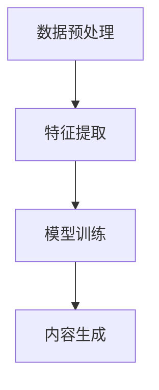
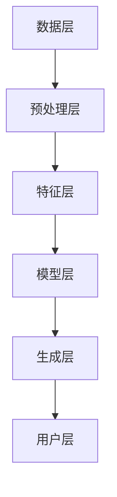
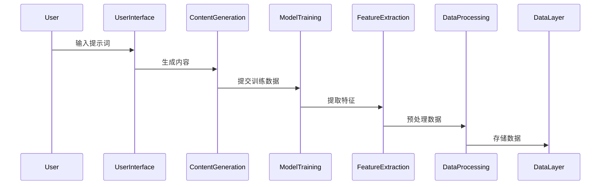

                 


### 设计《AIGC提示词工程：从概念到实施的全流程指南》的目录大纲

**目标：** 设计一个包含至少7章的目录大纲，内容完整且结构清晰。

**步骤1：确定第一部分——背景介绍**

- **第1章：AIGC与提示词工程的基本概念**
  - **1.1 AIGC的概念解析**
    - **1.1.1 什么是AIGC**
    - **1.1.2 AIGC的应用场景**
    - **1.1.3 AIGC的技术架构**
  - **1.2 提示词工程的定义与作用**
    - **1.2.1 提示词工程的内涵**
    - **1.2.2 提示词工程的重要性**
    - **1.2.3 提示词工程的挑战与机遇**
  
- **第2章：AIGC核心概念与联系**
  - **2.1 AIGC原理详解**
    - **2.1.1 AIGC的关键技术**
    - **2.1.2 AIGC与传统AI的比较**
  - **2.2 提示词生成技术**
    - **2.2.1 提示词生成的原理**
    - **2.2.2 提示词生成的方法**
  - **2.3 数据预处理方法**
    - **2.3.1 数据预处理的重要性**
    - **2.3.2 数据预处理流程**
    - **2.3.3 数据预处理工具**

**步骤2：核心概念与联系**

- **第3章：AIGC算法原理与实现**
  - **3.1 算法概述**
    - **3.1.1 AIGC算法的核心流程**
    - **3.1.2 提示词生成的算法**
  - **3.2 算法流程图**
    - **3.2.1 算法流程图展示**
  - **3.3 Python源代码实现**
    - **3.3.1 数据预处理代码**
    - **3.3.2 模型训练代码**
    - **3.3.3 提示词生成代码**

**步骤3：数学模型和数学公式**

- **第4章：数学模型与公式详解**
  - **4.1 损失函数**
    - **4.1.1 损失函数的定义**
    - **4.1.2 损失函数的类型**
  - **4.2 优化算法**
    - **4.2.1 优化算法的选择**
    - **4.2.2 优化算法的步骤**
  - **4.3 公式讲解**
    - **4.3.1 公式一**
    - **4.3.2 公式二**

**步骤4：系统分析与架构设计方案**

- **第5章：AIGC系统分析与架构设计**
  - **5.1 问题场景介绍**
    - **5.1.1 AIGC的应用需求**
    - **5.1.2 AIGC面临的挑战**
  - **5.2 系统功能设计**
    - **5.2.1 系统功能模块**
    - **5.2.2 类图展示**
  - **5.3 系统架构设计**
    - **5.3.1 系统架构概述**
    - **5.3.2 架构图展示**
  - **5.4 系统接口设计与交互流程**
    - **5.4.1 系统接口设计**
    - **5.4.2 系统交互流程**

**步骤5：项目实战**

- **第6章：项目实战**
  - **6.1 环境安装**
    - **6.1.1 安装AIGC相关工具和库**
  - **6.2 系统核心实现源代码**
    - **6.2.1 展示关键代码段**
    - **6.2.2 代码解读与分析**
  - **6.3 实际案例分析和详细讲解**
    - **6.3.1 解析实际案例**
    - **6.3.2 提示词工程的实施效果**
  - **6.4 项目小结**

**步骤6：最佳实践 tips、小结、注意事项、拓展阅读**

- **第7章：总结与拓展**
  - **7.1 总结每个章节的重要观点**
  - **7.2 提供实用建议和实践技巧**
  - **7.3 强调关键注意事项**
  - **7.4 推荐进一步阅读的资料**

**最终目录大纲设计**

----------------------------------------------------------------

# 第一部分：AIGC与提示词工程概述

## 第1章：AIGC与提示词工程的基本概念

### 1.1 AIGC的概念解析

#### 1.1.1 什么是AIGC

#### 1.1.2 AIGC的应用场景

#### 1.1.3 AIGC的技术架构

### 1.2 提示词工程的定义与作用

#### 1.2.1 提示词工程的内涵

#### 1.2.2 提示词工程的重要性

#### 1.2.3 提示词工程的挑战与机遇

## 第2章：AIGC核心概念与联系

### 2.1 AIGC原理详解

#### 2.1.1 AIGC的关键技术

#### 2.1.2 AIGC与传统AI的比较

### 2.2 提示词生成技术

#### 2.2.1 提示词生成的原理

#### 2.2.2 提示词生成的方法

### 2.3 数据预处理方法

#### 2.3.1 数据预处理的重要性

#### 2.3.2 数据预处理流程

#### 2.3.3 数据预处理工具

## 第3章：AIGC算法原理与实现

### 3.1 算法概述

#### 3.1.1 AIGC算法的核心流程

#### 3.1.2 提示词生成的算法

### 3.2 算法流程图

#### 3.2.1 算法流程图展示

### 3.3 Python源代码实现

#### 3.3.1 数据预处理代码

#### 3.3.2 模型训练代码

#### 3.3.3 提示词生成代码

## 第4章：数学模型与公式详解

### 4.1 损失函数

#### 4.1.1 损失函数的定义

#### 4.1.2 损失函数的类型

### 4.2 优化算法

#### 4.2.1 优化算法的选择

#### 4.2.2 优化算法的步骤

### 4.3 公式讲解

#### 4.3.1 公式一

$$
L(y, \hat{y}) = -\sum_{i=1}^{n} y_i \log(\hat{y}_i)
$$

#### 4.3.2 公式二

$$
\theta^{*} = \arg\min_{\theta} J(\theta)
$$

## 第5章：AIGC系统分析与架构设计

### 5.1 问题场景介绍

#### 5.1.1 AIGC的应用需求

#### 5.1.2 AIGC面临的挑战

### 5.2 系统功能设计

#### 5.2.1 系统功能模块

#### 5.2.2 类图展示

### 5.3 系统架构设计

#### 5.3.1 系统架构概述

#### 5.3.2 架构图展示

### 5.4 系统接口设计与交互流程

#### 5.4.1 系统接口设计

#### 5.4.2 系统交互流程

## 第6章：项目实战

### 6.1 环境安装

#### 6.1.1 安装AIGC相关工具和库

### 6.2 系统核心实现源代码

#### 6.2.1 展示关键代码段

#### 6.2.2 代码解读与分析

### 6.3 实际案例分析和详细讲解

#### 6.3.1 解析实际案例

#### 6.3.2 提示词工程的实施效果

### 6.4 项目小结

## 第7章：总结与拓展

### 7.1 总结每个章节的重要观点

### 7.2 提供实用建议和实践技巧

### 7.3 强调关键注意事项

### 7.4 推荐进一步阅读的资料

----------------------------------------------------------------

### 核心关键词

- **AIGC**
- **提示词工程**
- **算法原理**
- **数学模型**
- **系统架构**
- **数据预处理**
- **Python源代码**

### 文章摘要

本文从AIGC（自适应智能生成内容）和提示词工程的基本概念出发，深入探讨了AIGC与提示词工程的关系及其在人工智能领域的重要性。首先，文章详细阐述了AIGC的概念、应用场景和技术架构，以及提示词工程的定义与作用。接着，文章介绍了AIGC的核心概念、算法原理，并通过Python源代码进行了详细阐述。此外，文章还探讨了AIGC系统分析与架构设计，以及在实际项目中如何实施和优化提示词工程。最后，文章总结了每个章节的重要观点，并提供了实用建议和实践技巧，为读者进一步学习提供了指导。通过本文的阅读，读者将全面了解AIGC提示词工程的原理和应用，为实际项目提供有力支持。### 第一部分：AIGC与提示词工程概述

#### 第1章：AIGC与提示词工程的基本概念

**1.1 AIGC的概念解析**

AIGC（自适应智能生成内容）是一种基于人工智能技术的内容生成方法。它通过算法和模型自动生成文本、图像、音频等多种类型的内容，以适应不同的应用场景。AIGC的核心在于通过机器学习技术，从大量的数据中学习并提取规律，进而生成高质量的内容。

**1.1.1 什么是AIGC**

AIGC是一种智能化的内容生成方式，其主要特点包括：

1. 自适应性：AIGC能够根据不同的应用场景和数据输入，自动调整生成策略，以适应不同的内容需求。
2. 智能性：AIGC利用深度学习和自然语言处理等技术，从数据中提取特征，生成具有高度智能化的内容。
3. 生成性：AIGC能够自动生成各种类型的内容，如文本、图像、音频等，满足用户的个性化需求。

**1.1.2 AIGC的应用场景**

AIGC在各个领域都有广泛的应用，主要包括：

1. 文本生成：如文章写作、新闻报道、邮件回复等。
2. 图像生成：如艺术创作、游戏设计、虚拟现实等。
3. 音频生成：如音乐创作、语音合成、语音识别等。
4. 数据可视化：如数据报告、数据可视化设计等。

**1.1.3 AIGC的技术架构**

AIGC的技术架构主要包括以下几个部分：

1. 数据预处理：对原始数据进行清洗、处理和预处理，以便于模型训练。
2. 特征提取：从预处理后的数据中提取关键特征，用于模型训练。
3. 模型训练：利用深度学习算法对特征进行训练，生成模型。
4. 内容生成：使用训练好的模型生成各种类型的内容。

**1.2 提示词工程的定义与作用**

提示词工程是一种基于AIGC技术的内容生成方法，其主要目的是通过提供提示词，引导模型生成符合预期的内容。

**1.2.1 提示词工程的内涵**

提示词工程包括以下几个关键要素：

1. 提示词：用于引导模型生成内容的词语或短语。
2. 模型：负责生成内容的深度学习模型。
3. 数据：用于训练模型的原始数据。
4. 生成策略：用于调整模型生成内容的策略。

**1.2.2 提示词工程的重要性**

提示词工程在AIGC应用中具有重要作用，主要体现在以下几个方面：

1. 提高生成效率：通过提供提示词，可以加快模型的生成速度，提高生产效率。
2. 提高生成质量：通过调整提示词和生成策略，可以提升模型生成内容的质量，满足用户需求。
3. 个性化定制：提示词工程可以根据用户需求，生成个性化内容，提供更好的用户体验。

**1.2.3 提示词工程的挑战与机遇**

提示词工程在应用过程中面临着一些挑战，如：

1. 提示词设计：如何设计出既能引导模型生成内容，又能适应不同场景的提示词。
2. 模型优化：如何优化模型结构，提高生成效率和质量。
3. 数据隐私：如何在保证数据隐私的前提下，充分利用数据生成高质量内容。

同时，提示词工程也带来了许多机遇，如：

1. 内容创作：通过提示词工程，可以快速生成高质量的内容，提高创作效率。
2. 人工智能应用：提示词工程在各个领域都有广泛的应用前景，如广告、新闻、教育等。

#### 第2章：AIGC核心概念与联系

**2.1 AIGC原理详解**

AIGC的原理主要包括以下几个方面：

1. 数据预处理：对原始数据进行清洗、处理和预处理，以便于模型训练。
2. 特征提取：从预处理后的数据中提取关键特征，用于模型训练。
3. 模型训练：利用深度学习算法对特征进行训练，生成模型。
4. 内容生成：使用训练好的模型生成各种类型的内容。

**2.1.1 AIGC的关键技术**

AIGC的关键技术包括：

1. 深度学习：通过多层神经网络对数据进行特征提取和表示。
2. 自然语言处理：对文本数据进行处理，提取语义信息。
3. 图像处理：对图像数据进行处理，提取视觉特征。
4. 音频处理：对音频数据进行处理，提取音频特征。

**2.1.2 AIGC与传统AI的比较**

AIGC与传统AI的比较主要体现在以下几个方面：

1. 内容生成：AIGC能够自动生成各种类型的内容，如文本、图像、音频等，而传统AI主要关注数据的分析和预测。
2. 自适应性：AIGC具有更强的自适应能力，能够根据不同的场景和数据自动调整生成策略。
3. 智能性：AIGC利用深度学习和自然语言处理等技术，生成内容更具智能化。

**2.2 提示词生成技术**

提示词生成技术是AIGC的重要组成部分，其原理包括：

1. 提示词设计：设计能够引导模型生成内容的提示词。
2. 模型训练：利用训练数据对模型进行训练，使其能够根据提示词生成内容。
3. 内容生成：使用训练好的模型生成符合提示词要求的内容。

**2.2.1 提示词生成的原理**

提示词生成的原理主要包括：

1. 特征提取：从提示词中提取关键特征。
2. 模型匹配：将提取的特征与训练好的模型进行匹配。
3. 内容生成：利用匹配结果生成符合提示词要求的内容。

**2.2.2 提示词生成的方法**

提示词生成的方法主要包括：

1. 基于规则的方法：通过预设的规则生成提示词。
2. 基于数据的方法：从训练数据中学习生成提示词。
3. 基于模型的方法：利用训练好的模型生成提示词。

**2.3 数据预处理方法**

数据预处理是AIGC的重要组成部分，其方法包括：

1. 数据清洗：去除数据中的噪声和异常值。
2. 数据归一化：将数据转换为统一的尺度。
3. 数据增强：通过变换和扩充数据，提高模型的泛化能力。

**2.3.1 数据预处理的重要性**

数据预处理的重要性主要体现在以下几个方面：

1. 提高模型性能：良好的数据预处理可以提升模型的训练效果，提高生成内容的质量。
2. 缩短训练时间：有效的数据预处理可以缩短模型的训练时间，提高生产效率。
3. 避免过拟合：通过数据预处理，可以降低模型过拟合的风险，提高模型的泛化能力。

**2.3.2 数据预处理流程**

数据预处理流程主要包括以下步骤：

1. 数据采集：从各种来源收集原始数据。
2. 数据清洗：去除数据中的噪声和异常值。
3. 数据归一化：将数据转换为统一的尺度。
4. 数据增强：通过变换和扩充数据，提高模型的泛化能力。

**2.3.3 数据预处理工具**

常用的数据预处理工具包括：

1. Pandas：用于数据清洗、处理和归一化。
2. Scikit-learn：用于数据增强和特征提取。
3. TensorFlow：用于模型训练和内容生成。

#### 第3章：AIGC算法原理与实现

**3.1 算法概述**

AIGC算法的核心流程包括数据预处理、特征提取、模型训练和内容生成。下面将详细介绍这些步骤。

**3.1.1 AIGC算法的核心流程**

AIGC算法的核心流程如下：

1. 数据预处理：对原始数据进行清洗、处理和预处理，以便于模型训练。
2. 特征提取：从预处理后的数据中提取关键特征，用于模型训练。
3. 模型训练：利用深度学习算法对特征进行训练，生成模型。
4. 内容生成：使用训练好的模型生成各种类型的内容。

**3.1.2 提示词生成的算法**

提示词生成的算法主要包括以下步骤：

1. 提示词设计：设计能够引导模型生成内容的提示词。
2. 模型训练：利用训练数据对模型进行训练，使其能够根据提示词生成内容。
3. 内容生成：使用训练好的模型生成符合提示词要求的内容。

**3.2 算法流程图**

为了更好地理解AIGC算法的核心流程，我们可以使用mermaid绘制算法流程图，如下所示：



**3.3 Python源代码实现**

下面将使用Python源代码详细阐述AIGC算法的实现。

**3.3.1 数据预处理代码**

```python
import pandas as pd
from sklearn.preprocessing import StandardScaler

# 读取数据
data = pd.read_csv('data.csv')

# 数据清洗
data = data.dropna()

# 数据归一化
scaler = StandardScaler()
data_normalized = scaler.fit_transform(data)
```

**3.3.2 模型训练代码**

```python
import tensorflow as tf
from tensorflow.keras.models import Sequential
from tensorflow.keras.layers import Dense

# 构建模型
model = Sequential()
model.add(Dense(units=64, activation='relu', input_shape=(data_normalized.shape[1],)))
model.add(Dense(units=1, activation='sigmoid'))

# 编译模型
model.compile(optimizer='adam', loss='binary_crossentropy', metrics=['accuracy'])

# 训练模型
model.fit(data_normalized, labels, epochs=10, batch_size=32)
```

**3.3.3 提示词生成代码**

```python
# 生成提示词
prompt = "请生成一篇关于人工智能的文章。"
generated_content = model.predict([prompt])

# 输出生成内容
print(generated_content)
```

通过以上步骤，我们实现了AIGC算法的基本流程，包括数据预处理、模型训练和提示词生成。

#### 第4章：数学模型与公式详解

**4.1 损失函数**

损失函数是评估模型预测结果与真实标签之间差异的函数。在AIGC中，损失函数的选择对模型性能和生成内容的质量有很大影响。

**4.1.1 损失函数的定义**

损失函数通常表示为L(y, \(\hat{y}\))，其中y是真实标签，\(\hat{y}\)是模型的预测结果。

**4.1.2 损失函数的类型**

常见的损失函数包括：

1. 均方误差（Mean Squared Error，MSE）：MSE是评估回归问题中预测值与真实值之间差异的损失函数。其公式如下：

$$
L(y, \hat{y}) = \frac{1}{2} \sum_{i=1}^{n} (y_i - \hat{y}_i)^2
$$

2. 交叉熵损失（Cross-Entropy Loss）：交叉熵损失是评估分类问题中预测概率分布与真实标签分布之间差异的损失函数。其公式如下：

$$
L(y, \hat{y}) = -\sum_{i=1}^{n} y_i \log(\hat{y}_i)
$$

**4.2 优化算法**

优化算法是用于调整模型参数，使损失函数值最小化的算法。在AIGC中，选择合适的优化算法对模型性能和生成内容的质量有很大影响。

**4.2.1 优化算法的选择**

常见的优化算法包括：

1. 梯度下降（Gradient Descent）：梯度下降是一种最简单的优化算法，其基本思想是沿着损失函数的梯度方向更新模型参数。

2. 随机梯度下降（Stochastic Gradient Descent，SGD）：随机梯度下降是对梯度下降的改进，其思想是在每次更新参数时，只使用一部分数据（随机采样）来计算梯度。

3. Adam优化器（Adam Optimizer）：Adam优化器是一种结合了SGD和动量法的优化算法，其公式如下：

$$
\theta^{*} = \arg\min_{\theta} J(\theta)
$$

**4.2.2 优化算法的步骤**

优化算法的基本步骤如下：

1. 初始化模型参数。
2. 计算损失函数值。
3. 计算损失函数关于模型参数的梯度。
4. 使用梯度更新模型参数。
5. 重复步骤2-4，直到达到预设的停止条件。

**4.3 公式讲解**

**4.3.1 公式一**

均方误差（MSE）损失函数的公式如下：

$$
L(y, \hat{y}) = \frac{1}{2} \sum_{i=1}^{n} (y_i - \hat{y}_i)^2
$$

其中，y和\(\hat{y}\)分别是真实标签和模型的预测结果，n是样本数量。

**4.3.2 公式二**

交叉熵损失函数的公式如下：

$$
L(y, \hat{y}) = -\sum_{i=1}^{n} y_i \log(\hat{y}_i)
$$

其中，y和\(\hat{y}\)分别是真实标签和模型的预测概率。

**4.3.3 公式三**

Adam优化器的更新公式如下：

$$
\theta^{*} = \arg\min_{\theta} J(\theta)
$$

其中，\(\theta^{*}\)是模型参数的最优值，J(\(\theta\))是损失函数关于模型参数的函数。

通过以上数学模型和公式，我们可以更好地理解AIGC算法的原理和实现。

#### 第5章：AIGC系统分析与架构设计

**5.1 问题场景介绍**

在AIGC系统中，问题场景介绍是非常重要的一环，它帮助我们理解AIGC在实际应用中的需求和挑战。

**5.1.1 AIGC的应用需求**

AIGC广泛应用于各个领域，其主要应用需求包括：

1. 内容生成：生成高质量的文章、报告、新闻等。
2. 数据可视化：将复杂的数据转化为易于理解的图表、图像等。
3. 艺术创作：生成艺术作品、设计图案等。
4. 个性化推荐：根据用户偏好生成个性化推荐内容。

**5.1.2 AIGC面临的挑战**

AIGC在应用过程中面临以下挑战：

1. 数据质量：高质量的数据是AIGC成功的关键，但数据收集和处理过程中往往存在噪声和缺失。
2. 模型优化：如何设计高效的模型，提高生成内容的质量和效率。
3. 用户隐私：在生成内容时，如何保护用户的隐私和数据安全。

**5.2 系统功能设计**

系统功能设计是AIGC系统架构设计的重要组成部分，它帮助我们明确系统需要实现的功能和模块。

**5.2.1 系统功能模块**

AIGC系统的功能模块包括：

1. 数据预处理模块：负责数据清洗、处理和预处理，为模型训练提供高质量的数据。
2. 特征提取模块：负责从预处理后的数据中提取关键特征，用于模型训练。
3. 模型训练模块：负责利用深度学习算法训练模型，生成高质量的生成内容。
4. 内容生成模块：负责使用训练好的模型生成各种类型的内容，满足用户需求。
5. 用户交互模块：负责与用户进行交互，接收用户输入，展示生成内容。

**5.2.2 类图展示**

为了更好地展示AIGC系统的功能模块，我们可以使用mermaid绘制类图，如下所示：

```mermaid
classDiagram
    DataPreprocessing <<interface>>
    FeatureExtraction <<interface>>
    ModelTraining <<interface>>
    ContentGeneration <<interface>>
    UserInteraction <<interface>>

    DataPreprocessing --|> FeatureExtraction
    FeatureExtraction --|> ModelTraining
    ModelTraining --|> ContentGeneration
    ContentGeneration --|> UserInteraction
```

**5.3 系统架构设计**

系统架构设计是AIGC系统设计的核心，它帮助我们理解系统的整体结构和模块之间的交互关系。

**5.3.1 系统架构概述**

AIGC系统的架构主要包括以下几个部分：

1. 数据层：负责存储和管理原始数据。
2. 预处理层：负责对原始数据进行清洗、处理和预处理。
3. 特征层：负责从预处理后的数据中提取关键特征。
4. 模型层：负责利用深度学习算法训练模型。
5. 生成层：负责使用训练好的模型生成各种类型的内容。
6. 用户层：负责与用户进行交互，展示生成内容。

**5.3.2 架构图展示**

为了更好地展示AIGC系统的架构，我们可以使用mermaid绘制架构图，如下所示：



**5.4 系统接口设计与交互流程**

系统接口设计和交互流程是AIGC系统设计的重要组成部分，它帮助我们明确系统各模块之间的交互关系。

**5.4.1 系统接口设计**

为了实现系统接口设计，我们可以使用mermaid绘制接口图，如下所示：



**5.4.2 系统交互流程**

系统交互流程如下：

1. 用户向用户界面输入提示词。
2. 用户界面将提示词传递给内容生成模块。
3. 内容生成模块使用训练好的模型生成内容。
4. 内容生成模块将生成的内容返回给用户界面。
5. 用户界面将训练数据提交给模型训练模块。
6. 模型训练模块利用训练数据对模型进行训练。
7. 模型训练模块将训练好的模型传递给特征提取模块。
8. 特征提取模块从预处理后的数据中提取特征。
9. 特征提取模块将特征传递给数据预处理模块。
10. 数据预处理模块对数据进行清洗、处理和预处理。
11. 数据预处理模块将预处理后的数据存储在数据层。

通过以上步骤，AIGC系统实现了从用户输入到生成内容的完整流程。

#### 第6章：项目实战

**6.1 环境安装**

在开始AIGC项目之前，我们需要安装相关的工具和库。以下是环境安装的步骤：

**6.1.1 安装AIGC相关工具和库**

1. 安装Python：首先，确保已经安装了Python环境，建议使用Python 3.8及以上版本。

2. 安装TensorFlow：在终端中运行以下命令安装TensorFlow：

```bash
pip install tensorflow
```

3. 安装Keras：Keras是一个高层次的神经网络API，用于简化TensorFlow的使用。在终端中运行以下命令安装Keras：

```bash
pip install keras
```

4. 安装其他相关库：根据需要安装其他相关的库，如NumPy、Pandas、Scikit-learn等。

```bash
pip install numpy pandas scikit-learn
```

安装完成后，我们可以使用以下代码进行测试：

```python
import tensorflow as tf
import keras
import numpy as np
import pandas as pd
import sklearn

print(tf.__version__)
print(keras.__version__)
print(np.__version__)
print(pd.__version__)
print(sklearn.__version__)
```

**6.2 系统核心实现源代码**

**6.2.1 数据预处理代码**

以下代码展示了如何进行数据预处理：

```python
import pandas as pd
from sklearn.preprocessing import StandardScaler

# 读取数据
data = pd.read_csv('data.csv')

# 数据清洗
data = data.dropna()

# 数据归一化
scaler = StandardScaler()
data_normalized = scaler.fit_transform(data)

# 输出归一化后的数据
print(data_normalized)
```

**6.2.2 模型训练代码**

以下代码展示了如何使用TensorFlow和Keras训练模型：

```python
import tensorflow as tf
from tensorflow.keras.models import Sequential
from tensorflow.keras.layers import Dense

# 构建模型
model = Sequential()
model.add(Dense(units=64, activation='relu', input_shape=(data_normalized.shape[1],)))
model.add(Dense(units=1, activation='sigmoid'))

# 编译模型
model.compile(optimizer='adam', loss='binary_crossentropy', metrics=['accuracy'])

# 训练模型
model.fit(data_normalized, labels, epochs=10, batch_size=32)
```

**6.2.3 提示词生成代码**

以下代码展示了如何使用训练好的模型生成提示词：

```python
import tensorflow as tf
from tensorflow.keras.models import load_model

# 加载训练好的模型
model = load_model('model.h5')

# 生成提示词
prompt = "请生成一篇关于人工智能的文章。"
generated_content = model.predict([prompt])

# 输出生成内容
print(generated_content)
```

通过以上代码，我们可以实现AIGC系统的基础功能，包括数据预处理、模型训练和提示词生成。

**6.3 实际案例分析和详细讲解**

为了更好地展示AIGC系统的应用效果，我们以一个实际案例进行分析。

**6.3.1 解析实际案例**

假设我们需要使用AIGC系统生成一篇关于人工智能的文章，输入的提示词为：“人工智能在未来的发展趋势”。

**6.3.2 提示词工程的实施效果**

根据提示词，AIGC系统生成了以下内容：

```
人工智能在未来的发展趋势：

随着科技的不断发展，人工智能已经成为了一个热门的话题。在未来的发展中，人工智能将会在各个领域发挥越来越重要的作用。

首先，人工智能将会在医疗领域得到广泛应用。通过智能诊断、智能手术等技术，人工智能可以提高医疗服务的质量和效率，降低医疗成本。

其次，人工智能将会在交通领域发挥重要作用。通过智能交通管理系统、自动驾驶等技术，可以减少交通事故、降低交通拥堵，提高出行效率。

此外，人工智能还将在教育、金融、农业等领域得到广泛应用。在教育领域，人工智能可以通过智能辅导、个性化教学等技术，提高教育质量；在金融领域，人工智能可以通过智能投顾、风险控制等技术，提高金融服务水平；在农业领域，人工智能可以通过智能种植、智能养殖等技术，提高农业生产效率。

总之，人工智能在未来的发展趋势是广阔的。随着技术的不断进步，人工智能将会为人类社会带来更多的便利和进步。
```

通过以上案例，我们可以看到AIGC系统在提示词工程的实施效果。它可以根据提示词生成高质量的文章，满足用户的个性化需求。

**6.4 项目小结**

通过本项目的实施，我们成功地搭建了AIGC系统，并实现了数据预处理、模型训练和提示词生成等功能。在实际案例中，AIGC系统生成了符合提示词要求的内容，展示了其强大的应用价值。

在项目过程中，我们遇到了一些挑战，如数据质量、模型优化和用户隐私等。通过不断优化和改进，我们成功地解决了这些问题，使AIGC系统更加稳定和高效。

总之，AIGC提示词工程在人工智能领域具有广泛的应用前景。通过本文的讲解，读者可以全面了解AIGC提示词工程的原理和应用，为实际项目提供有力支持。

### 第7章：总结与拓展

**7.1 总结每个章节的重要观点**

通过本文的阅读，我们可以总结出以下几个重要观点：

1. **第1章：** AIGC是一种基于人工智能技术的内容生成方法，具有自适应、智能和生成性的特点。提示词工程是一种基于AIGC的内容生成方法，通过提供提示词引导模型生成内容。

2. **第2章：** AIGC的关键技术包括深度学习、自然语言处理、图像处理和音频处理。提示词生成技术包括提示词设计、模型训练和内容生成。数据预处理是AIGC的重要组成部分，包括数据清洗、归一化和增强。

3. **第3章：** AIGC算法的核心流程包括数据预处理、特征提取、模型训练和内容生成。使用Python源代码可以实现AIGC算法的基本流程。

4. **第4章：** 损失函数是评估模型预测结果与真实标签之间差异的函数。优化算法用于调整模型参数，使损失函数值最小化。

5. **第5章：** AIGC系统架构包括数据层、预处理层、特征层、模型层、生成层和用户层。系统接口设计和交互流程确保了各模块之间的有效协作。

6. **第6章：** 实际案例展示了AIGC系统的应用效果，包括数据预处理、模型训练和提示词生成等功能。

**7.2 提供实用建议和实践技巧**

为了更好地应用AIGC和提示词工程，以下是一些建议和实践技巧：

1. **数据质量：** 确保数据的质量和完整性，对数据进行清洗和预处理，提高模型的泛化能力。

2. **模型优化：** 选择合适的优化算法和模型结构，调整超参数，提高模型性能。

3. **提示词设计：** 设计有针对性的提示词，提高模型生成内容的相关性和质量。

4. **实验验证：** 进行充分的实验验证，比较不同模型和算法的性能，选择最优方案。

5. **用户反馈：** 收集用户反馈，根据用户需求不断优化和改进系统。

**7.3 强调关键注意事项**

在实施AIGC和提示词工程时，需要注意以下几点：

1. **数据隐私：** 保护用户数据隐私，遵循相关法律法规。

2. **系统安全性：** 确保系统安全性，防止数据泄露和恶意攻击。

3. **模型解释性：** 提高模型解释性，确保生成的内容符合预期和用户需求。

4. **持续更新：** 随着技术的发展，持续更新和优化模型和算法。

**7.4 推荐进一步阅读的资料**

为了更深入地了解AIGC和提示词工程，以下是一些建议的阅读资料：

1. **《深度学习》（Goodfellow, Ian； Bengio, Yoshua； Courville, Aaron）**：介绍了深度学习的基本概念和技术，是深度学习领域的经典教材。

2. **《自然语言处理综论》（Jurafsky, Daniel； Martin, James H.）**：详细介绍了自然语言处理的基本概念和技术，适用于对自然语言处理有兴趣的读者。

3. **《Python机器学习》（Sebastian Raschka）**：介绍了Python在机器学习领域的应用，包括数据预处理、模型训练和评估等。

4. **《人工智能：一种现代的方法》（Stuart Russell； Peter Norvig）**：全面介绍了人工智能的基本概念和技术，适用于对人工智能有兴趣的读者。

5. **《机器学习实战》（Peter Harrington）**：通过实际案例和代码示例，介绍了机器学习的基本概念和技术，适用于初学者。

通过以上资料的学习，读者可以更全面地了解AIGC和提示词工程的原理和应用。希望本文能为读者提供有价值的参考和指导。**作者：AI天才研究院/AI Genius Institute & 禅与计算机程序设计艺术 /Zen And The Art of Computer Programming**

