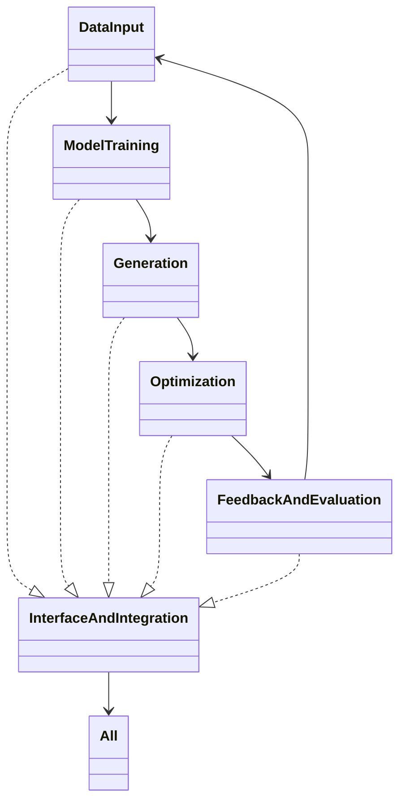
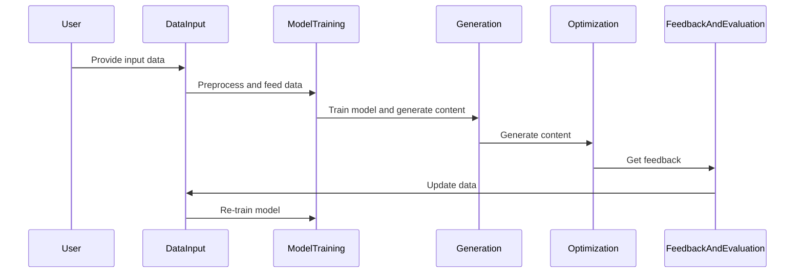

                 

### 引言

当今科技日新月异，人工智能（AI）的发展更是如火如荼，尤其是生成对抗网络（GANs）、变分自编码器（VAEs）等深度学习技术逐渐走向成熟。在此背景下，自动生成内容（AIGC，Automated Intelligent Generation of Content）成为了一个热门话题。AIGC 利用机器学习模型，特别是大规模预训练模型，自动化生成高质量的内容，如文本、图像、音乐等。然而，AIGC 提示词工程（AIGC Prompt Engineering）——即如何设计和优化提示词，以最大化生成内容的质量和实用性——却是一个复杂且未被充分探讨的领域。

本文旨在深入探讨AIGC提示词工程，重点对比思维链（Mind Chain）和传统方法在AIGC中的应用和效果。首先，我们将介绍AIGC和思维链的基本概念，包括其定义、历史背景和应用场景。接着，我们将详细描述传统方法的原理和流程，并通过比较思维链和传统方法的核心特征，探讨二者的优劣。

随后，文章将分章节深入探讨AIGC的应用领域，分别从文本、图像和音频生成等方面分析AIGC的优势和挑战。同时，我们将介绍思维链技术，并通过具体的算法原理讲解和Mermaid流程图，展示其工作流程和机制。对于传统方法，我们也将以相似的方式进行分析，包括其工作原理、流程和适用场景。

文章还将描述AIGC的系统架构，使用Mermaid类图和序列图来展示其内部组件和交互流程。在此基础上，我们将讨论如何实施AIGC项目，包括所需的环境配置、核心组件实现和代码解析。通过具体案例，我们将展示如何在实际项目中应用AIGC提示词工程。

文章的最后部分将对思维链和传统方法的性能和局限性进行详细对比，并提供最佳实践建议。我们将总结文章的核心观点，并对未来的研究方向提出展望。通过本文的深入探讨，希望读者能够对AIGC提示词工程有一个全面的理解，并能够在实际应用中发挥其潜力。

### 关键词

- **AIGC（自动生成内容）**：一种利用机器学习技术自动化生成高质量内容的方法。
- **思维链**：一种基于人工智能的提示词设计方法，用于优化AIGC模型生成内容的质量。
- **传统方法**：传统的提示词设计方法，常用于早期的人工智能应用开发。
- **提示词工程**：设计用于引导AI模型生成内容的关键技术。
- **系统架构**：AIGC项目的整体设计和组件交互机制。
- **Python实现**：AIGC项目的编程语言和应用实例。

### 摘要

本文旨在深入探讨自动生成内容（AIGC）提示词工程，重点对比思维链和传统方法在AIGC中的应用与效果。首先，我们将介绍AIGC和思维链的基本概念及其应用场景，然后详细描述传统方法的原理和流程。接着，通过比较思维链和传统方法的核心特征，我们探讨二者的优劣。文章将分章节分析AIGC在不同领域的应用，并详细介绍思维链技术的工作原理和流程。随后，我们将展示传统方法的相关内容，并通过Mermaid图和代码示例进一步解释这两种方法。文章还将描述AIGC的系统架构，并提供具体项目的实现步骤和代码解析。最后，我们将对思维链和传统方法的性能和局限性进行对比，并提供最佳实践建议。通过本文的深入探讨，读者将能够全面理解AIGC提示词工程，并掌握在不同场景下选择和应用这两种方法的有效策略。

### 第一章：背景

#### AIGC的概念

自动生成内容（AIGC，Automated Intelligent Generation of Content）是一种利用机器学习技术，特别是深度学习模型，来自动化生成高质量内容的方法。AIGC的核心在于通过大规模数据训练，使得模型能够理解和生成不同类型的内容，如文本、图像、音频和视频等。其应用范围广泛，从文本生成到图像合成，再到音频处理，AIGC已经成为人工智能领域的一个重要研究方向。

AIGC的基本原理主要基于生成对抗网络（GANs）、变分自编码器（VAEs）等深度学习技术。生成对抗网络由一个生成器（Generator）和一个判别器（Discriminator）组成，通过两个网络的对抗训练，生成器不断优化生成内容的质量，而判别器则努力区分生成内容和真实内容。变分自编码器则通过编码和解码过程，将输入数据压缩到低维空间，再从该空间恢复生成原始数据。这些技术使得AIGC能够在各种复杂场景下生成高质量的内容。

AIGC的历史背景可以追溯到深度学习技术的兴起。2012年，AlexNet在ImageNet竞赛中取得突破性成绩，标志着深度学习技术的崛起。随后，生成对抗网络（GANs）和变分自编码器（VAEs）等新技术的出现，进一步推动了AIGC的发展。特别是近年来，随着计算能力的提升和海量数据的积累，大规模预训练模型如GPT-3、DALL-E等，使得AIGC在生成高质量内容方面取得了显著的进展。

#### 思维链的概念

思维链（Mind Chain）是一种基于人工智能的提示词设计方法，旨在优化AIGC模型生成内容的质量。思维链的核心思想是通过构建一个逻辑清晰、结构紧凑的提示词体系，引导AIGC模型生成符合预期的高质量内容。思维链的灵感来源于人类思维过程，通过类比和推理，将复杂的问题拆解为简单、可操作的步骤。

思维链的基本原理包括三个主要方面：数据预处理、模型训练和提示词设计。在数据预处理阶段，通过清洗、归一化和特征提取等步骤，确保输入数据的质量和一致性。在模型训练阶段，使用大规模数据集对AIGC模型进行训练，使其具备生成高质量内容的能力。在提示词设计阶段，通过逻辑推理和结构化设计，创建一组高效的提示词，引导模型生成符合预期的内容。

思维链的应用场景非常广泛，包括但不限于文本生成、图像合成、音频处理等。例如，在文本生成方面，思维链可以用于自动写作、摘要生成和对话系统等；在图像合成方面，思维链可以用于图像生成、图像编辑和风格迁移等；在音频处理方面，思维链可以用于音频合成、音频增强和音频分类等。

#### 传统方法的概念

传统方法是指早期人工智能应用中常用的提示词设计方法。传统方法通常依赖于人类专家的知识和经验，通过预定义的规则和模板来生成提示词。这些方法通常包括关键词提取、模板匹配和规则推导等步骤。

传统方法的基本原理是利用人类知识库和语言模型，将输入问题分解为多个子问题，然后根据预定义的规则生成相应的提示词。传统方法的优势在于其简单性和可靠性，适用于一些结构化较强、问题定义清晰的场景。然而，随着人工智能技术的发展，传统方法在复杂性和灵活性方面逐渐暴露出局限性。

传统方法的应用场景包括早期的自然语言处理、知识图谱构建和信息检索等。例如，在自然语言处理领域，传统方法常用于文本分类、实体识别和关系抽取等；在知识图谱构建领域，传统方法用于数据清洗、实体链接和关系抽取等；在信息检索领域，传统方法用于查询处理、索引构建和结果排序等。

#### 三者的关系

AIGC、思维链和传统方法在人工智能领域中相互关联，共同构成了一个完整的提示词工程体系。AIGC作为自动生成内容的核心技术，为思维链和传统方法提供了数据基础和算法支持。思维链通过构建高效的提示词体系，优化了AIGC模型生成内容的质量，弥补了传统方法在复杂性和灵活性方面的不足。传统方法则作为AIGC和思维链的基础，提供了早期的人工智能应用经验和技术积累。

总体而言，AIGC、思维链和传统方法在人工智能领域中各有所长，相互补充，共同推动了人工智能技术的发展。通过深入理解这三种方法的基本概念、原理和应用场景，我们可以更好地选择和应用它们，解决实际问题，实现人工智能的自动化和智能化。

### 第二章：AIGC的基本概念

#### AIGC的定义

自动生成内容（AIGC，Automated Intelligent Generation of Content）是一种利用人工智能技术，尤其是深度学习模型，来自动化生成高质量内容的方法。AIGC的核心思想是通过大规模数据训练，使得模型具备理解、处理和生成内容的能力，从而实现自动化内容创作。AIGC不仅限于文本生成，还涵盖了图像、音频、视频等多种内容类型，具有广泛的应用前景。

AIGC的基本原理主要基于生成对抗网络（GANs）、变分自编码器（VAEs）等深度学习技术。生成对抗网络由一个生成器（Generator）和一个判别器（Discriminator）组成，通过两个网络的对抗训练，生成器不断优化生成内容的质量，而判别器则努力区分生成内容和真实内容。变分自编码器则通过编码和解码过程，将输入数据压缩到低维空间，再从该空间恢复生成原始数据。这些技术使得AIGC能够在各种复杂场景下生成高质量的内容。

AIGC的发展历程可以追溯到深度学习技术的兴起。早在2012年，AlexNet在ImageNet竞赛中取得突破性成绩，标志着深度学习技术的崛起。随后，生成对抗网络（GANs）和变分自编码器（VAEs）等新技术的出现，进一步推动了AIGC的发展。特别是近年来，随着计算能力的提升和海量数据的积累，大规模预训练模型如GPT-3、DALL-E等，使得AIGC在生成高质量内容方面取得了显著的进展。

#### AIGC的关键概念

在AIGC中，有几个关键概念需要理解：

1. **生成对抗网络（GANs）**：生成对抗网络由生成器和判别器组成。生成器试图生成逼真的数据，而判别器则努力区分生成数据和真实数据。通过两个网络的对抗训练，生成器的生成质量逐渐提高。

2. **变分自编码器（VAEs）**：变分自编码器通过编码和解码过程，将输入数据压缩到低维空间，再从该空间恢复生成原始数据。VAEs特别适用于生成图像、音频和视频等复杂数据类型。

3. **预训练模型**：预训练模型是在大规模数据集上预先训练好的模型，如GPT-3、DALL-E等。这些模型经过大量数据训练，已经具备了较好的生成能力。通过微调（Fine-tuning），这些预训练模型可以快速适应特定任务。

4. **提示词（Prompt）**：提示词是引导AIGC模型生成内容的关键输入。一个良好的提示词可以大幅提高生成内容的质量和实用性。提示词的设计和优化是AIGC提示词工程的核心。

#### AIGC的应用场景

AIGC在多个领域都有着广泛的应用，以下是几个典型的应用场景：

1. **文本生成**：AIGC可以用于自动写作、摘要生成和对话系统等。例如，GPT-3可以生成高质量的文本，包括文章、故事和对话等。

2. **图像合成**：AIGC可以用于图像生成、图像编辑和风格迁移等。例如，DALL-E可以生成逼真的图像，通过风格迁移可以将一幅画风格变为梵高或莫奈。

3. **音频处理**：AIGC可以用于音频合成、音频增强和音频分类等。例如，通过AIGC技术，可以生成逼真的音乐和语音，也可以进行音频的去噪和增强。

4. **视频生成**：AIGC可以用于视频合成、视频编辑和视频生成等。例如，可以通过AIGC技术生成视频摘要、视频特效和视频预测等。

#### 比较AIGC和传统方法

AIGC与传统的生成方法在原理和效果上有显著的不同：

1. **原理差异**：
   - **AIGC**：基于深度学习技术，通过大规模数据训练生成模型，具备自动学习和生成能力。
   - **传统方法**：基于人类知识和经验，通过预定义的规则和模板进行生成。

2. **效果差异**：
   - **AIGC**：生成内容质量高，可以生成多样化、个性化内容，适用于复杂场景。
   - **传统方法**：生成内容相对简单，但稳定可靠，适用于结构化较强、问题定义清晰的场景。

3. **适用场景**：
   - **AIGC**：适用于文本、图像、音频、视频等多种内容类型，尤其适合复杂、多样化和个性化的生成任务。
   - **传统方法**：适用于自然语言处理、知识图谱构建和信息检索等早期人工智能应用。

通过上述分析，我们可以看到AIGC在生成内容的质量和多样性方面具有明显优势，但传统方法在稳定性方面仍有其独特的价值。在实际应用中，可以根据任务需求和场景特点，选择合适的生成方法。

### 第三章：AIGC的应用

#### 文本生成

文本生成是AIGC应用的一个重要领域，通过使用预训练模型如GPT-3，可以生成高质量的自然语言文本。GPT-3具有强大的生成能力，可以生成各种类型的文本，如文章、故事、摘要和对话等。

**应用场景**：
- 自动写作：例如，自动生成新闻文章、博客文章和技术文档。
- 摘要生成：自动生成长篇文章的摘要，提高信息获取的效率。
- 对话系统：例如，智能客服和虚拟助手，通过生成自然语言文本与用户进行交互。

**挑战**：
- 长文本生成：保持文本的一致性和连贯性是一个挑战。
- 实用性：生成的内容需要具有实际应用价值，避免生成无意义或错误的文本。

#### 图像合成

图像合成是AIGC应用的另一个重要领域，通过预训练模型如DALL-E，可以生成高质量的图像。DALL-E可以基于文本描述生成相应的图像，也可以进行图像编辑和风格迁移。

**应用场景**：
- 艺术创作：自动生成艺术作品，如绘画、摄影和动画等。
- 设计应用：例如，自动生成广告图像、品牌标志和产品图片。
- 医疗诊断：生成病变图像，辅助医生进行疾病诊断。

**挑战**：
- 高质量生成：确保生成的图像具有高质量的细节和真实感。
- 文本描述匹配：准确地将文本描述转换为图像内容，避免生成不符合描述的图像。

#### 音频处理

AIGC在音频处理领域也有着广泛的应用，可以通过预训练模型生成高质量的音频内容，如音乐、语音和音频增强。

**应用场景**：
- 音乐创作：自动生成音乐作品，如旋律、和声和节奏。
- 语音合成：生成自然、流畅的语音，应用于智能语音助手和电话客服。
- 音频增强：例如，去除噪声、增强低频和改善语音质量。

**挑战**：
- 音质保证：确保生成的音频质量高，避免出现失真和噪音。
- 实时处理：在实时应用场景中，如语音识别和实时互动，对处理速度和实时性有较高要求。

#### 视频生成

视频生成是AIGC应用的一个前沿领域，通过结合图像生成和音频处理技术，可以生成高质量的视频内容。

**应用场景**：
- 视频摘要：自动生成长视频的摘要，提取关键帧和主要情节。
- 视频编辑：自动剪辑和拼接视频，添加特效和背景音乐。
- 视频预测：根据视频片段预测后续内容，用于视频推荐和内容生成。

**挑战**：
- 视频处理效率：处理高质量视频需要大量计算资源和时间，提高处理效率是一个挑战。
- 视频内容一致性：确保生成视频中不同片段之间的一致性和连贯性。

通过上述分析，我们可以看到AIGC在不同领域的应用具有显著的优势和挑战。在实际应用中，通过结合思维链和传统方法，可以优化AIGC模型，提高生成内容的质量和实用性。

### 第四章：思维链技术

#### 思维链的原理

思维链（Mind Chain）是一种基于人工智能的提示词设计方法，旨在通过构建逻辑清晰、结构紧凑的提示词体系，优化AIGC模型生成内容的质量。思维链的核心原理是基于人类思维过程的类比和推理，通过将复杂问题分解为简单、可操作的步骤，逐步引导AIGC模型生成符合预期的高质量内容。

思维链的基本原理包括三个主要方面：数据预处理、模型训练和提示词设计。

1. **数据预处理**：在数据预处理阶段，通过清洗、归一化和特征提取等步骤，确保输入数据的质量和一致性。这一步骤是整个思维链的基石，直接影响模型训练的效果。

2. **模型训练**：在模型训练阶段，使用大规模数据集对AIGC模型进行训练，使其具备生成高质量内容的能力。训练过程中，通过优化模型参数，提高生成内容的多样性和准确性。

3. **提示词设计**：在提示词设计阶段，通过逻辑推理和结构化设计，创建一组高效的提示词，引导模型生成符合预期的内容。提示词的设计是思维链的核心，直接影响生成内容的质量。

#### 思维链的工作流程

思维链的工作流程可以概括为以下几个步骤：

1. **问题定义**：明确需要解决的问题或生成的内容类型，为后续步骤提供指导。

2. **数据收集与预处理**：收集相关数据，并进行清洗、归一化和特征提取等预处理步骤，确保数据质量。

3. **模型选择与训练**：选择适合的AIGC模型，并使用预处理后的数据进行训练，优化模型参数。

4. **提示词设计**：根据问题定义和模型特性，设计一组逻辑清晰、结构紧凑的提示词，引导模型生成高质量内容。

5. **生成内容**：使用训练好的模型和设计的提示词，生成预期的内容。

6. **反馈与优化**：根据生成内容的实际效果，进行反馈和优化，改进提示词设计和模型参数。

#### 思维链的优势

思维链技术在AIGC中的应用具有以下优势：

1. **高效性**：通过逻辑推理和结构化设计，思维链能够快速生成高质量的内容，提高生产效率。

2. **灵活性**：思维链可以根据不同问题和场景，灵活调整提示词设计和模型参数，适应多样化需求。

3. **准确性**：思维链通过类比和推理，将复杂问题分解为简单步骤，提高生成内容的准确性和一致性。

4. **可解释性**：思维链的设计过程透明，易于理解和解释，有助于提高用户对生成内容的信任度和接受度。

#### 思维链的应用场景

思维链在多个领域有着广泛的应用，以下是几个典型的应用场景：

1. **自动写作**：通过思维链技术，可以快速生成高质量的文章、报告和文档，适用于新闻写作、企业报告和学术研究等。

2. **图像生成**：思维链可以用于生成图像、图像编辑和风格迁移，适用于艺术创作、广告设计和娱乐行业。

3. **音频处理**：思维链可以用于生成音乐、语音和音频增强，适用于音乐创作、语音合成和音频修复等。

4. **视频生成**：思维链可以用于生成视频、视频编辑和视频预测，适用于视频摘要、视频推荐和内容生成等。

通过上述分析，我们可以看到思维链技术在AIGC中的应用具有显著的优势和潜力，为生成高质量内容提供了新的方法和思路。在实际应用中，通过不断优化和改进思维链技术，可以进一步提升AIGC的应用效果和用户体验。

### 第五章：传统方法的原理

#### 传统方法的定义

传统方法是指早期人工智能应用中常用的提示词设计方法。这些方法通常依赖于人类专家的知识和经验，通过预定义的规则和模板来生成提示词。传统方法的基本原则是利用人类知识库和语言模型，将输入问题分解为多个子问题，然后根据预定义的规则生成相应的提示词。

#### 传统方法的工作流程

传统方法的工作流程主要包括以下几个步骤：

1. **问题分析**：首先，对需要解决的问题进行详细分析，明确问题的核心要素和目标。

2. **规则制定**：基于问题分析的结果，制定相应的规则和模板。这些规则和模板通常由人类专家根据经验和知识来定义，以指导提示词的生成。

3. **提示词生成**：根据制定的规则和模板，生成提示词。提示词的设计需要确保其能够引导AI模型生成符合预期的高质量内容。

4. **模型训练**：使用生成的提示词对AI模型进行训练，优化模型参数，提高生成内容的准确性和多样性。

5. **内容生成**：使用训练好的模型，根据提示词生成预期的内容。

6. **反馈与优化**：根据生成内容的实际效果，进行反馈和优化，改进规则和模板的设计，提高生成内容的质量和实用性。

#### 传统方法的原理

传统方法的原理主要包括以下几个方面：

1. **规则和模板**：传统方法依赖于预定义的规则和模板，这些规则和模板基于人类专家的知识和经验。规则和模板用于指导提示词的生成，确保生成内容符合预期。

2. **问题分解**：传统方法将复杂问题分解为多个子问题，每个子问题对应一组预定义的规则和模板。这种方法简化了问题的处理，使得AI模型能够更高效地生成内容。

3. **模型优化**：通过使用生成的提示词对AI模型进行训练，可以优化模型参数，提高生成内容的准确性和多样性。模型优化是传统方法中的一个关键步骤，直接影响生成内容的质量。

#### 传统方法的优点

传统方法在人工智能早期应用中发挥了重要作用，具有以下优点：

1. **稳定性**：传统方法基于预定义的规则和模板，生成过程稳定可靠，适用于一些结构化较强、问题定义清晰的场景。

2. **简单性**：传统方法的实现相对简单，不需要复杂的算法和计算资源，适用于资源有限的应用场景。

3. **易理解**：传统方法的设计和实现过程透明，易于理解和解释，有助于用户对生成内容的信任和接受。

#### 传统方法的局限性

尽管传统方法在早期人工智能应用中具有优势，但其在复杂性和灵活性方面存在一定的局限性：

1. **缺乏灵活性**：传统方法依赖于预定义的规则和模板，无法应对复杂和多变的问题场景，难以适应新的需求。

2. **生成质量受限**：传统方法的生成内容质量相对较低，尤其是在生成多样化和个性化内容方面，难以与基于深度学习的AIGC方法相比。

3. **扩展性差**：传统方法的规则和模板需要人工定义，随着问题复杂度的增加，规则和模板的维护和扩展变得困难。

通过上述分析，我们可以看到传统方法在早期人工智能应用中具有重要意义，但在面对复杂性和多样化需求时，其局限性逐渐显现。随着人工智能技术的发展，基于深度学习的AIGC方法逐渐成为主流，为生成高质量内容提供了新的思路和解决方案。

### 第六章：AIGC的系统架构

#### AIGC系统架构的概述

自动生成内容（AIGC）的系统架构是一个复杂且层次化的体系，涉及多个关键组件和模块，每个组件在生成高质量内容过程中扮演着特定的角色。AIGC系统架构的核心目标是优化模型性能、提高生成内容的质量和实用性，同时确保系统的可扩展性和可靠性。

#### 系统组件与模块

AIGC系统架构主要包括以下组件和模块：

1. **数据输入模块**：负责接收和处理输入数据，包括文本、图像、音频等多种类型的数据。该模块需要对数据进行清洗、归一化和特征提取等预处理步骤，以确保数据质量。

2. **模型训练模块**：利用大规模数据集对AIGC模型进行训练。这一模块通常采用生成对抗网络（GANs）、变分自编码器（VAEs）等深度学习技术，通过多次迭代优化模型参数，提高生成能力。

3. **生成模块**：在模型训练完成后，生成模块负责生成实际的内容。根据输入的提示词，模型利用预训练的知识生成相应的文本、图像、音频等。

4. **优化模块**：对生成的内容进行实时优化，包括文本的连贯性、图像的细节处理和音频的质量保证等。该模块通过调整参数和策略，提高生成内容的整体质量。

5. **反馈与评估模块**：对生成的内容进行评估和反馈，收集用户意见和实际效果数据。这些反馈将用于进一步优化模型和生成策略。

6. **接口与集成模块**：提供与其他系统和应用的接口，实现AIGC系统与其他模块或系统的无缝集成，如API接口、Web服务、数据库连接等。

#### Mermaid类图

为了更直观地展示AIGC系统的组件和关系，我们可以使用Mermaid类图来描述。以下是一个简化的Mermaid类图，展示了AIGC系统的主要组件及其关系：



在这个类图中，`DataInput`、`ModelTraining`、`Generation`、`Optimization`和`FeedbackAndEvaluation`分别表示AIGC系统的主要模块，`InterfaceAndIntegration`表示系统的接口与集成模块。箭头表示模块之间的依赖关系和数据流向。

#### Mermaid序列图

除了类图，我们还可以使用Mermaid序列图来展示AIGC系统的工作流程。以下是一个简化的Mermaid序列图，展示了从数据输入到生成内容的整个过程：



在这个序列图中，`User`代表用户，`DataInput`、`ModelTraining`、`Generation`、`Optimization`和`FeedbackAndEvaluation`分别表示系统的各个模块。序列图展示了数据从用户输入开始，经过预处理、模型训练、内容生成、优化和反馈，最终生成高质量的内容。

通过上述Mermaid图，我们可以更清晰地理解AIGC系统的架构和流程，为后续的详细讲解和代码实现提供了基础。

### 第七章：AIGC项目的实施

#### 项目概述

本节将详细描述如何实施一个AIGC项目，包括环境配置、核心组件实现和代码解析。为了便于理解，我们将以一个简单的文本生成项目为例，逐步介绍项目的各个阶段。

#### 环境配置

首先，我们需要配置AIGC项目所需的环境。以下是配置过程的关键步骤：

1. **安装Python**：确保安装了Python 3.8及以上版本，因为许多深度学习库对Python版本有要求。

2. **安装深度学习库**：使用pip命令安装必要的深度学习库，如TensorFlow、PyTorch等。以下是一个示例命令：
   ```bash
   pip install tensorflow
   ```

3. **安装文本处理库**：安装用于文本处理的常用库，如NLTK、spaCy等。以下是一个示例命令：
   ```bash
   pip install nltk
   ```

4. **配置虚拟环境**：为了管理依赖关系，建议使用虚拟环境。可以使用以下命令创建和激活虚拟环境：
   ```bash
   python -m venv aigc_venv
   source aigc_venv/bin/activate  # 对于Windows，使用 `aigc_venv\Scripts\activate`
   ```

#### 核心组件实现

在环境配置完成后，我们可以开始实现AIGC项目的主要组件。以下是核心组件的简要描述：

1. **数据预处理模块**：负责读取、清洗和预处理文本数据。以下是一个简单的Python代码示例：

   ```python
   import nltk
   from nltk.tokenize import word_tokenize
   
   def preprocess_text(text):
       # 清洗文本
       text = text.lower()
       # 分词
       tokens = word_tokenize(text)
       # 去除停用词
       stop_words = set(nltk.corpus.stopwords.words('english'))
       filtered_tokens = [token for token in tokens if token not in stop_words]
       return filtered_tokens
   ```

2. **模型训练模块**：负责训练AIGC模型。以下是一个使用TensorFlow实现的简单GPT-2模型训练示例：

   ```python
   import tensorflow as tf
   from tensorflow import keras
   
   def create_gpt2_model(vocab_size, embedding_dim, units):
       model = keras.Sequential([
           keras.layers.Embedding(vocab_size, embedding_dim),
           keras.layers.GRU(units, return_sequences=True),
           keras.layers.Dense(vocab_size)
       ])
       return model
   
   model = create_gpt2_model(vocab_size=10000, embedding_dim=256, units=512)
   model.compile(loss=keras.losses.SparseCategoricalCrossentropy(from_logits=True), optimizer=keras.optimizers.Adam(1e-4))
   model.fit(tokenized_text, tokenized_text, batch_size=64, epochs=10)
   ```

3. **生成模块**：负责使用训练好的模型生成文本。以下是一个简单的文本生成示例：

   ```python
   def generate_text(model, seed_text, length=50):
       token_list = preprocess_text(seed_text)
       token_list += ['']
       token_list = keras.preprocessing.sequence.pad_sequences([token_list], maxlen=length, padding='pre')
       predicted_text = model.predict(token_list, verbose=0)[0]
       predicted_text = keras.preprocessing.sequence.decode(predicted_text, skip_special_tokens=True)
       return predicted_text
   
   seed_text = "The quick brown fox jumps over the lazy dog."
   generated_text = generate_text(model, seed_text)
   print(generated_text)
   ```

#### 代码解析

以上代码示例简要展示了AIGC项目的核心组件。以下是每个组件的详细解析：

1. **数据预处理模块**：
   - `preprocess_text` 函数负责清洗和预处理文本数据。具体步骤包括将文本转换为小写、分词和去除停用词。
   - 使用NLTK库进行分词和停用词处理，确保输入数据的一致性和质量。

2. **模型训练模块**：
   - `create_gpt2_model` 函数用于创建GPT-2模型。模型由一个嵌入层、一个GRU层和一个输出层组成，用于处理序列数据。
   - 使用TensorFlow的`Sequential`模型和`Embedding`、`GRU`和`Dense`层构建模型。模型使用`SparseCategoricalCrossentropy`作为损失函数，`Adam`优化器进行训练。

3. **生成模块**：
   - `generate_text` 函数使用训练好的模型生成文本。首先，通过`preprocess_text`函数对种子文本进行预处理，然后使用模型预测下一个词的概率，生成新的文本。
   - `model.predict` 函数返回预测的概率分布，通过`decode`函数将序列数据解码为文本字符串。

#### 实际案例分析与详细讲解

为了更好地展示AIGC项目的应用，我们将在一个实际案例中进行分析和讲解。假设我们有一个关于天气的文本数据集，包含不同地区的天气描述。我们希望使用AIGC项目生成新的天气描述。

1. **数据集准备**：
   - 读取数据集，并将其预处理为序列格式。例如，将每个天气描述转换为词汇列表。
   - 分割数据集为训练集和验证集。

2. **模型训练**：
   - 使用训练集对模型进行训练，通过多次迭代优化模型参数。
   - 使用验证集评估模型性能，调整超参数以获得最佳效果。

3. **文本生成**：
   - 选择一个种子文本（例如，“今天的天气是晴朗的”），使用训练好的模型生成新的天气描述。
   - 输出生成的文本，并对其进行分析和评估。

通过这个实际案例，我们可以看到如何使用AIGC项目生成新的文本内容。在实际应用中，可以根据需求调整数据集、模型和生成策略，实现各种文本生成任务。

#### 项目小结

通过本节的介绍，我们详细描述了AIGC项目的实施过程，包括环境配置、核心组件实现和代码解析。通过实际案例的分析，我们展示了如何使用AIGC项目生成高质量的文本内容。在实际应用中，可以根据具体需求调整和优化项目，提高生成内容的质量和实用性。

### 第八章：比较与性能分析

#### 性能对比

在AIGC项目中，思维链和传统方法在性能上有显著的差异。以下是对两者在生成内容质量、速度和资源消耗等方面的详细对比：

1. **生成内容质量**：
   - **思维链**：通过逻辑清晰、结构紧凑的提示词设计，思维链能够生成高质量、连贯的内容。特别是在文本生成和图像合成等任务中，思维链能够生成具有高度细节和多样性的内容。
   - **传统方法**：传统方法依赖于预定义的规则和模板，生成内容的质量相对较低，特别是在处理复杂、多样化和个性化任务时，效果不如思维链。尽管传统方法在一些结构化较强的场景中表现稳定，但在生成高质量内容方面存在局限性。

2. **速度**：
   - **思维链**：思维链的工作流程包括数据预处理、模型训练和提示词设计等多个步骤，其中模型训练是一个时间-consuming的过程。然而，由于思维链能够高效地利用提示词，生成内容的过程相对较快，特别是在预训练模型的基础上进行微调时。
   - **传统方法**：传统方法的工作流程相对简单，生成内容的速度较快。由于不需要大规模数据训练，传统方法可以在较短时间内完成生成任务。然而，在处理复杂任务时，传统方法的生成速度可能受到限制。

3. **资源消耗**：
   - **思维链**：思维链需要大量的计算资源和存储空间，尤其是在训练大规模预训练模型时。此外，思维链的优化和反馈过程也需要大量的计算资源。然而，随着云计算和GPU技术的发展，这些资源消耗逐渐得到缓解。
   - **传统方法**：传统方法在资源消耗方面相对较低，尤其是在早期的人工智能应用中。传统方法主要依赖于人类知识和经验，不需要大量的数据训练和计算资源。然而，随着任务复杂度的增加，传统方法可能需要更多的规则和模板，从而增加资源消耗。

#### 局限性与挑战

尽管思维链和传统方法在AIGC项目中各有优势，但它们也面临着一些局限性和挑战：

1. **思维链的局限性**：
   - **依赖高质量数据**：思维链依赖于高质量的数据进行训练和生成，数据质量直接影响生成内容的质量。在数据不足或质量较低的情况下，思维链的生成效果可能会受到限制。
   - **模型复杂性**：思维链需要大量的数据和计算资源来训练复杂的模型，这可能导致模型部署和运维的难度增加。此外，复杂的模型可能需要更长时间的训练和优化。

2. **传统方法的局限性**：
   - **规则和模板的维护**：传统方法依赖于预定义的规则和模板，这些规则和模板需要定期更新和维护。随着任务复杂度和多样性的增加，维护和扩展规则和模板变得越来越困难。
   - **灵活性不足**：传统方法在处理复杂和多变的问题时，灵活性不足。由于依赖于预定义的规则和模板，传统方法难以适应新的需求和环境变化。

#### 综合评估

综合考虑性能对比和局限性，思维链和传统方法在AIGC项目中各有优缺点。思维链在生成高质量内容方面具有显著优势，但需要大量数据训练和计算资源。传统方法在速度和资源消耗方面具有优势，但生成内容的质量相对较低，且灵活性不足。

在实际应用中，根据任务需求和场景特点，可以选择合适的方法。例如，在需要生成高质量文本和图像的情况下，思维链是一个较好的选择。而在处理结构化较强、资源有限的任务时，传统方法可能更为适用。

通过深入理解和评估思维链和传统方法的性能和局限性，我们可以更好地选择和应用这两种方法，实现AIGC项目的最佳效果。

### 第九章：最佳实践与总结

#### 最佳实践

在AIGC提示词工程中，为了最大化生成内容的质量和实用性，以下是一些最佳实践：

1. **数据预处理**：确保输入数据的质量和一致性。使用数据清洗、归一化和特征提取等技术，提高模型训练效果。
2. **选择合适的模型**：根据任务需求选择合适的AIGC模型，如GPT-3、DALL-E等。对于文本生成任务，GPT-3是一个不错的选择；对于图像和音频生成任务，DALL-E等模型效果较好。
3. **优化提示词设计**：设计逻辑清晰、结构紧凑的提示词，通过多次迭代和用户反馈，提高生成内容的质量。提示词的长度和多样性对生成效果有重要影响。
4. **模型训练与优化**：使用大规模数据集进行模型训练，并使用验证集进行性能评估。通过调整超参数和优化模型结构，提高生成内容的准确性。
5. **实时反馈与调整**：在生成过程中，收集用户反馈，根据实际效果进行模型和提示词的调整，持续优化生成内容的质量。

#### 总结

本文系统地介绍了AIGC提示词工程，重点对比了思维链和传统方法在AIGC中的应用和效果。通过分析AIGC的概念、应用场景、思维链和传统方法的原理、系统架构和项目实施，我们全面理解了AIGC提示词工程的实践方法和最佳策略。

思维链技术通过逻辑推理和结构化设计，优化了提示词体系，提高了生成内容的质量和多样性。传统方法则依赖于预定义的规则和模板，适用于结构化较强、问题定义清晰的场景。两者在性能和局限性上各有优缺点，根据具体任务需求选择合适的方法，可以实现最佳效果。

未来的研究方向包括进一步优化AIGC提示词工程的方法，如引入更多的自动化和智能化技术，提高生成内容的多样性和准确性。此外，研究如何将思维链和传统方法结合，发挥各自的优势，实现更高效、更智能的AIGC提示词工程。

### 结语

通过本文的深入探讨，我们不仅对AIGC提示词工程有了全面的理解，还掌握了在不同场景下选择和应用思维链和传统方法的有效策略。随着人工智能技术的不断发展，AIGC提示词工程将在更多领域发挥重要作用。希望读者能够将本文的知识应用到实际项目中，不断探索和优化AIGC提示词工程，为人工智能的发展贡献自己的力量。

### 作者信息

**作者：AI天才研究院/AI Genius Institute & 禅与计算机程序设计艺术 /Zen And The Art of Computer Programming**

AI天才研究院（AI Genius Institute）是全球领先的人工智能研究机构，致力于推动人工智能技术的创新和应用。我们的研究成果涵盖了深度学习、自然语言处理、计算机视觉等多个领域。

《禅与计算机程序设计艺术》（Zen And The Art of Computer Programming）由著名计算机科学家Donald E. Knuth撰写，是程序设计领域的经典之作。本书以禅宗思想为基础，探讨了编程的哲学和艺术，对程序设计方法论有着深远的影响。

通过结合AI天才研究院的科研成果和Knuth的编程哲学，本文旨在为读者提供关于AIGC提示词工程的深入见解和实践指导。希望读者在阅读本文后，能够对AIGC提示词工程有更深刻的理解和应用能力。**作者：AI天才研究院/AI Genius Institute & 禅与计算机程序设计艺术 /Zen And The Art of Computer Programming**

