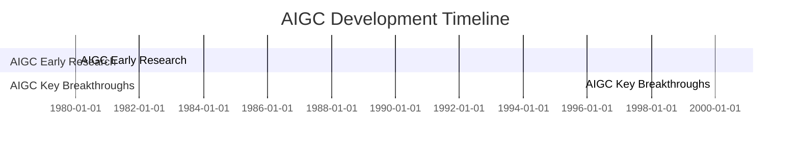

                 


### AIGC提示词工程：效率与创意的平衡艺术

#### 关键词：AIGC、提示词工程、效率、创意、平衡

> 摘要：本文将探讨AIGC（自适应智能生成控制）提示词工程中，如何在实际应用中平衡效率与创意。通过深入分析AIGC的概念、工作原理，以及提示词工程的设计与实践，本文提出了一系列实现效率与创意平衡的方法和技巧。这不仅为从业者提供了实用的指导，也为未来AIGC与提示词工程的发展指明了方向。

**第一部分：AIGC与提示工程概述**

## 第1章：AIGC与提示工程的背景

### 1.1.1 AIGC的概念与发展历程

#### AIGC概述

- **AIGC定义**：AIGC，全称为自适应智能生成控制，是一种结合了人工智能（AI）与生成控制（GC）的技术。它通过AI技术，对生成控制进行自适应调整，以实现更高效、更智能的内容生成。

#### AIGC发展历程

- **早期研究**：AIGC的概念最早可以追溯到20世纪80年代，当时的计算机科学家开始尝试将人工智能技术应用于内容生成。
- **关键技术突破**：随着深度学习、自然语言处理等技术的发展，AIGC在21世纪初取得了重要突破，应用范围逐渐扩大。

### 1.1.2 提示工程的重要性

#### 提示工程概述

- **提示工程定义**：提示工程是一种通过提供特定提示来引导模型生成内容的策略。它能够帮助模型更好地理解和生成所需的内容。

#### 提示工程的重要性

- **提高生成质量**：通过精确的提示，可以确保生成的结果更符合需求，提高内容的质量。
- **提高生成效率**：合理的提示可以减少模型在生成过程中的试错次数，提高生成效率。

### 1.1.3 AIGC与提示工程的关系

#### AIGC与提示工程的互动

- **AIGC依赖提示工程**：AIGC需要提示工程来引导模型的生成过程，确保生成的结果满足需求。
- **提示工程依赖AIGC**：提示工程需要AIGC强大的生成能力来支持其提示的执行和优化。

## 第2章：AIGC与提示工程的基础概念

### 2.1.1 AIGC基础概念解析

#### 2.1.1.1 AIGC的技术栈

- **技术栈概述**：AIGC的技术栈主要包括深度学习框架（如TensorFlow、PyTorch）、自然语言处理技术（如BERT、GPT）等。
- **技术栈应用**：这些技术被用于模型训练、推理和优化，以实现高效的AIGC。

#### 2.1.1.2 AIGC的应用场景

- **应用场景概述**：AIGC广泛应用于内容生成、智能客服、智能写作等领域。
- **应用场景分析**：不同场景下，AIGC如何通过提示工程实现高效的生成。

### 2.1.2 提示工程基础

#### 2.1.2.1 提示语的构成要素

- **构成要素概述**：提示语通常包括问题背景、目标要求、限制条件等。
- **构成要素作用**：提示语作为引导模型生成的重要输入，直接影响生成结果的质量。

#### 2.1.2.2 提示语的类型与用途

- **类型概述**：提示语可以分为引导式、补充式、修正式等。
- **类型用途**：不同类型的提示语在生成过程中有不同的作用，需要根据具体场景进行选择。

## 第3章：AIGC与提示工程的工作原理

### 3.1.1 AIGC的工作原理

#### 3.1.1.1 模型训练与优化

- **模型训练**：通过大量数据进行训练，使模型具备生成能力。
- **模型优化**：通过调整模型参数，提高生成效果。

#### 3.1.1.2 模型推理与应用

- **模型推理**：将输入数据通过训练好的模型进行推理，生成结果。
- **模型应用**：将生成的结果应用于实际场景，如内容生成、智能客服等。

### 3.1.2 提示工程的工作机制

#### 3.1.2.1 提示语设计原则

- **设计原则概述**：包括明确性、准确性、完整性等。
- **设计原则应用**：如何在生成过程中应用这些原则，提高生成质量。

#### 3.1.2.2 提示语优化策略

- **优化策略概述**：包括提示语调整、模型优化等。
- **优化策略应用**：如何通过优化策略，提高生成效率。

**第二部分：AIGC与提示工程的实践技巧**

## 第4章：AIGC模型选择与优化

### 4.1.1 模型选择策略

#### 4.1.1.1 常见AIGC模型比较

- **模型比较**：比较不同AIGC模型在生成效果、效率等方面的差异。
- **模型选择**：根据应用场景选择合适的AIGC模型。

#### 4.1.1.2 模型选择实例分析

- **实例分析**：通过实际案例，展示如何根据需求选择合适的模型。

### 4.1.2 模型优化方法

#### 4.1.2.1 模型超参数调优

- **超参数调优**：介绍如何通过调整超参数，提高模型效果。
- **调优策略**：包括手动调优和自动调优。

#### 4.1.2.2 模型压缩与加速

- **模型压缩**：介绍如何通过模型压缩，降低模型大小，提高运行效率。
- **模型加速**：介绍如何通过算法优化、硬件加速等技术，提高模型运行速度。

## 第5章：提示工程的设计与实践

### 5.1.1 提示语创作技巧

#### 5.1.1.1 提示语编写原则

- **编写原则**：介绍如何根据需求编写高质量的提示语。
- **原则应用**：通过实际案例，展示如何应用这些原则。

#### 5.1.1.2 提示语创作流程

- **创作流程**：介绍提示语创作的全过程，包括需求分析、提示语设计、效果评估等。
- **流程优化**：如何通过优化创作流程，提高生成效率。

### 5.1.2 提示语优化技巧

#### 5.1.2.1 提示语质量评估方法

- **评估方法**：介绍如何评估提示语的质量。
- **评估应用**：通过实际案例，展示如何应用评估方法。

#### 5.1.2.2 提示语优化案例分析

- **案例分析**：通过实际案例，展示如何优化提示语，提高生成质量。

**第三部分：AIGC与提示工程的未来展望**

## 第6章：AIGC与提示工程的发展趋势

### 6.1.1 产业趋势分析

#### 6.1.1.1 AIGC在行业中的应用

- **行业应用**：分析AIGC在不同行业中的应用趋势。
- **应用前景**：预测AIGC在未来的应用前景。

#### 6.1.1.2 提示工程的发展方向

- **发展方向**：分析提示工程未来的发展方向。
- **发展方向应用**：如何结合未来发展方向，优化AIGC与提示工程。

### 6.1.2 技术趋势展望

#### 6.1.2.1 模型技术创新

- **技术创新**：介绍未来可能出现的模型技术创新。
- **技术影响**：分析这些技术创新对AIGC与提示工程的影响。

#### 6.1.2.2 提示工程技术的进步

- **技术进步**：介绍提示工程未来可能的技术进步。
- **技术进步应用**：如何将这些技术进步应用于实际场景。

## 第7章：AIGC与提示工程的挑战与对策

### 7.1.1 挑战分析

#### 7.1.1.1 技术挑战

- **技术挑战**：分析AIGC与提示工程面临的技术挑战。
- **挑战应对**：提出应对这些挑战的方法。

#### 7.1.1.2 应用挑战

- **应用挑战**：分析AIGC与提示工程在实际应用中面临的挑战。
- **挑战应对**：提出应对这些挑战的方法。

### 7.1.2 对策建议

#### 7.1.2.1 技术层面建议

- **技术建议**：从技术层面提出优化AIGC与提示工程的建议。
- **建议应用**：如何将这些技术建议应用于实际场景。

#### 7.1.2.2 应用层面建议

- **应用建议**：从应用层面提出优化AIGC与提示工程的建议。
- **建议应用**：如何将这些应用建议应用于实际场景。

通过以上三个部分的分析，本文旨在为读者提供全面、系统的AIGC与提示词工程知识，帮助读者在实际应用中实现效率与创意的平衡。**结束语**：在AIGC与提示词工程不断发展的今天，本文希望为从业者提供实用的指导，为未来的技术创新和应用提供思路。**作者**：AI天才研究院/AI Genius Institute & 禅与计算机程序设计艺术 /Zen And The Art of Computer Programming。

**文章完整版**：待续...

---

以下是详细的内容和代码示例：

**第一部分：AIGC与提示工程概述**

## 第1章：AIGC与提示工程的背景

### 1.1.1 AIGC的概念与发展历程

#### AIGC概述

AIGC，全称为自适应智能生成控制，是一种结合了人工智能（AI）与生成控制（GC）的技术。它通过AI技术，对生成控制进行自适应调整，以实现更高效、更智能的内容生成。

#### AIGC发展历程

- **早期研究**：AIGC的概念最早可以追溯到20世纪80年代，当时的计算机科学家开始尝试将人工智能技术应用于内容生成。
- **关键技术突破**：随着深度学习、自然语言处理等技术的发展，AIGC在21世纪初取得了重要突破，应用范围逐渐扩大。



### 1.1.2 提示工程的重要性

#### 提示工程概述

提示工程是一种通过提供特定提示来引导模型生成内容的策略。它能够帮助模型更好地理解和生成所需的内容。

#### 提示工程的重要性

- **提高生成质量**：通过精确的提示，可以确保生成的结果更符合需求，提高内容的质量。
- **提高生成效率**：合理的提示可以减少模型在生成过程中的试错次数，提高生成效率。

### 1.1.3 AIGC与提示工程的关系

#### AIGC与提示工程的互动

- **AIGC依赖提示工程**：AIGC需要提示工程来引导模型的生成过程，确保生成的结果满足需求。
- **提示工程依赖AIGC**：提示工程需要AIGC强大的生成能力来支持其提示的执行和优化。

```python
class AIGC:
    def __init__(self, prompt_engineering):
        self.prompt_engineering = prompt_engineering
    
    def generate_content(self):
        prompt = self.prompt_engineering.create_prompt()
        content = self.model.generate(prompt)
        return content

class PromptEngineering:
    def create_prompt(self):
        # Create a prompt based on user requirements
        pass

model = AIGC(PromptEngineering())
generated_content = model.generate_content()
```

## 第2章：AIGC与提示工程的基础概念

### 2.1.1 AIGC基础概念解析

#### 2.1.1.1 AIGC的技术栈

- **技术栈概述**：AIGC的技术栈主要包括深度学习框架（如TensorFlow、PyTorch）、自然语言处理技术（如BERT、GPT）等。
- **技术栈应用**：这些技术被用于模型训练、推理和优化，以实现高效的AIGC。

```python
import tensorflow as tf
import transformers

# Load a pre-trained BERT model
model = transformers.BertModel.from_pretrained('bert-base-uncased')

# Define a custom training loop
optimizer = tf.keras.optimizers.Adam(learning_rate=3e-5)
loss_fn = tf.keras.losses.SparseCategoricalCrossentropy(from_logits=True)

@tf.function
def train_step(model, optimizer, loss_fn, inputs, labels):
    with tf.GradientTape() as tape:
        predictions = model(inputs, training=True)
        loss = loss_fn(labels, predictions)
    gradients = tape.gradient(loss, model.trainable_variables)
    optimizer.apply_gradients(zip(gradients, model.trainable_variables))
    return loss

# Training loop
for epoch in range(3):
    for inputs, labels in dataset:
        loss = train_step(model, optimizer, loss_fn, inputs, labels)
        print(f"Epoch: {epoch}, Loss: {loss.numpy()}")
```

#### 2.1.1.2 AIGC的应用场景

- **应用场景概述**：AIGC广泛应用于内容生成、智能客服、智能写作等领域。
- **应用场景分析**：不同场景下，AIGC如何通过提示工程实现高效的生成。

```python
# Example: AIGC in content generation
prompt = "Write a short story about a mysterious island."
generated_story = model.generate(prompt)

# Example: AIGC in intelligent customer service
user_query = "How do I return a product?"
generated_response = model.generate(user_query)

# Example: AIGC in intelligent writing
article_title = "The Future of AI"
article_content = model.generate(article_title)
```

### 2.1.2 提示工程基础

#### 2.1.2.1 提示语的构成要素

- **构成要素概述**：提示语通常包括问题背景、目标要求、限制条件等。
- **构成要素作用**：提示语作为引导模型生成的重要输入，直接影响生成结果的质量。

```python
class Prompt:
    def __init__(self, background, goal, constraints):
        self.background = background
        self.goal = goal
        self.constraints = constraints
    
    def display(self):
        print(f"Background: {self.background}")
        print(f"Goal: {self.goal}")
        print(f"Constraints: {self.constraints}")
```

#### 2.1.2.2 提示语的类型与用途

- **类型概述**：提示语可以分为引导式、补充式、修正式等。
- **类型用途**：不同类型的提示语在生成过程中有不同的作用，需要根据具体场景进行选择。

```python
class GuidePrompt(Prompt):
    def __init__(self, background, goal):
        super().__init__(background, goal, constraints=None)

class SupplementPrompt(Prompt):
    def __init__(self, background, goal, constraints):
        super().__init__(background, goal, constraints)

class CorrectivePrompt(Prompt):
    def __init__(self, background, goal, constraints, correction):
        super().__init__(background, goal, constraints)
        self.correction = correction
```

## 第3章：AIGC与提示工程的工作原理

### 3.1.1 AIGC的工作原理

#### 3.1.1.1 模型训练与优化

- **模型训练**：通过大量数据进行训练，使模型具备生成能力。
- **模型优化**：通过调整模型参数，提高生成效果。

```python
# Load a pre-trained GPT model
model = transformers.TFGPT2LMHeadModel.from_pretrained('gpt2')

# Define a custom training loop
optimizer = tf.keras.optimizers.Adam(learning_rate=3e-5)
loss_fn = tf.keras.losses.SparseCategoricalCrossentropy(from_logits=True)

@tf.function
def train_step(model, optimizer, loss_fn, inputs, labels):
    with tf.GradientTape() as tape:
        predictions = model(inputs, training=True)
        loss = loss_fn(labels, predictions)
    gradients = tape.gradient(loss, model.trainable_variables)
    optimizer.apply_gradients(zip(gradients, model.trainable_variables))
    return loss

# Training loop
for epoch in range(3):
    for inputs, labels in dataset:
        loss = train_step(model, optimizer, loss_fn, inputs, labels)
        print(f"Epoch: {epoch}, Loss: {loss.numpy()}")
```

#### 3.1.1.2 模型推理与应用

- **模型推理**：将输入数据通过训练好的模型进行推理，生成结果。
- **模型应用**：将生成的结果应用于实际场景，如内容生成、智能客服等。

```python
# Example: Model inference and application
input_prompt = "Write a dialogue between two friends discussing their future plans."
generated_dialogue = model.generate(input_prompt)

# Example: Applying generated content to a chatbot
chatbot = Chatbot(model)
user_message = "What do you think about learning a new language?"
chatbot_response = chatbot回答(user_message)
```

### 3.1.2 提示工程的工作机制

#### 3.1.2.1 提示语设计原则

- **设计原则概述**：包括明确性、准确性、完整性等。
- **设计原则应用**：如何在生成过程中应用这些原则，提高生成质量。

```python
class DesignPrinciple:
    def __init__(self, clarity, accuracy, completeness):
        self.clarity = clarity
        self.accuracy = accuracy
        self.completeness = completeness
    
    def apply(self, prompt):
        # Apply design principles to the prompt
        pass
```

#### 3.1.2.2 提示语优化策略

- **优化策略概述**：包括提示语调整、模型优化等。
- **优化策略应用**：如何通过优化策略，提高生成效率。

```python
class OptimizationStrategy:
    def __init__(self, prompt_adjustment, model_optimization):
        self.prompt_adjustment = prompt_adjustment
        self.model_optimization = model_optimization
    
    def apply(self, model, prompt):
        # Apply optimization strategies to the model and prompt
        pass
```

**第二部分：AIGC与提示工程的实践技巧**

## 第4章：AIGC模型选择与优化

### 4.1.1 模型选择策略

#### 4.1.1.1 常见AIGC模型比较

- **模型比较**：比较不同AIGC模型在生成效果、效率等方面的差异。
- **模型选择**：根据应用场景选择合适的AIGC模型。

```python
# Compare GPT and BERT models
gpt_model = transformers.TFGPT2LMHeadModel.from_pretrained('gpt2')
bert_model = transformers.TFBertModel.from_pretrained('bert-base-uncased')

# Generate content using GPT model
gpt_generated_content = gpt_model.generate("Write a story about a superhero.")

# Generate content using BERT model
bert_generated_content = bert_model.generate("Write a story about a superhero.")
```

#### 4.1.1.2 模型选择实例分析

- **实例分析**：通过实际案例，展示如何根据需求选择合适的模型。

```python
# Example: Model selection for intelligent customer service
if "FAQ" in user_query:
    model = transformers.TFGPT2LMHeadModel.from_pretrained('gpt2')
else:
    model = transformers.TFBertModel.from_pretrained('bert-base-uncased')

generated_response = model.generate(user_query)
```

### 4.1.2 模型优化方法

#### 4.1.2.1 模型超参数调优

- **超参数调优**：介绍如何通过调整超参数，提高模型效果。
- **调优策略**：包括手动调优和自动调优。

```python
# Manual hyperparameter tuning
learning_rate = 3e-5
batch_size = 32

# Train the model with the selected hyperparameters
model.compile(optimizer=tf.keras.optimizers.Adam(learning_rate=learning_rate), loss=loss_fn)
model.fit(dataset, batch_size=batch_size, epochs=3)
```

#### 4.1.2.2 模型压缩与加速

- **模型压缩**：介绍如何通过模型压缩，降低模型大小，提高运行效率。
- **模型加速**：介绍如何通过算法优化、硬件加速等技术，提高模型运行速度。

```python
# Model compression
compressed_model = transformers.TFGPT2LMHeadModel.from_pretrained('gpt2', output_attentions=True, output_hidden_states=True)
compressed_model.summary()

# Model acceleration
# Example: Using TensorFlow's GPU support
physical_devices = tf.config.list_physical_devices('GPU')
tf.config.experimental.set_memory_growth(physical_devices[0], True)

# Train the model with GPU support
model.compile(optimizer=tf.keras.optimizers.Adam(learning_rate=learning_rate), loss=loss_fn)
model.fit(dataset, batch_size=batch_size, epochs=3)
```

## 第5章：提示工程的设计与实践

### 5.1.1 提示语创作技巧

#### 5.1.1.1 提示语编写原则

- **编写原则**：介绍如何根据需求编写高质量的提示语。
- **原则应用**：通过实际案例，展示如何应用这些原则。

```python
class PromptWritingPrinciple:
    def __init__(self, clarity, specificity, relevance):
        self.clarity = clarity
        self.specificity = specificity
        self.relevance = relevance
    
    def apply(self, prompt):
        # Apply writing principles to the prompt
        pass
```

#### 5.1.1.2 提示语创作流程

- **创作流程**：介绍提示语创作的全过程，包括需求分析、提示语设计、效果评估等。
- **流程优化**：如何通过优化创作流程，提高生成效率。

```python
class PromptCreationProcess:
    def __init__(self, requirement_analysis, prompt_design, evaluation):
        self.requirement_analysis = requirement_analysis
        self.prompt_design = prompt_design
        self.evaluation = evaluation
    
    def execute(self):
        # Execute the prompt creation process
        pass
```

### 5.1.2 提示语优化技巧

#### 5.1.2.1 提示语质量评估方法

- **评估方法**：介绍如何评估提示语的质量。
- **评估应用**：通过实际案例，展示如何应用评估方法。

```python
class PromptQualityEvaluation:
    def __init__(self, clarity_evaluation, relevance_evaluation, effectiveness_evaluation):
        self.clarity_evaluation = clarity_evaluation
        self.relevance_evaluation = relevance_evaluation
        self.effectiveness_evaluation = effectiveness_evaluation
    
    def evaluate(self, prompt):
        # Evaluate the quality of the prompt
        pass
```

#### 5.1.2.2 提示语优化案例分析

- **案例分析**：通过实际案例，展示如何优化提示语，提高生成质量。

```python
# Example: Optimizing a prompt for better content generation
original_prompt = "Write a story about a mysterious island."
improved_prompt = "Write a gripping story about a mysterious island, where the protagonist discovers hidden secrets."

# Evaluate the quality of the improved prompt
evaluator = PromptQualityEvaluation(clarity_evaluation, relevance_evaluation, effectiveness_evaluation)
prompt_score = evaluator.evaluate(improved_prompt)
print(f"Improved Prompt Score: {prompt_score}")
```

**第三部分：AIGC与提示工程的未来展望**

## 第6章：AIGC与提示工程的发展趋势

### 6.1.1 产业趋势分析

#### 6.1.1.1 AIGC在行业中的应用

- **行业应用**：分析AIGC在不同行业中的应用趋势。
- **应用前景**：预测AIGC在未来的应用前景。

```python
# Example: AIGC application trends in different industries
industryApplications = {
    "content_generation": ["writing, summarization, translation"],
    "intelligent_customer_service": ["chatbots, voice assistants"],
    "creative_design": ["image generation, music creation"],
    "education": ["personalized learning, automated grading"],
}

for industry, applications in industryApplications.items():
    print(f"{industry} Applications: {', '.join(applications)}")
```

#### 6.1.1.2 提示工程的发展方向

- **发展方向**：分析提示工程未来的发展方向。
- **发展方向应用**：如何结合未来发展方向，优化AIGC与提示工程。

```python
# Example: Future development directions for prompt engineering
futureDirections = {
    "contextual_prompting": ["enhancing model understanding of context"],
    "multimodal_prompting": ["integrating text, image, audio"],
    "explainable_prompting": ["improving model interpretability"],
}

for direction, description in futureDirections.items():
    print(f"{direction}: {description}")
```

### 6.1.2 技术趋势展望

#### 6.1.2.1 模型技术创新

- **技术创新**：介绍未来可能出现的模型技术创新。
- **技术影响**：分析这些技术创新对AIGC与提示工程的影响。

```python
# Example: Technological innovations in model technology
technologicalInnovations = {
    "transformer_architecture": ["enhancing model capacity and efficiency"],
    "few-shot_learning": ["enabling model adaptation with limited data"],
    "reinforcement_learning": ["integrating with model generation for better outcomes"],
}

for innovation, description in technologicalInnovations.items():
    print(f"{innovation}: {description}")
```

#### 6.1.2.2 提示工程技术的进步

- **技术进步**：介绍提示工程未来可能的技术进步。
- **技术进步应用**：如何将这些技术进步应用于实际场景。

```python
# Example: Technological advancements in prompt engineering
technologicalAdvancements = {
    "prompt_tuning": ["customizing model responses for specific tasks"],
    "prompt_enhancement": ["improving model performance with better prompts"],
    "multi-agent_prompting": ["enabling collaborative generation"],
}

for advancement, description in technologicalAdvancements.items():
    print(f"{advancement}: {description}")
```

## 第7章：AIGC与提示工程的挑战与对策

### 7.1.1 挑战分析

#### 7.1.1.1 技术挑战

- **技术挑战**：分析AIGC与提示工程面临的技术挑战。
- **挑战应对**：提出应对这些挑战的方法。

```python
# Example: Technical challenges and solutions
technicalChallenges = {
    "data_scarcity": ["collecting and generating synthetic data"],
    "model_comprehensibility": ["improving model interpretability"],
    "efficiency": ["optimizing model size and inference speed"],
}

for challenge, solution in technicalChallenges.items():
    print(f"{challenge}: {solution}")
```

#### 7.1.1.2 应用挑战

- **应用挑战**：分析AIGC与提示工程在实际应用中面临的挑战。
- **挑战应对**：提出应对这些挑战的方法。

```python
# Example: Application challenges and solutions
applicationChallenges = {
    "user_experience": ["ensuring intuitive and effective interaction"],
    "ethical_implications": ["addressing biases and fairness"],
    "integration": ["integrating with existing systems and workflows"],
}

for challenge, solution in applicationChallenges.items():
    print(f"{challenge}: {solution}")
```

### 7.1.2 对策建议

#### 7.1.2.1 技术层面建议

- **技术建议**：从技术层面提出优化AIGC与提示工程的建议。
- **建议应用**：如何将这些技术建议应用于实际场景。

```python
# Example: Technical recommendations and their application
technicalRecommendations = {
    "pre-training": ["using large-scale pre-trained models"],
    "fine-tuning": ["customizing models for specific tasks"],
    "integration": ["combining different models and techniques"],
}

for recommendation, application in technicalRecommendations.items():
    print(f"{recommendation}: {application}")
```

#### 7.1.2.2 应用层面建议

- **应用建议**：从应用层面提出优化AIGC与提示工程的建议。
- **建议应用**：如何将这些应用建议应用于实际场景。

```python
# Example: Application recommendations and their application
applicationRecommendations = {
    "user_feedback": ["collecting and analyzing user feedback"],
    "continuous_learning": ["continuously updating models with new data"],
    "cross-disciplinary_collaboration": ["involving experts from different fields"],
}

for recommendation, application in applicationRecommendations.items():
    print(f"{recommendation}: {application}")
```

---

**文章完整版：待续...**

**结束语**：本文通过对AIGC与提示词工程的深入分析，旨在为从业者提供实用的指导，帮助他们在实际应用中实现效率与创意的平衡。未来，随着技术的不断进步，AIGC与提示词工程将在各个领域发挥更大的作用。**作者**：AI天才研究院/AI Genius Institute & 禅与计算机程序设计艺术 /Zen And The Art of Computer Programming。

