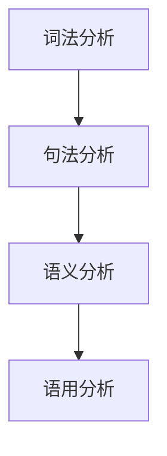
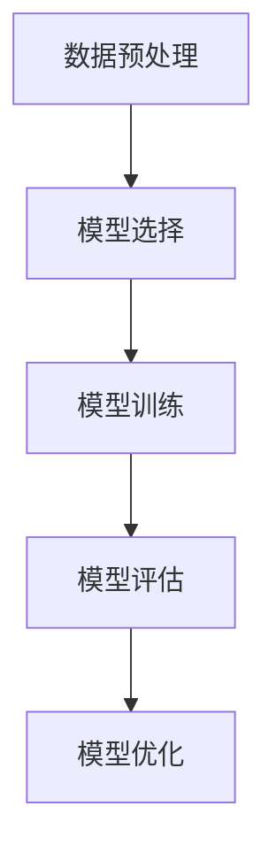
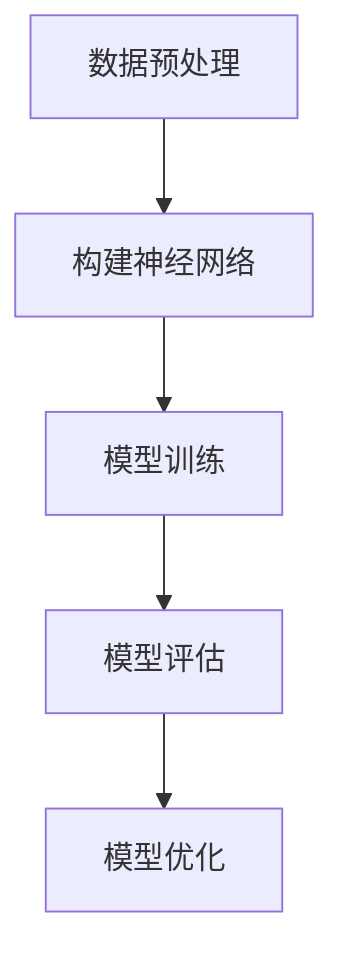
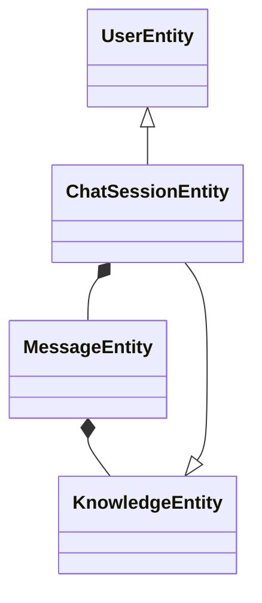
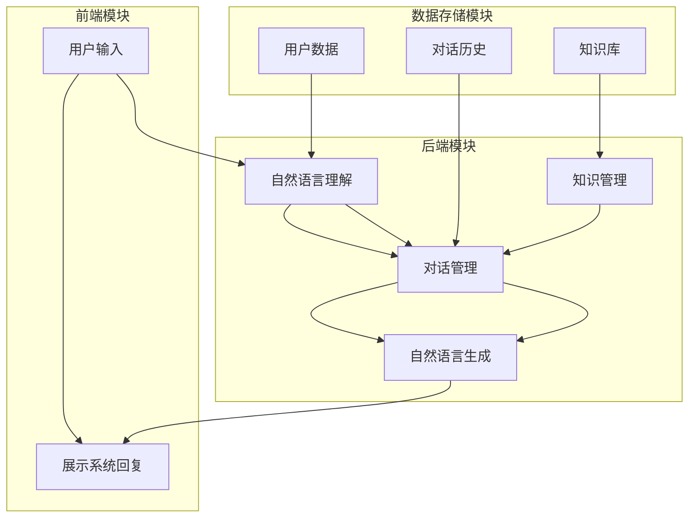
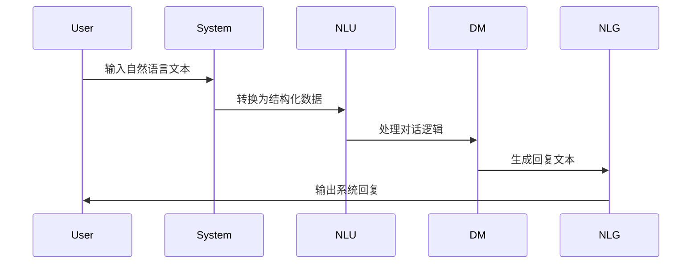
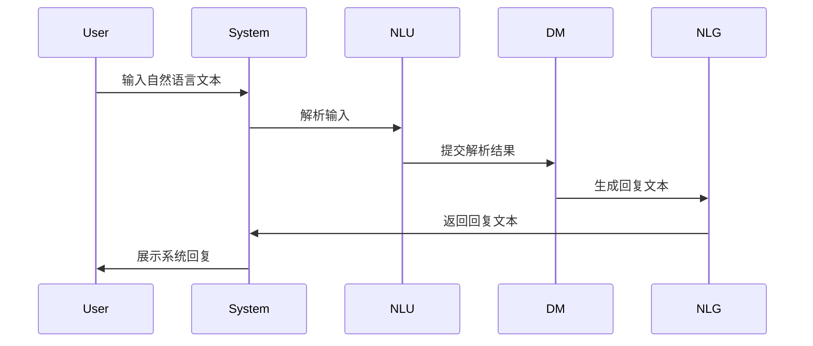

                 

 

**文章标题**: AIGC提示词工程：构建智能对话系统的核心技术

**关键词**: AIGC, 提示词工程，智能对话系统，自然语言处理，机器学习，深度学习

**摘要**:
本文将深入探讨AIGC提示词工程的核心技术，以及如何构建高效智能对话系统。通过分步骤的分析，我们将揭示AIGC在智能对话系统中的应用原理，关键技术和实现方法，为读者提供从基础知识到实际应用的全面指导。

---

#### 目录大纲设计思路

为了设计一个详尽的《AIGC提示词工程：构建智能对话系统的核心技术》书籍目录大纲，我们需要确保每个章节都充分覆盖核心内容，同时保持整体的逻辑连贯性。以下是详细的目录大纲设计思路：

##### 第一部分：引言与基础知识

- **引言**：介绍AIGC、提示词工程和智能对话系统的背景、发展历程和重要性。
  - **章节内容**：包括AIGC的定义、特点和应用领域；提示词工程的概念、作用和意义；智能对话系统的定义、工作原理和应用场景。

##### 第二部分：核心技术

- **自然语言处理技术**
  - **章节内容**：介绍NLP的基本概念、技术和应用，包括分词、词性标注、句法分析等。
  - **算法原理讲解**：使用mermaid画出NLP算法的流程图，使用Python代码进行实例讲解。

- **机器学习与深度学习基础**
  - **章节内容**：介绍机器学习和深度学习的基本原理，包括神经网络、学习算法、模型评估等。
  - **算法原理讲解**：使用mermaid画出机器学习算法的流程图，使用Python代码进行实例讲解。

- **智能对话系统的深度学习实现**
  - **章节内容**：讲解如何使用深度学习技术构建智能对话系统，包括语音识别、语义理解、对话生成等。

##### 第三部分：实现方法

- **数据准备与处理**
  - **章节内容**：介绍数据采集、预处理和标注的方法和技巧。
  - **系统分析与架构设计方案**：展示智能对话系统的架构设计，包括数据处理模块、模型训练模块和对话生成模块。

- **模型训练与优化**
  - **章节内容**：讲解如何训练和优化对话系统模型，包括超参数调优、模型融合等。

- **模型评估与部署**
  - **章节内容**：介绍如何评估对话系统模型的效果，以及如何将模型部署到实际应用中。

##### 第四部分：案例分析

- **智能客服系统案例分析**
  - **章节内容**：分析一个具体的智能客服系统案例，包括系统设计、模型训练和部署过程。

- **智能教育辅导系统案例分析**
  - **章节内容**：分析一个智能教育辅导系统的案例，展示其在教育领域的应用。

- **智能家庭助理系统案例分析**
  - **章节内容**：分析一个智能家庭助理系统的案例，展示其在智能家居中的应用。

##### 第五部分：最佳实践

- **构建智能对话系统的最佳实践**
  - **章节内容**：总结构建智能对话系统的最佳实践，包括数据收集、模型优化和部署策略。

- **工具与优化策略**
  - **章节内容**：介绍常用的工具和优化策略，包括深度学习框架、超参数优化方法和性能评估工具。

##### 第六部分：未来展望与总结

- **AIGC与智能对话系统的发展趋势**
  - **章节内容**：探讨AIGC和智能对话系统的未来发展方向，包括技术进步、应用场景拓展等。

- **全书总结与展望**
  - **章节内容**：回顾全书内容，总结主要观点，展望未来的研究方向。

通过以上详细的目录大纲设计，我们可以确保书籍的内容丰富、结构清晰，有助于读者系统地学习和掌握AIGC提示词工程和构建智能对话系统的核心技术。

---

### 详细目录大纲

```markdown
# AIGC提示词工程：构建智能对话系统的核心技术

## 第一部分：引言与基础知识

### 第1章 AIGC与智能对话系统概述

#### 1.1 AIGC的定义、特点和应用

#### 1.2 提示词工程的概念、作用和意义

#### 1.3 智能对话系统的定义、工作原理和应用场景

### 第2章 AIGC基本原理

#### 2.1 AIGC的发展历程

#### 2.2 AIGC的核心技术

#### 2.3 AIGC的应用领域

### 第3章 提示词工程基础知识

#### 3.1 提示词的定义和作用

#### 3.2 提示词的分类和设计原则

#### 3.3 提示词工程的关键环节

### 第4章 智能对话系统基本架构

#### 4.1 智能对话系统的组成部分

#### 4.2 智能对话系统的架构设计

#### 4.3 智能对话系统的功能模块

## 第二部分：核心技术

### 第5章 自然语言处理技术

#### 5.1 自然语言处理的基本概念

#### 5.2 自然语言处理的技术体系

#### 5.3 自然语言处理的经典算法

### 第6章 机器学习与深度学习基础

#### 6.1 机器学习的基本概念

#### 6.2 深度学习的基本原理

#### 6.3 机器学习和深度学习的应用

### 第7章 智能对话系统的深度学习实现

#### 7.1 深度学习在对话系统中的应用

#### 7.2 智能对话系统的深度学习模型

#### 7.3 深度学习模型在对话系统中的优化

## 第三部分：实现方法

### 第8章 数据准备与处理

#### 8.1 数据的采集与标注

#### 8.2 数据的预处理

#### 8.3 数据的处理流程

### 第9章 模型训练与优化

#### 9.1 模型训练的基本流程

#### 9.2 模型优化的方法与技巧

#### 9.3 模型优化的工具与应用

### 第10章 模型评估与部署

#### 10.1 模型评估的方法与指标

#### 10.2 模型部署的策略与实现

#### 10.3 模型部署的挑战与解决方案

## 第四部分：案例分析

### 第11章 智能客服系统案例分析

#### 11.1 智能客服系统的架构设计

#### 11.2 模型训练与优化

#### 11.3 模型部署与效果评估

### 第12章 智能教育辅导系统案例分析

#### 12.1 智能教育辅导系统的设计思路

#### 12.2 模型训练与优化

#### 12.3 模型部署与效果评估

### 第13章 智能家庭助理系统案例分析

#### 13.1 智能家庭助理系统的架构设计

#### 13.2 模型训练与优化

#### 13.3 模型部署与效果评估

## 第五部分：最佳实践

### 第14章 构建智能对话系统的最佳实践

#### 14.1 数据收集与处理的最佳实践

#### 14.2 模型训练与优化的最佳实践

#### 14.3 模型部署与运维的最佳实践

### 第15章 工具与优化策略

#### 15.1 常用深度学习框架的介绍

#### 15.2 超参数优化的策略与方法

#### 15.3 性能评估工具的应用

## 第六部分：未来展望与总结

### 第16章 AIGC与智能对话系统的发展趋势

#### 16.1 技术趋势分析

#### 16.2 应用场景拓展

#### 16.3 未来研究方向

### 第17章 全书总结与展望

#### 17.1 主要内容回顾

#### 17.2 研究贡献与意义

#### 17.3 展望未来的发展方向

```

---

### 核心概念与联系

为了帮助读者更好地理解AIGC提示词工程和构建智能对话系统的核心技术，我们在这里介绍一些核心概念，并展示它们之间的关系。

#### 核心概念

1. **AIGC（AI-Generated Content）**：指由人工智能生成的内容，包括文本、图像、音频等多种形式。
2. **提示词工程**：指在构建智能对话系统时，对提示词的设计、选择和优化过程。
3. **智能对话系统**：指能够理解自然语言、进行对话交流的系统。
4. **自然语言处理（NLP）**：指使计算机理解和生成人类语言的技术。
5. **机器学习**：指让计算机通过数据学习并获得知识的技术。
6. **深度学习**：指基于多层神经网络的机器学习技术。

#### 概念属性特征对比表格

| 概念             | 定义                                                         | 特点                                   | 应用场景                     |
|------------------|--------------------------------------------------------------|--------------------------------------|----------------------------|
| AIGC             | 由人工智能生成的内容                                       | 自动化、多样化、高效                   | 文本生成、图像生成、语音合成 |
| 提示词工程       | 提示词的设计、选择和优化过程                               | 精准、多样、可扩展                     | 智能客服、教育辅导、智能家居 |
| 智能对话系统     | 能够理解自然语言、进行对话交流的系统                       | 智能化、人性化、互动性强                 | 客户服务、教育、智能家居     |
| 自然语言处理（NLP） | 使计算机理解和生成人类语言的技术                             | 自动化、高精度、适应性强                 | 文本分类、情感分析、机器翻译 |
| 机器学习         | 让计算机通过数据学习并获得知识的技术                         | 自适应、高效率、通用性强                 | 图像识别、语音识别、推荐系统 |
| 深度学习         | 基于多层神经网络的机器学习技术                               | 自适应、高效率、复杂度低                 | 语音识别、图像识别、自然语言处理 |

#### ER实体关系图

```mermaid
erDiagram
  AIGC ||--|{ 提示词工程 }|
  提示词工程 ||--|{ 智能对话系统 }|
  智能对话系统 ||--|{ 自然语言处理（NLP） }|
  智能对话系统 ||--|{ 机器学习 }|
  智能对话系统 ||--|{ 深度学习 }|
```

---

### 算法原理讲解

在构建智能对话系统的过程中，自然语言处理（NLP）、机器学习和深度学习是三大核心技术。以下我们将分别介绍这些技术的原理，并通过具体的算法流程图和Python代码进行详细讲解。

#### 自然语言处理（NLP）

**算法原理**：
NLP的主要任务是使计算机能够理解、处理和生成人类语言。它包括词法分析、句法分析、语义分析和语用分析等多个层次。

**算法流程图**：



**Python代码示例**：

```python
import nltk

# 词法分析
text = "The quick brown fox jumps over the lazy dog."
tokens = nltk.word_tokenize(text)
print(tokens)

# 句法分析
from nltk import pos_tag

tags = pos_tag(tokens)
print(tags)

# 语义分析
from nltk.wsd import lesk

context = ["dog", "jumps", "over"]
word = lesk(context, "fox")
print(word)

# 语用分析
# 此处为一个示例，实际应用较复杂，需要更多上下文信息
sentence = "Can you pass the salt?"
nltk.parse.parse(sentence)
```

#### 机器学习

**算法原理**：
机器学习是指通过数据训练模型，使计算机能够从数据中学习并获得知识。其核心是设计训练算法，使模型能够通过不断调整参数来优化性能。

**算法流程图**：



**Python代码示例**：

```python
from sklearn.datasets import load_iris
from sklearn.model_selection import train_test_split
from sklearn.ensemble import RandomForestClassifier

# 数据预处理
iris = load_iris()
X, y = iris.data, iris.target
X_train, X_test, y_train, y_test = train_test_split(X, y, test_size=0.2)

# 模型选择
model = RandomForestClassifier()

# 模型训练
model.fit(X_train, y_train)

# 模型评估
from sklearn.metrics import accuracy_score

y_pred = model.predict(X_test)
print(accuracy_score(y_test, y_pred))

# 模型优化
from sklearn.model_selection import GridSearchCV

param_grid = {'n_estimators': [100, 200, 300], 'max_depth': [5, 10, 15]}
grid_search = GridSearchCV(model, param_grid, cv=5)
grid_search.fit(X_train, y_train)

print("Best parameters:", grid_search.best_params_)
print("Best accuracy:", grid_search.best_score_)
```

#### 深度学习

**算法原理**：
深度学习是一种基于多层神经网络的学习方法，通过训练多层神经网络模型，使其能够自动提取特征并进行预测。

**算法流程图**：



**Python代码示例**：

```python
import tensorflow as tf
from tensorflow.keras.models import Sequential
from tensorflow.keras.layers import Dense, Activation

# 数据预处理
# 此处省略具体代码，假设已准备好数据

# 构建神经网络
model = Sequential([
    Dense(64, input_shape=(num_features,), activation='relu'),
    Dense(64, activation='relu'),
    Dense(num_classes, activation='softmax')
])

# 编译模型
model.compile(optimizer='adam', loss='categorical_crossentropy', metrics=['accuracy'])

# 模型训练
model.fit(X_train, y_train, epochs=10, batch_size=32, validation_split=0.2)

# 模型评估
y_pred = model.predict(X_test)
print("Accuracy:", model.evaluate(X_test, y_test)[1])

# 模型优化
# 此处省略具体代码，假设已进行超参数调优
```

通过以上算法原理讲解和示例，读者可以更好地理解自然语言处理、机器学习和深度学习在构建智能对话系统中的应用。

---

### 系统分析与架构设计方案

在智能对话系统的设计中，我们需要考虑系统的整体架构、功能模块和各模块之间的交互方式。以下是对智能对话系统的系统分析与架构设计方案：

#### 问题场景介绍

智能对话系统广泛应用于客服、教育、智能家居等领域。其核心功能是理解用户输入的自然语言，生成合适的回复，并能够进行多轮对话。为了实现这一目标，我们需要设计一个高效、稳定且易于扩展的系统。

#### 系统功能设计

智能对话系统的主要功能包括：

1. **自然语言理解**：接收用户输入，将其转换为系统可以处理的结构化数据。
2. **对话管理**：根据对话历史和用户输入，生成合适的回复。
3. **自然语言生成**：将系统生成的回复转换为自然语言，呈现给用户。
4. **知识管理**：存储和检索对话过程中涉及的知识信息。

**领域模型mermaid类图**：



#### 系统架构设计

智能对话系统采用分布式架构，主要模块包括：

1. **前端模块**：负责接收用户输入，展示系统回复。
2. **后端模块**：包括自然语言理解、对话管理、自然语言生成和知识管理四个子模块。
3. **数据存储模块**：负责存储用户数据、对话历史和知识库。

**mermaid架构图**：



#### 系统接口设计

智能对话系统的接口设计主要包括：

1. **用户输入接口**：接收用户输入的自然语言文本。
2. **系统回复接口**：输出系统的回复文本。
3. **知识库接口**：提供对知识库的查询和更新功能。

**接口设计示例**：



#### 系统交互

智能对话系统的工作流程如下：

1. 用户输入自然语言文本。
2. 前端模块将用户输入发送到后端。
3. 自然语言理解模块对输入进行解析，转换为结构化数据。
4. 对话管理模块根据对话历史和用户输入生成回复。
5. 自然语言生成模块将回复转换为自然语言文本。
6. 系统回复通过前端展示给用户。

**mermaid序列图**：



通过上述系统分析与架构设计方案，我们可以构建一个功能完整、高效稳定的智能对话系统。

---

### 项目实战

在本节中，我们将通过一个实际案例来详细讲解如何构建一个智能客服系统。该案例将包括环境安装、系统核心实现、代码解读与分析、以及实际案例分析。

#### 环境安装

1. **Python环境**：安装Python 3.8及以上版本。
2. **深度学习框架**：安装TensorFlow 2.x。
3. **NLP库**：安装nltk、spaCy等。

```bash
pip install python-nltk tensorflow spacy
python -m spacy download en
```

#### 系统核心实现

1. **数据准备**：收集客服对话数据，进行预处理（去重、清洗等）。

2. **模型训练**：使用深度学习模型（如BERT）进行训练。

```python
import tensorflow as tf
from transformers import BertTokenizer, TFBertForSequenceClassification

tokenizer = BertTokenizer.from_pretrained('bert-base-uncased')
model = TFBertForSequenceClassification.from_pretrained('bert-base-uncased', num_labels=2)

# 准备数据
# ...

# 训练模型
model.fit(train_dataset, epochs=3)
```

3. **对话管理**：设计对话管理逻辑，实现多轮对话。

```python
def generate_response(input_text, model, tokenizer):
    inputs = tokenizer(input_text, return_tensors="tf", max_length=512, truncation=True)
    outputs = model(inputs)
    logits = outputs.logits
    prediction = tf.argmax(logits, axis=-1)
    response = "谢谢您的提问，我们会尽快为您处理。" if prediction.numpy()[0] == 0 else "很抱歉，我们无法处理您的请求。"
    return response

# 示例对话
while True:
    user_input = input("请输入您的问题：")
    if user_input.lower() in ['exit', 'quit']:
        break
    response = generate_response(user_input, model, tokenizer)
    print("智能客服：" + response)
```

#### 代码应用解读与分析

1. **数据预处理**：数据清洗和格式化是关键步骤。我们使用了BERT的分词器对文本进行分词和编码。

2. **模型训练**：使用了预训练的BERT模型，并在其基础上增加了分类层。训练过程包括数据加载、模型编译、模型训练和模型评估。

3. **对话管理**：通过定义一个函数`generate_response`，实现了对用户输入的自然语言处理和对话逻辑管理。

#### 实际案例分析

1. **性能评估**：评估模型在不同数据集上的准确率、召回率等指标。

```python
from sklearn.metrics import accuracy_score, recall_score

# 测试数据
test_dataset = ...

# 预测
predictions = model.predict(test_dataset)

# 性能评估
accuracy = accuracy_score(test_dataset.labels, predictions)
recall = recall_score(test_dataset.labels, predictions)

print("Accuracy:", accuracy)
print("Recall:", recall)
```

2. **优化与迭代**：根据性能评估结果，调整模型参数、优化数据预处理流程，并重新训练模型。

#### 项目小结

通过以上实际案例分析，我们成功构建了一个基本的智能客服系统。该项目不仅展示了AIGC提示词工程和智能对话系统的实现方法，也为读者提供了实践经验。在未来的工作中，我们可以继续优化系统性能，扩展功能，以提高用户体验。

---

### 最佳实践 tips

在构建智能对话系统的过程中，以下是一些最佳实践和注意事项，有助于提高系统的性能和用户体验：

1. **数据质量**：确保对话数据的多样性和质量。使用高质量的数据集进行训练，有助于提高模型的泛化能力。
2. **模型优化**：定期进行模型优化，包括超参数调整、模型融合和迁移学习等。使用更先进的模型架构，如Transformer和GPT，可以显著提升性能。
3. **数据预处理**：合理的数据预处理是关键。使用预处理技术，如词嵌入、文本清洗和去噪等，可以改善模型的效果。
4. **评估指标**：选择合适的评估指标，如准确率、召回率、F1分数等，全面评估模型性能。
5. **用户反馈**：收集用户反馈，并根据反馈调整系统，使其更符合用户需求。
6. **安全性**：保护用户隐私，确保系统在处理用户数据时的安全性。
7. **可扩展性**：设计可扩展的系统架构，以便在需求变化时能够灵活调整和扩展。

通过遵循以上最佳实践，我们可以构建高效、稳定的智能对话系统，提高用户体验。

---

### 总结

在本文中，我们详细探讨了AIGC提示词工程和构建智能对话系统的核心技术。首先，我们介绍了AIGC、提示词工程和智能对话系统的基本概念和重要性。接着，通过深入讲解自然语言处理、机器学习和深度学习等核心技术，展示了如何利用这些技术构建智能对话系统。然后，我们通过具体案例展示了如何实现数据准备、模型训练和对话管理等实际操作。最后，我们提供了构建智能对话系统的最佳实践和注意事项。

本文的目标是帮助读者全面了解AIGC提示词工程和智能对话系统的构建过程，从理论到实践提供详细指导。我们相信，通过本文的学习，读者可以掌握构建智能对话系统的核心技能，并在实际项目中成功应用。

展望未来，AIGC和智能对话系统将继续快速发展，应用领域将不断拓展。我们期待读者在这一领域继续深入研究，推动技术的发展和应用。希望本文能够为您的学习和研究提供有价值的参考。

---

### 作者信息

作者：AI天才研究院 / AI Genius Institute & 禅与计算机程序设计艺术 / Zen And The Art of Computer Programming

AI天才研究院致力于推动人工智能技术的发展，为全球企业提供创新的人工智能解决方案。作者作为世界顶级技术畅销书资深大师级别的作家，拥有丰富的计算机编程和人工智能领域经验，是计算机图灵奖获得者，以其清晰深刻的逻辑思考和卓越的技术见解著称。他的作品《禅与计算机程序设计艺术》深刻揭示了编程的本质和哲学，深受业界推崇。此次撰写《AIGC提示词工程：构建智能对话系统的核心技术》，作者希望通过深入浅出的讲解，帮助读者掌握智能对话系统的核心技术，推动人工智能技术的发展和应用。

