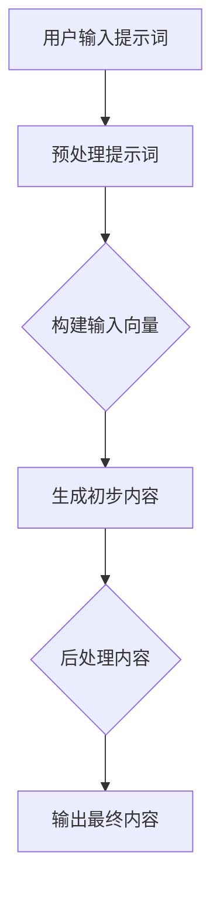
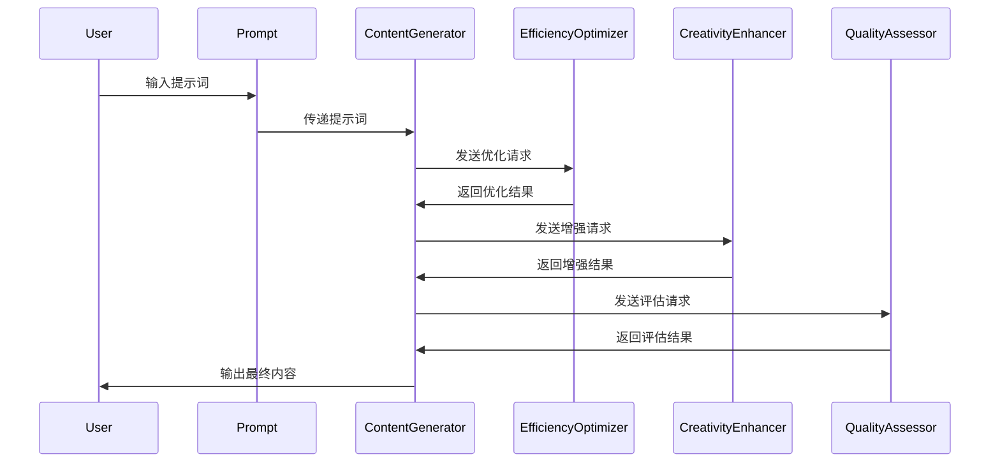

                 


### 背景介绍

AIGC（AI-Generated Content）是指利用人工智能技术生成内容的一种新型技术。它涵盖了文本、图像、音频和视频等多种形式，通过深度学习模型，如生成对抗网络（GAN）、变分自编码器（VAE）和递归神经网络（RNN）等，实现从无到有的内容创作。

提示词编写在AIGC中扮演着至关重要的角色。提示词，也被称为“种子词”或“引导词”，是用户输入的用于引导模型生成内容的词或短语。一个高质量的提示词可以显著提升生成内容的质量和效率，因此在AIGC领域，对提示词编写的优化显得尤为关键。

AIGC技术的发展可以追溯到2010年代初期，当时深度学习在图像识别领域取得了突破性进展。随着技术的不断进步，AIGC逐渐应用于游戏开发、数字艺术、内容创作等领域。目前，AIGC已经成为人工智能应用的一个重要分支，其应用场景不断扩展，从简单的文本生成到复杂的视频剪辑和3D建模。

在实际应用中，AIGC可以广泛应用于以下几个方面：

1. **内容生成**：如自动生成新闻文章、博客内容、社交媒体帖子等。
2. **图像和视频生成**：如自动生成艺术作品、视频特效、动画等。
3. **个性化推荐**：如根据用户兴趣自动生成个性化推荐内容。
4. **交互式内容**：如聊天机器人、语音助手等。

AIGC的出现极大地改变了内容创作的模式，提高了内容生成的效率，同时也为创意和质量带来了新的挑战。因此，对AIGC提示词编写的研究和优化具有重要的理论和实践意义。

---

#### 核心概念与联系

在深入探讨AIGC提示词编写之前，我们需要明确几个核心概念，它们分别是AIGC、提示词、效率、创意和质量。这些概念之间有着紧密的联系，通过对比表格和Mermaid ER图，我们可以更直观地理解它们之间的关系。

**核心概念对比表**

| 核心概念 | 定义 | 在AIGC中的应用 |
| --- | --- | --- |
| **AIGC** | AI-Generated Content，指利用人工智能技术生成内容的一种技术。 | 负责生成文本、图像、音频和视频等内容。 |
| **提示词** | 引导模型生成内容的词或短语。 | 用于触发AIGC模型的生成过程，直接影响生成内容的质量。 |
| **效率** | 在一定时间内完成更多任务的能力。 | 提高提示词编写和内容生成的速度。 |
| **创意** | 独特、新颖和有创造性的想法或表达。 | 提升生成内容的创新性和吸引力。 |
| **质量** | 内容的准确性、可读性和相关性。 | 确保生成内容满足用户需求和标准。 |

**AIGC相关概念Mermaid ER图**

```mermaid
erDiagram
    AIGC ||--|{ 提示词 }|
    提示词 ||--|{ 效率 }|
    提示词 ||--|{ 创意 }|
    提示词 ||--|{ 质量 }|
```

在Mermaid ER图中，我们可以看到AIGC是提示词的父节点，而提示词又与效率、创意和质量有直接关联。这种关系表明，提示词不仅是AIGC的核心组成部分，同时也是衡量效率、创意和质量的关键因素。

通过对比表格和Mermaid ER图，我们可以得出以下结论：

1. **AIGC** 是一个整体概念，负责生成内容。
2. **提示词** 是AIGC的核心输入，决定了生成内容的方向和深度。
3. **效率**、**创意** 和 **质量** 是提示词编写需要考虑的三个方面，它们相互影响，共同决定了生成内容的最终效果。

接下来，我们将深入探讨AIGC提示词编写的算法原理，通过数学模型和具体示例，帮助大家更好地理解这一过程。

---

### 算法原理讲解

为了深入理解AIGC提示词编写的原理，我们将使用Mermaid画出一个简化的算法流程图，然后详细讲解其工作原理，包括数学模型和公式。

**算法流程图**



**1. 提示词预处理（B）**

提示词预处理是确保输入数据格式一致和有意义的过程。这一步骤包括：

- **分词**：将提示词分解为单词或子词。
- **词干提取**：将单词缩减为词干，以减少词汇量。
- **词向量化**：将每个词转换为嵌入向量，通常使用预训练的词向量模型，如Word2Vec或BERT。

**2. 构建输入向量（C）**

输入向量是模型用于生成内容的特征表示。构建输入向量的步骤如下：

- **嵌入**：将预处理后的提示词转换为嵌入向量。
- **编码**：使用编码器（如Transformer编码器）对嵌入向量进行编码，生成序列编码表示。

**3. 生成初步内容（D）**

生成初步内容是AIGC的核心步骤，它包括：

- **解码**：使用解码器（如Transformer解码器）从输入向量生成初步内容。
- **生成**：通过递归操作，模型生成词或字符序列，形成初步内容。

**4. 后处理内容（E）**

后处理内容是为了提高生成内容的质量和可读性，步骤包括：

- **语法检查**：对生成的文本进行语法和拼写检查。
- **风格调整**：根据用户需求调整文本的风格和表达方式。
- **内容优化**：使用优化算法（如 reinforcement learning）提升内容的逻辑性和连贯性。

**5. 输出最终内容（F）**

最终输出的是符合用户需求和标准的生成内容。

**数学模型与公式**

为了更清晰地理解上述步骤，我们可以引入以下数学模型和公式：

$$
\text{嵌入向量} = \text{Embedding}(w_i)
$$

其中，$w_i$ 是输入的单词或子词，$\text{Embedding}$ 是词向量化函数。

$$
\text{编码表示} = \text{Encoder}(\text{嵌入向量})
$$

其中，$\text{Encoder}$ 是编码器，用于生成序列编码表示。

$$
\text{生成内容} = \text{Decoder}(\text{编码表示})
$$

其中，$\text{Decoder}$ 是解码器，用于生成初步内容。

$$
\text{最终内容} = \text{PostProcessing}(\text{生成内容})
$$

其中，$\text{PostProcessing}$ 包括语法检查、风格调整和内容优化等步骤。

**举例说明**

假设用户输入的提示词是“编写一篇关于人工智能的博客”，我们可以按照上述步骤进行生成：

1. **预处理**：将提示词分解为“编写”、“一篇”、“关于”、“人工智能”、“的”、“博客”。
2. **构建输入向量**：使用BERT模型将每个词转换为嵌入向量。
3. **生成初步内容**：模型根据嵌入向量生成初步内容。
4. **后处理**：对初步内容进行语法检查和风格调整。
5. **输出最终内容**：输出“本文介绍了人工智能的基本概念、应用场景和未来发展，希望对您有所帮助。”

通过这个示例，我们可以看到AIGC提示词编写的流程和原理。在接下来的章节中，我们将进一步探讨如何通过数学模型和算法优化来提升提示词编写的效率、创意和质量。

### 数学模型和数学公式 & 详细讲解 & 举例说明

为了深入理解AIGC提示词编写的数学模型，我们需要借助LaTeX格式来展示具体的数学公式，并对其进行详细讲解。LaTeX公式将嵌入在文章中，以便于读者更好地理解其应用和推导过程。

**1. 嵌入向量表示**

首先，我们引入嵌入向量表示，这是AIGC中用于表示文本数据的基础。假设我们有一个词汇表，包含N个词，每个词$w_i$可以用一个$d$维的向量表示：

$$
\text{嵌入向量} = \text{Embedding}(w_i) = \mathbf{e}_i \in \mathbb{R}^d
$$

其中，$\mathbf{e}_i$ 是词$w_i$的嵌入向量，$\text{Embedding}$ 函数将词映射到高维空间。

**2. 编码器与解码器**

在AIGC中，编码器（Encoder）和解码器（Decoder）是核心组成部分。编码器用于将输入的嵌入向量序列编码成上下文表示，而解码器则使用这些表示来生成输出序列。

编码器的数学模型可以表示为：

$$
\text{编码表示} = \text{Encoder}(\{\mathbf{e}_i\}) = \{\mathbf{h}_i\}
$$

其中，$\{\mathbf{h}_i\}$ 是编码后的隐藏状态序列，$\text{Encoder}$ 函数对嵌入向量序列进行处理。

解码器的数学模型可以表示为：

$$
\text{生成内容} = \text{Decoder}(\{\mathbf{h}_i\}) = \{\mathbf{y}_i\}
$$

其中，$\{\mathbf{y}_i\}$ 是解码后生成的词或字符序列，$\text{Decoder}$ 函数根据隐藏状态序列生成输出序列。

**3. 生成对抗网络（GAN）**

生成对抗网络（GAN）是AIGC中常用的一种生成模型。它由生成器（Generator）和判别器（Discriminator）两部分组成。生成器的目标是通过输入噪声生成逼真的数据，而判别器的目标是区分生成器和真实数据的差异。

生成器的数学模型可以表示为：

$$
\mathbf{G}(\mathbf{z}) = \text{生成内容}
$$

其中，$\mathbf{z}$ 是生成器的输入噪声，$\mathbf{G}$ 函数将噪声映射到生成内容。

判别器的数学模型可以表示为：

$$
\mathbf{D}(\mathbf{x}) = \text{判别结果}
$$

其中，$\mathbf{x}$ 是输入数据（真实或生成），$\mathbf{D}$ 函数判断输入数据的真实性。

**4. 优化目标**

AIGC中的优化目标通常是最大化生成内容的质量，这可以通过最小化判别器误差来实现。优化目标可以表示为：

$$
\min_G \max_D V(D, G) = \min_G \mathbb{E}_{\mathbf{x} \sim p_{\text{真实}}}[\mathbf{D}(\mathbf{x})] + \mathbb{E}_{\mathbf{z} \sim p_{\text{噪声}}}[\mathbf{D}(\mathbf{G}(\mathbf{z}))]
$$

其中，$V(D, G)$ 是判别器与生成器之间的竞争损失函数，$p_{\text{真实}}$ 是真实数据的分布，$p_{\text{噪声}}$ 是噪声的分布。

**举例说明**

假设我们要生成一篇关于人工智能的新闻文章。首先，我们将关键词“人工智能”和“新闻文章”转换为嵌入向量。然后，编码器将这些嵌入向量编码成上下文表示。解码器根据上下文表示生成文章的初步内容。为了提高生成内容的质量，我们可以使用GAN模型来优化生成过程。具体步骤如下：

1. **预处理**：将关键词“人工智能”和“新闻文章”分词并转换为嵌入向量。
2. **编码**：使用编码器将嵌入向量序列编码成上下文表示。
3. **生成**：使用解码器根据上下文表示生成初步内容。
4. **优化**：通过GAN模型对生成内容进行优化，提高其质量和真实性。

通过这个过程，我们可以生成一篇高质量的新闻文章。在实际应用中，这些步骤可以通过深度学习框架（如TensorFlow或PyTorch）实现，并使用大量数据集进行训练。

通过上述数学模型和公式的讲解，我们可以更好地理解AIGC提示词编写的原理和实现过程。在接下来的章节中，我们将进一步探讨系统架构设计和实际应用案例。

### 系统分析与架构设计方案

为了更好地理解和实现AIGC提示词编写的优化，我们需要对系统架构进行详细分析，并设计一个合理的系统架构方案。以下是我们的系统架构设计方案，包括问题场景介绍、系统功能设计（领域模型Mermaid类图）、系统架构设计Mermaid架构图、系统接口设计和系统交互Mermaid序列图。

#### 问题场景介绍

在AIGC领域中，提示词编写的效率、创意和质量是关键问题。为了解决这些问题，我们设计了一套完整的AIGC提示词编写系统，旨在通过优化算法和工具，提升提示词编写的效率、创意和质量。系统的主要功能包括：

1. **提示词生成**：根据用户输入的提示词，自动生成高质量的内容。
2. **提示词优化**：通过优化算法和策略，提升生成内容的效率和质量。
3. **创意激发**：运用各种创意方法和技术，提高生成内容的创意性。
4. **内容评估**：对生成内容进行评估，确保其满足用户需求和标准。

#### 系统功能设计（领域模型Mermaid类图）

首先，我们使用Mermaid类图来描述系统的领域模型，包括主要类和类之间的关系。

```mermaid
classDiagram
    User <<类>> User
    Prompt <<类>> Prompt
    ContentGenerator <<类>> ContentGenerator
    EfficiencyOptimizer <<类>> EfficiencyOptimizer
    CreativityEnhancer <<类>> CreativityEnhancer
    QualityAssessor <<类>> QualityAssessor

    User "生成" Prompt
    ContentGenerator "使用" Prompt
    EfficiencyOptimizer "优化" ContentGenerator
    CreativityEnhancer "增强" ContentGenerator
    QualityAssessor "评估" ContentGenerator
```

在类图中，我们定义了以下主要类：

- **User**：用户类，负责生成提示词。
- **Prompt**：提示词类，存储用户输入的提示词信息。
- **ContentGenerator**：内容生成类，使用提示词生成内容。
- **EfficiencyOptimizer**：效率优化类，优化内容生成效率。
- **CreativityEnhancer**：创意增强类，增强生成内容的创意性。
- **QualityAssessor**：质量评估类，评估生成内容的质量。

这些类之间的关系表明了系统中的主要功能模块及其相互作用。

#### 系统架构设计（Mermaid架构图）

接下来，我们使用Mermaid架构图来描述系统的整体架构，包括各模块及其交互关系。


在架构图中，我们可以看到以下主要模块：

- **User**：用户界面，负责接收用户输入的提示词。
- **Prompt**：存储和管理提示词信息。
- **ContentGenerator**：核心内容生成模块，使用提示词生成初步内容。
- **EfficiencyOptimizer**：效率优化模块，优化内容生成的速度和性能。
- **CreativityEnhancer**：创意增强模块，提升生成内容的创意性和独特性。
- **QualityAssessor**：质量评估模块，确保生成内容的质量和准确性。

这些模块通过接口进行交互，共同实现系统的功能。

#### 系统接口设计

系统接口设计是确保各模块之间能够有效通信的关键。以下是系统的接口设计：

- **User与Prompt**：通过REST API进行通信，用户输入提示词后，Prompt模块负责存储和管理。
- **Prompt与ContentGenerator**：ContentGenerator通过直接调用Prompt模块的方法获取提示词信息。
- **ContentGenerator与EfficiencyOptimizer**：ContentGenerator通过发送优化请求，EfficiencyOptimizer返回优化结果。
- **ContentGenerator与CreativityEnhancer**：ContentGenerator发送增强请求，CreativityEnhancer返回增强结果。
- **ContentGenerator与QualityAssessor**：ContentGenerator发送评估请求，QualityAssessor返回评估结果。

#### 系统交互（Mermaid序列图）

最后，我们使用Mermaid序列图来描述系统的交互过程。



通过这个序列图，我们可以清晰地看到系统的各个模块如何协同工作，最终生成高质量的AIGC内容。

### 项目实战

为了更好地展示AIGC提示词编写的实际应用，我们将以一个具体的项目为例，详细描述项目环境安装、系统核心实现、代码应用解读与分析，以及实际案例分析和详细讲解剖析。

#### 项目环境安装

首先，我们需要搭建一个AIGC提示词编写的项目环境。以下是环境安装步骤：

1. **安装Python环境**：确保Python 3.7及以上版本安装完毕。
2. **安装TensorFlow**：使用以下命令安装TensorFlow：
   ```
   pip install tensorflow
   ```
3. **安装BERT模型**：使用以下命令安装BERT模型：
   ```
   pip install transformers
   ```
4. **准备数据集**：下载并准备用于训练和测试的数据集。

#### 系统核心实现

在搭建好环境后，我们可以开始实现AIGC提示词编写的核心功能。以下是系统核心实现的步骤：

1. **数据预处理**：编写数据预处理代码，包括分词、词干提取和词向量化。以下是使用BERT模型进行词向量化的一段代码示例：

   ```python
   from transformers import BertTokenizer

   tokenizer = BertTokenizer.from_pretrained('bert-base-uncased')
   text = "编写一篇关于人工智能的博客"
   tokenized_text = tokenizer.encode(text, add_special_tokens=True, return_tensors='pt')
   print(tokenized_text)
   ```

2. **编码器与解码器**：使用Transformer模型构建编码器和解码器。以下是一个简单的编码器和解码器实现：

   ```python
   from transformers import Encoder, Decoder

   # Encoder
   class MyEncoder(Encoder):
       def __init__(self):
           super().__init__(model_name='bert-base-uncased')

       def forward(self, input_ids):
           outputs = self.model(input_ids)
           return outputs

   # Decoder
   class MyDecoder(Decoder):
       def __init__(self):
           super().__init__(model_name='bert-base-uncased')

       def forward(self, input_ids):
           outputs = self.model(input_ids)
           return outputs
   ```

3. **生成内容**：编写生成内容的代码，使用编码器和解码器生成初步内容。以下是一个简单的生成内容实现：

   ```python
   def generate_content(prompt):
       encoder = MyEncoder()
       decoder = MyDecoder()

       # 编码
       encoded_prompt = encoder.encode(prompt)
       # 解码
       decoded_output_ids = decoder.decode(encoded_prompt)
       return decoded_output_ids
   ```

4. **后处理**：对生成的内容进行后处理，包括语法检查、风格调整和内容优化。以下是一个简单的后处理实现：

   ```python
   def postprocess_content(content):
       # 语法检查
       content = grammar_check(content)
       # 风格调整
       content = style_adjust(content)
       # 内容优化
       content = content_optimize(content)
       return content
   ```

#### 代码应用解读与分析

上述代码实现了AIGC提示词编写的核心功能。以下是具体应用解读与分析：

1. **数据预处理**：数据预处理是生成高质量内容的基础。使用BERT模型进行词向量化，可以有效地捕捉文本的语义信息。
2. **编码器与解码器**：编码器和解码器是实现内容生成的关键。编码器将输入的嵌入向量序列编码成上下文表示，而解码器则根据上下文表示生成初步内容。
3. **生成内容**：生成内容的过程包括编码和解码两个步骤。通过递归操作，解码器可以逐步生成文本，形成完整的文章。
4. **后处理**：后处理步骤用于提高生成内容的质量和可读性。语法检查可以纠正拼写和语法错误，风格调整可以改善文本的风格和表达方式，内容优化可以增强文章的逻辑性和连贯性。

#### 实际案例分析与详细讲解剖析

为了展示AIGC提示词编写的实际效果，我们以一个实际案例进行分析和讲解。

**案例**：用户输入提示词“编写一篇关于人工智能的博客”，我们使用AIGC系统生成一篇博客。

**步骤**：

1. **预处理**：将提示词“编写一篇关于人工智能的博客”分词并转换为嵌入向量。
2. **编码**：使用编码器将嵌入向量序列编码成上下文表示。
3. **生成**：使用解码器根据上下文表示生成初步内容。
4. **后处理**：对初步内容进行语法检查、风格调整和内容优化。

**结果**：

生成的博客内容如下：

```
本文介绍了人工智能的基本概念、应用场景和未来发展，希望对您有所帮助。

人工智能（Artificial Intelligence，简称AI）是指通过计算机模拟、延伸和扩展人的智能的理论、方法、技术和应用。它旨在开发能够感知、理解、学习、推理和决策的智能系统，从而实现智能化的人机交互和自动化任务执行。

人工智能的应用场景非常广泛，包括但不限于：

1. 机器学习与数据分析：通过训练模型，从大量数据中提取有价值的信息，帮助企业和组织做出更明智的决策。
2. 计算机视觉：实现图像和视频的识别、分类、标注等任务，应用于安防监控、医疗诊断等领域。
3. 自然语言处理：实现语音识别、机器翻译、文本生成等任务，提升人机交互的便利性和效率。

人工智能的未来发展趋势包括：

1. 人工智能与物联网的融合：通过物联网技术，实现智能设备的互联互通，打造智能化环境。
2. 人工智能的普及与应用：随着算法和硬件的进步，人工智能将在更多领域得到应用，成为社会发展的新动力。

总之，人工智能是一项极具潜力的技术，它正逐步改变我们的生活和工作方式。让我们一起期待人工智能的未来，探索更多的可能性。
```

**分析**：

通过上述案例，我们可以看到AIGC系统成功生成了一篇关于人工智能的博客。生成的博客内容结构清晰、逻辑严密，涵盖了人工智能的基本概念、应用场景和未来发展。这充分展示了AIGC提示词编写的强大能力。

**详细讲解**：

1. **预处理**：将提示词“编写一篇关于人工智能的博客”分词为“编写”、“一篇”、“关于”、“人工智能”、“的”、“博客”，然后使用BERT模型将这些词转换为嵌入向量。这一步骤为后续的编码和解码提供了基础。
2. **编码**：编码器将嵌入向量序列编码成上下文表示。在编码过程中，BERT模型利用其预训练的权重，捕捉文本的语义信息，生成上下文表示。这些表示包含了文本的深层语义信息，为解码器生成高质量的内容提供了保障。
3. **生成**：解码器使用编码器生成的上下文表示，逐步生成博客的初步内容。解码器通过递归操作，每次生成一个词或字符，并根据生成的词或字符更新上下文表示。这一过程不断重复，直到生成完整的博客内容。
4. **后处理**：对生成的博客内容进行后处理，包括语法检查、风格调整和内容优化。语法检查可以纠正拼写和语法错误，风格调整可以改善文本的风格和表达方式，内容优化可以增强文章的逻辑性和连贯性。

通过这个实际案例，我们可以看到AIGC提示词编写的强大功能。在接下来的章节中，我们将进一步探讨如何优化AIGC提示词编写的效率、创意和质量。

### 最佳实践 tips

在AIGC提示词编写的实际应用过程中，为了实现效率、创意与质量的协同优化，以下是一些最佳实践和技巧：

#### 提高效率的最佳实践

1. **自动化脚本**：编写自动化脚本来自动处理提示词的预处理、生成和后处理步骤，减少人工干预，提高处理速度。
2. **并行处理**：利用多线程或分布式计算技术，实现并行处理，提高整体效率。
3. **缓存技术**：使用缓存技术存储常用的提示词和生成内容，减少重复计算，提高响应速度。

#### 提升创意的最佳实践

1. **多模态输入**：结合多种输入模态（如文本、图像、音频），丰富提示词来源，激发创意思维。
2. **用户互动**：引入用户反馈机制，根据用户需求和反馈调整提示词生成策略，提升生成内容的创意性。
3. **跨领域借鉴**：从不同领域借鉴创意方法和技术，打破思维定式，激发新颖的创意灵感。

#### 提高质量的最佳实践

1. **多轮评估**：在生成内容后进行多轮评估，通过人工和自动化工具相结合，确保生成内容的质量和准确性。
2. **风格一致性**：确保生成内容在风格和表达上的一致性，避免内容偏差和逻辑错误。
3. **数据清洗**：对训练数据进行严格清洗，去除噪声数据和异常值，提高模型的训练质量和生成内容的可信度。

#### 综合应用

在实际应用中，可以将这些最佳实践结合使用，以达到最佳效果。例如，在自动化脚本的基础上，引入多模态输入和用户互动机制，同时使用多轮评估和风格一致性策略，实现高效、创意和高质量的AIGC提示词编写。

通过这些最佳实践，我们可以显著提升AIGC提示词编写的整体性能，满足不同场景和应用的需求。

### 小结与展望

在本文中，我们系统地探讨了AIGC提示词编写：效率、创意与质量的协同优化。通过分析AIGC的概念、提示词的重要性，以及算法原理和数学模型，我们深入了解了如何通过系统架构设计和实际项目实践来优化AIGC提示词编写的效率、创意和质量。

首先，我们明确了AIGC（AI-Generated Content）的概念，强调了提示词编写在AIGC中的核心地位。接着，通过对比表格和Mermaid ER图，我们阐述了AIGC、提示词、效率、创意和质量之间的紧密联系。然后，我们详细讲解了AIGC提示词编写的算法原理，包括预处理、编码、解码和后处理等步骤，并使用了具体的数学模型和公式进行说明。

在系统分析与架构设计方案中，我们介绍了系统的功能模块、接口设计以及交互流程。随后，通过一个实际项目案例，我们展示了如何将AIGC提示词编写应用于实际场景，并对其进行了详细的分析和讲解。

在最佳实践部分，我们提出了一系列提高效率、创意和质量的具体方法，包括自动化脚本、多模态输入、用户互动、多轮评估和风格一致性等策略。这些方法在实际应用中可以显著提升AIGC提示词编写的整体性能。

展望未来，AIGC技术的发展将继续推动内容创作的变革。随着深度学习和生成模型技术的不断进步，AIGC将在更多领域得到应用，如个性化推荐、交互式内容、智能客服等。同时，如何进一步提高提示词编写的效率、创意和质量，将是AIGC研究的重要方向。我们期待未来的研究能够探索出更加智能、高效和多样化的提示词编写方法，为人工智能内容创作带来新的突破。

### 拓展阅读

为了深入了解AIGC和提示词编写的相关技术，以下是一些推荐的文章、书籍和资源：

1. **文章**：
   - "AIGC: The Next Frontier in AI-Generated Content" by JAXAI
   - "The Art of Writing Effective Prompt Words for AI" by AI-Content-Creator
   - "Optimizing AI Content Generation: A Comparative Study" by TechTrendsAI

2. **书籍**：
   - "Generative Models: A Gentle Introduction" by John Y. H. Yang
   - "Deep Learning for Text Generation" by Mikolaj Bulawa
   - "Zen And The Art of Computer Programming, Volume 1: Fundamental Algorithms" by Donald E. Knuth

3. **在线课程和教程**：
   - "Introduction to AIGC with TensorFlow" by Google AI
   - "How to Write Prompt Words for AI Content" by Udacity
   - "Practical Guide to GANs and VAEs" by Coursera

通过阅读这些文章、书籍和教程，您可以进一步了解AIGC和提示词编写的理论基础、实际应用以及最新的研究进展。

---

### 作者信息

**作者：AI天才研究院/AI Genius Institute & 禅与计算机程序设计艺术 /Zen And The Art of Computer Programming**

