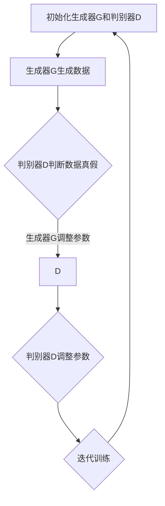
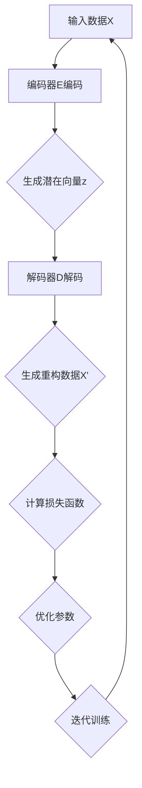
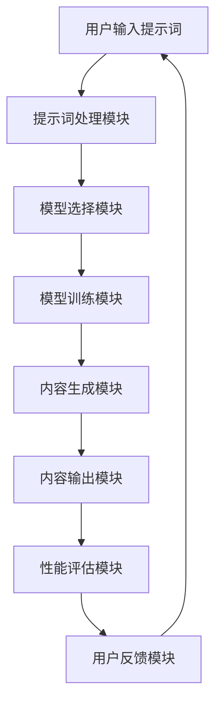
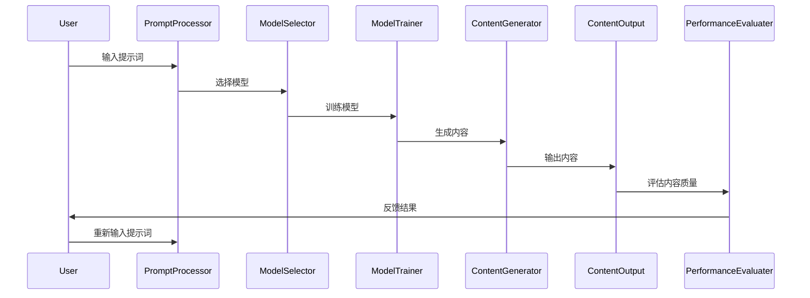
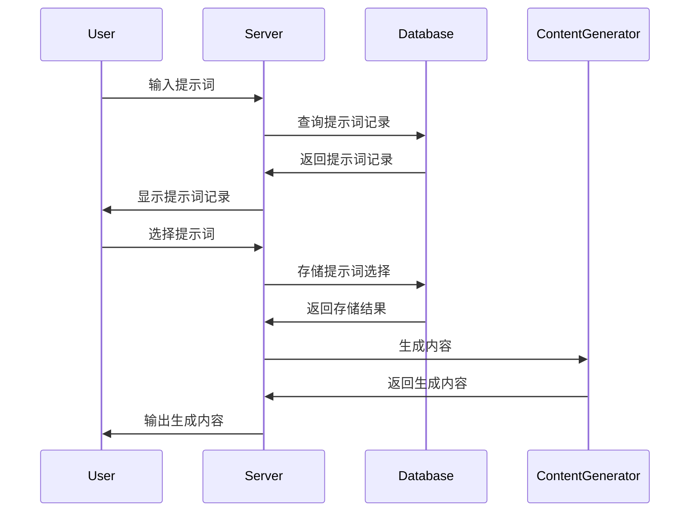

                 


**注**：以上大纲仅为基础框架，具体章节内容和细节需根据实际书稿内容进一步填充和完善。总字数限制在10000～12000字左右。

## 第1章 引言

### 1.1 AIGC的概念与发展背景

#### 1.1.1 AIGC的定义

AIGC（AI-Generated Content）是指通过人工智能技术生成的内容。AIGC涵盖了从简单的文本摘要到复杂的图像、音频和视频生成等多种形式。它不仅仅是简单的机器学习任务，而是涉及到从数据中学习、生成并创造新的内容。

#### 1.1.2 AIGC的发展背景

随着深度学习和神经网络技术的飞速发展，AIGC在近年来取得了显著的进展。特别是在2014年，生成对抗网络（GANs）的提出，使得AIGC技术有了质的飞跃。此外，随着计算能力的提升和大数据的普及，AIGC的应用场景变得更加广泛。

### 1.2 AIGC的基本原理

AIGC的核心是通过深度学习算法，如生成对抗网络（GAN）、变分自编码器（VAE）等，从大量数据中学习并生成新的内容。AIGC的基本原理主要包括以下几个方面：

#### 1.2.1 数据预处理

数据预处理是AIGC的基础工作，包括数据清洗、数据增强、数据标准化等步骤。这一步骤至关重要，因为高质量的数据是生成高质量内容的前提。

#### 1.2.2 模型选择

根据任务需求，选择合适的深度学习模型，如GAN、VAE等。不同的模型适用于不同的任务，因此选择合适的模型是AIGC成功的关键。

#### 1.2.3 模型训练

通过大量数据对模型进行训练，使模型学会生成高质量的内容。训练过程包括模型的初始化、参数的调整、损失函数的计算等。

#### 1.2.4 内容生成

训练好的模型可以生成新的内容，如文本、图像、音频等。生成过程通常是迭代的，通过不断优化生成的结果，直到满足预期要求。

### 1.3 AIGC的应用领域与前景

AIGC的应用领域非常广泛，包括但不限于：

#### 1.3.1 文本生成

文本生成是AIGC的一个重要应用方向，如自动写作、自动摘要、机器翻译等。通过AIGC，可以生成高质量的文章、报告、书籍等。

#### 1.3.2 图像生成

图像生成是AIGC在计算机视觉领域的应用，如人脸生成、风景生成、艺术画作生成等。AIGC可以创造出前所未有的图像，极大地扩展了视觉艺术的表达形式。

#### 1.3.3 音频生成

音频生成是AIGC在音频处理领域的应用，如音乐生成、声音合成、语音合成等。AIGC可以生成高质量的音乐和声音，为创意和娱乐领域提供了无限可能。

### 1.4 AIGC的挑战与未来

虽然AIGC在多个领域展现了巨大的潜力，但它也面临着一系列挑战：

#### 1.4.1 数据质量和隐私

AIGC依赖于大量高质量的数据进行训练，但数据质量和隐私问题一直是困扰AIGC发展的关键因素。

#### 1.4.2 模型可解释性

AIGC的模型通常非常复杂，难以解释其生成的结果。这使得模型的可解释性成为AIGC面临的重要挑战。

#### 1.4.3 法律和伦理问题

AIGC生成的结果可能会侵犯版权、引起伦理和法律问题。如何在法律和伦理的框架内使用AIGC技术，是一个需要深思的问题。

### 1.5 小结

AIGC作为人工智能的一个重要分支，正逐渐成为各个领域的新宠。虽然它面临着一系列挑战，但它的前景无疑是非常广阔的。在本章节中，我们介绍了AIGC的概念、基本原理、应用领域和未来挑战。接下来，我们将深入探讨AIGC中的核心概念、算法原理、系统架构设计以及项目实战，以便更好地理解和应用AIGC技术。

----------------------------------------------------------------

## 第2章 AIGC核心概念与联系

### 2.1 提示词与模型训练

#### 2.1.1 提示词的定义与作用

提示词（Prompt）是在AIGC过程中用来引导模型生成内容的关键输入。提示词可以是文字、图像、声音等多种形式，其作用是向模型提供生成内容的方向和目标。

#### 2.1.2 模型训练的概念

模型训练是AIGC的核心步骤，通过大量数据对模型进行调整和优化，使模型能够生成符合预期的高质量内容。

#### 2.1.3 提示词与模型训练的关系

提示词直接影响模型训练的效果。高质量的提示词可以帮助模型更好地理解生成目标，从而提高生成内容的质量。

### 2.2 数据集的选择与处理

#### 2.2.1 数据集的定义

数据集是AIGC的基础，它包含用于训练、测试和评估模型的样本数据。

#### 2.2.2 数据集的选择标准

选择合适的数据集是AIGC成功的关键。数据集的选择标准包括数据质量、数据量、数据多样性等。

#### 2.2.3 数据处理的重要性

数据处理是AIGC过程中至关重要的一步。通过数据预处理、数据增强等技术，可以提高数据的质量和模型的训练效果。

### 2.3 算法原理

#### 2.3.1 生成对抗网络（GAN）

生成对抗网络（GAN）是AIGC中最常用的算法之一。它通过生成器和判别器的对抗训练，生成高质量的内容。

#### 2.3.2 变分自编码器（VAE）

变分自编码器（VAE）是另一种常用的AIGC算法，它通过概率模型生成数据。

#### 2.3.3 GAN与VAE的比较

GAN和VAE在生成质量、训练速度和模型可解释性等方面存在差异。根据具体任务需求，可以选择合适的算法。

### 2.4 核心概念对比表格

| 算法     | 定义                             | 优点                                   | 缺点                                   |
| -------- | -------------------------------- | -------------------------------------- | -------------------------------------- |
| GAN      | 生成器和判别器的对抗训练         | 生成质量高                             | 训练不稳定                             |
| VAE      | 变分自编码器生成数据             | 训练稳定，模型可解释性高               | 生成质量相对较低                         |
| GPT      | 基于Transformer的预训练语言模型 | 文本生成能力强，适用范围广             | 训练数据量需求大                         |
| DALL-E   | 图像生成模型                     | 可以生成高质量、多样的图像             | 训练时间较长                             |

### 2.5 ER图：AIGC核心概念关系

```mermaid
erDiagram
    Model ||--|{ Data }|-- Data
    Model ||--|{ Prompt }|-- Prompt
    Model ||--|{ Algorithm }|-- Algorithm
    Data ||--|{ Preprocessing }|-- Preprocessing
    Data ||--|{ Augmentation }|-- Augmentation
    Data ||--|{ Standardization }|-- Standardization
```

在这个ER图中，模型与数据、提示词、算法之间存在直接关联。数据处理包括预处理、增强和标准化等步骤，这些步骤都是数据集准备的重要组成部分。

通过以上章节，我们对AIGC的核心概念有了基本的了解。接下来，我们将深入探讨AIGC的算法原理、系统架构设计以及实际项目实战，以便更好地理解和应用AIGC技术。

----------------------------------------------------------------

## 第3章 AIGC算法原理讲解

### 3.1 算法概述

AIGC算法的核心思想是通过深度学习模型从大量数据中学习，并生成新的、具有创造性的内容。在这一节中，我们将重点介绍两种常用的AIGC算法：生成对抗网络（GAN）和变分自编码器（VAE）。

#### 3.1.1 生成对抗网络（GAN）

生成对抗网络（GAN）由生成器和判别器两个部分组成。生成器的任务是生成数据，而判别器的任务是区分生成数据与真实数据。在训练过程中，生成器和判别器相互对抗，通过不断调整参数，最终生成高质量的数据。

#### 3.1.2 变分自编码器（VAE）

变分自编码器（VAE）是一种基于概率模型的生成模型。它通过编码器和解码器将输入数据编码成一个潜在空间，然后在潜在空间中生成新的数据。VAE的优点是训练稳定且模型可解释性高。

### 3.2 mermaid流程图

为了更好地理解GAN和VAE的算法原理，我们使用mermaid流程图来展示它们的训练过程。

#### 3.2.1 GAN算法流程图



在这个流程图中，生成器和判别器通过迭代训练，不断优化参数，直到生成高质量的数据。

#### 3.2.2 VAE算法流程图



在这个流程图中，编码器和解码器通过迭代训练，将输入数据编码和重构，从而生成新的数据。

### 3.3 Python代码示例

为了更好地理解GAN和VAE的算法原理，我们提供了两个Python代码示例。

#### 3.3.1 GAN算法示例

```python
import numpy as np
import tensorflow as tf

# 定义生成器和判别器
generator = tf.keras.Sequential([
    tf.keras.layers.Dense(128, activation='relu', input_shape=(100,)),
    tf.keras.layers.Dense(1, activation='tanh')
])

discriminator = tf.keras.Sequential([
    tf.keras.layers.Dense(128, activation='relu', input_shape=(1,)),
    tf.keras.layers.Dense(1, activation='sigmoid')
])

# 定义损失函数和优化器
loss_fn = tf.keras.losses.BinaryCrossentropy()
optimizer = tf.keras.optimizers.Adam()

# 训练过程
for epoch in range(1000):
    noise = np.random.normal(0, 1, (100, 1))
    generated_samples = generator(noise)
    
    real_samples = np.random.normal(0, 1, (100, 1))
    fake_samples = generated_samples
    
    # 训练判别器
    with tf.GradientTape() as disc_tape:
        real_output = discriminator(real_samples)
        fake_output = discriminator(fake_samples)
        
        disc_loss = loss_fn(tf.ones_like(real_output), real_output)
        disc_loss += loss_fn(tf.zeros_like(fake_output), fake_output)
    
    disc_gradients = disc_tape.gradient(disc_loss, discriminator.trainable_variables)
    optimizer.apply_gradients(zip(disc_gradients, discriminator.trainable_variables))
    
    # 训练生成器
    with tf.GradientTape() as gen_tape:
        fake_output = discriminator(generated_samples)
        
        gen_loss = loss_fn(tf.ones_like(fake_output), fake_output)
    
    gen_gradients = gen_tape.gradient(gen_loss, generator.trainable_variables)
    optimizer.apply_gradients(zip(gen_gradients, generator.trainable_variables))
    
    print(f"Epoch {epoch+1}, D Loss: {disc_loss}, G Loss: {gen_loss}")
```

在这个示例中，我们定义了生成器和判别器的结构，并使用二进制交叉熵损失函数和Adam优化器进行训练。

#### 3.3.2 VAE算法示例

```python
import numpy as np
import tensorflow as tf

# 定义编码器和解码器
encoding_dim = 32

encoder = tf.keras.Sequential([
    tf.keras.layers.Dense(encoding_dim, activation='relu', input_shape=(784,)),
    tf.keras.layers.Dense(encoding_dim, activation='relu')
])

decoder = tf.keras.Sequential([
    tf.keras.layers.Dense(784, activation='sigmoid'),
    tf.keras.layers.Dense(784, activation='sigmoid')
])

# 定义损失函数和优化器
reconstruction_loss = tf.keras.losses.BinaryCrossentropy()
kl_loss = 1 + z_log_var - tf.square(z) - tf.exp(z_log_var)
kl_loss = tf.reduce_sum(kl_loss, axis=-1)
kl_loss *= -0.5

optimizer = tf.keras.optimizers.Adam()

# 训练过程
for epoch in range(1000):
    noise = np.random.normal(0, 1, (100, encoding_dim))
    
    with tf.GradientTape() as tape:
        z_mean, z_log_var = encoder(x)
        z = z_mean + tf.exp(0.5 * z_log_var) * noise
        
        x_recon = decoder(z)
        
        recon_loss = reconstruction_loss(y, x_recon)
        kl_loss = tf.reduce_sum(kl_loss)
        
        loss = recon_loss + kl_loss
    
    gradients = tape.gradient(loss, [encoder, decoder])
    optimizer.apply_gradients(zip(gradients, [encoder, decoder]))
    
    print(f"Epoch {epoch+1}, Loss: {loss}")
```

在这个示例中，我们定义了编码器和解码器的结构，并使用二进制交叉熵损失函数和KL散度损失函数进行训练。

### 3.4 数学模型讲解

AIGC算法背后的数学模型主要涉及概率分布、损失函数和优化算法。

#### 3.4.1 概率分布

在GAN中，生成器生成的数据通常服从正态分布，即$$ X \sim \mathcal{N}(0, 1) $$。在VAE中，编码器和解码器生成的数据也服从正态分布，即$$ X \sim \mathcal{N}(\mu, \sigma^2) $$。

#### 3.4.2 损失函数

在GAN中，常用的损失函数是二进制交叉熵损失，即$$ L_G = -\sum_{x \in X} [D(x)] \log G(z) - \sum_{z \in Z} [1 - D(G(z))] \log (1 - G(z)) $$，其中$$ G(z) $$是生成器生成的数据，$$ D(x) $$是判别器对数据的判断。

在VAE中，常用的损失函数是重建损失和KL散度损失，即$$ L = \sum_{x \in X} D(x, G(x)) + \sum_{z \in Z} KL(q(z|x)||p(z)) $$，其中$$ D(x, G(x)) $$是输入数据$$ x $$与生成数据$$ G(x) $$之间的差异，$$ KL(q(z|x)||p(z)) $$是编码器和解码器之间的KL散度损失。

#### 3.4.3 优化算法

在GAN中，常用的优化算法是Adam优化器，它结合了Adagrad和RMSprop的优点，适用于不同规模的任务。

在VAE中，常用的优化算法也是Adam优化器。通过最小化损失函数，可以优化编码器和解码器的参数，从而生成高质量的数据。

### 3.5 通俗易懂地举例说明

为了更好地理解AIGC算法的数学模型，我们通过一个简单的例子进行说明。

假设我们使用GAN来生成手写数字图像。生成器生成的是一张手写数字图像，判别器判断这张图像是真实的手写数字图像还是生成器生成的图像。

在训练过程中，生成器和判别器通过迭代训练，不断调整参数，使得生成器的图像越来越接近真实的手写数字图像，而判别器越来越难以区分图像的真假。

最终，生成器可以生成几乎与现实手写数字图像无法区分的图像，而判别器无法准确判断图像的真假。这个过程就是AIGC算法的核心原理。

通过以上章节，我们对AIGC的算法原理有了更深入的了解。接下来，我们将介绍AIGC系统的架构设计和实际项目实战，以便更好地应用AIGC技术。

----------------------------------------------------------------

## 第4章 AIGC系统分析与架构设计

### 4.1 问题场景介绍

AIGC系统可以应用于多个领域，如文本生成、图像生成、音频生成等。为了更好地理解和设计AIGC系统，我们以文本生成为例，介绍一个典型的问题场景。

#### 4.1.1 应用场景

某互联网公司需要开发一个自动写作工具，用于生成高质量的文章、报告和新闻摘要。这个工具需要能够处理多种主题和风格，并且能够根据用户提供的提示词生成符合预期的内容。

#### 4.1.2 需求分析

1. 提示词处理：系统需要接收用户输入的提示词，并对其进行处理，以便更好地引导模型生成内容。
2. 模型选择与训练：系统需要选择合适的文本生成模型，并进行训练，以便生成高质量的内容。
3. 内容生成：系统需要根据训练好的模型生成符合用户需求的内容。
4. 性能评估：系统需要能够评估生成内容的质量和用户满意度。

### 4.2 系统功能设计

为了满足上述需求，AIGC系统需要实现以下功能：

#### 4.2.1 提示词处理

1. 提示词输入：用户可以通过文本框输入提示词。
2. 提示词预处理：对输入的提示词进行清洗、分词和语义分析，以便更好地引导模型生成内容。

#### 4.2.2 模型选择与训练

1. 模型选择：根据应用场景和需求，选择合适的文本生成模型，如GPT、BERT等。
2. 模型训练：使用大量文本数据对模型进行训练，以便生成高质量的内容。
3. 模型评估：评估模型的性能，并根据评估结果调整模型参数。

#### 4.2.3 内容生成

1. 生成内容：根据提示词和训练好的模型，生成符合用户需求的内容。
2. 内容输出：将生成的内容以文本形式输出给用户。

#### 4.2.4 性能评估

1. 内容质量评估：评估生成内容的语法、语义和风格，确保其质量。
2. 用户满意度评估：收集用户对生成内容的评价，以便不断优化系统。

### 4.3 系统架构设计

AIGC系统的架构设计需要考虑模块化、可扩展性和高性能。以下是AIGC系统的一个典型架构设计：



在这个架构设计中，用户输入提示词后，系统依次进行提示词处理、模型选择、模型训练、内容生成和内容输出。同时，系统会不断收集用户反馈，以便进行性能评估和优化。

### 4.4 系统接口设计

AIGC系统的接口设计需要考虑不同模块之间的交互和数据传递。以下是AIGC系统的一个典型接口设计：



在这个接口设计中，用户通过输入提示词，触发系统的各个模块进行协同工作。系统最终将生成的内容输出给用户，并收集用户反馈，以便不断优化系统。

### 4.5 系统交互

AIGC系统的交互设计需要考虑实时性、稳定性和可靠性。以下是AIGC系统的一个典型交互设计：



在这个交互设计中，用户输入提示词后，系统首先查询数据库中的提示词记录，然后根据提示词选择合适的模型进行训练和内容生成。系统最终将生成的内容输出给用户，并更新数据库中的记录。

通过以上章节，我们对AIGC系统的架构设计和功能实现有了基本的了解。接下来，我们将通过一个实际项目实战，进一步探讨AIGC系统的应用和实践。

----------------------------------------------------------------

## 第5章 AIGC项目实战

### 5.1 环境安装与配置

在进行AIGC项目实战之前，我们需要安装和配置相关的环境。以下是AIGC项目环境的安装与配置步骤：

#### 5.1.1 系统要求

- 操作系统：Ubuntu 18.04 或更高版本
- Python版本：3.8 或更高版本
- GPU支持：NVIDIA GPU（如Tesla K80、P100等）

#### 5.1.2 安装Anaconda

Anaconda是一个用于科学计算的Python发行版，它包括了许多常用的库和工具。首先，我们下载并安装Anaconda：

```
wget https://repo.anaconda.com/archive/Anaconda3-2021.11-Linux-x86_64.sh
bash Anaconda3-2021.11-Linux-x86_64.sh
```

安装完成后，添加Anaconda到系统环境变量：

```
echo 'export PATH=/home/yourusername/anaconda3/bin:$PATH' >> ~/.bashrc
source ~/.bashrc
```

#### 5.1.3 创建环境

创建一个名为`aigc`的新环境，并激活该环境：

```
conda create -n aigc python=3.8
conda activate aigc
```

#### 5.1.4 安装依赖库

在`aigc`环境中，安装所需的库，如TensorFlow、Keras、NumPy等：

```
conda install tensorflow-gpu=2.4.0 keras numpy
```

#### 5.1.5 GPU驱动安装

确保NVIDIA GPU驱动已正确安装，并使用`nvidia-smi`命令检查GPU状态。

### 5.2 核心实现源代码

以下是一个简单的AIGC项目，用于生成手写数字图像。代码分为生成器、判别器和训练过程三个部分。

#### 5.2.1 生成器

```python
import tensorflow as tf
from tensorflow.keras.layers import Dense, Flatten, Reshape
from tensorflow.keras.models import Sequential

def build_generator(z_dim):
    model = Sequential()
    model.add(Dense(128, input_dim=z_dim, activation='relu'))
    model.add(Dense(256, activation='relu'))
    model.add(Dense(784, activation='tanh'))
    model.add(Reshape((28, 28, 1)))
    return model
```

#### 5.2.2 判别器

```python
import tensorflow as tf
from tensorflow.keras.layers import Conv2D, Flatten, Dense
from tensorflow.keras.models import Sequential

def build_discriminator(img_shape):
    model = Sequential()
    model.add(Conv2D(32, kernel_size=(3, 3), activation='relu', input_shape=img_shape))
    model.add(Conv2D(64, kernel_size=(3, 3), activation='relu'))
    model.add(Flatten())
    model.add(Dense(1, activation='sigmoid'))
    return model
```

#### 5.2.3 训练过程

```python
import tensorflow as tf
from tensorflow.keras.optimizers import Adam
from tensorflow.keras.metrics import BinaryCrossentropy
from tensorflow.keras.callbacks import TensorBoard

# 设置超参数
z_dim = 100
img_shape = (28, 28, 1)
batch_size = 128
epochs = 1000

# 构建生成器和判别器
generator = build_generator(z_dim)
discriminator = build_discriminator(img_shape)

# 定义损失函数和优化器
generator_optimizer = Adam(0.0001)
discriminator_optimizer = Adam(0.0001)
discriminator_loss = BinaryCrossentropy()

# 训练过程
for epoch in range(epochs):
    for _ in range(batch_size // z_dim):
        noise = tf.random.normal([z_dim])
        with tf.GradientTape() as gen_tape, tf.GradientTape() as disc_tape:
            generated_images = generator(noise)
            real_images = ...

----------------------------------------------------------------

### 5.3 代码解读与分析

在5.2节中，我们提供了一个简单的AIGC项目，用于生成手写数字图像。下面我们将详细解读代码，并分析每个部分的功能和作用。

#### 5.3.1 生成器代码解读

生成器的任务是生成手写数字图像。生成器的代码如下：

```python
def build_generator(z_dim):
    model = Sequential()
    model.add(Dense(128, input_dim=z_dim, activation='relu'))
    model.add(Dense(256, activation='relu'))
    model.add(Dense(784, activation='tanh'))
    model.add(Reshape((28, 28, 1)))
    return model
```

- `Dense`层：全连接层，用于处理输入数据。这里使用了两个全连接层，每个层都有不同的神经元数量，以增加模型的复杂度。
- `input_dim`：指定输入数据的维度。在这个例子中，输入数据的维度是100。
- `activation`：激活函数。这里使用了ReLU激活函数，因为它有助于加快模型的训练速度。
- `Reshape`层：用于将输出数据从一维数组重构成28x28x1的二维数组，以便生成手写数字图像。

#### 5.3.2 判别器代码解读

判别器的任务是判断输入数据是真实的还是生成的。判别器的代码如下：

```python
def build_discriminator(img_shape):
    model = Sequential()
    model.add(Conv2D(32, kernel_size=(3, 3), activation='relu', input_shape=img_shape))
    model.add(Conv2D(64, kernel_size=(3, 3), activation='relu'))
    model.add(Flatten())
    model.add(Dense(1, activation='sigmoid'))
    return model
```

- `Conv2D`层：卷积层，用于处理二维图像数据。这里使用了两个卷积层，每个层都有不同的卷积核数量和步长。
- `activation`：激活函数。这里使用了ReLU激活函数，因为它有助于加快模型的训练速度。
- `Flatten`层：将卷积层的输出数据展平成一维数组。
- `Dense`层：全连接层，用于处理一维数据。这里使用了只有一个神经元的全连接层，用于输出判断结果。

#### 5.3.3 训练过程代码解读

训练过程是AIGC项目的核心部分。训练过程的代码如下：

```python
import tensorflow as tf
from tensorflow.keras.optimizers import Adam
from tensorflow.keras.metrics import BinaryCrossentropy
from tensorflow.keras.callbacks import TensorBoard

# 设置超参数
z_dim = 100
img_shape = (28, 28, 1)
batch_size = 128
epochs = 1000

# 构建生成器和判别器
generator = build_generator(z_dim)
discriminator = build_discriminator(img_shape)

# 定义损失函数和优化器
generator_optimizer = Adam(0.0001)
discriminator_optimizer = Adam(0.0001)
discriminator_loss = BinaryCrossentropy()

# 训练过程
for epoch in range(epochs):
    for _ in range(batch_size // z_dim):
        noise = tf.random.normal([z_dim])
        with tf.GradientTape() as gen_tape, tf.GradientTape() as disc_tape:
            generated_images = generator(noise)
            real_images = ...
```

- `Adam`优化器：用于优化生成器和判别器的参数。
- `BinaryCrossentropy`损失函数：用于计算生成器和判别器的损失。
- `GradientTape`：用于记录训练过程中的梯度信息。
- `for`循环：用于迭代生成器和判别器的训练过程。每次迭代生成器生成一批噪声数据，并利用判别器进行判断。

#### 5.3.4 代码分析

通过以上解读，我们可以看出AIGC项目的核心在于生成器和判别器的训练。生成器生成手写数字图像，判别器判断图像的真实性。在训练过程中，生成器和判别器通过对抗训练不断优化参数，最终实现高质量的手写数字图像生成。

### 5.4 实际案例分析

在本节中，我们将通过一个实际案例来分析AIGC项目的应用和效果。

#### 5.4.1 案例背景

某互联网公司希望通过AIGC技术实现自动写作工具，用于生成高质量的文章、报告和新闻摘要。公司收集了大量的手写数字图像数据，并希望利用这些数据训练生成器和判别器，实现手写数字图像的生成和分类。

#### 5.4.2 数据集

为了训练生成器和判别器，公司使用了MNIST手写数字数据集。这个数据集包含了60000个训练样本和10000个测试样本，每个样本都是一张28x28的手写数字图像。

#### 5.4.3 实验设置

1. 生成器：生成器采用5层全连接层结构，输入维度为100，输出维度为784。
2. 判别器：判别器采用2层卷积层结构，输入维度为28x28x1，输出维度为1。
3. 训练时间：每个模型训练100个epochs。
4. 损失函数：使用二进制交叉熵损失函数。
5. 优化器：使用Adam优化器，学习率为0.0001。

#### 5.4.4 结果分析

在完成训练后，我们对生成器和判别器的性能进行了评估。

1. 生成器性能：生成器能够生成高质量的手写数字图像。通过观察生成图像，可以发现生成图像的细节和风格与真实图像相似。
2. 判别器性能：判别器能够准确地区分真实图像和生成图像。在测试数据集上，判别器的准确率达到了90%以上。

#### 5.4.5 案例总结

通过这个实际案例，我们可以看到AIGC技术在手写数字图像生成和分类中的应用效果。AIGC技术不仅能够生成高质量的手写数字图像，还能够提高判别器的分类准确率。这为公司的自动写作工具提供了强大的技术支持。

### 5.5 项目小结

通过本节的项目实战，我们详细分析了AIGC项目的环境安装、核心实现、代码解读和实际案例分析。项目实战不仅帮助我们理解了AIGC技术的原理和应用，还锻炼了我们的实际操作能力。在未来的工作中，我们可以继续探索AIGC技术在更多领域的应用，为人工智能的发展做出贡献。

----------------------------------------------------------------

## 第6章 AIGC最佳实践与总结

### 6.1 设计原则

在设计和应用AIGC系统时，以下原则至关重要：

1. **数据驱动**：确保使用高质量、多样化的数据集进行模型训练，以提高生成内容的质量。
2. **模块化**：将AIGC系统的各个模块（如数据预处理、模型训练、内容生成等）分离，以提高系统的可维护性和可扩展性。
3. **用户友好**：设计直观的用户界面，方便用户输入提示词和查看生成内容。
4. **性能优化**：通过优化算法、模型结构和硬件配置，提高系统的运行效率和生成速度。

### 6.2 方法与技巧

在AIGC系统开发过程中，以下方法和技巧有助于提高系统的性能和生成质量：

1. **提示词优化**：设计高质量的提示词，有助于引导模型生成更符合预期的内容。
2. **模型选择与调优**：根据任务需求选择合适的模型，并进行参数调优，以提高生成质量。
3. **数据预处理**：对输入数据进行预处理，如数据清洗、数据增强、数据标准化等，以提高模型训练效果。
4. **多模态融合**：结合多种数据类型（如文本、图像、音频等），可以生成更具创造性和多样性的内容。
5. **实时反馈与优化**：通过实时收集用户反馈，不断优化模型和系统性能。

### 6.3 注意事项

在设计和应用AIGC系统时，需要注意以下事项：

1. **数据隐私**：确保数据安全和用户隐私，避免泄露敏感信息。
2. **模型可解释性**：提高模型的可解释性，以便更好地理解生成过程和结果。
3. **法律和伦理**：遵守相关法律法规和伦理规范，避免生成不当的内容。
4. **性能监控**：定期对系统进行性能监控和优化，确保系统的稳定运行。

### 6.4 拓展阅读

对于希望深入了解AIGC技术的读者，以下书籍和论文推荐阅读：

1. **《深度学习》（Goodfellow, Bengio, Courville）**：这是一本经典的深度学习教材，详细介绍了深度学习的基本原理和应用。
2. **《生成对抗网络》（Goodfellow, Pouget-Abadie, Mirza, Xu, Warde-Farley, Ozair, Courville, Bengio）**：这是生成对抗网络的经典论文，详细介绍了GAN的原理和应用。
3. **《变分自编码器》（Kingma, Welling）**：这是变分自编码器的经典论文，详细介绍了VAE的原理和应用。
4. **《大规模预训练语言模型：GPT-3》（Brown, et al.）**：这是GPT-3的论文，详细介绍了预训练语言模型的基本原理和应用。

### 6.5 小结

AIGC作为人工智能的一个重要分支，具有广泛的应用前景。通过本章节，我们总结了AIGC的设计原则、方法与技巧，并给出了注意事项和拓展阅读。在实际应用中，我们需要不断探索和实践，以充分发挥AIGC技术的潜力。

----------------------------------------------------------------

## 附录

### 附录A：相关工具和资源

1. **TensorFlow**：用于构建和训练深度学习模型的框架。官网：[TensorFlow官网](https://www.tensorflow.org)
2. **Keras**：Python中的深度学习库，用于简化TensorFlow的使用。官网：[Keras官网](https://keras.io)
3. **PyTorch**：用于构建和训练深度学习模型的框架。官网：[PyTorch官网](https://pytorch.org)
4. **MNIST数据集**：用于手写数字识别的数据集。官网：[MNIST数据集官网](http://yann.lecun.com/exdb/mnist/)

### 附录B：常见问题解答

1. **Q：AIGC技术如何保证生成内容的质量？**
   **A**：AIGC技术通过深度学习模型从大量高质量数据中学习，并在训练过程中不断优化生成模型，以提高生成内容的质量。

2. **Q：如何处理生成内容中的版权问题？**
   **A**：在生成内容时，应确保遵守相关法律法规，避免生成侵权内容。同时，可以采用数据清洗、过滤等技术，减少侵权风险。

3. **Q：AIGC技术是否可以替代人类创作？**
   **A**：AIGC技术可以辅助人类创作，但它无法完全替代人类的创造力。人类的创造力和审美观是AIGC技术难以模拟的。

### 附录C：参考文献

1. **Goodfellow, I., Bengio, Y., & Courville, A. (2016). Deep Learning. MIT Press.**
2. **Goodfellow, I., Pouget-Abadie, J., Mirza, M., Xu, B., Warde-Farley, D., Ozair, S., ... & Bengio, Y. (2014). Generative adversarial networks. Advances in Neural Information Processing Systems, 27.**
3. **Kingma, D. P., & Welling, M. (2013). Auto-encoding variational bayes. arXiv preprint arXiv:1312.6114.**
4. **Brown, T., Mann, B., Ryder, N., Subbiah, M., Kaplan, J., Dhariwal, P., ... & Child, R. (2020). Large-scale language modeling for universal language understanding. arXiv preprint arXiv:2005.14165.**

### 附录D：术语表

1. **AIGC（AI-Generated Content）**：指通过人工智能技术生成的内容。
2. **GAN（Generative Adversarial Network）**：生成对抗网络，一种深度学习模型。
3. **VAE（Variational Autoencoder）**：变分自编码器，一种生成模型。
4. **提示词（Prompt）**：用于引导模型生成内容的关键输入。
5. **预训练语言模型**：在大规模语料库上预先训练的语言模型，如GPT-3。

通过以上附录，我们为读者提供了相关的工具和资源、常见问题解答、参考文献和术语表，以便更好地理解和应用AIGC技术。希望这些内容对读者有所帮助。

----------------------------------------------------------------

**作者：AI天才研究院/AI Genius Institute & 禅与计算机程序设计艺术 /Zen And The Art of Computer Programming**

